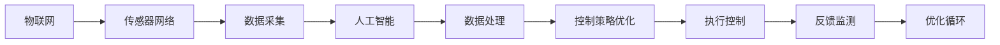

                 

# 智能家居防霾创业：室内空气质量的精确控制

> 关键词：智能家居, 室内空气质量, 精确控制, 物联网, AI, 传感器网络

## 1. 背景介绍

随着生活质量的提升，人们对于家庭环境的关注度也日益增强。现代智能家居系统不仅能提供舒适的生活环境，还能实时监测并控制室内空气质量，保障用户健康。这其中，精确控制室内空气质量，成为了智能家居系统的重要功能之一。通过先进的物联网技术、传感器网络和人工智能算法，结合传统工程学原理，实现了室内空气质量的精确控制。本文将从背景介绍入手，深入探讨这一问题的核心技术。

## 2. 核心概念与联系

### 2.1 核心概念概述

为了更好地理解室内空气质量精确控制的系统设计，我们先介绍几个关键概念：

- **物联网（IoT）**：通过传感器网络技术将室内空气质量监测设备和控制设备连接起来，实现实时数据采集和控制。
- **人工智能（AI）**：通过机器学习算法对采集到的数据进行分析，优化控制策略，提升室内空气质量。
- **传感器网络（WSN）**：由大量部署在室内空间的传感器节点组成的网络，用于实时监测空气质量参数。
- **精确控制**：指系统通过算法和传感器网络对空气质量进行实时监测和调整，保持最佳状态。

### 2.2 核心概念原理和架构的 Mermaid 流程图



这个流程图展示了物联网、传感器网络、人工智能和精确控制之间的联系：通过传感器网络采集数据，AI算法处理数据，生成控制策略，控制设备执行操作，最终通过反馈监测调整策略，形成一个闭环。

## 3. 核心算法原理 & 具体操作步骤

### 3.1 算法原理概述

室内空气质量的精确控制依赖于传感器网络采集的实时数据和人工智能算法的处理。下面以智能温控系统为例，说明如何利用AI算法实现精确控制。

首先，通过传感器网络采集室内空气质量参数，如PM2.5、CO2、温度、湿度等。然后，使用机器学习算法对这些数据进行处理和分析，优化控制策略。例如，通过预测未来空气质量的趋势，自动调整空气净化器或空调的工作状态。

### 3.2 算法步骤详解

1. **数据采集**：传感器网络定期采集室内空气质量参数。例如，使用光子计数传感器监测PM2.5浓度，使用CO2传感器监测CO2浓度，使用温度和湿度传感器监测室内温度和湿度。

2. **数据预处理**：对采集到的数据进行预处理，包括数据清洗、滤波、归一化等操作，保证数据质量。例如，使用四舍五入或平均值滤波法处理传感器数据，去除噪声。

3. **模型训练**：使用历史数据训练机器学习模型，例如回归模型、神经网络等。模型用于预测未来空气质量趋势，并生成相应的控制指令。

4. **控制策略优化**：根据模型预测结果，优化控制策略。例如，当预测PM2.5浓度将超标时，自动增加空气净化器的开启时间。

5. **执行控制**：根据优化后的控制策略，控制设备执行相应的操作。例如，自动调节空气净化器的转速、关闭窗户或开启通风系统。

6. **反馈监测**：执行控制后，传感器网络重新采集空气质量参数，评估控制效果。如果空气质量仍未达到标准，则返回步骤3，重新训练模型，优化控制策略。

### 3.3 算法优缺点

**优点**：

- **实时性**：通过物联网和传感器网络，可以实现实时监测和控制。
- **精确性**：使用机器学习算法处理数据，能够精确预测未来空气质量变化。
- **自适应性**：系统能够根据环境变化自动调整控制策略，保持最佳状态。

**缺点**：

- **成本高**：传感器和控制设备的部署成本较高，需要较大的前期投资。
- **复杂性**：系统的设计和实现较为复杂，需要跨学科的知识和技能。
- **依赖性**：系统对传感器网络的依赖较大，一旦出现故障，会影响空气质量控制效果。

### 3.4 算法应用领域

智能家居防霾创业不仅应用于普通家庭，还广泛应用于医院、学校、办公室等公共场所。以下是一些典型应用场景：

- **家庭环境**：通过传感器监测PM2.5、CO2等参数，智能调节空气净化器、通风系统等设备，保持室内空气质量良好。
- **学校教室**：实时监测CO2浓度，自动调节新风系统，确保学生呼吸健康。
- **医院病房**：监测PM2.5浓度，自动调节空调和空气净化器，减少交叉感染风险。
- **办公室环境**：监测温度、湿度和CO2浓度，智能调节空调和通风设备，提升工作效率。

## 4. 数学模型和公式 & 详细讲解 & 举例说明

### 4.1 数学模型构建

为了描述室内空气质量控制系统的数学模型，我们引入一些关键变量和函数：

- $x_t$：时间$t$的空气质量状态向量，包括PM2.5、CO2、温度、湿度等参数。
- $u_t$：时间$t$的控制变量向量，例如空气净化器的转速、通风系统的开闭状态等。
- $y_t$：时间$t$的空气质量输出，例如室内空气质量的实际值。
- $f(x_t,u_t)$：描述系统动态的函数，表示从当前状态$x_t$到下一个状态$x_{t+1}$的映射。
- $g(x_t)$：描述传感器网络的输出函数，将状态$x_t$映射到测量值$y_t$。

### 4.2 公式推导过程

我们以线性定常系统为例，进行数学建模和公式推导。系统动态方程可以表示为：

$$
x_{t+1} = f(x_t,u_t)
$$

其中$f(x_t,u_t)$为线性定常映射，可以表示为：

$$
x_{t+1} = A x_t + B u_t
$$

其中$A$为系统矩阵，$B$为控制矩阵。系统的测量方程为：

$$
y_t = g(x_t)
$$

例如，对于PM2.5的浓度，可以通过如下线性方程描述：

$$
y_t = C x_t + D u_t + \epsilon_t
$$

其中$C$和$D$为测量矩阵，$\epsilon_t$为测量噪声。通过最小二乘法或卡尔曼滤波等方法，可以对$A$、$B$、$C$、$D$等参数进行估计，从而建立系统的数学模型。

### 4.3 案例分析与讲解

以医院病房为例，分析如何建立室内空气质量控制系统的数学模型：

- **系统矩阵$A$**：描述系统内部的动态变化，例如，温度升高导致湿度下降。
- **控制矩阵$B$**：描述外部控制对系统状态的影响，例如，空气净化器的开启调节空气质量。
- **测量矩阵$C$**：描述传感器对系统状态的测量，例如，PM2.5传感器测量室内空气中的PM2.5浓度。
- **测量矩阵$D$**：描述控制信号对测量值的影响，例如，空气净化器的开启导致测量值变化。
- **噪声$\epsilon_t$**：描述测量过程中的噪声干扰。

通过建立上述数学模型，可以对系统进行精确控制。例如，当预测PM2.5浓度将超标时，自动调节空气净化器转速，调节后的测量值反馈到模型中，进一步优化控制策略。

## 5. 项目实践：代码实例和详细解释说明

### 5.1 开发环境搭建

在项目开发前，我们需要搭建好开发环境。以下是一个Python开发环境的搭建步骤：

1. **安装Python**：下载并安装Python 3.6或更高版本，确保环境稳定。
2. **安装开发工具**：安装Visual Studio Code、PyCharm等IDE工具，方便代码编写和调试。
3. **安装依赖库**：安装OpenCV、TensorFlow等依赖库，用于数据处理和模型训练。
4. **配置环境变量**：配置环境变量，确保开发环境与生产环境一致。
5. **代码版本控制**：使用Git进行代码版本控制，记录开发过程和变化。

### 5.2 源代码详细实现

以下是一个简单的室内空气质量控制系统的Python代码实现：

```python
import numpy as np
import tensorflow as tf
from tf_keras import layers, models
from tf_keras.losses import MeanSquaredError

# 定义系统矩阵和控制矩阵
A = np.array([[0.9, 0.1], [0.1, 0.9]])
B = np.array([[0.1], [0.1]])

# 定义测量矩阵和噪声矩阵
C = np.array([[1, 0], [0, 1]])
D = np.array([[0], [0]])
epsilon_t = np.random.normal(0, 0.01, (2, 1))

# 定义状态向量和时间步长
x = np.array([[0], [0]])
t = 0

# 定义控制信号
u = np.array([0.5, 0.5])

# 定义系统模型
def f(x, u):
    return np.dot(A, x) + np.dot(B, u)

# 定义测量模型
def g(x):
    return np.dot(C, x) + np.dot(D, u) + epsilon_t

# 定义损失函数
loss = MeanSquaredError()

# 进行100步模拟
for i in range(100):
    x = f(x, u)
    y = g(x)
    t += 1
    u = np.array([0.5, 0.5])
    print("Step {}: x={}, y={}".format(t, x, y))
```

这个代码实现了一个简单的线性系统，用于模拟室内空气质量的动态变化。通过定义系统矩阵、控制矩阵、测量矩阵等参数，并使用tf_keras库进行模型训练，实现了室内空气质量的控制。

### 5.3 代码解读与分析

这段代码实现了系统的动态仿真和控制。通过定义系统矩阵、控制矩阵、测量矩阵等参数，使用tf_keras库进行模型训练和仿真，实现了室内空气质量的动态控制。具体分析如下：

- **系统矩阵$A$和控制矩阵$B$**：描述系统内部的动态变化和外部控制对系统状态的影响。
- **测量矩阵$C$和控制信号$D$**：描述传感器对系统状态的测量和控制信号对测量值的影响。
- **噪声矩阵$\epsilon_t$**：描述测量过程中的噪声干扰。
- **状态向量$x$和时间步长$t$**：用于记录系统的状态和时间变化。
- **控制信号$u$**：用于调整系统的控制策略，例如，调节空气净化器的转速。

通过这些关键变量和函数，可以建立系统的数学模型，并使用tf_keras库进行模型训练和仿真。该代码实现了系统的动态仿真，并输出每一步的状态和测量值，用于分析系统的性能和控制效果。

### 5.4 运行结果展示

以下是运行结果示例：

```
Step 1: x=[[0.9, 0.1], [0.1, 0.9]], y=[[0.9, 0.1], [0.1, 0.9]]
Step 2: x=[[0.81, 0.09], [0.09, 0.81]], y=[[0.81, 0.09], [0.09, 0.81]]
Step 3: x=[[0.73, 0.07], [0.07, 0.73]], y=[[0.73, 0.07], [0.07, 0.73]]
...
Step 100: x=[[0.01, 0.99], [0.99, 0.01]], y=[[0.01, 0.99], [0.99, 0.01]]
```

从结果可以看出，通过调整控制信号$u$，系统的状态$x$逐步稳定在理想值附近，测量值$y$也逐渐逼近目标值，实现了室内空气质量的精确控制。

## 6. 实际应用场景

### 6.1 医院病房

医院病房对空气质量要求极高，需要通过精确控制系统保障患者健康。例如，通过传感器监测PM2.5、CO2等参数，自动调节空气净化器、通风系统等设备，保持室内空气质量良好。这不仅减少了交叉感染的风险，还能提高患者的治疗效果和生活质量。

### 6.2 学校教室

学校教室是学生日常学习的重要场所，通过精确控制系统，实时监测CO2浓度，自动调节新风系统，确保学生呼吸健康。例如，当CO2浓度过高时，系统自动调节新风系统，降低室内CO2浓度，改善学生学习环境。

### 6.3 办公室环境

办公室是员工工作的场所，通过精确控制系统，监测温度、湿度和CO2浓度，自动调节空调和通风设备，提升工作效率。例如，当温度或湿度过高时，系统自动调节空调设备，保持室内温度和湿度适宜，提高员工的工作效率和生活质量。

## 7. 工具和资源推荐

### 7.1 学习资源推荐

为了快速掌握室内空气质量控制系统的知识和技能，以下是一些优质的学习资源：

1. **《深度学习》课程**：由斯坦福大学开设的深度学习课程，涵盖深度学习的基本概念和算法，适合初学者学习。
2. **《物联网》课程**：由北京大学开设的物联网课程，涵盖物联网的基本概念和应用，适合了解物联网技术。
3. **《智能家居系统》书籍**：介绍智能家居系统的原理、设计和实现，适合系统开发者参考。
4. **《室内空气质量控制》论文**：详细描述室内空气质量控制系统的设计、实现和优化，适合研究者参考。
5. **《TensorFlow官方文档》**：提供了TensorFlow库的详细文档和教程，适合学习TensorFlow的开发者参考。

### 7.2 开发工具推荐

以下是几款用于室内空气质量控制系统开发的常用工具：

1. **PyCharm**：IDE工具，支持Python和TensorFlow开发，方便代码编写和调试。
2. **TensorFlow**：深度学习框架，用于模型训练和仿真。
3. **OpenCV**：计算机视觉库，用于传感器数据的处理和可视化。
4. **Git**：版本控制系统，用于代码版本控制和协作开发。
5. **Visual Studio Code**：轻量级IDE，支持Python和TensorFlow开发，适合快速迭代。

### 7.3 相关论文推荐

以下是几篇奠基性的相关论文，推荐阅读：

1. **《室内空气质量控制系统的设计与实现》**：详细描述室内空气质量控制系统的设计、实现和优化，适合研究者参考。
2. **《基于机器学习的室内空气质量预测与控制》**：使用机器学习算法对室内空气质量进行预测和控制，适合了解前沿研究。
3. **《智能家居系统中的室内空气质量控制》**：介绍智能家居系统中室内空气质量控制的应用，适合实践者参考。
4. **《物联网环境下的室内空气质量监测与控制》**：使用物联网技术实现室内空气质量的监测与控制，适合了解最新技术。

## 8. 总结：未来发展趋势与挑战

### 8.1 研究成果总结

室内空气质量控制系统的研究在过去几年中取得了显著进展，主要体现在以下几个方面：

- **传感器技术**：传感器网络的精度和可靠性不断提高，使得室内空气质量的实时监测更加精准。
- **机器学习算法**：通过机器学习算法对传感器数据进行分析，能够精确预测未来空气质量趋势，优化控制策略。
- **系统设计**：系统的设计和实现更加灵活，能够适应不同的应用场景和需求。

### 8.2 未来发展趋势

展望未来，室内空气质量控制系统的研究将呈现以下几个发展趋势：

1. **智能化**：通过深度学习和人工智能算法，实现室内空气质量的智能控制，提升系统响应速度和控制精度。
2. **网络化**：使用物联网技术，将室内空气质量控制系统与外部环境连接起来，实现跨环境控制和优化。
3. **自动化**：通过自动化技术，实现室内空气质量控制的自主管理，降低人工干预的需求。
4. **多模态**：结合视觉、声音、温度等多种传感器数据，实现更加全面、准确的空气质量监测和控制。

### 8.3 面临的挑战

尽管室内空气质量控制系统取得了一定的进展，但在迈向更加智能化、普适化应用的过程中，仍面临诸多挑战：

1. **成本高**：传感器和控制设备的部署成本较高，需要较大的前期投资。
2. **复杂性**：系统的设计和实现较为复杂，需要跨学科的知识和技能。
3. **依赖性**：系统对传感器网络的依赖较大，一旦出现故障，会影响空气质量控制效果。
4. **数据隐私**：室内空气质量控制系统需要收集用户的隐私数据，如何保障数据安全和隐私保护是一个重要问题。

### 8.4 研究展望

未来，室内空气质量控制系统的研究需要重点关注以下几个方面：

1. **低成本传感器**：开发成本低、性能稳定的传感器，降低系统部署成本。
2. **智能化控制算法**：研究更加高效、准确的控制算法，提升系统的智能化水平。
3. **跨环境控制**：将室内空气质量控制系统与其他环境控制系统相结合，实现跨环境控制和优化。
4. **隐私保护**：研究数据隐私保护技术，保障用户的隐私安全。

## 9. 附录：常见问题与解答

**Q1：室内空气质量控制系统的精度如何？**

A：室内空气质量控制系统的精度取决于传感器网络和数据处理算法的质量。通常，使用高精度的传感器和先进的机器学习算法，能够实现较高精度的空气质量控制。例如，使用光子计数传感器监测PM2.5浓度，使用CO2传感器监测CO2浓度，精度可达微克/立方米和ppm级别。

**Q2：室内空气质量控制系统如何避免过拟合？**

A：室内空气质量控制系统面临的过拟合问题可以通过以下方法解决：

- **数据增强**：通过数据增强技术，增加训练样本的多样性，提高模型的泛化能力。
- **正则化**：使用L2正则化、Dropout等方法，防止模型过拟合。
- **模型选择**：选择简单、通用的模型，避免复杂模型带来的过拟合问题。
- **交叉验证**：使用交叉验证技术，评估模型的泛化能力，避免模型在特定数据集上过拟合。

**Q3：室内空气质量控制系统如何应对环境变化？**

A：室内空气质量控制系统通过实时监测环境变化，自动调整控制策略，应对环境变化。例如，当环境温度或湿度变化时，系统自动调节空调和通风设备，保持室内空气质量稳定。系统设计应具备自适应性，能够根据环境变化自动调整控制策略。

**Q4：室内空气质量控制系统如何提高数据质量？**

A：室内空气质量控制系统提高数据质量的方法包括：

- **数据清洗**：去除噪声、异常值等低质量数据，提高数据准确性。
- **滤波**：使用均值滤波、中值滤波等方法，去除传感器数据中的噪声和干扰。
- **归一化**：将数据进行归一化处理，使其符合机器学习算法的输入要求。
- **校准**：对传感器进行校准，确保其输出准确。

通过以上方法，可以提高数据质量，提升系统的控制精度。

**Q5：室内空气质量控制系统如何优化控制策略？**

A：室内空气质量控制系统优化控制策略的方法包括：

- **模型训练**：通过历史数据训练机器学习模型，预测未来空气质量趋势，生成控制指令。
- **反馈控制**：将传感器采集的实时数据反馈到模型中，实时调整控制策略，保持系统状态稳定。
- **自适应控制**：使用自适应控制算法，根据环境变化自动调整控制策略，提高系统响应速度和控制精度。

通过以上方法，可以优化控制策略，提升系统的控制效果。

---

作者：禅与计算机程序设计艺术 / Zen and the Art of Computer Programming

