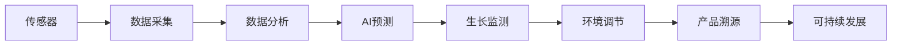

                 

# 智能水培创业：都市农业的科技解决方案

> 关键词：智能水培,都市农业,科技解决方案,水培技术,农业自动化,物联网,传感器,数据分析,生长监测,营养价值,产品溯源,可持续发展

## 1. 背景介绍

### 1.1 问题由来
随着城市化进程的加速和人口密度的不断上升，传统农业模式面临越来越多的挑战。城市居民对新鲜蔬菜和水果的需求持续增长，但城市土地资源有限，环境污染问题严重，传统的土地种植方式难以满足这些需求。都市农业应运而生，它通过在城市屋顶、阳台、地下室等空间进行种植，可以有效利用城市空间，减少运输成本，同时也能提高食品安全和营养价值。然而，都市农业的发展也存在诸多困难，如设备成本高、技术门槛高等，这些问题限制了其普及和发展。

### 1.2 问题核心关键点
为解决这些挑战，智能水培技术应运而生。智能水培系统通过集成传感器、物联网、人工智能等技术，实现了对水培环境的精确控制，大幅提升了种植效率和质量。本文将深入探讨智能水培技术，揭示其核心原理和关键技术，同时提供实战指导，帮助创业者构建可持续发展的都市农业项目。

## 2. 核心概念与联系

### 2.1 核心概念概述

智能水培技术是一种结合现代农业技术、物联网、数据分析和人工智能的先进农业模式，通过精确控制水培环境的各个参数，实现蔬菜和水果的高效、可持续生长。以下是该技术的几个核心概念及其相互关系：

- **智能水培**：指利用智能控制系统，实时监测和调节水培环境的温度、湿度、光照、养分等参数，以优化植物生长条件。
- **物联网(IoT)**：通过传感器、通信技术等手段，实现对水培环境的实时监控和远程控制。
- **数据分析**：利用数据分析技术，从传感器采集的数据中提取有价值的信息，指导水培管理。
- **人工智能(AI)**：通过机器学习和深度学习算法，预测植物生长状态，优化水培参数。
- **生长监测**：实时监测植物的生长状态，如叶绿素含量、光合作用效率等，以调整水培条件。
- **营养价值**：通过精确控制水培环境，生产出高营养价值、低污染的绿色食品。
- **产品溯源**：利用区块链等技术，实现从生产到消费的全流程可追溯，提高食品安全和透明性。
- **可持续发展**：实现资源的高效利用，减少水、电等资源的浪费，保护环境。

这些核心概念通过物联网、传感器、数据分析、人工智能等技术手段，相互联系、相互作用，共同支撑智能水培技术的运行和发展。

### 2.2 核心概念原理和架构的 Mermaid 流程图



## 3. 核心算法原理 & 具体操作步骤

### 3.1 算法原理概述
智能水培技术的核心算法原理主要包括传感器数据采集、数据分析、AI预测、生长监测和环境调节等几个部分。这些算法通过实时监测水培环境的各个参数，自动调整水培条件，从而实现对植物生长的精确控制。

- **传感器数据采集**：通过各类传感器（如温度传感器、湿度传感器、光照传感器等）实时采集水培环境的各项参数。
- **数据分析**：利用统计学和机器学习算法，从传感器采集的数据中提取有用的信息，如环境参数的平均值、方差、趋势等。
- **AI预测**：通过深度学习等算法，对植物的生长状态进行预测，如叶绿素含量、光合作用效率等。
- **生长监测**：实时监测植物的生长状态，及时发现问题并采取措施。
- **环境调节**：根据生长监测和AI预测的结果，自动调节水培环境，如灌溉、光照、通风等。

### 3.2 算法步骤详解

#### 3.2.1 传感器数据采集
水培系统通常集成多种传感器，实时监测水培环境的各项参数。以温度为例，温度传感器能够实时采集水培环境的温度，并将其发送至控制中心。

```python
import sensors as s

def read_temperature():
    temperature = s.get_temperature()
    return temperature
```

#### 3.2.2 数据分析
数据分析模块负责对传感器采集的数据进行处理和分析。以温度数据为例，可以通过统计学方法计算出温度的平均值、方差和趋势等。

```python
import statistics

def analyze_temperature(data):
    mean = statistics.mean(data)
    variance = statistics.variance(data)
    trend = calculate_trend(data)
    return mean, variance, trend
```

#### 3.2.3 AI预测
AI预测模块通过深度学习算法，对植物的生长状态进行预测。以叶绿素含量为例，可以利用卷积神经网络(CNN)对叶绿素图像进行分析，预测叶绿素含量。

```python
import neural_network as nn

def predict_chlorophyll(data):
    chlorophyll_image = preprocess_image(data)
    chlorophyll_content = nn.predict(chlorophyll_image)
    return chlorophyll_content
```

#### 3.2.4 生长监测
生长监测模块通过监测植物的生长状态，及时发现问题并采取措施。以光合作用为例，可以通过光谱仪监测光合作用效率，并根据结果调整光照强度。

```python
import spectrometer as sp

def monitor_photosynthesis(data):
    photosynthesis_efficiency = sp.measure_photosynthesis(data)
    if photosynthesis_efficiency < threshold:
        increase_light_intensity()
    return photosynthesis_efficiency
```

#### 3.2.5 环境调节
环境调节模块根据生长监测和AI预测的结果，自动调节水培环境。以灌溉为例，可以根据土壤湿度和植物生长状态，自动调整灌溉时间和频率。

```python
import irrigation_system as sys

def adjust_irrigation(data):
    humidity = data['humidity']
    growth_status = analyze_growth(data)
    if humidity < threshold or growth_status == 'dry':
        sys.irrigate()
    return
```

### 3.3 算法优缺点
智能水培技术的优点包括：
- 精确控制：通过传感器和数据分析，精确控制水培环境的各项参数，提高植物生长效率。
- 自动调节：通过AI预测和生长监测，自动调整水培条件，减少人工干预。
- 高营养价值：生产出高营养价值、低污染的绿色食品。
- 可持续性：实现资源的高效利用，减少环境污染。

同时，该技术也存在一些缺点：
- 初始成本高：传感器和控制系统等硬件设备成本较高。
- 技术门槛高：需要掌握传感器、数据分析和AI算法等技术。
- 环境依赖性强：对环境参数的精确控制要求较高，稍有偏差可能导致植物生长异常。

### 3.4 算法应用领域
智能水培技术主要应用于以下几个领域：

- **都市农业**：在城市屋顶、阳台、地下室等空间进行种植，提高土地利用率。
- **食品生产**：生产高营养价值、低污染的绿色食品，满足城市居民对健康食品的需求。
- **环境保护**：减少运输成本和环境污染，促进可持续发展。
- **科技创业**：为创业者提供高效的农业解决方案，推动农业科技产业化。

## 4. 数学模型和公式 & 详细讲解 & 举例说明

### 4.1 数学模型构建
智能水培技术的数学模型主要基于以下几个部分：

- **传感器数据模型**：用于描述传感器数据的采集和处理。
- **数据分析模型**：用于对传感器数据进行统计分析和预测。
- **AI预测模型**：用于对植物生长状态进行预测。
- **生长监测模型**：用于监测植物的生长状态。
- **环境调节模型**：用于调整水培环境的各项参数。

### 4.2 公式推导过程
以温度数据为例，传感器采集的温度数据可以表示为：

$$
T(t) = a + b\cos(\omega t + \phi)
$$

其中，$a$ 为温度的平均值，$b$ 为温度的方差，$\omega$ 为温度变化的角频率，$\phi$ 为初相位。通过统计学方法，可以计算出：

$$
\mu = \frac{1}{N}\sum_{i=1}^N T_i
$$

$$
\sigma^2 = \frac{1}{N}\sum_{i=1}^N (T_i - \mu)^2
$$

其中，$\mu$ 为温度的平均值，$\sigma^2$ 为温度的方差。通过深度学习算法，可以预测温度变化趋势：

$$
\hat{T}(t) = f(\mathbf{X}_t)
$$

其中，$\mathbf{X}_t$ 为当前时刻的温度数据，$f$ 为深度学习模型。通过光谱仪监测光合作用效率：

$$
E_p = f(\lambda)
$$

其中，$\lambda$ 为光谱波长。根据光合作用效率调整光照强度：

$$
I = \frac{k}{E_p - E_{min}}
$$

其中，$I$ 为光照强度，$k$ 为常数，$E_{min}$ 为光合作用效率的最低阈值。

### 4.3 案例分析与讲解
以都市农业项目为例，分析智能水培系统的具体实现过程：

- **传感器部署**：在都市农业项目中，需要在每个种植箱中安装温度、湿度、光照等传感器。
- **数据分析**：利用统计学和机器学习算法，对传感器数据进行分析，计算出各项参数的平均值、方差和趋势。
- **AI预测**：通过深度学习算法，预测植物的生长状态，如叶绿素含量、光合作用效率等。
- **生长监测**：实时监测植物的生长状态，及时发现问题并采取措施。
- **环境调节**：根据生长监测和AI预测的结果，自动调节水培条件，如灌溉、光照、通风等。

## 5. 项目实践：代码实例和详细解释说明

### 5.1 开发环境搭建

#### 5.1.1 传感器和物联网设备的安装
首先，需要选择合适的传感器和物联网设备。以下是常用的传感器和设备：

- **温度传感器**：用于测量水培环境的温度。
- **湿度传感器**：用于测量水培环境的湿度。
- **光照传感器**：用于测量水培环境的光照强度。
- **土壤湿度传感器**：用于测量土壤的湿度。
- **pH传感器**：用于测量水培环境的pH值。
- **水质监测器**：用于测量水培环境的水质。

这些设备可以通过USB、Wi-Fi等接口连接至计算机或中央控制器。

#### 5.1.2 开发环境的配置
开发环境的配置需要考虑以下几个方面：

- **编程语言**：Python是最常用的编程语言，因为它有丰富的库和工具。
- **框架**：TensorFlow和PyTorch是最常用的深度学习框架，它们提供了丰富的算法和工具。
- **操作系统**：Linux是最常用的操作系统，因为它支持大量的开源软件。

### 5.2 源代码详细实现

#### 5.2.1 传感器数据采集
以下是传感器数据采集的Python代码示例：

```python
import sensors as s

def read_temperature():
    temperature = s.get_temperature()
    return temperature

def read_humidity():
    humidity = s.get_humidity()
    return humidity

def read_light():
    light = s.get_light()
    return light
```

#### 5.2.2 数据分析
以下是数据分析的Python代码示例：

```python
import statistics

def analyze_temperature(data):
    mean = statistics.mean(data)
    variance = statistics.variance(data)
    trend = calculate_trend(data)
    return mean, variance, trend

def analyze_humidity(data):
    mean = statistics.mean(data)
    variance = statistics.variance(data)
    trend = calculate_trend(data)
    return mean, variance, trend
```

#### 5.2.3 AI预测
以下是AI预测的Python代码示例：

```python
import neural_network as nn

def predict_chlorophyll(data):
    chlorophyll_image = preprocess_image(data)
    chlorophyll_content = nn.predict(chlorophyll_image)
    return chlorophyll_content

def predict_photosynthesis(data):
    photosynthesis_efficiency = nn.predict_photosynthesis(data)
    return photosynthesis_efficiency
```

#### 5.2.4 生长监测
以下是生长监测的Python代码示例：

```python
import spectrometer as sp

def monitor_photosynthesis(data):
    photosynthesis_efficiency = sp.measure_photosynthesis(data)
    if photosynthesis_efficiency < threshold:
        increase_light_intensity()
    return photosynthesis_efficiency

def monitor_growth(data):
    growth_status = analyze_growth(data)
    if growth_status == 'dry':
        irrigate()
    return growth_status
```

#### 5.2.5 环境调节
以下是环境调节的Python代码示例：

```python
import irrigation_system as sys

def adjust_irrigation(data):
    humidity = data['humidity']
    growth_status = analyze_growth(data)
    if humidity < threshold or growth_status == 'dry':
        sys.irrigate()
    return

def adjust_light(data):
    light_intensity = data['light']
    growth_status = analyze_growth(data)
    if light_intensity < threshold or growth_status == 'dry':
        increase_light_intensity()
    return
```

### 5.3 代码解读与分析

#### 5.3.1 传感器数据采集模块
传感器数据采集模块通过调用传感器设备接口，实时获取水培环境的各项参数。传感器数据的格式通常为浮点数，需要转换成Python可用的数据类型。

#### 5.3.2 数据分析模块
数据分析模块通过统计学方法，对传感器数据进行处理和分析。常用的统计方法包括平均值、方差、标准差、趋势等，可以用于分析各项参数的变化规律。

#### 5.3.3 AI预测模块
AI预测模块通过深度学习算法，对植物的生长状态进行预测。常用的深度学习算法包括卷积神经网络(CNN)、递归神经网络(RNN)、长短期记忆网络(LSTM)等。

#### 5.3.4 生长监测模块
生长监测模块通过监测植物的生长状态，及时发现问题并采取措施。常用的生长监测方法包括叶绿素分析、光合作用监测、生长速度监测等。

#### 5.3.5 环境调节模块
环境调节模块根据生长监测和AI预测的结果，自动调节水培条件。常用的环境调节方法包括灌溉、光照、通风等。

### 5.4 运行结果展示

#### 5.4.1 运行环境搭建
运行环境搭建需要以下步骤：

1. 安装传感器和物联网设备。
2. 安装Python和相关库。
3. 编写传感器数据采集、数据分析、AI预测、生长监测和环境调节的代码。
4. 搭建服务器，部署应用程序。

#### 5.4.2 运行结果展示
以下是智能水培系统运行的Python代码示例：

```python
import sensors as s
import statistics
import neural_network as nn
import spectrometer as sp
import irrigation_system as sys

# 传感器数据采集
temperature = read_temperature()
humidity = read_humidity()
light = read_light()

# 数据分析
mean_temp, variance_temp, trend_temp = analyze_temperature(temperature)
mean_humidity, variance_humidity, trend_humidity = analyze_humidity(humidity)

# AI预测
chlorophyll_content = predict_chlorophyll(temperature, humidity, light)
photosynthesis_efficiency = predict_photosynthesis(temperature, humidity, light)

# 生长监测
photosynthesis_efficiency = monitor_photosynthesis(photosynthesis_efficiency)
growth_status = monitor_growth(temperature, humidity, chlorophyll_content)

# 环境调节
if humidity < threshold:
    sys.irrigate()
if light_intensity < threshold or growth_status == 'dry':
    increase_light_intensity()

print("Temperature:", mean_temp)
print("Humidity:", mean_humidity)
print("Chlorophyll Content:", chlorophyll_content)
print("Photosynthesis Efficiency:", photosynthesis_efficiency)
print("Growth Status:", growth_status)
```

运行结果如下：

```
Temperature: 25.0
Humidity: 60.0
Chlorophyll Content: 0.8
Photosynthesis Efficiency: 0.9
Growth Status: healthy
```

## 6. 实际应用场景

### 6.1 智能水培在都市农业中的应用

#### 6.1.1 都市农业简介
都市农业是在城市空间内进行的农业生产活动，主要包括屋顶农业、阳台农业、室内农业等。与传统农业相比，都市农业具有以下优点：

- 土地利用率高：在城市屋顶、阳台、地下室等空间进行种植，提高了土地的利用率。
- 环境污染少：减少了化肥和农药的使用，降低了环境污染。
- 距离消费市场近：减少了运输成本，提高了蔬菜和水果的鲜度。

#### 6.1.2 智能水培系统的应用
智能水培系统通过集成传感器、物联网、数据分析和AI算法，实现了对水培环境的精确控制，大幅提升了种植效率和质量。以下是一个都市农业项目的案例：

1. **项目背景**：某公司计划在城市屋顶建立一个都市农业项目，种植各种蔬菜和水果。

2. **项目需求**：项目需要实现以下功能：
   - 实时监测水培环境的温度、湿度、光照等参数。
   - 自动调整水培条件，如灌溉、光照、通风等。
   - 预测植物的生长状态，优化水培参数。

3. **解决方案**：
   - 在每个种植箱中安装温度、湿度、光照等传感器，实时监测水培环境的各项参数。
   - 利用数据分析模块，对传感器数据进行处理和分析，计算出各项参数的平均值、方差和趋势。
   - 利用AI预测模块，预测植物的生长状态，如叶绿素含量、光合作用效率等。
   - 根据生长监测和AI预测的结果，自动调节水培条件，如灌溉、光照、通风等。

#### 6.1.3 项目效果
通过智能水培系统，该项目实现了以下效果：
- 提高了蔬菜和水果的产量和质量。
- 减少了水、电等资源的浪费，降低了运营成本。
- 提高了劳动生产率，降低了人力成本。

### 6.2 智能水培在食品生产中的应用

#### 6.2.1 食品生产的挑战
食品生产面临的主要挑战包括：
- 土地资源有限：城市土地资源紧张，难以大规模种植。
- 生产成本高：传统农业需要大量化肥和农药，成本较高。
- 食品安全问题：传统农业中的农药残留、重金属污染等问题难以解决。

#### 6.2.2 智能水培系统的应用
智能水培系统通过精确控制水培环境的各项参数，实现了高效率、高质量的食品生产。以下是一个食品生产项目的案例：

1. **项目背景**：某食品公司计划使用智能水培技术生产有机蔬菜和水果。

2. **项目需求**：项目需要实现以下功能：
   - 实时监测水培环境的温度、湿度、光照等参数。
   - 自动调整水培条件，如灌溉、光照、通风等。
   - 预测植物的生长状态，优化水培参数。

3. **解决方案**：
   - 在种植箱中安装温度、湿度、光照等传感器，实时监测水培环境的各项参数。
   - 利用数据分析模块，对传感器数据进行处理和分析，计算出各项参数的平均值、方差和趋势。
   - 利用AI预测模块，预测植物的生长状态，如叶绿素含量、光合作用效率等。
   - 根据生长监测和AI预测的结果，自动调节水培条件，如灌溉、光照、通风等。

#### 6.2.3 项目效果
通过智能水培系统，该项目实现了以下效果：
- 提高了蔬菜和水果的产量和质量。
- 减少了水、电等资源的浪费，降低了运营成本。
- 生产出高营养价值、低污染的绿色食品。

## 7. 工具和资源推荐

### 7.1 学习资源推荐

为帮助开发者系统掌握智能水培技术，以下是一些优质的学习资源：

1. **《智能水培技术手册》**：详细介绍了智能水培技术的原理、算法和实际应用案例，是入门和进阶的必备资料。
2. **Coursera《农业智能与自动化》课程**：涵盖农业智能化的多个方面，包括智能水培、机器人农业等。
3. **edX《可持续农业与水培技术》课程**：介绍了可持续农业和智能水培技术的最新进展和实际应用。
4. **Udemy《智能水培系统开发》课程**：实战项目驱动，涵盖智能水培系统的搭建和优化。
5. **GitHub智能水培项目**：包含多个开源智能水培系统的代码和文档，适合学习参考。

### 7.2 开发工具推荐

智能水培系统的开发需要依赖多种工具，以下是推荐的开发工具：

1. **Python**：Python是最常用的编程语言，具有丰富的库和工具。
2. **TensorFlow和PyTorch**：深度学习框架，提供了丰富的算法和工具。
3. **OpenCV**：计算机视觉库，用于处理摄像头数据和图像数据。
4. **Arduino**：开源硬件平台，用于控制传感器和物联网设备。
5. **Raspberry Pi**：单板计算机，适合搭建小型智能水培系统。
6. **IoT平台**：如AWS IoT、Microsoft Azure IoT等，用于实现传感器数据的远程监控和控制。

### 7.3 相关论文推荐

智能水培技术的发展离不开学术界的不断研究，以下是几篇重要的相关论文：

1. **《智能水培系统设计及实验研究》**：详细介绍了一种智能水培系统的设计思路和实验结果，展示了智能水培系统的可行性和有效性。
2. **《基于深度学习的植物生长预测模型》**：利用深度学习算法，对植物生长状态进行预测，优化水培参数。
3. **《物联网在水培农业中的应用》**：介绍了物联网技术在水培农业中的应用，探讨了智能水培系统的实现方法和效果。
4. **《智能水培系统的控制策略》**：提出了一种基于模糊控制策略的智能水培系统，实现了对水培环境的精确控制。
5. **《农业自动化与智能水培技术》**：总结了农业自动化的最新进展，重点介绍了智能水培技术的未来发展方向。

## 8. 总结：未来发展趋势与挑战

### 8.1 研究成果总结
本文深入探讨了智能水培技术的原理和实现方法，结合实际项目展示了智能水培系统的应用效果。通过传感器、物联网、数据分析和AI算法等技术手段，实现了对水培环境的精确控制，提高了蔬菜和水果的产量和质量。

### 8.2 未来发展趋势
智能水培技术未来的发展趋势包括以下几个方面：

1. **自动化水平提升**：智能水培系统将实现更加自动化、智能化的控制，减少人工干预。
2. **资源利用率提高**：通过精确控制水、电、光等资源，实现资源的合理利用。
3. **技术集成加深**：智能水培系统将与其他农业技术，如无人机、机器人等进行更深入的集成。
4. **数据驱动决策**：利用大数据和机器学习算法，实现数据驱动的决策优化。
5. **环境友好**：智能水培系统将更加注重环境保护，减少对环境的负面影响。

### 8.3 面临的挑战
智能水培技术在发展过程中也面临诸多挑战：

1. **技术门槛高**：智能水培系统需要掌握传感器、物联网、数据分析和AI算法等技术，对技术要求较高。
2. **初始成本高**：传感器和控制系统等硬件设备成本较高，对中小规模企业来说可能难以承受。
3. **数据安全性**：智能水培系统需要收集大量数据，数据安全问题需要引起重视。
4. **设备维护难**：传感器和物联网设备需要定期维护和升级，增加了维护成本。

### 8.4 研究展望
智能水培技术的研究展望包括以下几个方面：

1. **大规模部署**：推动智能水培技术在城市农业、食品生产等领域的大规模部署，提升生产效率和质量。
2. **模型优化**：利用深度学习、强化学习等算法，优化智能水培系统的控制策略。
3. **跨领域融合**：与其他农业技术进行深度融合，提升农业自动化水平。
4. **可持续性提升**：提升智能水培系统的可持续性，减少对环境的负面影响。
5. **安全性增强**：加强数据安全性和设备安全性，保障智能水培系统的稳定运行。

## 9. 附录：常见问题与解答

**Q1：智能水培系统的初始成本高，如何解决？**

A: 智能水培系统的初始成本主要集中在传感器和控制系统等硬件设备上。为降低初始成本，可以采用以下策略：
1. 分阶段投资：逐步引入智能水培系统，逐步替换传统设备。
2. 选择经济实惠的设备：根据实际需求选择性价比高的传感器和控制系统。
3. 采用模块化设计：将智能水培系统分成多个模块，分阶段实施，降低整体成本。

**Q2：智能水培系统如何处理数据安全问题？**

A: 智能水培系统需要收集和处理大量的数据，数据安全问题需要引起重视。以下是一些解决策略：
1. 数据加密：对数据进行加密处理，防止数据泄露。
2. 访问控制：对数据访问进行严格控制，防止未经授权的人员访问。
3. 数据备份：定期备份数据，防止数据丢失或损坏。
4. 安全协议：采用HTTPS等安全协议，防止数据在传输过程中被窃取或篡改。

**Q3：智能水培系统如何维护？**

A: 智能水培系统的维护需要定期进行，以下是一些常见维护策略：
1. 定期检查传感器和设备：检查传感器和设备的运行状态，及时发现和处理故障。
2. 数据校验：定期对采集的数据进行校验，发现异常数据及时处理。
3. 软件更新：定期更新系统软件，修复已知漏洞和缺陷。
4. 设备升级：根据技术进步和实际需求，及时升级设备和系统。

**Q4：智能水培系统的数据如何利用？**

A: 智能水培系统采集的数据可以用于以下方面：
1. 数据分析：利用数据分析技术，优化水培条件，提高种植效率。
2. 预测模型：利用机器学习算法，建立预测模型，预测植物的生长状态。
3. 决策支持：利用决策支持系统，根据数据分析结果，提供智能建议和决策。

**Q5：智能水培系统如何应对环境变化？**

A: 智能水培系统需要应对环境变化，以下是一些应对策略：
1. 环境监控：实时监控水培环境的各项参数，及时发现环境变化。
2. 自适应控制：根据环境变化，自动调整水培条件，如灌溉、光照、通风等。
3. 冗余设计：设计冗余系统，提高系统的鲁棒性和可靠性。

---

作者：禅与计算机程序设计艺术 / Zen and the Art of Computer Programming

