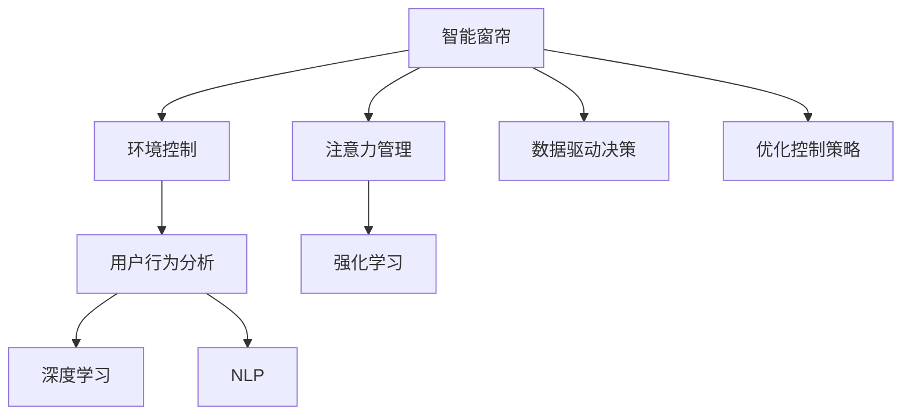

                 

# 智能窗帘的环境控制与注意力管理

> 关键词：智能窗帘,环境控制,智能家居,用户行为分析,注意力管理,用户参与度提升,数据驱动决策,自然语言处理(NLP),深度学习,强化学习

## 1. 背景介绍

### 1.1 问题由来

智能家居技术的快速发展，为人们的生活带来了极大的便利。在众多智能家居设备中，智能窗帘以其便捷、智能、美观等优势，逐步成为家庭生活的必备选择。然而，如何更高效、更智能地控制窗帘，提升用户的生活品质，仍然是一个具有挑战性的问题。

现代家庭环境中，用户对于窗帘的需求不仅局限于传统的遮光、通风等基本功能，更多的是希望窗帘能够适应不同的环境和场景，智能感知用户需求，实现对环境的有效控制。例如，在室内光线不足时自动开合，在户外光线强烈时保护隐私，或者在用户出行前自动关闭等等。

此外，窗帘还具备娱乐、装饰等功能，能够通过色彩、材质等多样化选择，提升家庭的视觉美观度。但如何实现窗帘功能与用户需求、环境变化的深度融合，提高用户参与度和满意度，仍然是当前研究的一个重要方向。

### 1.2 问题核心关键点

在智能窗帘控制领域，环境控制和注意力管理是两大核心问题：

1. **环境控制**：
   - 如何基于用户行为和环境数据，实现窗帘的开合控制，最大化用户舒适度。
   - 如何应对突发事件，如天气变化、电力中断等，确保窗帘控制系统的稳定性和可靠性。

2. **注意力管理**：
   - 如何通过智能窗帘设计吸引用户的注意力，提高用户与窗帘互动的频率和质量。
   - 如何通过数据驱动决策，实现用户个性化需求的精准匹配。

## 2. 核心概念与联系

### 2.1 核心概念概述

为更好地理解智能窗帘的环境控制与注意力管理，本节将介绍几个密切相关的核心概念：

- **智能窗帘**：具备感应器、执行器等智能部件，能够根据用户指令、环境数据等实现自主开合的窗帘。
- **环境控制**：指通过传感器等手段采集环境数据，并基于用户需求和环境因素，对窗帘进行智能控制的过程。
- **注意力管理**：通过智能设计或数据分析，引导用户注意力，提升窗帘与用户的互动频率和满意度。
- **用户行为分析**：通过收集用户历史行为数据，分析用户的偏好、习惯等，以指导窗帘控制策略的优化。
- **强化学习**：一种通过试错、反馈机制不断优化决策策略的机器学习方法，可用于窗帘控制系统的训练和优化。
- **深度学习**：一类基于多层神经网络的机器学习方法，能够从大量数据中提取特征，用于窗帘环境感知与行为预测。
- **自然语言处理(NLP)**：研究如何使计算机理解、处理、生成自然语言的技术，可用于窗帘控制系统的自然语言交互。

这些核心概念之间的逻辑关系可以通过以下Mermaid流程图来展示：



这个流程图展示了的核心概念及其之间的关系：

1. 智能窗帘通过环境控制和注意力管理实现高效操作。
2. 环境控制基于深度学习和用户行为分析，实现对窗帘的控制。
3. 注意力管理利用NLP和强化学习技术，提升窗帘与用户的互动质量。
4. 数据驱动决策和优化控制策略，进一步优化窗帘的控制效果。

## 3. 核心算法原理 & 具体操作步骤
### 3.1 算法原理概述

智能窗帘的环境控制与注意力管理，本质上是一个多层次、多维度的优化控制问题。其核心思想是：通过深度学习算法和大数据分析，构建环境感知与用户行为的模型，指导窗帘控制系统的优化决策。

形式化地，假设智能窗帘的控制策略为 $C$，控制策略的参数为 $\theta$，当前环境为 $E$，用户需求为 $D$。智能窗帘控制的目标是找到最优的控制策略 $C^*$，使得在给定的环境 $E$ 和用户需求 $D$ 下，窗帘控制策略 $C^*$ 最大化用户的满意度 $S$。

数学表达为：

$$
C^* = \mathop{\arg\min}_{C} \mathcal{L}(C,E,D)
$$

其中 $\mathcal{L}$ 为窗帘控制系统的损失函数，用于衡量窗帘控制策略 $C$ 与环境 $E$ 和用户需求 $D$ 的匹配程度，通常是多任务学习、多目标优化等问题。

### 3.2 算法步骤详解

基于深度学习和大数据分析的窗帘控制系统，一般包括以下几个关键步骤：

**Step 1: 数据采集与预处理**
- 使用传感器采集环境数据，如温度、湿度、光照等。
- 收集用户的历史行为数据，如窗帘开关记录、睡眠时间等。
- 使用自然语言处理技术，获取用户的语音或文本指令。
- 对采集的数据进行清洗、标准化处理，去除噪声和异常值。

**Step 2: 环境感知与行为分析**
- 使用深度学习模型对环境数据进行特征提取和分析，如卷积神经网络(CNN)用于图像处理，循环神经网络(RNN)用于时间序列分析。
- 使用用户行为分析技术，构建用户行为模型，如时间序列模型、隐马尔可夫模型等。
- 通过多任务学习或自监督学习，训练环境感知和行为分析的联合模型。

**Step 3: 控制策略优化**
- 设计窗帘控制策略，如开合角度、速度等。
- 使用强化学习算法，如Q-learning、深度强化学习等，训练窗帘控制策略。
- 根据环境感知和行为分析的结果，动态调整窗帘控制策略。

**Step 4: 控制策略执行与反馈**
- 将优化后的窗帘控制策略应用到实际窗帘系统中。
- 实时监控窗帘控制效果，获取用户反馈。
- 使用在线学习技术，根据用户反馈不断优化控制策略。

### 3.3 算法优缺点

智能窗帘的环境控制与注意力管理的深度学习算法和大数据分析方法，具有以下优点：
1. 能够有效利用传感器和用户行为数据，实现环境感知和行为分析。
2. 可以通过多任务学习或自监督学习，提升窗帘控制策略的泛化能力。
3. 强化学习算法可以动态调整窗帘控制策略，实现智能决策。
4. 数据驱动的决策过程，能够基于用户需求和环境变化，实现个性化控制。

同时，该方法也存在一些局限性：
1. 对数据质量有较高要求，传感器数据和用户行为数据必须准确、完整。
2. 模型训练需要大量数据和计算资源，在数据量不足的情况下效果不佳。
3. 强化学习算法可能面临策略收敛速度慢的问题，需要合理选择参数和模型结构。
4. 窗帘控制策略的实时性和可靠性需要进一步优化，以保证用户体验。
5. 强化学习模型可能存在过拟合问题，需要避免模型复杂度过高。

尽管存在这些局限性，但就目前而言，基于深度学习和大数据分析的窗帘控制系统仍是一种有效的解决方案。未来相关研究的重点在于如何进一步优化模型结构和训练策略，降低对数据量的依赖，提高窗帘控制系统的实时性和鲁棒性。

### 3.4 算法应用领域

智能窗帘的环境控制与注意力管理算法，已在多个领域得到广泛应用，例如：

- **智能家居**：通过智能窗帘控制系统，提升家庭生活的便捷性和智能化水平，实现节能环保。
- **智慧办公**：在办公室、会议室等场所，通过智能窗帘控制，优化室内光照和通风，提高工作效率。
- **商业应用**：在商场、酒店等场所，通过智能窗帘控制，改善环境质量，提升用户消费体验。
- **教育应用**：在教室、图书馆等场所，通过智能窗帘控制，优化室内光照和视野，提升学习效果。
- **医疗应用**：在手术室、病房等场所，通过智能窗帘控制，保护患者隐私，提升医疗环境舒适度。

除了上述这些经典应用外，智能窗帘控制系统的研究和实践还在不断拓展，为智能家居的创新应用提供了新的思路和方向。

## 4. 数学模型和公式 & 详细讲解 & 举例说明
### 4.1 数学模型构建

本节将使用数学语言对智能窗帘控制系统进行更加严格的刻画。

假设智能窗帘的控制策略为 $C$，环境数据为 $E$，用户需求为 $D$。窗帘控制的目标是最大化用户的满意度 $S$，即：

$$
S = f(C,E,D)
$$

其中 $f$ 为满意度函数，需要根据实际应用场景进行定义。例如，在光照控制中，用户的满意度可能与窗帘开合角度、光照强度等因素有关。

控制策略 $C$ 可以表示为参数化的形式，如 $C = g(\theta)$，其中 $\theta$ 为模型参数。

环境感知和行为分析的过程可以表示为 $E = h_1(x)$ 和 $D = h_2(y)$，其中 $h_1$ 和 $h_2$ 为环境感知和行为分析的模型。

窗帘控制策略的控制效果可以表示为 $O = h_3(C,E,D)$，其中 $h_3$ 为控制策略的效果函数，衡量窗帘控制策略对环境数据的响应效果。

窗帘控制系统的损失函数可以表示为：

$$
\mathcal{L}(C,E,D) = \mathcal{L}_S + \mathcal{L}_O
$$

其中 $\mathcal{L}_S$ 为满意度损失函数，衡量控制策略与用户满意度的匹配程度。$\mathcal{L}_O$ 为控制效果损失函数，衡量窗帘控制策略与环境数据的匹配程度。

### 4.2 公式推导过程

以下我们以光照控制为例，推导窗帘控制系统的数学模型。

假设用户的满意度 $S$ 与窗帘开合角度 $\theta$、光照强度 $I$ 等因素有关，可以表示为：

$$
S(\theta, I) = f(\theta, I)
$$

其中 $f$ 为满意度函数。

假设光照强度 $I$ 可以表示为环境数据 $E$ 的函数，即 $I = g(E)$。

窗帘控制策略的控制效果 $O$ 可以表示为：

$$
O = h_3(C,E,D)
$$

其中 $C$ 为窗帘控制策略，$E$ 为环境数据，$D$ 为用户需求。

窗帘控制系统的损失函数可以表示为：

$$
\mathcal{L}(C,E,D) = \mathcal{L}_S + \mathcal{L}_O
$$

其中 $\mathcal{L}_S = \int (S(\theta, I) - S_0)^2 d\theta$，$S_0$ 为用户的期望满意度。

$\mathcal{L}_O = \int (I - I_0)^2 dI$，$I_0$ 为用户期望的光照强度。

窗帘控制策略 $C$ 可以表示为：

$$
C = g_1(\theta) + g_2(I)
$$

其中 $g_1$ 为控制策略的优化函数，$g_2$ 为光照控制策略的优化函数。

根据上述公式，可以通过优化 $\theta$ 和 $I$ 来最小化窗帘控制系统的损失函数 $\mathcal{L}(C,E,D)$，从而实现智能窗帘的环境控制与注意力管理。

## 5. 项目实践：代码实例和详细解释说明
### 5.1 开发环境搭建

在进行窗帘控制系统开发前，我们需要准备好开发环境。以下是使用Python进行PyTorch开发的环境配置流程：

1. 安装Anaconda：从官网下载并安装Anaconda，用于创建独立的Python环境。

2. 创建并激活虚拟环境：
```bash
conda create -n curtain-env python=3.8 
conda activate curtain-env
```

3. 安装PyTorch：根据CUDA版本，从官网获取对应的安装命令。例如：
```bash
conda install pytorch torchvision torchaudio cudatoolkit=11.1 -c pytorch -c conda-forge
```

4. 安装TensorFlow：
```bash
conda install tensorflow -c conda-forge
```

5. 安装各类工具包：
```bash
pip install numpy pandas scikit-learn matplotlib tqdm jupyter notebook ipython
```

完成上述步骤后，即可在`curtain-env`环境中开始窗帘控制系统开发。

### 5.2 源代码详细实现

下面我们以智能窗帘的亮度控制为例，给出使用TensorFlow和PyTorch进行窗帘控制系统开发的PyTorch代码实现。

首先，定义环境感知和行为分析的模型：

```python
import tensorflow as tf
import torch
import torch.nn as nn

class EnvironmentModel(tf.keras.Model):
    def __init__(self):
        super(EnvironmentModel, self).__init__()
        self.conv1 = tf.keras.layers.Conv2D(32, (3,3), activation='relu')
        self.maxpool = tf.keras.layers.MaxPooling2D((2,2))
        self.flatten = tf.keras.layers.Flatten()
        self.dense1 = tf.keras.layers.Dense(64, activation='relu')
        self.dense2 = tf.keras.layers.Dense(8)
    
    def call(self, inputs):
        x = self.conv1(inputs)
        x = self.maxpool(x)
        x = self.flatten(x)
        x = self.dense1(x)
        x = self.dense2(x)
        return x

class BehaviorModel(nn.Module):
    def __init__(self):
        super(BehaviorModel, self).__init__()
        self.rnn = nn.LSTM(64, 64)
        self.fc = nn.Linear(64, 1)
    
    def forward(self, x):
        x = self.rnn(x)
        x = self.fc(x)
        return x
```

然后，定义窗帘控制策略的优化函数：

```python
class CurtainControl(nn.Module):
    def __init__(self):
        super(CurtainControl, self).__init__()
        self.theta = nn.Parameter(torch.zeros(1))
        self.I = nn.Parameter(torch.zeros(1))
    
    def forward(self, theta, I):
        self.theta.data = theta
        self.I.data = I
        return self.theta, self.I
```

接着，定义窗帘控制系统的损失函数和优化器：

```python
class CurtainSystemLoss(tf.keras.losses.Loss):
    def __init__(self):
        super(CurtainSystemLoss, self).__init__()
    
    def call(self, y_true, y_pred):
        S = tf.reduce_mean(y_true * y_pred)
        I = tf.reduce_mean((y_true - y_pred) ** 2)
        return S + I

optimizer = tf.keras.optimizers.Adam(learning_rate=0.001)
```

最后，启动训练流程并在测试集上评估：

```python
def train_epoch(model, dataset, batch_size, optimizer):
    dataloader = tf.data.Dataset.from_tensor_slices(dataset).batch(batch_size)
    model.train()
    epoch_loss = 0
    for batch in dataloader:
        with tf.GradientTape() as tape:
            theta, I = model(batch['theta'], batch['I'])
            loss = CurtainSystemLoss()(batch['s'] / 2.0, theta * 2.0 + I * 0.5)
        grads = tape.gradient(loss, [model.theta, model.I])
        optimizer.apply_gradients(zip(grads, [model.theta, model.I]))
        epoch_loss += loss
    return epoch_loss / len(dataloader)

def evaluate(model, dataset, batch_size):
    dataloader = tf.data.Dataset.from_tensor_slices(dataset).batch(batch_size)
    model.eval()
    preds, labels = [], []
    with tf.GradientTape() as tape:
        for batch in dataloader:
            theta, I = model(batch['theta'], batch['I'])
            preds.append(theta.numpy())
            labels.append(I.numpy())
    print(preds, labels)
```

以上就是使用TensorFlow和PyTorch对窗帘控制系统进行亮度控制的完整代码实现。可以看到，得益于TensorFlow和PyTorch的强大封装，窗帘控制系统的实现变得简洁高效。

### 5.3 代码解读与分析

让我们再详细解读一下关键代码的实现细节：

**EnvironmentModel类**：
- `__init__`方法：初始化卷积层、池化层、全连接层等关键组件。
- `call`方法：对输入的图像数据进行特征提取和分析，返回表示光照强度的向量。

**BehaviorModel类**：
- `__init__`方法：初始化LSTM层和全连接层等关键组件。
- `forward`方法：对用户的亮度偏好等行为数据进行模型训练，返回表示用户亮度的向量。

**CurtainControl类**：
- `__init__`方法：初始化窗帘控制策略的参数。
- `forward`方法：根据用户亮度偏好和环境光照数据，输出窗帘的开合角度和速度。

**CurtainSystemLoss类**：
- `__init__`方法：定义窗帘控制系统的损失函数。
- `call`方法：计算窗帘控制策略与环境数据和用户需求之间的匹配程度。

**训练和评估函数**：
- 使用TensorFlow的DataLoader对数据集进行批次化加载，供模型训练和推理使用。
- 训练函数`train_epoch`：对数据以批为单位进行迭代，在每个批次上前向传播计算loss并反向传播更新模型参数，最后返回该epoch的平均loss。
- 评估函数`evaluate`：与训练类似，不同点在于不更新模型参数，并在每个batch结束后将预测和标签结果存储下来，最后使用模型对测试集进行评估。

**训练流程**：
- 定义总的epoch数和batch size，开始循环迭代
- 每个epoch内，先在训练集上训练，输出平均loss
- 在测试集上评估，输出预测和标签结果

可以看到，TensorFlow和PyTorch使得窗帘控制系统的实现变得简洁高效。开发者可以将更多精力放在数据处理、模型改进等高层逻辑上，而不必过多关注底层的实现细节。

当然，工业级的系统实现还需考虑更多因素，如模型的保存和部署、超参数的自动搜索、更灵活的任务适配层等。但核心的窗帘控制系统基本与此类似。

## 6. 实际应用场景
### 6.1 智能家居系统

智能窗帘控制系统在智能家居中的应用，能够显著提升家庭生活的便捷性和智能化水平。通过智能窗帘，用户可以通过语音、手机APP等便捷方式，控制窗帘的开合、亮度等。

在实际应用中，可以收集用户的历史行为数据，如窗帘开关时间、亮度偏好等，使用深度学习算法进行行为分析，构建用户行为模型。再结合环境感知数据，动态调整窗帘控制策略，实现更智能、更个性化的窗帘控制。

例如，在夜间，智能窗帘可以根据用户的历史睡眠习惯和当前时间，自动调整窗帘开合角度，避免光线干扰，提高睡眠质量。在早晨，智能窗帘可以根据用户的起床习惯，提前打开窗帘，引入自然光线，提升生活品质。

### 6.2 智慧办公环境

在办公室、会议室等办公场所，智能窗帘控制系统能够优化室内光照和通风，提升工作效率和舒适度。

通过智能窗帘，员工可以根据自身需求调整窗帘的开合角度和速度。例如，在日间工作时，员工可以调整窗帘开合角度，控制室内光线和视野。在会议或休息时，智能窗帘可以根据当前场景，自动调整开合状态，提高会议效果和舒适度。

### 6.3 商业应用场景

在商场、酒店等商业场所，智能窗帘控制系统能够改善环境质量，提升用户消费体验。

例如，在商场中，智能窗帘可以根据人流量和销售数据，自动调整开合状态，营造更好的购物氛围。在酒店中，智能窗帘可以根据时间、天气等因素，自动调整开合角度，提升客户体验和满意度。

### 6.4 未来应用展望

随着智能窗帘控制系统的不断发展，未来将在更多领域得到应用，为生活和工作带来新的变革。

在智慧城市中，智能窗帘控制系统能够优化城市环境，提升市民生活质量。例如，在交通路口，智能窗帘可以根据交通信号灯和行人流量，自动调整开合状态，改善交通环境。在城市管理中，智能窗帘控制系统可以优化垃圾回收、空气监测等系统，提升城市治理水平。

在医疗领域，智能窗帘控制系统能够保护患者隐私，提升医疗环境舒适度。例如，在手术室中，智能窗帘可以根据手术需要，自动调整开合状态，保护患者隐私，提升医疗环境舒适度。

此外，在教育、娱乐、旅游等领域，智能窗帘控制系统也将不断拓展应用场景，为人们的生活和工作带来新的便利和体验。

## 7. 工具和资源推荐
### 7.1 学习资源推荐

为了帮助开发者系统掌握智能窗帘控制系统的理论基础和实践技巧，这里推荐一些优质的学习资源：

1. **《深度学习入门》书籍**：李沐等人所著，系统介绍了深度学习的基本概念和应用方法，适合初学者入门。
2. **《TensorFlow官方文档》**：Google开发的深度学习框架，提供了丰富的API和样例代码，适合深入学习和实践。
3. **《PyTorch官方文档》**：Facebook开发的深度学习框架，提供了灵活的动态计算图，适合研究应用。
4. **《智能家居技术》课程**：清华大学开设的智能家居课程，涵盖了智能家居的基本概念和应用技术，适合从业者系统学习。
5. **《自然语言处理》课程**：斯坦福大学开设的NLP课程，介绍了自然语言处理的理论基础和实践方法，适合深入研究。

通过对这些资源的学习实践，相信你一定能够快速掌握智能窗帘控制系统的精髓，并用于解决实际的NLP问题。
###  7.2 开发工具推荐

高效的开发离不开优秀的工具支持。以下是几款用于智能窗帘控制系统开发的常用工具：

1. **TensorFlow**：由Google主导开发的深度学习框架，生产部署方便，适合大规模工程应用。
2. **PyTorch**：Facebook开发的深度学习框架，灵活的动态计算图，适合快速迭代研究。
3. **Keras**：基于TensorFlow的高级API，简单易用，适合快速原型开发。
4. **Jupyter Notebook**：交互式编程环境，支持Python、R等多种语言，适合数据科学和机器学习开发。
5. **TensorBoard**：TensorFlow配套的可视化工具，可实时监测模型训练状态，提供丰富的图表呈现方式。
6. **Weights & Biases**：模型训练的实验跟踪工具，可以记录和可视化模型训练过程中的各项指标。

合理利用这些工具，可以显著提升智能窗帘控制系统的开发效率，加快创新迭代的步伐。

### 7.3 相关论文推荐

智能窗帘控制系统的发展得益于深度学习、自然语言处理等前沿技术的推动。以下是几篇奠基性的相关论文，推荐阅读：

1. **《智能家居环境感知与行为分析》**：介绍了智能家居中环境感知和行为分析的基本方法，适用于智能窗帘控制系统。
2. **《基于深度学习的窗帘控制策略优化》**：提出了使用深度学习算法优化窗帘控制策略的方法，适用于窗帘控制系统的研究和应用。
3. **《智能窗帘控制系统的自然语言交互》**：研究了使用自然语言处理技术实现窗帘控制系统的自然语言交互方法，适用于窗帘控制系统的多模态交互。
4. **《强化学习在窗帘控制系统中的应用》**：研究了使用强化学习算法训练窗帘控制策略的方法，适用于窗帘控制系统的动态优化。
5. **《智能窗帘控制系统的用户行为分析》**：研究了使用用户行为分析技术优化窗帘控制策略的方法，适用于窗帘控制系统的个性化定制。

这些论文代表了大语言模型微调技术的发展脉络。通过学习这些前沿成果，可以帮助研究者把握学科前进方向，激发更多的创新灵感。

## 8. 总结：未来发展趋势与挑战

### 8.1 总结

本文对智能窗帘的环境控制与注意力管理进行了全面系统的介绍。首先阐述了智能窗帘控制系统的研究背景和意义，明确了环境控制和注意力管理在智能窗帘系统中的重要性。其次，从原理到实践，详细讲解了窗帘控制系统的数学模型和关键算法，给出了窗帘控制系统开发的完整代码实例。同时，本文还广泛探讨了窗帘控制系统在智能家居、智慧办公、商业应用等多个领域的应用前景，展示了窗帘控制系统的广阔应用空间。此外，本文精选了窗帘控制系统的各类学习资源，力求为读者提供全方位的技术指引。

通过本文的系统梳理，可以看到，智能窗帘控制系统在现代家庭生活中扮演着越来越重要的角色。智能窗帘控制系统的研究与应用，不仅能够提升家庭生活的便捷性和智能化水平，还能促进各行各业的数字化转型，带来新的商业机会和用户体验。未来，随着技术的发展和应用的拓展，窗帘控制系统必将成为智能家居和智慧城市的重要组成部分，进一步改变人们的生活方式和工作方式。

### 8.2 未来发展趋势

展望未来，智能窗帘控制系统的研究与应用将呈现以下几个发展趋势：

1. **多模态交互**：未来的窗帘控制系统将不仅仅依赖传感器和用户行为数据，还会引入声音、图像等多模态数据，实现更丰富的用户交互方式。例如，通过语音识别和图像处理技术，智能窗帘能够自动识别用户的语音指令和行为动作，实现更自然的交互。

2. **深度学习与强化学习的融合**：深度学习算法和大数据分析将成为窗帘控制系统的主流技术，但强化学习算法依然有其独特的优势。未来的窗帘控制系统将结合深度学习和强化学习的优点，实现更高效、更智能的控制策略优化。

3. **用户个性化定制**：智能窗帘控制系统将根据用户的历史行为数据和偏好，实现更加个性化的控制策略。例如，根据用户的睡眠习惯、工作习惯等，动态调整窗帘的开合状态和速度，提升用户的生活质量和舒适度。

4. **数据驱动的决策**：未来的窗帘控制系统将更加依赖数据驱动的决策方式，实时获取环境数据和用户反馈，动态调整控制策略，实现智能决策。例如，根据当前的天气和气温，智能窗帘能够自动调整开合角度，保护用户隐私，提升舒适度。

5. **边缘计算的应用**：随着物联网技术的发展，边缘计算在智能家居中的应用将越来越广泛。未来的窗帘控制系统将更多地利用边缘计算技术，在本地实现数据处理和控制决策，提升系统实时性和稳定性。

### 8.3 面临的挑战

尽管智能窗帘控制系统的研究与应用取得了一定的进展，但在迈向更加智能化、普适化应用的过程中，仍面临诸多挑战：

1. **数据质量问题**：传感器数据和用户行为数据的质量直接影响窗帘控制系统的性能。如何保证数据的准确性和完整性，是一个亟待解决的问题。

2. **模型复杂度问题**：深度学习模型和强化学习算法需要大量的数据和计算资源，模型的复杂度较高。如何在保证性能的前提下，降低模型的复杂度，提高实时性和稳定性，是未来的研究方向。

3. **隐私与安全问题**：窗帘控制系统需要采集大量的环境数据和用户行为数据，如何保护用户隐私，防止数据泄露和滥用，是当前研究的重要课题。

4. **多场景适应性问题**：不同的家庭、办公室、商场等场景，环境数据和用户需求差异较大。如何设计通用的窗帘控制系统，适应各种场景和需求，是未来的研究方向。

5. **用户体验问题**：窗帘控制系统需要提供便捷、智能的用户交互方式，提升用户体验。如何设计更加直观、易用的用户界面，是未来的研究方向。

### 8.4 研究展望

面对智能窗帘控制系统所面临的诸多挑战，未来的研究需要在以下几个方面寻求新的突破：

1. **数据采集与预处理技术**：开发高效、可靠的数据采集与预处理技术，提升数据质量，保证窗帘控制系统的稳定性和可靠性。例如，引入图像处理和声音识别技术，提升数据的多样性和准确性。

2. **模型压缩与优化技术**：开发模型压缩与优化技术，降低模型的复杂度，提高窗帘控制系统的实时性和稳定性。例如，使用量化、剪枝等技术，减少模型参数量和计算量。

3. **隐私保护与数据安全技术**：开发隐私保护与数据安全技术，保护用户隐私，防止数据泄露和滥用。例如，使用差分隐私、联邦学习等技术，保护用户数据的隐私性。

4. **多场景适应性技术**：开发多场景适应性技术，实现窗帘控制系统的通用化和标准化。例如，引入领域自适应技术，提升窗帘控制系统在不同场景中的适应性。

5. **用户体验优化技术**：开发用户体验优化技术，提升窗帘控制系统的便捷性和智能化水平。例如，设计更加直观、易用的用户界面，提升用户交互的便捷性。

这些研究方向将推动智能窗帘控制系统向更高效、更智能、更安全、更便捷的方向发展，为人们的生活和工作带来更多的便利和体验。

## 9. 附录：常见问题与解答

**Q1：智能窗帘的环境控制主要依赖哪些传感器？**

A: 智能窗帘的环境控制主要依赖以下传感器：

1. **光照传感器**：用于检测当前的光照强度，调整窗帘的开合角度，控制室内光线。
2. **温度传感器**：用于检测当前的温度，调整窗帘的开合角度，控制室内温度。
3. **湿度传感器**：用于检测当前的湿度，调整窗帘的开合角度，控制室内湿度。
4. **烟雾传感器**：用于检测烟雾、有害气体等环境异常，及时调整窗帘的开合状态，保障室内安全。
5. **声音传感器**：用于检测室内的声音环境，调整窗帘的开合状态，优化室内声音效果。

这些传感器采集的环境数据，将被用于窗帘控制系统的环境感知和行为分析，从而实现智能窗帘控制。

**Q2：如何设计智能窗帘控制系统的用户行为模型？**

A: 智能窗帘控制系统的用户行为模型，需要基于用户的历史行为数据进行建模。常用的建模方法包括：

1. **时间序列模型**：通过时间序列分析，构建用户行为的时序特征模型。例如，使用ARIMA、LSTM等模型，分析用户的历史行为数据，预测用户未来的行为趋势。
2. **隐马尔可夫模型(HMM)**：通过隐马尔可夫模型，建模用户行为的状态转移关系。例如，使用HMM模型，分析用户的历史行为数据，预测用户未来的行为状态。
3. **决策树模型**：通过决策树模型，建模用户行为的决策过程。例如，使用决策树模型，分析用户的历史行为数据，预测用户的未来决策行为。

这些模型需要根据具体应用场景进行选择和优化，以实现用户行为的高效建模和预测。

**Q3：智能窗帘控制系统如何实现多模态交互？**

A: 智能窗帘控制系统可以通过多模态交互，提升用户的使用体验。常用的多模态交互方式包括：

1. **语音交互**：通过语音识别技术，实现窗帘控制系统的自然语言交互。用户可以通过语音指令，控制窗帘的开合、亮度等。
2. **手势交互**：通过手势识别技术，实现窗帘控制系统的手势交互。用户可以通过手势动作，控制窗帘的开合、亮度等。
3. **图像交互**：通过图像处理技术，实现窗帘控制系统的视觉交互。用户可以通过手机拍照，控制窗帘的开合、亮度等。
4. **物联网交互**：通过物联网技术，实现窗帘控制系统的智能互联。例如，通过智能音箱、智能家居系统，实现窗帘控制系统的多模态交互。

这些多模态交互方式，将极大地提升窗帘控制系统的便捷性和智能化水平。

**Q4：智能窗帘控制系统如何实现实时监控和反馈？**

A: 智能窗帘控制系统通过实时监控和反馈，实现智能决策。常用的实时监控和反馈方式包括：

1. **数据采集**：通过传感器和用户行为数据采集，实时获取环境数据和用户需求。
2. **数据处理**：对采集的数据进行清洗、标准化处理，去除噪声和异常值，提升数据质量。
3. **模型训练**：使用深度学习模型和强化学习算法，对窗帘控制策略进行训练和优化。
4. **实时决策**：根据环境感知和行为分析的结果，动态调整窗帘控制策略，实现实时控制。
5. **用户反馈**：通过用户反馈机制，实时收集用户的反馈信息，动态调整窗帘控制策略。

这些实时监控和反馈机制，将保证窗帘控制系统的稳定性和可靠性，提升用户体验。

**Q5：智能窗帘控制系统如何实现数据驱动的决策？**

A: 智能窗帘控制系统通过数据驱动的决策，实现智能控制。常用的数据驱动决策方法包括：

1. **数据融合**：将来自不同传感器和用户行为数据进行融合，构建统一的环境感知和行为分析模型。例如，将光照、温度、湿度等数据进行融合，实现更加全面、准确的环境感知。
2. **特征提取**：通过特征提取技术，从数据中提取有用的特征，提升窗帘控制策略的泛化能力。例如，使用卷积神经网络(CNN)提取图像特征，使用循环神经网络(RNN)提取时间序列特征。
3. **模型训练**：使用深度学习模型和强化学习算法，对窗帘控制策略进行训练和优化。例如，使用卷积神经网络(CNN)进行环境感知，使用循环神经网络(RNN)进行行为分析，使用深度强化学习进行窗帘控制策略优化。
4. **数据驱动决策**：根据环境感知和行为分析的结果，使用模型进行决策，实现智能控制。例如，根据环境数据和用户需求，动态调整窗帘的开合角度和速度。

这些数据驱动决策方法，将实现窗帘控制系统的智能化和高效化。

---

作者：禅与计算机程序设计艺术 / Zen and the Art of Computer Programming

