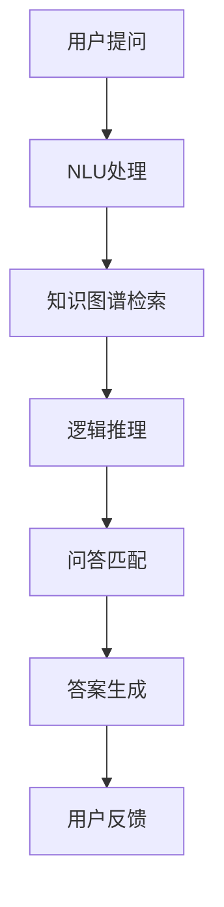

                 

# 智能问答系统的发展趋势

## 1. 背景介绍

智能问答系统(QA, Question Answering)旨在通过计算机自动回答用户提出的自然语言问题，从而模拟人类问答交互的智能交互体验。自20世纪60年代起，问答系统逐渐成为人工智能领域的一个重要研究方向。目前，智能问答系统已经在医疗、金融、教育、客服等多个垂直领域得到广泛应用，并不断拓展到社交、娱乐、智能家居等更多场景。然而，智能问答系统的技术瓶颈和应用挑战仍需深入研究和持续优化。

## 2. 核心概念与联系

### 2.1 核心概念概述

智能问答系统由以下几个关键组成部分构成：

- **自然语言理解(NLU, Natural Language Understanding)**：通过分词、命名实体识别、句法分析等技术，将自然语言文本转换为计算机可理解的结构化表示。
- **知识图谱(KG, Knowledge Graph)**：存储实体之间的语义关系，为问答系统提供结构化的事实知识基础。
- **逻辑推理**：基于知识图谱中的知识，结合语义推理、规则推理等技术，推导出问题的答案。
- **问答匹配**：通过比对问题与知识库中的实体关系，匹配并筛选出最相关的事实知识。
- **答案生成**：将推理得到的事实知识转化为自然语言形式，回答用户问题。

智能问答系统的技术栈包括语言模型、深度学习、自然语言处理、知识图谱构建和推理等。这些技术的不断进步，推动了问答系统的性能提升和应用范围拓展。

### 2.2 核心概念原理和架构的 Mermaid 流程图



这个流程图展示了智能问答系统的核心处理流程：用户提问先经过NLU处理，然后从知识图谱中检索相关知识，进行逻辑推理后匹配答案，最后生成回答并返回给用户。用户反馈信息可用于持续改进系统性能。

## 3. 核心算法原理 & 具体操作步骤

### 3.1 算法原理概述

基于深度学习的智能问答系统主要由两个关键部分组成：

1. **预训练语言模型**：通过大规模无标签文本数据预训练得到的语言模型，如BERT、GPT-3等，用于理解自然语言文本的语义。
2. **问答系统微调**：在预训练模型的基础上，通过有标签的问答数据对模型进行微调，学习问答任务相关的特定知识。

基于深度学习的智能问答系统的工作流程如下：

1. 用户输入自然语言问题。
2. 系统使用预训练语言模型对问题进行语义理解。
3. 系统从知识图谱中检索相关实体和关系。
4. 系统使用逻辑推理模型推导出答案。
5. 系统将推理结果转化为自然语言回答。

### 3.2 算法步骤详解

#### 3.2.1 数据准备

智能问答系统首先需要准备训练数据，包括问题、答案和实体关系三元组。数据来源包括结构化数据、半结构化数据和非结构化数据。结构化数据通常通过人工标注获取，半结构化数据和无结构化数据则通过自然语言处理技术自动标注。

#### 3.2.2 模型选择与构建

选择预训练语言模型作为基础框架，如BERT、GPT-2等。然后，根据问答任务设计问答模型，包括问答匹配器和推理器。问答匹配器通常使用注意力机制和序列编码器，如Transformers。推理器则可以根据需求选择不同的模型，如符号推理、逻辑推理等。

#### 3.2.3 模型微调

在预训练语言模型的基础上，对问答模型进行微调。微调过程包括：

1. 特征抽取层微调：使用问答训练数据微调预训练语言模型的特定层，提取与问答任务相关的语义特征。
2. 问答匹配器微调：使用问答训练数据微调匹配器，使其能够准确匹配问题和答案之间的关系。
3. 推理器微调：使用问答训练数据微调推理器，使其能够从知识图谱中推导出正确的答案。

#### 3.2.4 模型评估与优化

在微调完成后，使用测试数据对模型进行评估。评估指标包括准确率、召回率、F1值等。根据评估结果，调整模型结构和超参数，优化模型性能。

### 3.3 算法优缺点

#### 3.3.1 优点

1. **高性能**：基于深度学习的智能问答系统在理解自然语言、推理答案方面表现出色，特别是在处理复杂问答问题时，性能优于传统规则问答系统。
2. **广泛适用性**：智能问答系统适用于多种问答任务，包括医疗、金融、法律等领域，应用范围广泛。
3. **易于集成**：智能问答系统可以方便地集成到现有的信息系统中，如客服系统、医疗咨询系统等。

#### 3.3.2 缺点

1. **高昂的成本**：智能问答系统需要大量的标注数据和计算资源进行模型训练和微调，成本较高。
2. **数据依赖性强**：问答系统的性能很大程度上取决于数据的质量和数量，高质量的数据标注成本较高。
3. **鲁棒性不足**：在处理噪声数据和复杂问题时，问答系统的性能易受干扰，鲁棒性有待提高。
4. **可解释性差**：智能问答系统缺乏可解释性，难以解释其推理过程和决策逻辑。

### 3.4 算法应用领域

智能问答系统在多个垂直领域得到广泛应用，包括：

- **医疗**：辅助医生诊断、药物推荐、健康咨询等。
- **金融**：金融咨询、风险评估、投资建议等。
- **教育**：智能辅导、作业批改、课程推荐等。
- **客服**：自动应答、语音识别、情绪分析等。
- **法律**：合同分析、法律咨询、案件预判等。
- **旅游**：行程规划、景点推荐、旅行攻略等。

## 4. 数学模型和公式 & 详细讲解 & 举例说明

### 4.1 数学模型构建

智能问答系统通常采用如下数学模型：

1. **问题表示**：将用户问题表示为一个向量 $q \in \mathbb{R}^d$，其中 $d$ 为问题表示的维度。
2. **答案表示**：将答案表示为一个向量 $a \in \mathbb{R}^d$。
3. **匹配向量**：将问题与答案之间的语义关系表示为一个向量 $m \in \mathbb{R}^d$。

智能问答系统的目标是最小化问题与答案之间的匹配误差，即：

$$
\min_{q,a,m} \|q - a - m\|^2
$$

其中 $\| \cdot \|$ 表示向量范数。

### 4.2 公式推导过程

智能问答系统的核心公式包括：

1. **问题表示**：
   $$
   q = \text{Transformer}(x)
   $$
   其中 $x$ 表示用户问题的编码形式，$\text{Transformer}$ 表示预训练语言模型。

2. **答案表示**：
   $$
   a = \text{Transformer}(y)
   $$
   其中 $y$ 表示答案的编码形式。

3. **匹配向量**：
   $$
   m = W_q^T \text{Transformer}(z) + b_q
   $$
   其中 $W_q$ 为问题表示的线性变换矩阵，$b_q$ 为偏置向量，$\text{Transformer}(z)$ 表示知识图谱中与问题相关的事实三元组表示。

通过上述公式，可以将问题、答案和匹配向量表示为向量形式，并通过最小化向量范数，实现问答匹配。

### 4.3 案例分析与讲解

以医疗问答系统为例，分析其数学模型和公式推导过程：

1. **问题表示**：将用户提出的问题 $q$ 通过BERT模型转换为向量形式 $q_B$。
2. **答案表示**：将医疗知识库中与问题相关的事实三元组表示为向量形式 $a_B$。
3. **匹配向量**：通过矩阵 $W_q$ 和偏置向量 $b_q$，将问题向量 $q_B$ 转换为匹配向量 $m_B$。

将问题向量、答案向量、匹配向量代入最小化公式，即可得到问答系统的匹配误差，用于优化模型的推理过程。

## 5. 项目实践：代码实例和详细解释说明

### 5.1 开发环境搭建

智能问答系统的开发环境包括：

1. **编程语言**：Python。
2. **深度学习框架**：PyTorch、TensorFlow。
3. **自然语言处理工具**：NLTK、SpaCy、Transformers。
4. **知识图谱工具**：Neo4j、GraphDB。
5. **推理引擎**：Gurobi、Z3、Prover9。

安装依赖库：

```bash
pip install torch torchvision torchaudio transformers
pip install nltk spacy
pip install neo4j graphdb
pip install gurobipy z3 prover9
```

### 5.2 源代码详细实现

以下是一个基于BERT模型的智能问答系统的代码实现：

```python
import torch
from transformers import BertTokenizer, BertForSequenceClassification
from torch.utils.data import Dataset, DataLoader

class QADataset(Dataset):
    def __init__(self, texts, answers, relationships, tokenizer):
        self.texts = texts
        self.answers = answers
        self.relationships = relationships
        self.tokenizer = tokenizer

    def __len__(self):
        return len(self.texts)

    def __getitem__(self, item):
        text = self.texts[item]
        answer = self.answers[item]
        relationship = self.relationships[item]

        tokenized_text = self.tokenizer(text, return_tensors='pt')
        tokenized_answer = self.tokenizer(answer, return_tensors='pt')
        tokenized_relationship = self.tokenizer(relationship, return_tensors='pt')

        return {
            'text': tokenized_text['input_ids'],
            'answer': tokenized_answer['input_ids'],
            'relationship': tokenized_relationship['input_ids']
        }

# 创建数据集
tokenizer = BertTokenizer.from_pretrained('bert-base-cased')
train_dataset = QADataset(train_texts, train_answers, train_relationships, tokenizer)
val_dataset = QADataset(val_texts, val_answers, val_relationships, tokenizer)
test_dataset = QADataset(test_texts, test_answers, test_relationships, tokenizer)

# 创建数据加载器
train_loader = DataLoader(train_dataset, batch_size=8, shuffle=True)
val_loader = DataLoader(val_dataset, batch_size=8, shuffle=False)
test_loader = DataLoader(test_dataset, batch_size=8, shuffle=False)

# 初始化模型
model = BertForSequenceClassification.from_pretrained('bert-base-cased', num_labels=1)

# 训练模型
optimizer = torch.optim.Adam(model.parameters(), lr=1e-5)
for epoch in range(10):
    model.train()
    total_loss = 0
    for batch in train_loader:
        inputs = {key: val.to(device) for key, val in batch.items()}
        outputs = model(**inputs)
        loss = outputs.loss
        optimizer.zero_grad()
        loss.backward()
        optimizer.step()

        total_loss += loss.item()

    model.eval()
    total_loss = 0
    with torch.no_grad():
        for batch in val_loader:
            inputs = {key: val.to(device) for key, val in batch.items()}
            outputs = model(**inputs)
            loss = outputs.loss
            total_loss += loss.item()

    print(f'Epoch {epoch+1}, training loss: {total_loss/len(train_loader):.4f}, validation loss: {total_loss/len(val_loader):.4f}')

# 测试模型
total_loss = 0
with torch.no_grad():
    for batch in test_loader:
        inputs = {key: val.to(device) for key, val in batch.items()}
        outputs = model(**inputs)
        loss = outputs.loss
        total_loss += loss.item()

print(f'Test loss: {total_loss/len(test_loader):.4f}')
```

### 5.3 代码解读与分析

上述代码实现了基于BERT模型的智能问答系统，包括以下步骤：

1. **数据集定义**：定义问答数据集，包括问题、答案和关系三元组，并使用BERT tokenizer进行编码。
2. **模型选择**：选择BERT模型作为基础框架，并进行微调。
3. **模型训练**：使用Adam优化器，在训练集上进行批量训练，并在验证集上进行性能评估。
4. **模型测试**：在测试集上进行性能评估。

## 6. 实际应用场景

### 6.1 医疗咨询系统

智能问答系统在医疗领域具有广泛的应用场景。医疗咨询系统可以辅助医生进行病情诊断、药物推荐、健康咨询等。通过问答系统，用户可以输入简单的症状描述，系统自动推断可能的疾病类型和建议的治疗方案。

### 6.2 法律咨询系统

法律咨询系统可以自动回答用户的法律问题，如合同条款解读、法律风险评估、案件预判等。通过问答系统，用户可以输入具体问题，系统自动推断相关法律条文和建议的应对措施。

### 6.3 智能客服系统

智能客服系统可以自动回答用户的常见问题，如产品信息、售后支持、订单状态查询等。通过问答系统，用户可以输入具体问题，系统自动推断相关信息并给出答案。

### 6.4 未来应用展望

随着智能问答系统的不断进步，未来将有更多应用场景被拓展，包括：

1. **教育领域**：智能辅导系统、作业批改系统、课程推荐系统等。
2. **金融领域**：金融咨询系统、风险评估系统、投资建议系统等。
3. **旅游领域**：行程规划系统、景点推荐系统、旅行攻略系统等。
4. **社交领域**：智能客服系统、情感分析系统、知识问答系统等。
5. **智能家居**：智能家居控制系统、智能家电控制系统、智能安防系统等。

## 7. 工具和资源推荐

### 7.1 学习资源推荐

1. **《深度学习与自然语言处理》**：介绍深度学习在NLP中的应用，包括问答系统、情感分析、文本生成等。
2. **CS224N《自然语言处理》课程**：斯坦福大学开设的NLP课程，涵盖NLP基础和前沿技术。
3. **Transformers库官方文档**：详细介绍BERT、GPT等预训练模型和微调方法。
4. **《知识图谱技术与应用》**：介绍知识图谱的构建、存储和推理技术，为问答系统提供知识基础。
5. **《推理与逻辑系统》**：介绍符号推理、逻辑推理等技术，为问答系统提供推理引擎。

### 7.2 开发工具推荐

1. **Python**：主流的NLP开发语言，支持丰富的第三方库和框架。
2. **PyTorch**：深度学习框架，支持动态图和静态图，易于调试和优化。
3. **TensorFlow**：深度学习框架，支持分布式训练和模型优化，适合大规模工程应用。
4. **NLTK**：自然语言处理工具库，提供各种NLP功能，如分词、命名实体识别、句法分析等。
5. **SpaCy**：自然语言处理工具库，提供高效的NLP处理，适合大规模数据处理。
6. **Neo4j**：图数据库，适合存储和查询知识图谱中的实体关系。
7. **Gurobi**：数学优化工具，适合建模和求解复杂优化问题。

### 7.3 相关论文推荐

1. **《BERT: Pre-training of Deep Bidirectional Transformers for Language Understanding》**：介绍BERT模型和微调方法，刷新多项NLP任务SOTA。
2. **《GPT-3: Language Models are Unsupervised Multitask Learners》**：展示GPT-3模型的零样本和少样本学习能力。
3. **《AdaLoRA: Adaptive Low-Rank Adaptation for Parameter-Efficient Fine-Tuning》**：提出AdaLoRA方法，实现参数高效的微调。
4. **《Parameter-Efficient Transfer Learning for NLP》**：介绍 Adapter等参数高效微调方法，提升微调模型的效率和性能。
5. **《Prompt-Based Learning》**：提出Prompt-based Learning方法，通过精心设计提示模板，提升模型的少样本学习能力。

## 8. 总结：未来发展趋势与挑战

### 8.1 研究成果总结

智能问答系统在NLP领域取得了显著进展，主要体现在以下几个方面：

1. **深度学习技术的应用**：基于深度学习的问答系统在理解自然语言、推理答案方面表现出色。
2. **知识图谱的引入**：知识图谱为问答系统提供结构化的知识基础，提升系统的准确性和可靠性。
3. **多模态融合**：结合文本、图像、语音等多种模态，提升问答系统的智能化水平。

### 8.2 未来发展趋势

1. **深度融合知识图谱**：未来的问答系统将更加深入地融合知识图谱，构建更加丰富和全面的知识表示。
2. **多模态问答系统**：结合文本、图像、语音等多种模态，提升系统的智能化水平。
3. **可解释性增强**：提升问答系统的可解释性，增强用户的信任和理解。
4. **端到端学习**：结合生成式预训练模型，如GPT-3，实现端到端的问答系统构建。
5. **跨领域应用**：智能问答系统将拓展到更多领域，如教育、金融、医疗等。

### 8.3 面临的挑战

1. **数据标注成本高**：高质量的问答数据标注成本较高，难以大规模获取。
2. **知识图谱构建难**：知识图谱的构建和维护需要大量专家知识和人工标注。
3. **鲁棒性不足**：系统对噪声数据和复杂问题的处理能力较弱，鲁棒性有待提升。
4. **可解释性差**：智能问答系统缺乏可解释性，难以解释其推理过程和决策逻辑。
5. **隐私和安全问题**：用户的隐私数据和模型参数的存储和传输需要严格的保护措施。

### 8.4 研究展望

未来的研究需要针对上述挑战进行深入探索，主要研究方向包括：

1. **无监督和半监督学习**：探索无监督和半监督学习技术，降低问答系统对标注数据的依赖。
2. **参数高效微调**：开发参数高效的微调方法，提升模型的效率和性能。
3. **知识增强**：引入更多先验知识，增强系统对复杂问题的处理能力。
4. **跨领域应用**：拓展智能问答系统到更多领域，提升系统的普适性和实用性。
5. **端到端学习**：结合生成式预训练模型，实现更加高效的问答系统构建。

## 9. 附录：常见问题与解答

**Q1：智能问答系统在医疗领域的应用有哪些？**

A: 智能问答系统在医疗领域的应用包括：

1. **病情诊断**：通过用户输入症状描述，自动推断可能的疾病类型。
2. **药物推荐**：根据用户病情和偏好，推荐适合的药物。
3. **健康咨询**：提供日常健康知识和生活建议。
4. **医学资料查询**：帮助用户快速获取医学文献和专家信息。

**Q2：智能问答系统在法律领域的应用有哪些？**

A: 智能问答系统在法律领域的应用包括：

1. **合同条款解读**：解析合同中的关键条款，提供详细解释和注释。
2. **法律风险评估**：评估法律风险，提供风险管理建议。
3. **案件预判**：根据案件情况，预测可能的结果和判决。
4. **法律知识查询**：提供法律知识库查询功能，帮助用户快速获取相关信息。

**Q3：智能问答系统在金融领域的应用有哪些？**

A: 智能问答系统在金融领域的应用包括：

1. **金融咨询**：解答用户的金融问题，如理财、投资、贷款等。
2. **风险评估**：分析用户的财务状况，评估风险水平。
3. **投资建议**：提供个性化的投资建议和策略。
4. **金融知识查询**：提供金融知识库查询功能，帮助用户快速获取相关信息。

**Q4：智能问答系统在智能客服领域的应用有哪些？**

A: 智能问答系统在智能客服领域的应用包括：

1. **常见问题回答**：回答用户提出的常见问题，如产品信息、售后服务、订单状态查询等。
2. **情感分析**：分析用户的情感，提供个性化的服务。
3. **问题跟踪**：自动记录用户问题，提高问题解决的效率和质量。
4. **客户画像**：根据用户问题，分析用户的行为和偏好，提供个性化的服务。

**Q5：智能问答系统在教育领域的应用有哪些？**

A: 智能问答系统在教育领域的应用包括：

1. **智能辅导**：解答学生的学习问题，提供个性化的学习建议。
2. **作业批改**：自动批改学生的作业，提供详细反馈。
3. **课程推荐**：根据学生的学习情况，推荐适合的课程和教材。
4. **知识查询**：提供知识库查询功能，帮助学生快速获取相关信息。

总之，智能问答系统在多个垂直领域得到了广泛应用，通过自然语言处理和知识图谱技术，为各类用户提供智能化的服务体验。随着技术的不断进步，智能问答系统将在更多领域得到应用，推动人工智能技术的发展和普及。

---

作者：禅与计算机程序设计艺术 / Zen and the Art of Computer Programming

