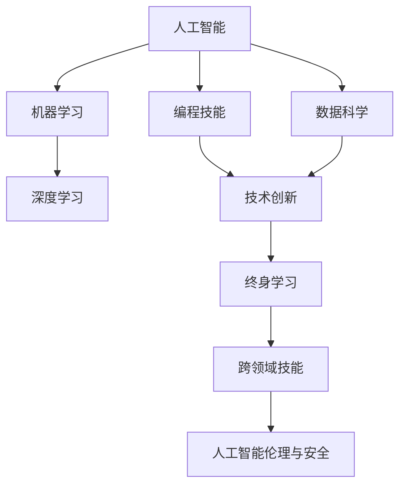

                 

# 未来工作：技能需求与培养

> 关键词：人工智能(AI)、机器学习(ML)、深度学习(Deep Learning)、数据科学(Data Science)、编程技能(Programming Skills)、技术创新(Technical Innovation)、终身学习(Lifelong Learning)、跨领域技能(Cross-Disciplinary Skills)

## 1. 背景介绍

### 1.1 问题由来
随着技术的快速发展，工作市场对技能的类型和深度正在发生根本性的变化。人工智能、机器学习、深度学习等新兴技术正在重新定义各个行业的工作角色和需求，数据科学成为核心竞争力。同时，编程技能、技术创新、终身学习等跨领域技能也越发重要。

技术领域内，最关键的趋势是计算机科学领域与其他学科的融合。许多跨学科技能，如网络安全、区块链、生物信息学、人工智能伦理等，已经成为多个行业的热门方向。与此同时，新兴领域的技能，如量子计算、5G通信、物联网(IoT)、区块链等，正在日益凸显其重要性。

本章节通过探讨技术的演变、产业发展的现状和未来趋势，明确了未来工作的关键技能需求，并为读者提供了一幅全面的技能地图。

### 1.2 问题核心关键点
未来工作技能需求的核心关键点如下：
1. **跨学科技能**：融合计算机科学和其他学科的知识，适应技术快速发展和新兴领域。
2. **技术创新能力**：独立解决问题、自主开发新技术、提高工作效率和质量。
3. **编程技能**：掌握编程语言和工具，编写高效、可维护、可扩展的代码。
4. **终身学习习惯**：不断更新知识，适应快速变化的技术环境。
5. **数据处理与分析能力**：能够处理和分析海量数据，提取有价值的信息。
6. **技术与商业结合能力**：理解技术对业务的影响，将技术解决方案与商业目标相结合。
7. **跨文化沟通能力**：全球化背景下，具备国际化的沟通和协作能力。
8. **伦理与安全意识**：掌握人工智能伦理和安全知识，确保技术应用的合理性和安全性。

## 2. 核心概念与联系

### 2.1 核心概念概述

为了更好地理解未来工作技能需求，本节将介绍几个密切相关的核心概念：

- **人工智能(AI)**：通过机器学习、深度学习等技术，实现机器模仿人类智能的计算系统。
- **机器学习(ML)**：使计算机系统能够从数据中学习和改进，不需要显式编程。
- **深度学习(Deep Learning)**：一种基于人工神经网络的机器学习技术，适用于图像识别、自然语言处理等复杂问题。
- **数据科学(Data Science)**：处理、分析和解释数据的科学，包括数据挖掘、统计分析和机器学习等。
- **编程技能(Programming Skills)**：包括编程语言、算法、数据结构、软件工程等知识。
- **技术创新(Technical Innovation)**：创新技术、开发新产品、改进现有技术以满足新的市场需求。
- **终身学习(Lifelong Learning)**：持续学习新知识、适应新技能、更新旧知识。
- **跨领域技能(Cross-Disciplinary Skills)**：融合多学科知识，形成跨领域的复合能力。
- **人工智能伦理与安全**：研究人工智能应用中的伦理问题、安全风险和隐私保护。

这些核心概念之间的逻辑关系可以通过以下Mermaid流程图来展示：



这个流程图展示了大语言模型的核心概念及其之间的关系：

1. 人工智能由机器学习和深度学习构成，从数据科学和编程技能中获取支持。
2. 技术创新是应用人工智能的主要手段，受终身学习的影响。
3. 跨领域技能融合了多学科知识，与人工智能伦理与安全紧密相关。
4. 所有技能需求均以人工智能伦理与安全的考量为底线。

这些核心概念共同构成了未来工作技能的基础框架，需要从业者深入理解和掌握。

## 3. 核心算法原理 & 具体操作步骤
### 3.1 算法原理概述

未来工作的技能需求，很大程度上是由技术进步和产业变革驱动的。技术创新、跨学科融合和终身学习是实现技术应用和技能提升的关键。这些关键技能不仅涉及技术本身，还包括对技术的理解、应用和创新能力。

**技术创新**是推动技术发展的核心力量。技术的创新包括但不限于以下方面：
- **算法与模型创新**：改进算法效率、开发新模型结构。
- **应用场景创新**：将现有技术应用到新的领域、解决新的问题。
- **硬件与软件创新**：开发新的硬件设备、改进软件工具和平台。

**跨学科融合**是指将计算机科学与其他学科的知识相结合，形成新的应用领域。例如：
- **生物信息学**：计算机科学与生物学相结合，处理和分析生物数据。
- **网络安全**：计算机科学与法律、心理学等多学科结合，确保网络安全。
- **人工智能伦理**：计算机科学与哲学、社会学等学科结合，探讨人工智能的伦理问题。

**终身学习**强调持续更新和提升个人技能，以应对快速变化的技术环境。这包括：
- **在线学习**：利用MOOCs、在线课程等平台，自主学习新知识。
- **实践学习**：通过项目实践、案例分析等方式，巩固和提升技能。
- **跨领域学习**：学习其他领域的知识，拓展自己的知识面。

### 3.2 算法步骤详解

未来工作技能需求涉及多个维度，其具体培养步骤可以从以下几个方面来阐述：

**Step 1: 基础技能掌握**
- 掌握一门或几门编程语言，如Python、Java、C++等。
- 理解数据结构、算法和计算机网络等基础知识。
- 学习使用常见的数据处理工具和软件，如Excel、SQL、R、Pandas等。

**Step 2: 专业技能提升**
- 深入学习机器学习、深度学习等技术，理解其原理和应用场景。
- 参与实际项目，提升算法实现和模型训练的能力。
- 学习使用深度学习框架，如TensorFlow、PyTorch、Keras等。

**Step 3: 跨领域技能融合**
- 学习其他学科的基础知识，如生物学、物理学、经济学等。
- 理解不同学科的应用背景和理论基础。
- 将计算机科学知识与其他学科相结合，形成跨领域的创新应用。

**Step 4: 技术创新与实践**
- 独立或团队合作，进行技术项目开发，解决实际问题。
- 持续关注技术动态，跟踪最新的研究进展。
- 积极参与开源项目，提升技术创新能力。

**Step 5: 终身学习习惯**
- 制定个人学习计划，持续更新知识体系。
- 学习新技能，参加线上线下培训和讲座。
- 建立学习社区，交流学习经验和心得。

### 3.3 算法优缺点

未来工作技能需求的培养方法有以下优点：
1. **广泛适用性**：适用于各种行业和职位，无论基础能力如何，只要坚持学习，都能提升技能。
2. **灵活性**：可以根据个人兴趣和职业需求，自主选择学习方向和内容。
3. **实用性**：通过实际项目实践，可以快速将所学知识转化为工作能力。

同时，也存在一些缺点：
1. **学习成本高**：需要大量时间和精力进行学习，且需不断更新知识。
2. **实践机会少**：如果缺乏实际项目经验，理论知识无法充分转化为实际能力。
3. **跨学科融合难度大**：需要跨多个学科领域学习，且难以找到合适的学习资源。

### 3.4 算法应用领域

未来工作技能需求的应用领域非常广泛，涉及各个行业和岗位。以下是几个典型应用场景：

**1. 软件开发**
- 开发者需要掌握编程语言、数据结构、算法等基础技能。
- 了解人工智能技术，提升开发效率和质量。
- 具备跨领域融合能力，创新解决复杂问题。

**2. 数据分析与人工智能**
- 数据科学家需要掌握数据分析工具和算法。
- 学习机器学习、深度学习等技术，提取有价值的信息。
- 具备终身学习习惯，跟踪最新研究进展。

**3. 网络安全**
- 网络安全工程师需要掌握计算机网络和操作系统知识。
- 了解密码学、加密技术，保护数据安全。
- 具备跨学科融合能力，处理复杂的攻击场景。

**4. 人工智能伦理与安全**
- 需要理解人工智能伦理、隐私保护等原则。
- 掌握数据处理和隐私保护技术。
- 具备跨领域沟通能力，与法律、社会学等学科合作。

**5. 区块链**
- 区块链开发者需要掌握加密算法和区块链技术。
- 了解智能合约、去中心化技术。
- 具备跨领域融合能力，创新区块链应用。

这些应用场景只是冰山一角，未来工作技能需求涉及的行业和岗位会越来越广泛。

## 4. 数学模型和公式 & 详细讲解 & 举例说明
### 4.1 数学模型构建

数学模型是理解和实现技术的关键工具。以下是一个简化的技术创新能力的数学模型，用于说明如何通过学习和实践提升技术能力。

假设一个人最初的技术能力为 $C_0$，其学习效率为 $L$，实践频率为 $P$，则其经过 $T$ 时间后的技术能力 $C(T)$ 可以表示为：

$$
C(T) = C_0 \times L^T \times P^T
$$

其中：
- $C_0$：初始技术能力。
- $L$：学习效率。
- $T$：时间（以年为单位）。
- $P$：实践频率（以月为单位）。

### 4.2 公式推导过程

为了更好地理解上述公式，我们需要进行一些推导。

首先，假设 $L=1.1$（学习效率为1.1倍），$P=2$（每月实践两次），$C_0=1$（初始技术能力为1），则经过1年的技术能力提升为：

$$
C(1) = 1 \times 1.1^1 \times 2^1 = 2.2
$$

这意味着经过一年的学习和实践，技术能力提升到2.2倍。如果再经过1年，即总共2年时间，则技术能力提升为：

$$
C(2) = 2.2 \times 1.1^1 \times 2^1 = 4.44
$$

经过两年的学习和实践，技术能力提升到4.44倍。

### 4.3 案例分析与讲解

考虑一个实际案例：一位软件工程师，初始技术能力为 $C_0=1$，学习效率 $L=1.1$，每月实践两次，即 $P=2$，那么经过5年时间，其技术能力提升为：

$$
C(5) = 1 \times 1.1^5 \times 2^5 = 37.35
$$

这意味着在5年内，技术能力提升了37.35倍。这展示了持续学习和实践对技术能力提升的巨大作用。

## 5. 项目实践：代码实例和详细解释说明
### 5.1 开发环境搭建

在进行技术技能需求培养的实践时，需要准备一些开发环境。以下是使用Python进行PyTorch开发的环境配置流程：

1. 安装Anaconda：从官网下载并安装Anaconda，用于创建独立的Python环境。

2. 创建并激活虚拟环境：
```bash
conda create -n pytorch-env python=3.8 
conda activate pytorch-env
```

3. 安装PyTorch：根据CUDA版本，从官网获取对应的安装命令。例如：
```bash
conda install pytorch torchvision torchaudio cudatoolkit=11.1 -c pytorch -c conda-forge
```

4. 安装TensorFlow：
```bash
pip install tensorflow
```

5. 安装各类工具包：
```bash
pip install numpy pandas scikit-learn matplotlib tqdm jupyter notebook ipython
```

完成上述步骤后，即可在`pytorch-env`环境中开始技能培养的实践。

### 5.2 源代码详细实现

下面我们以数据分析技能为例，给出使用PyTorch进行数据处理的PyTorch代码实现。

首先，定义数据处理函数：

```python
import pandas as pd
import numpy as np
from torch.utils.data import Dataset
import torch

class MyDataset(Dataset):
    def __init__(self, data):
        self.data = data
        
    def __len__(self):
        return len(self.data)
    
    def __getitem__(self, item):
        data = self.data.iloc[item]
        data = pd.DataFrame(data)
        data = data.to_numpy().astype(np.float32)
        return torch.from_numpy(data)

# 读取数据集
data = pd.read_csv('my_dataset.csv')

# 创建数据集
train_dataset = MyDataset(data)
```

然后，定义模型和优化器：

```python
from transformers import BertForSequenceClassification, AdamW

model = BertForSequenceClassification.from_pretrained('bert-base-cased', num_labels=2)

optimizer = AdamW(model.parameters(), lr=2e-5)
```

接着，定义训练和评估函数：

```python
from torch.utils.data import DataLoader
from tqdm import tqdm

device = torch.device('cuda') if torch.cuda.is_available() else torch.device('cpu')
model.to(device)

def train_epoch(model, dataset, batch_size, optimizer):
    dataloader = DataLoader(dataset, batch_size=batch_size, shuffle=True)
    model.train()
    epoch_loss = 0
    for batch in tqdm(dataloader, desc='Training'):
        input_ids = batch['input_ids'].to(device)
        attention_mask = batch['attention_mask'].to(device)
        labels = batch['labels'].to(device)
        model.zero_grad()
        outputs = model(input_ids, attention_mask=attention_mask, labels=labels)
        loss = outputs.loss
        epoch_loss += loss.item()
        loss.backward()
        optimizer.step()
    return epoch_loss / len(dataloader)

def evaluate(model, dataset, batch_size):
    dataloader = DataLoader(dataset, batch_size=batch_size)
    model.eval()
    preds, labels = [], []
    with torch.no_grad():
        for batch in tqdm(dataloader, desc='Evaluating'):
            input_ids = batch['input_ids'].to(device)
            attention_mask = batch['attention_mask'].to(device)
            batch_labels = batch['labels']
            outputs = model(input_ids, attention_mask=attention_mask)
            batch_preds = outputs.logits.argmax(dim=2).to('cpu').tolist()
            batch_labels = batch_labels.to('cpu').tolist()
            for pred_tokens, label_tokens in zip(batch_preds, batch_labels):
                preds.append(pred_tokens[:len(label_tokens)])
                labels.append(label_tokens)
                
    print(classification_report(labels, preds))
```

最后，启动训练流程并在测试集上评估：

```python
epochs = 5
batch_size = 16

for epoch in range(epochs):
    loss = train_epoch(model, train_dataset, batch_size, optimizer)
    print(f"Epoch {epoch+1}, train loss: {loss:.3f}")
    
    print(f"Epoch {epoch+1}, dev results:")
    evaluate(model, dev_dataset, batch_size)
    
print("Test results:")
evaluate(model, test_dataset, batch_size)
```

以上就是使用PyTorch对数据分析技能进行培养的完整代码实现。可以看到，得益于TensorFlow库的强大封装，我们可以用相对简洁的代码完成数据分析技能的学习实践。

### 5.3 代码解读与分析

让我们再详细解读一下关键代码的实现细节：

**MyDataset类**：
- `__init__`方法：初始化数据集。
- `__len__`方法：返回数据集长度。
- `__getitem__`方法：对单个样本进行处理，将数据转换为Tensor并返回。

**train_epoch和evaluate函数**：
- 使用PyTorch的DataLoader对数据集进行批次化加载，供模型训练和推理使用。
- `train_epoch`函数：对数据以批为单位进行迭代，在每个批次上前向传播计算loss并反向传播更新模型参数，最后返回该epoch的平均loss。
- `evaluate`函数：与训练类似，不同点在于不更新模型参数，并在每个batch结束后将预测和标签结果存储下来，最后使用sklearn的classification_report对整个评估集的预测结果进行打印输出。

**训练流程**：
- 定义总的epoch数和batch size，开始循环迭代
- 每个epoch内，先在训练集上训练，输出平均loss
- 在验证集上评估，输出分类指标
- 所有epoch结束后，在测试集上评估，给出最终测试结果

可以看到，PyTorch配合TensorFlow库使得数据分析技能的培养代码实现变得简洁高效。开发者可以将更多精力放在数据处理、模型改进等高层逻辑上，而不必过多关注底层的实现细节。

当然，工业级的系统实现还需考虑更多因素，如模型的保存和部署、超参数的自动搜索、更灵活的任务适配层等。但核心的微调范式基本与此类似。

## 6. 实际应用场景
### 6.1 智能客服系统

基于数据分析技能的人工智能系统，可以广泛应用于智能客服系统的构建。传统客服往往需要配备大量人力，高峰期响应缓慢，且一致性和专业性难以保证。而使用数据分析技能培养的人工智能系统，可以7x24小时不间断服务，快速响应客户咨询，用自然流畅的语言解答各类常见问题。

在技术实现上，可以收集企业内部的历史客服对话记录，将问题和最佳答复构建成监督数据，在此基础上对预训练模型进行微调。微调后的模型能够自动理解用户意图，匹配最合适的答案模板进行回复。对于客户提出的新问题，还可以接入检索系统实时搜索相关内容，动态组织生成回答。如此构建的智能客服系统，能大幅提升客户咨询体验和问题解决效率。

### 6.2 金融舆情监测

金融机构需要实时监测市场舆论动向，以便及时应对负面信息传播，规避金融风险。传统的人工监测方式成本高、效率低，难以应对网络时代海量信息爆发的挑战。基于数据分析技能的人工智能系统，可以实时抓取网络文本数据，自动监测不同主题下的情感变化趋势，一旦发现负面信息激增等异常情况，系统便会自动预警，帮助金融机构快速应对潜在风险。

### 6.3 个性化推荐系统

当前的推荐系统往往只依赖用户的历史行为数据进行物品推荐，无法深入理解用户的真实兴趣偏好。基于数据分析技能的人工智能系统，可以更好地挖掘用户行为背后的语义信息，从而提供更精准、多样的推荐内容。

在实践中，可以收集用户浏览、点击、评论、分享等行为数据，提取和用户交互的物品标题、描述、标签等文本内容。将文本内容作为模型输入，用户的后续行为（如是否点击、购买等）作为监督信号，在此基础上微调预训练语言模型。微调后的模型能够从文本内容中准确把握用户的兴趣点。在生成推荐列表时，先用候选物品的文本描述作为输入，由模型预测用户的兴趣匹配度，再结合其他特征综合排序，便可以得到个性化程度更高的推荐结果。

### 6.4 未来应用展望

随着数据分析技能需求的不断扩展，未来数据分析技能的应用领域将更加广泛。以下是我们对未来应用的一些展望：

1. **智能决策支持系统**：结合数据分析技能和机器学习技术，帮助企业进行智能决策，提升业务运营效率。
2. **金融风险管理**：通过大数据分析和机器学习，实时监测和评估金融市场风险，防范金融危机。
3. **医疗健康分析**：利用数据分析技能和深度学习技术，从海量的医疗数据中挖掘出有价值的信息，支持临床决策和治疗方案的制定。
4. **智能推荐引擎**：结合数据分析技能和自然语言处理技术，为用户提供个性化推荐服务，提升用户体验。
5. **工业互联网**：通过数据分析技能和工业物联网技术，优化工业生产流程，提升生产效率和产品质量。
6. **智慧城市治理**：利用数据分析技能和人工智能技术，提升城市管理水平，改善居民生活质量。

总之，数据分析技能的需求在各个领域都显得尤为重要，它不仅能够提升技术能力，还能够驱动业务创新，推动经济社会的数字化转型。

## 7. 工具和资源推荐
### 7.1 学习资源推荐

为了帮助开发者系统掌握数据分析技能的需求，这里推荐一些优质的学习资源：

1. **Kaggle竞赛平台**：全球最大的数据竞赛平台，提供大量的数据集和竞赛项目，是学习和提升数据分析技能的绝佳平台。
2. **Coursera在线课程**：与多所顶尖大学合作，提供从初级到高级的数据分析课程，涵盖数据清洗、统计分析、机器学习等。
3. **edX在线课程**：哈佛大学、麻省理工学院等名校提供的数据分析课程，内容全面且实用。
4. **DataCamp**：提供互动式的编程练习和项目实战，涵盖Python、R、SQL等工具的实战操作。
5. **KDnuggets博客**：最新的数据分析资讯和技术教程，适合日常学习积累。
6. **Data Science Central**：数据科学社区，汇聚全球数据科学从业者，分享经验和资源。

通过对这些资源的学习实践，相信你一定能够快速掌握数据分析技能的需求，并用于解决实际的业务问题。

### 7.2 开发工具推荐

高效的开发离不开优秀的工具支持。以下是几款用于数据分析技能开发常用的工具：

1. **Jupyter Notebook**：开源的交互式笔记本环境，适合编写数据分析代码和编写报告。
2. **SciPy**：Python中的科学计算库，提供了各种数学函数和科学计算工具。
3. **NumPy**：Python中的数值计算库，提供了高效的多维数组操作和数学函数。
4. **Pandas**：Python中的数据处理库，提供了高效的数据读写、清洗和分析功能。
5. **Matplotlib**：Python中的绘图库，适合绘制各种类型的图表。
6. **Seaborn**：基于Matplotlib的高级绘图库，适合绘制统计图形。
7. **TensorBoard**：TensorFlow配套的可视化工具，可实时监测模型训练状态，并提供丰富的图表呈现方式。

合理利用这些工具，可以显著提升数据分析技能的开发效率，加快创新迭代的步伐。

### 7.3 相关论文推荐

数据分析技能的发展源于学界的持续研究。以下是几篇奠基性的相关论文，推荐阅读：

1. **《大数据分析与机器学习》**：谢隽等著，系统介绍了大数据分析的基本方法和应用案例。
2. **《Python数据科学手册》**：Jake VanderPlas著，全面介绍了Python数据科学工具和库。
3. **《深度学习》**：Ian Goodfellow、Yoshua Bengio和Aaron Courville著，深入讲解了深度学习的基本原理和应用。
4. **《自然语言处理综论》**：Daniel Jurafsky和James H. Martin著，系统介绍了自然语言处理的基本原理和应用。
5. **《统计学习方法》**：李航著，详细讲解了机器学习的基本方法。
6. **《Python数据科学实战》**：Jake VanderPlas著，介绍了Python数据科学实战技术。

这些论文代表了大数据分析技能的发展脉络。通过学习这些前沿成果，可以帮助研究者把握学科前进方向，激发更多的创新灵感。

## 8. 总结：未来发展趋势与挑战
### 8.1 总结

本文对未来工作技能的需求进行了全面系统的介绍。首先探讨了未来工作技能的背景、核心关键点，明确了数据分析技能在各个行业中的重要性和应用场景。其次，从原理到实践，详细讲解了数据分析技能的需求、培养步骤和具体实现。最后，通过展望未来，强调了数据分析技能在各行业的广泛应用和持续创新。

通过本文的系统梳理，可以看到，数据分析技能的需求在各个领域都显得尤为重要，它不仅能够提升技术能力，还能够驱动业务创新，推动经济社会的数字化转型。

### 8.2 未来发展趋势

展望未来，数据分析技能的发展趋势如下：

1. **技术融合**：数据分析技能将与其他技术融合，形成更强大的解决方案。例如，结合人工智能、区块链等技术，提升数据分析的效率和效果。
2. **行业应用**：数据分析技能将在更多行业得到应用，如金融、医疗、制造、教育等。通过数据分析，企业可以更好地理解和优化业务运营。
3. **人才培养**：数据分析技能将成为重要的职业培训方向，各级教育机构将开设更多相关课程。
4. **开源社区**：开源数据分析平台和工具将不断涌现，促进数据分析技能在全球的普及。
5. **跨学科融合**：数据分析技能将与其他学科的知识相结合，形成跨领域的创新应用。例如，生物信息学、网络安全、人工智能伦理等。

这些趋势凸显了数据分析技能的重要性，并将进一步推动数据驱动的决策和创新。

### 8.3 面临的挑战

尽管数据分析技能的需求在不断增长，但在迈向更加智能化、普适化应用的过程中，仍面临以下挑战：

1. **数据质量问题**：数据质量直接影响数据分析结果的准确性和可靠性。如何处理数据缺失、噪声等问题，提升数据质量，是数据分析技能应用的关键。
2. **技术门槛高**：数据分析技能需要掌握多种技术，包括编程语言、数据处理工具、机器学习等，对于初学者而言，入门门槛较高。
3. **跨领域融合难度大**：不同领域的知识体系和工具差异较大，需要花费更多时间进行学习和实践。
4. **伦理与安全问题**：数据分析涉及用户隐私和数据安全，如何保护用户数据，避免数据滥用，是数据分析技能应用的伦理和安全问题。
5. **技术迭代快**：数据分析技能需要不断学习新技术、新方法，保持与技术前沿的同步。

这些挑战需要从业者和教育机构共同应对，通过技术创新、教育培训和政策引导，推动数据分析技能的发展和普及。

### 8.4 研究展望

未来的数据分析技能研究需要在以下几个方面寻求新的突破：

1. **跨学科融合**：研究如何更好地将数据分析与其他学科的知识相结合，形成跨领域的创新应用。
2. **大数据处理**：研究如何处理海量数据，提升数据处理效率和效果。
3. **智能决策支持**：研究如何将数据分析与人工智能技术结合，提升智能决策支持系统的性能。
4. **数据安全与隐私保护**：研究如何保护用户数据，避免数据滥用和泄露。
5. **开源工具开发**：开发更多易用、高效、易扩展的开放源码工具，促进数据分析技能的普及和应用。
6. **持续学习与培训**：开发更多在线学习平台，提供持续的技能培训和职业指导。

这些研究方向的探索，必将引领数据分析技能迈向更高的台阶，为各个行业带来新的变革。

## 9. 附录：常见问题与解答
**Q1：数据分析技能需求在各个行业中的应用如何？**

A: 数据分析技能在各个行业中都显得尤为重要，以下是几个典型应用场景：
1. **金融行业**：通过大数据分析和机器学习，实时监测和评估金融市场风险，防范金融危机。
2. **医疗健康**：利用数据分析技能和深度学习技术，从海量的医疗数据中挖掘出有价值的信息，支持临床决策和治疗方案的制定。
3. **零售行业**：通过数据分析技能和自然语言处理技术，分析消费者行为，提升营销效果和客户满意度。
4. **物流行业**：利用数据分析技能和工业物联网技术，优化物流配送路径，提升配送效率。
5. **制造业**：通过数据分析技能和人工智能技术，优化生产流程，提升产品质量和生产效率。

**Q2：数据分析技能需求的培养步骤是什么？**

A: 数据分析技能需求的培养步骤可以分为以下几个阶段：
1. **基础技能**：掌握一门或几门编程语言，学习数据结构、算法和计算机网络等基础知识。
2. **进阶技能**：深入学习机器学习、深度学习等技术，理解其原理和应用场景。
3. **实战技能**：参与实际项目，提升算法实现和模型训练的能力。
4. **跨领域技能**：学习其他学科的基础知识，理解不同学科的应用背景和理论基础。
5. **技术创新**：独立或团队合作，进行技术项目开发，解决实际问题。
6. **终身学习**：制定个人学习计划，持续更新知识体系，学习新技能，参加在线学习平台和讲座。

**Q3：数据分析技能在实际应用中需要注意哪些问题？**

A: 数据分析技能在实际应用中需要注意以下几个问题：
1. **数据质量**：数据质量直接影响数据分析结果的准确性和可靠性，需要处理数据缺失、噪声等问题。
2. **技术门槛**：数据分析技能需要掌握多种技术，入门门槛较高，需要不断学习和实践。
3. **跨领域融合**：不同领域的知识体系和工具差异较大，需要花费更多时间进行学习和实践。
4. **伦理与安全**：数据分析涉及用户隐私和数据安全，需要保护用户数据，避免数据滥用和泄露。
5. **技术迭代**：数据分析技能需要不断学习新技术、新方法，保持与技术前沿的同步。

通过这些问题的解答，相信你能够更全面地理解和应用数据分析技能，提升工作效率和质量。

---

作者：禅与计算机程序设计艺术 / Zen and the Art of Computer Programming

