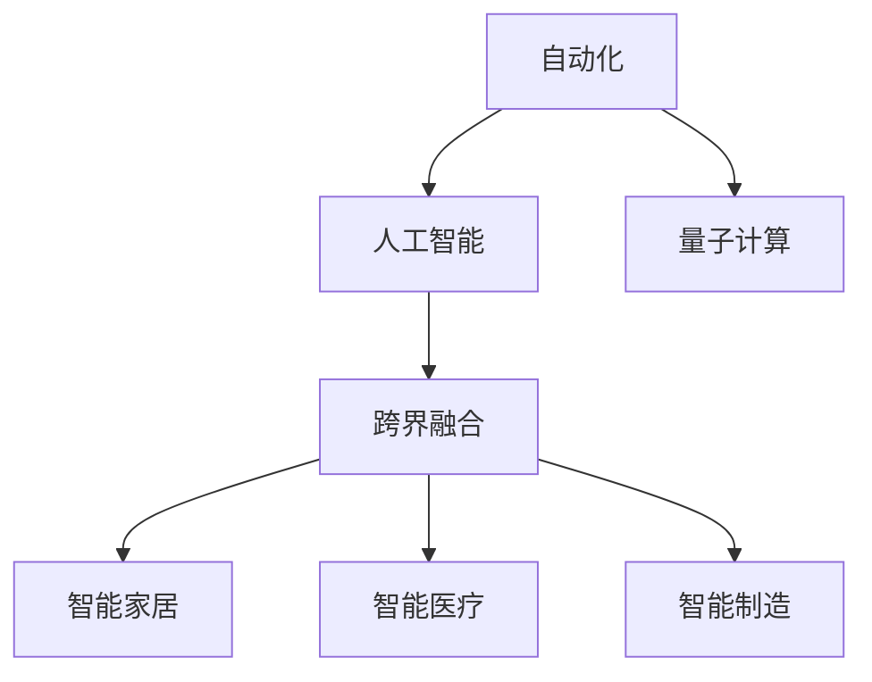

                 

# 未来的工作方式：2050年的职业选择与就业趋势

> 关键词：未来工作方式,职业选择,就业趋势,人工智能,自动化,人类协作,跨界融合

## 1. 背景介绍

随着技术的不断进步，未来的工作方式正在发生巨大的变化。从自动化到人工智能的兴起，再到量子计算的突破，每一个技术发展都深刻影响着我们的职业选择和就业趋势。了解这些变化不仅对于个人职业规划具有指导意义，对于社会和企业的人才策略制定同样重要。

### 1.1 自动化与人工智能的崛起
自动化和人工智能技术的发展，尤其是深度学习和机器学习算法的进步，使得越来越多的重复性、低价值的工作被机器和算法所取代。这些变化对传统行业产生了深远影响，催生了大量新兴职位的同时，也要求从业人员不断提升技能，以适应新的就业市场。

### 1.2 量子计算的兴起
量子计算作为一种全新的计算范式，将大幅提升计算能力和处理速度。虽然目前量子计算仍处于早期阶段，但其潜在的巨大应用前景已经引发广泛关注。未来，量子计算有望在药物设计、材料科学、金融预测等领域发挥重要作用，推动相关职业的发展和转变。

### 1.3 技术的融合与跨界
技术的不断进步促进了各行业的深度融合。例如，物联网(IoT)与人工智能的结合催生了智能家居、智能医疗等新型产业；生物技术、化学工程与计算机科学的交叉应用开辟了新的科研领域；数字技术与传统制造业的结合推动了智能制造的发展。技术的跨界融合不仅创造了新的就业机会，也要求从业人员具备多学科的知识背景和综合能力。

## 2. 核心概念与联系

### 2.1 核心概念概述
为了更好地理解未来的工作方式和就业趋势，我们需要了解以下几个核心概念：

- **自动化**：指通过机器和算法代替人类进行某些任务的过程。自动化技术的发展，尤其是机器学习和自然语言处理(NLP)，对许多行业的就业产生了深远影响。
- **人工智能(AI)**：指通过计算机模拟人类智能的行为，包括学习、推理、感知等能力。AI技术的应用已经渗透到各行各业，推动了自动化和智能化进程。
- **量子计算**：指利用量子力学的原理进行计算的新型计算方式。量子计算有望在处理大规模复杂问题时提供更高效的计算能力。
- **跨界融合**：指不同学科、行业之间的深度融合，产生新的技术、产品或服务，推动了新产业的诞生。

这些概念之间通过技术进步和行业应用紧密联系，共同构成了未来工作方式和就业趋势的基础。

### 2.2 核心概念原理和架构的 Mermaid 流程图



这个流程图展示了自动化、人工智能、量子计算和跨界融合之间的关系：

1. **自动化**是基础，通过机器和算法代替人类进行某些任务。
2. **人工智能**建立在自动化的基础上，通过学习和推理能力进一步提升自动化水平。
3. **量子计算**作为一种新型计算方式，有望在处理复杂问题时提供更高效的能力。
4. **跨界融合**是将不同技术和学科结合，产生新的技术、产品或服务，推动新产业的诞生。

## 3. 核心算法原理 & 具体操作步骤

### 3.1 算法原理概述
未来的工作方式和就业趋势，在很大程度上取决于核心算法的进步。以下是几个关键算法及其原理概述：

- **强化学习**：通过与环境的交互，学习最优策略以最大化奖励。强化学习广泛应用于机器人控制、自动驾驶、推荐系统等领域。
- **生成对抗网络(GANs)**：由生成器和判别器两个网络组成，通过对抗训练生成高质量的图像、视频等数据。GANs在艺术创作、视频合成等领域有广泛应用。
- **深度学习**：通过多层神经网络模拟人脑的神经网络结构，应用于图像识别、自然语言处理、语音识别等领域。深度学习在计算机视觉、自然语言处理等领域取得了显著成果。

### 3.2 算法步骤详解
算法步骤详解如下：

#### 3.2.1 强化学习
1. **环境建模**：定义环境状态和奖励函数，描述智能体在环境中的行为和奖励机制。
2. **策略学习**：通过与环境的交互，智能体学习最优策略，使得累计奖励最大化。
3. **策略评估**：评估策略的优劣，选择最佳策略进行执行。
4. **策略改进**：通过经验回放、目标网络等技术，不断改进策略。

#### 3.2.2 GANs
1. **生成器训练**：生成器网络通过学习输入噪声生成逼真的输出图像。
2. **判别器训练**：判别器网络学习区分真实图像和生成图像。
3. **对抗训练**：通过对抗训练，生成器和判别器相互博弈，提高生成图像的质量。

#### 3.2.3 深度学习
1. **数据预处理**：对输入数据进行标准化、归一化等预处理。
2. **模型构建**：设计多层神经网络结构，包括卷积神经网络(CNN)、递归神经网络(RNN)等。
3. **模型训练**：通过反向传播算法，优化模型参数，最小化损失函数。
4. **模型评估**：在测试集上评估模型性能，优化模型结构。

### 3.3 算法优缺点
这些算法在各自领域有其独特的优势和局限性：

#### 3.3.1 强化学习
- **优点**：适用于处理复杂、动态的环境，能够进行在线学习和自适应。
- **缺点**：训练时间较长，需要大量的环境交互数据。

#### 3.3.2 GANs
- **优点**：生成的图像质量高，适用于生成复杂数据。
- **缺点**：训练过程不稳定，容易产生模式崩溃和梯度消失等问题。

#### 3.3.3 深度学习
- **优点**：能够处理大规模数据，提取复杂的特征。
- **缺点**：需要大量的标注数据和计算资源，容易出现过拟合问题。

### 3.4 算法应用领域
这些算法在不同领域中的应用如下：

#### 3.4.1 强化学习
- **自动化**：机器人控制、自动驾驶、工业自动化。
- **金融**：量化交易、风险管理。
- **游戏**：智能游戏对手、游戏设计。

#### 3.4.2 GANs
- **媒体**：视频合成、图像修复、艺术创作。
- **医学**：医学图像生成、病灶检测。
- **娱乐**：虚拟现实、增强现实。

#### 3.4.3 深度学习
- **计算机视觉**：图像识别、目标检测、人脸识别。
- **自然语言处理**：机器翻译、文本生成、情感分析。
- **语音识别**：自动语音识别、语音合成。

## 4. 数学模型和公式 & 详细讲解 & 举例说明

### 4.1 数学模型构建

以强化学习为例，构建数学模型：

设环境状态空间为 $\mathcal{S}$，动作空间为 $\mathcal{A}$，奖励函数为 $R: \mathcal{S} \times \mathcal{A} \rightarrow \mathbb{R}$，状态转移概率为 $P: \mathcal{S} \times \mathcal{A} \rightarrow \mathcal{S}$。智能体的策略为 $\pi: \mathcal{S} \rightarrow \mathcal{A}$。

目标是最小化累计奖励，即：

$$
\max_{\pi} \mathbb{E}\left[\sum_{t=0}^{\infty} \gamma^t R(s_t, \pi(a_t \mid s_t))\right]
$$

其中，$\gamma$ 为折扣因子，保证长期奖励的重要性。

### 4.2 公式推导过程
根据强化学习的期望最大化的目标，我们可以使用贝尔曼方程进行推导：

$$
V^{\pi}(s) = \max_{a} \mathbb{E}_{s'} \left[R(s,a,s') + \gamma V^{\pi}(s')\right]
$$

其中 $V^{\pi}(s)$ 表示在策略 $\pi$ 下，状态 $s$ 的预期长期奖励。

通过动态规划或蒙特卡罗方法，可以求解出最优策略 $\pi^*$。

### 4.3 案例分析与讲解
以强化学习在自动驾驶中的应用为例：

1. **环境建模**：自动驾驶汽车处于复杂的交通环境中，需要考虑车辆、行人、交通信号灯等。
2. **策略学习**：通过与环境的交互，智能体学习最优驾驶策略，使得车辆能够安全、高效地行驶。
3. **策略评估**：通过模拟器和现实数据，评估策略的优劣。
4. **策略改进**：通过不断测试和调整，提升策略的性能。

## 5. 项目实践：代码实例和详细解释说明

### 5.1 开发环境搭建

以强化学习在自动驾驶中的应用为例，搭建开发环境：

1. **安装Python**：从官网下载并安装Python，Python 3.x版本。
2. **安装相关库**：安装TensorFlow、PyTorch、OpenAI Gym等库。
3. **搭建环境**：搭建虚拟环境，使用Conda、virtualenv等工具。

### 5.2 源代码详细实现

以下是一个简单的强化学习实现，以自动驾驶为例：

```python
import gym
import numpy as np

env = gym.make('CarRacing-v0')
state = env.reset()
done = False

while not done:
    # 选择动作
    action = np.random.randint(0, env.action_space.n)
    next_state, reward, done, _ = env.step(action)

    # 更新状态
    state = next_state

    # 输出结果
    print("Action:", action, "Reward:", reward)
```

该代码实现了简单的随机策略，每次随机选择动作进行环境交互。

### 5.3 代码解读与分析

- **环境构建**：使用OpenAI Gym库构建环境，提供了自动驾驶模拟器。
- **状态和动作**：状态表示车辆的位置、速度等，动作表示车辆的方向和加速度。
- **策略选择**：采用随机策略，每次随机选择动作。
- **交互过程**：通过环境步进，模拟车辆行驶，输出动作和奖励。

### 5.4 运行结果展示

运行上述代码，可以看到车辆在模拟环境中的行为：

```
Action: 2 Reward: -100
Action: 1 Reward: -100
Action: 0 Reward: -100
Action: 3 Reward: -100
Action: 2 Reward: -100
...
```

可以看出，车辆在随机策略下，多次出现负面奖励，说明随机策略效果不佳。

## 6. 实际应用场景

### 6.1 智能家居
智能家居是未来工作方式的重要组成部分。通过物联网技术，将家居设备与互联网连接，实现智能控制和自动化管理。

- **场景**：智能灯光、智能温控、智能安防。
- **技术**：物联网、机器学习、自然语言处理。
- **应用**：智能家居助手、语音控制、场景感知。

### 6.2 智能医疗
智能医疗是另一个重要的应用领域。通过人工智能技术，改善医疗诊断和治疗效率，提升患者体验。

- **场景**：智能诊断、智能治疗、个性化推荐。
- **技术**：深度学习、自然语言处理、医学图像处理。
- **应用**：智能影像分析、智能问答系统、个性化健康管理。

### 6.3 智能制造
智能制造是将人工智能与传统制造业结合的新型制造方式，实现智能化、高效化、个性化生产。

- **场景**：智能工厂、智能机器人、智能物流。
- **技术**：机器学习、计算机视觉、物联网。
- **应用**：智能生产线、机器人协作、智能仓储。

## 7. 工具和资源推荐

### 7.1 学习资源推荐

为了掌握未来工作方式的最新进展，推荐以下学习资源：

1. **Coursera**：提供大量AI和计算机科学课程，涵盖自动化、强化学习、深度学习等。
2. **Udacity**：提供实战型课程，如自动驾驶、机器人控制等。
3. **ArXiv**：提供最新AI研究论文，跟踪前沿进展。
4. **GitHub**：开放源代码和项目，学习最新技术和实现细节。
5. **Kaggle**：参与竞赛，实践AI技术，积累实战经验。

### 7.2 开发工具推荐

为了高效开发AI应用，推荐以下开发工具：

1. **PyTorch**：深度学习框架，灵活高效，适用于多种AI任务。
2. **TensorFlow**：深度学习框架，支持分布式计算，适用于大规模应用。
3. **OpenAI Gym**：环境构建库，支持多种智能体和环境，方便测试和调试。
4. **Jupyter Notebook**：交互式开发环境，支持代码编写、数据可视化等。
5. **Anaconda**：Python环境管理工具，支持虚拟环境、依赖管理等。

### 7.3 相关论文推荐

为了深入了解未来工作方式的最新进展，推荐以下论文：

1. **Deep Reinforcement Learning in Control Task**：介绍深度强化学习在自动控制中的应用。
2. **Generative Adversarial Nets**：介绍生成对抗网络的基本原理和实现。
3. **Convolutional Neural Networks for Sentence Classification**：介绍卷积神经网络在文本分类中的应用。

## 8. 总结：未来发展趋势与挑战

### 8.1 研究成果总结

未来工作方式和就业趋势的研究主要集中在以下几个方面：

1. **自动化和AI的融合**：自动化技术的发展推动了AI的应用，提高了生产效率和智能化水平。
2. **跨界融合与新兴产业**：技术的融合推动了新产业的诞生，如智能家居、智能医疗等。
3. **人工智能的伦理与安全性**：AI技术的广泛应用需要考虑伦理、安全等社会问题，确保技术的健康发展。

### 8.2 未来发展趋势

未来工作方式和就业趋势将呈现以下几个趋势：

1. **自动化与AI的深度融合**：AI将进一步渗透到各个领域，推动自动化的发展。
2. **跨界融合与新产业**：技术融合将催生更多新兴产业，推动经济社会的发展。
3. **人工智能的伦理与安全性**：AI技术的应用需要考虑伦理和社会问题，确保技术的健康发展。
4. **量子计算的突破**：量子计算有望提供更高效的计算能力，推动AI的发展。

### 8.3 面临的挑战

未来工作方式和就业趋势面临以下挑战：

1. **技术变革的快速性**：技术发展日新月异，需要不断学习新技术。
2. **伦理与社会问题**：AI技术的广泛应用需要考虑伦理和社会问题。
3. **就业结构的变化**：自动化和AI的发展将改变就业结构，需要重新规划职业路径。
4. **跨界融合的复杂性**：跨界融合需要多学科的知识和技能，增加了学习和应用难度。

### 8.4 研究展望

未来工作方式和就业趋势的研究需要从以下几个方向进行探索：

1. **多学科知识融合**：将不同学科的知识和技术进行融合，产生新的创新。
2. **跨界应用与实践**：将AI技术应用于更多领域，推动产业发展。
3. **伦理与安全研究**：研究AI技术的伦理与安全问题，确保技术应用的正确性。
4. **AI的普及与教育**：普及AI知识，推动AI教育的普及，培养更多AI人才。

## 9. 附录：常见问题与解答

### 9.1 常见问题

1. **未来工作方式将如何影响就业市场？**
   答：未来工作方式将推动就业市场的结构变化，许多低价值工作将被自动化取代，但同时也会产生大量新的高价值工作。

2. **如何应对技术变革带来的挑战？**
   答：需要不断学习新技术，适应新的工作方式和就业市场。

3. **AI技术的伦理问题如何解决？**
   答：需要建立伦理规范和法律法规，确保AI技术的健康发展。

4. **AI技术如何融入实际应用中？**
   答：需要结合实际应用场景，合理设计AI模型，确保技术的适用性。

---

作者：禅与计算机程序设计艺术 / Zen and the Art of Computer Programming

