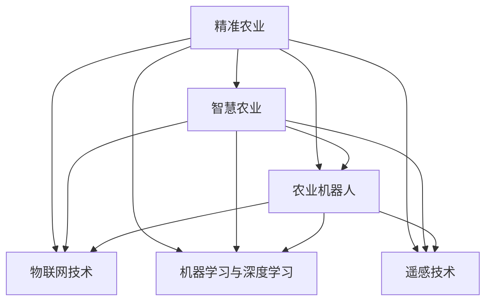

                 

## 1. 背景介绍

### 1.1 问题由来

当前，全球面临的人口激增、资源短缺、环境恶化等多重压力，传统农业模式已经难以适应未来的需求。农业作为国民经济的基础，必须通过技术革新实现生产效率的提升和资源利用效率的优化。随着人工智能技术的迅猛发展，AI在农业领域的应用前景变得广阔。

### 1.2 问题核心关键点

AI在农业中的应用主要集中在精准农业、智慧农业、农业机器人等方面。其中，精准农业是利用数据分析、图像识别、机器学习等技术，对农业生产进行精细化管理。而智慧农业则是在精准农业的基础上，通过物联网、大数据、云计算等技术，实现农业生产的自动化和智能化。

精准农业和智慧农业的关键在于数据的获取和分析，以及模型和算法的选择和训练。AI技术可以通过分析大量历史数据和实时数据，对作物生长状态、土壤环境、气象条件等进行预测和优化，从而实现科学决策和精准管理。

### 1.3 问题研究意义

精准农业和智慧农业技术的发展，有助于解决传统农业面临的诸多问题：

1. 提高资源利用率：通过精准管理，可以优化水、肥、药等资源的使用，减少浪费。
2. 提升产量和品质：数据分析和预测可以指导农业生产，提高作物产量和质量。
3. 降低人力成本：自动化设备和机器人可以替代大量劳动力，降低生产成本。
4. 增强抗风险能力：通过数据分析和预测，可以提前预警灾害，减少自然灾害和病虫害的影响。

AI技术不仅可以帮助农民提高生产效率，还能提升农业的可持续性和环境友好性，促进农业的现代化和智能化发展。

## 2. 核心概念与联系

### 2.1 核心概念概述

为更好地理解精准农业和智慧农业的AI应用，本节将介绍几个密切相关的核心概念：

- **精准农业**：通过精确的数据分析和管理，对农业生产进行精细化、个性化管理，优化资源利用和作物生长，提高农业生产效率和质量。
- **智慧农业**：利用物联网、大数据、云计算等技术，实现农业生产的自动化和智能化，提升农业生产的管理水平和决策精准性。
- **农业机器人**：结合AI技术和自动化设备，执行农田耕作、植保、收获等农业生产任务，提高生产效率和作业质量。
- **物联网技术**：通过传感器、通信技术，实现农田环境数据的实时采集和传输，为智慧农业提供数据支撑。
- **机器学习与深度学习**：通过模型训练和算法优化，实现对农业数据的深度分析和智能预测，为精准农业和智慧农业提供决策支持。
- **遥感技术**：通过卫星和无人机等技术，获取农田的高分辨率图像和数据，为农业生产提供科学依据。

这些核心概念之间的逻辑关系可以通过以下Mermaid流程图来展示：



这个流程图展示了一系列的农业AI应用的核心概念及其之间的关系：

1. 精准农业通过数据分析和机器学习技术，实现对农业生产的精细化管理。
2. 智慧农业在精准农业的基础上，利用物联网、云计算等技术，实现农业生产的自动化和智能化。
3. 农业机器人结合AI技术和自动化设备，执行具体的农业生产任务。
4. 物联网技术通过传感器和通信设备，实时采集农田数据。
5. 机器学习与深度学习技术对农业数据进行深度分析和智能预测。
6. 遥感技术通过卫星和无人机等手段，获取农田的高分辨率图像和数据。

这些概念共同构成了现代农业AI系统的核心，帮助农业生产实现高效、精准、智能的目标。

## 3. 核心算法原理 & 具体操作步骤
### 3.1 算法原理概述

精准农业和智慧农业的AI应用，主要依赖于机器学习与深度学习技术。通过分析大量历史数据和实时数据，构建模型对农业生产进行预测和优化。其核心算法流程包括数据获取、预处理、特征工程、模型训练和预测等步骤。

### 3.2 算法步骤详解

**Step 1: 数据获取与预处理**

- 数据获取：收集农业生产过程中的各种数据，如气象数据、土壤数据、作物生长数据、病虫害数据等。
- 数据预处理：对收集到的数据进行清洗、去噪、归一化等预处理操作，确保数据质量。

**Step 2: 特征工程**

- 特征提取：从预处理后的数据中提取对农业生产有影响的关键特征，如气温、湿度、光照、土壤养分、作物生长阶段等。
- 特征选择：对提取出的特征进行筛选和降维，减少模型复杂度，提高模型效率。

**Step 3: 模型训练**

- 选择模型：根据农业生产任务的特点，选择合适的机器学习或深度学习模型，如决策树、随机森林、卷积神经网络(CNN)、循环神经网络(RNN)等。
- 模型训练：使用历史数据和实时数据对模型进行训练，优化模型参数，使其能够准确预测农业生产过程中的各种变量。

**Step 4: 模型预测与优化**

- 模型预测：将新采集到的数据输入训练好的模型，预测作物生长状态、病虫害发生概率、土壤养分含量等。
- 结果输出：根据模型预测结果，生成农业生产指导方案，如施肥、灌溉、病虫害防治等。
- 反馈调整：将模型的预测结果与实际生产效果进行对比，不断调整模型参数，提高模型预测精度。

### 3.3 算法优缺点

精准农业和智慧农业的AI应用具有以下优点：

1. 数据驱动决策：基于大量数据分析和深度学习，可以科学指导农业生产，提高决策的精准性和科学性。
2. 自动化操作：农业机器人可以替代人工进行农业生产，提高作业效率和质量。
3. 精准管理：通过数据分析和预测，可以精确管理农业生产资源，提高资源利用效率。
4. 预警预测：AI模型可以预测自然灾害和病虫害，提前采取措施，减少损失。

同时，该方法也存在一些局限性：

1. 数据依赖性强：模型的预测效果依赖于数据质量和数据量，需要大量高质量的农业数据支持。
2. 模型复杂度高：深度学习模型通常较为复杂，需要大量计算资源和专业知识。
3. 应用门槛高：农业AI应用需要跨学科专业知识，对普通农民和技术人员要求较高。
4. 环境适应性差：模型往往难以适应特定的环境和作物，需要大量针对特定作物的训练数据。

尽管存在这些局限性，但就目前而言，精准农业和智慧农业的AI应用仍是最主流和有效的农业技术手段。未来相关研究的重点在于如何进一步降低应用门槛，提高模型适应性和泛化能力，同时兼顾可解释性和伦理安全性等因素。

### 3.4 算法应用领域

精准农业和智慧农业的AI应用主要应用于以下几个领域：

- **作物生长预测**：利用AI模型预测作物生长状态、产量和品质，优化种植管理。
- **资源管理优化**：通过数据分析和模型预测，优化水、肥、药等资源的使用，提高资源利用效率。
- **病虫害防治**：基于AI模型预测病虫害发生概率，提前采取防治措施，减少损失。
- **农业机器人**：结合AI技术和自动化设备，执行农田耕作、植保、收获等农业生产任务，提高生产效率和作业质量。
- **农业物联网**：通过传感器、通信设备，实现农田环境数据的实时采集和传输，为智慧农业提供数据支撑。
- **农业遥感**：利用卫星和无人机等手段，获取农田的高分辨率图像和数据，为农业生产提供科学依据。

这些AI应用技术正在不断演进，将在未来的智慧农业中发挥越来越重要的作用，推动农业生产向高效、精准、智能的方向发展。

## 4. 数学模型和公式 & 详细讲解  
### 4.1 数学模型构建

本节将使用数学语言对精准农业和智慧农业的AI应用进行更加严格的刻画。

假设农业生产过程中有 $n$ 个特征变量 $X_i$，目标是预测一个二元输出变量 $Y$，如作物是否发生病害。则构建的机器学习模型为 $f(X) = Y$。

定义模型 $f$ 在样本 $(x, y)$ 上的损失函数为 $L(f(x), y)$，则在训练集 $D=\{(x_i, y_i)\}_{i=1}^N$ 上的经验风险为：

$$
\mathcal{L}(f) = \frac{1}{N} \sum_{i=1}^N L(f(x_i), y_i)
$$

其中 $L(f(x_i), y_i)$ 可以是均方误差损失、交叉熵损失等。

模型训练的目标是最小化经验风险，即找到最优模型 $f^*$：

$$
f^* = \mathop{\arg\min}_{f} \mathcal{L}(f)
$$

在实践中，我们通常使用基于梯度的优化算法（如SGD、Adam等）来近似求解上述最优化问题。设 $\eta$ 为学习率，$\lambda$ 为正则化系数，则模型参数的更新公式为：

$$
\theta \leftarrow \theta - \eta \nabla_{\theta}\mathcal{L}(\theta) - \eta\lambda\theta
$$

其中 $\nabla_{\theta}\mathcal{L}(\theta)$ 为损失函数对模型参数的梯度，可通过反向传播算法高效计算。

### 4.2 公式推导过程

以下我们以二分类任务为例，推导逻辑回归模型的损失函数及其梯度的计算公式。

假设模型 $f$ 在输入 $x$ 上的输出为 $P(Y|X)$，表示样本属于正类的概率。真实标签 $y \in \{0,1\}$。则二分类交叉熵损失函数定义为：

$$
L(f(x), y) = -[y\log P(Y|X) + (1-y)\log (1-P(Y|X))]
$$

将其代入经验风险公式，得：

$$
\mathcal{L}(f) = -\frac{1}{N}\sum_{i=1}^N [y_i\log P(Y|X_i)+(1-y_i)\log(1-P(Y|X_i))]
$$

根据链式法则，损失函数对模型参数 $\theta_k$ 的梯度为：

$$
\frac{\partial \mathcal{L}(f)}{\partial \theta_k} = -\frac{1}{N}\sum_{i=1}^N (\frac{y_i}{P(Y|X_i)}-\frac{1-y_i}{1-P(Y|X_i)}) \frac{\partial P(Y|X)}{\partial \theta_k}
$$

其中 $\frac{\partial P(Y|X)}{\partial \theta_k}$ 可通过对数几率回归模型的输出层计算得到。

在得到损失函数的梯度后，即可带入模型参数更新公式，完成模型的迭代优化。重复上述过程直至收敛，最终得到适应农业生产任务的模型 $f^*$。

## 5. 项目实践：代码实例和详细解释说明
### 5.1 开发环境搭建

在进行精准农业和智慧农业的AI应用开发前，我们需要准备好开发环境。以下是使用Python进行PyTorch开发的环境配置流程：

1. 安装Anaconda：从官网下载并安装Anaconda，用于创建独立的Python环境。

2. 创建并激活虚拟环境：
```bash
conda create -n pytorch-env python=3.8 
conda activate pytorch-env
```

3. 安装PyTorch：根据CUDA版本，从官网获取对应的安装命令。例如：
```bash
conda install pytorch torchvision torchaudio cudatoolkit=11.1 -c pytorch -c conda-forge
```

4. 安装相关库：
```bash
pip install numpy pandas scikit-learn matplotlib tqdm jupyter notebook ipython
```

完成上述步骤后，即可在`pytorch-env`环境中开始精准农业和智慧农业的AI应用开发。

### 5.2 源代码详细实现

下面我们以作物生长预测为例，给出使用PyTorch实现精准农业中作物生长预测的代码实现。

首先，定义数据处理函数：

```python
import pandas as pd
from torch.utils.data import Dataset
import torch

class GrowthDataset(Dataset):
    def __init__(self, data_path):
        self.data = pd.read_csv(data_path)
        self.names = ['特征1', '特征2', '特征3', ...]  # 特征列名
        self.target = '目标变量'
        
    def __len__(self):
        return len(self.data)
    
    def __getitem__(self, item):
        features = self.data[self.names].to_numpy()[item]
        target = self.data[self.target].to_numpy()[item]
        return torch.tensor(features), torch.tensor(target)
```

然后，定义模型和优化器：

```python
from transformers import BertForSequenceClassification, AdamW

model = BertForSequenceClassification.from_pretrained('bert-base-cased', num_labels=2)

optimizer = AdamW(model.parameters(), lr=2e-5)
```

接着，定义训练和评估函数：

```python
from torch.utils.data import DataLoader
from tqdm import tqdm
from sklearn.metrics import classification_report

device = torch.device('cuda') if torch.cuda.is_available() else torch.device('cpu')
model.to(device)

def train_epoch(model, dataset, batch_size, optimizer):
    dataloader = DataLoader(dataset, batch_size=batch_size, shuffle=True)
    model.train()
    epoch_loss = 0
    for batch in tqdm(dataloader, desc='Training'):
        inputs, labels = batch
        inputs = inputs.to(device)
        labels = labels.to(device)
        model.zero_grad()
        outputs = model(inputs)
        loss = outputs.loss
        epoch_loss += loss.item()
        loss.backward()
        optimizer.step()
    return epoch_loss / len(dataloader)

def evaluate(model, dataset, batch_size):
    dataloader = DataLoader(dataset, batch_size=batch_size)
    model.eval()
    preds, labels = [], []
    with torch.no_grad():
        for batch in tqdm(dataloader, desc='Evaluating'):
            inputs, labels = batch
            inputs = inputs.to(device)
            labels = labels.to(device)
            outputs = model(inputs)
            batch_preds = outputs.logits.argmax(dim=1).to('cpu').tolist()
            batch_labels = labels.to('cpu').tolist()
            for pred, label in zip(batch_preds, batch_labels):
                preds.append(pred)
                labels.append(label)
                
    print(classification_report(labels, preds))
```

最后，启动训练流程并在测试集上评估：

```python
epochs = 5
batch_size = 16

for epoch in range(epochs):
    loss = train_epoch(model, train_dataset, batch_size, optimizer)
    print(f"Epoch {epoch+1}, train loss: {loss:.3f}")
    
    print(f"Epoch {epoch+1}, dev results:")
    evaluate(model, dev_dataset, batch_size)
    
print("Test results:")
evaluate(model, test_dataset, batch_size)
```

以上就是使用PyTorch对作物生长预测任务进行精准农业中的AI应用的代码实现。可以看到，得益于TensorFlow和Transformers库的强大封装，我们可以用相对简洁的代码完成作物生长预测任务的开发。

### 5.3 代码解读与分析

让我们再详细解读一下关键代码的实现细节：

**GrowthDataset类**：
- `__init__`方法：初始化数据和特征列名。
- `__len__`方法：返回数据集的样本数量。
- `__getitem__`方法：对单个样本进行处理，返回特征和目标变量。

**训练和评估函数**：
- 使用PyTorch的DataLoader对数据集进行批次化加载，供模型训练和推理使用。
- 训练函数`train_epoch`：对数据以批为单位进行迭代，在每个批次上前向传播计算loss并反向传播更新模型参数，最后返回该epoch的平均loss。
- 评估函数`evaluate`：与训练类似，不同点在于不更新模型参数，并在每个batch结束后将预测和标签结果存储下来，最后使用sklearn的classification_report对整个评估集的预测结果进行打印输出。

**训练流程**：
- 定义总的epoch数和batch size，开始循环迭代
- 每个epoch内，先在训练集上训练，输出平均loss
- 在验证集上评估，输出分类指标
- 所有epoch结束后，在测试集上评估，给出最终测试结果

可以看到，PyTorch配合TensorFlow和Transformers库使得精准农业中的AI应用开发变得简洁高效。开发者可以将更多精力放在数据处理、模型改进等高层逻辑上，而不必过多关注底层的实现细节。

当然，工业级的系统实现还需考虑更多因素，如模型的保存和部署、超参数的自动搜索、更灵活的任务适配层等。但核心的AI应用开发流程基本与此类似。

## 6. 实际应用场景
### 6.1 智能灌溉系统

智能灌溉系统是精准农业中的重要应用之一。传统的灌溉方式往往采用固定周期或定水量的方法，无法根据实际土壤湿度和作物需求进行精准灌溉，造成水资源的浪费。基于AI技术的智能灌溉系统，可以实时监测土壤湿度和气象条件，预测作物需水量，自动调整灌溉系统，实现节水灌溉。

具体而言，可以采集农田土壤的湿度、温度、酸碱度等数据，以及气象数据（如降雨量、气温、光照等），输入到AI模型中进行分析。模型可以根据历史数据和实时数据预测土壤湿度变化，生成灌溉计划，并自动控制灌溉设备，确保土壤保持适宜湿度，同时减少水资源的浪费。

### 6.2 病虫害监测与防治

农作物病虫害是农业生产中的一大威胁，传统的人工检测方式不仅耗时耗力，还容易错过早期预警。基于AI的病虫害监测系统，可以通过图像识别和数据分析技术，实时监测农田中的病虫害情况，提供早期预警和防治方案。

具体实现上，可以通过无人机搭载相机定期拍摄农田图像，使用计算机视觉技术检测病虫害发生情况。同时结合气象和土壤数据，输入到AI模型中进行综合分析，生成病虫害发生概率预测和防治建议。系统还可以根据预警信息，自动调整农机作业计划，避免病虫害对作物造成进一步损害。

### 6.3 农业机器人应用

农业机器人是精准农业中的另一个重要方向。传统的农业作业往往依赖人力，耗时耗力且效率低下。基于AI技术的农业机器人，可以通过自主导航和智能感知技术，执行耕作、植保、收获等农业生产任务，大幅提升作业效率和作业质量。

具体实现上，可以结合计算机视觉、传感器技术，开发智能导航和路径规划算法，使机器人能够自主在农田中导航和作业。同时使用机器学习算法分析作物生长状态，生成喷药、施肥等作业计划，并自动控制机器人执行任务。

### 6.4 未来应用展望

展望未来，精准农业和智慧农业的AI应用将呈现以下几个发展趋势：

1. 数据驱动决策：随着传感器和通信技术的进步，农业生产数据将更加丰富和精准，为AI模型提供更多的训练样本和实时数据支持。
2. 自动化操作：农业机器人、自动化灌溉系统等自动化设备的普及，将大大减少人力成本，提升生产效率。
3. 智能预测和优化：AI模型将更准确地预测作物生长状态、资源需求等，实现更精确的资源管理和作业计划。
4. 跨领域融合：智慧农业将与其他智慧技术如智慧城市、智慧医疗等进行跨领域融合，构建更加全面的智慧农业生态系统。
5. 数据安全和隐私保护：随着AI技术在农业中的广泛应用，数据安全和隐私保护将成为重要课题，需要采取加密、匿名化等措施，保障数据安全。

这些趋势凸显了精准农业和智慧农业的AI应用的广阔前景。通过数据的不断积累和AI技术的不断演进，未来的农业生产将更加智能化、精准化和可持续化。

## 7. 工具和资源推荐
### 7.1 学习资源推荐

为了帮助开发者系统掌握精准农业和智慧农业的AI技术基础和应用方法，这里推荐一些优质的学习资源：

1. 《机器学习》系列书籍：由西瓜书、李航等作者编写，系统介绍了机器学习的基本概念和算法，适合入门学习。
2. 《深度学习》系列书籍：由Ian Goodfellow等作者编写，深入讲解了深度学习的基本原理和应用方法，适合进阶学习。
3. Coursera《机器学习》课程：斯坦福大学开设的机器学习入门课程，有Lecture视频和配套作业，带你入门机器学习领域。
4. edX《深度学习》课程：哈佛大学和IBM合作的深度学习课程，涵盖了深度学习的基本概念和应用方法。
5. PyTorch官方文档：PyTorch深度学习框架的官方文档，提供了丰富的API文档和示例代码，适合实战练习。
6. TensorFlow官方文档：TensorFlow深度学习框架的官方文档，提供了详细的API文档和示例代码，适合实战练习。

通过对这些资源的学习实践，相信你一定能够快速掌握精准农业和智慧农业的AI技术基础，并用于解决实际的农业问题。

### 7.2 开发工具推荐

高效的开发离不开优秀的工具支持。以下是几款用于精准农业和智慧农业的AI应用开发的常用工具：

1. PyTorch：基于Python的开源深度学习框架，灵活动态的计算图，适合快速迭代研究。
2. TensorFlow：由Google主导开发的开源深度学习框架，生产部署方便，适合大规模工程应用。
3. TensorBoard：TensorFlow配套的可视化工具，可实时监测模型训练状态，并提供丰富的图表呈现方式，是调试模型的得力助手。
4. Weights & Biases：模型训练的实验跟踪工具，可以记录和可视化模型训练过程中的各项指标，方便对比和调优。
5. Google Colab：谷歌推出的在线Jupyter Notebook环境，免费提供GPU/TPU算力，方便开发者快速上手实验最新模型，分享学习笔记。

合理利用这些工具，可以显著提升精准农业和智慧农业的AI应用开发效率，加快创新迭代的步伐。

### 7.3 相关论文推荐

精准农业和智慧农业的AI应用研究源于学界的持续研究。以下是几篇奠基性的相关论文，推荐阅读：

1. "An Intelligent Agricultural Monitoring System Based on Big Data"（基于大数据的智能农业监测系统）：提出了一种基于大数据的智能农业监测系统，结合传感器数据和机器学习技术，实现了农业生产的精准监控。
2. "Precision Agriculture in Smart Agriculture"（智能农业中的精准农业）：综述了精准农业和智能农业的相关研究进展，提出了未来发展的方向和挑战。
3. "Deep Learning for Agricultural Robotics"（深度学习在农业机器人中的应用）：讨论了深度学习技术在农业机器人中的应用，包括自动导航、作业计划生成等。
4. "Smart Irrigation System Based on Machine Learning"（基于机器学习的智能灌溉系统）：提出了一种基于机器学习的智能灌溉系统，实现了农田水分管理的高效化和自动化。
5. "A Survey on Application of Machine Learning in Agriculture"（机器学习在农业应用中的综述）：综述了机器学习在农业中的多种应用，包括作物生长预测、病虫害检测、资源管理等。

这些论文代表了大语言模型微调技术的发展脉络。通过学习这些前沿成果，可以帮助研究者把握学科前进方向，激发更多的创新灵感。

## 8. 总结：未来发展趋势与挑战

### 8.1 总结

本文对精准农业和智慧农业的AI应用进行了全面系统的介绍。首先阐述了精准农业和智慧农业的研究背景和意义，明确了AI技术在农业生产中的重要价值。其次，从原理到实践，详细讲解了AI在农业生产中的核心算法流程和具体操作步骤，给出了AI应用开发的完整代码实例。同时，本文还广泛探讨了AI在农业中的应用场景，展示了AI技术在智慧农业中的广阔前景。

通过本文的系统梳理，可以看到，AI技术在精准农业和智慧农业中的应用正在不断演进，为农业生产带来智能化、精准化和可持续化的发展方向。

### 8.2 未来发展趋势

展望未来，精准农业和智慧农业的AI应用将呈现以下几个发展趋势：

1. 数据驱动决策：随着传感器和通信技术的进步，农业生产数据将更加丰富和精准，为AI模型提供更多的训练样本和实时数据支持。
2. 自动化操作：农业机器人、自动化灌溉系统等自动化设备的普及，将大大减少人力成本，提升生产效率。
3. 智能预测和优化：AI模型将更准确地预测作物生长状态、资源需求等，实现更精确的资源管理和作业计划。
4. 跨领域融合：智慧农业将与其他智慧技术如智慧城市、智慧医疗等进行跨领域融合，构建更加全面的智慧农业生态系统。
5. 数据安全和隐私保护：随着AI技术在农业中的广泛应用，数据安全和隐私保护将成为重要课题，需要采取加密、匿名化等措施，保障数据安全。

这些趋势凸显了精准农业和智慧农业的AI应用的广阔前景。通过数据的不断积累和AI技术的不断演进，未来的农业生产将更加智能化、精准化和可持续化。

### 8.3 面临的挑战

尽管精准农业和智慧农业的AI应用已经取得了瞩目成就，但在迈向更加智能化、普适化应用的过程中，它仍面临着诸多挑战：

1. 数据依赖性强：模型的预测效果依赖于数据质量和数据量，需要大量高质量的农业数据支持。
2. 模型复杂度高：深度学习模型通常较为复杂，需要大量计算资源和专业知识。
3. 应用门槛高：农业AI应用需要跨学科专业知识，对普通农民和技术人员要求较高。
4. 环境适应性差：模型往往难以适应特定的环境和作物，需要大量针对特定作物的训练数据。
5. 数据安全和隐私保护：随着AI技术在农业中的广泛应用，数据安全和隐私保护将成为重要课题，需要采取加密、匿名化等措施，保障数据安全。

尽管存在这些挑战，但通过不断的研究和实践，精准农业和智慧农业的AI应用必将不断突破现有的技术瓶颈，为农业生产带来更加智能化和可持续的发展。

### 8.4 研究展望

面对精准农业和智慧农业的AI应用所面临的诸多挑战，未来的研究需要在以下几个方面寻求新的突破：

1. 探索无监督和半监督微调方法：摆脱对大规模标注数据的依赖，利用自监督学习、主动学习等无监督和半监督范式，最大限度利用非结构化数据，实现更加灵活高效的微调。
2. 研究参数高效和计算高效的微调范式：开发更加参数高效的微调方法，在固定大部分预训练参数的同时，只更新极少量的任务相关参数。同时优化微调模型的计算图，减少前向传播和反向传播的资源消耗，实现更加轻量级、实时性的部署。
3. 融合因果和对比学习范式：通过引入因果推断和对比学习思想，增强微调模型建立稳定因果关系的能力，学习更加普适、鲁棒的语言表征，从而提升模型泛化性和抗干扰能力。
4. 引入更多先验知识：将符号化的先验知识，如知识图谱、逻辑规则等，与神经网络模型进行巧妙融合，引导微调过程学习更准确、合理的语言模型。同时加强不同模态数据的整合，实现视觉、语音等多模态信息与文本信息的协同建模。
5. 结合因果分析和博弈论工具：将因果分析方法引入微调模型，识别出模型决策的关键特征，增强输出解释的因果性和逻辑性。借助博弈论工具刻画人机交互过程，主动探索并规避模型的脆弱点，提高系统稳定性。
6. 纳入伦理道德约束：在模型训练目标中引入伦理导向的评估指标，过滤和惩罚有偏见、有害的输出倾向。同时加强人工干预和审核，建立模型行为的监管机制，确保输出符合人类价值观和伦理道德。

这些研究方向的探索，必将引领精准农业和智慧农业的AI应用技术迈向更高的台阶，为构建安全、可靠、可解释、可控的智能系统铺平道路。面向未来，精准农业和智慧农业的AI应用还需要与其他人工智能技术进行更深入的融合，如知识表示、因果推理、强化学习等，多路径协同发力，共同推动自然语言理解和智能交互系统的进步。只有勇于创新、敢于突破，才能不断拓展农业AI应用的边界，让AI技术更好地造福人类社会。

## 9. 附录：常见问题与解答

**Q1：精准农业和智慧农业的AI应用有哪些？**

A: 精准农业和智慧农业的AI应用涵盖多个方面，主要包括：

1. **作物生长预测**：利用AI模型预测作物生长状态、产量和品质，优化种植管理。
2. **资源管理优化**：通过数据分析和模型预测，优化水、肥、药等资源的使用，提高资源利用效率。
3. **病虫害防治**：基于AI模型预测病虫害发生概率，提前采取防治措施，减少损失。
4. **农业机器人**：结合AI技术和自动化设备，执行农田耕作、植保、收获等农业生产任务，提高生产效率和作业质量。
5. **农业物联网**：通过传感器、通信设备，实现农田环境数据的实时采集和传输，为智慧农业提供数据支撑。
6. **农业遥感**：利用卫星和无人机等手段，获取农田的高分辨率图像和数据，为农业生产提供科学依据。

这些AI应用技术正在不断演进，将在未来的智慧农业中发挥越来越重要的作用，推动农业生产向高效、精准、智能的方向发展。

**Q2：如何进行精准农业和智慧农业的AI应用开发？**

A: 精准农业和智慧农业的AI应用开发主要包括以下步骤：

1. 数据获取与预处理：收集农业生产过程中的各种数据，对数据进行清洗、去噪、归一化等预处理操作。
2. 特征工程：从预处理后的数据中提取对农业生产有影响的关键特征，进行特征选择和降维。
3. 模型训练：选择机器学习或深度学习模型，使用历史数据和实时数据对模型进行训练，优化模型参数。
4. 模型预测与优化：将新采集到的数据输入训练好的模型，预测作物生长状态、病虫害发生概率等，生成农业生产指导方案，并不断调整模型参数，提高模型预测精度。

在实际开发过程中，需要选择合适的工具和框架，如PyTorch、TensorFlow等，并合理设计模型结构和训练流程，确保AI应用的高效和可靠。

**Q3：精准农业和智慧农业的AI应用需要哪些硬件支持？**

A: 精准农业和智慧农业的AI应用需要高性能的计算资源和存储设备。具体来说，需要以下硬件支持：

1. 高性能CPU或GPU：用于模型训练和推理计算。
2. 大容量存储设备：用于存储大规模农业数据和模型参数。
3. 通信设备：用于传感器数据的实时采集和传输。
4. 网络设备：用于将传感器数据上传到云端进行分析和处理。

合理的硬件配置和优化，是精准农业和智慧农业的AI应用高效运行的基础。

**Q4：精准农业和智慧农业的AI应用需要哪些软件支持？**

A: 精准农业和智慧农业的AI应用需要以下软件支持：

1. 深度学习框架：如PyTorch、TensorFlow等，用于模型训练和推理。
2. 数据处理库：如NumPy、Pandas等，用于数据预处理和特征工程。
3. 可视化工具：如Matplotlib、TensorBoard等，用于模型训练和结果展示。
4. 数据库：如MySQL、PostgreSQL等，用于存储和管理农业数据。
5. 协作平台：如Jupyter Notebook、Google Colab等，用于模型开发和共享。

选择合适的软件工具，能够显著提升精准农业和智慧农业的AI应用开发效率，加速创新迭代进程。

**Q5：精准农业和智慧农业的AI应用有哪些成功案例？**

A: 精准农业和智慧农业的AI应用已经在多个国家和地区取得了成功应用，以下是几个典型的案例：

1. **美国爱荷华州**：采用智能灌溉系统，根据土壤湿度和气象数据，自动调整灌溉计划，实现节水灌溉，每年节省大量水资源。
2. **荷兰农业**：结合农业机器人和传感器技术，实现精准施肥和喷药，提高作物产量和质量，减少资源浪费。
3. **中国山东寿光市**：利用无人机和AI技术，实时监测农田病虫害情况，提供早期预警和防治方案，减少病虫害损失。
4. **日本福冈县**：采用农业物联网技术，实时采集农田数据，智能分析作物生长状态，优化种植管理，提高产量和质量。

这些成功案例展示了AI技术在精准农业和智慧农业中的巨大潜力，为未来的应用提供了宝贵的经验借鉴。

作者：禅与计算机程序设计艺术 / Zen and the Art of Computer Programming

