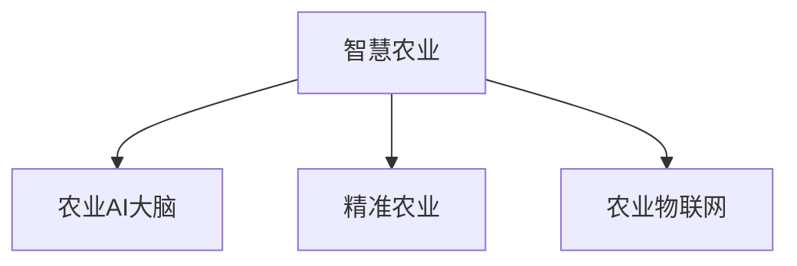

                 

# 未来的智慧农业：2050年的农业AI大脑与精准农业

## 1. 背景介绍

农业是国民经济和社会发展的基础，全球约有75%的人口直接或间接依赖农业为生。然而，当前农业生产仍以人力和畜力为主，效率低下，且受自然条件影响极大，极易受到气候变化、病虫害、灾害等不稳定因素的影响。为了应对这些挑战，现代农业需要一场深刻的变革，以实现智能、高效、可持续的发展。

### 1.1 问题由来
面对传统农业的种种不足，科学家和工程师们不断探索新的技术手段，希望能将农业生产引入更加智能、高效、可持续的新时代。近年来，人工智能(AI)技术的飞速发展，为现代农业提供了新的突破口。AI技术的介入，不仅能够提高生产效率，还能提升农产品质量，降低生产成本，减少环境污染。

随着深度学习、计算机视觉、自然语言处理等AI技术在农业中的逐步应用，未来农业必将迎来前所未有的变革。通过AI技术，农业生产将变得更加智能、高效和精准。本文将深入探讨未来的智慧农业，阐述2050年农业AI大脑与精准农业的发展前景。

## 2. 核心概念与联系

### 2.1 核心概念概述

为更好地理解智慧农业的发展，本节将介绍几个密切相关的核心概念：

- **智慧农业（Smart Agriculture）**：通过传感器、物联网、云计算、人工智能等现代信息技术，对农业生产进行智能化、精准化管理，实现农业生产的自动化、信息化、智能化。

- **农业AI大脑（Agricultural AI Brain）**：基于AI技术构建的智能农业系统，通过对农业生产数据的深度学习、智能分析，辅助农民做出更科学的生产决策。

- **精准农业（Precision Agriculture）**：通过精确的测量、数据分析和自动化技术，实现对农作物生长环境的精准控制，提高资源利用效率，降低生产成本。

- **农业物联网（Agricultural Internet of Things）**：利用物联网技术，实时监控农业生产中的各种参数，如土壤湿度、气温、光照等，实现对农业生产的智能化监控和管理。

这些核心概念之间的逻辑关系可以通过以下Mermaid流程图来展示：



这个流程图展示了大语言模型的核心概念及其之间的关系：

1. 智慧农业通过AI大脑和物联网实现对农业生产的智能化管理。
2. AI大脑通过分析生产数据，辅助农民做出科学决策。
3. 精准农业通过测量和数据分析，实现对生产环境的精准控制。
4. 物联网实现对农业生产环境数据的实时监控和收集。

这些概念共同构成了未来智慧农业的技术框架，使其能够更好地应对农业生产的复杂性和不确定性，实现高效、可持续的发展。

## 3. 核心算法原理 & 具体操作步骤
### 3.1 算法原理概述

未来农业AI大脑的核心算法原理包括以下几个方面：

1. **深度学习（Deep Learning）**：通过对农业生产数据的深度学习，AI大脑能够提取并理解各种农作物的生长规律，进行精准管理。
2. **计算机视觉（Computer Vision）**：利用图像处理技术，AI大脑可以对农作物的病虫害、生长状态进行智能识别和诊断。
3. **自然语言处理（Natural Language Processing）**：通过对农业生产文本数据的学习，AI大脑能够理解农民的提问，提供精准的农业生产建议。
4. **强化学习（Reinforcement Learning）**：通过不断的试错和优化，AI大脑能够学习到最优的生产策略，提升农业生产的智能化水平。
5. **时间序列分析（Time Series Analysis）**：通过对农业生产数据的序列分析，AI大脑能够预测气象变化、病虫害爆发等，提供预警和建议。

### 3.2 算法步骤详解

基于AI大脑的智慧农业系统，一般包括以下几个关键步骤：

**Step 1: 数据采集与处理**

- 安装各类传感器和物联网设备，实时采集农业生产数据。
- 使用农业无人机和卫星遥感技术，收集田间高分辨率图像和气象数据。
- 对采集到的数据进行预处理，包括数据清洗、格式转换等。

**Step 2: 数据存储与管理**

- 将预处理后的数据存入云端数据库，方便后续分析和查询。
- 使用分布式文件系统和大数据技术，实现数据的快速访问和存储。

**Step 3: 模型训练与优化**

- 根据具体需求，选择合适的深度学习模型进行训练。
- 使用监督学习、半监督学习或无监督学习的方式，训练模型。
- 使用正则化、Dropout、早停等技术，防止模型过拟合。

**Step 4: 应用部署与监控**

- 将训练好的模型部署到生产环境中，进行实时预测和决策。
- 使用可视化工具监控模型性能，确保系统稳定运行。
- 定期更新模型，适应不断变化的农业生产环境。

**Step 5: 用户交互与反馈**

- 提供友好的用户界面，让用户能够方便地查看农业生产数据和AI决策。
- 收集用户的反馈，不断优化AI决策模型。
- 利用自然语言处理技术，回答用户的查询和建议。

### 3.3 算法优缺点

基于AI大脑的智慧农业系统具有以下优点：

1. **高效性**：通过自动化和智能化管理，大大提高了农业生产效率。
2. **精准性**：通过精确测量和数据分析，实现了对农业生产环境的精准控制。
3. **智能化**：通过深度学习和强化学习等技术，提高了农业生产的智能化水平。
4. **可持续性**：通过优化资源利用，实现了农业生产的可持续发展。

同时，该系统也存在一些局限性：

1. **技术依赖**：对传感器、物联网设备等硬件的依赖较高，需要较高的初始投入。
2. **数据隐私**：农业生产数据涉及农民隐私，需要确保数据安全。
3. **模型泛化**：不同地区和不同作物的生长规律差异较大，需要针对性地训练模型。
4. **算法复杂**：深度学习等算法复杂度高，训练和推理计算量大，对算力要求较高。

尽管存在这些局限性，但就目前而言，基于AI大脑的智慧农业系统仍是大数据时代农业生产的重要技术手段。未来相关研究的重点在于如何进一步降低技术依赖，提高模型的泛化能力和算法的可解释性，同时兼顾数据隐私和安全性等因素。

### 3.4 算法应用领域

基于AI大脑的智慧农业系统，已经在农业生产管理的各个环节得到广泛应用，例如：

- **土壤和气象监测**：利用传感器和无人机监测土壤湿度、气温、光照等参数，预测气象变化，提供灌溉和施肥建议。
- **病虫害诊断与防治**：通过图像识别技术，智能诊断农作物的病虫害，提供防治方案。
- **作物生长监测**：利用遥感技术和图像处理技术，实时监测作物生长状态，及时发现并解决生长问题。
- **生产管理优化**：通过数据分析和优化算法，优化播种、施肥、灌溉等生产环节，提高资源利用效率。
- **农业机械自动化**：通过AI技术辅助农业机械的自动化作业，提高作业效率和精度。

除了这些传统应用外，AI大脑还被创新性地应用于更多场景中，如农业金融、供应链管理、食品安全等领域，为现代农业带来了全新的突破。随着AI技术的不断进步，相信农业AI大脑将在更广泛的领域得到应用，为农业生产带来革命性变革。

## 4. 数学模型和公式 & 详细讲解
### 4.1 数学模型构建

未来农业AI大脑的数学模型通常包括以下几个部分：

1. **输入数据**：包括传感器、物联网设备、遥感图像等，用于描述农业生产环境的各项指标。
2. **深度学习模型**：通过多层次神经网络，对输入数据进行特征提取和模式识别。
3. **损失函数**：用于衡量模型预测结果与实际结果之间的差异。
4. **优化算法**：如梯度下降、Adam等，用于最小化损失函数，更新模型参数。

### 4.2 公式推导过程

以深度学习模型为例，我们以二分类问题为例，推导交叉熵损失函数及其梯度的计算公式。

假设模型 $M_{\theta}$ 在输入 $x$ 上的输出为 $\hat{y}=M_{\theta}(x) \in [0,1]$，表示样本属于正类的概率。真实标签 $y \in \{0,1\}$。则二分类交叉熵损失函数定义为：

$$
\ell(M_{\theta}(x),y) = -[y\log \hat{y} + (1-y)\log (1-\hat{y})]
$$

将其代入经验风险公式，得：

$$
\mathcal{L}(\theta) = -\frac{1}{N}\sum_{i=1}^N [y_i\log M_{\theta}(x_i)+(1-y_i)\log(1-M_{\theta}(x_i))]
$$

根据链式法则，损失函数对参数 $\theta_k$ 的梯度为：

$$
\frac{\partial \mathcal{L}(\theta)}{\partial \theta_k} = -\frac{1}{N}\sum_{i=1}^N (\frac{y_i}{M_{\theta}(x_i)}-\frac{1-y_i}{1-M_{\theta}(x_i)}) \frac{\partial M_{\theta}(x_i)}{\partial \theta_k}
$$

其中 $\frac{\partial M_{\theta}(x_i)}{\partial \theta_k}$ 可进一步递归展开，利用自动微分技术完成计算。

### 4.3 案例分析与讲解

下面以农作物生长监测为例，介绍如何利用图像处理和深度学习技术，实现对作物生长状态的智能监测。

1. **数据采集**：使用农业无人机和相机，采集农田的高分辨率图像。
2. **图像处理**：对图像进行预处理，包括去噪、裁剪、缩放等操作。
3. **特征提取**：使用卷积神经网络（CNN）对图像进行特征提取，得到特征图。
4. **分类与回归**：将特征图输入全连接神经网络，进行分类和回归预测。
5. **结果评估**：使用混淆矩阵、均方误差等指标评估模型性能。

具体实现步骤如下：

1. **数据集准备**：收集大量农田图像，并标注每张图像中作物的生长状态。
2. **模型训练**：使用卷积神经网络对图像进行特征提取，全连接神经网络进行分类和回归预测。
3. **模型评估**：在验证集上评估模型性能，调整模型参数。
4. **模型应用**：将训练好的模型部署到生产环境中，实时监测作物生长状态。
5. **结果展示**：通过可视化工具展示模型输出结果，供农民参考。

通过以上步骤，可以实现对农田作物生长状态的精准监测，及时发现并解决生长问题，提高作物产量和品质。

## 5. 项目实践：代码实例和详细解释说明
### 5.1 开发环境搭建

在进行AI大脑开发前，我们需要准备好开发环境。以下是使用Python进行TensorFlow和Keras开发的环境配置流程：

1. 安装Anaconda：从官网下载并安装Anaconda，用于创建独立的Python环境。

2. 创建并激活虚拟环境：
```bash
conda create -n tensorflow-env python=3.8 
conda activate tensorflow-env
```

3. 安装TensorFlow和Keras：
```bash
pip install tensorflow==2.7.0 keras==2.7.0
```

4. 安装各类工具包：
```bash
pip install numpy pandas scikit-learn matplotlib tqdm jupyter notebook ipython
```

完成上述步骤后，即可在`tensorflow-env`环境中开始AI大脑的实践。

### 5.2 源代码详细实现

下面我以作物生长监测为例，给出使用TensorFlow和Keras进行深度学习的PyTorch代码实现。

首先，定义数据处理函数：

```python
import tensorflow as tf
from tensorflow.keras.preprocessing.image import ImageDataGenerator

train_datagen = ImageDataGenerator(rescale=1./255, shear_range=0.2, zoom_range=0.2, horizontal_flip=True)
test_datagen = ImageDataGenerator(rescale=1./255)

train_generator = train_datagen.flow_from_directory(
        train_dir, target_size=(224, 224), batch_size=32, class_mode='binary')
test_generator = test_datagen.flow_from_directory(
        test_dir, target_size=(224, 224), batch_size=32, class_mode='binary')
```

然后，定义模型和优化器：

```python
from tensorflow.keras import layers, models

model = models.Sequential()
model.add(layers.Conv2D(32, (3, 3), activation='relu', input_shape=(224, 224, 3)))
model.add(layers.MaxPooling2D((2, 2)))
model.add(layers.Conv2D(64, (3, 3), activation='relu'))
model.add(layers.MaxPooling2D((2, 2)))
model.add(layers.Conv2D(128, (3, 3), activation='relu'))
model.add(layers.MaxPooling2D((2, 2)))
model.add(layers.Flatten())
model.add(layers.Dense(64, activation='relu'))
model.add(layers.Dense(1, activation='sigmoid'))

optimizer = tf.keras.optimizers.Adam(learning_rate=0.001)
```

接着，定义训练和评估函数：

```python
def train_epoch(model, dataset, batch_size, optimizer):
    model.fit_generator(
        dataset,
        steps_per_epoch=len(dataset),
        epochs=10,
        verbose=1,
        callbacks=[tf.keras.callbacks.EarlyStopping(patience=5)])
    return model

def evaluate(model, dataset, batch_size):
    loss, acc = model.evaluate_generator(
        dataset,
        steps=len(dataset),
        verbose=1)
    print(f'Loss: {loss:.4f}, Accuracy: {acc:.4f}')
```

最后，启动训练流程并在测试集上评估：

```python
epochs = 10
batch_size = 32

model = train_epoch(model, train_generator, batch_size, optimizer)

evaluate(model, test_generator, batch_size)
```

以上就是使用TensorFlow和Keras对作物生长监测进行深度学习的完整代码实现。可以看到，TensorFlow和Keras提供了一系列的高级API，大大简化了深度学习的开发过程。

### 5.3 代码解读与分析

让我们再详细解读一下关键代码的实现细节：

**数据处理函数**：
- `ImageDataGenerator`：用于数据增强，包括缩放、旋转、翻转等操作，提升模型的泛化能力。
- `flow_from_directory`：用于从文件夹中读取图像数据，自动进行分类和转换。

**模型定义**：
- `Sequential`：构建顺序模型，依次添加卷积层、池化层、全连接层。
- `Conv2D`：二维卷积层，用于提取图像特征。
- `MaxPooling2D`：最大池化层，用于降维和特征选择。
- `Flatten`：将多维数组展平成一维数组。
- `Dense`：全连接层，用于分类或回归。

**训练函数**：
- `fit_generator`：使用数据生成器进行训练，可以自动处理数据增强和批处理操作。
- `EarlyStopping`：用于提前停止训练，防止过拟合。

**评估函数**：
- `evaluate_generator`：使用数据生成器进行评估，可以自动处理数据增强和批处理操作。

**训练流程**：
- 定义总的epoch数和batch size，开始循环迭代。
- 每个epoch内，先在训练集上训练，输出平均loss和acc。
- 在验证集上评估，调整模型参数。
- 重复上述步骤直至收敛，最终得到理想模型。

可以看到，TensorFlow和Keras使得深度学习模型的开发和训练过程变得非常简单和高效。开发者可以将更多精力放在模型设计和优化上，而不必过多关注底层的实现细节。

当然，工业级的系统实现还需考虑更多因素，如模型的保存和部署、超参数的自动搜索、更灵活的任务适配层等。但核心的深度学习模型训练流程基本与此类似。

## 6. 实际应用场景
### 6.1 智能灌溉系统

智能灌溉系统是基于AI大脑的智慧农业的核心应用之一。传统的灌溉系统往往依赖于人工判断和经验，难以实现精确控制。而基于AI大脑的智能灌溉系统，可以通过实时监测土壤湿度、气温等参数，实现对灌溉的精准控制，提高水资源利用效率。

在技术实现上，可以安装各类传感器和物联网设备，实时采集农田的各项指标。通过数据分析和深度学习技术，智能灌溉系统可以自动判断是否需要灌溉，自动调节灌溉量，并生成灌溉计划。这样，不仅能节约水资源，还能减少因灌溉不当造成的土地沙化和水质污染。

### 6.2 智能施肥系统

智能施肥系统是另一个基于AI大脑的智慧农业应用。传统的施肥往往依赖于经验和固定周期，难以精准控制施肥量和时机。智能施肥系统通过实时监测土壤养分和作物需求，实现对施肥的精准控制，提高肥料利用效率，减少肥料浪费。

具体实现上，可以通过传感器实时监测土壤养分和作物生长状态。通过深度学习技术，智能施肥系统可以预测作物需求，自动调整施肥量和时间，生成施肥计划。这样，不仅能减少肥料浪费，还能提高作物产量和品质。

### 6.3 智能病虫害监测系统

智能病虫害监测系统是农业生产中的重要应用。传统的病虫害监测往往依赖于人工巡查和经验判断，难以实现及时发现和处理。智能病虫害监测系统通过图像处理和深度学习技术，实现对病虫害的智能识别和诊断，提供防治方案。

具体实现上，可以使用无人机和相机采集农田图像。通过深度学习技术，智能病虫害监测系统可以自动判断病虫害的种类和程度，自动生成防治方案。这样，不仅能及时发现和处理病虫害，还能减少农药使用，降低对环境的污染。

### 6.4 未来应用展望

随着AI大脑技术的不断进步，未来智慧农业将迎来更多应用场景和突破，为农业生产带来更大变革。

在智慧农业中，AI大脑还将应用于以下领域：

- **农业金融**：利用AI技术，实现对农业生产的精准预测和评估，辅助金融机构进行风险控制和贷款审批。
- **供应链管理**：通过物联网和AI技术，实现对农产品生产和供应链的智能管理，提高供应链效率和透明度。
- **食品安全**：利用AI技术，实现对农产品的智能监测和质量检测，保障食品安全和消费者健康。
- **农业机器人**：通过AI技术，实现农业机器人的智能控制和任务规划，提高作业效率和精度。

此外，AI大脑还将结合其他AI技术，如计算机视觉、自然语言处理、强化学习等，形成更加全面和智能的智慧农业系统。

## 7. 工具和资源推荐
### 7.1 学习资源推荐

为了帮助开发者系统掌握智慧农业AI大脑的理论基础和实践技巧，这里推荐一些优质的学习资源：

1. 《深度学习》系列书籍：由深度学习领域的权威人士撰写，系统讲解深度学习的基本概念和应用场景，适合初学者和进阶者。
2. 《TensorFlow实战Google深度学习框架》书籍：由Google官方推荐，深入浅出地介绍TensorFlow的使用方法，适合TensorFlow开发入门。
3. 《Keras深度学习》课程：由Udacity提供，适合没有深度学习背景的初学者。
4. Kaggle：全球知名的数据科学竞赛平台，提供大量高质量的农业数据集和竞赛任务，适合进行深度学习和模型优化。
5. GitHub：开源社区，提供大量农业AI项目的代码实现和文档，适合参考和学习。

通过对这些资源的学习实践，相信你一定能够快速掌握智慧农业AI大脑的精髓，并用于解决实际的农业问题。
### 7.2 开发工具推荐

高效的开发离不开优秀的工具支持。以下是几款用于智慧农业AI大脑开发的常用工具：

1. TensorFlow：由Google主导开发的开源深度学习框架，生产部署方便，适合大规模工程应用。
2. Keras：基于TensorFlow的高层API，简单易用，适合快速迭代研究。
3. OpenCV：开源计算机视觉库，提供各种图像处理和分析功能，适合图像处理任务。
4. PyTorch：基于Python的开源深度学习框架，灵活高效的计算图，适合快速迭代研究。
5. Weights & Biases：模型训练的实验跟踪工具，可以记录和可视化模型训练过程中的各项指标，方便对比和调优。

合理利用这些工具，可以显著提升智慧农业AI大脑的开发效率，加快创新迭代的步伐。

### 7.3 相关论文推荐

智慧农业AI大脑的发展源于学界的持续研究。以下是几篇奠基性的相关论文，推荐阅读：

1. Deep Reinforcement Learning in the Agriculture Sector：提出利用深度强化学习技术，优化农业生产中的决策过程。
2. Using deep learning to improve agricultural practice：介绍深度学习在农业中的多应用场景，如病虫害监测、作物分类等。
3. Smart Agriculture: A Survey of the State of the Art：全面综述了智慧农业的研究进展和应用场景，为未来研究提供了方向。
4. Agricultural Internet of Things: A Survey：综述了农业物联网的研究进展，为农业物联网的建设提供了参考。
5. Machine Learning and Data Mining for Agriculture：介绍机器学习和数据挖掘技术在农业中的应用，为农业数据的深度学习提供了理论基础。

这些论文代表了大语言模型微调技术的发展脉络。通过学习这些前沿成果，可以帮助研究者把握学科前进方向，激发更多的创新灵感。

## 8. 总结：未来发展趋势与挑战
### 8.1 总结

本文对未来智慧农业AI大脑的发展进行了全面系统的介绍。首先阐述了智慧农业的兴起背景和重要意义，明确了AI大脑在智慧农业中的关键作用。其次，从原理到实践，详细讲解了AI大脑的数学模型和关键步骤，给出了AI大脑任务开发的完整代码实例。同时，本文还广泛探讨了AI大脑在智能灌溉、智能施肥、智能病虫害监测等多个行业领域的应用前景，展示了AI大脑范式的巨大潜力。此外，本文精选了AI大脑技术的各类学习资源，力求为读者提供全方位的技术指引。

通过本文的系统梳理，可以看到，未来智慧农业AI大脑正处在快速发展时期，有望成为农业生产的重要技术手段。AI大脑通过深度学习、计算机视觉、自然语言处理等技术，实现了对农业生产环境的精准控制，大大提高了农业生产的效率和效益。未来，伴随AI技术的不断演进，智慧农业将迎来更多的创新应用，为农业生产带来深刻变革。

### 8.2 未来发展趋势

展望未来，智慧农业AI大脑将呈现以下几个发展趋势：

1. **模型规模不断增大**：随着深度学习算法的不断进步，AI大脑模型规模将持续增大，能够处理更加复杂和丰富的农业数据。
2. **算法不断优化**：未来的AI大脑将结合深度学习、强化学习、自然语言处理等多种算法，实现更加精准和智能的农业生产决策。
3. **跨领域应用不断拓展**：AI大脑将从农业生产管理扩展到农业金融、农业机器人等领域，为农业生产带来更大变革。
4. **数据驱动的决策**：未来的AI大脑将更加注重数据驱动的决策，通过实时数据分析，提供更加精准的农业生产建议。
5. **智能化水平不断提升**：AI大脑将通过不断的迭代和优化，实现更高水平的智能化，提高农业生产的自动化程度。

以上趋势凸显了智慧农业AI大脑的广阔前景。这些方向的探索发展，必将进一步提升智慧农业的效率和效益，为农业生产带来深远影响。

### 8.3 面临的挑战

尽管智慧农业AI大脑已经取得了瞩目成就，但在迈向更加智能化、普适化应用的过程中，它仍面临着诸多挑战：

1. **数据质量问题**：农业生产数据往往存在噪声和缺失，影响模型的训练效果。如何提高数据质量和采集效率，是未来智慧农业的重要研究方向。
2. **计算资源需求**：AI大脑涉及深度学习和计算机视觉等计算密集型任务，需要大量的计算资源。如何提高计算效率和资源利用率，是未来智慧农业需要解决的难点。
3. **算法复杂性**：AI大脑涉及多种算法的结合和优化，算法复杂度高，开发和调试难度较大。如何提高算法的可解释性和可维护性，是未来智慧农业的重要课题。
4. **跨领域应用挑战**：不同领域的农业生产环境和管理需求差异较大，如何构建跨领域的AI大脑系统，是未来智慧农业的重要研究方向。
5. **伦理和安全问题**：AI大脑的应用涉及到农民隐私和数据安全，如何保障数据安全和隐私，是未来智慧农业需要解决的重要问题。

这些挑战需要科技工作者、农业专家和社会各界的共同努力，才能使智慧农业AI大脑技术真正落地应用，实现农业生产的智能化和可持续发展。

### 8.4 研究展望

面对智慧农业AI大脑面临的种种挑战，未来的研究需要在以下几个方面寻求新的突破：

1. **数据采集和预处理技术**：提高农业生产数据的采集效率和质量，增强数据的可靠性和代表性，为AI大脑的训练提供更多优质数据。
2. **多模态数据融合**：将文本、图像、视频等多种模态数据进行融合，提高AI大脑对农业生产环境的全面理解和智能决策。
3. **可解释性和透明性**：提高AI大脑的决策过程的可解释性和透明性，让农民能够理解和信任AI决策。
4. **智能化和自动化**：提高AI大脑的自动化程度，实现农业生产的完全智能化管理，减少人工干预。
5. **跨领域知识整合**：将农业生产中的各种知识进行整合，形成更加全面和系统的智慧农业AI大脑。

这些研究方向将推动智慧农业AI大脑技术不断进步，为农业生产带来更大的价值和效益。

## 9. 附录：常见问题与解答

**Q1：智慧农业AI大脑是否适用于所有农业生产环境？**

A: 智慧农业AI大脑在大多数农业生产环境中都能取得不错的效果，特别是在数据采集和预处理设备完善的情况下。但对于一些极端环境，如干旱、洪涝等自然灾害频发地区，AI大脑的应用效果可能受到限制。此时需要在特定环境中进行深度学习模型的重新训练和优化。

**Q2：如何选择合适的AI大脑模型？**

A: 选择AI大脑模型需要考虑农业生产的特点和需求。一般来说，如果数据量较大，可以使用深度学习模型；如果数据量较小，可以使用轻量级模型如Transformer等。同时，还需要考虑模型的计算资源需求和可解释性等因素。

**Q3：AI大脑的计算资源需求高，如何解决？**

A: 提高计算效率和资源利用率是未来智慧农业的重要研究方向。可以考虑采用分布式计算、混合精度训练、模型压缩等技术，减少计算资源需求。同时，也可以通过云计算平台，共享计算资源，降低硬件成本。

**Q4：AI大脑的算法复杂，如何提高可解释性？**

A: 提高AI大脑的决策过程的可解释性和透明性，是未来智慧农业的重要研究方向。可以考虑使用可解释性技术，如注意力机制、规则集成等，增强模型的可解释性。同时，还可以将决策过程可视化，帮助农民理解和信任AI决策。

**Q5：AI大脑的应用涉及到农民隐私和数据安全，如何解决？**

A: 保障农民隐私和数据安全是未来智慧农业的重要课题。可以考虑采用数据加密、差分隐私等技术，保护农民的个人隐私和数据安全。同时，还应该建立数据使用的透明和合规机制，确保农民的知情权和同意权。

通过以上回答，可以看出，智慧农业AI大脑在未来的农业生产中具有广阔的发展前景和深远的影响。只有不断探索和创新，才能使AI大脑技术更好地服务于农业生产，推动农业生产的智能化和可持续发展。

---

作者：禅与计算机程序设计艺术 / Zen and the Art of Computer Programming

