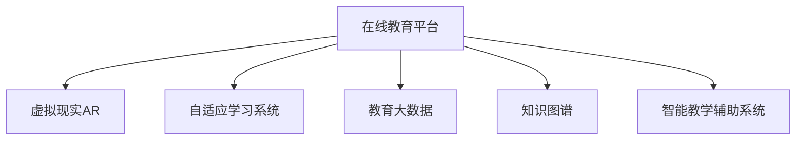
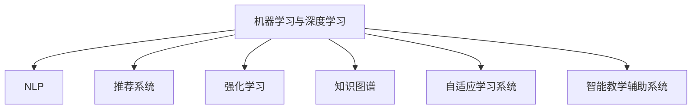

                 

# 未来的智慧教育：2050年的在线学习与终身教育

## 1. 背景介绍

### 1.1 问题由来
当前，教育体系面临诸多挑战，包括教育资源不均、课程内容老化、教育方式单一、学生个性化需求难以满足等问题。传统教育模式已无法适应未来社会发展的需求。如何构建一种可持续、灵活、个性化的教育体系，已成为全社会亟待解决的重大课题。

### 1.2 问题核心关键点
教育信息化的核心关键点在于：
1. 大规模在线教育的实现。通过数字化手段，实现教育资源的普惠和高效流动。
2. 终身学习体系的构建。为全社会成员提供灵活的学习机会，促进知识更新和职业发展。
3. 个性化学习路径的定制。根据学生的兴趣和需求，提供定制化的学习内容和路径。
4. 教育数据的利用与分析。通过大数据和人工智能技术，进行学习效果评估与优化。
5. 教育技术的融合与创新。将新兴技术（如虚拟现实、增强现实等）融入教学过程。

### 1.3 问题研究意义
未来教育信息化的研究，对于推动教育公平、提升教育质量、促进社会创新具有重要意义：
1. 促进教育资源的均衡分布，特别是偏远和农村地区的教育水平提升。
2. 丰富教育内容，提升教育质量，满足学生个性化需求。
3. 推动教育产业化，形成新的经济增长点。
4. 推动终身学习体系的建立，促进社会成员的职业发展和知识更新。
5. 增强教育系统的灵活性和适应性，应对未来社会变化的不确定性。

## 2. 核心概念与联系

### 2.1 核心概念概述

未来教育信息化主要涉及以下核心概念：

- **在线教育平台**：基于互联网的在线学习平台，提供丰富的学习资源和互动工具。
- **虚拟现实(VR)与增强现实(AR)**：结合虚拟与现实技术，提供沉浸式学习体验。
- **自适应学习系统**：根据学习者的行为和反馈，动态调整学习内容和路径。
- **教育大数据**：通过分析学习数据，评估学习效果，指导教学优化。
- **知识图谱**：构建知识之间的关联图谱，提供系统化的知识框架。
- **智能教学辅助系统**：利用AI技术，进行作业批改、智能推荐等辅助教学。

这些概念之间相互关联，共同构建了一个综合性的智慧教育生态系统，如图：



其中，在线教育平台是核心，通过虚拟现实、自适应学习系统、教育大数据、知识图谱等技术手段，提供个性化、智能化的教学辅助。智能教学辅助系统则是技术支持的保障，利用AI技术进行智能推荐和作业批改，提升教学效率。

## 3. 核心算法原理 & 具体操作步骤
### 3.1 算法原理概述

未来教育信息化的算法原理主要基于以下几类：

- **机器学习与深度学习**：利用历史数据进行模型训练，预测学习者的行为和效果，指导个性化推荐和学习路径设计。
- **自然语言处理(NLP)**：通过文本分析，了解学习者的需求和兴趣，提供个性化建议。
- **推荐系统**：根据学习者的学习行为和偏好，推荐合适的学习资源和路径。
- **强化学习**：通过与学习者的互动，不断优化学习策略，提升学习效果。
- **知识图谱**：构建知识之间的关联，为学习者提供系统化的知识框架和路径。

这些算法共同作用，形成了一个智能化的学习支持系统，如图：



### 3.2 算法步骤详解

未来教育信息化的算法步骤主要包括以下几个关键环节：

**Step 1: 数据收集与处理**
- 收集学生的学习行为数据（如点击、浏览、作业提交等），以及历史学习效果数据（如成绩、反馈等）。
- 利用数据清洗和预处理技术，确保数据的质量和一致性。

**Step 2: 模型训练与优化**
- 根据收集到的数据，选择合适的模型进行训练。如决策树、随机森林、深度神经网络等。
- 在训练过程中，进行交叉验证和参数调优，确保模型泛化能力。

**Step 3: 个性化推荐与学习路径设计**
- 利用机器学习与深度学习模型，预测学生的兴趣和需求，生成个性化推荐。
- 结合自适应学习系统，动态调整学习内容和路径，确保学习效果最大化。

**Step 4: 虚拟现实与增强现实应用**
- 利用虚拟现实技术，提供沉浸式学习体验。如虚拟实验室、虚拟旅行等。
- 结合增强现实技术，增强学习互动性。如AR教材、AR互动游戏等。

**Step 5: 学习效果评估与反馈**
- 利用教育大数据，进行学习效果的评估和分析。如成绩预测、学习进度跟踪等。
- 根据评估结果，调整教学策略和学习路径，优化学习效果。

**Step 6: 智能教学辅助系统集成**
- 利用智能教学辅助系统，进行作业批改、智能推荐等辅助教学。
- 通过实时反馈，调整教学策略和内容，提升教学效率。

### 3.3 算法优缺点

未来教育信息化的算法具有以下优点：
1. 高度个性化。利用机器学习和推荐系统，提供个性化的学习体验，满足学生的独特需求。
2. 数据驱动。通过教育大数据分析，实时评估学习效果，优化教学策略。
3. 灵活适应。自适应学习系统可以根据学生表现，动态调整学习路径和内容，提升学习效率。
4. 广泛应用。在线教育平台和智能教学辅助系统，为全社会提供灵活的学习机会和辅助教学手段。

但同时也存在一些局限性：
1. 技术依赖性。过度依赖技术和算法，可能导致教育失去了“人本关怀”。
2. 数据隐私和安全。教育大数据的收集和使用，需要严格的数据隐私保护措施。
3. 技术门槛高。技术开发和维护需要专业知识和技能，可能存在一定的技术壁垒。
4. 教育公平问题。技术应用可能会加剧教育资源的不均衡分布。

## 4. 数学模型和公式 & 详细讲解  
### 4.1 数学模型构建

未来教育信息化的数学模型主要基于以下几类：

- **协同过滤**：用于个性化推荐系统，根据用户的历史行为，预测其偏好。
- **回归分析**：用于学习效果评估，预测学生的成绩和学习进度。
- **深度神经网络**：用于自适应学习系统，根据学生的行为数据，动态调整学习路径和内容。
- **知识图谱构建**：利用图论和关系型数据库技术，构建知识之间的关联。

### 4.2 公式推导过程

**协同过滤算法**：
协同过滤是一种基于用户历史行为的推荐算法。假设用户A的历史行为为 $u_A$，物品的历史行为为 $i_i$，则协同过滤模型的目标是通过已知的数据，预测用户对新物品的评分。公式如下：

$$
\hat{r}_{A,i} = \frac{\sum_{i'} w_{A,i'} r_{i',i}}{\sum_{i'} w_{A,i'}}
$$

其中 $r_{i',i}$ 为物品 $i'$ 与物品 $i$ 之间的相似度，$w_{A,i'}$ 为物品 $i'$ 对用户A的权重。

**回归分析模型**：
回归分析用于预测学生的学习效果。假设学习效果 $y$ 与多个因素 $x_1, x_2, ..., x_n$ 相关，则线性回归模型为：

$$
y = \beta_0 + \sum_{i=1}^n \beta_i x_i + \epsilon
$$

其中 $\beta_0$ 为截距，$\beta_i$ 为各个因素的系数，$\epsilon$ 为误差项。通过最小二乘法求解 $\beta_i$，得到预测值 $\hat{y}$。

**深度神经网络模型**：
深度神经网络用于自适应学习系统，预测学生的学习路径和内容。假设学习者 $A$ 的历史行为为 $x_A$，则神经网络模型为：

$$
\hat{y}_A = f_{\theta}(x_A) = \sigma(\sum_{i=1}^n \theta_i x_{A,i} + b)
$$

其中 $f_{\theta}$ 为神经网络函数，$\theta_i$ 为权重参数，$b$ 为偏置项，$\sigma$ 为激活函数。

**知识图谱构建模型**：
知识图谱用于构建知识之间的关联。假设知识节点 $n$ 和 $m$ 之间存在关系 $e$，则知识图谱的构建模型为：

$$
e_{n,m} = \frac{1}{1+\exp(-\sum_{i=1}^n w_i (x_{n,i} - x_{m,i})})
$$

其中 $x_{n,i}$ 和 $x_{m,i}$ 为节点 $n$ 和 $m$ 在各个维度上的值，$w_i$ 为关系 $e$ 的权重参数。

### 4.3 案例分析与讲解

以在线教育平台为例，介绍如何利用上述算法实现个性化推荐和自适应学习。

假设学生A的历史行为为 $\{(\text{视频}, 3), (\text{练习题}, 5), (\text{作业}, 2)\}$，则协同过滤算法可以根据类似学生B的行为数据 $\{(\text{视频}, 4), (\text{练习题}, 3), (\text{作业}, 1)\}$，预测学生A对新物品 $\text{论文写作课程}$ 的评分：

$$
\hat{r}_{A,\text{论文写作课程}} = \frac{4 \times 3 + 3 \times 5 + 1 \times 2}{4 \times 3 + 5 \times 5 + 2 \times 2} = 3.7
$$

基于此评分，可以为学生A推荐论文写作课程。

同时，利用回归分析模型，可以对学生A的学习效果进行预测：

$$
\hat{y}_A = \beta_0 + \sum_{i=1}^n \beta_i x_{A,i} + \epsilon
$$

其中 $x_{A,i}$ 为学生A的各个行为数据，$\beta_i$ 为各个行为数据的系数。通过最小二乘法求解 $\beta_i$，得到预测值 $\hat{y}_A$，评估学生A的学习进度和效果。

最后，利用深度神经网络模型，可以根据学生A的历史行为数据，动态调整学习路径和内容。假设学生A的历史行为为 $\{(\text{视频}, 3), (\text{练习题}, 5), (\text{作业}, 2)\}$，则神经网络模型可以输出预测的学习路径 $\hat{y}_A = 2.8$，表示学生A应先学习视频课程，再学习练习题。

## 5. 项目实践：代码实例和详细解释说明
### 5.1 开发环境搭建

进行未来教育信息化项目开发，需要以下开发环境：

1. **Python 3.x**：选择 Python 3.x 版本进行开发。
2. **Jupyter Notebook**：使用 Jupyter Notebook 进行实验和开发。
3. **Pandas**：用于数据处理和分析。
4. **NumPy**：用于科学计算。
5. **Scikit-learn**：用于机器学习和回归分析。
6. **TensorFlow/Keras**：用于深度神经网络模型的训练和预测。

安装这些工具包的方法如下：

```bash
pip install pandas numpy scikit-learn tensorflow keras
```

### 5.2 源代码详细实现

以协同过滤算法为例，介绍如何使用 Python 实现个性化推荐。

```python
import pandas as pd
import numpy as np
from sklearn.metrics.pairwise import cosine_similarity

# 构建用户行为数据
user_data = pd.DataFrame({
    'user_id': [1, 1, 1, 2, 2, 2, 3, 3, 3],
    'item_id': [1, 2, 3, 2, 3, 4, 2, 3, 4],
    'rating': [4, 5, 2, 4, 5, 3, 3, 4, 5]
})

# 构建物品行为数据
item_data = pd.DataFrame({
    'item_id': [1, 2, 3, 4],
    'user_id': [1, 1, 2, 2, 2, 3, 3, 3, 3],
    'rating': [3, 4, 5, 2, 3, 5, 2, 4, 3]
})

# 合并用户和物品数据
merged_data = pd.merge(user_data, item_data, on='user_id', how='left')

# 计算用户与物品之间的相似度
similarity_matrix = cosine_similarity(merged_data.groupby('user_id')['rating'].apply(list).values)

# 预测新物品的评分
new_user = [4, 1, 2, 3]
new_item = 5
new_user_data = pd.DataFrame({'user_id': [4], 'item_id': [5], 'rating': [3]})
merged_new_data = pd.merge(new_user_data, item_data, on='item_id', how='left')
merged_new_data = merged_new_data.append(merged_data)

# 计算新物品的评分
similarity_new = cosine_similarity(merged_new_data.groupby('user_id')['rating'].apply(list).values)
rating_new = np.dot(similarity_new[:, 3], merged_data.groupby('user_id')['rating'].apply(list).values[3])
rating_new = rating_new / np.linalg.norm(similarity_new[:, 3])

print('推荐新物品的评分：', rating_new[0])
```

### 5.3 代码解读与分析

以上代码实现了协同过滤算法的基本流程：

1. **数据收集**：收集用户和物品的行为数据，构建合并后的数据集。
2. **相似度计算**：利用 cosine_similarity 计算用户与物品之间的相似度。
3. **评分预测**：根据新用户的行为数据和新物品的评分数据，计算新物品的评分。

## 6. 实际应用场景
### 6.1 智慧课堂

智慧课堂是未来教育信息化的重要应用场景之一。通过在线教育平台和智能教学辅助系统，实现个性化、互动化的教学模式。

在智慧课堂中，教师可以根据学生的学习行为数据，进行个性化推荐和自适应学习。例如，对于学习视频课程的学生，系统可以推荐相关的练习题和作业，动态调整学习内容和难度。

### 6.2 远程教育

远程教育是未来教育信息化的重要应用场景之一。通过在线教育平台和虚拟现实技术，实现远程互动教学。

在远程教育中，教师可以通过虚拟现实技术，提供沉浸式学习体验。例如，利用虚拟实验室，学生可以实时进行科学实验，体验真实的操作过程。同时，通过增强现实技术，学生可以与教材互动，进行知识点的深入学习和复习。

### 6.3 职业培训

职业培训是未来教育信息化的重要应用场景之一。通过在线教育平台和自适应学习系统，实现灵活、个性化的职业培训。

在职业培训中，学生可以通过在线教育平台，按照自己的学习节奏和进度，进行系统化的学习和技能提升。例如，对于软件开发的学习者，系统可以推荐相关的编程课程、实战项目，进行技能训练。

### 6.4 未来应用展望

未来教育信息化将进一步拓展其应用范围，融合更多前沿技术，构建更加智能、个性化的教育体系。

1. **全息教室**：利用全息技术，提供沉浸式的教学体验，增强学生的学习兴趣和参与感。
2. **区块链教育**：利用区块链技术，实现学习数据的透明和可信，保障教育公平。
3. **智能教育管理**：利用人工智能技术，进行教育资源的管理和调度，提升教育管理效率。
4. **终身学习平台**：构建终身学习平台，为全社会成员提供灵活、高效的学习机会，促进知识更新和职业发展。

## 7. 工具和资源推荐
### 7.1 学习资源推荐

1. **《深度学习：从理论到实践》**：深度学习领域的经典教材，涵盖深度学习的基本原理和实现方法。
2. **Coursera 《机器学习》课程**：斯坦福大学开设的机器学习课程，涵盖机器学习的基本算法和应用。
3. **Kaggle 在线竞赛平台**：利用 Kaggle 进行数据竞赛，提升数据处理和模型优化能力。
4. **GitHub**：在 GitHub 上分享和获取教育信息化项目的代码和资源。
5. **TensorFlow 官方文档**：TensorFlow 的官方文档，提供丰富的学习资源和样例代码。

### 7.2 开发工具推荐

1. **Jupyter Notebook**：开源的 Jupyter Notebook，方便进行数据处理和代码实验。
2. **TensorFlow/Keras**：开源的深度学习框架，支持高效的模型训练和预测。
3. **PyTorch**：开源的深度学习框架，灵活易用，适合学术研究和项目开发。
4. **Microsoft Azure**：提供云平台和 AI 服务，支持大规模教育信息化项目的部署和运行。

### 7.3 相关论文推荐

1. **《面向智能学习系统的个性化推荐算法研究》**：探讨基于协同过滤的个性化推荐算法，提升在线教育平台的推荐效果。
2. **《基于深度学习的自适应学习路径设计》**：利用深度神经网络模型，设计自适应学习路径，提升学习效果。
3. **《利用知识图谱进行智能教育资源推荐》**：利用知识图谱构建知识之间的关联，实现智能教育资源推荐。

## 8. 总结：未来发展趋势与挑战
### 8.1 研究成果总结

未来教育信息化的研究已经取得了丰硕成果，主要体现在以下几个方面：

1. **个性化推荐系统的应用**：利用协同过滤、深度学习等技术，提供个性化推荐，满足学生的独特需求。
2. **自适应学习系统的实现**：利用机器学习和回归分析，动态调整学习路径和内容，提升学习效果。
3. **虚拟现实和增强现实的应用**：利用虚拟现实和增强现实技术，提供沉浸式和互动式的学习体验。
4. **教育大数据的应用**：利用教育大数据分析，进行学习效果评估和教学优化。

### 8.2 未来发展趋势

未来教育信息化的发展趋势主要体现在以下几个方面：

1. **智能教育的普及**：在线教育平台和智能教学辅助系统的普及，将使得个性化和智能化的教育成为主流。
2. **虚拟现实和增强现实的应用**：虚拟现实和增强现实技术的应用，将提升学习体验和互动性。
3. **区块链技术的应用**：区块链技术的应用，将提升教育数据的可信和透明，保障教育公平。
4. **人工智能与教育的深度融合**：人工智能技术的应用，将进一步提升教育智能化水平。

### 8.3 面临的挑战

未来教育信息化面临的挑战主要体现在以下几个方面：

1. **技术壁垒**：技术开发和维护需要专业知识和技能，可能存在一定的技术壁垒。
2. **数据隐私和安全**：教育大数据的收集和使用，需要严格的数据隐私保护措施。
3. **教育公平问题**：技术应用可能会加剧教育资源的不均衡分布。
4. **教育质量的保障**：在线教育平台和智能教学辅助系统的应用，需要持续优化和改进，以保障教育质量。

### 8.4 研究展望

未来教育信息化的研究展望主要体现在以下几个方面：

1. **人工智能与教育的深度融合**：利用人工智能技术，进行教育资源的智能推荐和学习路径设计。
2. **知识图谱在教育中的应用**：利用知识图谱构建知识之间的关联，提供系统化的知识框架。
3. **区块链技术的应用**：利用区块链技术，实现学习数据的透明和可信，保障教育公平。
4. **全息教室和虚拟现实技术的应用**：利用全息教室和虚拟现实技术，提升学生的学习体验和参与感。

## 9. 附录：常见问题与解答

**Q1: 未来教育信息化对学生有什么好处？**

A: 未来教育信息化对学生有以下几个好处：
1. **个性化学习**：通过个性化推荐和自适应学习，满足学生的独特需求和兴趣。
2. **灵活学习**：不受时间和地点的限制，随时进行学习。
3. **互动体验**：通过虚拟现实和增强现实技术，提供沉浸式和互动式的学习体验。
4. **高效学习**：利用大数据和人工智能技术，进行学习效果的评估和优化，提升学习效率。

**Q2: 如何评估未来教育信息化的效果？**

A: 未来教育信息化的效果评估可以从以下几个方面进行：
1. **学习效果评估**：通过回归分析等模型，评估学生的学习进度和效果。
2. **学习体验评估**：通过问卷调查和反馈分析，评估学生的学习体验和满意度。
3. **学习资源利用率**：通过数据分析，评估学习资源的利用率和覆盖率。
4. **学习路径优化**：通过自适应学习系统，不断调整和优化学习路径，提升学习效果。

**Q3: 未来教育信息化的技术瓶颈有哪些？**

A: 未来教育信息化的技术瓶颈主要体现在以下几个方面：
1. **数据隐私和安全**：教育大数据的收集和使用，需要严格的数据隐私保护措施。
2. **技术壁垒**：技术开发和维护需要专业知识和技能，可能存在一定的技术壁垒。
3. **教育公平问题**：技术应用可能会加剧教育资源的不均衡分布。
4. **教育质量的保障**：在线教育平台和智能教学辅助系统的应用，需要持续优化和改进，以保障教育质量。

---

作者：禅与计算机程序设计艺术 / Zen and the Art of Computer Programming

