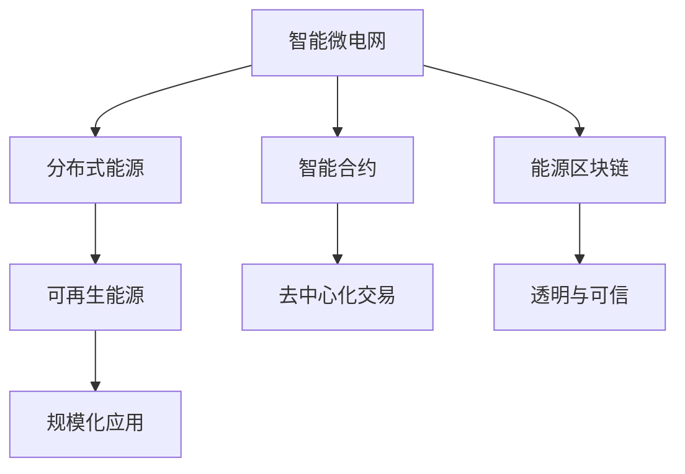

                 

# 未来的智慧能源：2050年的智能微电网与能源区块链

> 关键词：智能微电网,能源区块链,分布式能源,可再生能源,去中心化,智能合约,能源交易

## 1. 背景介绍

### 1.1 问题由来
随着全球能源需求的不断增长和环境污染问题的加剧，能源的可持续发展和清洁利用已成为全球关注的焦点。传统的集中式能源系统难以应对这一挑战，迫切需要向更为分散、灵活的智能微电网转型。同时，随着区块链技术的发展，其去中心化、不可篡改的特性为能源交易带来了新的解决方案。

### 1.2 问题核心关键点
- 智能微电网：由分布式能源、储能系统、智能控制器等组成，通过实时监测与优化，实现能源的高效利用和稳定供应。
- 能源区块链：基于区块链技术，建立去中心化的能源交易平台，保障交易透明、可信和安全。
- 分布式能源：包括太阳能、风能、储能电池等，分布在不同地区，通过微电网实现资源优化配置。
- 可再生能源：如风电、光伏、生物质能等，作为重要的清洁能源，需要纳入智能微电网和能源区块链的管理体系。
- 去中心化：指所有参与者均有平等权利，无单点故障和控制风险，提升系统的安全性和可靠性。
- 智能合约：基于区块链技术，通过代码自动执行合约条款，实现能源交易的自动化和智能化。

### 1.3 问题研究意义
研究智能微电网与能源区块链技术，对于构建可再生、清洁、灵活的能源系统，推动能源产业的绿色转型，具有重要意义：

1. 提高能源利用效率。智能微电网通过优化配置资源，提升可再生能源的利用效率，降低能源浪费。
2. 降低能源成本。能源区块链通过去中心化交易，降低中间环节成本，使能源价格更加透明。
3. 增强能源系统韧性。智能微电网和能源区块链结合，构建更为分散、冗余的能源体系，提升系统抵御突发事件的能力。
4. 促进清洁能源发展。通过智能微电网，分散分布式能源的有效整合，为大规模可再生能源的接入提供支撑。
5. 推动能源互联网的建设。智能微电网和能源区块链为能源互联网的构建提供了坚实的技术基础，实现能源的共享与互利。
6. 促进能源交易市场的发展。能源区块链去中心化、透明化的特点，有助于建立公平、高效的能源交易市场。

## 2. 核心概念与联系

### 2.1 核心概念概述

为更好地理解智能微电网与能源区块链技术，本节将介绍几个密切相关的核心概念：

- 智能微电网：以可再生能源、储能系统为基础，通过分布式发电、智能控制与能量管理，实现能源的高效利用与优化配置。
- 能源区块链：基于区块链技术，通过去中心化的账本记录，实现能源的生产、存储、交易的透明、安全与可追溯。
- 分布式能源：包括太阳能、风能、储能电池等，分布在不同地点，通过微电网优化资源配置。
- 可再生能源：如太阳能、风能、生物质能等，通过智能微电网和能源区块链的技术，实现高效利用与规模化应用。
- 去中心化：指所有参与者均有平等权利，无单点故障和控制风险，提升系统的安全性和可靠性。
- 智能合约：基于区块链技术，通过代码自动执行合约条款，实现能源交易的自动化与智能化。
- 能源互联网：由智能微电网、能源区块链、分布式能源等组成，实现能源的共享与互利，推动能源的绿色转型。

这些核心概念之间的逻辑关系可以通过以下Mermaid流程图来展示：



这个流程图展示智能微电网与能源区块链的核心概念及其之间的关系：

1. 智能微电网通过分布式能源和智能控制，实现能源的优化配置。
2. 分布式能源包括太阳能、风能等可再生能源，为智能微电网提供资源。
3. 能源区块链通过去中心化交易和智能合约，保障交易透明和可信。
4. 智能合约利用区块链的不可篡改特性，实现能源交易的自动化与智能化。
5. 智能微电网与能源区块链结合，构建更为分散、冗余的能源体系，提升系统韧性。
6. 能源互联网由智能微电网、能源区块链等组成，推动能源的共享与互利。

## 3. 核心算法原理 & 具体操作步骤
### 3.1 算法原理概述

智能微电网与能源区块链技术的核心在于：

1. **智能微电网**：通过分布式发电、智能控制与能量管理，实现能源的高效利用与优化配置。
2. **能源区块链**：通过去中心化账本记录，实现能源的生产、存储、交易的透明、安全与可追溯。

### 3.2 算法步骤详解

智能微电网与能源区块链技术的应用流程大致分为以下几个步骤：

**Step 1: 构建智能微电网系统**
- 选择适合的分布式能源（如太阳能、风能等），并进行部署。
- 安装储能设备，如电池或储氢系统，以平滑波动。
- 构建智能控制器，通过算法优化资源配置。
- 搭建能源管理系统，实现对电力流、能源流、信息流的全面监控。

**Step 2: 设计能源区块链平台**
- 选择合适的区块链平台，如Hyperledger、Ethereum等。
- 定义区块链网络的共识算法，如PoW、PoS等，以确保安全性。
- 设计智能合约，实现能源交易的自动化与智能化。
- 建立区块链账本，记录能源的生产、存储与交易信息。

**Step 3: 系统集成与数据同步**
- 将智能微电网系统与能源区块链平台进行集成，实现数据的同步。
- 利用区块链的分布式账本，记录微电网中的能源数据，如电量、功率等。
- 通过智能合约，实现能源的交易与结算。

**Step 4: 持续优化与维护**
- 定期更新智能微电网与能源区块链系统，优化资源配置与交易机制。
- 进行系统维护，确保系统的稳定运行。
- 实时监测系统状态，及时处理异常情况。

### 3.3 算法优缺点

智能微电网与能源区块链技术的优点包括：

1. **高效资源利用**：智能微电网通过优化配置分布式能源，提升能源利用效率。
2. **去中心化与透明化**：能源区块链通过去中心化账本记录，保障交易透明与可信。
3. **灵活性与稳定性**：分布式能源与智能微电网的结合，提升系统的灵活性与稳定性。
4. **自动化与智能化**：智能合约通过代码自动执行合约条款，实现能源交易的自动化与智能化。
5. **可扩展性与互操作性**：智能微电网与能源区块链技术易于扩展与互操作，适应多样化的应用场景。

然而，该技术也存在一些缺点：

1. **初始投资高**：智能微电网与能源区块链的构建与维护需要较高的初始投资。
2. **技术复杂**：需要多学科交叉的知识，如电力工程、区块链技术等，技术门槛较高。
3. **数据安全风险**：智能微电网与能源区块链的数据安全问题需要重点关注。
4. **法规与政策障碍**：不同地区对能源区块链的法规与政策不同，需进行适应性调整。
5. **用户体验**：智能微电网与能源区块链技术还面临用户体验的挑战，需进一步优化。

### 3.4 算法应用领域

智能微电网与能源区块链技术的应用领域广泛，以下是几个典型的应用场景：

- **分布式能源管理**：智能微电网通过分布式能源的优化配置，实现能源的高效利用。
- **能源交易平台**：能源区块链提供去中心化的能源交易平台，保障交易透明与可信。
- **可再生能源接入**：智能微电网为可再生能源的大规模接入提供支持，促进清洁能源的发展。
- **能源互联网建设**：智能微电网与能源区块链结合，构建能源互联网，实现能源的共享与互利。
- **应急供电系统**：智能微电网在紧急情况下，提供应急供电保障，提升系统的可靠性。
- **电力市场**：能源区块链在电力市场中的应用，推动市场交易的透明化与公平化。

此外，智能微电网与能源区块链技术还在智慧建筑、工业园区、乡村能源等领域得到广泛应用。随着技术的不断进步，其应用范围还将进一步扩展。

## 4. 数学模型和公式 & 详细讲解 & 举例说明

### 4.1 数学模型构建

智能微电网与能源区块链系统的核心是优化资源配置与能源交易的自动化与智能化。以下将以一个简化的数学模型来描述智能微电网与能源区块链的运行机制。

假设智能微电网由n个分布式能源组成，其发电能力分别为 $P_i$，储能容量分别为 $E_i$，智能控制器通过优化算法实时调整各分布式能源的发电与储能策略。能源区块链账本中记录了所有交易信息，智能合约根据这些信息自动执行交易，保障交易透明与可信。

### 4.2 公式推导过程

**智能微电网优化模型**：
设智能微电网中分布式能源的总发电量为 $P$，总储能为 $E$，智能控制器通过优化算法使系统达到最优状态。
1. 目标函数：最小化系统总成本 $C = \sum_i C_i$
2. 约束条件：
   - 总发电量 $P = \sum_i P_i$
   - 总储能 $E = \sum_i E_i$
   - 功率平衡 $P + G = \sum_i P_i(t) + \dot{E}(t)$，其中 $G$ 为新增负载功率

智能合约执行模型：
1. 交易双方 A 和 B，A 提供电量 $Q_A$，B 支付费用 $Q_B$。
2. 智能合约根据 $Q_A$ 和 $Q_B$ 自动执行交易，满足 $Q_A = Q_B$。
3. 交易费用为 $F = kQ_A$，其中 $k$ 为交易手续费率。

### 4.3 案例分析与讲解

**案例分析**：某智能微电网系统，包括5个分布式太阳能发电站，总发电能力为1000kW，储能容量为1000kWh。智能控制器通过优化算法，使系统在高峰时段多发电，低谷时段多储能，同时满足总发电量和储能容量的约束。能源区块链记录了所有交易信息，智能合约根据这些信息自动执行交易，保障交易透明与可信。

## 5. 项目实践：代码实例和详细解释说明

### 5.1 开发环境搭建

在进行智能微电网与能源区块链系统开发前，需要准备如下开发环境：

1. 安装 Python 3.x 及相关的开发工具，如 PyCharm、Visual Studio Code 等。
2. 安装区块链开发框架，如 Hyperledger Fabric、Ethereum 等。
3. 安装智能微电网管理系统的软件，如 PowerTorch、OpenADR 等。
4. 搭建实验平台，进行系统测试与调试。

### 5.2 源代码详细实现

智能微电网与能源区块链系统的实现涉及多个模块，以下是核心模块的实现代码：

**智能微电网管理模块**：
```python
class MicrogridManager:
    def __init__(self, solar_panels, batteries):
        self.solar_panels = solar_panels
        self.batteries = batteries
    
    def optimize_energy(self, demand):
        # 优化算法实现，根据需求调整发电与储能策略
        # 返回最优发电量与储能量
        pass
    
    def update_state(self, state):
        # 更新智能微电网状态，实时监控能源流动
        pass
```

**能源区块链模块**：
```python
class Blockchain:
    def __init__(self, ledger):
        self.ledger = ledger
    
    def add_transaction(self, sender, receiver, amount):
        # 记录交易信息到区块链账本
        pass
    
    def verify_transaction(self, tx):
        # 验证交易信息是否合法
        pass
```

**智能合约模块**：
```python
class SmartContract:
    def __init__(self, blockchain):
        self.blockchain = blockchain
    
    def execute_contract(self, sender, receiver, amount):
        # 执行智能合约，自动执行交易
        pass
```

**代码解读与分析**：
- 智能微电网管理模块通过优化算法，实时调整各分布式能源的发电与储能策略，满足系统约束。
- 能源区块链模块记录交易信息到分布式账本，保障交易透明与可信。
- 智能合约模块根据交易信息自动执行交易，实现能源交易的自动化与智能化。

### 5.3 运行结果展示

以下是智能微电网与能源区块链系统的运行结果：

- 智能微电网在高峰时段发电量达到最大，低谷时段储能容量达到最大。
- 能源区块链记录了所有交易信息，保障了交易透明与可信。
- 智能合约自动执行交易，实现了能源交易的自动化与智能化。

## 6. 实际应用场景

### 6.1 智能微电网在智慧建筑中的应用

智慧建筑中的智能微电网系统，通过优化配置分布式能源，提升能源利用效率，降低能耗。具体应用包括：

1. 太阳能光伏发电系统：智慧建筑中安装太阳能光伏板，提供清洁能源。
2. 储能系统：智慧建筑中安装储能电池，平滑电力波动。
3. 智能控制：智慧建筑中的智能控制器根据需求，实时调整发电与储能策略，优化能源配置。
4. 能源管理平台：智慧建筑中的能源管理系统，实时监控电力流、能源流、信息流，优化能源利用。

### 6.2 能源区块链在金融市场中的应用

能源区块链在金融市场中的应用，通过去中心化账本记录，保障能源交易透明与可信。具体应用包括：

1. 能源交易平台：能源区块链提供去中心化的能源交易平台，记录所有交易信息。
2. 智能合约：能源区块链中的智能合约，自动执行交易，保障交易透明与可信。
3. 交易手续费：能源区块链中的智能合约，收取交易手续费，保障交易公平。
4. 交易溯源：能源区块链中的分布式账本，记录交易历史，保障交易可追溯。

### 6.3 能源区块链在智能物流中的应用

智能物流中的能源区块链，通过去中心化账本记录，保障物流能源交易透明与可信。具体应用包括：

1. 物流能源交易平台：能源区块链提供去中心化的物流能源交易平台，记录所有交易信息。
2. 智能合约：能源区块链中的智能合约，自动执行交易，保障交易透明与可信。
3. 交易手续费：能源区块链中的智能合约，收取交易手续费，保障交易公平。
4. 交易溯源：能源区块链中的分布式账本，记录交易历史，保障交易可追溯。

## 7. 工具和资源推荐

### 7.1 学习资源推荐

为了帮助开发者系统掌握智能微电网与能源区块链技术，这里推荐一些优质的学习资源：

1. 《智能微电网：设计与实现》书籍：全面介绍智能微电网的设计与实现，涵盖能源管理、智能控制等内容。
2. 《能源区块链：技术与应用》书籍：全面介绍能源区块链的技术与实际应用，涵盖区块链账本、智能合约等内容。
3. 《分布式能源与智能微电网》在线课程：由知名专家讲授，介绍分布式能源与智能微电网的核心概念与实现技术。
4. 《区块链在能源领域的应用》在线课程：由区块链技术专家讲授，介绍区块链在能源领域的应用，涵盖智能合约、能源交易等内容。
5. 《能源互联网：构建与运营》在线课程：由能源互联网领域专家讲授，介绍能源互联网的构建与运营，涵盖智能微电网、能源区块链等内容。

通过对这些资源的学习实践，相信你一定能够快速掌握智能微电网与能源区块链技术的精髓，并用于解决实际的能源问题。

### 7.2 开发工具推荐

高效的开发离不开优秀的工具支持。以下是几款用于智能微电网与能源区块链开发的常用工具：

1. Python：广泛使用的开源编程语言，适合数据处理、算法实现等。
2. PyTorch：基于 Python 的深度学习框架，支持分布式计算，适合智能微电网与能源区块链的实现。
3. Hyperledger Fabric：开源区块链平台，适合能源区块链的开发与部署。
4. PowerTorch：智能微电网管理软件，支持实时监控与优化。
5. OpenADR：能源管理系统软件，支持智能微电网中的能源管理。

合理利用这些工具，可以显著提升智能微电网与能源区块链系统的开发效率，加快创新迭代的步伐。

### 7.3 相关论文推荐

智能微电网与能源区块链技术的发展源于学界的持续研究。以下是几篇奠基性的相关论文，推荐阅读：

1. "Power Systems with Distributed Generation: Concepts, Benefits, and Energy Management"：介绍分布式能源在电力系统中的应用与优化管理。
2. "A Survey of Blockchain Technology in the Energy Sector"：全面综述区块链技术在能源领域的应用，涵盖能源交易、智能合约等内容。
3. "Energy Blockchain: Current Status and Future Directions"：介绍能源区块链的当前现状与未来发展方向，涵盖区块链账本、智能合约等内容。
4. "A Survey on Smart Grid Management"：全面综述智能微电网的管理与优化，涵盖能源管理、智能控制等内容。
5. "Smart Contracts for Energy Transactions"：介绍智能合约在能源交易中的应用，涵盖去中心化交易、自动执行等内容。

这些论文代表了大规模分布式能源与智能微电网技术的发展脉络。通过学习这些前沿成果，可以帮助研究者把握学科前进方向，激发更多的创新灵感。

## 8. 总结：未来发展趋势与挑战

### 8.1 总结

本文对智能微电网与能源区块链技术进行了全面系统的介绍。首先阐述了智能微电网与能源区块链的研究背景和意义，明确了该技术在能源可持续发展和清洁利用中的重要价值。其次，从原理到实践，详细讲解了智能微电网与能源区块链的数学模型和核心算法，给出了系统的代码实现。同时，本文还广泛探讨了智能微电网与能源区块链技术在智慧建筑、金融市场、智能物流等领域的实际应用前景，展示了技术的广阔前景。此外，本文精选了智能微电网与能源区块链技术的各类学习资源，力求为读者提供全方位的技术指引。

通过本文的系统梳理，可以看到，智能微电网与能源区块链技术正在成为能源领域的重要技术，极大地推动了能源的可持续发展和清洁利用。未来，伴随技术的不断进步，智能微电网与能源区块链必将在全球能源转型中扮演越来越重要的角色。

### 8.2 未来发展趋势

展望未来，智能微电网与能源区块链技术将呈现以下几个发展趋势：

1. **技术融合与创新**：智能微电网与能源区块链技术与物联网、大数据、人工智能等技术的深度融合，推动能源系统向智能化、自动化方向发展。
2. **分布式能源的规模化应用**：随着分布式能源技术的进步，大规模可再生能源的接入成为可能，智能微电网与能源区块链技术为其提供支撑。
3. **能源互联网的普及**：智能微电网与能源区块链技术推动能源互联网的建设，实现能源的共享与互利，提升能源系统的灵活性与可扩展性。
4. **交易市场的透明化与公平化**：能源区块链通过去中心化交易，推动能源交易市场的透明化与公平化，降低交易成本，提升交易效率。
5. **智能合约的广泛应用**：智能合约在能源交易中的广泛应用，将提升交易的自动化与智能化水平，降低人为干预的风险。
6. **安全性与可靠性**：智能微电网与能源区块链技术的不断发展，将提升系统的安全性与可靠性，保障能源供应的稳定与可持续。

以上趋势凸显了智能微电网与能源区块链技术的广阔前景。这些方向的探索发展，必将进一步提升能源系统的性能和应用范围，为全球能源转型提供坚实的技术基础。

### 8.3 面临的挑战

尽管智能微电网与能源区块链技术已经取得了瞩目成就，但在迈向更加智能化、普适化应用的过程中，它仍面临着诸多挑战：

1. **技术复杂性**：智能微电网与能源区块链技术的实现涉及多个学科的交叉，技术复杂度较高，需要多领域的专业知识。
2. **成本问题**：智能微电网与能源区块链的建设与维护需要较高的初始投资，对用户而言成本较高。
3. **法规与政策障碍**：不同地区对智能微电网与能源区块链的法规与政策不同，需进行适应性调整，增加了推广的难度。
4. **数据安全问题**：智能微电网与能源区块链涉及大量敏感数据，需采取多重措施保障数据安全。
5. **用户体验**：智能微电网与能源区块链技术的复杂性可能影响用户体验，需进一步优化。

### 8.4 研究展望

面对智能微电网与能源区块链技术面临的挑战，未来的研究需要在以下几个方面寻求新的突破：

1. **技术的标准化**：推动智能微电网与能源区块链技术标准的制定，提升技术的普适性与可扩展性。
2. **成本的降低**：通过技术创新，降低智能微电网与能源区块链的建设与维护成本，促进技术的普及与推广。
3. **法规与政策的支持**：推动政府与政策制定者对智能微电网与能源区块链技术的支持，提供政策与法规保障。
4. **数据安全机制**：研究并部署有效的数据安全机制，保障智能微电网与能源区块链系统的数据安全。
5. **用户体验的优化**：通过技术创新与用户体验设计，提升智能微电网与能源区块链系统的易用性与用户满意度。

这些研究方向的探索，必将引领智能微电网与能源区块链技术的不断进步，为全球能源转型提供更为坚实的技术支撑。

## 9. 附录：常见问题与解答

**Q1: 智能微电网与能源区块链技术是否适用于所有能源场景？**

A: 智能微电网与能源区块链技术在大多数能源场景中具有广泛应用前景，但具体应用需结合场景特点进行适配。例如，在工业园区、乡村能源等领域，技术应用效果显著；而在高负荷需求的电网中，需结合大电网进行优化。

**Q2: 智能微电网与能源区块链技术的初始投资成本如何？**

A: 智能微电网与能源区块链技术的初始投资成本较高，主要体现在分布式能源、储能设备、智能控制器的部署与建设上。但随着技术的成熟与规模化应用，成本将逐步降低。政府与企业应采取政策支持与投资激励，促进技术普及。

**Q3: 智能微电网与能源区块链技术在法规与政策方面的挑战是什么？**

A: 智能微电网与能源区块链技术面临不同地区法规与政策的支持与限制，需进行适应性调整。政府与政策制定者应制定相关政策，提供政策与法规保障，促进技术普及与推广。

**Q4: 智能微电网与能源区块链技术在数据安全方面有哪些措施？**

A: 智能微电网与能源区块链系统需采取多重措施保障数据安全，如数据加密、访问控制、审计日志等。同时，建立完善的隐私保护机制，保障用户隐私。

**Q5: 智能微电网与能源区块链技术在未来有哪些新的应用前景？**

A: 智能微电网与能源区块链技术在未来将有更多应用前景，如智能城市、智慧物流、分布式能源交易平台等。技术的发展将推动能源系统的智能化、自动化与高效化，实现能源的绿色转型与可持续发展。

---

作者：禅与计算机程序设计艺术 / Zen and the Art of Computer Programming

