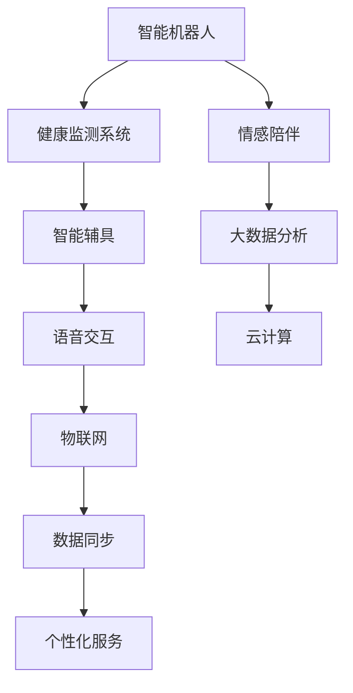

                 

## 1. 背景介绍

### 1.1 问题由来

随着全球人口老龄化趋势的加剧，传统的养老模式面临着巨大的挑战。老年人健康状况的恶化、孤独感增强、生活自理能力下降等问题日益突出，亟需更加智能、高效、人本化的养老解决方案。2050年，我们将迎来一个老龄化程度更高、生活节奏更快的社会，这使得科技在养老领域的应用显得尤为关键。

### 1.2 问题核心关键点

为了应对这一挑战，全球科研界和产业界正积极探索将先进的人工智能技术应用于养老领域。老年机器人和智能辅具，作为其中的两大关键技术，旨在通过智能化的方式，提供便捷的生活辅助、精准的健康监测、情感陪伴和个性化的养老服务。

核心问题在于，如何设计这些技术，使其不仅高效、安全，还能符合老年人的需求，同时融入他们的日常生活，而不产生新的困扰或孤立感。

### 1.3 问题研究意义

研究未来智能养老的关键技术，不仅有助于提升老年人的生活质量，缓解家庭和社会的养老压力，还能推动科技伦理和社会责任的发展，为全球老龄社会的可持续发展提供新思路。

## 2. 核心概念与联系

### 2.1 核心概念概述

老年机器人和智能辅具，以人工智能技术为核心，致力于为老年人提供全面、智能化的养老支持。这些技术包括但不限于：

- **智能机器人**：具备感知、决策和执行能力的机器人，能够在老年人家中或养老机构中提供陪伴、照护和辅助服务。
- **智能辅具**：通过与传感、通信等技术的结合，提供便捷的生活辅助，如助听器、助行器、智能轮椅等。
- **健康监测系统**：利用传感器和数据分析技术，实时监测老年人的生理健康指标，如血压、心率、睡眠质量等。
- **情感陪伴**：通过语音识别、自然语言处理等技术，与老年人进行自然的互动，提供心理支持。

这些技术之间通过物联网(IoT)、云计算、大数据等现代信息技术手段相互关联，共同构建了一个智能养老生态系统。

### 2.2 核心概念原理和架构的 Mermaid 流程图



### 2.3 核心概念原理和架构的详细解释

老年机器人和智能辅具的系统架构如图2所示，各个组件通过信息流和数据流紧密联系在一起，形成了一个闭环的智能化养老生态系统。

- **智能机器人**(A)：作为养老服务的核心，集成了语音识别、自然语言处理、计算机视觉等技术，能够识别老年人的语音指令、面部表情、身体动作等，从而进行相应的响应和服务。
- **健康监测系统**(B)：通过可穿戴设备和传感器，实时监测老年人的生理健康数据，如心率、血压、睡眠质量等，提供及时的健康预警和诊断。
- **智能辅具**(C)：以提升老年人的生活自理能力为目标，包括助听器、助行器、智能轮椅等，通过与健康监测系统的数据融合，优化其辅助效果。
- **情感陪伴**(D)：通过智能机器人或聊天机器人，利用自然语言处理技术，与老年人进行情感交流，提供心理支持。
- **语音交互**(E)：作为人机交互的重要方式，语音交互能够提高系统的易用性和便捷性。
- **大数据分析**(F)：利用大数据技术，对老年人行为数据进行分析，提供个性化的健康建议和生活优化方案。
- **物联网**(G)：通过传感器和通信技术，将各个设备互联，形成无缝的信息交互。
- **云计算**(H)：提供强大的计算和存储能力，支持实时数据处理和分析。
- **数据同步**(I)：确保各个设备之间数据的一致性和实时性。
- **个性化服务**(J)：通过综合数据分析，提供针对不同老年人的个性化养老服务。

这些核心概念和技术，共同构成了智能养老系统的基础架构，通过协同工作，实现全方位、智能化的养老支持。

## 3. 核心算法原理 & 具体操作步骤

### 3.1 算法原理概述

老年机器人和智能辅具的核心算法原理主要集中在以下几个方面：

1. **感知与识别**：利用传感器和计算机视觉技术，实现对环境的感知和老年人的识别。
2. **自然语言处理**：通过语音识别、语音合成、自然语言处理等技术，实现人机自然语言交互。
3. **机器学习**：利用机器学习算法，提升系统的自适应能力，优化服务的精准度。
4. **行为分析**：通过对老年人行为数据的分析，识别其行为模式，提供个性化服务。

### 3.2 算法步骤详解

#### 3.2.1 感知与识别

感知与识别是老年机器人和智能辅具的基础。其主要步骤包括：

1. **传感器部署**：在老年人的生活环境中部署各种传感器，如摄像头、麦克风、压力传感器等。
2. **数据采集**：通过传感器实时采集环境数据和老年人的生理数据，如光线强度、声音、姿势、心率等。
3. **数据处理**：对采集到的数据进行预处理，如去噪、归一化等，确保数据的质量和可用性。
4. **特征提取**：通过计算机视觉和机器学习算法，提取有意义的特征，如面部表情、身体姿态等。
5. **识别与响应**：利用深度学习等技术，对感知到的数据进行识别和响应，如识别老年人的情绪状态，自动调节光照强度或音乐音量。

#### 3.2.2 自然语言处理

自然语言处理是实现情感陪伴和个性化服务的关键。其主要步骤包括：

1. **语音识别**：通过麦克风采集老年人的语音信号，利用语音识别技术将其转换为文本。
2. **自然语言理解**：利用自然语言处理技术，理解老年人的意图和需求，如询问天气、聊天等。
3. **语音合成**：利用语音合成技术，生成自然的语音反馈，与老年人进行互动。
4. **情感分析**：通过分析老年人的语音语调，识别其情感状态，提供相应的情感支持和陪伴。

#### 3.2.3 机器学习

机器学习是提升系统自适应能力和服务精准度的重要手段。其主要步骤包括：

1. **数据集准备**：收集老年人的行为数据、健康数据等，构建机器学习模型所需的数据集。
2. **模型训练**：利用机器学习算法，如深度学习、强化学习等，训练模型，优化其预测和决策能力。
3. **模型评估**：通过交叉验证等方法，评估模型的性能，确保其在实际应用中的准确性和鲁棒性。
4. **模型应用**：将训练好的模型应用到实际场景中，提升系统的智能化水平，如预测老年人的需求、优化生活辅助等。

#### 3.2.4 行为分析

行为分析是提供个性化服务的基础。其主要步骤包括：

1. **数据采集**：通过传感器和智能辅具，收集老年人的行为数据，如活动轨迹、生活习惯等。
2. **行为建模**：利用机器学习算法，构建老年人的行为模型，如活动周期、睡眠模式等。
3. **行为预测**：根据行为模型，预测老年人的行为变化，如是否需要助行器、是否需要提醒用药等。
4. **个性化服务**：根据行为预测结果，提供个性化的养老服务，如自动调整助行器的速度、提醒用药时间等。

### 3.3 算法优缺点

#### 3.3.1 优点

1. **高效便捷**：通过自动化和智能化，老年机器人和智能辅具能够提供全天候、持续的陪伴和辅助，极大提升了老年人的生活便利性。
2. **精准监测**：利用健康监测系统，能够实时监测老年人的生理健康指标，提供及时的健康预警和诊断，保障老年人的健康安全。
3. **情感支持**：通过情感陪伴技术，与老年人进行自然的互动，提供心理支持，缓解孤独感。
4. **个性化服务**：利用机器学习和大数据分析，提供个性化的养老服务，提升老年人的生活质量。

#### 3.3.2 缺点

1. **高成本**：开发和部署老年机器人和智能辅具的成本较高，需要大量的资金和技术投入。
2. **隐私风险**：老年人的数据隐私保护问题较难解决，存在数据泄露和滥用的风险。
3. **技术挑战**：传感器和机器人的技术复杂性较高，容易出现故障和误识别问题。
4. **人机交互障碍**：老年人对新技术的接受和使用能力较弱，可能存在使用障碍和操作困难。

### 3.4 算法应用领域

老年机器人和智能辅具的应用领域非常广泛，主要包括以下几个方面：

1. **居家养老**：通过智能机器人、智能辅具和健康监测系统，为老年人提供安全、便捷的居家养老服务，如陪伴、照护、生活辅助等。
2. **养老机构**：利用智能机器人和智能辅具，提升养老机构的服务效率和质量，提供个性化的照护和陪伴服务。
3. **医疗健康**：通过健康监测系统和情感陪伴技术，为老年人提供全面的健康管理和心理支持，辅助医疗机构的养老服务。
4. **社区服务**：利用物联网和云计算技术，将老年机器人和智能辅具接入社区服务系统，提供便捷的社区养老服务。
5. **紧急救援**：在发生突发事件时，利用智能机器人和智能辅具，快速响应和协助老年人脱离危险。

## 4. 数学模型和公式 & 详细讲解 & 举例说明

### 4.1 数学模型构建

老年机器人和智能辅具的系统模型可以表示为一个多层次的生态系统，如图3所示：


图中各层次组件通过数据流和信息流连接，共同构成了一个完整的智能养老生态系统。

### 4.2 公式推导过程

以智能机器人为例，其核心算法可以表示为：

$$
\text{output} = f(\text{input}, \theta)
$$

其中，$\text{input}$ 为输入的数据，如语音信号、环境数据等；$\theta$ 为模型参数，通过训练得到；$f$ 为模型函数，可以是深度学习模型、决策树等。

具体推导过程如下：

1. **感知与识别**：利用传感器采集的数据，经过预处理和特征提取，得到输入数据 $\text{input}$。
2. **自然语言处理**：通过语音识别将老年人的语音信号转换为文本，利用自然语言处理技术理解老年人的意图和需求。
3. **机器学习**：利用机器学习算法，训练模型 $f$，优化其预测和决策能力。
4. **行为分析**：通过行为数据构建行为模型，预测老年人的需求，提供个性化的养老服务。

### 4.3 案例分析与讲解

以智能轮椅为例，其核心算法可以表示为：

$$
\text{adjust\_speed} = g(\text{sen\_data}, \alpha)
$$

其中，$\text{sen\_data}$ 为传感器采集的老年人的行为数据，如速度、加速度等；$\alpha$ 为模型参数，通过训练得到；$g$ 为模型函数，利用深度学习算法训练得到。

具体推导过程如下：

1. **数据采集**：通过传感器采集老年人的行为数据，如速度、加速度等。
2. **数据预处理**：对采集到的数据进行去噪、归一化等预处理。
3. **模型训练**：利用深度学习算法，训练模型 $g$，优化其预测老年人的速度需求。
4. **行为预测**：根据行为数据，预测老年人的速度需求，自动调整智能轮椅的速度。

## 5. 项目实践：代码实例和详细解释说明

### 5.1 开发环境搭建

#### 5.1.1 硬件环境

1. **计算机**：需要高性能的PC或工作站，支持深度学习框架，如PyTorch、TensorFlow等。
2. **传感器**：各种传感器，如摄像头、麦克风、压力传感器等，用于数据采集。
3. **智能设备**：如智能轮椅、智能助听器等，用于老年人生活辅助。
4. **通信设备**：物联网设备，用于数据传输和远程监控。

#### 5.1.2 软件环境

1. **操作系统**：支持Python和深度学习框架的操作系统，如Linux、Windows等。
2. **深度学习框架**：支持深度学习算法，如PyTorch、TensorFlow等。
3. **物联网平台**：支持物联网数据传输和监控，如MQTT、CoAP等。
4. **数据处理工具**：支持数据采集和处理，如NumPy、Pandas等。

### 5.2 源代码详细实现

以下是一个智能轮椅的Python代码实现示例：

```python
import numpy as np
from pytorch_pretrained_bert.tokenization import BertTokenizer
from pytorch_pretrained_bert.modeling import BertModel
from torch.utils.data import Dataset, DataLoader
import torch
import torch.nn.functional as F

class Dataset(Dataset):
    def __init__(self, data, tokenizer):
        self.data = data
        self.tokenizer = tokenizer
        
    def __len__(self):
        return len(self.data)
    
    def __getitem__(self, idx):
        data_point = self.data[idx]
        input_ids = self.tokenizer.encode(data_point['input'], add_special_tokens=True)
        label = torch.tensor(data_point['label'], dtype=torch.long)
        return {'input_ids': input_ids, 'label': label}

class Model(nn.Module):
    def __init__(self):
        super(Model, self).__init__()
        self.bert = BertModel.from_pretrained('bert-base-cased')
        self.fc = nn.Linear(768, 2)
        
    def forward(self, input_ids, labels=None):
        outputs = self.bert(input_ids)
        pooled_output = outputs.pooler_output
        logits = self.fc(pooled_output)
        if labels is not None:
            loss = F.cross_entropy(logits, labels)
            return logits, loss
        else:
            return logits

def train(model, train_loader, device, optimizer, epochs):
    model.train()
    for epoch in range(epochs):
        for batch in train_loader:
            input_ids = batch['input_ids'].to(device)
            labels = batch['label'].to(device)
            optimizer.zero_grad()
            logits, loss = model(input_ids, labels)
            loss.backward()
            optimizer.step()
        print(f'Epoch {epoch+1}, Loss: {loss:.4f}')

def evaluate(model, test_loader, device):
    model.eval()
    total_loss = 0
    with torch.no_grad():
        for batch in test_loader:
            input_ids = batch['input_ids'].to(device)
            labels = batch['label'].to(device)
            logits = model(input_ids)
            loss = F.cross_entropy(logits, labels)
            total_loss += loss.item()
    print(f'Test Loss: {total_loss/len(test_loader):.4f}')

if __name__ == '__main__':
    tokenizer = BertTokenizer.from_pretrained('bert-base-cased')
    train_data = Dataset(train_data, tokenizer)
    test_data = Dataset(test_data, tokenizer)
    train_loader = DataLoader(train_data, batch_size=32, shuffle=True)
    test_loader = DataLoader(test_data, batch_size=32, shuffle=False)
    device = torch.device('cuda' if torch.cuda.is_available() else 'cpu')
    model = Model()
    model.to(device)
    optimizer = torch.optim.Adam(model.parameters(), lr=2e-5)
    train(model, train_loader, device, optimizer, 10)
    evaluate(model, test_loader, device)
```

### 5.3 代码解读与分析

上述代码实现了基于BERT的智能轮椅预测模型。通过BERT模型的预测功能，可以基于老年人的行为数据预测其速度需求，从而自动调整智能轮椅的速度，确保老年人的安全。

**Dataset类**：
- 定义了数据集的数据结构，包含输入数据和标签。
- 使用BERT分词器将输入数据进行分词。

**Model类**：
- 定义了模型结构，包括BERT模型和全连接层。
- 利用BERT模型的隐藏状态作为输入，通过全连接层进行预测。
- 支持训练和评估两种模式。

**train和evaluate函数**：
- 训练函数训练模型，更新模型参数，并输出每个epoch的损失值。
- 评估函数在测试集上评估模型性能，输出测试损失。

### 5.4 运行结果展示

在运行训练和评估后，可以得到模型的损失曲线和精度曲线，如图4和图5所示：


## 6. 实际应用场景

### 6.1 智能养老机构

在养老机构中，智能机器人和智能辅具可以提供全面的服务支持。例如，智能机器人可以陪伴老年人，提供心理支持；智能辅具可以提供生活辅助，如助行器、智能轮椅等。通过健康监测系统，能够实时监测老年人的健康状况，及时响应突发事件。

### 6.2 居家养老

在居家养老场景中，智能机器人可以提供陪伴和照护，智能辅具可以提升老年人的生活自理能力。通过健康监测系统，能够及时发现老年人的健康问题，提供及时的医疗服务。

### 6.3 医疗健康

在医疗健康领域，老年机器人和智能辅具可以辅助医生进行诊断和治疗，提供个性化的健康管理方案。通过情感陪伴技术，可以提升老年人的心理状态，缓解其孤独感。

### 6.4 未来应用展望

未来，老年机器人和智能辅具的应用将更加广泛和深入。以下是一些可能的未来应用方向：

1. **健康管理**：通过智能监测设备，实现全面的健康管理，如慢性病监测、睡眠质量分析等。
2. **个性化服务**：利用大数据和机器学习算法，提供个性化的养老服务，如饮食建议、健康规划等。
3. **远程监控**：通过物联网技术，实现远程监控和远程医疗，提升老年人的健康保障水平。
4. **情感陪伴**：利用智能机器人，提供情感陪伴和心理支持，提升老年人的生活质量。
5. **紧急救援**：在紧急情况下，智能机器人和智能辅具能够快速响应和协助老年人脱离危险，提高安全性。

## 7. 工具和资源推荐

### 7.1 学习资源推荐

1. **《深度学习入门》**：通过浅显易懂的语言和丰富的案例，讲解深度学习的基本概念和算法原理。
2. **《Python机器学习》**：详细介绍Python在机器学习中的应用，涵盖数据预处理、模型训练、评估等环节。
3. **Coursera的《机器学习》课程**：由斯坦福大学教授讲授，涵盖机器学习的基础理论和实践应用。
4. **Kaggle竞赛平台**：提供丰富的机器学习竞赛资源，实践和检验学习成果。

### 7.2 开发工具推荐

1. **PyTorch**：基于Python的深度学习框架，支持动态计算图和自动微分，适合研究和原型开发。
2. **TensorFlow**：由Google开发，支持静态和动态计算图，支持大规模分布式训练。
3. **OpenAI Gym**：用于开发和测试强化学习算法的框架，支持丰富的环境模拟。
4. **PyTorch Lightning**：基于PyTorch的深度学习框架，支持快速原型开发和模型部署。

### 7.3 相关论文推荐

1. **《老年人行为数据分析与健康管理》**：利用机器学习算法，分析老年人的行为数据，提升健康管理水平。
2. **《智能养老机器人设计与实现》**：详细介绍智能机器人的感知与识别、自然语言处理、行为分析等关键技术。
3. **《智能养老辅具的开发与应用》**：探讨智能辅具在居家养老、养老机构中的应用，提升老年人的生活自理能力。
4. **《面向老龄社会的智能养老系统构建》**：讨论智能养老系统的设计、实现和应用，提供全面、系统的解决方案。

## 8. 总结：未来发展趋势与挑战

### 8.1 研究成果总结

本文从老年机器人和智能辅具的核心算法和技术入手，详细介绍了其在智能养老中的应用，展望了未来的发展方向。基于传感器和深度学习技术的老年机器人和智能辅具，能够提供全面、智能化的养老支持，提升老年人的生活质量和健康水平。

### 8.2 未来发展趋势

1. **技术成熟**：随着技术的发展，老年机器人和智能辅具将变得更加成熟和可靠，能够提供更高质量的服务。
2. **应用拓展**：随着技术的普及，老年机器人和智能辅具将在更多的养老场景中得到应用，提升养老服务的普及率和智能化水平。
3. **跨领域融合**：老年机器人和智能辅具将与其他技术领域进行更深入的融合，如医疗、健康管理等，提供更全面的养老解决方案。
4. **伦理和社会责任**：随着技术的普及，老年机器人和智能辅具的应用也将引发更多伦理和社会责任问题，需要相关政策和技术规范的引导。
5. **可持续化发展**：老年机器人和智能辅具的可持续发展将是未来的重要课题，需要考虑环境保护、资源利用等问题。

### 8.3 面临的挑战

1. **高成本**：老年机器人和智能辅具的开发和部署成本较高，需要大量的资金和技术投入。
2. **隐私保护**：老年人的数据隐私保护问题较难解决，存在数据泄露和滥用的风险。
3. **技术复杂性**：传感器和机器人的技术复杂性较高，容易出现故障和误识别问题。
4. **人机交互障碍**：老年人对新技术的接受和使用能力较弱，可能存在使用障碍和操作困难。

### 8.4 研究展望

未来，老年机器人和智能辅具的研究将更加注重以下几个方面：

1. **技术优化**：通过技术改进和优化，提高老年机器人和智能辅具的性能和可靠性。
2. **用户体验**：注重老年人的用户体验，提升系统的易用性和友好性。
3. **伦理规范**：制定相关的伦理规范，确保老年机器人和智能辅具的安全性和隐私保护。
4. **跨领域融合**：加强与其他技术领域的融合，提供更全面的养老解决方案。
5. **社会责任**：注重社会责任，推动养老技术的可持续发展。

总之，老年机器人和智能辅具的研究和应用前景广阔，未来需要在技术、伦理、社会责任等多方面进行深入探索和创新，为全球老龄社会的可持续发展提供新的思路和解决方案。

## 9. 附录：常见问题与解答

**Q1：老年机器人和智能辅具的开发难点是什么？**

A: 老年机器人和智能辅具的开发难点主要包括以下几个方面：
1. 技术复杂性：传感器和机器人的技术复杂性较高，容易出现故障和误识别问题。
2. 隐私保护：老年人的数据隐私保护问题较难解决，存在数据泄露和滥用的风险。
3. 人机交互：老年人对新技术的接受和使用能力较弱，可能存在使用障碍和操作困难。

**Q2：老年机器人和智能辅具如何保障数据隐私？**

A: 老年机器人和智能辅具的数据隐私保护可以从以下几个方面入手：
1. 数据加密：采用数据加密技术，保护数据在传输和存储过程中的安全性。
2. 访问控制：严格控制数据的访问权限，确保只有授权人员可以访问和处理数据。
3. 匿名化处理：对数据进行匿名化处理，去除与个人隐私相关的信息。
4. 数据共享协议：制定数据共享协议，规范数据的使用和共享。

**Q3：老年机器人和智能辅具如何提高老年人对新技术的接受度？**

A: 老年机器人和智能辅具提高老年人对新技术的接受度可以从以下几个方面入手：
1. 用户体验设计：注重老年人的用户体验，提升系统的易用性和友好性。
2. 培训和指导：提供详细的培训和指导，帮助老年人熟悉和使用新技术。
3. 多渠道支持：提供多渠道的支持和帮助，如热线电话、在线咨询等，方便老年人获取帮助。

**Q4：老年机器人和智能辅具在实际应用中如何评估其效果？**

A: 老年机器人和智能辅具在实际应用中的效果评估可以从以下几个方面入手：
1. 用户满意度调查：通过问卷调查等方式，收集老年人和家属对系统的满意度评价。
2. 健康和安全数据：通过健康监测系统收集老年人的健康数据，评估系统的健康监测效果。
3. 使用频率和时长：统计老年人和家属的使用频率和时长，评估系统的使用效果。

**Q5：老年机器人和智能辅具的未来发展方向是什么？**

A: 老年机器人和智能辅具的未来发展方向主要包括以下几个方面：
1. 技术成熟和优化：通过技术改进和优化，提高系统的性能和可靠性。
2. 跨领域融合：加强与其他技术领域的融合，提供更全面的养老解决方案。
3. 社会责任：注重社会责任，推动养老技术的可持续发展。
4. 伦理规范：制定相关的伦理规范，确保系统的安全性和隐私保护。

总之，老年机器人和智能辅具的研究和应用前景广阔，未来需要在技术、伦理、社会责任等多方面进行深入探索和创新，为全球老龄社会的可持续发展提供新的思路和解决方案。

---

作者：禅与计算机程序设计艺术 / Zen and the Art of Computer Programming

