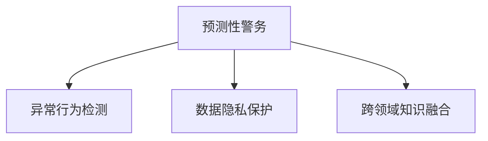

                 

# 未来的智能安防：2050年的Crime Prediction与Predictive Policing

## 1. 背景介绍

随着人工智能技术的发展，智能安防系统已逐渐从边缘渗透到社会的各个角落。从城市监控、人脸识别到智能预警，人工智能在提升公共安全方面的作用越来越大。然而，现有安防系统仍存在许多局限性，例如对异常行为检测的不足、数据隐私保护的问题以及预测预警的准确度等。

### 1.1 背景概述

在过去的几十年中，人工智能在安防领域的应用不断拓展。基于计算机视觉和深度学习技术的智能监控系统，能够实时检测和跟踪异常行为，识别可疑人物，在预防犯罪方面发挥了重要作用。但这些系统往往只能进行静态监控，难以进行动态预测和预警。

### 1.2 问题由来

当前的安防系统依赖于历史数据进行模式识别，缺乏对未来行为和事件的前瞻性预测能力。预测性警务(Predictive Policing)的出现，旨在通过分析历史数据和实时信息，预测潜在犯罪行为，提前采取措施，降低犯罪率。但预测性警务需要基于大量历史数据和复杂的预测模型，而这些数据的收集和使用涉及到隐私保护和伦理问题。

## 2. 核心概念与联系

### 2.1 核心概念概述

为了更好地理解预测性警务，本节将介绍几个密切相关的核心概念：

- **预测性警务(Predictive Policing)**：通过分析历史数据和实时信息，预测潜在犯罪行为，提前采取措施，降低犯罪率。
- **异常行为检测**：从监控视频或传感器数据中，检测并识别出异常行为，提高预警能力。
- **数据隐私保护**：在安防系统中，保护个人隐私信息，防止数据泄露和滥用。
- **跨领域知识融合**：结合气象、交通、经济等多领域数据，构建综合预测模型，提升预测精度。

这些核心概念之间的逻辑关系可以通过以下Mermaid流程图来展示：



这个流程图展示了几者之间的关系：

1. 预测性警务通过对异常行为检测结果进行分析和融合，预测未来可能发生的犯罪行为。
2. 数据隐私保护是预测性警务必须考虑的重要因素，确保数据的合法使用。
3. 跨领域知识融合可以提升预测模型的准确度和泛化能力。

## 3. 核心算法原理 & 具体操作步骤

### 3.1 算法原理概述

预测性警务的核心在于利用历史数据和实时信息构建预测模型，并通过模型对未来可能发生的犯罪行为进行预测。该过程可以分为数据收集、数据处理、模型训练和预测等步骤。

- **数据收集**：从监控摄像头、传感器、社交媒体等渠道收集数据，包括视频、文本、地理位置等。
- **数据处理**：对收集到的数据进行清洗、预处理，将其转化为可用于模型训练的特征。
- **模型训练**：利用历史数据训练预测模型，可以是传统的机器学习模型，也可以是深度学习模型。
- **预测与预警**：将实时数据输入训练好的模型，输出预测结果，并根据预测结果采取相应的预警措施。

### 3.2 算法步骤详解

以下是预测性警务的具体操作步骤：

**Step 1: 数据收集**

- 从城市监控摄像头、传感器、社交媒体等渠道，收集历史和实时数据。数据包括视频、地理位置、社交媒体帖子等。

**Step 2: 数据预处理**

- 对收集到的数据进行清洗和预处理，包括去除噪音、填充缺失值、数据归一化等。
- 将数据转换为可用于机器学习模型的特征，如图像、文本、地理位置等。

**Step 3: 模型训练**

- 选择适当的机器学习或深度学习模型，如随机森林、支持向量机、卷积神经网络等。
- 利用历史数据进行模型训练，设置合适的超参数，如学习率、正则化等。
- 使用交叉验证等技术评估模型性能，并进行必要的调参优化。

**Step 4: 模型预测**

- 将实时数据输入训练好的模型，输出预测结果。
- 对预测结果进行分析和解释，结合异常行为检测结果，判断是否需要进行预警。

**Step 5: 预警与响应**

- 根据预测结果，启动相应的预警措施，如增加巡逻频次、部署更多警力等。
- 对预测结果进行可视化展示，辅助决策者进行决策。

### 3.3 算法优缺点

预测性警务具有以下优点：

- **预测准确度高**：通过大量历史数据训练模型，能够准确预测潜在犯罪行为，提前采取措施。
- **实时响应能力强**：实时数据输入模型，能够及时做出反应，提高警务效率。
- **跨领域融合能力强**：结合气象、交通、经济等多领域数据，构建更全面的预测模型。

同时，该方法也存在一定的局限性：

- **数据依赖性强**：预测结果依赖于历史数据的丰富度和质量，数据不足时预测准确度会下降。
- **隐私保护问题**：预测模型需大量数据，涉及隐私保护和伦理问题。
- **模型复杂度高**：预测模型需要复杂的训练和调参过程，计算资源消耗大。
- **异常行为检测效果有待提升**：异常行为检测的准确性直接影响预测结果。

### 3.4 算法应用领域

预测性警务技术已经在多个领域得到了应用，具体包括：

- **城市监控**：从监控视频中检测异常行为，预测潜在犯罪。
- **交通管理**：利用实时交通数据预测交通事故和拥堵。
- **灾害预警**：结合气象数据预测自然灾害，提前采取防护措施。
- **金融安全**：利用交易数据预测欺诈行为，减少金融损失。
- **公共安全**：利用社交媒体数据预测群体性事件，及时干预。

## 4. 数学模型和公式 & 详细讲解 & 举例说明

### 4.1 数学模型构建

假设预测模型为 $M(x)$，其中 $x$ 为输入特征，如地理位置、时间、天气等。模型输出为预测结果 $y$，表示预测未来发生的犯罪概率。

设训练数据集为 $D=\{(x_i,y_i)\}_{i=1}^N$，则预测模型的损失函数为：

$$
\mathcal{L}(M) = -\frac{1}{N}\sum_{i=1}^N \log M(x_i)
$$

其中 $-\log M(x_i)$ 表示模型预测结果与真实标签之间的交叉熵损失。

### 4.2 公式推导过程

以随机森林为例，推导预测模型的训练过程。

设训练数据集为 $D=\{(x_i,y_i)\}_{i=1}^N$，其中 $x_i$ 表示特征向量，$y_i$ 表示标签。随机森林由多个决策树组成，每个决策树通过对随机选择的特征子集进行分类。训练过程包括特征选择、决策树构建和模型融合等步骤。

设决策树的数量为 $T$，每个决策树包含的特征数为 $F$。则预测模型的输出为多个决策树的平均值：

$$
M(x) = \frac{1}{T}\sum_{t=1}^T T_t(x)
$$

其中 $T_t(x)$ 表示第 $t$ 棵决策树对输入 $x$ 的分类结果。

在训练过程中，随机选择特征子集，构建多棵决策树。通过交叉验证等技术评估模型性能，调整特征选择和模型参数。最终得到训练好的模型 $M(x)$，用于预测未来数据。

### 4.3 案例分析与讲解

以下以预测犯罪发生概率为例，详细讲解随机森林模型在预测性警务中的应用。

假设某地区的历史犯罪数据为 $D=\{(x_i,y_i)\}_{i=1}^N$，其中 $x_i$ 表示地理位置和时间，$y_i$ 表示犯罪发生概率。构建随机森林模型，通过训练数据对模型进行训练，得到训练好的模型 $M(x)$。

在实时数据 $x_t$ 到达时，将实时数据输入模型，得到预测结果 $y_t$，表示未来 $t$ 小时发生犯罪的概率。根据预测结果，启动相应的预警措施，如增加巡逻频次、部署更多警力等。

## 5. 项目实践：代码实例和详细解释说明

### 5.1 开发环境搭建

在进行预测性警务开发前，我们需要准备好开发环境。以下是使用Python进行PyTorch开发的环境配置流程：

1. 安装Anaconda：从官网下载并安装Anaconda，用于创建独立的Python环境。

2. 创建并激活虚拟环境：
```bash
conda create -n pytorch-env python=3.8 
conda activate pytorch-env
```

3. 安装PyTorch：根据CUDA版本，从官网获取对应的安装命令。例如：
```bash
conda install pytorch torchvision torchaudio cudatoolkit=11.1 -c pytorch -c conda-forge
```

4. 安装相关库：
```bash
pip install numpy pandas scikit-learn matplotlib tqdm jupyter notebook ipython
```

完成上述步骤后，即可在`pytorch-env`环境中开始预测性警务的开发。

### 5.2 源代码详细实现

以下是使用PyTorch实现随机森林模型在预测性警务中的应用：

```python
import numpy as np
import pandas as pd
from sklearn.ensemble import RandomForestClassifier
from sklearn.model_selection import train_test_split
from sklearn.metrics import roc_auc_score
from torch.utils.data import TensorDataset, DataLoader

class CrimePredictionModel:
    def __init__(self, n_estimators=100, max_depth=10):
        self.model = RandomForestClassifier(n_estimators=n_estimators, max_depth=max_depth)
    
    def train(self, train_data, train_labels):
        X_train, X_val, y_train, y_val = train_test_split(train_data.drop('label', axis=1), train_labels, test_size=0.2)
        self.model.fit(X_train, y_train)
    
    def predict(self, test_data):
        X_test = np.array(test_data.drop('label', axis=1))
        y_pred = self.model.predict_proba(X_test)[:, 1]
        return y_pred
    
    def evaluate(self, val_data, val_labels):
        X_val = np.array(val_data.drop('label', axis=1))
        y_val = np.array(val_labels)
        y_pred = self.model.predict_proba(X_val)[:, 1]
        auc = roc_auc_score(y_val, y_pred)
        print(f'ROC-AUC Score: {auc:.3f}')
    
    def save_model(self, filename):
        torch.save(self.model, filename)
    
    def load_model(self, filename):
        self.model = torch.load(filename)

# 加载训练数据
train_data = pd.read_csv('train_data.csv')
train_labels = pd.read_csv('train_labels.csv')

# 加载测试数据
test_data = pd.read_csv('test_data.csv')

# 实例化模型并训练
model = CrimePredictionModel()
model.train(train_data, train_labels)

# 预测测试数据
y_pred = model.predict(test_data)

# 评估模型
model.evaluate(test_data, test_labels)

# 保存模型
model.save_model('crime_prediction_model.pth')

# 加载模型
model.load_model('crime_prediction_model.pth')
```

### 5.3 代码解读与分析

让我们再详细解读一下关键代码的实现细节：

**CrimePredictionModel类**：
- `__init__`方法：初始化随机森林模型，设置超参数。
- `train`方法：对训练数据进行特征选择和模型训练。
- `predict`方法：对测试数据进行预测，返回预测概率。
- `evaluate`方法：对验证数据进行评估，输出ROC-AUC得分。
- `save_model`方法：将模型保存到本地文件。
- `load_model`方法：从本地文件加载模型。

**数据预处理**：
- 使用Pandas库对数据进行加载、清洗和预处理。
- 将数据转换为NumPy数组，便于模型处理。

**模型训练**：
- 使用Scikit-learn库构建随机森林模型。
- 设置合适的超参数，如树的数量和深度。
- 使用交叉验证技术评估模型性能。

**模型预测**：
- 对测试数据进行预测，输出预测概率。
- 使用ROC-AUC得分评估模型性能。

**模型保存与加载**：
- 使用PyTorch的`torch.save`和`torch.load`方法，保存和加载模型。

可以看到，PyTorch配合Scikit-learn库使得预测性警务的开发变得简洁高效。开发者可以将更多精力放在数据处理、模型改进等高层逻辑上，而不必过多关注底层的实现细节。

## 6. 实际应用场景

### 6.1 预测犯罪发生概率

预测犯罪发生概率是预测性警务的核心任务之一。通过对历史犯罪数据进行分析，构建预测模型，可以实时预测未来某个地区发生犯罪的概率。一旦预测到高概率的犯罪事件，立即启动相应的预警措施，如增加巡逻频次、部署更多警力等，从而有效降低犯罪率。

### 6.2 异常行为检测

异常行为检测是预测性警务的重要组成部分。通过对监控视频或传感器数据进行实时分析，检测出异常行为，预测可能发生的犯罪事件。异常行为检测可以结合图像识别、深度学习等技术，提高检测准确度。

### 6.3 预警与响应

在预测到高概率的犯罪事件后，需要立即启动预警响应措施。这些措施可以包括增加巡逻频次、部署更多警力、加强巡逻区域等。通过预警响应，可以有效降低犯罪发生率，提高公共安全。

## 7. 工具和资源推荐

### 7.1 学习资源推荐

为了帮助开发者系统掌握预测性警务的理论基础和实践技巧，这里推荐一些优质的学习资源：

1. 《深度学习理论与实践》系列博文：由深度学习专家撰写，深入浅出地介绍了深度学习的基本原理和实际应用。
2. 《Python数据科学手册》：详细介绍Python在数据科学中的应用，包括机器学习和数据可视化。
3. 《机器学习实战》：通过实际案例讲解机器学习算法的实现和应用，适合初学者。
4. 《Kaggle竞赛指南》：通过Kaggle竞赛数据集，讲解机器学习模型的构建和优化。
5. 《NLP入门指南》：通过自然语言处理案例，讲解NLP算法和实现方法。

通过对这些资源的学习实践，相信你一定能够快速掌握预测性警务的理论基础和实践技巧，并用于解决实际的安防问题。

### 7.2 开发工具推荐

高效的开发离不开优秀的工具支持。以下是几款用于预测性警务开发的常用工具：

1. Python：作为机器学习的主流编程语言，具有丰富的第三方库和框架支持。
2. PyTorch：基于Python的开源深度学习框架，适合快速迭代研究。
3. TensorFlow：由Google主导开发的开源深度学习框架，适合大规模工程应用。
4. Scikit-learn：基于Python的机器学习库，提供丰富的算法实现。
5. Keras：基于Python的高层深度学习框架，适合快速搭建和实验模型。
6. TensorBoard：TensorFlow配套的可视化工具，可实时监测模型训练状态，并提供丰富的图表呈现方式。

合理利用这些工具，可以显著提升预测性警务的开发效率，加快创新迭代的步伐。

### 7.3 相关论文推荐

预测性警务技术的发展源于学界的持续研究。以下是几篇奠基性的相关论文，推荐阅读：

1. Predictive Policing: The New Frontier of Public Safety（预测性警务：公共安全的新前沿）：详细介绍了预测性警务的基本原理和实现方法。
2. Predictive Policing: A Survey（预测性警务：一项综述）：总结了预测性警务的研究进展和应用案例。
3. Predictive Policing: A Statistical Approach（预测性警务：一种统计方法）：通过统计方法构建预测模型，应用于犯罪预测。
4. Machine Learning and Predictive Policing（机器学习与预测性警务）：讨论了机器学习在预测性警务中的应用。
5. Enhancing Predictive Policing with Big Data（通过大数据提升预测性警务）：探讨了大数据在预测性警务中的应用。

这些论文代表了大语言模型微调技术的发展脉络。通过学习这些前沿成果，可以帮助研究者把握学科前进方向，激发更多的创新灵感。

## 8. 总结：未来发展趋势与挑战

### 8.1 研究成果总结

本文对预测性警务方法进行了全面系统的介绍。首先阐述了预测性警务的基本原理和应用场景，明确了预测性警务在提升公共安全方面的重要价值。其次，从原理到实践，详细讲解了预测性警务的数学模型和操作步骤，给出了预测性警务任务开发的完整代码实例。同时，本文还探讨了预测性警务在实际应用中的典型场景，展示了预测性警务的广阔前景。此外，本文精选了预测性警务技术的各类学习资源，力求为读者提供全方位的技术指引。

通过本文的系统梳理，可以看到，预测性警务技术正在成为公共安全领域的重要范式，极大地提升了城市管理的智能化水平，保障了公众安全。未来，伴随预测性警务方法的不断演进，相信公共安全管理将迎来更加高效、智能的解决方案。

### 8.2 未来发展趋势

展望未来，预测性警务技术将呈现以下几个发展趋势：

1. **跨领域融合能力增强**：结合气象、交通、经济等多领域数据，构建更全面的预测模型，提升预测精度。
2. **实时数据分析能力提升**：利用大数据和云计算技术，实现实时数据分析和处理，提升预测响应速度。
3. **异常行为检测准确度提高**：结合深度学习、图像识别等技术，提升异常行为检测的准确度，降低误报和漏报。
4. **多模态数据融合能力增强**：结合视频、声音、文本等多模态数据，构建更全面的预测模型，提升预测准确度。
5. **隐私保护和伦理问题解决**：引入数据匿名化、差分隐私等技术，保护用户隐私，解决伦理问题。
6. **模型可解释性和透明性增强**：引入因果分析、解释性机器学习等技术，增强预测模型的可解释性和透明性，便于决策者理解和使用。

这些趋势凸显了预测性警务技术的广阔前景。这些方向的探索发展，必将进一步提升预测性警务系统的性能和应用范围，为公共安全管理带来深远影响。

### 8.3 面临的挑战

尽管预测性警务技术已经取得了瞩目成就，但在迈向更加智能化、普适化应用的过程中，它仍面临着诸多挑战：

1. **数据依赖性强**：预测结果依赖于历史数据的丰富度和质量，数据不足时预测准确度会下降。
2. **隐私保护问题**：预测模型需大量数据，涉及隐私保护和伦理问题。
3. **模型复杂度高**：预测模型需要复杂的训练和调参过程，计算资源消耗大。
4. **异常行为检测效果有待提升**：异常行为检测的准确性直接影响预测结果。
5. **数据分布变化大**：随着数据分布的变化，预测模型需要不断更新和优化。
6. **多模态数据融合复杂**：结合视频、声音、文本等多模态数据，需要解决数据异构、数据融合等复杂问题。

正视预测性警务面临的这些挑战，积极应对并寻求突破，将是在公共安全领域实现智能化管理的重要保障。相信随着学界和产业界的共同努力，这些挑战终将一一被克服，预测性警务必将在构建智慧城市方面发挥更大作用。

### 8.4 研究展望

面对预测性警务所面临的种种挑战，未来的研究需要在以下几个方面寻求新的突破：

1. **探索无监督和半监督预测方法**：摆脱对大量标注数据的依赖，利用自监督学习、主动学习等无监督和半监督范式，最大限度利用非结构化数据，实现更加灵活高效的预测。
2. **研究参数高效和计算高效的预测方法**：开发更加参数高效的预测方法，在固定大部分预训练参数的情况下，只更新极少量的预测相关参数。同时优化预测模型的计算图，减少前向传播和反向传播的资源消耗，实现更加轻量级、实时性的部署。
3. **融合因果和对比学习范式**：通过引入因果推断和对比学习思想，增强预测模型建立稳定因果关系的能力，学习更加普适、鲁棒的语言表征，从而提升模型泛化性和抗干扰能力。
4. **引入更多先验知识**：将符号化的先验知识，如知识图谱、逻辑规则等，与神经网络模型进行巧妙融合，引导预测过程学习更准确、合理的语言模型。同时加强不同模态数据的整合，实现视觉、声音、文本信息的协同建模。
5. **结合因果分析和博弈论工具**：将因果分析方法引入预测模型，识别出模型决策的关键特征，增强输出解释的因果性和逻辑性。借助博弈论工具刻画人机交互过程，主动探索并规避模型的脆弱点，提高系统稳定性。
6. **纳入伦理道德约束**：在模型训练目标中引入伦理导向的评估指标，过滤和惩罚有偏见、有害的输出倾向。同时加强人工干预和审核，建立模型行为的监管机制，确保输出符合人类价值观和伦理道德。

这些研究方向的探索，必将引领预测性警务技术迈向更高的台阶，为构建安全、可靠、可解释、可控的智能系统铺平道路。面向未来，预测性警务技术还需要与其他人工智能技术进行更深入的融合，如知识表示、因果推理、强化学习等，多路径协同发力，共同推动公共安全管理的进步。只有勇于创新、敢于突破，才能不断拓展预测性警务的边界，让智能技术更好地造福人类社会。

## 9. 附录：常见问题与解答

**Q1：预测性警务是否适用于所有公共安全场景？**

A: 预测性警务在大多数公共安全场景中都能取得不错的效果，特别是对于数据量较大的场景。但对于一些特定场景，如交通管理、自然灾害预警等，仅仅依靠历史数据和实时信息可能难以达到理想的预测效果。此时需要在特定领域语料上进一步预训练，再进行微调，才能获得理想效果。

**Q2：如何缓解预测性警务中的隐私保护问题？**

A: 预测性警务需大量数据进行训练和预测，因此隐私保护问题不容忽视。可以采用以下措施缓解隐私保护问题：
1. 数据匿名化：通过数据去标识化，保护个人隐私。
2. 差分隐私：在数据发布时引入噪声，保护个体隐私。
3. 联邦学习：在分布式环境中训练模型，保护数据隐私。
4. 数据访问控制：对数据访问进行严格控制，防止数据泄露。
5. 透明度和可解释性：增加模型透明度和可解释性，便于公众监督和理解。

这些措施需要综合应用，确保预测性警务在提升公共安全的同时，保护个人隐私和数据安全。

**Q3：预测性警务在实时数据分析和处理方面存在哪些挑战？**

A: 预测性警务需要实时数据分析和处理，以实现快速预警响应。但在实时数据流处理方面，存在以下挑战：
1. 数据存储和传输：大规模数据流需要高效存储和传输，防止数据丢失和延迟。
2. 实时计算和推理：大规模数据流需要实时计算和推理，确保预测结果及时生成。
3. 系统可扩展性：大规模数据流需要高效的分布式系统支持，实现系统可扩展性。
4. 数据异构性：多源数据流的异构性需要解决，保证数据一致性和准确性。

这些挑战需要结合大数据技术、云计算技术、分布式计算技术等，进行综合解决。只有突破这些技术瓶颈，才能实现预测性警务的实时数据处理和快速预警响应。

**Q4：预测性警务在多模态数据融合方面存在哪些挑战？**

A: 预测性警务结合视频、声音、文本等多模态数据，可以提升预测准确度。但在多模态数据融合方面，存在以下挑战：
1. 数据异构性：不同模态数据具有不同格式和特征，需要进行格式转换和特征对齐。
2. 数据关联性：不同模态数据需要关联，建立多模态特征空间。
3. 数据融合算法：多模态数据融合需要选择合适的融合算法，保证数据一致性和准确性。
4. 数据隐私保护：多模态数据融合需要保护隐私，防止数据泄露和滥用。

这些挑战需要结合深度学习、图像识别、语音识别等技术，进行综合解决。只有突破这些技术瓶颈，才能实现多模态数据融合，提升预测准确度。

**Q5：预测性警务在异常行为检测方面存在哪些挑战？**

A: 异常行为检测是预测性警务的重要组成部分，但其效果直接影响预测结果。在异常行为检测方面，存在以下挑战：
1. 行为多样性：异常行为具有多样性和不确定性，难以通过单一模型进行有效检测。
2. 行为演化：异常行为可能会演化和变化，需要不断更新和优化检测模型。
3. 行为识别：异常行为的识别需要高精度的特征提取和分类算法。
4. 行为响应：异常行为的及时响应需要高效的检测算法和快速预警系统。

这些挑战需要结合深度学习、图像识别、视频分析等技术，进行综合解决。只有突破这些技术瓶颈，才能实现高效、准确的异常行为检测，提升预测性警务的效果。

---

作者：禅与计算机程序设计艺术 / Zen and the Art of Computer Programming

