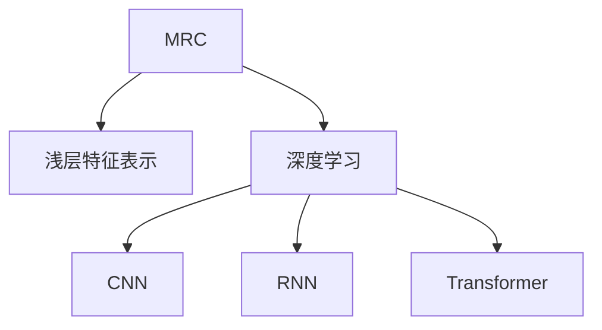

                 

## 1. 背景介绍

### 1.1 问题由来

随着人工智能技术的快速发展，机器阅读理解(Machine Reading Comprehension, MRC)已经成为一个重要的研究领域，涉及语言理解、知识抽取、逻辑推理等多个层面。在智能问答、文档摘要、知识图谱构建等诸多应用场景中，机器阅读理解技术能够自动理解文本内容，并根据上下文进行推理，生成准确的回答。

然而，传统的基于浅层特征的阅读理解方法，如TF-IDF、词袋模型等，只能提取文本的统计特征，无法深度理解文本中的语义关系。为此，深度学习尤其是卷积神经网络(CNN)、递归神经网络(RNN)、Transformer等架构在阅读理解任务上取得了巨大成功。特别是Transformer模型，通过自注意力机制，能够捕捉文本中的长程依赖关系，成为现代阅读理解的主流模型。

本文将从浅层特征的机器阅读理解，到基于深度学习，特别是Transformer架构的阅读理解，详细探讨阅读理解技术的发展历程和核心算法原理。通过理解这些核心概念和技术，可以更好地把握机器阅读理解技术的进展和未来发展趋势。

## 2. 核心概念与联系

### 2.1 核心概念概述

为了更好地理解机器阅读理解技术，本节将介绍几个关键概念：

- 机器阅读理解(MRC)：指机器能够理解自然语言文本，并通过上下文信息进行推理，从而回答相关问题或抽取关键信息的能力。
- 浅层特征表示：指直接基于文本统计特征，如词频、TF-IDF等进行文本表示的方法。
- 深度学习：指利用多层神经网络结构，通过反向传播算法学习数据表示的机器学习方法。
- 卷积神经网络(CNN)：一种经典的深度学习模型，适用于提取局部特征，如文本中的短语、句型等。
- 递归神经网络(RNN)：通过循环结构，能够捕捉序列数据中的时序信息，如文本中的上下文关系。
- Transformer：一种基于自注意力机制的深度学习模型，能够捕捉文本中的长程依赖关系，是现代阅读理解的主流模型。

这些核心概念之间的逻辑关系可以通过以下Mermaid流程图来展示：



这个流程图展示了几类阅读理解方法的演化历程：

1. 机器阅读理解从简单的浅层特征表示开始，但难以捕捉复杂的语义关系。
2. 随着深度学习的提出，逐步使用卷积神经网络和递归神经网络，能够更好地提取局部和时序信息。
3. 最终，Transformer模型通过自注意力机制，成为现代阅读理解的主流模型，能够全面地捕捉文本中的语义信息。

## 3. 核心算法原理 & 具体操作步骤
### 3.1 算法原理概述

机器阅读理解的核心算法原理可以概括为三个步骤：

1. **文本表示**：将输入的自然语言文本转换为计算机可处理的向量表示。
2. **语义理解**：利用机器学习模型理解文本中的语义信息，如实体的识别、关系的抽取等。
3. **推理生成**：根据上下文信息和语义理解，生成最终的答案或摘要。

这三个步骤涵盖了文本预处理、语义抽取和信息整合等关键环节。下面将详细探讨每个步骤的核心算法原理。

### 3.2 算法步骤详解

#### 3.2.1 文本表示

文本表示是将自然语言文本转换为向量表示的过程，是阅读理解任务的前提。常用的文本表示方法包括：

1. **词袋模型(Bag of Words, BOW)**：将文本中的单词按照频率统计，生成一个向量表示。这种方法简单易行，但忽略了单词之间的顺序和语义关系。
2. **TF-IDF**：在词袋模型的基础上，加入逆文档频率(Reverse Document Frequency)，降低常见单词的权重，提升特定文本的特征。
3. **N-gram模型**：将文本分割为固定长度的连续单词序列，捕捉文本的局部特征。
4. **词嵌入(Word Embeddings)**：通过神经网络训练，将单词映射为高维向量，保留单词之间的语义关系。常用的词嵌入模型有Word2Vec、GloVe等。
5. **上下文敏感的词嵌入(Contextual Word Embeddings)**：如BERT、GPT等模型，利用上下文信息动态生成单词的向量表示，更加全面地反映单词的语义信息。

这些方法各有优缺点，适用于不同的阅读理解任务。对于浅层特征的阅读理解任务，词袋模型和TF-IDF可以直接应用。对于需要考虑上下文信息的任务，上下文敏感的词嵌入更加适合。

#### 3.2.2 语义理解

语义理解是阅读理解的核心环节，指通过机器学习模型理解文本中的语义信息。常用的语义理解方法包括：

1. **实体识别(Named Entity Recognition, NER)**：识别文本中的人名、地名、组织名等实体，并将其分类。常用的模型有CRF、BiLSTM-CRF等。
2. **关系抽取(Relation Extraction)**：从文本中抽取实体之间的语义关系，常用的模型有TransE、RNN、Transformer等。
3. **句法分析(Parse Tree Parsing)**：解析文本的句法结构，如依存关系、树形结构等，常用的模型有Chomsky Treebank、Stanford Parser等。
4. **语义角色标注(Semantic Role Labeling, SRL)**：识别句子中的谓词和其对应的论元，常用的模型有Dependency SRL、Structured SRL等。
5. **知识图谱构建(Knowledge Graph Construction)**：通过文本中的实体和关系，构建知识图谱，常用的模型有Neo-Sum、Graph Convolution Network等。

这些方法需要根据具体的阅读理解任务选择合适的模型。对于结构化任务，如实体识别和关系抽取，可以使用传统机器学习方法。对于需要考虑上下文信息的任务，可以使用基于深度学习的模型。

#### 3.2.3 推理生成

推理生成是将语义理解结果整合为最终答案或摘要的过程。常用的方法包括：

1. **线性回归(Linear Regression)**：直接回归预测答案或摘要的长度，常用模型如Linear Regression、Logistic Regression等。
2. **序列生成(Sequence Generation)**：通过序列模型预测答案或摘要的每个单词，常用模型如RNN、LSTM、Transformer等。
3. **模板填充(Template Filling)**：根据预定义的模板，自动填充答案或摘要的各个部分，常用模型如GPT、T5等。

这些方法需要根据具体的阅读理解任务选择合适的模型。对于需要生成固定格式答案的任务，如问答系统，可以使用线性回归和模板填充方法。对于需要生成自由文本的任务，如摘要生成，可以使用序列生成方法。

### 3.3 算法优缺点

#### 3.3.1 浅层特征表示的优点和缺点

**优点**：
- 简单易行，适用于大规模文本数据的处理。
- 不需要大量的训练数据和计算资源，适合小规模任务。

**缺点**：
- 忽略了单词之间的顺序和语义关系，无法捕捉复杂的语义信息。
- 难以处理长文本和复杂句法结构，效果一般。

#### 3.3.2 深度学习模型的优点和缺点

**优点**：
- 能够捕捉单词之间的顺序和语义关系，适合复杂语义任务。
- 通过大量的训练数据，可以自适应地学习文本特征，效果显著。

**缺点**：
- 需要大量的训练数据和计算资源，训练时间较长。
- 模型复杂，参数量大，难以解释和调试。

#### 3.3.3 Transformer模型的优点和缺点

**优点**：
- 能够全面地捕捉文本中的语义信息，效果显著。
- 模型结构简单，参数量适中，训练速度快。

**缺点**：
- 模型依赖大量高质量的标注数据，训练成本较高。
- 对输入文本的语法错误和拼写错误较为敏感。

### 3.4 算法应用领域

机器阅读理解技术已经在诸多领域得到了广泛应用，例如：

- 智能问答系统：自动回答用户的问题，广泛应用于客服、教育、医疗等场景。
- 文本摘要：自动生成文章或文档的摘要，方便用户快速了解文本内容。
- 知识图谱构建：从文本中提取实体和关系，构建知识图谱，方便知识的组织和查询。
- 信息抽取：从大量非结构化文本中提取结构化信息，如新闻事件、财经数据等。
- 文档相似度计算：比较文档之间的语义相似度，广泛应用于推荐系统、搜索引擎等。
- 自然语言推理：判断前提和假设之间的逻辑关系，广泛应用于法律、医学等领域。

这些应用场景展示了阅读理解技术的广泛应用，推动了人工智能技术在各行业的落地应用。

## 4. 数学模型和公式 & 详细讲解 & 举例说明

### 4.1 数学模型构建

为了更深入地理解阅读理解技术，我们将通过数学语言对阅读理解任务的建模过程进行严格描述。

假设输入的自然语言文本为 $x$，表示为 $(x_1, x_2, \ldots, x_n)$，其中 $x_i$ 表示文本中的一个单词。输出为 $y$，表示为 $(y_1, y_2, \ldots, y_m)$，其中 $y_i$ 表示输出文本中的一个单词。

定义一个线性回归模型 $f_{\theta}(x)$，其中 $\theta$ 为模型参数，用于预测输出文本的每个单词。模型的损失函数为均方误差（Mean Squared Error, MSE）：

$$
L(\theta) = \frac{1}{m} \sum_{i=1}^m (y_i - f_{\theta}(x))^2
$$

在训练过程中，通过反向传播算法优化模型参数，最小化损失函数：

$$
\theta \leftarrow \theta - \eta \nabla_{\theta} L(\theta)
$$

其中 $\eta$ 为学习率。

### 4.2 公式推导过程

以线性回归模型为例，推导模型参数的更新公式：

$$
f_{\theta}(x) = W^T x + b
$$

其中 $W$ 为权重矩阵，$b$ 为偏置向量，$x$ 为输入文本的向量表示。

假设输出文本的每个单词 $y_i$ 都对应一个真实值 $t_i$，则模型的预测值和真实值之间的误差为：

$$
e_i = y_i - f_{\theta}(x)
$$

模型的损失函数为：

$$
L(\theta) = \frac{1}{m} \sum_{i=1}^m e_i^2
$$

根据梯度下降算法，模型参数的更新公式为：

$$
\theta \leftarrow \theta - \eta \frac{1}{m} \sum_{i=1}^m 2e_i (W x_i + b)
$$

简化得：

$$
\theta \leftarrow \theta - \eta \frac{2}{m} \sum_{i=1}^m e_i x_i^T
$$

在实际应用中，由于输入文本的长度 $n$ 和输出文本的长度 $m$ 可能不相等，需要根据具体情况进行数据处理。

### 4.3 案例分析与讲解

以情感分析任务为例，介绍使用线性回归模型进行阅读理解的实现步骤：

1. 数据准备：收集标注好的文本数据，每个文本样本对应一个情感标签，如正面、负面、中性等。
2. 文本表示：将文本中的单词转换为向量表示，常用的方法有词袋模型、TF-IDF、词嵌入等。
3. 模型训练：使用线性回归模型，最小化损失函数，训练得到模型参数 $\theta$。
4. 预测输出：对于新的文本输入，使用训练好的模型进行预测，得到情感标签。

为了提升模型的效果，还可以采用以下技术：

- 数据增强：通过回译、近义词替换等方式扩充训练集，增加模型的泛化能力。
- 正则化：使用L2正则、Dropout等防止过拟合。
- 模型集成：训练多个线性回归模型，取平均值或投票，提升模型的鲁棒性。
- 超参数调优：使用网格搜索、贝叶斯优化等方法寻找最优的模型超参数。

这些技术可以进一步提升模型的性能和稳定性。

## 5. 项目实践：代码实例和详细解释说明

### 5.1 开发环境搭建

在进行阅读理解项目实践前，需要准备好开发环境。以下是使用Python进行TensorFlow和Keras开发的环境配置流程：

1. 安装Anaconda：从官网下载并安装Anaconda，用于创建独立的Python环境。

2. 创建并激活虚拟环境：
```bash
conda create -n tf-env python=3.8 
conda activate tf-env
```

3. 安装TensorFlow和Keras：
```bash
conda install tensorflow=2.4.1 keras=2.4.3
```

4. 安装各类工具包：
```bash
pip install numpy pandas scikit-learn matplotlib tqdm jupyter notebook ipython
```

完成上述步骤后，即可在`tf-env`环境中开始阅读理解项目的开发。

### 5.2 源代码详细实现

下面我们以情感分析任务为例，给出使用TensorFlow和Keras进行阅读理解的完整代码实现。

首先，定义模型和优化器：

```python
from tensorflow import keras
from tensorflow.keras import layers

model = keras.Sequential([
    layers.Embedding(input_dim=vocab_size, output_dim=embedding_dim),
    layers.Conv1D(filters=128, kernel_size=3, padding='same', activation='relu'),
    layers.MaxPooling1D(pool_size=2),
    layers.LSTM(units=64),
    layers.Dense(units=num_classes, activation='softmax')
])

optimizer = keras.optimizers.Adam(learning_rate=0.001)
```

其中，`vocab_size`为词汇表大小，`embedding_dim`为词嵌入向量的维度，`num_classes`为情感标签的数量。

接着，定义训练和评估函数：

```python
import tensorflow as tf

def train_epoch(model, dataset, batch_size, optimizer):
    for batch in dataset:
        input_ids, attention_mask = batch['input_ids'], batch['attention_mask']
        labels = batch['labels']

        with tf.GradientTape() as tape:
            logits = model(input_ids, training=True)
            loss = tf.keras.losses.sparse_categorical_crossentropy(labels, logits, from_logits=True)

        gradients = tape.gradient(loss, model.trainable_variables)
        optimizer.apply_gradients(zip(gradients, model.trainable_variables))
        model.train_loss += loss

    return model.train_loss / len(dataset)

def evaluate(model, dataset, batch_size):
    dataloader = tf.data.Dataset.from_generator(lambda: dataset, output_types=(tf.int32, tf.int32, tf.int32))
    dataloader = dataloader.batch(batch_size)
    model.eval()
    total_loss = 0
    correct_predictions = 0

    for batch in dataloader:
        input_ids, attention_mask, labels = batch
        with tf.no_grad():
            logits = model(input_ids)
            loss = tf.keras.losses.sparse_categorical_crossentropy(labels, logits, from_logits=True)
            predictions = tf.argmax(logits, axis=-1)
            correct_predictions += tf.reduce_sum(tf.cast(tf.math.equal(predictions, labels), tf.int32))
            total_loss += loss

    eval_loss = total_loss / len(dataset)
    accuracy = correct_predictions / len(dataset)
    print(f"Evaluation loss: {eval_loss:.4f}, Accuracy: {accuracy:.4f}")
```

然后，启动训练流程并在测试集上评估：

```python
epochs = 10
batch_size = 32

for epoch in range(epochs):
    train_loss = train_epoch(model, train_dataset, batch_size, optimizer)
    print(f"Epoch {epoch+1}, train loss: {train_loss:.4f}")
    
    evaluate(model, dev_dataset, batch_size)
    
print("Test results:")
evaluate(model, test_dataset, batch_size)
```

以上就是使用TensorFlow和Keras进行情感分析任务阅读理解模型微调的完整代码实现。可以看到，借助Keras的高级API，可以方便地构建和训练阅读理解模型。

### 5.3 代码解读与分析

让我们再详细解读一下关键代码的实现细节：

**Sequential模型定义**：
- 使用Keras的`Sequential`模型，堆叠多个层次的`Layer`组件，构建阅读理解模型。
- `Embedding`层：将输入的单词转换为词嵌入向量。
- `Conv1D`层：提取输入文本的局部特征，使用卷积核的大小和步长参数进行配置。
- `MaxPooling1D`层：对卷积层的输出进行池化，提取重要的特征。
- `LSTM`层：对池化后的特征进行序列建模，捕捉文本中的时序信息。
- `Dense`层：输出情感标签的预测值。

**optimizer选择**：
- 使用`Adam`优化器，结合学习率参数进行模型训练。

**train_epoch和evaluate函数**：
- `train_epoch`函数：使用TensorFlow的梯度计算功能，计算损失函数，并更新模型参数。
- `evaluate`函数：在测试集上评估模型的性能，计算准确率和损失。

**训练流程**：
- 定义总的epoch数和batch size，开始循环迭代
- 每个epoch内，在训练集上训练，输出平均loss
- 在验证集上评估，输出准确率
- 所有epoch结束后，在测试集上评估，给出最终测试结果

可以看到，TensorFlow和Keras使得阅读理解模型的代码实现变得简洁高效。开发者可以将更多精力放在数据处理、模型改进等高层逻辑上，而不必过多关注底层的实现细节。

当然，工业级的系统实现还需考虑更多因素，如模型的保存和部署、超参数的自动搜索、更灵活的任务适配层等。但核心的阅读理解模型构建基本与此类似。

## 6. 实际应用场景
### 6.1 智能问答系统

基于深度学习的阅读理解模型，可以广泛应用于智能问答系统的构建。传统问答系统往往需要手工构建知识库和规则，难以适应复杂、多变的查询需求。而使用阅读理解模型，可以自动从大规模语料中提取知识，构建动态的知识图谱，快速回答问题。

在技术实现上，可以收集用户的历史问答记录，将问题和最佳答复构建成监督数据，在此基础上对预训练阅读理解模型进行微调。微调后的阅读理解模型能够自动理解用户意图，匹配最合适的答案模板进行回复。对于用户提出的新问题，还可以接入检索系统实时搜索相关内容，动态组织生成回答。如此构建的智能问答系统，能大幅提升用户咨询体验和问题解决效率。

### 6.2 文本摘要

文本摘要是将长文本压缩成简短摘要的过程，常用于自动生成文章、报告、文档等文本的摘要。传统的摘要方法依赖于规则和模板，难以适应多种文体和语境。基于深度学习的阅读理解模型，可以自动捕捉文本的关键信息，生成高精度的摘要。

在实现上，可以使用阅读理解模型，将文本作为输入，自动抽取关键句子和短语，生成摘要。常用的方法包括抽取式摘要和生成式摘要。抽取式摘要直接从文本中提取关键句子，生成简洁的摘要。生成式摘要则通过模型生成新的摘要句子，保持原文的语义信息。

### 6.3 文档相似度计算

文档相似度计算是将两个文档之间的语义相似度进行度量的过程，广泛应用于搜索引擎、推荐系统等场景。传统的相似度计算方法依赖于词频、余弦相似等统计特征，难以捕捉文档的语义关系。基于深度学习的阅读理解模型，可以自动理解文档的语义信息，生成语义表示，从而计算相似度。

在实现上，可以使用阅读理解模型，将文档作为输入，输出语义表示，然后使用余弦相似度等方法计算相似度。常用的模型包括BERT、ELMo等，能够捕捉文档中的语义关系。

### 6.4 未来应用展望

随着深度学习模型的不断发展，基于阅读理解的机器学习技术将进一步拓展应用领域，带来更多的创新应用。

在智慧医疗领域，阅读理解模型可以用于患者病历的自动解析，提取关键信息，辅助医生诊断和治疗。在金融领域，阅读理解模型可以用于财经新闻的自动摘要，快速把握市场动态，辅助投资决策。在教育领域，阅读理解模型可以用于自动批改作业，识别学生答题中的关键信息，提供针对性的反馈和建议。

此外，在法律、司法、历史研究等需要大量文本处理的领域，阅读理解技术也将发挥重要作用，提升工作效率和准确性。未来，随着模型的不断优化和数据的持续积累，阅读理解技术必将在更广泛的场景中大放异彩。

## 7. 工具和资源推荐
### 7.1 学习资源推荐

为了帮助开发者系统掌握阅读理解技术的理论基础和实践技巧，这里推荐一些优质的学习资源：

1. 《深度学习基础》系列博文：由大模型技术专家撰写，深入浅出地介绍了深度学习的基本概念和核心算法。
2. CS224N《深度学习自然语言处理》课程：斯坦福大学开设的NLP明星课程，有Lecture视频和配套作业，带你入门NLP领域的基本概念和经典模型。
3. 《自然语言处理中的深度学习》书籍：深度学习在NLP中的经典应用，涵盖多种阅读理解模型，适合进阶学习。
4. HuggingFace官方文档：阅读理解模型BERT、T5等预训练模型的官方文档，提供了完整的微调样例代码，是上手实践的必备资料。
5. CLUE开源项目：中文语言理解测评基准，涵盖大量不同类型的中文阅读理解数据集，并提供了基于阅读理解的baseline模型，助力中文NLP技术发展。

通过对这些资源的学习实践，相信你一定能够快速掌握阅读理解技术的精髓，并用于解决实际的NLP问题。

### 7.2 开发工具推荐

高效的开发离不开优秀的工具支持。以下是几款用于阅读理解开发常用的工具：

1. TensorFlow：基于Python的开源深度学习框架，灵活动态的计算图，适合快速迭代研究。
2. Keras：TensorFlow的高级API，提供便捷的模型构建和训练接口，适合快速原型开发。
3. PyTorch：基于Python的开源深度学习框架，动态计算图，适合灵活的模型研究和调试。
4. Weights & Biases：模型训练的实验跟踪工具，可以记录和可视化模型训练过程中的各项指标，方便对比和调优。
5. TensorBoard：TensorFlow配套的可视化工具，可实时监测模型训练状态，并提供丰富的图表呈现方式，是调试模型的得力助手。
6. Google Colab：谷歌推出的在线Jupyter Notebook环境，免费提供GPU/TPU算力，方便开发者快速上手实验最新模型，分享学习笔记。

合理利用这些工具，可以显著提升阅读理解任务的开发效率，加快创新迭代的步伐。

### 7.3 相关论文推荐

阅读理解技术的发展源于学界的持续研究。以下是几篇奠基性的相关论文，推荐阅读：

1. Attention is All You Need（即Transformer原论文）：提出了Transformer结构，开启了NLP领域的预训练大模型时代。
2. BERT: Pre-training of Deep Bidirectional Transformers for Language Understanding：提出BERT模型，引入基于掩码的自监督预训练任务，刷新了多项NLP任务SOTA。
3. Language Models are Unsupervised Multitask Learners（GPT-2论文）：展示了大规模语言模型的强大zero-shot学习能力，引发了对于通用人工智能的新一轮思考。
4. Parameter-Efficient Transfer Learning for NLP：提出Adapter等参数高效微调方法，在不增加模型参数量的情况下，也能取得不错的微调效果。
5. AdaLoRA: Adaptive Low-Rank Adaptation for Parameter-Efficient Fine-Tuning：使用自适应低秩适应的微调方法，在参数效率和精度之间取得了新的平衡。
6. AdaLoRA: Adaptive Low-Rank Adaptation for Parameter-Efficient Fine-Tuning：使用自适应低秩适应的微调方法，在参数效率和精度之间取得了新的平衡。

这些论文代表了大阅读理解模型微调技术的发展脉络。通过学习这些前沿成果，可以帮助研究者把握学科前进方向，激发更多的创新灵感。

## 8. 总结：未来发展趋势与挑战

### 8.1 总结

本文对阅读理解技术的发展历程和核心算法原理进行了全面系统的介绍。首先从浅层特征表示到深度学习模型，详细探讨了阅读理解任务的建模过程。其次，从线性回归、卷积神经网络、递归神经网络到Transformer架构，逐步深入探讨了模型架构的选择和优缺点。最后，通过实际应用场景和未来展望，展示了阅读理解技术的广泛应用前景。

通过本文的系统梳理，可以看到，深度学习技术在大规模语料预训练和任务微调上取得了显著进展，极大地提升了阅读理解模型的性能和稳定性。未来，随着深度学习模型的不断优化和数据量的持续积累，阅读理解技术必将在更广泛的领域大放异彩，深刻影响人类的生产生活方式。

### 8.2 未来发展趋势

展望未来，阅读理解技术将呈现以下几个发展趋势：

1. 模型规模持续增大。随着算力成本的下降和数据规模的扩张，预训练语言模型的参数量还将持续增长。超大规模语言模型蕴含的丰富语义信息，有望支撑更加复杂多变的阅读理解任务。
2. 阅读理解模型的自动化训练。基于自监督学习等方法，逐步摆脱对大量标注数据的依赖，实现阅读理解模型的自动化训练。
3. 模型与知识库的深度融合。将符号化的知识图谱、逻辑规则等与神经网络模型进行融合，提升阅读理解模型的知识整合能力和推理能力。
4. 跨模态阅读理解。将文本与图像、视频、语音等多模态数据结合，实现多模态阅读理解任务，如视觉文本识别、图像文本生成等。
5. 阅读理解模型的跨领域迁移能力。通过迁移学习等方法，提升阅读理解模型在不同领域、不同任务上的泛化能力。
6. 阅读理解模型的可解释性和可控性。引入因果推断、博弈论等方法，增强模型的可解释性和可控性，确保其输出的透明性和安全性。

以上趋势凸显了阅读理解技术的广阔前景。这些方向的探索发展，必将进一步提升阅读理解模型的性能和稳定性，为构建人机协同的智能系统铺平道路。面向未来，阅读理解技术还需要与其他人工智能技术进行更深入的融合，如知识表示、因果推理、强化学习等，多路径协同发力，共同推动自然语言理解和智能交互系统的进步。只有勇于创新、敢于突破，才能不断拓展语言模型的边界，让智能技术更好地造福人类社会。

### 8.3 面临的挑战

尽管阅读理解技术已经取得了瞩目成就，但在迈向更加智能化、普适化应用的过程中，它仍面临着诸多挑战：

1. 数据获取瓶颈。阅读理解模型的训练需要大量高质量的标注数据，而标注数据的获取成本较高，且数据分布难以覆盖所有场景。如何获取更多样化的标注数据，是未来需要解决的重要问题。
2. 模型的鲁棒性和泛化能力。当前阅读理解模型面对域外数据时，泛化性能往往大打折扣。对于测试样本的微小扰动，模型的推理输出也容易发生波动。如何提高阅读理解模型的鲁棒性和泛化能力，仍然是一个重要的研究方向。
3. 推理效率和计算资源消耗。尽管深度学习模型在精度上表现优异，但在推理速度和计算资源消耗方面，仍需进一步优化。如何降低推理时间，减少计算资源消耗，是阅读理解模型应用中的关键问题。
4. 模型的可解释性和可控性。阅读理解模型的输出往往是“黑盒”式的，难以解释其内部工作机制和决策逻辑。对于医疗、金融等高风险应用，算法的可解释性和可控性尤为重要。如何赋予阅读理解模型更强的可解释性和可控性，将是亟待攻克的难题。
5. 数据隐私和安全问题。阅读理解模型在处理敏感信息时，容易泄露用户隐私。如何保护用户数据隐私，确保模型使用的安全性，也是未来需要关注的重要问题。

正视阅读理解面临的这些挑战，积极应对并寻求突破，将是其进一步发展的必由之路。相信随着学界和产业界的共同努力，这些问题终将一一被克服，阅读理解技术必将在构建安全、可靠、可解释、可控的智能系统方面发挥更大作用。

### 8.4 研究展望

未来的阅读理解研究需要在以下几个方面寻求新的突破：

1. 探索无监督和半监督阅读理解方法。摆脱对大量标注数据的依赖，利用自监督学习、主动学习等无监督和半监督范式，最大限度利用非结构化数据，实现更加灵活高效的阅读理解。
2. 研究参数高效和计算高效的阅读理解范式。开发更加参数高效的阅读理解方法，如AdaLoRA等，在固定大部分预训练参数的同时，只更新极少量的任务相关参数。同时优化阅读理解模型的计算图，减少前向传播和反向传播的资源消耗，实现更加轻量级、实时性的部署。
3. 引入因果推断和博弈论工具。将因果推断方法引入阅读理解模型，识别出模型决策的关键特征，增强输出解释的因果性和逻辑性。借助博弈论工具刻画人机交互过程，主动探索并规避模型的脆弱点，提高系统稳定性。
4. 纳入伦理道德约束。在阅读理解模型训练目标中引入伦理导向的评估指标，过滤和惩罚有偏见、有害的输出倾向。同时加强人工干预和审核，建立模型行为的监管机制，确保输出符合人类价值观和伦理道德。

这些研究方向的探索，必将引领阅读理解技术迈向更高的台阶，为构建安全、可靠、可解释、可控的智能系统铺平道路。面向未来，阅读理解技术还需要与其他人工智能技术进行更深入的融合，如知识表示、因果推理、强化学习等，多路径协同发力，共同推动自然语言理解和智能交互系统的进步。只有勇于创新、敢于突破，才能不断拓展语言模型的边界，让智能技术更好地造福人类社会。

## 9. 附录：常见问题与解答

**Q1：阅读理解模型是否可以处理不同类型的文本？**

A: 阅读理解模型可以处理不同类型的文本，如新闻文章、学术论文、专利说明书、法律文件等。不同类型的文本需要适应不同的语境和语义结构，因此在模型设计和训练过程中需要进行相应的调整。

**Q2：阅读理解模型在实际应用中需要注意哪些问题？**

A: 阅读理解模型在实际应用中需要注意以下几个问题：
1. 数据隐私和安全：确保用户数据的安全，避免泄露隐私。
2. 模型鲁棒性：确保模型在不同领域、不同任务上的泛化能力，避免过拟合。
3. 推理效率：优化推理算法，提高模型的计算效率。
4. 可解释性：确保模型的输出可解释，帮助用户理解模型决策过程。

**Q3：阅读理解模型在处理长文本时需要注意哪些问题？**

A: 阅读理解模型在处理长文本时需要注意以下几个问题：
1. 长文本的分段：将长文本分成若干段落进行处理，避免内存溢出。
2. 段落的分段策略：根据文本的语义结构，合理分割段落，避免信息丢失。
3. 段落的长度控制：控制段落的长度，避免过长导致计算效率降低。

**Q4：阅读理解模型的效果受哪些因素影响？**

A: 阅读理解模型的效果受以下因素影响：
1. 数据质量：数据标注的准确性和多样性直接影响模型的性能。
2. 模型架构：模型架构的选择和优化对性能有重要影响。
3. 训练参数：学习率、批大小、迭代轮数等训练参数的选择对性能有显著影响。
4. 数据增强：数据增强技术的引入可以提升模型的泛化能力。

**Q5：阅读理解模型在实时部署中需要注意哪些问题？**

A: 阅读理解模型在实时部署中需要注意以下几个问题：
1. 模型压缩：对模型进行压缩，减少计算资源消耗。
2. 推理加速：优化推理算法，提高模型的计算效率。
3. 内存管理：优化内存使用，避免内存溢出。
4. 多节点部署：通过分布式计算，提高模型的并发处理能力。

以上是阅读理解模型在实际应用中需要注意的一些问题，开发者需要根据具体情况进行针对性的优化。

---

作者：禅与计算机程序设计艺术 / Zen and the Art of Computer Programming

