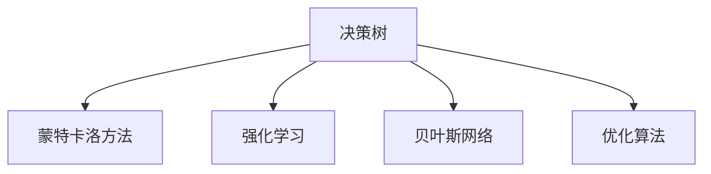

                 

# 模型思维在决策分析中的运用

> 关键词：模型思维,决策分析,算法优化,风险管理,系统工程

## 1. 背景介绍

### 1.1 问题由来
决策分析（Decision Analysis）是一门应用广泛的管理学学科，主要研究在资源有限、信息不完全、风险不确定的情况下，如何作出最优决策。随着数据科学和人工智能技术的迅猛发展，模型思维（Model Thinking）在决策分析中发挥了越来越重要的作用。通过构建精确的数学模型和算法，决策者可以更科学、更系统地评估各种决策方案的优劣，提升决策的准确性和效率。

然而，尽管模型思维在决策分析中的应用日益广泛，但实际问题往往复杂多变，缺乏简单通用的模型可以全面覆盖。同时，模型构建和求解过程也需要大量的专业知识和技术手段，使得模型思维在实际应用中面临诸多挑战。本文旨在详细介绍模型思维在决策分析中的应用原理、具体操作步骤和案例分析，并探讨其未来发展趋势和挑战。

### 1.2 问题核心关键点
模型思维在决策分析中的应用核心关键点包括：

- **模型构建**：选择合适的数学模型和算法，准确描述决策问题的本质。
- **数据准备**：收集、清洗、整理相关的数据，保证数据质量。
- **算法求解**：使用高效的求解算法，快速找到模型最优解。
- **结果解读**：根据模型输出结果，进行决策分析，制定最优决策方案。

本文将围绕这些核心关键点，系统介绍模型思维在决策分析中的应用。

## 2. 核心概念与联系

### 2.1 核心概念概述

为更好地理解模型思维在决策分析中的应用，本节将介绍几个密切相关的核心概念：

- **决策树（Decision Tree）**：一种树形结构的分类模型，通过递归地划分数据集，将数据分为不同的子集。在决策分析中，决策树常用于描述决策过程和路径。

- **蒙特卡洛方法（Monte Carlo Method）**：一种基于随机抽样的方法，通过大量随机实验估计复杂系统行为的期望值和方差。在风险评估和管理中，蒙特卡洛方法常常用于模拟不确定性。

- **强化学习（Reinforcement Learning）**：一种通过试错学习最优决策的机器学习方法，通过环境反馈不断调整策略。在复杂系统控制和优化中，强化学习可以寻找最优决策路径。

- **贝叶斯网络（Bayesian Network）**：一种概率图模型，用于描述变量之间的关系和概率分布。在决策分析中，贝叶斯网络常用于不确定性建模和因果关系分析。

- **优化算法（Optimization Algorithm）**：通过搜索解空间，寻找目标函数的最优解。在资源分配和调度中，优化算法常用于求解最优化问题。

这些核心概念之间的逻辑关系可以通过以下Mermaid流程图来展示：



这个流程图展示了许多决策分析中常用的模型和算法，它们之间的相互联系和作用机制。

## 3. 核心算法原理 & 具体操作步骤
### 3.1 算法原理概述

模型思维在决策分析中的应用，主要基于以下几个核心算法原理：

- **统计模型（Statistical Model）**：通过统计学方法构建概率模型，描述决策问题中的变量关系。例如，回归模型、概率模型等。
- **优化算法**：通过数学方法求解目标函数的最优解，例如线性规划、非线性规划、整数规划等。
- **蒙特卡洛方法**：通过随机模拟求解复杂问题，例如蒙特卡洛模拟、蒙特卡洛树搜索等。
- **强化学习**：通过试错学习寻找最优决策策略，例如Q学习、策略梯度等。
- **贝叶斯网络**：通过概率图模型描述变量之间的因果关系，例如网络结构学习、参数估计等。

以上算法原理构成了模型思维在决策分析中的基础，通过合理选择和组合，可以应对各种复杂的决策问题。

### 3.2 算法步骤详解

基于模型思维的决策分析，主要包括以下几个关键步骤：

**Step 1: 问题建模**
- 分析决策问题的本质，确定影响因素和目标函数。
- 选择合适的数学模型，构建决策问题的数学表达。

**Step 2: 数据收集与预处理**
- 收集决策问题相关的数据，包括定量数据和定性数据。
- 对数据进行清洗、整理、归一化等预处理工作。

**Step 3: 模型求解**
- 选择合适的求解算法，求解模型的最优解。
- 根据求解结果，分析模型行为，评估决策方案。

**Step 4: 结果解读与决策**
- 根据模型输出结果，进行决策分析。
- 结合实际情况，制定最优决策方案。

**Step 5: 迭代优化**
- 根据反馈结果，进一步优化模型和决策方案。
- 不断迭代，直到达到最优决策效果。

### 3.3 算法优缺点

模型思维在决策分析中的应用具有以下优点：

- **精确性**：通过数学模型和算法，可以精确描述和求解复杂问题。
- **系统性**：提供一套完整的分析和决策框架，避免了主观偏见。
- **可重复性**：模型和算法具有高度的复用性，可以应用于相似问题。

同时，模型思维也存在一些局限性：

- **数据依赖**：模型的精度和效果高度依赖于数据的质量和数量。
- **复杂性**：模型构建和求解过程复杂，需要专业知识和技术手段。
- **现实假设**：模型构建和求解过程中，常常需要简化现实假设，导致模型结果与实际情境可能存在偏差。

尽管存在这些局限性，但模型思维在决策分析中的应用，无疑为复杂决策问题的解决提供了强有力的工具和手段。

### 3.4 算法应用领域

模型思维在决策分析中的应用，已经广泛应用于多个领域，例如：

- **金融风险管理**：通过蒙特卡洛方法模拟金融市场的随机波动，进行风险评估和管理。
- **工程项目管理**：通过优化算法求解工程项目的最优资源配置和调度，提升项目管理效率。
- **物流与供应链管理**：通过模型描述物流网络的路径选择和库存管理，优化物流决策。
- **医疗决策支持**：通过贝叶斯网络建模疾病诊断和治疗路径，提供医疗决策支持。
- **城市规划与交通管理**：通过优化模型求解城市交通流量分配和规划，提升城市管理效率。

以上领域展示了模型思维在决策分析中的广泛应用和巨大潜力。随着决策分析技术的不断发展，未来模型思维将在更多领域发挥重要作用。

## 4. 数学模型和公式 & 详细讲解  
### 4.1 数学模型构建

本节将使用数学语言对模型思维在决策分析中的应用进行更加严格的刻画。

假设决策问题具有以下特点：

- **决策变量**：$x_1, x_2, ..., x_n$，表示需要决策的资源或行为。
- **约束条件**：$c_1, c_2, ..., c_m$，表示资源或行为受到的限制。
- **目标函数**：$f(x)$，表示需要优化的目标，如最大化收益、最小化成本等。

定义决策问题的数学模型为：

$$
\min f(x) \quad \text{subject to} \quad c_i(x) \leq 0, i=1,2,...,m
$$

其中，$x$ 为决策向量，$c_i$ 为约束函数。

### 4.2 公式推导过程

以下我们以线性规划问题为例，推导求解最优解的公式。

假设目标函数为线性，约束条件也为线性，则线性规划问题可以表示为：

$$
\min \mathbf{c}^T \mathbf{x} \quad \text{subject to} \quad \mathbf{A} \mathbf{x} \leq \mathbf{b}, \quad \mathbf{x} \geq 0
$$

其中，$\mathbf{c}$ 为决策变量的系数向量，$\mathbf{x}$ 为决策向量，$\mathbf{A}$ 为约束矩阵，$\mathbf{b}$ 为约束向量和。

根据Karush-Kuhn-Tucker条件（KKT条件），线性规划问题的最优解需满足以下条件：

$$
\begin{cases}
\mathbf{A}^T \mathbf{y} + \mathbf{s} = \mathbf{0} \\
\mathbf{x}^T \mathbf{s} = 0 \\
\mathbf{c}^T \mathbf{x} = \mathbf{b}^T \mathbf{y} \\
\mathbf{x}, \mathbf{y}, \mathbf{s} \geq 0
\end{cases}
$$

其中，$\mathbf{y}$ 为拉格朗日乘子向量，$\mathbf{s}$ 为松弛变量向量。

通过求解上述方程组，可以求得线性规划问题的最优解。

### 4.3 案例分析与讲解

**案例1：物流网络优化**

假设一家物流公司需要从多个仓库调运货物到不同客户，要求总运输成本最小化。

设每个仓库 $i$ 的供应量 $x_{i,j}$ 为从仓库 $i$ 运到客户 $j$ 的货物数量，总成本 $c_{i,j} x_{i,j}$ 为从仓库 $i$ 运到客户 $j$ 的运输成本，总运输量 $b_j$ 为第 $j$ 个客户的需求量，仓库 $i$ 的总供应量 $a_i$ 为第 $i$ 个仓库的供应量。

建立数学模型：

$$
\min \sum_{i=1}^m \sum_{j=1}^n c_{i,j} x_{i,j} \quad \text{subject to} \quad \sum_{i=1}^m x_{i,j} = b_j, \quad \sum_{j=1}^n x_{i,j} = a_i, \quad x_{i,j} \geq 0
$$

通过求解该模型，可以得到最优的货物调运方案，最小化总运输成本。

**案例2：金融风险评估**

假设某银行需要对一笔贷款进行风险评估，需要考虑贷款金额、借款人信用评分、市场利率等因素。

设贷款金额 $x_1$，借款人信用评分 $x_2$，市场利率 $x_3$，贷款违约概率 $p$。建立数学模型：

$$
\min p \quad \text{subject to} \quad x_1 + 0.1x_2 + 0.2x_3 \leq 100, \quad x_i \geq 0
$$

通过求解该模型，可以评估不同贷款方案的违约概率，选择最优的贷款策略。

## 5. 项目实践：代码实例和详细解释说明
### 5.1 开发环境搭建

在进行模型思维在决策分析中的应用实践前，我们需要准备好开发环境。以下是使用Python进行决策分析的环境配置流程：

1. 安装Anaconda：从官网下载并安装Anaconda，用于创建独立的Python环境。

2. 创建并激活虚拟环境：
```bash
conda create -n model-thinking python=3.8 
conda activate model-thinking
```

3. 安装必要的库：
```bash
conda install numpy scipy matplotlib scikit-learn pandas 
pip install cvxpy linprog 
```

4. 安装决策分析相关库：
```bash
pip install pulp
```

5. 安装机器学习库：
```bash
pip install scikit-learn
```

完成上述步骤后，即可在`model-thinking`环境中开始决策分析的实践。

### 5.2 源代码详细实现

这里我们以线性规划问题为例，给出使用Python的CVXPY库进行线性规划的代码实现。

首先，定义线性规划问题的数据：

```python
import numpy as np
from cvxpy import symbols, Minimize, Problem, solve, SOCP

n, m = 5, 3  # 决策变量个数和约束条件个数
c = np.array([1, 2, 3, 4, 5])  # 决策变量系数向量
A = np.array([[1, 0, 0, 1, 1], [0, 1, 0, 1, 1], [0, 0, 1, 1, 1]])  # 约束矩阵
b = np.array([10, 20, 30])  # 约束向量

# 定义决策变量
x = symbols('x1:6')
A_eq = np.eye(n)

# 构建线性规划模型
prob = Problem(Minimize(c @ x), constraints=[A @ x <= b, A_eq @ x == x[:3]])
```

然后，求解线性规划问题：

```python
result = solve(prob)
print(result.status)
print(result.x)
```

最后，输出线性规划问题的最优解：

```python
print("Optimal objective value:", result.objective.value)
```

以上就是使用Python进行线性规划的完整代码实现。可以看到，CVXPY库提供了方便的数学建模接口和求解器，可以轻松实现各种线性规划问题的求解。

### 5.3 代码解读与分析

让我们再详细解读一下关键代码的实现细节：

**构建线性规划模型**：
- 使用符号函数定义决策变量 $x_1, x_2, ..., x_n$。
- 定义目标函数 $c \cdot x$ 和约束条件 $A \cdot x \leq b$。
- 调用CVXPY的`Problem`函数，构建线性规划问题。

**求解线性规划问题**：
- 使用`solve`函数求解线性规划问题，得到最优解。
- 输出问题的状态和最优解向量。
- 输出最优解的值。

**运行结果展示**：
- 输出最优解的状态，如`Optimal`表示已找到最优解。
- 输出最优解向量 $x_1, x_2, ..., x_n$。
- 输出最优解的目标函数值。

可以看到，通过简单的几行代码，就可以实现线性规划问题的求解。CVXPY库的强大接口和求解器，使得线性规划问题的求解变得异常便捷。

## 6. 实际应用场景
### 6.1 金融风险管理

模型思维在金融风险管理中的应用，主要体现在对金融市场的随机波动模拟和风险评估上。通过蒙特卡洛方法，金融分析师可以模拟各种市场情景，评估各种策略的潜在风险和收益。

在实际应用中，可以将蒙特卡洛方法应用于以下场景：

- **期权定价**：通过蒙特卡洛方法模拟期权价格的随机波动，计算期权的期望价值和波动率。
- **信用风险评估**：通过蒙特卡洛方法模拟贷款违约概率的随机波动，评估不同贷款方案的风险。
- **投资组合优化**：通过蒙特卡洛方法模拟资产回报的随机波动，优化投资组合的风险收益比。

这些应用展示了模型思维在金融风险管理中的巨大价值，帮助金融机构更好地理解和应对金融市场的复杂性。

### 6.2 工程项目管理

模型思维在工程项目管理中的应用，主要体现在对项目资源的最优配置和调度上。通过优化算法，项目经理可以最大化利用资源，最小化成本，提升项目效率。

在实际应用中，可以将优化算法应用于以下场景：

- **资源分配**：通过优化算法求解工程项目的资源分配方案，最小化总成本或最大化资源利用率。
- **进度控制**：通过优化算法求解工程项目的进度控制方案，最小化项目工期或最大化工程质量。
- **风险管理**：通过优化算法求解工程项目的风险管理方案，最小化项目风险或最大化工程收益。

这些应用展示了模型思维在工程项目管理中的广泛应用，帮助企业更好地管理和优化工程项目。

### 6.3 物流与供应链管理

模型思维在物流与供应链管理中的应用，主要体现在对物流网络路径选择和库存管理的优化上。通过模型描述物流网络的路径选择和库存管理，可以优化物流决策，提升物流效率。

在实际应用中，可以将优化模型应用于以下场景：

- **路径选择**：通过优化模型求解物流网络的最优路径选择方案，最小化运输成本或最大化运输效率。
- **库存管理**：通过优化模型求解物流网络的库存管理方案，最小化库存成本或最大化库存利用率。
- **需求预测**：通过优化模型预测市场需求的变化，制定最优的物流策略。

这些应用展示了模型思维在物流与供应链管理中的重要作用，帮助物流企业更好地管理和优化物流网络。

## 7. 工具和资源推荐
### 7.1 学习资源推荐

为了帮助开发者系统掌握模型思维在决策分析中的应用，这里推荐一些优质的学习资源：

1. 《运筹学》教材：经典的运筹学教材，详细介绍了线性规划、整数规划、蒙特卡洛方法等决策分析方法。

2. 《算法设计与分析》课程：斯坦福大学开设的算法设计课程，涵盖各种优化算法和决策分析算法，是学习模型思维的重要基础。

3. 《数据科学与机器学习》课程：Coursera上的课程，涵盖了数据科学和机器学习的基础知识和决策分析方法。

4. 《强化学习》教材：经典的强化学习教材，详细介绍了强化学习的基本概念和应用场景。

5. 《贝叶斯网络》教材：经典的贝叶斯网络教材，详细介绍了贝叶斯网络的构建和应用。

通过对这些资源的学习实践，相信你一定能够快速掌握模型思维在决策分析中的精髓，并用于解决实际的决策问题。

### 7.2 开发工具推荐

高效的开发离不开优秀的工具支持。以下是几款用于决策分析开发的常用工具：

1. Python：免费的开源语言，支持数学建模和优化算法，是决策分析的主要开发语言。

2. CVXPY：基于Python的数学建模和优化库，支持大规模线性规划和非线性规划问题的求解。

3. Gurobi：商业优化软件，支持大规模线性规划和混合整数规划问题的求解，求解速度和稳定性优异。

4. YALC：开源优化求解器，支持大规模线性规划和整数规划问题的求解，提供了高效的求解算法和接口。

5. SCIP：开源整数规划求解器，支持大规模整数规划问题的求解，提供了丰富的求解算法和接口。

合理利用这些工具，可以显著提升决策分析任务的开发效率，加快创新迭代的步伐。

### 7.3 相关论文推荐

模型思维在决策分析中的应用源于学界的持续研究。以下是几篇奠基性的相关论文，推荐阅读：

1. Linear Programming and Network Flows（《线性规划与网络流》）：运筹学的经典教材，介绍了线性规划的基本理论和求解算法。

2. Monte Carlo Methods in Finance（《金融领域的蒙特卡洛方法》）：介绍蒙特卡洛方法在金融风险评估和管理中的应用。

3. Reinforcement Learning: An Introduction（《强化学习简介》）：经典的强化学习教材，详细介绍了强化学习的基本概念和算法。

4. A Course in Decision Analysis（《决策分析课程》）：运筹学的经典教材，介绍了决策分析的基本概念和方法。

5. Bayesian Networks and Decision Graphs（《贝叶斯网络和决策图》）：经典的贝叶斯网络教材，详细介绍了贝叶斯网络的基本概念和应用。

这些论文代表了大语言模型微调技术的发展脉络。通过学习这些前沿成果，可以帮助研究者把握学科前进方向，激发更多的创新灵感。

## 8. 总结：未来发展趋势与挑战

### 8.1 总结

本文对模型思维在决策分析中的应用进行了全面系统的介绍。首先阐述了模型思维在决策分析中的研究背景和意义，明确了模型思维在决策分析中的重要价值。其次，从原理到实践，详细讲解了模型思维在决策分析中的数学模型构建和算法求解过程，给出了决策分析任务开发的完整代码实例。同时，本文还广泛探讨了模型思维在金融风险管理、工程项目管理、物流与供应链管理等多个领域的应用前景，展示了模型思维的巨大潜力。此外，本文精选了模型思维学习的各类学习资源，力求为读者提供全方位的技术指引。

通过本文的系统梳理，可以看到，模型思维在决策分析中的应用，已经成为现代决策分析的重要工具。通过合理的数学模型和算法，决策者可以更科学、更系统地评估各种决策方案的优劣，提升决策的准确性和效率。未来，伴随模型思维的不断发展，将有更多新模型和新算法涌现，为复杂决策问题的解决提供新的思路和方法。

### 8.2 未来发展趋势

展望未来，模型思维在决策分析中的应用将呈现以下几个发展趋势：

1. **深度学习和大数据分析的应用**：随着深度学习和大数据技术的不断发展，模型思维将越来越多地应用于复杂的决策问题，如推荐系统、自然语言处理等。

2. **多模态决策分析**：未来的决策分析将越来越多地融合多种数据源和模态，如文本、图像、语音等，提供更加全面的决策支持。

3. **智能决策系统**：结合人工智能和模型思维，开发智能决策系统，实现自动化决策和实时反馈。

4. **可视化决策分析**：通过可视化工具，将复杂的数学模型和算法结果直观展示出来，辅助决策者更好地理解决策结果。

5. **实时决策优化**：结合实时数据和优化算法，实现动态决策和优化，提升决策的及时性和适应性。

6. **伦理和可解释性**：未来的决策分析将更多关注模型的伦理性和可解释性，确保决策的公正性和透明性。

这些趋势展示了模型思维在决策分析中的广阔前景，模型思维将成为未来决策分析的核心技术手段，进一步提升决策的准确性和效率。

### 8.3 面临的挑战

尽管模型思维在决策分析中的应用已经取得了一定进展，但在迈向更加智能化、普适化应用的过程中，仍面临诸多挑战：

1. **数据质量问题**：模型的精度和效果高度依赖于数据的质量和数量，数据缺失、噪声等问题可能导致模型结果的偏差。

2. **模型复杂性**：决策问题的复杂性和多样性导致模型的构建和求解过程变得复杂，需要更多的专业知识和技术手段。

3. **模型解释性**：模型通常是一个"黑盒"系统，难以解释其内部工作机制和决策逻辑，对于高风险决策场景，模型的解释性尤为重要。

4. **计算资源需求**：大规模模型和复杂算法的求解过程需要大量的计算资源，可能会面临计算资源的瓶颈。

5. **模型鲁棒性**：模型面对数据分布的变化和随机噪声时，可能出现泛化能力不足的问题，需要进一步提升模型的鲁棒性。

6. **模型公平性**：模型在面对不同群体时可能出现偏见和不公平的问题，需要进一步提升模型的公平性和普适性。

这些挑战需要学术界和工业界的共同努力，通过不断优化模型构建和求解过程，提高模型质量和效率，确保模型能够更好地服务于决策分析的实际需求。

### 8.4 研究展望

面对模型思维在决策分析中面临的挑战，未来的研究需要在以下几个方面寻求新的突破：

1. **数据预处理技术**：提升数据预处理能力，减少数据噪声和缺失，提高数据质量。

2. **模型简化与优化**：通过模型简化和优化，降低模型复杂度，提高模型求解效率。

3. **模型解释性技术**：提升模型的解释性，提供更加透明和可理解的决策过程。

4. **计算资源优化**：优化计算资源分配，降低计算成本，提高模型求解效率。

5. **模型公平性研究**：深入研究模型的公平性问题，确保模型能够公正、公平地服务于不同群体。

6. **多模态决策融合**：研究多模态数据的融合技术，提供更加全面和丰富的决策支持。

这些研究方向将推动模型思维在决策分析中的不断进步，为复杂决策问题的解决提供新的思路和方法，推动决策分析技术的进一步发展。

## 9. 附录：常见问题与解答

**Q1：模型思维在决策分析中如何选择合适的数学模型？**

A: 选择合适的数学模型需要考虑多个因素，包括问题的本质、数据的特点、模型的复杂度等。一般而言，可以通过以下步骤进行选择：

1. 分析决策问题的本质，确定影响因素和目标函数。
2. 根据问题特点，选择合适的数学模型，如线性规划、整数规划、蒙特卡洛方法等。
3. 根据模型求解难度和精度需求，选择适当的求解算法，如基于分支定界算法的求解器、蒙特卡洛方法的随机模拟等。

**Q2：模型思维在决策分析中如何处理数据质量问题？**

A: 数据质量问题对模型的效果影响很大，因此处理数据质量问题是模型思维在决策分析中的关键步骤。可以采用以下方法处理数据质量问题：

1. 数据清洗：去除数据中的噪声、异常值和缺失值，保证数据的质量和一致性。
2. 数据归一化：对数据进行归一化处理，使其在模型中具有可比性和可解释性。
3. 数据增强：通过数据增强技术，扩充数据集，提高模型的泛化能力。

**Q3：模型思维在决策分析中如何提高模型的解释性？**

A: 提高模型的解释性，可以帮助决策者更好地理解模型的内部机制和决策逻辑。以下是一些提升模型解释性的方法：

1. 可视化技术：通过可视化技术，将复杂的模型结果直观展示出来，辅助决策者理解模型的输出。
2. 可解释模型：选择可解释性强的模型，如线性模型、决策树等，使其内部机制透明可解释。
3. 模型调试：通过调试模型，发现模型的漏洞和缺陷，进一步优化模型的解释性。

**Q4：模型思维在决策分析中如何处理计算资源瓶颈问题？**

A: 处理计算资源瓶颈问题，需要从以下几个方面进行优化：

1. 计算资源分配：合理分配计算资源，确保模型求解的高效性和稳定性。
2. 模型并行化：采用模型并行化技术，将复杂模型分解为多个子模型，并行求解。
3. 模型压缩：通过模型压缩技术，减少模型的计算量和存储需求，降低计算资源消耗。

**Q5：模型思维在决策分析中如何处理模型鲁棒性问题？**

A: 处理模型鲁棒性问题，需要从以下几个方面进行优化：

1. 模型参数稳健性：选择稳健性强的模型，减少模型参数对数据分布的敏感性。
2. 数据增强技术：通过数据增强技术，扩充数据集，提高模型的鲁棒性。
3. 模型鲁棒性评估：评估模型的鲁棒性，通过实验和测试，发现模型的漏洞和缺陷，进一步优化模型的鲁棒性。

这些方法可以帮助决策者更好地应对模型鲁棒性问题，提高决策分析的稳定性和可靠性。

---

作者：禅与计算机程序设计艺术 / Zen and the Art of Computer Programming

