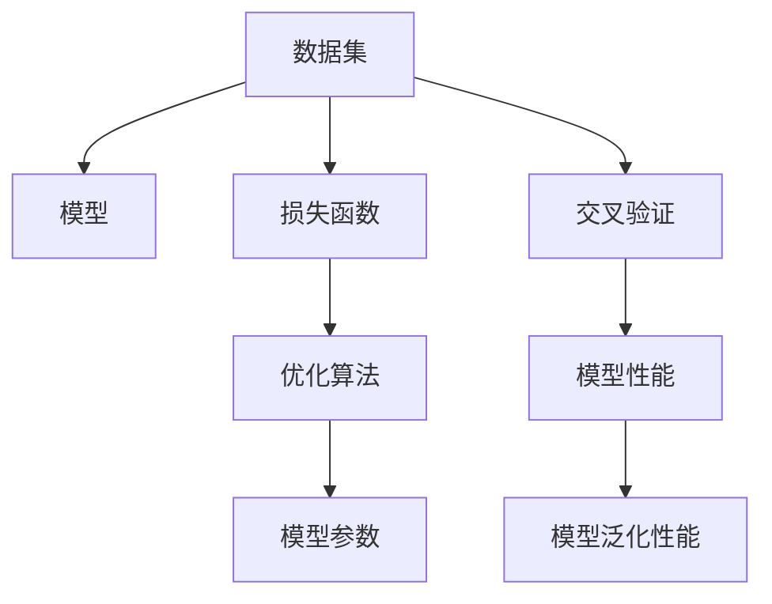

                 

# 模型思维应用:快速理解新事物

在当前复杂多变的技术和商业环境中，模型思维（Model Thinking）成为了一种强大的工具，它通过建立并分析模型来快速理解和预测复杂系统。本文将深入探讨模型思维的核心概念、应用原理和操作步骤，并结合具体案例分析，展示模型思维在实际问题解决中的强大力量。

## 1. 背景介绍

### 1.1 问题由来

随着科技的飞速发展，数据和信息的庞大规模使得直接观察和处理变得困难。模型思维提供了一种方式，通过构建抽象的模型来描述和分析复杂系统，从而帮助我们更好地理解新事物。在商业决策、科研探索、政策制定等领域，模型思维的应用日益广泛。

### 1.2 问题核心关键点

模型思维的核心在于建立对系统行为的精确预测，其关键点包括：
- 选择合适的模型结构
- 收集和处理相关数据
- 优化模型参数和验证模型性能
- 将模型应用于实际问题

## 2. 核心概念与联系

### 2.1 核心概念概述

为深入理解模型思维，本节将介绍几个核心概念：

- 模型（Model）：用于描述和预测系统的数学或统计框架。模型可以是线性回归、逻辑回归、神经网络等。
- 数据集（Data Set）：模型训练所需的大量输入和输出数据对，用于训练模型的参数。
- 损失函数（Loss Function）：衡量模型预测与真实值之间的差距，用于优化模型参数。
- 优化算法（Optimization Algorithm）：用于最小化损失函数，调整模型参数。
- 交叉验证（Cross Validation）：通过分割数据集，评估模型泛化性能，避免过拟合。
- 过拟合（Overfitting）：模型在训练集上表现良好但在测试集上性能下降的现象。

这些概念之间的逻辑关系可以通过以下Mermaid流程图来展示：



这个流程图展示了数据集与模型、损失函数、优化算法等关键概念之间的关系。

## 3. 核心算法原理 & 具体操作步骤

### 3.1 算法原理概述

模型思维的核心是建立并优化模型，其基本流程包括：

1. **数据准备**：收集和预处理数据，生成训练集、验证集和测试集。
2. **模型选择**：根据问题类型选择合适的模型结构。
3. **模型训练**：使用训练集数据优化模型参数，最小化损失函数。
4. **模型验证**：在验证集上评估模型性能，调整模型参数。
5. **模型测试**：在测试集上测试模型泛化性能，验证模型效果。

### 3.2 算法步骤详解

#### 步骤1：数据准备

- **数据收集**：从不同渠道收集相关数据，包括时间序列数据、文本数据、图像数据等。
- **数据预处理**：清洗数据，处理缺失值、异常值，进行特征工程。
- **数据划分**：将数据集划分为训练集、验证集和测试集，一般采用70%训练集、15%验证集、15%测试集的比例。

#### 步骤2：模型选择

- **模型类型**：根据问题类型选择适合的模型，如线性回归、决策树、神经网络等。
- **超参数设置**：设置模型的超参数，如学习率、正则化参数等。
- **模型初始化**：使用随机权重初始化模型参数。

#### 步骤3：模型训练

- **前向传播**：将输入数据传入模型，计算预测值。
- **损失计算**：计算预测值与真实值之间的损失，如均方误差、交叉熵等。
- **反向传播**：根据损失计算梯度，更新模型参数。
- **迭代优化**：重复前向传播和反向传播，直到模型收敛。

#### 步骤4：模型验证

- **验证集评估**：使用验证集数据评估模型性能，计算准确率、召回率、F1分数等指标。
- **参数调整**：根据验证集评估结果，调整模型参数。
- **模型保存**：保存最优模型参数，以便后续测试。

#### 步骤5：模型测试

- **测试集评估**：使用测试集数据测试模型性能，计算各项指标。
- **模型部署**：将模型部署到实际应用场景中，进行预测和推理。

### 3.3 算法优缺点

模型思维的优势在于其强大的数据建模和预测能力，具体优点包括：
- 精确预测：通过模型训练，能够对未来数据进行精确预测。
- 自动化分析：模型可以自动化地分析数据特征，识别数据中的模式和趋势。
- 可视化展示：通过模型可视化，可以直观理解复杂系统。

然而，模型思维也存在一些局限性：
- 数据依赖：模型性能依赖于数据的质量和数量，数据不足时性能会下降。
- 过度拟合：模型在训练集上表现良好但在测试集上性能下降的现象。
- 模型复杂性：复杂的模型需要更多的计算资源和时间，可能导致性能下降。
- 不可解释性：某些高级模型（如深度学习）的决策过程难以解释，影响可信度。

### 3.4 算法应用领域

模型思维广泛应用于以下领域：

- **商业决策**：通过市场预测、客户行为分析等模型，辅助企业制定战略决策。
- **科研探索**：利用数学模型和统计分析，探索自然现象和科学规律。
- **政策制定**：通过经济模型和社会模型，制定合理的政策和规划。
- **金融投资**：通过时间序列模型和信用评分模型，优化投资策略和风险管理。
- **医疗健康**：利用医学模型和病患数据，预测疾病发展和制定个性化治疗方案。

## 4. 数学模型和公式 & 详细讲解 & 举例说明

### 4.1 数学模型构建

以线性回归为例，模型可以表示为：
$$ y = \theta_0 + \theta_1x_1 + \theta_2x_2 + \cdots + \theta_nx_n $$
其中，$y$ 为预测值，$\theta_0, \theta_1, \cdots, \theta_n$ 为模型参数，$x_1, x_2, \cdots, x_n$ 为输入特征。

### 4.2 公式推导过程

线性回归的损失函数通常为均方误差（Mean Squared Error, MSE）：
$$ L = \frac{1}{2m} \sum_{i=1}^m (y_i - \hat{y}_i)^2 $$
其中，$y_i$ 为真实值，$\hat{y}_i$ 为模型预测值，$m$ 为样本数量。

模型参数的优化目标是使得损失函数最小化，即求解：
$$ \min_{\theta} L(\theta) $$
通过梯度下降等优化算法，可以求解上述最优化问题。

### 4.3 案例分析与讲解

以房价预测为例，我们可以收集历史房产数据，构建线性回归模型进行房价预测。具体步骤如下：
1. **数据准备**：收集历史房产数据，包括面积、地理位置、房龄等特征。
2. **模型选择**：选择线性回归模型，设置合适的超参数。
3. **模型训练**：使用训练集数据，优化模型参数。
4. **模型验证**：在验证集上评估模型性能，调整超参数。
5. **模型测试**：在测试集上测试模型效果，验证泛化性能。

## 5. 项目实践：代码实例和详细解释说明

### 5.1 开发环境搭建

为了进行模型思维的实践，我们需要准备以下开发环境：

1. **安装Python和相关库**：安装Anaconda或Miniconda，创建虚拟环境，安装NumPy、Pandas、Matplotlib等库。
2. **准备数据集**：收集并准备相关数据集，分为训练集、验证集和测试集。
3. **选择模型框架**：选择适合的机器学习框架，如Scikit-learn、TensorFlow或PyTorch。

### 5.2 源代码详细实现

以下是一个使用Scikit-learn进行线性回归的Python代码示例：

```python
from sklearn.linear_model import LinearRegression
from sklearn.model_selection import train_test_split
from sklearn.metrics import mean_squared_error

# 准备数据
X_train, X_test, y_train, y_test = train_test_split(X, y, test_size=0.2, random_state=42)

# 模型选择和初始化
model = LinearRegression()

# 模型训练
model.fit(X_train, y_train)

# 模型验证
y_pred = model.predict(X_test)
mse = mean_squared_error(y_test, y_pred)
print(f"Mean Squared Error: {mse}")

# 模型测试
y_pred = model.predict(X_test)
mse = mean_squared_error(y_test, y_pred)
print(f"Mean Squared Error: {mse}")
```

### 5.3 代码解读与分析

**数据准备**：使用`train_test_split`函数将数据集划分为训练集、验证集和测试集。

**模型选择**：选择`LinearRegression`模型。

**模型训练**：调用`fit`方法，使用训练集数据优化模型参数。

**模型验证**：使用验证集数据评估模型性能，计算均方误差。

**模型测试**：使用测试集数据测试模型性能，计算均方误差。

## 6. 实际应用场景

### 6.1 商业决策支持

商业决策过程中，利用模型思维可以快速分析和预测市场趋势、客户行为等关键指标。例如，零售商可以通过销售数据分析，预测未来库存需求，优化采购和销售策略。

### 6.2 科研探索与发现

在科学研究中，模型思维可以帮助研究人员发现新的规律和现象。例如，天文学家利用模拟模型分析恒星演化过程，预测新星系的形成。

### 6.3 政策制定与实施

政府部门可以通过模型分析社会经济数据，制定合理的政策和规划。例如，交通部门利用交通流量模型优化交通信号灯，减少交通拥堵。

### 6.4 金融投资与风险管理

金融领域利用时间序列模型和信用评分模型，优化投资策略和风险管理。例如，银行利用信用评分模型评估贷款风险，制定信贷政策。

### 6.5 医疗健康与疾病预测

医疗领域利用医学模型和病患数据，预测疾病发展和制定个性化治疗方案。例如，医院利用疾病预测模型，提前诊断和预防传染病的爆发。

## 7. 工具和资源推荐

### 7.1 学习资源推荐

为了帮助开发者掌握模型思维的原理和实践，以下是一些推荐的学习资源：

1. 《机器学习实战》：详细介绍了机器学习的基本概念和实现方法，包括线性回归、决策树、支持向量机等。
2. 《深度学习》：深度学习领域的经典教材，介绍了深度神经网络的原理和应用。
3. Coursera的《机器学习》课程：由斯坦福大学教授Andrew Ng主讲，覆盖机器学习的基础理论和实践技巧。
4. Kaggle竞赛平台：提供了大量数据集和竞赛，可以实战练习和检验模型思维能力。

### 7.2 开发工具推荐

以下是一些常用的开发工具，可以帮助开发者更高效地实现模型思维：

1. Python：Python是模型思维实现的主要编程语言，简单易学，功能强大。
2. Jupyter Notebook：用于编写和分享代码，支持实时计算和可视化展示。
3. TensorFlow：谷歌开源的深度学习框架，支持分布式计算和GPU加速。
4. PyTorch：Facebook开源的深度学习框架，灵活易用，适合科研和生产环境。
5. Scikit-learn：基于Python的机器学习库，提供了多种模型和算法，适合快速原型开发。

### 7.3 相关论文推荐

以下是几篇经典和前沿的模型思维论文，建议深入阅读：

1. 《深度学习》：深度学习领域的经典教材，介绍了深度神经网络的原理和应用。
2. 《机器学习》：机器学习领域的经典教材，涵盖了监督学习、无监督学习、强化学习等内容。
3. 《机器学习实战》：详细介绍了机器学习的基本概念和实现方法，包括线性回归、决策树、支持向量机等。
4. 《Applied Predictive Modeling》：介绍应用预测建模的全面指南，涵盖数据预处理、模型选择和评估等内容。

## 8. 总结：未来发展趋势与挑战

### 8.1 研究成果总结

模型思维在理论和实践中都取得了显著进展，广泛应用于商业决策、科研探索、政策制定等多个领域。然而，模型的解释性和鲁棒性仍然是需要进一步研究的课题。

### 8.2 未来发展趋势

未来，模型思维的发展将呈现以下几个趋势：

1. **自动化建模**：自动化建模工具将进一步提升模型开发效率，降低技术门槛。
2. **解释性增强**：模型解释性技术将不断进步，提高模型的可信度和可靠性。
3. **模型融合**：多种模型的融合将提升预测性能，适用于更加复杂的系统。
4. **跨领域应用**：模型思维将跨界应用于更多领域，如医疗、金融、教育等。
5. **实时预测**：实时预测技术将提高模型的响应速度和决策能力。

### 8.3 面临的挑战

尽管模型思维在许多领域中取得了成功，但仍面临以下挑战：

1. **数据质量**：数据质量直接影响模型的性能，数据噪声和偏差可能导致模型失效。
2. **模型复杂性**：复杂的模型需要更多的计算资源和时间，可能导致性能下降。
3. **模型解释性**：高级模型的决策过程难以解释，影响可信度。
4. **鲁棒性不足**：模型在训练集上表现良好但在测试集上性能下降的现象。
5. **隐私保护**：模型训练和应用过程中，需要保护用户隐私和数据安全。

### 8.4 研究展望

为了应对这些挑战，未来的研究需要在以下几个方面寻求新的突破：

1. **数据清洗和预处理**：开发更高效的数据清洗和预处理技术，提高数据质量。
2. **模型优化**：优化模型结构，降低计算资源消耗，提升性能。
3. **模型解释性**：提升模型的解释性，增强可信度。
4. **鲁棒性增强**：研究模型鲁棒性提升方法，避免过拟合和灾难性遗忘。
5. **隐私保护**：加强数据隐私保护技术，保障用户隐私和数据安全。

总之，模型思维作为强大的工具，将在未来继续发挥重要作用。然而，模型的发展和应用仍需面对诸多挑战，只有不断创新和优化，才能推动模型思维技术迈向新的高度。

## 9. 附录：常见问题与解答

### Q1：如何选择合适的模型？

A：选择合适的模型需要考虑问题类型、数据特点和计算资源。通常，线性回归适用于简单线性关系，决策树适用于分类和回归问题，神经网络适用于复杂非线性关系。

### Q2：如何避免过拟合？

A：避免过拟合的方法包括：
1. **增加数据量**：收集更多数据以提高模型泛化能力。
2. **正则化**：使用L1、L2正则化等方法约束模型参数。
3. **早停法**：在验证集性能不再提升时停止训练。
4. **模型集成**：使用模型集成方法，如随机森林，提高模型鲁棒性。

### Q3：模型的解释性如何提升？

A：提升模型解释性的方法包括：
1. **特征重要性分析**：通过特征重要性排序，理解模型关键特征。
2. **模型可视化**：使用特征映射和决策边界图，直观理解模型行为。
3. **局部解释**：针对特定样本，提供局部特征分析。

### Q4：模型如何应用到实际问题？

A：模型应用到实际问题需要以下步骤：
1. **数据收集和预处理**：收集和处理相关数据，生成训练集、验证集和测试集。
2. **模型训练**：使用训练集数据优化模型参数。
3. **模型验证**：在验证集上评估模型性能，调整模型参数。
4. **模型测试**：在测试集上测试模型效果，验证泛化性能。
5. **模型部署**：将模型部署到实际应用场景中，进行预测和推理。

### Q5：如何处理缺失值和异常值？

A：处理缺失值和异常值的方法包括：
1. **缺失值填充**：使用均值、中位数等方法填补缺失值。
2. **异常值检测**：使用Z-score、IQR等方法检测和处理异常值。
3. **插值法**：使用插值方法填补缺失值，如线性插值、多项式插值等。

总之，模型思维作为一种强大的工具，将帮助我们在复杂多变的技术和商业环境中快速理解和预测新事物。通过不断学习和实践，我们将在各个领域中充分发挥模型思维的力量。

---

作者：禅与计算机程序设计艺术 / Zen and the Art of Computer Programming

