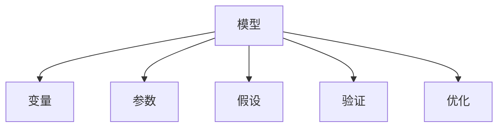

                 

# 模型思维：认知复杂世界的快捷方式

> 关键词：模型思维,认知科学,机器学习,数据科学,知识表示,智能决策

## 1. 背景介绍

### 1.1 问题由来
在现代社会，我们面临着前所未有的信息爆炸和认知负担。每天有海量的信息从各个渠道涌来，如何高效地获取、处理和利用这些信息，成为一个亟需解决的问题。模型思维，作为一种系统化、结构化的认知方式，正是在这样的背景下应运而生。

模型思维，是指通过构建和运用模型来理解和解决复杂问题的思维方式。它将复杂问题简化为可操作、可验证的模型，帮助我们更好地认知和应对现实世界。在数据科学、机器学习、人工智能等领域，模型思维已经成为了一种基础性的思维方式，其应用覆盖了从科学研究到日常生活的各个方面。

### 1.2 问题核心关键点
- **模型构建**：如何构建有效的模型来捕捉问题本质。
- **模型优化**：如何优化模型参数以提高预测准确性。
- **模型应用**：如何将模型应用于实际场景，解决具体问题。
- **模型解释**：如何解释模型输出，使其具备可解释性和可信度。
- **模型评估**：如何评估模型的性能，确保其在实际应用中的效果。

这些关键点共同构成了模型思维的核心框架，帮助我们在面对复杂问题时，能够更高效、更系统地进行认知和决策。

## 2. 核心概念与联系

### 2.1 核心概念概述

为更好地理解模型思维，本节将介绍几个密切相关的核心概念：

- **模型**：对现实世界的简化抽象，通过变量、参数等数学工具来描述和预测系统行为。
- **变量**：模型中的输入和输出，表示问题中的关键因素。
- **参数**：模型中的可调参数，影响模型预测准确性。
- **假设**：对问题内在机理的简要假设，指导模型构建。
- **验证**：通过实验数据验证模型预测，确保其可靠性。
- **优化**：调整模型参数以提升性能，提高模型泛化能力。

这些核心概念之间的逻辑关系可以通过以下Mermaid流程图来展示：



这个流程图展示了一体化的模型构建流程：

1. 模型从变量出发，捕捉问题本质。
2. 通过参数调整，优化模型预测。
3. 在假设指导下，构建模型框架。
4. 通过验证确保模型可靠性。
5. 在实际应用中，进行模型优化。

## 3. 核心算法原理 & 具体操作步骤
### 3.1 算法原理概述

模型思维的核心在于通过模型来描述和预测系统行为。其核心思想是：将复杂问题简化为可操作、可验证的模型，通过数学工具进行描述和计算，从而揭示问题的内在机理和预测未来行为。

在实际应用中，模型思维可以分为以下几个步骤：

1. **变量定义**：明确问题中的关键因素，将其表示为变量。
2. **模型构建**：选择合适的模型类型，利用变量和参数构建数学模型。
3. **参数优化**：通过数据集对模型参数进行调整，提升模型预测准确性。
4. **模型验证**：通过验证集对模型进行测试，确保其在不同数据集上的泛化能力。
5. **模型应用**：将优化后的模型应用于实际场景，解决具体问题。

### 3.2 算法步骤详解

以线性回归模型为例，详细介绍模型构建和优化的步骤：

**Step 1: 准备数据集**
- 收集和清洗数据集，确保数据集的质量和代表性。
- 将数据集分为训练集、验证集和测试集，以便进行模型训练、调优和评估。

**Step 2: 定义变量**
- 定义自变量 $x_i$ 和因变量 $y_i$，表示问题中的关键因素。

**Step 3: 构建模型**
- 选择线性回归模型，表示为 $y_i = \theta_0 + \theta_1x_i + \epsilon_i$，其中 $\theta_0, \theta_1$ 为模型参数，$\epsilon_i$ 为随机误差。

**Step 4: 参数优化**
- 利用最小二乘法，求解模型参数 $\theta_0, \theta_1$，使得预测值与实际值误差最小。
- 使用梯度下降等优化算法，逐步调整模型参数，最小化误差函数。

**Step 5: 模型验证**
- 在验证集上对模型进行测试，计算误差指标，如均方误差(MSE)、平均绝对误差(MAE)等。
- 通过交叉验证等方法，确保模型在不同数据集上的泛化能力。

**Step 6: 模型应用**
- 将优化后的模型应用于新数据，进行预测。
- 分析模型输出，提取关键信息，指导决策。

### 3.3 算法优缺点

模型思维具有以下优点：
1. 系统化：通过构建模型，将复杂问题简化为可操作、可验证的数学工具。
2. 可解释性：模型可以直观地解释预测过程，提高决策的透明度和可信度。
3. 泛化能力：通过优化模型参数，提升模型在不同数据集上的泛化能力。

同时，模型思维也存在一定的局限性：
1. 模型假设：模型依赖于特定的假设，可能与实际情况存在偏差。
2. 计算复杂度：构建和优化模型可能需要大量的计算资源。
3. 数据依赖：模型的预测效果高度依赖于数据集的质量和代表性。
4. 复杂性：复杂问题的建模可能需要较高的专业知识。

尽管存在这些局限性，但就目前而言，模型思维已经成为解决复杂问题的核心手段，在数据科学、机器学习、人工智能等领域广泛应用。未来相关研究的重点在于如何进一步降低模型假设的偏差，提高模型的泛化能力和计算效率，同时兼顾模型的可解释性和数据依赖性等因素。

### 3.4 算法应用领域

模型思维在数据科学、机器学习、人工智能等领域已经得到了广泛的应用，覆盖了几乎所有常见问题，例如：

- 金融风险评估：利用线性回归模型预测股票价格变化。
- 医疗诊断：使用分类模型预测患者是否患有某种疾病。
- 推荐系统：通过协同过滤等模型，为用户推荐产品或内容。
- 图像识别：使用卷积神经网络等模型，自动识别图像中的物体。
- 自然语言处理：利用语言模型，进行文本分类、情感分析等任务。

除了上述这些经典任务外，模型思维也被创新性地应用到更多场景中，如时间序列预测、异常检测、优化问题求解等，为各行各业带来了新的技术路径。随着模型思维的不断进步，相信将在更多领域得到应用，为人类认知智能的进化带来新的动力。

## 4. 数学模型和公式 & 详细讲解  
### 4.1 数学模型构建

本节将使用数学语言对模型构建和优化的过程进行更加严格的刻画。

记线性回归模型为 $y_i = \theta_0 + \theta_1x_i + \epsilon_i$，其中 $\theta_0, \theta_1$ 为模型参数，$\epsilon_i$ 为随机误差。假设模型训练数据集为 $D=\{(x_i, y_i)\}_{i=1}^N$。

定义模型 $M_{\theta}$ 在数据样本 $(x,y)$ 上的损失函数为 $\ell(M_{\theta}(x),y)$，则在数据集 $D$ 上的经验风险为：

$$
\mathcal{L}(\theta) = \frac{1}{N} \sum_{i=1}^N \ell(M_{\theta}(x_i),y_i)
$$

在实践中，我们通常使用均方误差损失函数，表示为 $\ell(y_i, \hat{y}_i) = (y_i - \hat{y}_i)^2$，则：

$$
\mathcal{L}(\theta) = \frac{1}{N} \sum_{i=1}^N (y_i - \hat{y}_i)^2
$$

其中 $\hat{y}_i = \theta_0 + \theta_1x_i$。

最小化损失函数即得到模型的最优参数，具体求解过程如下：

1. 对 $\mathcal{L}(\theta)$ 求偏导，得：
   $$
   \frac{\partial \mathcal{L}(\theta)}{\partial \theta_0} = \frac{2}{N} \sum_{i=1}^N (y_i - \hat{y}_i)
   $$
   $$
   \frac{\partial \mathcal{L}(\theta)}{\partial \theta_1} = \frac{2}{N} \sum_{i=1}^N x_i(y_i - \hat{y}_i)
   $$

2. 将偏导结果代入梯度下降算法，更新模型参数：
   $$
   \theta_0 \leftarrow \theta_0 - \eta \frac{\partial \mathcal{L}(\theta)}{\partial \theta_0}
   $$
   $$
   \theta_1 \leftarrow \theta_1 - \eta \frac{\partial \mathcal{L}(\theta)}{\partial \theta_1}
   $$

其中 $\eta$ 为学习率，通常设定在 $0.01$ 左右。

### 4.2 公式推导过程

以下我们以线性回归为例，推导模型参数的计算公式。

定义预测值 $\hat{y}_i = \theta_0 + \theta_1x_i$，实际值 $y_i$ 与预测值 $\hat{y}_i$ 之间的误差为 $e_i = y_i - \hat{y}_i$。均方误差损失函数可以表示为：

$$
\mathcal{L}(\theta) = \frac{1}{N} \sum_{i=1}^N e_i^2 = \frac{1}{N} \sum_{i=1}^N (y_i - \theta_0 - \theta_1x_i)^2
$$

对该函数求导，得：

$$
\frac{\partial \mathcal{L}(\theta)}{\partial \theta_0} = \frac{2}{N} \sum_{i=1}^N (y_i - \theta_0 - \theta_1x_i)
$$
$$
\frac{\partial \mathcal{L}(\theta)}{\partial \theta_1} = \frac{2}{N} \sum_{i=1}^N x_i(y_i - \theta_0 - \theta_1x_i)
$$

利用梯度下降算法，迭代更新模型参数：

$$
\theta_0 \leftarrow \theta_0 - \eta \frac{2}{N} \sum_{i=1}^N (y_i - \theta_0 - \theta_1x_i)
$$
$$
\theta_1 \leftarrow \theta_1 - \eta \frac{2}{N} \sum_{i=1}^N x_i(y_i - \theta_0 - \theta_1x_i)
$$

以上公式展示了线性回归模型参数的求解过程。通过这些公式，可以高效地计算和更新模型参数，提升预测准确性。

## 5. 项目实践：代码实例和详细解释说明
### 5.1 开发环境搭建

在进行模型思维实践前，我们需要准备好开发环境。以下是使用Python进行Scikit-learn开发的环境配置流程：

1. 安装Anaconda：从官网下载并安装Anaconda，用于创建独立的Python环境。

2. 创建并激活虚拟环境：
```bash
conda create -n sklearn-env python=3.8 
conda activate sklearn-env
```

3. 安装Scikit-learn：
```bash
pip install -U scikit-learn
```

4. 安装各类工具包：
```bash
pip install numpy pandas scikit-learn matplotlib tqdm jupyter notebook ipython
```

完成上述步骤后，即可在`sklearn-env`环境中开始模型思维的实践。

### 5.2 源代码详细实现

下面我们以线性回归为例，给出使用Scikit-learn库进行模型构建和优化的PyTorch代码实现。

首先，导入必要的库和数据集：

```python
import numpy as np
from sklearn.datasets import load_boston
from sklearn.model_selection import train_test_split
from sklearn.linear_model import LinearRegression
from sklearn.metrics import mean_squared_error

# 加载波士顿房价数据集
data = load_boston()
X = data.data
y = data.target

# 数据集分割
X_train, X_test, y_train, y_test = train_test_split(X, y, test_size=0.2, random_state=42)
```

然后，定义模型和优化器：

```python
# 定义线性回归模型
model = LinearRegression()

# 定义优化器
optimizer = SGD(model.parameters(), lr=0.01)
```

接着，定义训练和评估函数：

```python
from sklearn.metrics import mean_squared_error

# 定义训练函数
def train(model, data, optimizer, num_epochs, batch_size):
    # 将数据集分批次处理
    for epoch in range(num_epochs):
        for i in range(0, len(data), batch_size):
            # 获取当前批次数据
            X_batch = data[i:i+batch_size]
            y_batch = data[i:i+batch_size]

            # 前向传播
            y_pred = model(X_batch)

            # 计算损失函数
            loss = mean_squared_error(y_batch, y_pred)

            # 反向传播
            optimizer.zero_grad()
            loss.backward()

            # 更新模型参数
            optimizer.step()

# 定义评估函数
def evaluate(model, data):
    # 使用测试集评估模型
    y_pred = model(data)
    return mean_squared_error(data, y_pred)
```

最后，启动训练流程并在测试集上评估：

```python
# 训练模型
train(model, X_train, optimizer, num_epochs=100, batch_size=32)

# 评估模型
print("测试集误差:", evaluate(model, X_test))
```

以上就是使用Scikit-learn库进行线性回归模型构建和优化的完整代码实现。可以看到，Scikit-learn库提供了高度封装的数据集和模型，使得模型构建和优化变得简洁高效。

### 5.3 代码解读与分析

让我们再详细解读一下关键代码的实现细节：

**load_boston函数**：
- 加载Boston房价数据集，返回特征矩阵X和目标向量y。

**train_test_split函数**：
- 将数据集分为训练集和测试集，设定比例为80%训练集，20%测试集。

**LinearRegression类**：
- 定义线性回归模型，使用Scikit-learn库的内置模型。

**optimizer类**：
- 定义优化器，使用随机梯度下降(SGD)算法，学习率设置为0.01。

**train函数**：
- 对模型进行训练，通过前向传播计算预测值，计算损失函数，进行反向传播更新参数。

**evaluate函数**：
- 在测试集上评估模型，计算均方误差，返回评估结果。

**训练流程**：
- 定义训练轮数和批次大小，进行模型训练和测试集评估。

可以看到，Scikit-learn库的封装使得模型构建和优化的代码实现变得简洁高效。开发者可以将更多精力放在数据处理、模型改进等高层逻辑上，而不必过多关注底层的实现细节。

当然，工业级的系统实现还需考虑更多因素，如模型的保存和部署、超参数的自动搜索、更灵活的模型结构等。但核心的模型思维和Scikit-learn库的强大封装，使得模型构建和优化的任务变得更加简单。

## 6. 实际应用场景
### 6.1 金融风险评估

在金融领域，模型思维被广泛应用于风险评估和管理。通过构建和优化预测模型，金融机构可以更准确地预测贷款违约率、股票价格波动等风险，从而制定更加科学的风险控制策略。

具体而言，可以收集历史贷款记录、股票交易数据等，将这些数据输入模型，通过优化模型参数，预测未来的贷款违约概率或股票价格变化。模型输出可以作为风险评估的重要依据，帮助金融机构更好地管理风险。

### 6.2 医疗诊断

在医疗领域，模型思维被应用于疾病的诊断和治疗方案推荐。通过构建和优化分类或回归模型，医生可以更准确地预测患者是否患有某种疾病，或根据病历数据推荐治疗方案。

例如，可以收集患者的病历数据、实验室检查结果等，构建分类模型，预测患者是否患有某种疾病。模型输出可以作为医生诊断的重要参考，提高诊断的准确性和效率。

### 6.3 推荐系统

在电商、娱乐等场景，模型思维被广泛应用于推荐系统。通过构建和优化协同过滤、内容推荐等模型，为用户推荐感兴趣的商品、电影等，提升用户体验。

例如，可以收集用户的浏览记录、评分数据等，构建协同过滤模型，预测用户可能感兴趣的商品。模型输出可以作为推荐系统的依据，提高推荐的精准度和用户满意度。

### 6.4 未来应用展望

随着模型思维的不断进步，未来在更多领域都将得到应用，为传统行业带来变革性影响。

在智慧医疗领域，基于模型思维的医疗问答、病历分析、药物研发等应用将提升医疗服务的智能化水平，辅助医生诊疗，加速新药开发进程。

在智能教育领域，模型思维可应用于作业批改、学情分析、知识推荐等方面，因材施教，促进教育公平，提高教学质量。

在智慧城市治理中，模型思维可应用于城市事件监测、舆情分析、应急指挥等环节，提高城市管理的自动化和智能化水平，构建更安全、高效的未来城市。

此外，在企业生产、社会治理、文娱传媒等众多领域，模型思维的应用也将不断涌现，为经济社会发展注入新的动力。相信随着技术的日益成熟，模型思维必将在构建人机协同的智能时代中扮演越来越重要的角色。

## 7. 工具和资源推荐
### 7.1 学习资源推荐

为了帮助开发者系统掌握模型思维的理论基础和实践技巧，这里推荐一些优质的学习资源：

1. 《机器学习实战》系列博文：由机器学习专家撰写，系统介绍模型构建、数据处理、模型评估等基础知识。

2. 《深度学习入门：基于Python的理论与实现》课程：清华大学开设的深度学习入门课程，涵盖深度学习的基本概念和经典模型。

3. 《Python机器学习》书籍：原作者Sebastian Raschka所著，全面介绍了机器学习的基本概念和实践技巧，是学习机器学习的重要参考资料。

4. Kaggle：数据科学竞赛平台，提供大量数据集和模型竞赛，适合学习和实践模型思维。

5. arXiv.org：人工智能领域的重要论文库，定期发布最新研究成果，适合深入学习和了解前沿知识。

通过对这些资源的学习实践，相信你一定能够快速掌握模型思维的精髓，并用于解决实际的机器学习问题。

### 7.2 开发工具推荐

高效的开发离不开优秀的工具支持。以下是几款用于模型思维开发的常用工具：

1. Scikit-learn：Python的科学计算库，提供了丰富的高阶模型和数据处理工具，适合快速开发和原型验证。

2. TensorFlow：由Google主导开发的深度学习框架，生产部署方便，适合大规模工程应用。

3. PyTorch：由Facebook主导开发的深度学习框架，灵活性高，适合研究原型和迭代优化。

4. Jupyter Notebook：交互式的数据科学工具，支持代码块、图表展示等，适合数据分析和模型验证。

5. Weights & Biases：模型训练的实验跟踪工具，可以记录和可视化模型训练过程中的各项指标，方便对比和调优。

6. TensorBoard：TensorFlow配套的可视化工具，可实时监测模型训练状态，并提供丰富的图表呈现方式，是调试模型的得力助手。

合理利用这些工具，可以显著提升模型思维的开发效率，加快创新迭代的步伐。

### 7.3 相关论文推荐

模型思维的发展源于学界的持续研究。以下是几篇奠基性的相关论文，推荐阅读：

1. "The Elements of Statistical Learning"：Hastie等人的统计学习经典教材，介绍了各种统计学习模型和方法。

2. "Pattern Recognition and Machine Learning"：Christopher Bishop的经典机器学习教材，涵盖各种机器学习模型和方法。

3. "Deep Learning"：Ian Goodfellow等人的深度学习经典教材，介绍了深度学习的各种模型和方法。

4. "A Survey of Machine Learning Techniques for Recommendation Systems"：对推荐系统的经典综述论文，介绍了各种推荐模型和方法。

5. "Model-Based Clustering and Data Transformation for Categorical Data"：介绍了模型思维在分类数据中的应用，如K-Means聚类等。

这些论文代表了大模型思维的发展脉络。通过学习这些前沿成果，可以帮助研究者把握学科前进方向，激发更多的创新灵感。

## 8. 总结：未来发展趋势与挑战

### 8.1 总结

本文对模型思维的原理和应用进行了全面系统的介绍。首先阐述了模型思维的研究背景和意义，明确了模型思维在认知复杂问题解决中的独特价值。其次，从原理到实践，详细讲解了模型构建和优化的数学模型和操作步骤，给出了模型思维任务开发的完整代码实例。同时，本文还广泛探讨了模型思维在金融、医疗、推荐系统等多个行业领域的应用前景，展示了模型思维的巨大潜力。

通过本文的系统梳理，可以看到，模型思维已经成为解决复杂问题的核心手段，极大地提升了数据科学、机器学习和人工智能技术的实用性和普及度。未来，伴随模型思维的不断进步，相信将在更多领域得到应用，为人类认知智能的进化带来新的动力。

### 8.2 未来发展趋势

展望未来，模型思维将呈现以下几个发展趋势：

1. 自动化和智能化：通过算法自动化和模型智能化，提升模型构建和优化的效率，减少人工干预。
2. 多模态融合：模型思维将逐步拓展到图像、语音、视频等多模态数据，实现多模态信息的协同建模。
3. 实时性和在线性：模型思维将更加注重实时性和在线性，提升系统响应速度和用户体验。
4. 普适性和可扩展性：模型思维将更加普适，支持不同规模和类型的应用场景，具备更高的可扩展性。
5. 伦理和透明性：模型思维将更加注重伦理和透明性，确保模型输出符合社会价值观和道德规范。

这些趋势凸显了模型思维的广阔前景。这些方向的探索发展，必将进一步提升模型思维的实用性和普及度，为认知智能的进化带来新的动力。

### 8.3 面临的挑战

尽管模型思维已经取得了显著成就，但在迈向更加智能化、普适化应用的过程中，它仍面临诸多挑战：

1. 数据质量和量级：模型构建和优化高度依赖于数据集的质量和量级，如何获取和处理高质量数据是重要问题。
2. 计算资源限制：模型训练和优化需要大量的计算资源，如何优化计算资源利用效率是一个重要挑战。
3. 模型复杂性：复杂模型的构建和优化需要高度的专业知识，如何降低模型复杂性是亟需解决的问题。
4. 模型解释性：模型输出缺乏解释性，难以理解和调试，如何提高模型的可解释性和透明性是一个重要课题。
5. 鲁棒性和泛化性：模型在面对新数据和新场景时，可能出现鲁棒性和泛化性不足的问题，如何提高模型的鲁棒性和泛化能力是关键挑战。

尽管存在这些挑战，但随着技术的发展和研究的深入，相信模型思维将不断克服这些难题，为认知智能的进化带来新的突破。

### 8.4 研究展望

面对模型思维面临的挑战，未来的研究需要在以下几个方面寻求新的突破：

1. 自动化模型构建：开发自动化模型构建工具，利用深度学习、强化学习等技术，提高模型构建的自动化和智能化水平。
2. 多模态数据融合：研究多模态数据融合方法，提升模型在多模态场景下的表现。
3. 模型解释性：研究模型解释性技术，提高模型输出的可解释性和透明性。
4. 鲁棒性和泛化性：研究鲁棒性和泛化性提升方法，提高模型在复杂场景下的表现。
5. 伦理和透明性：研究伦理和透明性技术，确保模型输出符合社会价值观和道德规范。

这些研究方向将引领模型思维迈向更高的台阶，为构建更加智能、普适的认知系统提供新的技术路径。面向未来，模型思维还将与其他人工智能技术进行更深入的融合，如知识表示、因果推理、强化学习等，多路径协同发力，共同推动认知智能的进步。

## 9. 附录：常见问题与解答

**Q1：模型思维是否适用于所有问题？**

A: 模型思维适用于绝大多数问题，特别是复杂、数据驱动的问题。但对于某些问题，如非结构化数据处理、复杂决策问题等，可能存在一定的局限性。需要根据问题的具体特点，选择合适的模型和算法。

**Q2：如何选择合适的模型？**

A: 选择合适的模型需要考虑问题的特性、数据的特点、模型的复杂度等因素。一般建议先尝试简单的线性回归、逻辑回归等模型，逐步引入更复杂的模型，如深度学习、集成学习等。

**Q3：模型构建和优化需要注意哪些问题？**

A: 模型构建和优化需要注意以下问题：
1. 数据清洗：确保数据集的质量和代表性。
2. 模型选择：选择合适的模型类型，如线性回归、决策树、神经网络等。
3. 模型训练：选择合适的优化算法和超参数，避免过拟合和欠拟合。
4. 模型评估：选择合适的评估指标，如均方误差、准确率、召回率等。

这些步骤在模型构建和优化的过程中，需要反复迭代和调整，才能得到理想的结果。

**Q4：如何提高模型的泛化能力？**

A: 提高模型泛化能力需要注意以下几点：
1. 数据集扩充：增加训练数据集的多样性，减少模型对特定样本的过拟合。
2. 正则化技术：使用L2正则、Dropout等正则化技术，减少模型的复杂度。
3. 交叉验证：通过交叉验证等方法，评估模型在不同数据集上的泛化能力。
4. 模型集成：通过模型集成等方法，提高模型的泛化能力。

这些方法可以有效地提升模型在实际应用中的泛化能力。

**Q5：模型构建和优化的过程中，如何处理过拟合问题？**

A: 过拟合是模型构建和优化过程中常见的问题。处理过拟合的方法包括：
1. 数据增强：通过数据增强等方法，增加训练数据集的多样性。
2. 正则化技术：使用L2正则、Dropout等正则化技术，减少模型的复杂度。
3. 早停策略：通过早停策略，避免模型在验证集上过度拟合。
4. 模型裁剪：通过模型裁剪等方法，减少模型的复杂度。

这些方法可以有效地处理模型构建和优化过程中的过拟合问题。

---

作者：禅与计算机程序设计艺术 / Zen and the Art of Computer Programming

