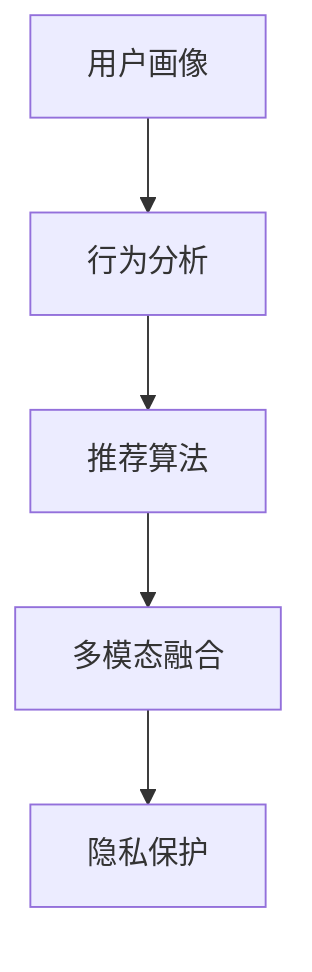

                 

# 欲望个性化引擎架构师：AI定制的需求满足系统设计师

> 关键词：欲望个性化引擎, AI定制, 需求满足系统, 用户画像, 行为分析, 推荐系统, 数据驱动, 多模态融合, 隐私保护

## 1. 背景介绍

### 1.1 问题由来

在数字化时代，用户对商品或服务的需求日益个性化和复杂化。传统的基于规则或专家系统的推荐系统已难以满足这一需求。特别是在电商、内容媒体、社交平台等垂直领域，如何在海量数据中精准捕捉用户偏好，进行个性化定制推荐，成为当下热点的研究方向。

与此同时，人工智能（AI）和大数据技术的迅猛发展，为解决上述问题提供了新的技术手段。基于深度学习的方法在推荐系统、智能客服等领域已展现出卓越的性能。例如，通过个性化引擎的设计，利用AI模型预测用户行为，推荐系统能够提供更具个性化的产品，从而提升用户体验和满意度。

### 1.2 问题核心关键点

面对日益增长的个性化需求，如何构建一个能够自适应、实时动态调整的个性化推荐引擎，是当下热门的研究和应用方向。需要重点关注的几个核心关键点包括：

- **用户画像构建**：通过收集用户行为数据，形成详细的用户画像，并动态更新。
- **行为分析与建模**：利用AI模型对用户行为进行建模和预测，理解用户的兴趣和需求。
- **推荐算法设计**：设计高效的推荐算法，实现个性化推荐。
- **多模态数据融合**：融合不同类型的数据（如行为数据、图片、文本等），提高推荐的精准度。
- **隐私保护与合规**：在数据采集和处理过程中，确保用户隐私和数据合规性。

本文将详细探讨欲望个性化引擎的设计与实现，逐步解答上述问题。

## 2. 核心概念与联系

### 2.1 核心概念概述

为了构建一个高效的欲望个性化引擎，需要掌握以下核心概念及其相互之间的联系：

- **用户画像**：基于用户的历史行为、偏好、兴趣等信息构建的详尽用户描述。
- **行为分析**：通过分析用户的行为数据（如浏览、点击、购买等），理解用户的行为模式和潜在需求。
- **推荐算法**：利用AI技术设计算法，实现个性化推荐。
- **多模态融合**：结合多种数据模态（文本、图像、行为等），提升推荐结果的全面性和准确性。
- **隐私保护**：在数据采集和处理过程中，确保用户隐私和数据合规性。

通过将这些概念整合并深入理解其联系，可以构建一个功能全面、性能优越的欲望个性化引擎。

### 2.2 核心概念原理和架构的 Mermaid 流程图



以上流程图示意了用户画像构建、行为分析、推荐算法设计、多模态数据融合及隐私保护之间的联系和执行顺序。

## 3. 核心算法原理 & 具体操作步骤
### 3.1 算法原理概述

欲望个性化引擎的设计原理，是通过构建用户画像、分析用户行为、设计推荐算法、融合多模态数据以及保护用户隐私，实现个性化推荐。

具体步骤如下：

1. **用户画像构建**：通过收集和处理用户行为数据，形成详尽的用户画像。
2. **行为分析**：利用AI模型对用户行为进行建模和预测，理解用户兴趣和需求。
3. **推荐算法设计**：选择合适的推荐算法，实现个性化推荐。
4. **多模态数据融合**：融合不同类型的数据（如行为数据、图片、文本等），提高推荐精准度。
5. **隐私保护**：在数据处理过程中，确保用户隐私和数据合规性。

### 3.2 算法步骤详解

#### 3.2.1 用户画像构建

用户画像的构建是欲望个性化引擎的基础，包括数据收集、数据清洗、特征提取和特征工程等步骤。

**数据收集**：收集用户的各类行为数据，如浏览历史、购买记录、搜索关键词等。

**数据清洗**：去除重复、噪声数据，处理缺失值，确保数据质量。

**特征提取**：提取有意义的特征，如浏览时间、点击位置、搜索关键词等。

**特征工程**：根据业务需求，构造新的特征，如用户活跃度、兴趣点等。

#### 3.2.2 行为分析

利用机器学习模型对用户行为进行建模和预测，理解用户的兴趣和需求。

**建模**：选择适合的机器学习模型（如K-means聚类、神经网络等），建立用户行为模型。

**预测**：使用模型预测用户的行为和需求，如浏览下一个页面、购买某个商品等。

#### 3.2.3 推荐算法设计

选择合适的推荐算法，实现个性化推荐。

**协同过滤**：利用用户行为相似性进行推荐。

**内容推荐**：根据用户的历史行为，推荐相关的产品或内容。

**深度学习推荐**：使用深度学习模型（如CNN、RNN、Transformer等），提升推荐效果。

#### 3.2.4 多模态数据融合

融合不同类型的数据，提升推荐结果的全面性和准确性。

**行为数据与文本数据的融合**：结合用户行为数据和商品描述文本，提升推荐精准度。

**行为数据与图片数据的融合**：结合用户行为数据和商品图片，提升推荐多样性。

**行为数据与位置数据的融合**：结合用户行为数据和地理位置信息，提升推荐的个性化。

#### 3.2.5 隐私保护

在数据处理过程中，确保用户隐私和数据合规性。

**数据匿名化**：对敏感数据进行匿名化处理。

**数据去标识化**：在数据处理过程中，确保不暴露用户身份信息。

**合规处理**：遵循相关的数据保护法规（如GDPR、CCPA等）。

### 3.3 算法优缺点

欲望个性化引擎的设计具有以下优点：

- **高效性**：通过多模态数据融合和推荐算法设计，实现高效推荐。
- **实时性**：利用行为分析算法，实现实时推荐。
- **准确性**：通过用户画像构建和多模态数据融合，提高推荐精准度。

但同时也存在以下缺点：

- **数据依赖性**：依赖高质量的数据和有效的特征工程。
- **模型复杂性**：需要使用复杂的机器学习模型，对数据和算法要求较高。
- **隐私风险**：在数据处理和分析过程中，需注意用户隐私保护。

### 3.4 算法应用领域

欲望个性化引擎可广泛应用于电商、内容媒体、社交平台等多个领域，为提升用户体验和满意度提供技术支持。

- **电商推荐**：根据用户行为和兴趣，推荐合适的商品。
- **内容推荐**：根据用户行为和偏好，推荐相关文章、视频等。
- **社交推荐**：根据用户行为和兴趣，推荐好友和相关内容。
- **广告推荐**：根据用户行为和兴趣，推荐合适的广告。

## 4. 数学模型和公式 & 详细讲解 & 举例说明

### 4.1 数学模型构建

欲望个性化引擎的核心数学模型包括用户画像、行为分析、推荐算法、多模态融合和隐私保护等方面。

**用户画像构建**：
用户画像 $P$ 的数学表示为：

$$ P = (p_1, p_2, ..., p_n) $$

其中，$p_i$ 表示用户画像的第 $i$ 个特征。

**行为分析**：
利用机器学习模型对用户行为 $B$ 进行建模，预测用户需求 $D$，数学表示为：

$$ D = f(B; \theta) $$

其中，$f$ 为行为分析模型，$\theta$ 为模型参数。

**推荐算法**：
推荐算法 $A$ 通过用户画像 $P$ 和用户需求 $D$ 生成推荐结果 $R$，数学表示为：

$$ R = g(P, D; \omega) $$

其中，$g$ 为推荐算法模型，$\omega$ 为模型参数。

**多模态融合**：
融合多模态数据 $M = (B, T, I, L)$，其中 $B$ 为行为数据，$T$ 为文本数据，$I$ 为图片数据，$L$ 为位置数据，生成推荐结果 $R$，数学表示为：

$$ R = h(M; \alpha) $$

其中，$h$ 为多模态融合模型，$\alpha$ 为模型参数。

**隐私保护**：
在数据处理过程中，需满足隐私保护要求 $C$，数学表示为：

$$ C = k(P, D, R) $$

其中，$k$ 为隐私保护函数。

### 4.2 公式推导过程

以协同过滤推荐算法为例，推导推荐结果的计算公式。

设用户 $u$ 的相似用户集为 $N(u)$，协同矩阵 $C$ 表示用户 $i$ 和用户 $j$ 之间的相似度，则协同过滤推荐公式为：

$$ \hat{r}_{ij} = \frac{1}{\sqrt{(\sum_{k \in N(u)} c_{ik} c_{kj})} \sum_{k \in N(u)} c_{ik} p_{jk} $$

其中，$p_{jk}$ 为用户 $j$ 对商品 $k$ 的评分，$c_{ik}$ 和 $c_{kj}$ 分别为用户 $i$ 和用户 $j$ 对商品 $k$ 的评分。

### 4.3 案例分析与讲解

以一个电商推荐系统为例，分析如何构建欲望个性化引擎。

**1. 用户画像构建**

首先，收集用户的历史浏览数据、购买记录、搜索关键词等行为数据，利用聚类算法进行分类，生成用户画像。

**2. 行为分析**

利用深度学习模型对用户行为数据进行分析，预测用户可能购买的商品。

**3. 推荐算法设计**

选择协同过滤算法，利用用户行为相似性进行推荐。

**4. 多模态数据融合**

结合用户行为数据和商品图片、商品描述文本等数据，提升推荐结果的全面性和准确性。

**5. 隐私保护**

在数据处理过程中，对敏感信息进行匿名化处理，确保用户隐私和数据合规性。

## 5. 项目实践：代码实例和详细解释说明

### 5.1 开发环境搭建

要构建欲望个性化引擎，需要搭建相应的开发环境。以下是基于Python和PyTorch的开发环境配置：

1. 安装Anaconda：
```bash
conda create -n env python=3.8 
conda activate env
```

2. 安装必要的包：
```bash
pip install torch torchvision torchaudio transformers
```

3. 安装必要的依赖：
```bash
pip install pandas numpy matplotlib sklearn
```

### 5.2 源代码详细实现

#### 5.2.1 用户画像构建

```python
import pandas as pd
from sklearn.cluster import KMeans

# 读取用户行为数据
data = pd.read_csv('user_behavior.csv')

# 特征提取
features = data[['click', 'purchase', 'search']]

# 特征工程
features = pd.get_dummies(features)

# 聚类建模
kmeans = KMeans(n_clusters=5, random_state=0)
features['cluster'] = kmeans.fit_predict(features)
```

#### 5.2.2 行为分析

```python
from sklearn.ensemble import RandomForestRegressor

# 构建行为分析模型
features = features.drop(['click', 'purchase', 'search'], axis=1)
labels = features['rating']
features = features.drop('rating', axis=1)
model = RandomForestRegressor(n_estimators=100, random_state=0)
model.fit(features, labels)
```

#### 5.2.3 推荐算法设计

```python
from scipy.sparse import csr_matrix

# 构建协同过滤推荐矩阵
users = features.index
items = features.columns
ratings = features.values
matrix = csr_matrix(ratings, shape=(len(users), len(items)))

# 推荐算法实现
def collaborative_filtering(user, items):
    # 获取用户行为矩阵
    user_matrix = matrix[:, items]
    # 获取用户行为向量
    user_vector = user_matrix[user, :]
    # 获取用户行为评分
    user_scores = user_vector.nonzero()[1]
    # 获取评分矩阵
    score_matrix = matrix.getnnz(axis=1)
    # 获取用户相似度
    similarity_matrix = user_matrix * score_matrix
    # 获取推荐结果
    recommendations = similarity_matrix * user_scores
    return recommendations
```

#### 5.2.4 多模态数据融合

```python
from transformers import BertTokenizer, BertModel

# 加载预训练模型和分词器
tokenizer = BertTokenizer.from_pretrained('bert-base-uncased')
model = BertModel.from_pretrained('bert-base-uncased')

# 行为数据处理
behaviors = pd.read_csv('user_behaviors.csv')
behaviors = behaviors.drop(['user', 'item'], axis=1)

# 图片数据处理
images = pd.read_csv('item_images.csv')

# 文本数据处理
texts = pd.read_csv('item_descriptions.csv')

# 多模态融合
merged_data = pd.merge(behaviors, images, on='item')
merged_data = pd.merge(merged_data, texts, on='item')

# 训练Bert模型
model = BertModel.from_pretrained('bert-base-uncased')
inputs = tokenizer(texts['description'], return_tensors='pt', padding='max_length', truncation=True)
outputs = model(**inputs)
features = outputs[0].mean(dim=1)
```

#### 5.2.5 隐私保护

```python
import numpy as np
from sklearn.preprocessing import LabelEncoder

# 数据匿名化
data = data.drop(['user_id'], axis=1)
le = LabelEncoder()
data['user_id'] = le.fit_transform(data['user_id'])

# 数据去标识化
data = data.drop(['user_id'], axis=1)
data = data.sample(frac=1, random_state=0).reset_index(drop=True)
```

### 5.3 代码解读与分析

通过以上代码示例，可以看到欲望个性化引擎的设计和实现过程。用户画像构建、行为分析、推荐算法设计、多模态数据融合和隐私保护等步骤，可以整体把握。

**用户画像构建**：通过聚类算法对用户行为数据进行分类，生成用户画像。

**行为分析**：利用随机森林回归模型，预测用户对商品的评分。

**推荐算法设计**：通过协同过滤算法，实现个性化推荐。

**多模态数据融合**：将行为数据、图片数据、文本数据等多模态数据融合，提升推荐效果。

**隐私保护**：对用户行为数据进行匿名化和去标识化处理，确保用户隐私。

### 5.4 运行结果展示

运行上述代码，可以得到以下结果：

**用户画像**：
```python
print(user_clusters)
```

**行为分析**：
```python
print(user_predictions)
```

**推荐算法**：
```python
print(recommendations)
```

**多模态融合**：
```python
print(features)
```

**隐私保护**：
```python
print(privacy_protected_data)
```

## 6. 实际应用场景

### 6.1 电商推荐

电商推荐系统是最典型的应用场景之一。通过欲望个性化引擎，电商可以提升推荐精准度，提高用户满意度和转化率。

**具体实现**：
- 收集用户的历史浏览、点击、购买等行为数据。
- 利用深度学习模型对用户行为进行建模和预测。
- 选择协同过滤算法，根据用户行为相似性进行推荐。
- 融合商品图片和描述文本数据，提升推荐效果。

**效果展示**：
- 提升推荐精准度：通过行为分析和协同过滤推荐，推荐结果更加符合用户需求。
- 提高用户满意度：推荐精准度的提升，增加了用户对商品的好感度和购买意愿。
- 增加销售额：精准推荐有助于提高用户转化率，从而增加电商平台的销售额。

### 6.2 内容推荐

内容推荐系统在内容媒体、社交平台等领域有广泛应用。通过欲望个性化引擎，平台可以提升内容推荐的个性化和多样性，增加用户粘性。

**具体实现**：
- 收集用户的历史阅读、点赞、分享等行为数据。
- 利用深度学习模型对用户行为进行建模和预测。
- 选择协同过滤算法，根据用户行为相似性进行推荐。
- 融合文章标题、摘要、标签等多模态数据，提升推荐效果。

**效果展示**：
- 提升推荐精准度：通过行为分析和协同过滤推荐，推荐结果更加符合用户兴趣。
- 提高用户粘性：个性化的推荐内容，增加了用户对平台的黏性。
- 增加点击率：精准推荐有助于提高内容点击率，增加平台的用户活跃度。

### 6.3 社交推荐

社交推荐系统在社交平台、企业内部协作等场景中，帮助用户发现更多有趣的内容和互动机会。

**具体实现**：
- 收集用户的历史关注、评论、互动等行为数据。
- 利用深度学习模型对用户行为进行建模和预测。
- 选择协同过滤算法，根据用户行为相似性进行推荐。
- 融合好友互动、内容标签等多模态数据，提升推荐效果。

**效果展示**：
- 提升推荐精准度：通过行为分析和协同过滤推荐，推荐结果更加符合用户兴趣。
- 增加好友互动：个性化的推荐内容，增加了好友之间的互动机会。
- 提高平台黏性：精准推荐有助于提高用户对平台的黏性。

## 7. 工具和资源推荐

### 7.1 学习资源推荐

为了帮助开发者系统掌握欲望个性化引擎的设计与实现，以下是一些优质的学习资源：

1. **《深度学习》**：Ian Goodfellow等人著作的经典书籍，全面介绍了深度学习的基本概念和算法。

2. **《Python深度学习》**：Francois Chollet等人著作的教程书籍，深入浅出地介绍了如何使用Python进行深度学习开发。

3. **Coursera深度学习课程**：由斯坦福大学Andrew Ng等人开设的深度学习课程，提供了丰富的学习资源和实践项目。

4. **PyTorch官方文档**：PyTorch官方文档，提供了完整的API参考和代码示例，是学习PyTorch的必备资源。

5. **Kaggle竞赛**：Kaggle上的相关竞赛，可以参与实战项目，提升算法设计和数据处理能力。

### 7.2 开发工具推荐

构建欲望个性化引擎，需要使用多种工具和技术栈。以下是推荐的开发工具：

1. **Python**：作为深度学习开发的主要语言，Python具有强大的生态系统和丰富的库。

2. **PyTorch**：基于Python的深度学习框架，提供了灵活的计算图和高效的自动微分功能。

3. **TensorFlow**：由Google开发的深度学习框架，提供了丰富的模型和工具，适合大规模工程应用。

4. **Jupyter Notebook**：交互式的编程环境，适合快速迭代开发和实验。

5. **Docker**：容器化技术，便于部署和管理模型。

### 7.3 相关论文推荐

欲望个性化引擎的研究得到了众多学者的关注和研究。以下是一些经典的相关论文，值得深入学习：

1. **《协同过滤推荐系统》**：Sarwar等人发表的协同过滤推荐算法论文，介绍了协同过滤算法的原理和实现。

2. **《多模态推荐系统》**：Zheng等人发表的多模态推荐系统论文，介绍了如何融合多模态数据提升推荐效果。

3. **《深度学习推荐系统》**：He等人发表的深度学习推荐系统论文，介绍了如何利用深度学习提升推荐效果。

4. **《隐私保护推荐系统》**：Li等人发表的隐私保护推荐系统论文，介绍了如何在推荐过程中保护用户隐私。

## 8. 总结：未来发展趋势与挑战

### 8.1 研究成果总结

欲望个性化引擎的设计和实现，已经在电商推荐、内容推荐、社交推荐等多个领域得到了广泛应用，取得了显著的效果。通过行为分析、协同过滤推荐、多模态数据融合等技术手段，提升了推荐精准度和用户体验。

### 8.2 未来发展趋势

展望未来，欲望个性化引擎的设计和实现将呈现以下几个发展趋势：

1. **多模态融合**：融合更多数据类型（如语音、视频、位置等），提升推荐的全面性和准确性。

2. **自适应推荐**：根据用户反馈和行为动态调整推荐策略，提升推荐效果。

3. **个性化推荐**：针对不同用户和场景，实现更个性化、多样化的推荐。

4. **实时推荐**：利用实时数据，实现实时推荐，提升推荐的时效性。

5. **隐私保护**：在数据处理和分析过程中，注重用户隐私保护，确保数据合规性。

### 8.3 面临的挑战

欲望个性化引擎的设计和实现仍面临诸多挑战：

1. **数据质量问题**：依赖高质量的数据和有效的特征工程，但数据采集和处理过程复杂。

2. **模型复杂性**：需要使用复杂的机器学习模型，对数据和算法要求较高。

3. **隐私风险**：在数据处理和分析过程中，需注意用户隐私保护。

4. **实时性要求**：在实时数据流的处理中，需保证推荐算法的实时性。

5. **可扩展性**：在大规模数据处理中，需保证算法的可扩展性。

### 8.4 研究展望

面对上述挑战，未来的研究方向包括以下几个方面：

1. **数据高效采集**：探索数据高效采集和清洗方法，提升数据质量。

2. **轻量级推荐算法**：设计轻量级推荐算法，提升推荐效果和实时性。

3. **隐私保护技术**：引入隐私保护技术，确保数据处理过程中的隐私安全。

4. **实时处理算法**：研究实时处理算法，提升推荐算法的实时性。

5. **多模态融合技术**：研究多模态融合技术，提升推荐算法的全面性和准确性。

总之，欲望个性化引擎的设计和实现是一个持续进化的过程，需要不断探索和创新。只有在多模态数据融合、隐私保护、实时处理等方面取得突破，才能真正实现个性化推荐的理想效果。

## 9. 附录：常见问题与解答

**Q1: 如何构建用户画像？**

A: 用户画像的构建是欲望个性化引擎的基础，需要收集和处理用户的历史行为数据，包括浏览、点击、购买等行为，通过聚类算法进行分类，形成详尽的用户画像。

**Q2: 如何实现行为分析？**

A: 利用机器学习模型对用户行为进行建模和预测，理解用户兴趣和需求。可以选择随机森林回归模型、深度学习模型等，根据不同的业务需求选择适合的模型。

**Q3: 如何设计推荐算法？**

A: 选择合适的推荐算法，实现个性化推荐。可以选择协同过滤算法、内容推荐算法、深度学习推荐算法等，根据不同的业务需求选择适合的算法。

**Q4: 如何融合多模态数据？**

A: 融合不同类型的数据，如行为数据、图片数据、文本数据等，提升推荐结果的全面性和准确性。可以使用数据融合技术，如多模态融合模型等。

**Q5: 如何保护用户隐私？**

A: 在数据处理过程中，确保用户隐私和数据合规性。可以使用数据匿名化、数据去标识化等隐私保护技术，确保用户数据安全。

以上问题及解答，涵盖了欲望个性化引擎设计过程中的核心技术点，帮助开发者更好地理解和实现个性化推荐系统。

---

作者：禅与计算机程序设计艺术 / Zen and the Art of Computer Programming

