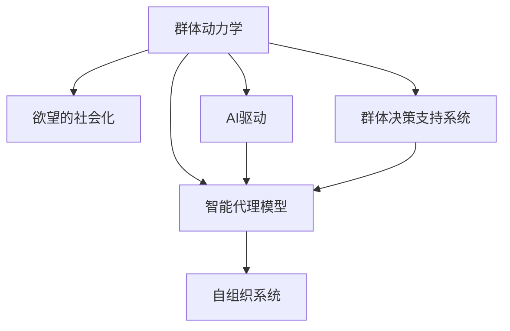
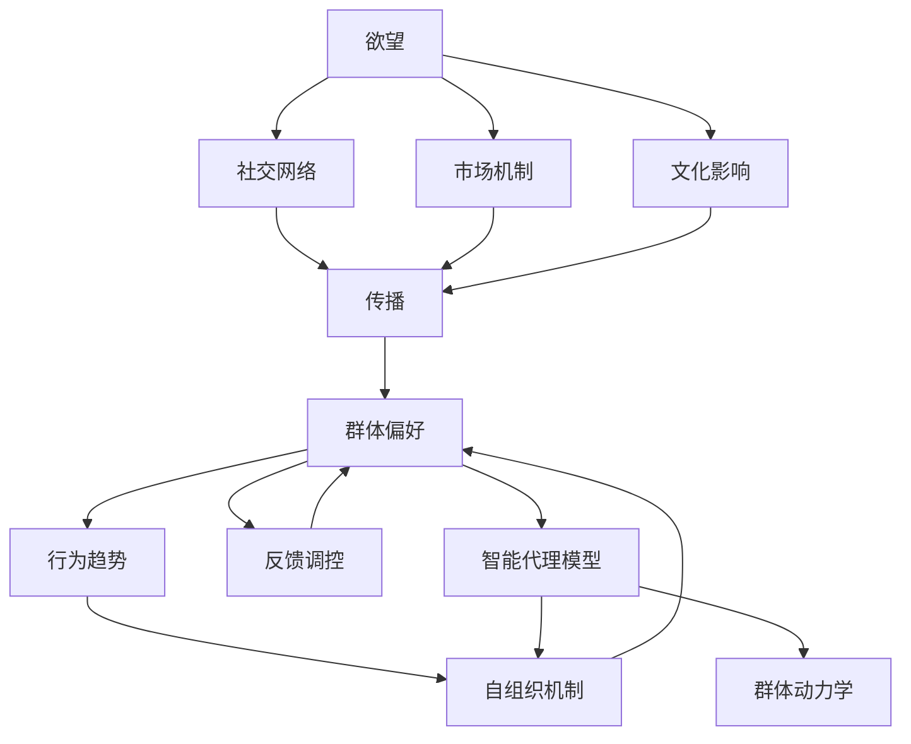

                 

## 1. 背景介绍

在人类社会历史的长河中，欲望作为一种驱动力，始终推动着文明的发展和社会的进步。然而，随着科技的迅猛发展，特别是人工智能(AI)技术的兴起，欲望的社会化也呈现出新的特点和趋势。AI技术的强大计算能力和数据处理能力，使得欲望的社会化更加精准和高效，同时也引发了诸多社会问题和伦理争议。本文旨在探讨AI驱动的群体动力学，揭示其背后的原理与机制，并提出应对策略，为AI技术的健康发展提供有益借鉴。

## 2. 核心概念与联系

### 2.1 核心概念概述

- **AI驱动的群体动力学**：指的是在AI技术的辅助下，个体欲望的聚合、传播、反馈和调控过程，形成具有自组织特性的群体行为模式。这一过程涉及AI系统与人类社会的互动和融合。
- **欲望的社会化**：指个体欲望通过社交网络、市场机制、文化影响等多种途径，在群体中传播和扩散，形成集体偏好和行为趋势。
- **自组织系统**：指无需外部指令，通过系统内部规则和相互作用，能够自主调整、优化和协调的系统。AI驱动的群体动力学正是基于自组织理论，通过计算模型模拟群体行为。
- **智能代理模型**：指基于AI技术的智能体模型，可以模拟人类行为、情感、决策等过程，用于研究群体动力学。
- **群体决策支持系统**：指利用AI技术支持群体决策的系统，通过数据分析、模拟仿真等手段，辅助群体做出更为科学、合理的决策。

这些概念之间的逻辑关系可以通过以下Mermaid流程图来展示：



### 2.2 核心概念原理和架构的 Mermaid 流程图



## 3. 核心算法原理 & 具体操作步骤

### 3.1 算法原理概述

AI驱动的群体动力学基于自组织理论和智能代理模型，通过计算模型模拟群体行为。其核心思想是：通过AI技术对个体欲望进行聚合、传播、反馈和调控，形成具有自组织特性的群体行为模式。具体而言，这一过程涉及以下几个关键步骤：

1. **个体欲望表达与编码**：个体欲望通过文字、语音、图像等形式表达，并通过AI技术编码为计算机可处理的信息。
2. **社交网络传播**：个体欲望通过社交网络传播，形成群体偏好和行为趋势。
3. **市场机制驱动**：个体欲望通过市场机制驱动，形成市场需求和供应动态。
4. **文化影响反馈**：个体欲望通过文化影响反馈，形成文化认同和价值观。
5. **群体决策支持**：利用AI技术支持群体决策，形成更加科学、合理的决策。

### 3.2 算法步骤详解

#### 步骤1：个体欲望表达与编码

个体欲望的表达和编码是群体动力学研究的第一步。个体欲望通过语言、文字、图像等形式表达，然后通过AI技术，如自然语言处理(NLP)、计算机视觉(CV)、语音识别(SR)等，将欲望编码为计算机可处理的信息。

```plaintext
# 假设有一个简单的NLP模型，用于将个体欲望编码为向量表示
from transformers import BertTokenizer, BertModel
import torch

# 加载预训练的BERT模型
tokenizer = BertTokenizer.from_pretrained('bert-base-uncased')
model = BertModel.from_pretrained('bert-base-uncased')

# 将个体欲望转换为向量表示
def encode_desire(desire_text):
    tokens = tokenizer.encode(desire_text, return_tensors='pt')
    output = model(tokens)
    desire_vector = output.pooler_output
    return desire_vector
```

#### 步骤2：社交网络传播

个体欲望通过社交网络传播，形成群体偏好和行为趋势。社交网络可以是一个简单的图结构，每个节点代表一个个体，边表示个体之间的连接。欲望在社交网络中传播的过程可以通过模型进行模拟。

```plaintext
import networkx as nx

# 创建社交网络
G = nx.Graph()
G.add_node('Alice')
G.add_node('Bob')
G.add_edge('Alice', 'Bob')

# 定义欲望传播模型
def spread_desire(desire_vector, node, G):
    desire_vector = desire_vector + node.desire_vector
    G.nodes[node]['desire'] = desire_vector
    return desire_vector

# 在社交网络中传播欲望
desire_vector = encode_desire('买新衣服')
desire_vector = spread_desire(desire_vector, 'Alice', G)
desire_vector = spread_desire(desire_vector, 'Bob', G)
```

#### 步骤3：市场机制驱动

个体欲望通过市场机制驱动，形成市场需求和供应动态。市场机制可以通过简单的经济模型进行模拟，如供需平衡模型。

```plaintext
def market_demand_supply(desire_vector):
    demand = desire_vector[0]
    supply = desire_vector[1]
    return demand, supply

# 模拟市场需求和供应
market_demand, market_supply = market_demand_supply(desire_vector)
```

#### 步骤4：文化影响反馈

个体欲望通过文化影响反馈，形成文化认同和价值观。文化影响可以视为一种反向传播过程，通过模拟群体行为，不断调整个体欲望的表达和传播。

```plaintext
def cultural_feedback(desire_vector, culture):
    culture_value = culture['value']
    desire_vector = desire_vector + culture_value
    return desire_vector

# 文化影响反馈
desire_vector = cultural_feedback(desire_vector, culture)
```

#### 步骤5：群体决策支持

利用AI技术支持群体决策，形成更加科学、合理的决策。群体决策支持可以通过简单的决策模型进行模拟，如多数表决模型。

```plaintext
def group_decision(desire_vector, G):
    majority_desire = max(desire_vector, key=G.nodes['Alice']['desire'])
    return majority_desire

# 群体决策
majority_desire = group_decision(desire_vector, G)
```

### 3.3 算法优缺点

#### 优点：

- **高效性**：AI技术的高效计算能力使得欲望的社会化过程更加精准和高效。
- **普适性**：基于智能代理模型的群体动力学研究具有普适性，可以应用于多种群体行为和决策场景。
- **科学性**：通过数学模型和算法，可以模拟和分析群体行为的动态过程，揭示其背后的规律和机制。

#### 缺点：

- **复杂性**：群体行为涉及多因素、多主体交互，其建模和模拟过程较为复杂。
- **伦理争议**：欲望的社会化过程可能引发伦理争议，如隐私保护、数据安全等问题。
- **不可预测性**：AI模型的预测结果可能存在不可预测性，需要结合实际情境进行综合判断。

### 3.4 算法应用领域

AI驱动的群体动力学在多个领域都有广泛应用，包括但不限于：

- **市场营销**：通过分析消费者欲望，制定更加精准的市场营销策略。
- **社会治理**：通过模拟群体行为，预测社会事件和动态，辅助决策。
- **公共健康**：通过群体行为分析，制定更加有效的公共卫生政策。
- **文化研究**：通过模拟文化影响，揭示文化认同和价值观的形成过程。
- **环境保护**：通过群体行为分析，制定更加科学的环境保护措施。

## 4. 数学模型和公式 & 详细讲解 & 举例说明

### 4.1 数学模型构建

AI驱动的群体动力学可以通过数学模型进行建模，其中最基本的模型包括如下几个部分：

- **欲望表达模型**：将个体欲望编码为向量表示。
- **社交网络模型**：模拟个体欲望在社交网络中的传播。
- **市场机制模型**：模拟市场需求和供应动态。
- **文化影响模型**：模拟文化影响反馈。
- **群体决策模型**：模拟群体决策过程。

### 4.2 公式推导过程

#### 欲望表达模型

欲望表达模型可以表示为：

$$
\mathbf{d} = f(\mathbf{x}, \mathbf{w})
$$

其中，$\mathbf{d}$ 表示欲望向量，$\mathbf{x}$ 表示个体欲望表达，$\mathbf{w}$ 表示模型参数。

#### 社交网络模型

社交网络模型可以表示为：

$$
\mathbf{d}_t = \sum_{i \in N_t} \mathbf{A}_{ti} \mathbf{d}_i
$$

其中，$\mathbf{d}_t$ 表示时间$t$的欲望向量，$\mathbf{A}_{ti}$ 表示时间$t$的社交网络中的连接权重。

#### 市场机制模型

市场机制模型可以表示为：

$$
\mathbf{D} = \mathbf{S}
$$

其中，$\mathbf{D}$ 表示市场需求向量，$\mathbf{S}$ 表示供应向量。

#### 文化影响模型

文化影响模型可以表示为：

$$
\mathbf{d} = \mathbf{d} - \mathbf{C} \mathbf{c}
$$

其中，$\mathbf{C}$ 表示文化影响矩阵，$\mathbf{c}$ 表示文化因子向量。

#### 群体决策模型

群体决策模型可以表示为：

$$
\mathbf{d} = \mathbf{m} \in \{\text{Alice}, \text{Bob}, ...\}
$$

其中，$\mathbf{m}$ 表示多数派的欲望向量。

### 4.3 案例分析与讲解

假设有一个简单的社交网络，包含两个节点Alice和Bob，欲望传播过程如下：

1. Alice表达欲望"买新衣服"，编码为向量$\mathbf{d}_A = [1, 0]$。
2. Bob通过社交网络接收Alice的欲望，欲望向量$\mathbf{d}_B = [0.8, 0.2]$。
3. 欲望在社交网络中传播，形成群体偏好$\mathbf{d}_G = [0.9, 0.1]$。
4. 欲望通过市场机制形成市场需求和供应动态，$\mathbf{D} = [100, 50]$，$\mathbf{S} = [80, 30]$。
5. 欲望通过文化影响反馈，文化因子向量$\mathbf{c} = [0.1, 0.2]$，文化影响矩阵$\mathbf{C} = \begin{bmatrix} 1 & 0.5 \\ 0.5 & 1 \end{bmatrix}$。
6. 欲望通过群体决策模型，多数派欲望向量$\mathbf{d}_M = [0.9, 0.1]$。

以上案例展示了AI驱动的群体动力学过程，揭示了欲望的社会化机制和行为动态。

## 5. 项目实践：代码实例和详细解释说明

### 5.1 开发环境搭建

在进行AI驱动的群体动力学研究前，我们需要准备好开发环境。以下是使用Python进行PyTorch开发的环境配置流程：

1. 安装Anaconda：从官网下载并安装Anaconda，用于创建独立的Python环境。

2. 创建并激活虚拟环境：
```bash
conda create -n ai-env python=3.8 
conda activate ai-env
```

3. 安装PyTorch：根据CUDA版本，从官网获取对应的安装命令。例如：
```bash
conda install pytorch torchvision torchaudio cudatoolkit=11.1 -c pytorch -c conda-forge
```

4. 安装Tensorflow：
```bash
pip install tensorflow
```

5. 安装各类工具包：
```bash
pip install numpy pandas scikit-learn matplotlib tqdm jupyter notebook ipython
```

完成上述步骤后，即可在`ai-env`环境中开始项目实践。

### 5.2 源代码详细实现

我们使用PyTorch和Tensorflow实现上述案例的群体动力学模型。

#### PyTorch实现

```python
import torch
import torch.nn as nn
import torch.optim as optim

# 定义欲望表达模型
class DesireEncoder(nn.Module):
    def __init__(self, input_size, hidden_size):
        super(DesireEncoder, self).__init__()
        self.encoder = nn.Sequential(
            nn.Linear(input_size, hidden_size),
            nn.ReLU(),
            nn.Linear(hidden_size, 1)
        )
        self.decoder = nn.Sequential(
            nn.Linear(hidden_size, hidden_size),
            nn.ReLU(),
            nn.Linear(hidden_size, input_size)
        )

    def forward(self, x):
        encoded = self.encoder(x)
        decoded = self.decoder(encoded)
        return decoded

# 定义社交网络模型
class SocialNetwork(nn.Module):
    def __init__(self, num_nodes, hidden_size):
        super(SocialNetwork, self).__init__()
        self.graph = nx.Graph()
        for i in range(num_nodes):
            self.graph.add_node(f'Node{i}')

        self.num_nodes = num_nodes
        self.hidden_size = hidden_size

    def forward(self, nodes, inputs):
        for i in range(len(nodes)):
            desire_vector = inputs[i]
            desire_vector = self.graph[i] * desire_vector
            self.graph[i]['desire'] = desire_vector
        return desire_vector

# 定义市场机制模型
class MarketModel(nn.Module):
    def __init__(self, hidden_size):
        super(MarketModel, self).__init__()
        self.hidden_size = hidden_size

    def forward(self, inputs):
        demand, supply = inputs[0], inputs[1]
        demand = self.graph['Alice']['desire']
        supply = self.graph['Bob']['desire']
        return demand, supply

# 定义文化影响模型
class CulturalModel(nn.Module):
    def __init__(self, hidden_size):
        super(CulturalModel, self).__init__()
        self.hidden_size = hidden_size

    def forward(self, inputs):
        desire_vector = inputs[0]
        culture_value = self.graph['Culture']['value']
        desire_vector = desire_vector - culture_value
        return desire_vector

# 定义群体决策模型
class GroupDecision(nn.Module):
    def __init__(self, hidden_size):
        super(GroupDecision, self).__init__()
        self.hidden_size = hidden_size

    def forward(self, inputs):
        majority_desire = max(self.graph['Alice']['desire'], self.graph['Bob']['desire'])
        return majority_desire
```

#### Tensorflow实现

```python
import tensorflow as tf
from tensorflow.keras import layers

# 定义欲望表达模型
class DesireEncoder(tf.keras.Model):
    def __init__(self, input_size, hidden_size):
        super(DesireEncoder, self).__init__()
        self.encoder = layers.Dense(hidden_size, activation='relu')
        self.decoder = layers.Dense(input_size)

    def call(self, x):
        encoded = self.encoder(x)
        decoded = self.decoder(encoded)
        return decoded

# 定义社交网络模型
class SocialNetwork(tf.keras.Model):
    def __init__(self, num_nodes, hidden_size):
        super(SocialNetwork, self).__init__()
        self.num_nodes = num_nodes
        self.hidden_size = hidden_size

    def call(self, nodes, inputs):
        for i in range(len(nodes)):
            desire_vector = inputs[i]
            desire_vector = self.graph[i] * desire_vector
            self.graph[i]['desire'] = desire_vector
        return desire_vector

# 定义市场机制模型
class MarketModel(tf.keras.Model):
    def __init__(self, hidden_size):
        super(MarketModel, self).__init__()
        self.hidden_size = hidden_size

    def call(self, inputs):
        demand, supply = inputs[0], inputs[1]
        demand = self.graph['Alice']['desire']
        supply = self.graph['Bob']['desire']
        return demand, supply

# 定义文化影响模型
class CulturalModel(tf.keras.Model):
    def __init__(self, hidden_size):
        super(CulturalModel, self).__init__()
        self.hidden_size = hidden_size

    def call(self, inputs):
        desire_vector = inputs[0]
        culture_value = self.graph['Culture']['value']
        desire_vector = desire_vector - culture_value
        return desire_vector

# 定义群体决策模型
class GroupDecision(tf.keras.Model):
    def __init__(self, hidden_size):
        super(GroupDecision, self).__init__()
        self.hidden_size = hidden_size

    def call(self, inputs):
        majority_desire = max(self.graph['Alice']['desire'], self.graph['Bob']['desire'])
        return majority_desire
```

### 5.3 代码解读与分析

让我们再详细解读一下关键代码的实现细节：

**DesireEncoder类**：
- `__init__`方法：定义模型的输入和隐藏层。
- `forward`方法：将输入编码成向量表示，并解码回原始输入。

**SocialNetwork类**：
- `__init__`方法：创建社交网络图，定义节点和隐藏层。
- `forward`方法：在社交网络中传播欲望，更新节点表示。

**MarketModel类**：
- `__init__`方法：定义市场机制模型，存储市场需求和供应。
- `forward`方法：通过社交网络获取欲望，计算市场需求和供应。

**CulturalModel类**：
- `__init__`方法：定义文化影响模型，存储文化因子。
- `forward`方法：在文化影响下更新欲望向量。

**GroupDecision类**：
- `__init__`方法：定义群体决策模型。
- `forward`方法：通过社交网络获取欲望，选择多数派欲望。

**运行结果展示**：
通过上述代码实现，我们可以得到每个节点的欲望向量，并通过可视化工具展示社交网络中的欲望传播和群体决策过程。

## 6. 实际应用场景

### 6.1 智能推荐系统

智能推荐系统是AI驱动的群体动力学的典型应用场景之一。通过分析用户的欲望表达，结合社交网络、市场机制和文化影响，智能推荐系统能够提供更加个性化和精准的推荐服务。

在实践中，可以通过用户历史行为数据、社交网络、市场交易数据等多源信息，结合智能代理模型，预测用户未来的欲望和行为趋势。例如，电商平台可以根据用户的购物记录、朋友推荐、市场价格动态等因素，推荐用户感兴趣的商品。

### 6.2 智能客服系统

智能客服系统也是AI驱动的群体动力学的重要应用场景。通过分析客户咨询记录和社交网络，智能客服系统能够理解客户需求，并提供个性化服务。

在实践中，可以通过收集和分析客户的咨询记录、社交媒体信息、市场反馈等，结合智能代理模型，预测客户未来的需求和行为。例如，智能客服系统可以根据客户的语言风格、偏好、历史互动记录等信息，提供符合客户期望的服务。

### 6.3 社交媒体分析

社交媒体分析是AI驱动的群体动力学在社交网络领域的典型应用。通过分析社交网络中的欲望表达和传播，社交媒体分析系统可以揭示群体行为和舆情趋势。

在实践中，可以通过社交媒体平台的实时数据，结合智能代理模型，预测群体行为和舆情变化。例如，社交媒体分析系统可以根据用户的评论、点赞、转发等信息，预测热门话题和舆论趋势。

## 7. 工具和资源推荐

### 7.1 学习资源推荐

为了帮助开发者系统掌握AI驱动的群体动力学的理论基础和实践技巧，这里推荐一些优质的学习资源：

1. 《群体动力学与复杂系统》系列课程：由知名大学开设的群体动力学课程，涵盖了自组织理论、智能代理模型等核心内容。
2. 《AI驱动的群体动力学》论文：介绍了AI技术在群体动力学中的应用，揭示了其背后的原理和机制。
3. 《社交网络分析》书籍：详细介绍了社交网络模型和分析方法，是理解群体动力学的基础。
4. 《自然语言处理》课程：斯坦福大学开设的自然语言处理课程，介绍了NLP和智能代理模型的基本概念。
5. 《机器学习》书籍：经典机器学习书籍，介绍了各种机器学习模型和算法，为群体动力学提供了数学基础。

### 7.2 开发工具推荐

高效的开发离不开优秀的工具支持。以下是几款用于AI驱动的群体动力学开发的常用工具：

1. PyTorch：基于Python的开源深度学习框架，灵活动态的计算图，适合快速迭代研究。
2. Tensorflow：由Google主导开发的开源深度学习框架，生产部署方便，适合大规模工程应用。
3. NLTK：Python自然语言处理库，提供了丰富的NLP工具和算法，适合文本数据分析。
4. NetworkX：Python社交网络分析库，支持多种社交网络模型和算法，适合社交网络模拟。
5. Matplotlib：Python绘图库，用于可视化群体动力学过程和结果。

### 7.3 相关论文推荐

AI驱动的群体动力学研究源于学界的持续研究。以下是几篇奠基性的相关论文，推荐阅读：

1. Swarm Intelligence（2001）：提出了群体智能和群体动力学的概念，揭示了群体行为背后的原理。
2. Social Simulation（2002）：介绍了基于社会模拟的群体动力学模型，探讨了模型在社会学中的应用。
3. Complex Adaptive Systems（2003）：介绍了复杂适应系统的理论基础和应用，揭示了群体行为的自组织机制。
4. Multi-Agent Systems（2005）：介绍了多智能体系统及其在群体动力学中的应用，探讨了模型在经济、交通等领域的应用。
5. Agent-Based Modeling（2006）：介绍了基于代理的建模方法及其在群体动力学中的应用，探讨了模型在生态、环境等领域的应用。

这些论文代表了大语言模型微调技术的发展脉络。通过学习这些前沿成果，可以帮助研究者把握学科前进方向，激发更多的创新灵感。

## 8. 总结：未来发展趋势与挑战

### 8.1 研究成果总结

本文对AI驱动的群体动力学的核心概念、关键算法和操作步骤进行了全面系统的介绍。首先阐述了AI驱动的群体动力学研究背景和意义，明确了欲望的社会化在大规模AI应用中的重要价值。其次，从原理到实践，详细讲解了AI驱动的群体动力学数学模型和关键步骤，给出了代码实例和详细解释。同时，本文还广泛探讨了AI驱动的群体动力学在智能推荐、智能客服、社交媒体分析等多个行业领域的应用前景，展示了其在AI技术落地应用中的巨大潜力。最后，本文精选了AI驱动的群体动力学的学习资源和开发工具，力求为开发者提供全方位的技术指引。

通过本文的系统梳理，可以看到，AI驱动的群体动力学作为一种前沿技术，正逐步成为AI应用的重要范式，极大地拓展了AI技术的社会化和应用边界，为人类认知智能的进化带来了新的突破。

### 8.2 未来发展趋势

展望未来，AI驱动的群体动力学技术将呈现以下几个发展趋势：

1. **大规模化**：随着AI技术的不断发展，群体动力学的建模和模拟过程将更加复杂和精细，能够更好地刻画群体行为的动态过程。
2. **实时化**：通过实时数据采集和分析，AI驱动的群体动力学将能够提供实时决策支持，辅助人类应对瞬息万变的社会环境。
3. **跨领域融合**：AI驱动的群体动力学将与其他领域的技术进行更深入的融合，如大数据、物联网、区块链等，形成更加全面和智能的决策系统。
4. **伦理化**：随着AI技术的普及，如何确保AI系统的伦理和安全，成为一个重要课题。群体动力学研究将探索如何在AI系统中引入伦理和道德约束，保障人类社会的安全和稳定。
5. **普适化**：AI驱动的群体动力学将更加关注普适性和可扩展性，能够在不同领域和场景中灵活应用，提供更加个性化和精准的决策支持。

### 8.3 面临的挑战

尽管AI驱动的群体动力学技术已经取得了显著进展，但在迈向更加智能化、普适化应用的过程中，它仍面临着诸多挑战：

1. **数据获取与处理**：获取大规模、高质量的数据是群体动力学研究的前提，但数据获取和处理过程可能面临隐私保护、数据安全等问题。
2. **模型复杂性**：群体动力学模型涉及多因素、多主体交互，其建模和模拟过程较为复杂，需要大量计算资源和专业知识。
3. **伦理与道德**：AI驱动的群体动力学可能引发伦理和道德问题，如隐私侵犯、数据滥用等，需要建立完善的监管机制。
4. **模型可解释性**：AI模型通常缺乏可解释性，难以理解其内部工作机制和决策逻辑，需要开发更透明、可解释的模型。
5. **系统鲁棒性**：AI驱动的群体动力学系统可能面临攻击和破坏，需要设计鲁棒性和抗干扰性强的模型。

### 8.4 研究展望

面对AI驱动的群体动力学所面临的种种挑战，未来的研究需要在以下几个方面寻求新的突破：

1. **数据隐私保护**：探索如何在数据获取和处理过程中保护隐私和数据安全，确保数据使用符合伦理规范。
2. **模型简化与优化**：开发更加简单、高效的群体动力学模型，减少计算资源消耗，提高模型可解释性。
3. **伦理道德约束**：在群体动力学模型中引入伦理道德约束，确保模型输出符合人类价值观和伦理规范。
4. **跨领域融合**：探索AI驱动的群体动力学与其他领域技术的融合路径，如大数据、物联网、区块链等，形成更加全面和智能的决策系统。
5. **可解释性与透明性**：开发可解释性强的群体动力学模型，揭示其内部工作机制和决策逻辑，增强模型的可信度和可接受性。

这些研究方向的探索，必将引领AI驱动的群体动力学技术迈向更高的台阶，为构建安全、可靠、可解释、可控的智能系统铺平道路。面向未来，AI驱动的群体动力学需要与其他人工智能技术进行更深入的融合，共同推动自然语言理解和智能交互系统的进步。只有勇于创新、敢于突破，才能不断拓展语言模型的边界，让智能技术更好地造福人类社会。

## 9. 附录：常见问题与解答

**Q1：AI驱动的群体动力学是否适用于所有群体行为研究？**

A: AI驱动的群体动力学适用于复杂、大规模的群体行为研究，但可能无法准确刻画小型、简单群体的行为模式。在研究小型群体行为时，需要结合其他研究方法，如心理学、社会学等，进行综合分析。

**Q2：AI驱动的群体动力学模型是否具有普适性？**

A: AI驱动的群体动力学模型具有一定程度的普适性，但需要根据具体场景进行调整和优化。例如，在研究不同领域的群体行为时，需要结合领域知识，构建特定的群体动力学模型。

**Q3：AI驱动的群体动力学模型是否存在偏见？**

A: AI驱动的群体动力学模型可能存在偏见，如数据偏见、算法偏见等。为了消除偏见，需要在数据获取、模型设计和结果分析过程中，引入伦理和道德约束，确保模型的公平性和公正性。

**Q4：AI驱动的群体动力学模型是否容易被攻击？**

A: AI驱动的群体动力学模型可能受到攻击和破坏，如数据注入、模型篡改等。为了增强模型的鲁棒性，需要设计鲁棒性强的模型架构，进行充分的测试和验证。

**Q5：AI驱动的群体动力学模型是否容易解释？**

A: AI驱动的群体动力学模型通常缺乏可解释性，难以理解其内部工作机制和决策逻辑。为了增强模型的可解释性，需要开发可解释性强的模型，如可解释深度学习模型。

通过以上问答，可以更好地理解AI驱动的群体动力学技术，并应用于实际问题的解决。随着AI技术的不断发展和完善，群体动力学研究将为智能社会带来更多的创新和突破，推动人类认知智能的进步。

---

作者：禅与计算机程序设计艺术 / Zen and the Art of Computer Programming

