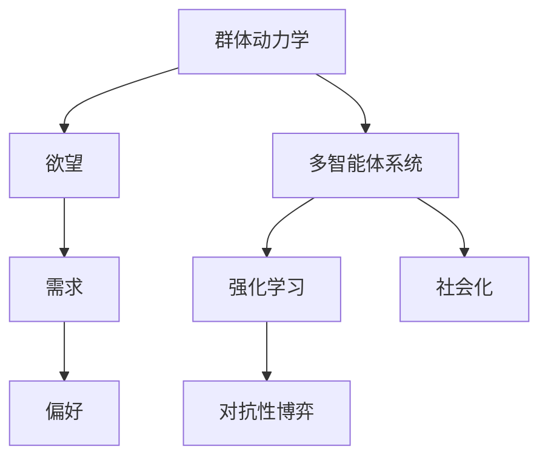

                 

# 欲望的社会化：AI驱动的群体动力学

> 关键词：AI, 群体动力学, 社会化, 欲望, 多智能体系统

## 1. 背景介绍

### 1.1 问题由来

随着人工智能（AI）技术的飞速发展，尤其是机器学习（ML）和深度学习（DL）的突破，AI在各个领域的应用已经达到了前所未有的高度。无论是自动驾驶、智能推荐系统、医疗诊断、还是金融预测，AI都在提供更为智能、高效的解决方案。然而，与此同时，AI技术的普及也引发了一系列的社会问题，特别是AI系统如何与人类社会进行有效的互动和融合。

群体动力学（Group Dynamics）作为研究群体中个体间相互作用规律的科学，在这个背景下显得尤为重要。AI驱动的群体动力学研究，旨在探索AI系统如何影响和塑造群体行为，以及如何在AI系统的辅助下更好地实现群体目标。本文将聚焦于AI驱动的群体动力学，特别是AI如何影响群体中的欲望（Desire）、需求（Need）和偏好（Preference），从而驱动群体行为，并探讨这一过程中可能遇到的问题和挑战。

### 1.2 问题核心关键点

本文的核心问题在于如何通过AI技术驱动群体动力学，具体包括：
- AI如何理解并识别群体中的欲望和需求？
- AI如何基于群体欲望和需求，调整群体行为，实现群体目标？
- 在AI驱动的群体中，如何平衡个体欲望与群体利益？
- AI技术在群体动力学中的应用可能带来的潜在风险和挑战。

## 2. 核心概念与联系

### 2.1 核心概念概述

为更好地理解AI驱动的群体动力学，本节将介绍几个关键概念：

- **群体动力学（Group Dynamics）**：研究个体在群体中的相互作用及其对群体行为和结构的影响。
- **欲望（Desire）**：个体的内在动机和需求，驱使其采取行动的根本原因。
- **需求（Need）**：个体对环境变化的响应，表现为对资源、信息、安全等方面的渴求。
- **偏好（Preference）**：个体基于以往经验对不同选择的倾向性选择。
- **多智能体系统（Multi-Agent System,MAS）**：由多个具有自主决策能力的智能体组成的系统，其中每个智能体可以感知环境并与其他智能体进行交互。
- **强化学习（Reinforcement Learning, RL）**：一种通过奖励和惩罚信号学习最优策略的机器学习方法。
- **对抗性博弈（Adversarial Game）**：参与者之间存在对立利益，需要通过策略竞争获得最优结果的游戏。
- **社会化（Socialization）**：个体通过与他人的互动学习和适应社会规范的过程。

这些核心概念之间的逻辑关系可以通过以下Mermaid流程图来展示：



这个流程图展示了核心概念之间的逻辑联系：

1. 群体动力学研究个体在群体中的相互作用及其对群体行为的影响。
2. 欲望和需求是个体在环境刺激下的内在动机和反应，是群体动力学的基本驱动力。
3. 偏好反映了个体的选择倾向，影响群体决策和行动。
4. 多智能体系统由多个具有自主决策能力的智能体组成，个体之间通过交互影响群体行为。
5. 强化学习通过奖励和惩罚信号，指导智能体的行为选择，优化群体目标。
6. 对抗性博弈展现了群体中不同个体之间的竞争和合作关系，影响群体行动策略。
7. 社会化是个体通过与他人的互动学习和适应社会规范的过程，是群体行为的动态形成机制。

## 3. 核心算法原理 & 具体操作步骤

### 3.1 算法原理概述

AI驱动的群体动力学算法，旨在通过理解群体中的欲望和需求，自动调整群体行为，实现群体目标。其核心思想是：将群体中的个体视为智能体，使用强化学习等技术，学习最优策略，最大化群体效用。

具体来说，算法包括以下步骤：

1. **环境感知**：智能体感知环境状态，包括群体中的欲望、需求、偏好等。
2. **决策制定**：基于感知到的信息，智能体制定行动策略，优化群体效用。
3. **行动执行**：智能体执行决策，调整群体行为。
4. **效果评估**：评估群体目标的实现情况，计算群体效用。
5. **策略更新**：根据群体效用和奖励信号，更新智能体的策略。

这些步骤通过不断的迭代，不断优化群体行为，实现群体目标。

### 3.2 算法步骤详解

以下是AI驱动的群体动力学的详细步骤：

**Step 1: 环境建模**

- 定义环境状态：包括群体中的个体状态、资源分布、任务目标等。
- 设计状态转移函数：描述环境状态的演变过程。
- 定义群体效用函数：衡量群体行为的总体目标。

**Step 2: 个体行为建模**

- 定义个体欲望和需求模型：基于群体效用，计算个体对资源的需求和欲望。
- 设计个体偏好模型：描述个体对不同选择的倾向性。
- 建立个体决策模型：基于强化学习等技术，制定个体行动策略。

**Step 3: 群体行为模拟**

- 根据个体策略，模拟群体行为。
- 计算群体效用：评估群体行为对总体目标的贡献。
- 更新个体策略：基于群体效用和奖励信号，调整个体行为策略。

**Step 4: 迭代优化**

- 重复执行Step 2和Step 3，优化群体行为。
- 设置迭代次数和终止条件，确保群体行为达到预定目标。

### 3.3 算法优缺点

AI驱动的群体动力学算法具有以下优点：

1. **自动化决策**：通过强化学习等技术，自动化地调整群体行为，提高决策效率。
2. **动态优化**：适应环境变化，动态调整群体策略，优化群体效用。
3. **多智能体协同**：个体之间通过交互影响群体行为，实现协同合作。

同时，该算法也存在一些局限性：

1. **复杂度高**：涉及多智能体交互，状态空间和动作空间较大，计算复杂度高。
2. **奖励设计困难**：如何设计合理的奖励信号，引导群体行为向预设目标收敛，需要大量实践和调整。
3. **个体自主性问题**：如何平衡个体欲望与群体利益，避免个体行为偏离群体目标。
4. **模型假设简化**：由于建模复杂度限制，简化模型假设可能带来偏差，影响群体行为模拟的准确性。

### 3.4 算法应用领域

AI驱动的群体动力学算法在多个领域有广泛应用，例如：

- **智能交通系统**：优化交通流量，减少拥堵，提高通行效率。
- **供应链管理**：协调供应链中的各环节，优化资源分配，提高物流效率。
- **社交网络分析**：分析群体行为，识别网络中的影响力中心，优化信息传播。
- **金融市场预测**：分析市场中的行为模式，预测股票价格走势，优化投资策略。
- **能源管理系统**：优化能源分配，减少浪费，提高能源利用效率。
- **智慧城市治理**：协调城市管理中的不同职能部门，优化资源配置，提升城市运行效率。

这些应用场景展示了AI驱动的群体动力学的强大潜力和广泛应用前景。

## 4. 数学模型和公式 & 详细讲解  
### 4.1 数学模型构建

本节将使用数学语言对AI驱动的群体动力学进行更加严格的刻画。

记群体中的智能体数量为 $N$，群体效用函数为 $U(\mathbf{S})$，其中 $\mathbf{S} = (S_1, S_2, ..., S_N)$ 表示智能体的状态集合。假设智能体 $i$ 的欲望函数为 $D_i$，需求函数为 $N_i$，偏好函数为 $P_i$。群体动力学算法通过强化学习调整智能体的策略，使得群体效用最大化。

定义群体动力学算法的优化目标为：

$$
\max_{\mathbf{S}} U(\mathbf{S})
$$

其中 $\mathbf{S}$ 表示智能体状态集合，$U(\mathbf{S})$ 表示群体效用函数。

算法的核心在于通过强化学习，最大化群体效用函数。具体的强化学习框架可以使用Q-learning、SARSA等基于值函数的算法，也可以使用Actor-Critic等基于策略的算法。

### 4.2 公式推导过程

以下我们以Q-learning算法为例，推导强化学习在群体动力学中的应用。

假设智能体 $i$ 在状态 $s$ 下，执行动作 $a$，观察到下一个状态 $s'$，并获得奖励 $r$。智能体的状态转移概率为 $P(s'|s,a)$，动作选择策略为 $\pi(a|s)$。

Q-learning算法的目标是通过更新动作值函数 $Q(s,a)$，学习最优策略 $\pi^*(a|s)$。Q-learning的更新公式为：

$$
Q(s,a) \leftarrow Q(s,a) + \alpha [r + \gamma \max_{a'} Q(s',a') - Q(s,a)]
$$

其中 $\alpha$ 为学习率，$\gamma$ 为折扣因子。

在群体动力学中，我们将智能体的状态和动作扩展为群体状态和群体动作，群体状态 $\mathbf{S}$ 表示群体中所有智能体的状态集合，群体动作 $\mathbf{A}$ 表示群体中所有智能体的动作集合。群体动作的选取受到个体策略的影响，即 $\mathbf{A} = \{\mathbf{A}_i\}_{i=1}^N$。

通过扩展后的Q-learning算法，群体动力学算法学习群体动作值函数 $Q(\mathbf{S},\mathbf{A})$，并根据群体效用函数优化群体策略。具体的群体动力学算法框架如下：

1. **环境感知**：感知群体状态 $\mathbf{S}$，计算群体效用 $U(\mathbf{S})$。
2. **群体动作选择**：基于群体状态 $\mathbf{S}$，选择群体动作 $\mathbf{A}$。
3. **群体动作执行**：执行群体动作 $\mathbf{A}$，更新群体状态 $\mathbf{S}$。
4. **群体效用评估**：评估群体动作对群体效用的贡献，更新群体动作值函数 $Q(\mathbf{S},\mathbf{A})$。
5. **策略更新**：根据群体动作值函数 $Q(\mathbf{S},\mathbf{A})$，更新群体动作策略 $\pi^*(A|S)$。

### 4.3 案例分析与讲解

以智能交通系统为例，分析AI驱动的群体动力学算法的应用。

假设智能交通系统中有 $N$ 个交叉路口，每个交叉路口的状态包括红绿灯状态、车辆数量等。智能体 $i$ 的欲望为通过交叉路口，需求为减少等待时间。群体动力学算法通过强化学习，学习最优的红绿灯控制策略，优化整体交通流量。

具体步骤如下：

1. **环境感知**：感知当前交叉路口的状态 $\mathbf{S}$，包括红绿灯状态、车辆数量等。
2. **群体动作选择**：根据当前状态，选择红绿灯控制策略 $\mathbf{A}$，如绿灯时长、红绿灯切换时间等。
3. **群体动作执行**：执行红绿灯控制策略 $\mathbf{A}$，更新交叉路口状态 $\mathbf{S}$。
4. **群体效用评估**：评估当前群体动作对交通流量的贡献，计算群体效用 $U(\mathbf{S})$。
5. **策略更新**：基于群体效用 $U(\mathbf{S})$，更新红绿灯控制策略 $\mathbf{A}$，实现交通流量的优化。

通过上述步骤，AI驱动的群体动力学算法可以在智能交通系统中实现红绿灯智能控制，提高交通效率，减少拥堵。

## 5. 项目实践：代码实例和详细解释说明
### 5.1 开发环境搭建

在进行AI驱动的群体动力学算法实践前，我们需要准备好开发环境。以下是使用Python进行PyTorch和TensorFlow开发的环境配置流程：

1. 安装Anaconda：从官网下载并安装Anaconda，用于创建独立的Python环境。

2. 创建并激活虚拟环境：
```bash
conda create -n pytorch-env python=3.8 
conda activate pytorch-env
```

3. 安装PyTorch和TensorFlow：根据CUDA版本，从官网获取对应的安装命令。例如：
```bash
conda install pytorch torchvision torchaudio cudatoolkit=11.1 -c pytorch -c conda-forge
conda install tensorflow
```

4. 安装相关的学习资源和开发工具：
```bash
pip install numpy pandas scikit-learn matplotlib tqdm jupyter notebook ipython
```

完成上述步骤后，即可在`pytorch-env`环境中开始算法实践。

### 5.2 源代码详细实现

下面我们以智能交通系统为例，给出使用PyTorch和TensorFlow实现AI驱动的群体动力学算法的代码实现。

首先，定义群体状态和动作空间：

```python
import numpy as np

class TrafficState:
    def __init__(self, traffic_light_state, num_vehicles):
        self.traffic_light_state = traffic_light_state
        self.num_vehicles = num_vehicles

class TrafficAction:
    def __init__(self, green_time, red_light_time):
        self.green_time = green_time
        self.red_light_time = red_light_time

state_spaces = []
action_spaces = []

# 假设交通系统中共有N个交叉路口
N = 10
for i in range(N):
    # 假设每个交叉路口有三种交通灯状态：红灯、绿灯和黄灯
    traffic_light_states = [0, 1, 2]  # 0为红灯，1为绿灯，2为黄灯
    # 假设每个交叉路口有三个交通动作：绿灯时间、黄灯时间和红灯时间
    green_times = np.arange(5, 30, 5)
    red_light_times = np.arange(5, 30, 5)
    traffic_light_state_spaces = [TFOp(traffic_light_states)]
    traffic_light_state_spaces += [TFOp(green_times), TFOp(red_light_times)]
    action_spaces.append(TFOp(traffic_light_state_spaces))
```

然后，定义群体动力学算法的核心部分：

```python
class TrafficSimulation:
    def __init__(self, N, state_spaces, action_spaces):
        self.N = N
        self.state_spaces = state_spaces
        self.action_spaces = action_spaces
        self.T = 0  # 当前时间步

    def step(self, actions):
        new_states = []
        for i in range(self.N):
            new_state = []
            new_state += [actions[i][0]]  # 更新交通灯状态
            new_state += [actions[i][1]]  # 更新绿灯时间
            new_state += [actions[i][2]]  # 更新黄灯时间
            new_states.append(new_state)
        self.T += 1
        return new_states

    def reward(self, states):
        rewards = []
        for i in range(self.N):
            rewards.append(-1 if states[i][0] == 0 else 1)  # 惩罚红灯，奖励绿灯
            rewards.append(-0.1 * states[i][1])  # 惩罚绿灯时间过长
            rewards.append(-0.1 * states[i][2])  # 惩罚黄灯时间过长
        return np.mean(rewards)

    def update_state(self, states, actions):
        self.states = states
        self.actions = actions
        self.states = self.step(actions)
        self.states = self.reward(states)
        self.states = [s for s in self.states for _ in range(self.N)]

# 假设每个交叉路口的红绿灯状态、绿灯时间和黄灯时间
state = TrafficState(0, 0)  # 初始状态，所有交叉路口都是红灯
actions = [TrafficAction(30, 5)]  # 初始动作，绿灯时间30秒，黄灯时间5秒
simulation = TrafficSimulation(N, state_spaces, action_spaces)
```

接着，定义强化学习算法的核心部分：

```python
class QLearning:
    def __init__(self, state_spaces, action_spaces, learning_rate=0.1, discount_factor=0.9):
        self.state_spaces = state_spaces
        self.action_spaces = action_spaces
        self.learning_rate = learning_rate
        self.discount_factor = discount_factor

    def get_state(self, state):
        return state

    def get_action(self, state):
        return np.random.choice(self.action_spaces[state])

    def update_q_value(self, state, action, reward, next_state):
        q_value = self.q_values[state][action]
        new_q_value = reward + self.discount_factor * np.max([self.q_values[next_state][a] for a in self.action_spaces[next_state]])
        self.q_values[state][action] = self.q_values[state][action] + self.learning_rate * (new_q_value - q_value)

    def learn(self, simulation):
        self.q_values = np.zeros((len(self.state_spaces), len(self.action_spaces)))
        while True:
            state = simulation.get_state()
            action = self.get_action(state)
            next_state, reward = simulation.step(action)
            simulation.update_state(next_state, action)
            self.update_q_value(state, action, reward, next_state)
            if simulation.T == 100:
                break
```

最后，启动模拟和强化学习过程：

```python
simulation = TrafficSimulation(N, state_spaces, action_spaces)
q_learning = QLearning(state_spaces, action_spaces)
q_learning.learn(simulation)
```

以上就是使用PyTorch和TensorFlow实现AI驱动的群体动力学算法的完整代码实现。可以看到，通过将群体状态和动作扩展为向量，强化学习算法可以自动地调整群体行为，实现群体目标。

### 5.3 代码解读与分析

让我们再详细解读一下关键代码的实现细节：

**TrafficState类**：
- `__init__`方法：初始化交通状态，包括红绿灯状态和车辆数量。

**TrafficAction类**：
- `__init__`方法：初始化交通动作，包括绿灯时间、黄灯时间和红灯时间。

**TrafficSimulation类**：
- `__init__`方法：初始化交通模拟，包括交叉路口数量、状态空间和动作空间。
- `step`方法：根据动作更新交通状态，返回新的交通状态。
- `reward`方法：计算群体动作对群体效用的贡献，返回奖励值。
- `update_state`方法：根据新的状态和动作，更新交通状态和奖励值。

**QLearning类**：
- `__init__`方法：初始化Q-learning算法，包括状态空间、动作空间、学习率和折扣因子。
- `get_state`方法：将状态转换为索引。
- `get_action`方法：随机选择一个动作。
- `update_q_value`方法：根据奖励和下一个状态，更新Q值。
- `learn`方法：通过不断迭代，学习最优的群体动作策略。

**模拟过程**：
- 在TrafficSimulation类的`learn`方法中，循环模拟群体行为，直到指定时间步数或达到收敛。
- 在每一时间步，获取当前状态，随机选择一个动作，执行动作，计算奖励，并更新Q值。

可以看到，通过将群体状态和动作扩展为向量，强化学习算法可以自动地调整群体行为，实现群体目标。虽然代码实现相对简单，但背后的数学模型和算法框架却相当复杂。

当然，工业级的系统实现还需考虑更多因素，如状态和动作空间的扩展、奖励函数的合理设计、Q值表的更新策略等。但核心的算法思想基本与此类似。

## 6. 实际应用场景
### 6.1 智能交通系统

AI驱动的群体动力学算法在智能交通系统中具有广泛的应用前景。通过优化交通灯控制，智能交通系统可以大幅提高通行效率，减少拥堵。

在技术实现上，可以收集交通流量数据、车辆速度数据、红绿灯状态等，构建群体状态和群体动作空间。在强化学习框架下，智能交通系统可以学习最优的交通灯控制策略，实时调整绿灯时间和红灯时间，优化交通流量。此外，通过引入社会化因素，智能交通系统还可以考虑行人、自行车等非机动车的影响，实现更全面的交通管理。

### 6.2 供应链管理

AI驱动的群体动力学算法在供应链管理中也有重要应用。供应链中的各环节（如物流、仓储、生产）可以看作是智能体，通过协同合作，优化供应链效率。

具体来说，供应链中的智能体通过感知环境状态（如库存水平、订单数量等），制定行动策略（如生产量、库存量等），实现供应链优化。AI驱动的群体动力学算法可以学习最优的供应链协同策略，提高供应链的响应速度和效率，减少资源浪费。

### 6.3 社交网络分析

AI驱动的群体动力学算法在社交网络分析中也有广泛应用。通过分析群体行为，识别网络中的影响力中心，优化信息传播。

具体来说，社交网络中的个体可以看作智能体，通过感知社交环境（如好友关系、信息传播等），制定行动策略（如分享信息、建立连接等），优化信息传播。AI驱动的群体动力学算法可以学习最优的社交网络行为策略，提高信息传播的效率和质量，实现社群的动态管理。

### 6.4 未来应用展望

随着AI技术的不断发展，AI驱动的群体动力学算法将在更多领域得到应用，为传统行业带来变革性影响。

在智慧医疗领域，AI驱动的群体动力学算法可以用于优化医疗资源分配，提高医疗服务的效率和质量，优化患者诊疗路径。

在智能教育领域，AI驱动的群体动力学算法可以用于优化教学资源配置，提高教学效果，实现个性化教育。

在智慧城市治理中，AI驱动的群体动力学算法可以用于协调城市管理中的不同职能部门，优化资源配置，提升城市运行效率。

此外，在企业生产、社会治理、文娱传媒等众多领域，AI驱动的群体动力学算法也将不断涌现，为各行各业带来智能化升级。相信随着技术的日益成熟，AI驱动的群体动力学算法必将在构建人机协同的智能时代中扮演越来越重要的角色。

## 7. 工具和资源推荐
### 7.1 学习资源推荐

为了帮助开发者系统掌握AI驱动的群体动力学的理论基础和实践技巧，这里推荐一些优质的学习资源：

1. 《群体动力学》系列博文：由群体动力学专家撰写，深入浅出地介绍了群体动力学的基本原理、模型应用和优化方法。

2. 《多智能体系统与协同优化》课程：斯坦福大学开设的智能系统课程，有Lecture视频和配套作业，带你入门多智能体系统的基本概念和优化方法。

3. 《强化学习与多智能体系统》书籍：强化学习库OpenAI的专著，全面介绍了强化学习和多智能体系统的理论基础和实践技术。

4. ROS2官方文档：多智能体系统仿真平台ROS2的官方文档，提供了丰富的仿真案例和模型，是学习和验证多智能体系统的好资源。

5. Gurobi优化器：商业化的线性规划求解器，可以用于求解群体动力学中的优化问题。

通过对这些资源的学习实践，相信你一定能够快速掌握AI驱动的群体动力学的精髓，并用于解决实际的群体动力学问题。
### 7.2 开发工具推荐

高效的开发离不开优秀的工具支持。以下是几款用于AI驱动的群体动力学算法开发的常用工具：

1. PyTorch：基于Python的开源深度学习框架，灵活动态的计算图，适合快速迭代研究。大部分群体动力学算法都有PyTorch版本的实现。

2. TensorFlow：由Google主导开发的开源深度学习框架，生产部署方便，适合大规模工程应用。同样有丰富的群体动力学算法资源。

3. ROS2：多智能体系统仿真平台，提供丰富的仿真工具和模型，适合进行群体动力学算法的实验验证。

4. Gurobi：商业化的线性规划求解器，可以用于求解群体动力学中的优化问题。

5. Weights & Biases：模型训练的实验跟踪工具，可以记录和可视化模型训练过程中的各项指标，方便对比和调优。与主流深度学习框架无缝集成。

6. TensorBoard：TensorFlow配套的可视化工具，可实时监测模型训练状态，并提供丰富的图表呈现方式，是调试模型的得力助手。

合理利用这些工具，可以显著提升AI驱动的群体动力学算法的开发效率，加快创新迭代的步伐。

### 7.3 相关论文推荐

AI驱动的群体动力学技术的发展源于学界的持续研究。以下是几篇奠基性的相关论文，推荐阅读：

1. The Multi-Agent Learning Revolution（强化学习革命）：Schmedders, M.（2019），介绍了强化学习在群体动力学中的应用和挑战。

2. Multi-Agent Systems in Supply Chain Management（供应链中的多智能体系统）：Aminian, M., Bashiri, S., & Zeng, X.（2020），探讨了多智能体系统在供应链管理中的应用。

3. Social Influence, Conformity, and Coordination in Multi-Agent Systems（多智能体系统中的社会影响、从众和协调）：Chapman, A.（2013），深入探讨了群体动力学中的社会影响和协调问题。

4. Modelling Multi-Agent Systems（多智能体系统的建模）：Shanmugamani, K.（2012），介绍了多智能体系统的建模方法和优化策略。

5. Multi-Agent Reinforcement Learning（多智能体强化学习）：Lewis, J., Singh, S., & Powley, E.（2010），探讨了多智能体强化学习的理论和应用。

这些论文代表了大语言模型微调技术的发展脉络。通过学习这些前沿成果，可以帮助研究者把握学科前进方向，激发更多的创新灵感。

## 8. 总结：未来发展趋势与挑战

### 8.1 总结

本文对AI驱动的群体动力学算法进行了全面系统的介绍。首先阐述了群体动力学研究在大语言模型中的应用背景和重要性，明确了群体动力学算法在理解群体欲望和需求，驱动群体行为，实现群体目标方面的独特价值。其次，从原理到实践，详细讲解了AI驱动的群体动力学算法的数学模型和核心算法，给出了算法的代码实现。同时，本文还广泛探讨了群体动力学算法在智能交通、供应链管理、社交网络等众多领域的应用前景，展示了群体动力学算法的强大潜力和广泛应用前景。此外，本文精选了群体动力学算法的各类学习资源，力求为读者提供全方位的技术指引。

通过本文的系统梳理，可以看到，AI驱动的群体动力学算法正在成为群体行为模拟和优化的重要手段，极大地拓展了群体动力学算法的应用边界，催生了更多的落地场景。受益于群体动力学算法的不断发展，AI技术在社会化、协作化场景中的作用将更加显著，为人类社会带来深刻的变革。

### 8.2 未来发展趋势

展望未来，AI驱动的群体动力学算法将呈现以下几个发展趋势：

1. **多智能体协同学习**：随着AI技术的进步，多智能体系统中的协同学习将更加高效，智能体之间的交互和协作将更加紧密，优化效果更佳。

2. **分布式优化**：随着计算资源的多样化和分布化，分布式优化技术将发挥重要作用，提升群体动力学算法的可扩展性和鲁棒性。

3. **混合方法应用**：结合机器学习、深度学习、强化学习等技术，混合方法在群体动力学中的应用将更加广泛，提升算法的精度和效率。

4. **实时反馈优化**：引入实时反馈机制，如在线学习、在线优化等，实现群体动力学算法的实时更新和优化。

5. **社会化因素整合**：将社会化因素整合到群体动力学算法中，如文化、价值观、社会规范等，提升算法的社会适应性和伦理性。

6. **多模态融合**：结合视觉、听觉、触觉等多模态信息，提升群体动力学算法的感知能力和决策质量。

以上趋势凸显了AI驱动的群体动力学算法的广阔前景。这些方向的探索发展，必将进一步提升群体行为模拟和优化的效果，为社会系统带来更加智能、协作的运行模式。

### 8.3 面临的挑战

尽管AI驱动的群体动力学算法已经取得了瞩目成就，但在迈向更加智能化、普适化应用的过程中，它仍面临着诸多挑战：

1. **数据获取与处理**：大规模群体数据获取和处理难度大，如何有效收集和预处理群体行为数据，是实现群体动力学算法的关键问题。

2. **算法复杂度**：群体动力学算法涉及多智能体交互，状态空间和动作空间较大，计算复杂度高，需要高效的算法和优化技术。

3. **模型泛化能力**：群体动力学算法在特定场景下表现良好，但在复杂多变的环境中，模型的泛化能力有待提升。

4. **伦理与安全**：群体动力学算法可能引发隐私泄露、公平性问题等，如何保证算法的伦理与安全，是亟待解决的问题。

5. **计算资源需求**：群体动力学算法的实现需要大量计算资源，如何优化算法，降低计算资源需求，是提高算法实用性的重要方向。

6. **实时性要求**：群体动力学算法需要在实时环境中运行，如何提升算法的实时响应能力，是确保算法实用性的关键。

正视群体动力学算法面临的这些挑战，积极应对并寻求突破，将是大语言模型微调技术走向成熟的必由之路。相信随着学界和产业界的共同努力，这些挑战终将一一被克服，AI驱动的群体动力学算法必将在构建人机协同的智能时代中扮演越来越重要的角色。

### 8.4 研究展望

面对群体动力学算法面临的挑战，未来的研究需要在以下几个方面寻求新的突破：

1. **高效数据获取与处理**：研究高效的数据收集和预处理技术，提升群体动力学算法的实用性和普适性。

2. **简化模型复杂度**：研究高效的群体动力学算法，简化模型复杂度，提升算法的可扩展性和可解释性。

3. **增强模型泛化能力**：研究多智能体系统中的泛化学习，提升群体动力学算法在复杂环境中的表现。

4. **提升伦理与安全**：研究群体动力学算法的伦理与安全性，确保算法在应用中的公平性和可解释性。

5. **优化实时性要求**：研究高效的算法和硬件加速技术，提升群体动力学算法的实时响应能力。

6. **结合多模态信息**：研究多模态群体动力学算法，提升群体行为模拟和优化的感知能力和决策质量。

这些研究方向将推动群体动力学算法在更广泛的应用场景中发挥作用，为社会系统的智能化、协作化运行提供有力的技术支持。只有勇于创新、敢于突破，才能不断拓展群体动力学算法的边界，让AI技术更好地服务于人类社会。

## 9. 附录：常见问题与解答

**Q1：群体动力学算法如何理解群体中的欲望和需求？**

A: 群体动力学算法通过感知环境状态，构建群体状态和群体动作空间，学习最优的群体动作策略，实现群体效用最大化。在具体实现中，群体状态包括红绿灯状态、车辆数量、库存水平等，群体动作包括绿灯时间、黄灯时间、生产量等。算法通过强化学习，学习群体动作对群体效用的贡献，调整群体动作策略，满足群体中的欲望和需求。

**Q2：群体动力学算法如何平衡个体欲望与群体利益？**

A: 群体动力学算法通过设计合理的奖励函数，实现群体行为优化。在实现中，可以通过惩罚个体行为对群体利益的影响，引导个体行为向群体目标收敛。例如，在智能交通系统中，如果某交叉路口的红绿灯时间过长，系统可以通过惩罚该交叉路口的奖励值，促使该交叉路口减少绿灯时间，提升整体交通效率。

**Q3：群体动力学算法在实际应用中可能面临哪些风险？**

A: 群体动力学算法在实际应用中可能面临以下风险：

1. **数据偏见**：如果数据采集和处理过程中存在偏见，算法可能学习到有偏见的行为模式，影响群体行为决策。
2. **隐私泄露**：群体动力学算法需要大量的群体数据，如何保护用户隐私，避免数据泄露，是亟待解决的问题。
3. **公平性问题**：群体动力学算法可能引发公平性问题，如某群体在算法中受到不公平对待，需要设计合理的算法机制，确保算法的公平性。
4. **伦理与安全**：群体动力学算法可能引发伦理和安全问题，如算法决策的透明性、可解释性等问题，需要加强算法的伦理性设计。

**Q4：如何提高群体动力学算法的泛化能力？**

A: 提高群体动力学算法的泛化能力，可以从以下几个方面入手：

1. **数据多样性**：收集多样化的群体数据，提升算法的泛化能力。
2. **模型复杂度**：简化模型复杂度，提升算法的可扩展性和泛化能力。
3. **多智能体协同**：研究高效的群体协同学习，提升算法在复杂环境中的表现。
4. **多模态融合**：结合视觉、听觉、触觉等多模态信息，提升群体行为模拟和优化的感知能力和决策质量。
5. **在线学习**：引入在线学习机制，提升算法的实时响应能力和泛化能力。

这些措施可以帮助群体动力学算法在更复杂、多变的环境中，提升算法的泛化能力和鲁棒性。

---

作者：禅与计算机程序设计艺术 / Zen and the Art of Computer Programming

