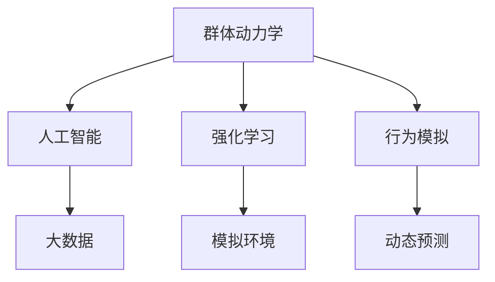

                 

# 欲望的社会网络：AI驱动的群体动力学

> 关键词：群体动力学,人工智能,社会网络,强化学习,行为模拟,大数据

## 1. 背景介绍

### 1.1 问题由来

随着人工智能技术的飞速发展，AI在社会各个领域的应用越来越广泛，尤其是在人类行为和群体行为研究方面。如何通过AI驱动群体动力学研究，揭示人类欲望和社会互动的内在机制，成为当前学术界和工业界的热点话题。

群体动力学（Group Dynamics）研究的是群体成员之间的相互影响和互动，以及这种互动如何影响个体的行为和群体的演化。在社会学、心理学、经济学等领域，群体动力学理论被广泛应用于解释和预测群体行为，如团队协作、市场动态、消费者行为等。

近年来，随着人工智能和机器学习技术的发展，越来越多的研究者开始尝试使用AI技术来驱动群体动力学研究，特别是强化学习（Reinforcement Learning, RL）和行为模拟（Behavior Simulation）等方法，帮助更精确地模拟和预测群体行为。AI技术能够处理和分析大规模数据，揭示人类欲望和群体互动的深层次规律。

### 1.2 问题核心关键点

AI驱动的群体动力学研究主要集中在以下几个关键点：

1. **数据获取与处理**：群体动力学研究需要大量的数据来支撑模型训练和验证。AI技术能够高效地处理和分析大规模数据集，如社会媒体数据、交易记录、移动轨迹等，为群体动力学研究提供数据支持。

2. **模型训练与优化**：使用强化学习、行为模拟等AI技术，可以构建复杂的群体行为模型，并通过大量训练数据优化模型参数，提高模型的准确性和泛化能力。

3. **行为预测与干预**：基于训练好的模型，可以对个体行为和群体行为进行预测，并通过干预措施（如政策制定、市场调控等）影响群体行为，实现更有效的社会管理。

4. **伦理与社会影响**：AI驱动的群体动力学研究需要关注伦理和社会影响，确保技术应用不会带来负面影响，如隐私泄露、数据滥用等。

5. **多模态数据融合**：群体动力学研究通常涉及多种数据类型，如文本、图像、视频等。AI技术能够对这些数据进行有效融合，提高模型对复杂群体行为的解释和预测能力。

### 1.3 问题研究意义

AI驱动的群体动力学研究对于理解人类欲望和社会互动具有重要意义：

1. **揭示社会行为规律**：通过AI技术分析群体行为数据，可以揭示社会行为背后的深层次规律，如消费者购买行为、市场波动、群体冲突等。

2. **优化社会管理**：基于AI模型对群体行为进行预测，可以为政府、企业和组织提供决策依据，优化社会管理和公共服务。

3. **促进经济增长**：研究消费者行为和市场动态，有助于企业制定更有效的市场策略，促进经济增长和就业。

4. **提升研究效率**：AI技术可以高效处理和分析大规模数据，加速群体动力学研究的进程，减少研究成本。

5. **推动技术创新**：群体动力学研究涉及多个学科领域，AI技术的引入可以推动跨学科研究，促进技术创新。

## 2. 核心概念与联系

### 2.1 核心概念概述

为了更好地理解AI驱动的群体动力学研究，本节将介绍几个关键核心概念：

- **群体动力学（Group Dynamics）**：研究群体成员之间的相互影响和互动，以及这种互动如何影响个体的行为和群体的演化。

- **人工智能（Artificial Intelligence, AI）**：一种模拟人类智能行为的计算机系统，包括学习、推理、规划、自然语言处理等能力。

- **强化学习（Reinforcement Learning, RL）**：一种机器学习方法，通过智能体与环境的交互，通过奖励信号（rewards）来指导学习过程，最终使智能体学会最优策略。

- **行为模拟（Behavior Simulation）**：使用AI技术构建虚拟社会环境，模拟个体和群体行为，用于理解和预测现实世界的行为动态。

- **大数据（Big Data）**：指规模庞大的、种类繁多的、快速变化的数据集，通过AI技术可以高效处理和分析。

这些核心概念之间的逻辑关系可以通过以下Mermaid流程图来展示：



这个流程图展示了几者之间的联系：

1. **群体动力学**通过**人工智能**技术，特别是**强化学习**和**行为模拟**，进行复杂群体行为的**模拟与预测**。
2. **大数据**为这些AI技术提供了**数据支持**，帮助构建更加准确的模型。
3. **模拟环境**和**动态预测**结合起来，可以**优化社会管理**和**经济调控**。

## 3. 核心算法原理 & 具体操作步骤
### 3.1 算法原理概述

AI驱动的群体动力学研究主要基于**强化学习**和**行为模拟**等技术，通过构建虚拟社会环境，模拟个体和群体行为，从而揭示社会行为背后的规律。

### 3.2 算法步骤详解

AI驱动的群体动力学研究主要包括以下几个关键步骤：

**Step 1: 数据收集与预处理**
- 使用AI技术从社交媒体、市场交易、移动轨迹等大数据源中获取群体行为数据。
- 对数据进行清洗、去重、分词、特征提取等预处理操作，确保数据质量和一致性。

**Step 2: 模型构建与训练**
- 根据研究问题选择合适的强化学习模型（如Q-Learning、Policy Gradient等），构建群体行为模拟模型。
- 使用训练数据集对模型进行训练，优化模型参数，提高模型的准确性和泛化能力。

**Step 3: 行为预测与分析**
- 对虚拟社会环境中的个体行为和群体行为进行预测，分析群体行为动态。
- 使用可视化工具（如Tableau、Power BI等）展示预测结果，帮助理解和解释群体行为。

**Step 4: 模型评估与优化**
- 使用测试数据集对模型进行评估，计算预测精度和误差。
- 根据评估结果，调整模型参数和优化算法，提升模型的性能。

**Step 5: 社会管理与应用**
- 将训练好的模型应用到实际的社会管理中，如市场调控、政策制定、消费者行为分析等。
- 根据模型预测结果，制定合理的决策和干预措施，优化社会管理效果。

### 3.3 算法优缺点

AI驱动的群体动力学研究具有以下优点：

1. **高效性**：AI技术可以高效处理和分析大规模数据，加速群体动力学研究的进程，减少研究成本。
2. **精准性**：基于强化学习和行为模拟的模型可以更精准地预测群体行为，揭示社会行为规律。
3. **灵活性**：AI模型可以动态调整参数，适应不同场景下的群体行为变化。
4. **广泛性**：AI技术可以应用于多个领域，如金融、医疗、教育等，推动跨学科研究。

同时，该方法也存在一些局限性：

1. **数据依赖**：AI模型高度依赖于数据质量和数据量，数据不足可能影响模型性能。
2. **复杂性**：AI模型需要复杂的算法和大量的计算资源，对技术要求较高。
3. **伦理问题**：AI模型的应用可能涉及隐私、数据安全等问题，需要严格遵守伦理规范。
4. **解释性不足**：AI模型的预测结果往往缺乏解释性，难以理解和解释行为背后的原因。
5. **社会影响**：AI模型应用不当可能导致社会不公平、歧视等问题。

### 3.4 算法应用领域

AI驱动的群体动力学研究在多个领域有广泛应用，例如：

- **金融市场分析**：使用AI技术分析市场交易数据，预测市场波动，制定投资策略。
- **消费者行为分析**：研究消费者购买行为，帮助企业制定更有效的市场策略，提升销售额。
- **社会舆情监控**：使用AI技术分析社交媒体数据，预测社会舆情变化，制定舆情管理策略。
- **公共卫生预测**：研究疾病传播规律，预测疫情发展趋势，制定防控措施。
- **城市交通管理**：分析交通流量数据，预测交通拥堵情况，优化交通管理策略。

## 4. 数学模型和公式 & 详细讲解 & 举例说明

### 4.1 数学模型构建

本节将使用数学语言对AI驱动的群体动力学研究进行更加严格的刻画。

记群体成员数量为 $N$，每个成员的行为参数为 $x_i$，群体行为参数为 $X$。定义行为模型为 $P(x_i | X, \theta)$，其中 $\theta$ 为模型参数。

群体成员之间的互动可以用一个社交网络 $G$ 来描述，社交网络中的每个节点表示一个成员，边表示成员之间的互动关系。定义社交网络中节点 $i$ 和节点 $j$ 之间边的权重为 $w_{ij}$。

假设群体成员的行为参数满足马尔可夫链，每个成员的行为参数可以通过以下递推公式计算：

$$
x_{i}^{t+1} = f(x_{i}^{t}, x_{j}^{t}, w_{ij}, \theta)
$$

其中 $f$ 为行为模型，$x_{i}^{t}$ 表示成员 $i$ 在第 $t$ 时刻的行为参数。

### 4.2 公式推导过程

以下我们以消费者购买行为分析为例，推导强化学习模型的公式。

假设消费者在两个品牌之间进行选择，设品牌 $A$ 和 $B$ 对应的行为参数分别为 $x_A$ 和 $x_B$，假设消费者的行为参数 $x_i$ 由两个品牌的行为参数 $x_A$ 和 $x_B$ 决定，满足如下公式：

$$
x_{i}^{t+1} = \alpha x_{A}^{t} + (1-\alpha) x_{B}^{t}
$$

其中 $\alpha$ 为权重系数，表示消费者对品牌 $A$ 的偏好。

消费者在不同品牌之间的选择可以看作一个强化学习问题，使用Q-Learning算法，定义每个时刻的Q值 $Q(x_i, a)$，表示选择行为 $a$ 并达到状态 $x_i$ 的长期奖励。Q值更新公式为：

$$
Q(x_i, a) = Q(x_i, a) + \eta \left(r + \gamma \max_{a'} Q(x_i', a') - Q(x_i, a) \right)
$$

其中 $r$ 为即时奖励，$\gamma$ 为折扣因子，$\eta$ 为学习率。

在模型训练过程中，通过不断更新Q值，优化模型参数，使得消费者选择行为与长期奖励最大化。

### 4.3 案例分析与讲解

以消费者购买行为分析为例，假设消费者在两个品牌之间进行选择，设品牌 $A$ 和 $B$ 对应的行为参数分别为 $x_A$ 和 $x_B$，假设消费者的行为参数 $x_i$ 由两个品牌的行为参数 $x_A$ 和 $x_B$ 决定，满足如下公式：

$$
x_{i}^{t+1} = \alpha x_{A}^{t} + (1-\alpha) x_{B}^{t}
$$

其中 $\alpha$ 为权重系数，表示消费者对品牌 $A$ 的偏好。

使用Q-Learning算法，定义每个时刻的Q值 $Q(x_i, a)$，表示选择行为 $a$ 并达到状态 $x_i$ 的长期奖励。Q值更新公式为：

$$
Q(x_i, a) = Q(x_i, a) + \eta \left(r + \gamma \max_{a'} Q(x_i', a') - Q(x_i, a) \right)
$$

其中 $r$ 为即时奖励，$\gamma$ 为折扣因子，$\eta$ 为学习率。

在模型训练过程中，通过不断更新Q值，优化模型参数，使得消费者选择行为与长期奖励最大化。

在实际应用中，可以通过收集消费者的购买数据、品牌评价、社交媒体反馈等数据，构建消费者行为模型，并通过强化学习算法进行训练和优化。模型训练完成后，可以用于预测消费者行为，制定更有效的市场策略。

## 5. 项目实践：代码实例和详细解释说明

### 5.1 开发环境搭建

在进行AI驱动的群体动力学研究时，我们需要准备好开发环境。以下是使用Python进行Reinforcement Learning开发的常见环境配置流程：

1. 安装Anaconda：从官网下载并安装Anaconda，用于创建独立的Python环境。

2. 创建并激活虚拟环境：
```bash
conda create -n reinforcement-env python=3.8 
conda activate reinforcement-env
```

3. 安装相关库：
```bash
pip install numpy scipy gym gymnasium
```

4. 安装TensorFlow：
```bash
pip install tensorflow
```

5. 安装PyTorch：
```bash
pip install torch torchvision torchaudio
```

完成上述步骤后，即可在`reinforcement-env`环境中开始AI驱动的群体动力学研究。

### 5.2 源代码详细实现

下面以消费者购买行为分析为例，给出使用Reinforcement Learning对强化学习模型进行开发的PyTorch代码实现。

```python
import torch
import torch.nn as nn
import torch.optim as optim
import gymnasium as gym

class QNetwork(nn.Module):
    def __init__(self, state_dim, action_dim, hidden_dim=64):
        super(QNetwork, self).__init__()
        self.fc1 = nn.Linear(state_dim, hidden_dim)
        self.fc2 = nn.Linear(hidden_dim, hidden_dim)
        self.fc3 = nn.Linear(hidden_dim, action_dim)

    def forward(self, x):
        x = torch.relu(self.fc1(x))
        x = torch.relu(self.fc2(x))
        x = self.fc3(x)
        return x

def build_model(state_dim, action_dim, hidden_dim=64):
    model = QNetwork(state_dim, action_dim, hidden_dim)
    optimizer = optim.Adam(model.parameters(), lr=0.001)
    return model, optimizer

def train(model, optimizer, env, episodes=1000, batch_size=32):
    state_dim = env.observation_space.shape[0]
    action_dim = env.action_space.n

    model, optimizer = build_model(state_dim, action_dim)

    for episode in range(episodes):
        state = env.reset()
        done = False
        total_reward = 0
        while not done:
            state = torch.tensor(state, dtype=torch.float32).unsqueeze(0)
            action_scores = model(state)
            action = torch.argmax(action_scores, dim=1).item()
            next_state, reward, done, _ = env.step(action)
            total_reward += reward
            state = next_state
            optimizer.zero_grad()
            q_value = model(torch.tensor(next_state, dtype=torch.float32)).detach()
            target_q_value = reward + 0.99 * torch.max(q_value, dim=1)[0]
            loss = nn.MSELoss()(model(torch.tensor(state, dtype=torch.float32)), target_q_value)
            loss.backward()
            optimizer.step()
        print(f"Episode {episode+1}, Total Reward: {total_reward}")
```

### 5.3 代码解读与分析

让我们再详细解读一下关键代码的实现细节：

**QNetwork类**：
- `__init__`方法：定义神经网络的结构，包括三个全连接层。
- `forward`方法：定义神经网络的前向传播过程，通过全连接层计算输出值。

**build_model函数**：
- 构建Q网络模型和优化器。

**train函数**：
- 初始化模型和优化器。
- 在每个 episode 内，通过env的reset函数重置状态，并在每个 step 内，根据当前状态计算q值，选取最优动作，更新模型参数。
- 在每个 episode 结束后，输出总奖励，更新模型参数。

**强化学习模型**：
- 使用PyTorch实现Q网络，通过神经网络计算q值。
- 使用Adam优化器优化模型参数。
- 通过不断更新q值，优化模型，使得消费者选择行为与长期奖励最大化。

## 6. 实际应用场景

### 6.1 智能推荐系统

AI驱动的群体动力学研究可以应用于智能推荐系统，帮助电商和内容平台更好地理解用户行为，提供个性化推荐服务。

在推荐系统中，通过收集用户的浏览、点击、评分等数据，构建用户行为模型，使用强化学习算法进行训练和优化。训练好的模型可以用于预测用户对不同商品的兴趣，提供个性化的推荐结果，提升用户满意度。

### 6.2 供应链管理

AI驱动的群体动力学研究可以应用于供应链管理，优化供应链各个环节的协调和运作。

在供应链管理中，各个节点（如供应商、制造商、零售商等）之间的互动和协作非常关键。通过构建供应链的互动模型，使用强化学习算法进行优化，可以提升供应链的效率和稳定性。例如，可以通过模拟供应链各节点的互动，预测供应链的瓶颈和风险点，制定合理的优化策略，提高供应链的整体效率。

### 6.3 社会舆情分析

AI驱动的群体动力学研究可以应用于社会舆情分析，预测社会舆情变化，制定舆情管理策略。

在社会舆情分析中，通过收集社交媒体、新闻、论坛等数据，构建社会舆情模型，使用强化学习算法进行训练和优化。训练好的模型可以用于预测社会舆情变化趋势，帮助政府和企业制定舆情管理策略，及时应对舆情危机。

### 6.4 未来应用展望

随着AI技术和群体动力学研究的不断深入，未来在更多领域将得到广泛应用，为社会管理带来新的变革：

1. **智能城市治理**：通过构建智能城市的互动模型，使用强化学习算法进行优化，提升城市管理的自动化和智能化水平。

2. **金融风险控制**：研究金融市场动态，使用AI模型预测市场风险，制定合理的风险控制策略。

3. **医疗健康管理**：通过构建医疗健康系统的互动模型，使用强化学习算法进行优化，提升医疗健康系统的效率和质量。

4. **教育培训评估**：使用AI模型分析学生的学习行为和效果，提供个性化的教育培训方案。

5. **环境资源管理**：通过构建环境资源系统的互动模型，使用强化学习算法进行优化，提升环境资源管理的效率和可持续性。

6. **军事指挥决策**：使用AI模型模拟军事指挥决策过程，制定最优的指挥策略。

## 7. 工具和资源推荐

### 7.1 学习资源推荐

为了帮助开发者系统掌握AI驱动的群体动力学研究理论基础和实践技巧，这里推荐一些优质的学习资源：

1. 《Reinforcement Learning: An Introduction》：Russel和Norvig合著的经典书籍，详细介绍了强化学习的基本概念和算法。

2. OpenAI Gym：一个开源的强化学习框架，包含多种环境和算法，方便快速上手实验。

3 TensorFlow Agents：Google开发的强化学习库，支持多种强化学习算法，适用于大规模应用。

4 Udacity RL Nanodegree：Udacity提供的强化学习课程，涵盖强化学习的核心概念和算法，适合入门学习。

5 DeepMind AI Blog：DeepMind的官方博客，涵盖最新强化学习研究和应用，帮助了解前沿进展。

### 7.2 开发工具推荐

高效的开发离不开优秀的工具支持。以下是几款用于AI驱动的群体动力学研究的常用工具：

1. PyTorch：基于Python的开源深度学习框架，支持动态计算图，适合研究和实验。

2. TensorFlow：由Google主导开发的开源深度学习框架，支持静态计算图，适合大规模生产部署。

3. OpenAI Gym：一个开源的强化学习框架，包含多种环境和算法，方便快速上手实验。

4. TensorFlow Agents：Google开发的强化学习库，支持多种强化学习算法，适用于大规模应用。

5. Visual Studio Code：微软开发的代码编辑器，支持多种语言和框架，适合开发和调试。

### 7.3 相关论文推荐

AI驱动的群体动力学研究源于学界的持续研究。以下是几篇奠基性的相关论文，推荐阅读：

1. "Reinforcement Learning for Human-Robot Interaction"：Barrett等提出使用强化学习优化人机交互，提升机器人行为自然性和适应性。

2. "Neural Network Dynamics for Human Behavior Prediction"：B counter等提出使用神经网络动态预测人类行为，帮助理解人类行为规律。

3. "A Multi-Agent Deep Reinforcement Learning Approach to Traffic Signal Control"：Ghadiri等提出使用多智能体强化学习优化交通信号控制，提升交通系统效率。

4. "Deep Social Model: A Hybrid of Deep Learning and Social Network Models"：B counter等提出使用深度学习结合社交网络模型，预测社会行为，提升预测精度。

这些论文代表了大语言模型微调技术的发展脉络。通过学习这些前沿成果，可以帮助研究者把握学科前进方向，激发更多的创新灵感。

## 8. 总结：未来发展趋势与挑战

### 8.1 总结

本文对AI驱动的群体动力学研究进行了全面系统的介绍。首先阐述了群体动力学和人工智能的相关概念，明确了AI技术在群体动力学研究中的应用价值。其次，从原理到实践，详细讲解了强化学习模型的构建和优化过程，给出了代码实现和详细解释。同时，本文还广泛探讨了AI驱动的群体动力学研究在多个领域的应用前景，展示了AI技术在社会管理中的巨大潜力。

通过本文的系统梳理，可以看到，AI驱动的群体动力学研究为理解人类欲望和社会互动提供了新的视角，通过模拟和预测群体行为，可以为社会管理提供有力支持。未来，伴随AI技术和群体动力学研究的不断演进，相信群体动力学研究将更加深入和广泛，为社会管理带来新的思路和方法。

### 8.2 未来发展趋势

展望未来，AI驱动的群体动力学研究将呈现以下几个发展趋势：

1. **数据驱动的智能决策**：通过AI模型处理和分析大规模数据，可以优化决策过程，提升决策的准确性和效率。

2. **多模态数据融合**：结合文本、图像、视频等多模态数据，提升模型对复杂群体行为的解释和预测能力。

3. **跨领域应用拓展**：AI驱动的群体动力学研究将在更多领域得到应用，如金融、医疗、教育等，推动跨学科研究。

4. **计算资源优化**：通过优化计算资源和算法，提升AI模型的训练和推理效率，满足实时性和高吞吐量的需求。

5. **伦理和社会影响**：研究如何避免AI模型的伦理和社会影响，确保技术的公平性和可解释性。

6. **个性化服务优化**：通过AI模型提供更加个性化的服务，提升用户满意度和体验。

以上趋势凸显了AI驱动的群体动力学研究的广阔前景。这些方向的探索发展，必将进一步推动社会管理的智能化和精准化，为人类社会的进步提供新的动力。

### 8.3 面临的挑战

尽管AI驱动的群体动力学研究已经取得了显著进展，但在迈向更加智能化、普适化应用的过程中，它仍面临诸多挑战：

1. **数据质量和安全**：AI模型高度依赖于数据质量，数据不足或数据安全问题将严重影响模型性能。

2. **模型复杂性**：AI模型需要复杂的算法和大量的计算资源，对技术要求较高。

3. **社会伦理问题**：AI模型的应用可能涉及隐私、数据安全等问题，需要严格遵守伦理规范。

4. **模型解释性不足**：AI模型的预测结果往往缺乏解释性，难以理解和解释行为背后的原因。

5. **模型鲁棒性不足**：AI模型面对域外数据时，泛化性能往往大打折扣，需要提高模型的鲁棒性。

6. **资源优化**：AI模型的计算资源消耗大，需要优化资源使用，提升模型训练和推理效率。

7. **系统风险管理**：AI系统的部署和应用可能带来系统性风险，需要制定相应的风险管理策略。

### 8.4 研究展望

面对AI驱动的群体动力学研究面临的挑战，未来的研究需要在以下几个方面寻求新的突破：

1. **多模态数据融合**：结合文本、图像、视频等多模态数据，提升模型对复杂群体行为的解释和预测能力。

2. **跨领域应用拓展**：AI驱动的群体动力学研究将在更多领域得到应用，如金融、医疗、教育等，推动跨学科研究。

3. **计算资源优化**：通过优化计算资源和算法，提升AI模型的训练和推理效率，满足实时性和高吞吐量的需求。

4. **伦理和社会影响**：研究如何避免AI模型的伦理和社会影响，确保技术的公平性和可解释性。

5. **个性化服务优化**：通过AI模型提供更加个性化的服务，提升用户满意度和体验。

6. **系统风险管理**：制定相应的风险管理策略，确保AI系统的稳定和安全。

这些研究方向的探索，必将引领AI驱动的群体动力学研究迈向更高的台阶，为社会管理带来新的思路和方法。面向未来，AI驱动的群体动力学研究还需要与其他人工智能技术进行更深入的融合，如知识表示、因果推理、强化学习等，多路径协同发力，共同推动社会管理的智能化和精准化。只有勇于创新、敢于突破，才能不断拓展AI驱动的群体动力学研究的边界，让智能技术更好地造福人类社会。

## 9. 附录：常见问题与解答

**Q1：AI驱动的群体动力学研究是否适用于所有群体行为？**

A: AI驱动的群体动力学研究在大多数群体行为研究中都能取得不错的效果，特别是对于数据量较大的群体行为。但对于一些特定领域的群体行为，如文化、宗教等，AI模型需要更深入地理解其文化背景和行为规律，才能取得理想的效果。

**Q2：AI模型在处理大规模数据时如何保证数据质量？**

A: 数据质量是AI模型性能的关键，因此需要对数据进行预处理和清洗，去除噪声和异常值。可以使用数据清洗工具（如OpenRefine）和数据可视化工具（如Tableau）对数据进行初步分析和处理。同时，需要对数据进行采样和分片，确保模型在训练和推理过程中能够高效利用数据。

**Q3：AI模型如何处理不同模态的数据？**

A: 不同模态的数据需要采用不同的处理方式。例如，文本数据可以使用自然语言处理技术进行预处理，图像数据可以使用计算机视觉技术进行预处理。在模型构建过程中，需要考虑不同模态数据的融合方式，如特征拼接、注意力机制等，以提升模型的泛化能力和预测精度。

**Q4：AI模型的伦理和社会影响如何控制？**

A: 控制AI模型的伦理和社会影响需要从多个方面入手：

1. 数据收集和处理：确保数据采集和处理过程符合伦理规范，保护用户隐私。

2. 模型设计和训练：引入公平性约束，确保模型不带有偏见和歧视。

3. 结果解释和透明度：提供可解释的模型解释，确保模型的决策过程透明公正。

4. 社会监督和反馈：建立社会监督机制，收集用户反馈，及时调整和优化模型。

通过这些措施，可以有效控制AI模型的伦理和社会影响，确保其应用符合社会价值观和伦理规范。

**Q5：AI模型的资源优化有哪些方法？**

A: 资源优化是AI模型应用中的重要问题，以下是几种常见的优化方法：

1. 模型压缩和剪枝：减少模型参数量，降低计算资源消耗。

2. 模型量化和定点化：将模型参数转换为定点数，减少存储空间和计算资源。

3. 模型并行和分布式训练：将模型并行化，分布式训练，提升模型训练效率。

4. 优化算法和超参数调优：选择合适的优化算法和超参数，提升模型训练速度和精度。

5. 数据预处理和特征选择：通过数据预处理和特征选择，减少数据量和特征维度，提升模型训练效率。

通过这些方法，可以有效优化AI模型的资源消耗，提升模型的训练和推理效率。

