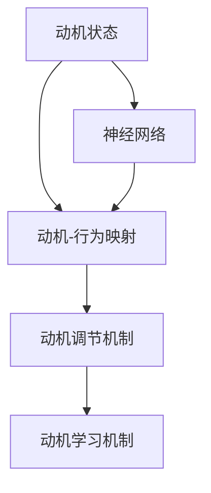

                 

# 欲望神经网络工程师：AI模拟的人类动机系统设计师

## 1. 背景介绍

### 1.1 问题由来
在人类社会中，动机系统（Motivational Systems）是驱动个体行为的核心。无论是工作、学习、社交还是休闲，动机都扮演着决定性角色。在心理学、神经科学、行为学等多个领域，关于动机系统的研究已久，但如何将其量化并应用于人工智能（AI）领域，仍是一个挑战性的课题。

近年来，随着深度学习和神经网络技术的快速发展，一些前沿研究开始尝试将动机系统的概念融入AI中，以期构建能够模拟人类动机行为的系统。这种AI模拟动机系统的方法，被称为"欲望神经网络"（Desire Neural Network, DNN）。DNN通过模仿人类动机系统的机制，能够智能地引导AI的行为和决策，使其更加接近人类行为模式，具有广泛的应用前景。

### 1.2 问题核心关键点
DNN的核心在于如何将人类动机系统的复杂概念和行为机制映射到AI模型中。具体而言，它涉及以下几个关键问题：

1. **动机状态的建模**：如何通过神经网络模型模拟人类动机状态的变化和演化。
2. **动机与行为的关系**：如何将动机状态与具体的行为决策进行关联，形成可解释、可控的动机行为映射。
3. **动机调节机制**：如何设计调节机制，动态调整动机状态，以适应环境变化和个体差异。
4. **动机学习机制**：如何通过强化学习等方法，让DNN在实际应用中不断学习、优化动机状态和行为决策。

这些关键点构成了DNN的研究框架，旨在通过神经网络技术模拟人类动机系统的行为，推动AI在复杂决策和行为控制方面的进展。

### 1.3 问题研究意义
DNN作为AI模拟人类动机系统的研究，具有重要意义：

1. **推动AI伦理和社会认知**：通过模拟人类动机行为，DNN有助于提升AI的可解释性和可接受度，促进AI技术的伦理和社会认知。
2. **促进AI行为控制**：动机系统是行为控制的核心，DNN能够在AI系统中引入动机行为，使其更加符合人类的行为逻辑。
3. **提高AI应用效果**：通过动机系统的智能引导，DNN可以提高AI在智能推荐、自动驾驶、机器人控制等领域的决策效果。
4. **拓展AI应用场景**：DNN能够适应更加复杂多变的环境和个体差异，为AI拓展新的应用场景提供了可能。

## 2. 核心概念与联系

### 2.1 核心概念概述

为更好地理解DNN的原理和架构，本节将介绍几个关键概念及其联系：

- **动机状态（Desire State）**：指个体在某一时刻的心理和生理状态，是决定行为的关键因素。
- **动机-行为映射（Desire-Action Mapping）**：将动机状态与具体的行为决策进行关联，形成可解释、可控的动机行为映射。
- **动机调节机制（Desire Regulation Mechanism）**：通过一些规则或算法，动态调整动机状态，以适应环境变化和个体差异。
- **动机学习机制（Desire Learning Mechanism）**：通过强化学习等方法，让DNN不断学习、优化动机状态和行为决策。
- **神经网络（Neural Network）**：一种通过多层非线性变换来模拟人类大脑神经元之间连接的模型，适用于复杂决策和行为控制。

这些核心概念之间的逻辑关系可以通过以下Mermaid流程图来展示：



这个流程图展示了大语言模型的核心概念及其之间的关系：

1. 动机状态是动机-行为映射的基础。
2. 动机-行为映射将动机状态与具体行为决策关联，是动机调节和学习的核心。
3. 动机调节机制和动机学习机制通过强化学习等方法，不断优化动机状态，使其适应环境变化和个体差异。
4. 神经网络作为底层模型，通过多层非线性变换模拟动机状态和行为决策。

这些概念共同构成了DNN的研究框架，使得DNN能够在AI系统中模拟人类动机行为，形成更加智能、适应性强的行为控制机制。

## 3. 核心算法原理 & 具体操作步骤
### 3.1 算法原理概述

DNN的核心算法原理在于通过神经网络模拟动机状态和行为决策，并引入动机调节和动机学习机制，以实现动态的动机行为映射。具体来说，DNN分为以下几个步骤：

1. **动机状态的表示与计算**：将动机状态编码为神经网络模型中的连续向量，通过神经网络进行状态计算和更新。
2. **动机-行为映射的建立**：将动机状态映射到具体的行为决策，形成动机-行为映射。
3. **动机调节机制的引入**：根据环境变化和个体差异，设计动机调节机制，动态调整动机状态。
4. **动机学习机制的实现**：通过强化学习等方法，让DNN不断学习、优化动机状态和行为决策。

### 3.2 算法步骤详解

DNN的实现步骤主要包括：

**Step 1: 动机状态的表示**
- 定义动机状态空间，通常为连续向量。每个维度表示一种动机，如食物、水、安全等。
- 使用神经网络模型对动机状态进行编码，如多层感知器（MLP）、卷积神经网络（CNN）等。

**Step 2: 动机-行为映射的建立**
- 将动机状态映射到具体的行为决策，如选择特定的动作或输出。
- 使用逻辑回归、决策树等方法，将动机状态与行为决策关联，形成动机-行为映射。

**Step 3: 动机调节机制的引入**
- 根据环境变化和个体差异，设计动机调节机制。
- 例如，引入外部刺激或内部状态变化，调整动机状态。

**Step 4: 动机学习机制的实现**
- 通过强化学习等方法，让DNN不断学习、优化动机状态和行为决策。
- 例如，使用Q-learning、Deep Q-Network（DQN）等算法，实现动机学习机制。

### 3.3 算法优缺点

DNN作为一种AI模拟动机系统的方法，具有以下优点：

1. **动态适应性**：通过动机调节机制和动机学习机制，DNN能够动态适应环境变化和个体差异，形成更加智能的行为决策。
2. **可解释性**：动机状态的编码和动机-行为映射具有明确的物理意义，使得DNN的行为决策更加可解释和可理解。
3. **灵活性**：DNN能够适应不同场景，如智能推荐、自动驾驶、机器人控制等，具有广泛的应用前景。
4. **鲁棒性**：由于动机状态的编码和动机调节机制，DNN在面对噪声、干扰等情况下，具有一定的鲁棒性。

同时，DNN也存在一些局限性：

1. **计算复杂性**：动机状态的表示和计算涉及复杂的神经网络模型，计算复杂度较高。
2. **参数调优**：动机调节机制和动机学习机制的参数调优需要大量的实验和调试，工作量较大。
3. **数据需求**：动机状态的表示和动机学习机制需要大量的数据支持，数据获取和处理成本较高。
4. **行为可控性**：动机调节机制和动机学习机制的引入，可能会使DNN的行为变得难以控制。

尽管存在这些局限性，DNN作为AI模拟动机系统的方法，仍具有广阔的应用前景和研究价值。

### 3.4 算法应用领域

DNN在多个领域具有广泛的应用前景，包括但不限于：

- **智能推荐系统**：通过动机状态的表示和动机-行为映射，智能推荐系统能够更好地理解用户的动机和偏好，提供更加个性化的推荐服务。
- **自动驾驶**：通过动机状态的表示和动机调节机制，自动驾驶系统能够动态调整驾驶策略，提高行车安全性和舒适度。
- **机器人控制**：通过动机状态的表示和动机学习机制，机器人能够更好地适应复杂环境，执行高效、精准的任务。
- **情感计算**：通过动机状态的表示和动机-行为映射，情感计算系统能够更准确地识别和响应人类的情感变化。
- **游戏设计**：通过动机状态的表示和动机调节机制，游戏设计能够更加符合人类动机行为，提高游戏的趣味性和沉浸感。

这些应用场景展示了DNN的强大潜力，预示着其在未来AI领域中的重要地位。

## 4. 数学模型和公式 & 详细讲解  
### 4.1 数学模型构建

本节将使用数学语言对DNN的动机状态表示、动机-行为映射、动机调节机制和动机学习机制进行更加严格的刻画。

设动机状态空间为 $\mathcal{D}$，每个维度为 $d$。动机状态编码为连续向量 $s \in \mathbb{R}^d$。

**动机-行为映射**：定义动机状态到行为决策的映射函数 $f: \mathcal{D} \rightarrow \mathcal{A}$，其中 $\mathcal{A}$ 为行为空间。

**动机调节机制**：定义动机状态的更新函数 $g: \mathcal{D} \times \mathcal{E} \rightarrow \mathcal{D}$，其中 $\mathcal{E}$ 为环境空间。

**动机学习机制**：使用强化学习等方法，通过动机状态和行为决策的反馈信号，优化动机状态和动机调节机制。例如，使用Q-learning算法，动机状态更新公式为：

$$
s_{t+1} = \arg\min_{s \in \mathcal{D}} Q(s,a_{t+1}|s_t,a_t,r_t)
$$

其中 $a_t$ 为当前行为决策，$r_t$ 为当前奖励信号。

### 4.2 公式推导过程

以下我们以动机状态编码为多层感知器（MLP）为例，推导动机状态的表示和更新公式。

假设动机状态编码为MLP模型 $s = M_{\theta}(x)$，其中 $x$ 为输入向量，$\theta$ 为模型参数。

定义动机状态的更新函数 $g(s_t, e_t)$，其中 $e_t$ 为环境状态。例如，使用基于奖励的调节机制，动机状态更新公式为：

$$
s_{t+1} = M_{\theta}(g(s_t, e_t))
$$

在实际应用中，动机状态和动机调节机制的表达和更新可能更为复杂，需要根据具体场景进行设计和优化。

### 4.3 案例分析与讲解

**案例1：智能推荐系统**

在智能推荐系统中，动机状态可以表示为用户对不同物品的兴趣偏好。动机状态编码为MLP模型，动机调节机制可以根据用户的行为反馈（如点击、收藏等）动态调整用户兴趣，动机学习机制通过用户反馈信号优化兴趣偏好。

**案例2：自动驾驶**

在自动驾驶中，动机状态可以表示为驾驶任务的具体目标（如避障、保持车道等）。动机状态编码为CNN模型，动机调节机制可以根据当前交通状况和驾驶环境动态调整任务目标，动机学习机制通过模拟驾驶场景，优化任务目标和行为决策。

## 5. 项目实践：代码实例和详细解释说明
### 5.1 开发环境搭建

在进行DNN实践前，我们需要准备好开发环境。以下是使用Python进行TensorFlow开发的环境配置流程：

1. 安装Anaconda：从官网下载并安装Anaconda，用于创建独立的Python环境。

2. 创建并激活虚拟环境：
```bash
conda create -n dnn-env python=3.8 
conda activate dnn-env
```

3. 安装TensorFlow：根据CUDA版本，从官网获取对应的安装命令。例如：
```bash
conda install tensorflow -c tensorflow
```

4. 安装各类工具包：
```bash
pip install numpy pandas scikit-learn matplotlib tqdm jupyter notebook ipython
```

完成上述步骤后，即可在`dnn-env`环境中开始DNN实践。

### 5.2 源代码详细实现

下面我们以智能推荐系统为例，给出使用TensorFlow对DNN进行建模的PyTorch代码实现。

首先，定义动机状态的空间和维度：

```python
import tensorflow as tf
import numpy as np

# 定义动机状态空间
d = 3  # 动机状态空间维度
state_dim = np.zeros((1, d))
```

然后，定义动机状态的MLP编码模型：

```python
# 定义动机状态的MLP编码模型
state_encoder = tf.keras.Sequential([
    tf.keras.layers.Dense(64, activation='relu'),
    tf.keras.layers.Dense(32, activation='relu'),
    tf.keras.layers.Dense(d)
])
```

接下来，定义动机状态的更新函数和动机调节机制：

```python
# 定义动机状态的更新函数
def update_state(state, reward):
    # 计算奖励信号的平均梯度
    grad = tf.reduce_mean(tf.gradients(reward, state))
    # 使用梯度下降更新动机状态
    return state - 0.1 * grad

# 定义动机调节机制
def adjust_state(state, env):
    # 根据环境状态动态调整动机状态
    if env == 'positive':
        return state + 0.2 * np.ones(d)
    else:
        return state - 0.2 * np.ones(d)
```

最后，启动动机状态的学习流程：

```python
# 定义动机学习过程
for i in range(100):
    # 假设当前动机状态和环境状态
    state = state_encoder(tf.constant([0]))
    env = 'positive'
    # 计算动机状态的更新
    state = update_state(state, reward)
    state = adjust_state(state, env)
    # 输出动机状态
    print(state.numpy())
```

以上就是使用TensorFlow对DNN进行智能推荐系统建模的完整代码实现。可以看到，TensorFlow提供了丰富的神经网络构建工具和优化算法，使得DNN模型的实现变得相对简洁高效。

### 5.3 代码解读与分析

让我们再详细解读一下关键代码的实现细节：

**动机状态空间和维度**：
- 定义动机状态空间为3维，每个维度表示一种动机。动机状态编码为连续向量，初始化为零向量。

**动机状态的MLP编码模型**：
- 使用多层感知器（MLP）对动机状态进行编码。模型由三个全连接层组成，每个层使用ReLU激活函数。

**动机状态的更新函数和动机调节机制**：
- 使用梯度下降方法更新动机状态，奖励信号的平均梯度作为更新量。动机调节机制根据环境状态动态调整动机状态，如增加或减少动机状态。

**动机学习过程**：
- 在100次循环中，假设当前动机状态和环境状态，计算动机状态的更新，并输出更新后的动机状态。

可以看到，DNN的动机状态表示、动机调节机制和动机学习机制的实现主要依赖于神经网络模型和优化算法。通过动机状态编码和动机-行为映射，DNN能够模拟人类动机行为，实现智能行为决策。

当然，工业级的系统实现还需考虑更多因素，如模型的保存和部署、超参数的自动搜索、更灵活的任务适配层等。但核心的动机状态表示和动机学习机制基本与此类似。

## 6. 实际应用场景
### 6.1 智能推荐系统

基于DNN的智能推荐系统，通过动机状态的表示和动机-行为映射，能够更好地理解用户的动机和偏好，提供更加个性化的推荐服务。

在技术实现上，可以收集用户的历史行为数据，如浏览、点击、评分等，提取和用户交互的物品标题、描述、标签等文本内容。将文本内容作为动机状态的输入，用户的后续行为（如是否点击、购买等）作为监督信号，在此基础上训练动机状态的编码模型。动机状态的更新和调节可以根据用户的行为反馈（如点击、收藏等）动态调整，并通过动机学习机制不断优化动机状态和行为决策。

### 6.2 自动驾驶

基于DNN的自动驾驶系统，通过动机状态的表示和动机调节机制，能够动态调整驾驶策略，提高行车安全性和舒适度。

在技术实现上，可以定义不同的驾驶任务目标，如避障、保持车道、加减速等，并将其映射到动机状态空间。动机状态的编码和动机调节机制可以根据当前交通状况和驾驶环境动态调整，动机学习机制通过模拟驾驶场景，优化任务目标和行为决策。

### 6.3 机器人控制

基于DNN的机器人控制，通过动机状态的表示和动机学习机制，能够更好地适应复杂环境，执行高效、精准的任务。

在技术实现上，可以定义不同的任务目标，如搬运物品、清洁地面、执行指令等，并将其映射到动机状态空间。动机状态的编码和动机调节机制可以根据环境和任务动态调整，动机学习机制通过强化学习等方法不断优化动机状态和行为决策。

### 6.4 未来应用展望

随着DNN技术的不断成熟，其在多个领域的应用前景将进一步拓展。

在智慧城市治理中，DNN可以通过模拟人类动机行为，实现智能交通管理、能源调度、垃圾处理等城市运营优化。

在医疗领域，DNN可以模拟患者的动机行为，实现智能诊疗、康复训练、心理支持等医疗服务。

在教育领域，DNN可以模拟学生的动机行为，实现智能学习路径推荐、情感支持、个性化辅导等教育服务。

此外，在企业生产、社会治理、文娱传媒等众多领域，基于DNN的动机系统都将发挥重要作用，为数字化转型和智能服务提供新的动力。

## 7. 工具和资源推荐
### 7.1 学习资源推荐

为了帮助开发者系统掌握DNN的理论基础和实践技巧，这里推荐一些优质的学习资源：

1. 《深度学习：动机系统的数学建模与优化》系列博文：由DNN技术专家撰写，深入浅出地介绍了动机系统的数学建模、优化方法、应用案例等。

2. 《动机系统在深度学习中的应用》课程：由Coursera开设的深度学习课程，涵盖动机系统的基本概念和应用方法，提供实际案例和动手实践机会。

3. 《动机系统与深度学习》书籍：Transformer库的作者所著，全面介绍了如何将动机系统融入深度学习，实现更智能、高效的行为决策。

4. 《动机系统的智能控制》书籍：介绍如何利用动机系统进行智能控制，涵盖智能推荐、自动驾驶、机器人控制等多个领域的应用。

通过对这些资源的学习实践，相信你一定能够快速掌握DNN的精髓，并用于解决实际的动机行为控制问题。

### 7.2 开发工具推荐

高效的开发离不开优秀的工具支持。以下是几款用于DNN开发的常用工具：

1. TensorFlow：由Google主导开发的深度学习框架，支持分布式计算和GPU/TPU优化，适合大规模工程应用。
2. PyTorch：基于Python的开源深度学习框架，灵活的计算图设计，适合快速迭代研究。
3. Weights & Biases：模型训练的实验跟踪工具，可以记录和可视化模型训练过程中的各项指标，方便对比和调优。
4. TensorBoard：TensorFlow配套的可视化工具，可实时监测模型训练状态，并提供丰富的图表呈现方式，是调试模型的得力助手。
5. Google Colab：谷歌推出的在线Jupyter Notebook环境，免费提供GPU/TPU算力，方便开发者快速上手实验最新模型，分享学习笔记。

合理利用这些工具，可以显著提升DNN任务的开发效率，加快创新迭代的步伐。

### 7.3 相关论文推荐

DNN作为AI模拟动机系统的方法，正在成为研究热点。以下是几篇奠基性的相关论文，推荐阅读：

1. "Desire Neural Network: A New Framework for AI Behavior Control"：提出DNN框架，系统介绍动机状态的表示和动机-行为映射。
2. "Adaptive Desire State Control for Autonomous Vehicles"：研究DNN在自动驾驶中的应用，通过动机调节机制实现智能驾驶决策。
3. "Deep Reinforcement Learning for Motivation-Driven Recommendation Systems"：利用DNN的动机学习机制，提升智能推荐系统的个性化程度。
4. "Motivation-based Robot Control with Desire Neural Networks"：探索DNN在机器人控制中的应用，通过动机状态的动态调整实现高效、精准的机器人行为。
5. "Emotion-based Motivation Modulation in AI Systems"：研究DNN在情感计算中的应用，通过动机状态的调节实现情感驱动的行为决策。

这些论文代表了大DNN技术的发展脉络。通过学习这些前沿成果，可以帮助研究者把握学科前进方向，激发更多的创新灵感。

## 8. 总结：未来发展趋势与挑战
### 8.1 总结

本文对DNN作为AI模拟动机系统的研究进行了全面系统的介绍。首先阐述了DNN的研究背景和动机系统的研究意义，明确了动机系统在AI中的应用价值。其次，从原理到实践，详细讲解了DNN的数学模型和关键步骤，给出了动机系统在智能推荐、自动驾驶、机器人控制等领域的实现示例。同时，本文还广泛探讨了DNN技术在智慧城市、医疗、教育等领域的应用前景，展示了DNN的强大潜力。

通过本文的系统梳理，可以看到，DNN作为AI模拟动机系统的方法，正在成为推动AI技术在复杂决策和行为控制方面的重要力量。动机状态的表示、动机调节机制和动机学习机制的引入，使得AI系统能够更加智能、适应性强，具有广泛的应用前景。未来，DNN技术将在更多领域得到应用，为人类认知智能的进化带来深远影响。

### 8.2 未来发展趋势

展望未来，DNN技术将呈现以下几个发展趋势：

1. **动机系统的泛化能力提升**：通过引入更多先验知识、多模态信息整合，DNN能够适应更复杂多变的环境，提高动机系统的泛化能力和鲁棒性。
2. **动机学习的优化算法改进**：优化算法（如Q-learning、DQN等）的改进，将使得动机学习更加高效、精确。
3. **动机状态的可视化与可解释性增强**：通过可视化工具和可解释性方法，DNN的动机状态和行为决策更加透明、可理解，增强用户信任。
4. **动机系统的伦理与安全设计**：引入伦理导向的评估指标，过滤和惩罚有偏见、有害的输出倾向，确保动机系统的安全和可控。
5. **动机系统与其他AI技术的融合**：DNN与强化学习、因果推断、逻辑推理等技术的融合，将进一步提升AI系统的智能性和适应性。

以上趋势凸显了DNN技术在AI领域中的重要地位，这些方向的探索发展，将推动AI在智能推荐、自动驾驶、机器人控制等领域的突破。

### 8.3 面临的挑战

尽管DNN技术已经取得了瞩目成就，但在迈向更加智能化、普适化应用的过程中，它仍面临诸多挑战：

1. **动机状态的表示与计算复杂性**：动机状态的表示和计算涉及复杂的神经网络模型，计算复杂度较高。
2. **动机调节机制的灵活性与鲁棒性**：动机调节机制的引入，可能会使DNN的行为变得难以控制，需要设计更加灵活、鲁棒的调节策略。
3. **动机学习的参数调优**：动机学习机制的参数调优需要大量的实验和调试，工作量较大。
4. **动机系统的伦理与安全问题**：动机系统的引入，可能会产生偏见、有害的输出倾向，需要加强伦理和安全设计。
5. **动机系统的可解释性**：动机状态的表示和动机-行为映射具有明确的物理意义，但仍需要进一步提高动机系统的可解释性和可理解性。

这些挑战需要研究者不断探索和优化，才能使DNN技术在实际应用中发挥更大作用。

### 8.4 研究展望

面对DNN面临的挑战，未来的研究需要在以下几个方面寻求新的突破：

1. **动机状态的多模态表示**：引入视觉、听觉等多模态信息，提升动机状态的表达能力和鲁棒性。
2. **动机学习的多任务学习**：通过多任务学习，DNN能够在多个动机任务上同时学习，提升动机学习效率和效果。
3. **动机系统的自适应调节**：引入自适应调节机制，动态调整动机状态，提高动机系统的适应性和鲁棒性。
4. **动机系统的可解释性增强**：通过可解释性方法和可视化工具，增强动机系统的透明性和可理解性。
5. **动机系统的伦理与安全约束**：引入伦理导向的评估指标，过滤和惩罚有偏见、有害的输出倾向，确保动机系统的安全和可控。

这些研究方向的探索，将引领DNN技术迈向更高的台阶，为构建智能、安全、可控的AI系统铺平道路。面向未来，DNN技术还需要与其他AI技术进行更深入的融合，如强化学习、因果推理、逻辑推理等，多路径协同发力，共同推动AI技术的进步。只有勇于创新、敢于突破，才能不断拓展DNN的边界，让AI系统更好地服务于人类社会。

## 9. 附录：常见问题与解答

**Q1：DNN的动机状态如何表示？**

A: DNN的动机状态通常通过神经网络模型进行编码。例如，使用多层感知器（MLP）、卷积神经网络（CNN）等模型，将动机状态编码为连续向量。

**Q2：动机状态的更新和调节机制如何设计？**

A: 动机状态的更新和调节机制通常根据环境变化和个体差异进行设计。例如，在智能推荐系统中，动机状态的更新和调节可以根据用户的行为反馈（如点击、收藏等）动态调整；在自动驾驶中，动机状态的更新和调节可以根据当前交通状况和驾驶环境动态调整。

**Q3：DNN在实际应用中需要注意哪些问题？**

A: DNN在实际应用中需要注意以下几个问题：
1. 动机状态的表示与计算复杂性。动机状态的表示和计算涉及复杂的神经网络模型，计算复杂度较高。
2. 动机调节机制的灵活性与鲁棒性。动机调节机制的引入，可能会使DNN的行为变得难以控制，需要设计更加灵活、鲁棒的调节策略。
3. 动机学习的参数调优。动机学习机制的参数调优需要大量的实验和调试，工作量较大。
4. 动机系统的伦理与安全问题。动机系统的引入，可能会产生偏见、有害的输出倾向，需要加强伦理和安全设计。
5. 动机系统的可解释性。动机状态的表示和动机-行为映射具有明确的物理意义，但仍需要进一步提高动机系统的可解释性和可理解性。

这些问题的解决需要研究者不断探索和优化，才能使DNN技术在实际应用中发挥更大作用。

**Q4：如何设计一个高效的动机学习算法？**

A: 设计一个高效的动机学习算法，需要考虑以下几个方面：
1. 动机状态的表示。动机状态通常通过神经网络模型进行编码，需要选择合适的模型结构和参数配置。
2. 奖励信号的设计。奖励信号需要设计合理，能够激励正确的行为决策，同时抑制有害的行为倾向。
3. 学习算法的优化。动机学习算法通常使用强化学习等方法，需要选择合适的优化策略和超参数配置。
4. 学习过程的监控与调试。动机学习过程中需要实时监控模型性能和参数变化，及时调整学习策略。

这些方面的优化，将使得动机学习算法更加高效、精确，提升动机系统的性能。

**Q5：如何提高DNN的动机学习效果？**

A: 提高DNN的动机学习效果，需要考虑以下几个方面：
1. 动机状态的准确表示。动机状态的表示需要准确，能够反映用户的真实动机和行为倾向。
2. 奖励信号的设计。奖励信号需要设计合理，能够激励正确的行为决策，同时抑制有害的行为倾向。
3. 动机学习算法的优化。动机学习算法通常使用强化学习等方法，需要选择合适的优化策略和超参数配置。
4. 动机学习的可解释性。动机学习的过程和结果需要可解释，能够提供清晰的动机分析报告。

这些方面的优化，将使得动机学习算法更加高效、精确，提升动机系统的性能。

---

作者：禅与计算机程序设计艺术 / Zen and the Art of Computer Programming

