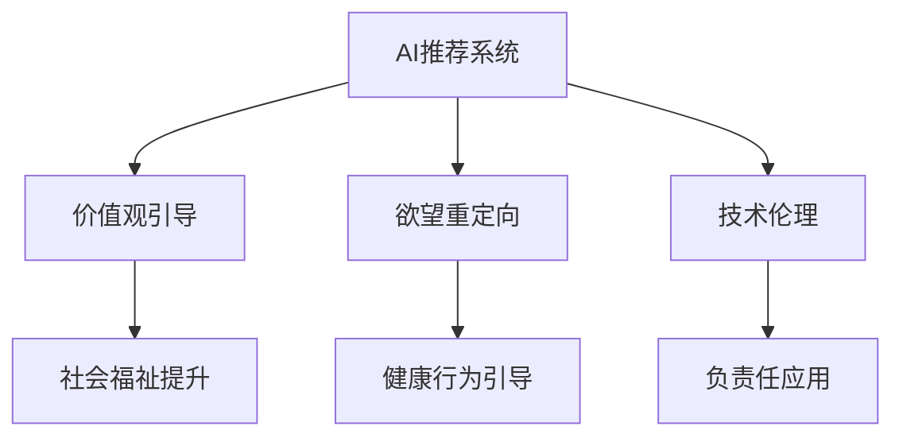

                 

# 欲望重定向技术：AI引导的价值观重塑方法

## 1. 背景介绍

### 1.1 问题由来

在当今社会，技术的快速迭代和信息的高速流动带来了前所未有的便利，同时也深刻地影响着人类的行为模式和价值观念。然而，这种技术驱动的生活方式也引发了一系列社会问题，如数字成瘾、信息过载、隐私泄露等。如何引导公众合理利用技术，形成健康、积极的价值观，成为了一个亟待解决的课题。

近年来，人工智能（AI）技术在自然语言处理（NLP）、推荐系统（Recommendation System）等领域的快速发展，为解决这一问题提供了新的可能性。特别是，基于AI的推荐算法和对话系统，能够在一定程度上影响用户的决策和行为，从而引导其形成更加健康的价值观念。

### 1.2 问题核心关键点

本文聚焦于基于AI的欲望重定向技术，探讨如何利用AI技术引导用户的价值观重塑。关键问题包括：

1. **用户需求理解**：如何准确理解用户的兴趣、偏好和需求，以提供更加个性化的推荐和服务？
2. **价值观引导**：如何利用AI技术，通过个性化的推荐和对话，引导用户形成更加健康、积极的价值观？
3. **技术伦理**：如何设计和使用AI技术，避免误导用户、侵犯隐私等问题，确保技术的负责任应用？

### 1.3 问题研究意义

在当前社会，技术的快速发展和信息的多样化，带来了价值观多元化、碎片化的趋势。如何利用AI技术引导社会主流价值观的形成，构建积极健康的网络环境，是一个具有重要社会意义的研究课题。

具体而言，欲望重定向技术在以下几个方面具有重要意义：

1. **提升用户福祉**：通过AI引导，帮助用户摆脱数字成瘾、信息过载等问题的困扰，提升生活质量。
2. **构建和谐社会**：引导用户形成更加健康、积极的价值观，促进社会和谐与进步。
3. **推动技术发展**：为AI技术在社会治理、教育、医疗等领域的广泛应用提供新思路，推动技术创新。

## 2. 核心概念与联系

### 2.1 核心概念概述

为更好地理解欲望重定向技术，本节将介绍几个密切相关的核心概念：

- **AI推荐系统**：利用机器学习算法，对用户的行为数据进行建模，预测其兴趣和需求，从而提供个性化的推荐服务。
- **价值观引导**：通过推荐系统和对话系统，向用户推送积极健康的内容，影响其行为和决策，引导其形成健康、积极的价值观。
- **欲望重定向**：利用AI技术，对用户的兴趣偏好进行分析和调整，引导其从过度娱乐化、消费化的行为模式中解脱出来，转而追求更有意义、更有价值的生活。
- **技术伦理**：在设计和使用AI技术时，如何避免误导用户、侵犯隐私等问题，确保技术的负责任应用。

这些核心概念之间的逻辑关系可以通过以下Mermaid流程图来展示：



这个流程图展示了一系列概念及其之间的关系：

1. AI推荐系统是实现价值观引导和欲望重定向的基础，通过个性化推荐和对话，影响用户行为。
2. 价值观引导和欲望重定向的目标，是提升社会福祉，促进用户健康行为，构建和谐社会。
3. 技术伦理是确保AI技术负责任应用的关键，避免误导和隐私侵犯等问题。

## 3. 核心算法原理 & 具体操作步骤
### 3.1 算法原理概述

欲望重定向技术本质上是一种基于AI的个性化推荐和引导方法，其核心思想是通过对用户行为数据的分析，理解其潜在的价值观需求，从而提供更加契合的内容和引导。具体来说，包括以下几个关键步骤：

1. **用户行为建模**：利用机器学习算法，对用户的历史行为数据进行建模，预测其兴趣和需求。
2. **价值观引导**：通过推荐系统和对话系统，向用户推送积极健康的内容，影响其行为和决策，引导其形成健康、积极的价值观。
3. **欲望重定向**：利用AI技术，对用户的兴趣偏好进行分析和调整，引导其从过度娱乐化、消费化的行为模式中解脱出来，转而追求更有意义、更有价值的生活。
4. **技术伦理约束**：在设计和使用AI技术时，确保技术的负责任应用，避免误导用户、侵犯隐私等问题。

### 3.2 算法步骤详解

欲望重定向技术主要包括以下几个关键步骤：

**Step 1: 数据收集与预处理**
- 收集用户的历史行为数据，如浏览记录、购买记录、社交媒体互动等。
- 对数据进行清洗和预处理，包括去除噪声、填补缺失值、标准化等。

**Step 2: 用户兴趣建模**
- 利用协同过滤、内容推荐等算法，对用户的历史行为数据进行建模，得到用户兴趣向量。
- 利用聚类、降维等方法，对用户兴趣进行细分和聚合，形成更加精准的用户画像。

**Step 3: 价值观引导与欲望重定向**
- 设计价值观引导策略，通过推荐系统和对话系统，向用户推送积极健康的内容，如学习资源、公益活动等。
- 利用价值观引导的反馈数据，对推荐模型进行调整，进一步优化价值观引导效果。
- 设计欲望重定向策略，通过调整推荐内容、引导用户参与公益活动等方式，帮助用户摆脱过度娱乐化、消费化的行为模式。

**Step 4: 技术伦理约束**
- 对推荐系统和对话系统进行伦理审查，确保其不违反用户隐私、误导用户等问题。
- 设计用户反馈机制，允许用户对不恰当推荐进行投诉和反馈，优化模型行为。
- 建立透明、可解释的推荐和引导算法，让用户了解推荐依据，增强信任感。

### 3.3 算法优缺点

欲望重定向技术具有以下优点：

1. **个性化推荐**：通过用户行为建模，能够提供更加个性化的推荐服务，满足用户的个性化需求。
2. **价值观引导**：利用AI技术，能够精准推送积极健康的内容，影响用户行为和决策，引导其形成健康、积极的价值观。
3. **技术高效**：利用机器学习和推荐算法，能够高效处理大规模用户数据，提供及时、有效的服务。

同时，该技术也存在一定的局限性：

1. **数据隐私**：在数据收集和预处理过程中，可能涉及用户隐私保护问题，需要严格遵守数据保护法律法规。
2. **伦理风险**：在价值观引导和欲望重定向过程中，可能存在误导用户、侵犯隐私等问题，需要设计伦理约束机制。
3. **推荐偏见**：在推荐算法设计中，可能存在数据偏见、算法偏见等问题，导致推荐结果不公平。
4. **模型透明性**：推荐系统的推荐逻辑和价值观引导算法复杂，缺乏透明性，用户难以理解推荐依据。

尽管存在这些局限性，但欲望重定向技术在提升用户福祉、构建和谐社会等方面具有显著的潜力，仍需进一步研究和完善。

### 3.4 算法应用领域

欲望重定向技术在多个领域具有广泛的应用前景：

1. **教育领域**：通过引导学生接触更多的学习资源和公益活动，帮助其摆脱游戏和娱乐的沉迷，专注于学习和发展。
2. **健康领域**：通过引导用户接触健康饮食、运动等相关信息，帮助其改善生活方式，提升生活质量。
3. **社会治理**：通过引导公众参与公益活动、社会事务等，促进社会和谐与进步，构建积极健康的网络环境。

## 4. 数学模型和公式 & 详细讲解 & 举例说明

### 4.1 数学模型构建

欲望重定向技术主要基于以下数学模型：

- **协同过滤模型**：通过用户-物品评分矩阵，预测用户对未评分物品的评分。
- **内容推荐模型**：利用文本挖掘、特征提取等技术，对物品进行特征建模，从而预测用户对物品的兴趣。
- **用户行为模型**：利用时间序列分析、关联规则挖掘等方法，对用户行为数据进行建模和预测。

### 4.2 公式推导过程

以协同过滤模型为例，其基本公式为：

$$
\hat{r}_{ui} = \sum_{j=1}^n \alpha_{ij} r_{uj}
$$

其中，$r_{ui}$ 为预测用户 $u$ 对物品 $i$ 的评分，$\alpha_{ij}$ 为物品 $j$ 对物品 $i$ 的相似度系数，$r_{uj}$ 为用户 $u$ 对物品 $j$ 的实际评分。

该公式的推导基于用户-物品评分矩阵，通过计算相似度系数 $\alpha_{ij}$，从而预测用户对未评分物品的评分。

### 4.3 案例分析与讲解

以教育领域的欲望重定向技术为例，介绍其具体实现过程：

1. **数据收集**：收集学生的浏览记录、搜索历史、学习时间等信息。
2. **用户兴趣建模**：利用协同过滤算法，对学生的浏览行为进行建模，得到学生兴趣向量。
3. **价值观引导**：通过推荐系统，向学生推送学习资源、公益活动等积极健康的内容。
4. **欲望重定向**：利用推荐系统的反馈数据，对推荐算法进行调整，引导学生从过度娱乐化、消费化的行为模式中解脱出来，转而专注于学习和发展。

## 5. 项目实践：代码实例和详细解释说明

### 5.1 开发环境搭建

在进行欲望重定向技术开发前，我们需要准备好开发环境。以下是使用Python进行PyTorch开发的环境配置流程：

1. 安装Anaconda：从官网下载并安装Anaconda，用于创建独立的Python环境。

2. 创建并激活虚拟环境：
```bash
conda create -n pytorch-env python=3.8 
conda activate pytorch-env
```

3. 安装PyTorch：根据CUDA版本，从官网获取对应的安装命令。例如：
```bash
conda install pytorch torchvision torchaudio cudatoolkit=11.1 -c pytorch -c conda-forge
```

4. 安装TensorFlow：
```bash
conda install tensorflow -c tf
```

5. 安装相关库：
```bash
pip install pandas numpy scikit-learn matplotlib
```

完成上述步骤后，即可在`pytorch-env`环境中开始欲望重定向技术开发。

### 5.2 源代码详细实现

下面是使用PyTorch实现协同过滤算法的代码：

```python
import torch
import torch.nn as nn
import torch.optim as optim
from torch.utils.data import Dataset, DataLoader

class协同过滤模型(nn.Module):
    def __init__(self, n_users, n_items, n_factors):
        super(协同过滤模型, self).__init__()
        self.factor_n = n_factors
        self.user_factors = nn.Embedding(n_users, self.factor_n)
        self.item_factors = nn.Embedding(n_items, self.factor_n)
        self.user_bias = nn.Parameter(torch.rand(n_users))
        self.item_bias = nn.Parameter(torch.rand(n_items))
        self.build_net()
    
    def build_net(self):
        self.output_layer = nn.Linear(2 * self.factor_n, 1)
    
    def forward(self, user_id, item_id):
        user_factors = self.user_factors(user_id)
        item_factors = self.item_factors(item_id)
        user_bias = self.user_bias[user_id]
        item_bias = self.item_bias[item_id]
        
        pred = user_factors @ item_factors.t() + user_bias + item_bias
        pred = self.output_layer(pred)
        return pred
    
    def predict(self, user_id, item_id):
        with torch.no_grad():
            pred = self.forward(user_id, item_id).item()
        return pred
```

### 5.3 代码解读与分析

下面是代码的具体解读：

1. 定义协同过滤模型类，继承自`nn.Module`。
2. 初始化模型参数，包括用户和物品的因子向量、用户和物品的偏差。
3. 定义前向传播函数，通过因子向量矩阵乘法计算预测值。
4. 定义预测函数，在测试时进行预测。

## 6. 实际应用场景

### 6.1 教育领域

在教育领域，欲望重定向技术可以通过推荐系统，帮助学生摆脱游戏和娱乐的沉迷，专注于学习和发展。具体应用场景包括：

1. **学习资源推荐**：通过推荐系统，向学生推荐符合其学习兴趣和需求的学习资源，如在线课程、电子书、习题集等。
2. **公益活动参与**：通过引导系统，鼓励学生参与公益活动、志愿服务、社会实践等，培养其社会责任感和价值观。
3. **心理健康关注**：通过推荐系统，向学生推荐心理健康资源，如心理测评、心理辅导、心理健康文章等，帮助其缓解压力，提升心理健康。

### 6.2 健康领域

在健康领域，欲望重定向技术可以通过推荐系统，帮助用户改善生活方式，提升生活质量。具体应用场景包括：

1. **健康饮食推荐**：通过推荐系统，向用户推荐健康饮食计划、食谱、运动指导等，帮助其改善饮食习惯，提升健康水平。
2. **心理健康引导**：通过引导系统，向用户推送心理健康资源，如心理健康文章、心理辅导、心理测评等，帮助其缓解压力，提升心理健康。
3. **运动健身指导**：通过推荐系统，向用户推荐运动健身计划、视频教程、运动器材等，帮助其保持身体健康。

### 6.3 社会治理

在社会治理领域，欲望重定向技术可以通过引导系统，促进公众参与公益活动、社会事务等，构建积极健康的网络环境。具体应用场景包括：

1. **公益活动宣传**：通过推荐系统，向公众推送公益活动、志愿者招募信息等，鼓励其参与社会公益事业。
2. **社区互动引导**：通过引导系统，向社区居民推送社区公告、活动信息等，促进社区互动和凝聚力。
3. **社会问题关注**：通过引导系统，向公众推送社会热点话题、公益项目等，引导其关注社会问题，参与社会治理。

## 7. 工具和资源推荐

### 7.1 学习资源推荐

为了帮助开发者系统掌握欲望重定向技术的理论基础和实践技巧，这里推荐一些优质的学习资源：

1. 《深度学习》系列书籍：由多位深度学习专家合著，全面介绍了深度学习的基本概念和算法，包括推荐系统和对话系统。
2. 《自然语言处理基础》课程：斯坦福大学开设的NLP课程，详细讲解了NLP的基本概念和技术，包括情感分析和价值观引导。
3. 《人工智能伦理》书籍：探讨AI技术的伦理问题，为欲望重定向技术的设计和应用提供伦理指导。

通过对这些资源的学习实践，相信你一定能够快速掌握欲望重定向技术的精髓，并用于解决实际的AI伦理问题。

### 7.2 开发工具推荐

高效的开发离不开优秀的工具支持。以下是几款用于欲望重定向技术开发的常用工具：

1. PyTorch：基于Python的开源深度学习框架，灵活动态的计算图，适合快速迭代研究。
2. TensorFlow：由Google主导开发的开源深度学习框架，生产部署方便，适合大规模工程应用。
3. Weights & Biases：模型训练的实验跟踪工具，可以记录和可视化模型训练过程中的各项指标，方便对比和调优。
4. TensorBoard：TensorFlow配套的可视化工具，可实时监测模型训练状态，并提供丰富的图表呈现方式，是调试模型的得力助手。

合理利用这些工具，可以显著提升欲望重定向技术开发效率，加快创新迭代的步伐。

### 7.3 相关论文推荐

欲望重定向技术的发展源于学界的持续研究。以下是几篇奠基性的相关论文，推荐阅读：

1. Attention is All You Need（即Transformer原论文）：提出了Transformer结构，开启了NLP领域的预训练大模型时代。
2. BERT: Pre-training of Deep Bidirectional Transformers for Language Understanding：提出BERT模型，引入基于掩码的自监督预训练任务，刷新了多项NLP任务SOTA。
3. Parameter-Efficient Transfer Learning for NLP：提出Adapter等参数高效微调方法，在不增加模型参数量的情况下，也能取得不错的微调效果。
4. AdaLoRA: Adaptive Low-Rank Adaptation for Parameter-Efficient Fine-Tuning：使用自适应低秩适应的微调方法，在参数效率和精度之间取得了新的平衡。

这些论文代表了大语言模型微调技术的发展脉络。通过学习这些前沿成果，可以帮助研究者把握学科前进方向，激发更多的创新灵感。

## 8. 总结：未来发展趋势与挑战

### 8.1 总结

本文对欲望重定向技术进行了全面系统的介绍。首先阐述了欲望重定向技术的研究背景和意义，明确了AI技术在引导用户价值观重塑方面的独特价值。其次，从原理到实践，详细讲解了欲望重定向技术的数学模型和关键步骤，给出了技术开发的完整代码实例。同时，本文还广泛探讨了欲望重定向技术在教育、健康、社会治理等领域的实际应用前景，展示了AI技术在社会治理中的巨大潜力。此外，本文精选了欲望重定向技术的各类学习资源，力求为开发者提供全方位的技术指引。

通过本文的系统梳理，可以看到，欲望重定向技术正在成为AI技术引导用户价值观重塑的重要范式，极大地拓展了AI技术的应用边界，催生了更多的落地场景。随着AI技术的不断发展和普及，欲望重定向技术必将在构建积极健康的网络环境、提升用户福祉等方面发挥更加重要的作用。

### 8.2 未来发展趋势

展望未来，欲望重定向技术将呈现以下几个发展趋势：

1. **技术融合**：欲望重定向技术与推荐系统、对话系统等AI技术将进一步融合，形成更加智能、精准的引导系统。
2. **个性化提升**：利用AI技术，将更加精准地理解和预测用户需求，提供更加个性化的推荐和服务。
3. **伦理约束**：随着技术的广泛应用，欲望重定向技术的伦理问题将受到更多关注，设计和使用过程中将更加注重隐私保护、伦理约束等问题。
4. **跨领域应用**：欲望重定向技术将在更多领域得到应用，如教育、健康、社会治理等，为社会和谐与进步提供新的技术支持。
5. **技术演进**：随着深度学习、自然语言处理等技术的不断进步，欲望重定向技术将不断演进，实现更加高效、精准的引导。

### 8.3 面临的挑战

尽管欲望重定向技术已经取得了显著的进展，但在迈向更加智能化、普适化应用的过程中，仍面临诸多挑战：

1. **数据隐私**：在数据收集和预处理过程中，可能涉及用户隐私保护问题，需要严格遵守数据保护法律法规。
2. **伦理风险**：在价值观引导和欲望重定向过程中，可能存在误导用户、侵犯隐私等问题，需要设计伦理约束机制。
3. **推荐偏见**：在推荐算法设计中，可能存在数据偏见、算法偏见等问题，导致推荐结果不公平。
4. **模型透明性**：推荐系统的推荐逻辑和价值观引导算法复杂，缺乏透明性，用户难以理解推荐依据。
5. **技术演进**：随着技术的不断进步，欲望重定向技术的实现方法、算法模型也将不断演进，需要持续跟踪和研究。

### 8.4 研究展望

面对欲望重定向技术面临的挑战，未来的研究需要在以下几个方面寻求新的突破：

1. **隐私保护**：研究如何在数据收集和处理过程中，保护用户隐私，避免隐私泄露。
2. **伦理约束**：设计和使用欲望重定向技术时，如何避免误导用户、侵犯隐私等问题，确保技术的负责任应用。
3. **公平性**：研究如何消除推荐算法中的偏见，确保推荐结果公平、公正。
4. **透明性**：设计更加透明、可解释的推荐和引导算法，使用户了解推荐依据，增强信任感。
5. **跨领域应用**：探索欲望重定向技术在更多领域的应用，如医疗、法律、金融等，为这些领域的价值观引导提供新的思路。

这些研究方向将引领欲望重定向技术迈向更高的台阶，为构建积极健康的网络环境、提升用户福祉等方面提供新的技术支持。面向未来，欲望重定向技术还需要与其他AI技术进行更深入的融合，共同推动社会治理、教育、健康等领域的发展。

## 9. 附录：常见问题与解答

**Q1：欲望重定向技术是否适用于所有用户群体？**

A: 欲望重定向技术主要适用于有明确价值观需求的用户群体，如学生、青年、职场人士等。对于一些特殊群体，如老年人、儿童等，可能需要针对性地设计引导策略，避免误导。

**Q2：欲望重定向技术是否存在道德风险？**

A: 欲望重定向技术在设计和应用过程中，确实存在一定的道德风险，如误导用户、侵犯隐私等问题。为避免这些问题，需要设计伦理约束机制，确保技术的负责任应用。

**Q3：如何评估欲望重定向技术的效果？**

A: 评估欲望重定向技术的效果，主要从以下几个方面进行：

1. **用户反馈**：通过用户反馈数据，评估技术对用户行为的影响，如用户满意度、行为改变等。
2. **数据分析**：通过数据分析，评估技术对用户兴趣和行为的影响，如用户兴趣变化、行为模式改变等。
3. **社会影响**：通过社会调查和数据分析，评估技术对社会价值观的影响，如社会和谐度、用户心理健康等。

**Q4：欲望重定向技术的局限性有哪些？**

A: 欲望重定向技术存在以下局限性：

1. **数据隐私**：在数据收集和处理过程中，可能涉及用户隐私保护问题，需要严格遵守数据保护法律法规。
2. **伦理风险**：在价值观引导和欲望重定向过程中，可能存在误导用户、侵犯隐私等问题，需要设计伦理约束机制。
3. **推荐偏见**：在推荐算法设计中，可能存在数据偏见、算法偏见等问题，导致推荐结果不公平。
4. **模型透明性**：推荐系统的推荐逻辑和价值观引导算法复杂，缺乏透明性，用户难以理解推荐依据。

尽管存在这些局限性，但欲望重定向技术在提升用户福祉、构建和谐社会等方面具有显著的潜力，仍需进一步研究和完善。

**Q5：欲望重定向技术在实际应用中需要注意哪些问题？**

A: 在实际应用欲望重定向技术时，需要注意以下问题：

1. **用户隐私保护**：在数据收集和处理过程中，严格遵守数据保护法律法规，保护用户隐私。
2. **伦理约束**：在设计和使用技术时，注重伦理问题，避免误导用户、侵犯隐私等问题。
3. **公平性**：在推荐算法设计中，消除数据偏见、算法偏见等问题，确保推荐结果公平、公正。
4. **透明性**：设计更加透明、可解释的推荐和引导算法，使用户了解推荐依据，增强信任感。
5. **效果评估**：通过用户反馈、数据分析等手段，评估技术的效果，不断优化和改进。

综上所述，欲望重定向技术在提升用户福祉、构建和谐社会等方面具有重要价值，但需要在技术实现和应用过程中，注重隐私保护、伦理约束、公平性、透明性等问题，才能发挥其最大潜力。

---

作者：禅与计算机程序设计艺术 / Zen and the Art of Computer Programming

