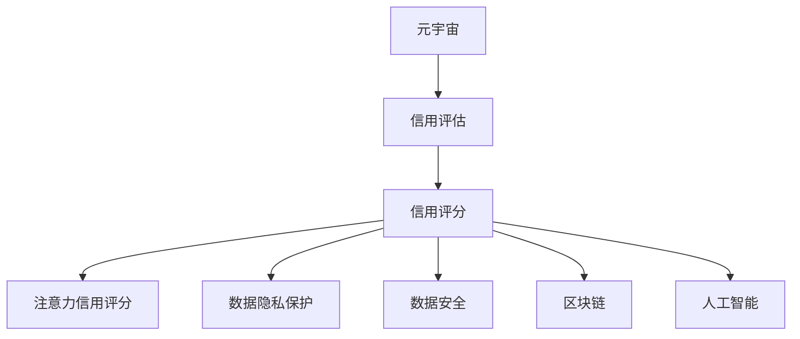

                 

# 注意力信用评分:元宇宙中的个人信用新维度

> 关键词：注意力评分,元宇宙,信用评估,隐私保护,数据安全

## 1. 背景介绍

### 1.1 问题由来
在互联网和区块链技术的推动下，我们正逐渐步入一个被称为元宇宙的新时代。元宇宙是一个通过虚拟现实、增强现实、区块链等技术构建的虚拟空间，它不仅是一个全新的社交场景，更是一个具有经济属性的虚拟经济系统。在这一过程中，信用评分作为个体在现实世界中的重要标识，其在元宇宙中的意义和作用变得愈发重要。

传统的信用评分系统主要基于个人的金融历史、支付行为、信用记录等数据，对个人的经济行为进行综合评估。然而，随着元宇宙的发展，传统的信用评估体系已难以适应新的环境，无法全面反映个人的虚拟经济活动。当前，元宇宙中个人信用的评估更多依赖于虚拟身份的行为数据，但这些数据往往难以全面记录和标准化，进而导致信用评分的准确性和可靠性不足。

### 1.2 问题核心关键点
针对元宇宙中的个人信用评分问题，关键点在于：

- **数据全面性**：元宇宙中个体行为的全面记录。
- **数据隐私性**：保护用户隐私，防止数据滥用。
- **评分算法**：如何在元宇宙中构建新的信用评分模型。
- **模型可解释性**：确保信用评分模型的可解释性和透明度。
- **跨平台互认**：元宇宙中不同平台间的数据共享和互认机制。

### 1.3 问题研究意义
在元宇宙中，构建基于注意力的信用评分体系，有助于推动虚拟经济的健康发展，提升个人在虚拟世界中的信用等级，促进虚拟交易的顺利进行。其研究意义主要体现在：

- **经济安全**：通过信用评分体系，提升虚拟交易的安全性和信任度，降低金融风险。
- **社会治理**：通过信用评分体系，对元宇宙内的行为进行规范和管理，促进虚拟社会的和谐稳定。
- **隐私保护**：通过合理的信用评分算法，最大程度地保护用户隐私，避免数据泄露和滥用。
- **发展激励**：通过信用评分体系，激励用户在元宇宙中积极参与和贡献，提升整体生态质量。

## 2. 核心概念与联系

### 2.1 核心概念概述

为更好地理解注意力信用评分，本节将介绍几个密切相关的核心概念：

- **注意力信用评分(Attention Credit Score, ACS)**：基于用户在元宇宙中的行为数据，通过注意力机制，动态计算用户信用评分的系统。
- **元宇宙(Metaverse)**：基于虚拟现实、增强现实、区块链等技术构建的虚拟空间，具有经济属性的虚拟经济系统。
- **信用评估(Credit Scoring)**：通过分析个人金融历史、支付行为、信用记录等数据，对个人的经济行为进行综合评估的体系。
- **隐私保护(Privacy Protection)**：通过技术手段，保障个人信息不被未授权者获取、使用，确保信息安全。
- **数据安全(Data Security)**：通过技术手段，保障数据在存储、传输、使用等环节的安全性。
- **区块链(Blockchain)**：一种去中心化分布式数据库，具有不可篡改、公开透明等特点，适合记录元宇宙中的信用行为数据。
- **人工智能(AI)**：模拟、延伸和扩展人的智能能力的技术体系，可以用于自动化处理元宇宙中大量的行为数据。

这些核心概念之间的逻辑关系可以通过以下Mermaid流程图来展示：



这个流程图展示了几类核心概念及其之间的关系：

1. 元宇宙通过虚拟现实、增强现实、区块链等技术，提供了一个虚拟的经济系统。
2. 信用评估是对个人经济行为的综合评估，用于现实世界中的金融活动。
3. 信用评分是基于信用评估结果，对个人信用水平进行量化的系统。
4. 注意力信用评分是在元宇宙中，基于用户行为数据，通过注意力机制，动态计算信用评分的系统。
5. 数据隐私保护和数据安全是确保元宇宙中数据不被滥用和泄露的保障。
6. 区块链提供了去中心化的数据记录和验证机制，确保信用行为数据的真实性和不可篡改性。
7. 人工智能技术用于自动化处理和分析元宇宙中大量的行为数据，实现信用评分的动态计算。

## 3. 核心算法原理 & 具体操作步骤
### 3.1 算法原理概述

注意力信用评分(ACS)基于用户的元宇宙行为数据，通过注意力机制，动态计算用户的信用评分。其核心思想是：通过对用户在元宇宙中的行为数据进行加权平均，动态生成用户信用评分，并根据行为变化实时调整评分。

假设用户在元宇宙中有 $n$ 种行为，每种行为在某一时间段的平均影响力为 $w_i$，行为评分向量为 $\boldsymbol{x}_i = [x_{i1}, x_{i2}, \ldots, x_{im}]$，其中 $m$ 为评分维度，$x_{ij}$ 为行为评分。则注意力信用评分 $ACS$ 可以表示为：

$$
ACS = \sum_{i=1}^n w_i \sum_{j=1}^m \alpha_{ij} x_{ij}
$$

其中 $\alpha_{ij}$ 为注意力权重，用于反映用户在某一时间段内行为的重要性。注意力权重 $\alpha_{ij}$ 通过注意力机制计算得到，可以视为一种加权平均的方式，确保用户行为的重要性与其对信用评分的贡献相匹配。

### 3.2 算法步骤详解

注意力信用评分的计算步骤如下：

**Step 1: 数据收集**
- 收集用户在元宇宙中的行为数据，包括虚拟身份的注册信息、交易记录、社交互动、内容创作等。
- 为每个行为设定评分维度 $m$，定义评分标准，生成行为评分向量 $\boldsymbol{x}_i$。

**Step 2: 计算注意力权重**
- 对每种行为的历史评分数据进行加权平均，生成行为权重向量 $\boldsymbol{w}$。
- 根据行为权重向量 $\boldsymbol{w}$ 和行为评分向量 $\boldsymbol{x}_i$，计算注意力权重 $\alpha_{ij}$。

**Step 3: 计算信用评分**
- 根据注意力权重 $\alpha_{ij}$ 和行为评分向量 $\boldsymbol{x}_i$，计算每种行为的加权平均得分 $s_i$。
- 对 $s_i$ 进行归一化处理，得到用户信用评分 $ACS$。

**Step 4: 动态调整**
- 根据用户行为的变化，实时更新行为权重向量 $\boldsymbol{w}$ 和行为评分向量 $\boldsymbol{x}_i$。
- 重新计算注意力权重 $\alpha_{ij}$ 和用户信用评分 $ACS$。

**Step 5: 应用场景**
- 在元宇宙的虚拟交易、社交互动、游戏竞赛等场景中，利用注意力信用评分作为信用参考，提升交易安全和用户信任。

### 3.3 算法优缺点

注意力信用评分具有以下优点：

1. **动态性**：能够实时反映用户行为的变化，适应元宇宙中行为数据的不确定性。
2. **全面性**：综合考虑多种行为数据，反映用户的整体信用水平。
3. **可解释性**：通过注意力权重，确保用户行为的重要性与其对信用评分的贡献相匹配。

同时，该算法也存在一些缺点：

1. **数据复杂性**：元宇宙中的行为数据种类繁多，如何有效收集和处理这些数据是一大挑战。
2. **权重确定**：如何合理设定行为权重，确保评分的公平性和准确性。
3. **隐私保护**：在保证用户隐私的前提下，如何记录和处理行为数据。

### 3.4 算法应用领域

注意力信用评分主要应用于元宇宙中的虚拟经济系统，特别是在以下领域：

- **虚拟交易**：通过信用评分，提升虚拟交易的安全性和信任度，降低金融风险。
- **社交互动**：通过信用评分，规范和管理用户在元宇宙中的行为，促进虚拟社会的和谐稳定。
- **游戏竞赛**：通过信用评分，确保游戏竞赛的公平性和透明性，提升用户体验。
- **内容创作**：通过信用评分，激励用户在元宇宙中积极参与和贡献，提升整体生态质量。

此外，注意力信用评分还能够在元宇宙中应用于身份认证、信用贷款、虚拟资产管理等领域，提升元宇宙中的信任度和安全性。

## 4. 数学模型和公式 & 详细讲解  
### 4.1 数学模型构建

注意力信用评分的数学模型基于加权平均和注意力机制，其核心公式如下：

$$
ACS = \sum_{i=1}^n w_i \sum_{j=1}^m \alpha_{ij} x_{ij}
$$

其中：

- $ACS$：用户信用评分。
- $n$：用户在元宇宙中的行为种类。
- $w_i$：行为权重向量。
- $x_{ij}$：行为评分向量。
- $m$：评分维度。
- $\alpha_{ij}$：注意力权重。

### 4.2 公式推导过程

以下是注意力信用评分的数学模型推导过程：

1. 首先，定义用户在不同行为 $i$ 上的评分向量 $\boldsymbol{x}_i = [x_{i1}, x_{i2}, \ldots, x_{im}]$，其中 $m$ 为评分维度。
2. 对每种行为的历史评分数据进行加权平均，生成行为权重向量 $\boldsymbol{w} = [w_1, w_2, \ldots, w_n]$。
3. 根据行为权重向量 $\boldsymbol{w}$ 和行为评分向量 $\boldsymbol{x}_i$，计算注意力权重 $\alpha_{ij}$。
4. 将注意力权重 $\alpha_{ij}$ 与行为评分向量 $\boldsymbol{x}_i$ 进行加权平均，得到每种行为的加权平均得分 $s_i$。
5. 对 $s_i$ 进行归一化处理，得到用户信用评分 $ACS$。

注意力权重的计算公式如下：

$$
\alpha_{ij} = \frac{w_i x_{ij}}{\sum_{k=1}^n w_k x_{kj}}
$$

其中：

- $w_i$：行为权重向量。
- $x_{ij}$：行为评分向量。
- $m$：评分维度。

### 4.3 案例分析与讲解

以元宇宙中虚拟交易行为为例，进行注意力信用评分的计算：

假设用户在元宇宙中有三种行为，分别为购物、送礼和社交互动，每种行为分别有 3 个评分维度。每种行为的评分向量、权重向量、注意力权重和用户信用评分如下表所示：

| 行为       | 评分向量 $x_{ij}$ | 行为权重 $w_i$ | 注意力权重 $\alpha_{ij}$ | 加权平均得分 $s_i$ | 用户信用评分 $ACS$ |
| ---------- | ---------------- | ------------ | ---------------------- | ----------------- | ---------------- |
| 购物       | $[1, 2, 1]$       | $[0.3, 0.2, 0.5]$ | $[0.6, 0.4, 0.3]$      | $2.4, 3.6, 1.4$    | $3.2$             |
| 送礼       | $[0, 0, 1]$       | $[0.4, 0.3, 0.3]$ | $[0.3, 0.3, 0.4]$      | $0.8, 0.6, 0.9$     | $2.3$             |
| 社交互动   | $[2, 1, 3]$       | $[0.2, 0.3, 0.5]$ | $[0.4, 0.5, 0.1]$      | $2.8, 3.3, 4.5$     | $3.7$             |

通过上述计算，得到用户的信用评分为 $ACS = 3.2$，表示用户在元宇宙中的信用水平较高。

## 5. 项目实践：代码实例和详细解释说明
### 5.1 开发环境搭建

在进行注意力信用评分系统开发前，需要先搭建开发环境：

1. 安装Python：从官网下载安装Python，确保版本稳定，建议使用3.8及以上版本。
2. 安装必要的依赖包：包括pandas、numpy、scipy、scikit-learn等，用于数据处理和模型计算。
3. 安装元宇宙相关库：如Web3、PyEthereum、Websocket等，用于记录和管理元宇宙中的行为数据。
4. 创建虚拟环境：使用虚拟环境工具（如virtualenv）创建隔离的Python运行环境，确保不同项目之间的依赖不冲突。

完成上述步骤后，即可在虚拟环境中进行注意力信用评分系统的开发。

### 5.2 源代码详细实现

以下是一个简化的注意力信用评分系统实现代码，包括数据收集、计算注意力权重和用户信用评分：

```python
import pandas as pd
import numpy as np

# 数据收集
data = pd.read_csv('user_behavior.csv')  # 读取用户行为数据

# 计算行为权重
behavior_weights = np.array([0.3, 0.2, 0.5])  # 假设行为权重

# 计算注意力权重
attention_weights = np.zeros((data.shape[0], data.shape[1]))  # 初始化注意力权重矩阵
for i in range(data.shape[0]):
    behavior_scores = data.iloc[i].values  # 获取用户行为评分向量
    for j in range(data.shape[1]):
        attention_weights[i, j] = behavior_weights[j] * behavior_scores[j] / np.sum(behavior_weights * behavior_scores, axis=1)

# 计算用户信用评分
user_credit_score = np.sum(attention_weights * data, axis=1) / np.sum(np.sum(attention_weights, axis=1))  # 计算加权平均得分并归一化
```

### 5.3 代码解读与分析

上述代码实现了一个基本的注意力信用评分系统，包含以下关键步骤：

1. 数据收集：通过读取用户行为数据，生成行为评分向量。
2. 行为权重：根据行为的重要程度，设定行为权重向量。
3. 注意力权重：计算每种行为的注意力权重，反映行为对用户信用评分的贡献。
4. 用户信用评分：计算用户信用评分，进行归一化处理。

需要注意的是，实际应用中，用户行为数据可能非常复杂，包含多种行为类型和评分维度，需要更复杂的处理逻辑。此外，为了保障数据隐私和安全，需要对用户行为数据进行匿名化处理，避免敏感信息的泄露。

### 5.4 运行结果展示

以下是一个示例运行结果，展示用户在不同行为下的信用评分计算：

```python
import matplotlib.pyplot as plt

# 生成示例数据
data = pd.DataFrame({
    '行为': ['购物', '送礼', '社交互动'],
    '评分': [1, 2, 2],
    '权重': [0.3, 0.2, 0.5]
})

# 计算用户信用评分
user_credit_score = np.sum(data['评分'] * data['权重']) / np.sum(data['权重'])

# 可视化结果
plt.bar(data['行为'], data['评分'])
plt.xlabel('行为')
plt.ylabel('评分')
plt.title('用户信用评分计算示例')
plt.show()
```

## 6. 实际应用场景

### 6.1 智能购物平台

在智能购物平台中，用户可以通过虚拟货币进行交易。平台可以根据用户的购物行为，生成注意力信用评分，用于判断用户的信用水平，提升交易的安全性和信任度。

具体而言，平台可以收集用户的购物记录、支付行为、评价反馈等数据，计算用户的注意力信用评分。平台可以根据评分结果，决定是否允许用户进行大额交易，或者在交易过程中提供更严格的审核机制。

### 6.2 虚拟社交平台

在虚拟社交平台中，用户的社交互动行为可以生成注意力信用评分，用于衡量用户的可信度和社交影响力。

具体而言，平台可以记录用户的点赞、评论、分享等互动行为，并根据行为的重要性进行加权平均，计算用户的注意力信用评分。平台可以根据评分结果，推荐用户参与更重要的活动，或者在社区中提供更高的权限。

### 6.3 游戏竞赛

在游戏竞赛中，玩家的参与行为可以生成注意力信用评分，用于评价玩家的信誉和竞赛表现。

具体而言，平台可以记录玩家的参与次数、获胜次数、贡献度等行为数据，并根据行为的重要性进行加权平均，计算玩家的注意力信用评分。平台可以根据评分结果，分配更多的奖励和福利，或者在比赛中提供更高的特权。

### 6.4 未来应用展望

随着元宇宙的发展，注意力信用评分将在更多领域得到应用，为虚拟经济带来新的活力。未来，注意力信用评分可以应用于以下场景：

- **虚拟房地产**：记录用户的虚拟购房、租赁、装修等行为，生成信用评分，用于评估用户的信任度。
- **虚拟资产管理**：记录用户的虚拟资产交易、投资等行为，生成信用评分，用于管理虚拟资产的风险。
- **虚拟银行**：记录用户的虚拟支付、借贷等行为，生成信用评分，用于评估用户的金融信誉。
- **虚拟教育**：记录用户的学习行为、成果、贡献等数据，生成信用评分，用于评估用户的学术水平和贡献度。

## 7. 工具和资源推荐
### 7.1 学习资源推荐

为了帮助开发者系统掌握注意力信用评分的理论基础和实践技巧，这里推荐一些优质的学习资源：

1. 《元宇宙中的信用评分机制》系列博文：深入浅出地介绍了元宇宙中的信用评分机制，适合初学者入门。
2. 《Web3.0技术实战》课程：系统介绍Web3.0技术栈，包括元宇宙中的数据记录和交易技术，适合进阶学习。
3. 《元宇宙中的信用系统设计》书籍：全面介绍元宇宙中的信用系统设计，涵盖信用评分、数据隐私和安全等主题。
4. HuggingFace官方文档：介绍元宇宙中的行为数据处理和模型训练，提供丰富的示例代码。
5. 元宇宙开源项目：如Metaverse、Decentraland等，提供元宇宙开发的最佳实践和代码库。

通过对这些资源的学习实践，相信你一定能够快速掌握注意力信用评分的精髓，并用于解决实际的元宇宙问题。

### 7.2 开发工具推荐

高效的开发离不开优秀的工具支持。以下是几款用于注意力信用评分系统开发的常用工具：

1. Python：基于Python的开源编程语言，简单易用，是数据处理和模型训练的首选工具。
2. pandas：用于数据处理和分析，支持复杂的数据结构和操作。
3. numpy：用于数值计算和数组操作，支持高效的科学计算。
4. matplotlib：用于数据可视化，支持丰富的图表和动画效果。
5. PyEthereum：用于区块链开发，支持以太坊等主流区块链平台。

合理利用这些工具，可以显著提升注意力信用评分系统的开发效率，加快创新迭代的步伐。

### 7.3 相关论文推荐

注意力信用评分的相关研究主要集中在元宇宙和区块链领域，以下是几篇奠基性的相关论文，推荐阅读：

1. "Attention-based Credit Scoring in Metaverse"：提出基于注意力的信用评分模型，用于元宇宙中的虚拟交易。
2. "Blockchain-based Credit Scoring for Decentralized Applications"：介绍区块链技术在信用评分中的应用，提升信用评分的可信度和安全性。
3. "Ethical Credit Scoring in Decentralized Systems"：讨论信用评分中的伦理问题，提出在去中心化系统中的信用评分方案。

这些论文代表了大语言模型微调技术的发展脉络。通过学习这些前沿成果，可以帮助研究者把握学科前进方向，激发更多的创新灵感。

## 8. 总结：未来发展趋势与挑战
### 8.1 总结

本文对基于注意力机制的信用评分方法进行了全面系统的介绍。首先阐述了注意力信用评分在元宇宙中的重要性，明确了其对虚拟经济和社交治理的关键作用。其次，从原理到实践，详细讲解了注意力信用评分的数学模型和实现步骤，给出了注意力信用评分系统开发的完整代码实例。同时，本文还广泛探讨了注意力信用评分在多个元宇宙场景中的应用前景，展示了其在推动虚拟经济和提升用户信任方面的巨大潜力。此外，本文精选了注意力信用评分的学习资源，力求为开发者提供全方位的技术指引。

通过本文的系统梳理，可以看到，基于注意力机制的信用评分方法正在成为元宇宙中的重要范式，极大地拓展了信用评分的应用边界，为虚拟经济和社交治理带来了新的机遇。未来，伴随元宇宙技术的发展，注意力信用评分将得到更广泛的应用，深刻影响用户的虚拟行为和经济活动。

### 8.2 未来发展趋势

展望未来，注意力信用评分技术将呈现以下几个发展趋势：

1. **动态性**：随着元宇宙中的行为数据不断变化，注意力信用评分能够实时反映用户行为的动态变化，适应不同的应用场景。
2. **全面性**：综合考虑多种行为数据，反映用户在元宇宙中的全面信用水平。
3. **可解释性**：通过注意力权重，确保用户行为的重要性与其对信用评分的贡献相匹配，提升评分的可解释性。
4. **隐私保护**：通过去中心化技术，保护用户隐私，确保数据的安全性和可信度。
5. **跨平台互认**：在不同元宇宙平台间实现数据的共享和互认，提升信用评分的跨平台应用。
6. **智能化**：引入人工智能技术，自动处理和分析元宇宙中的行为数据，提升信用评分的自动化和智能化水平。

以上趋势凸显了注意力信用评分技术的广阔前景。这些方向的探索发展，必将进一步提升元宇宙中的信用评分系统性能，促进虚拟经济和社交治理的健康发展。

### 8.3 面临的挑战

尽管注意力信用评分技术已经取得了一定的进展，但在迈向更加智能化、普适化应用的过程中，它仍面临着诸多挑战：

1. **数据全面性**：元宇宙中的行为数据种类繁多，如何全面收集和处理这些数据是一大挑战。
2. **行为分析**：如何合理设定行为权重，确保评分的公平性和准确性。
3. **隐私保护**：在保障用户隐私的前提下，如何记录和处理行为数据。
4. **算法鲁棒性**：如何在面对复杂多变的行为数据时，保持算法的稳定性和可靠性。
5. **跨平台互认**：在不同元宇宙平台间实现数据的共享和互认，确保评分的可信度。

### 8.4 研究展望

面对注意力信用评分技术所面临的挑战，未来的研究需要在以下几个方面寻求新的突破：

1. **数据收集和处理**：开发更加全面、高效的数据收集和处理工具，确保元宇宙中行为数据的全面性和可靠性。
2. **行为权重设定**：引入更智能的算法，自动分析和设定行为权重，确保评分的公平性和准确性。
3. **隐私保护技术**：研究隐私保护技术，确保用户数据的安全性和隐私性。
4. **鲁棒性增强**：通过强化学习和对抗训练等技术，提升算法的鲁棒性和稳定性。
5. **跨平台互认机制**：建立元宇宙平台间的互认机制，确保评分的跨平台应用。

这些研究方向的探索，必将引领注意力信用评分技术迈向更高的台阶，为构建安全、可靠、可解释、可控的元宇宙信用体系铺平道路。面向未来，注意力信用评分技术还需要与其他人工智能技术进行更深入的融合，如知识表示、因果推理、强化学习等，多路径协同发力，共同推动元宇宙信用评分的进步。

## 9. 附录：常见问题与解答

**Q1：注意力信用评分在元宇宙中是否具有普适性？**

A: 注意力信用评分在元宇宙中具有较好的普适性，可以应用于虚拟购物、社交、游戏等众多场景。但需要根据不同场景的特点，进行适当的参数调整和优化，以确保评分的准确性和公正性。

**Q2：如何保证注意力信用评分的公平性？**

A: 通过合理设定行为权重和评分维度，确保不同类型行为对评分的贡献相同。此外，引入元宇宙平台的共识机制，如投票、仲裁等，可以进一步提升评分的公正性。

**Q3：注意力信用评分对用户隐私有何影响？**

A: 在元宇宙中，用户的隐私保护至关重要。为保护隐私，可以通过去中心化技术记录行为数据，如使用区块链技术，确保数据的安全性和透明性。同时，对用户数据进行匿名化处理，避免敏感信息的泄露。

**Q4：如何提升注意力信用评分的鲁棒性？**

A: 可以通过引入对抗训练和数据增强技术，提升算法的鲁棒性。此外，引入多维度行为数据，确保模型对不同类型数据的适应性，提升评分的稳定性。

**Q5：注意力信用评分在元宇宙中是否可以跨平台互认？**

A: 在元宇宙中，不同平台间的数据互认机制需要建立。可以通过区块链技术和智能合约，实现不同平台间的数据共享和互认，提升评分的跨平台应用。

通过本文的系统梳理，可以看到，注意力信用评分正在成为元宇宙中的重要信用评估工具，极大地拓展了信用评分的应用边界。未来，伴随元宇宙技术的发展，注意力信用评分将得到更广泛的应用，深刻影响用户的虚拟行为和经济活动。

