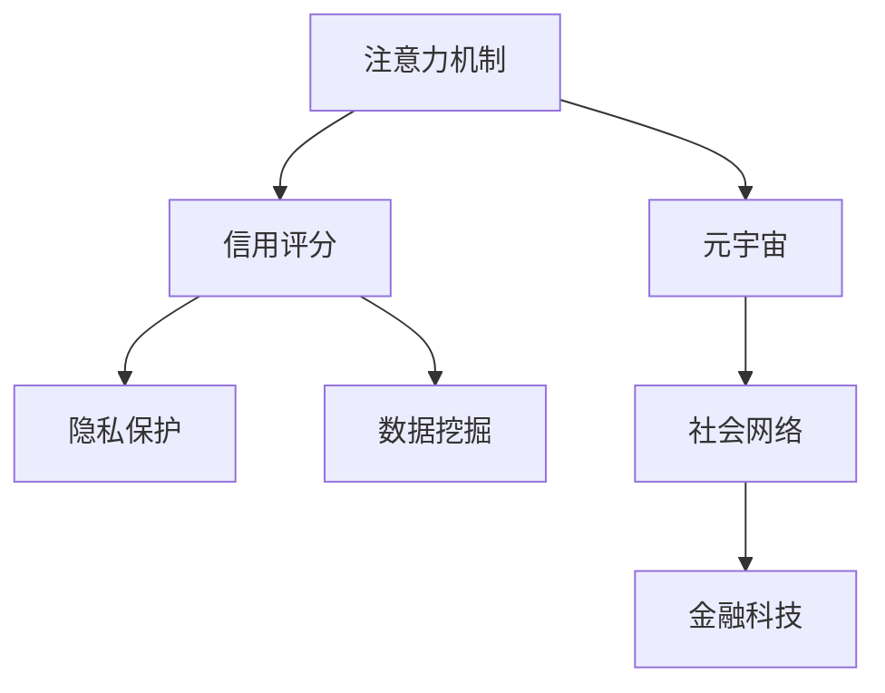

                 

# 注意力信用评分算法:元宇宙中的个人信用计算模型

> 关键词：注意力机制,信用评分,元宇宙,隐私保护,社会网络,数据挖掘,金融科技

## 1. 背景介绍

### 1.1 问题由来

随着技术的飞速发展，元宇宙(Utopia)的构想已初现雏形。在虚拟世界中，数字身份和数字资产的交互成为可能，这也催生了对个人信用计算的需求。在现实世界中，个人信用是通过长期积累的行为数据进行计算的。但在元宇宙中，个人行为数据更加复杂和多样化，如虚拟货币交易、数字身份互动、游戏内行为等。传统的信用评分模型难以满足这些需求，因此需要新的计算方法。

### 1.2 问题核心关键点

元宇宙中个人信用计算的核心问题包括以下几点：

- 如何收集和处理元宇宙中的数据？
- 如何设计信用评分模型，使其能够适应元宇宙的多样化场景？
- 如何保护用户隐私，防止数据滥用？
- 如何保证信用评分的公平性和公正性？

这些问题需要在构建信用评分模型时予以充分考虑，确保模型的实用性和安全性。

## 2. 核心概念与联系

### 2.1 核心概念概述

为更好地理解注意力信用评分算法，本节将介绍几个密切相关的核心概念：

- **注意力机制(Attention Mechanism)**：一种用于提取重要特征的机器学习技术，通过关注特定输入部分来增强模型的学习能力。

- **信用评分(Credit Scoring)**：一种通过历史行为数据计算个人信用的技术，常用于金融信贷决策。

- **元宇宙(Metaverse)**：由数字身份和数字资产构成的虚拟世界，具有高度的自治和可扩展性。

- **隐私保护(Privacy Protection)**：保护用户数据不被滥用或泄露的技术手段，如数据脱敏、联邦学习等。

- **社会网络(Social Network)**：由个人和组织组成的网络，可以通过社交关系进行分析，如社交网络分析。

- **数据挖掘(Data Mining)**：从大量数据中提取有价值信息的过程，常用于信用评分和推荐系统。

- **金融科技(Fintech)**：利用金融与科技手段实现创新，如区块链、智能合约等。

这些概念之间的逻辑关系可以通过以下Mermaid流程图来展示：



这个流程图展示了几者之间的联系：注意力机制作为关键技术，可用于增强信用评分模型的学习效果；元宇宙提供了一种全新的数据来源，需要通过隐私保护技术保护数据安全；社会网络分析可以用于信用评分中的社交行为建模；数据挖掘技术则用于挖掘元宇宙中的行为模式；金融科技可以用于元宇宙中的交易和金融决策。

## 3. 核心算法原理 & 具体操作步骤

### 3.1 算法原理概述

注意力信用评分算法基于注意力机制，通过对用户行为进行加权处理，计算出综合信用评分。该算法分为以下几个关键步骤：

1. **数据收集**：收集元宇宙中用户的交易记录、社交互动、行为数据等。
2. **特征提取**：将数据转化为模型可处理的特征向量。
3. **注意力加权**：使用注意力机制对特征向量进行加权处理。
4. **信用评分计算**：通过加权特征向量计算信用评分。
5. **结果输出**：输出用户的信用评分结果，用于信贷决策。

### 3.2 算法步骤详解

1. **数据收集**：
   - 收集用户行为数据，如虚拟货币交易记录、社交网络互动记录等。
   - 数据源可能包括游戏平台、数字资产交易平台、社交网络等。

2. **特征提取**：
   - 对数据进行预处理，如数据清洗、缺失值处理等。
   - 将数据转化为特征向量，如将交易记录转化为交易金额、时间戳、交易对象等。
   - 使用技术如TF-IDF、Word2Vec等提取特征向量。

3. **注意力加权**：
   - 使用注意力机制对特征向量进行加权处理，重点关注重要特征。
   - 设计注意力机制，如多头注意力机制、时间注意力机制等。
   - 对每个特征向量的注意力权重进行计算，形成加权特征向量。

4. **信用评分计算**：
   - 将加权特征向量输入信用评分模型，如线性回归、逻辑回归等。
   - 训练模型，使用历史数据进行拟合，得到信用评分公式。
   - 将新用户的特征向量输入模型，计算信用评分。

5. **结果输出**：
   - 根据信用评分结果，决定是否批准贷款、授信额度等。
   - 对高风险用户进行风险控制，如限制交易、增加监控等。
   - 定期更新模型，重新计算信用评分，保持模型时效性。

### 3.3 算法优缺点

注意力信用评分算法的优点包括：

- **灵活性**：通过注意力机制，算法可以适应元宇宙中的多样化场景，处理复杂的行为数据。
- **泛化能力**：使用历史数据进行训练，可以在新用户身上实现较好的泛化。
- **鲁棒性**：通过加权处理，算法能够抑制噪声数据的影响，提高模型稳定性。

其缺点包括：

- **计算复杂度**：注意力机制计算复杂，对计算资源要求较高。
- **隐私风险**：元宇宙中的数据可能涉及隐私问题，需注意数据保护。
- **模型偏见**：算法可能存在模型偏见，需进行公平性校验。

### 3.4 算法应用领域

注意力信用评分算法主要应用于以下几个领域：

1. **金融信贷**：在元宇宙中，用户可以通过虚拟资产进行交易，信用评分可用于评估其借贷能力。
2. **数字身份认证**：通过分析用户的社交互动和行为数据，构建数字身份，用于身份认证和权限管理。
3. **游戏内行为管理**：游戏内行为数据可以用于评估用户信誉，进行行为管理。
4. **数字资产交易**：数字资产交易平台可以使用信用评分，决定是否允许用户交易。
5. **社交网络治理**：通过信用评分，平台可以对恶意用户进行治理，维护网络环境。

## 4. 数学模型和公式 & 详细讲解 & 举例说明

### 4.1 数学模型构建

设用户 $u$ 的行为数据为 $X_u = (x_{u1}, x_{u2}, ..., x_{un})$，其中 $x_{ui}$ 为第 $i$ 个行为特征。定义注意力机制的权重向量 $\alpha_u = (\alpha_{ui1}, \alpha_{ui2}, ..., \alpha_{uin})$。则加权特征向量 $Y_u$ 为：

$$
Y_u = \sum_{i=1}^n \alpha_{ui} x_{ui}
$$

定义信用评分的线性回归模型为：

$$
\hat{y_u} = \beta_0 + \sum_{i=1}^n \beta_i x_{ui}
$$

其中 $\beta_0, \beta_1, ..., \beta_n$ 为模型参数。

### 4.2 公式推导过程

假设用户 $u$ 的历史行为数据为 $(x_{u1}, x_{u2}, ..., x_{un})$，且每个行为特征 $x_{ui}$ 的权重为 $\alpha_{ui}$。则加权特征向量 $Y_u$ 可以表示为：

$$
Y_u = \sum_{i=1}^n \alpha_{ui} x_{ui}
$$

假设信用评分模型为线性回归模型，即：

$$
\hat{y_u} = \beta_0 + \sum_{i=1}^n \beta_i x_{ui}
$$

其中 $\beta_0, \beta_1, ..., \beta_n$ 为模型参数。

将加权特征向量 $Y_u$ 代入信用评分模型中，得到：

$$
\hat{y_u} = \beta_0 + \sum_{i=1}^n \beta_i (\sum_{i=1}^n \alpha_{ui} x_{ui}) = \sum_{i=1}^n \beta_i \alpha_{ui} x_{ui} + \beta_0
$$

可以看到，模型参数 $\beta_i$ 和 $\alpha_{ui}$ 共同决定了信用评分 $\hat{y_u}$。

### 4.3 案例分析与讲解

假设某用户 $u$ 有如下交易记录：

- 交易金额：$100, 200, 300$
- 交易时间：$2021-01-01, 2021-01-02, 2021-01-03$
- 交易对象：$A, B, C$

使用注意力机制进行加权处理，假设注意力权重为：

- $\alpha_{u1} = 0.3$
- $\alpha_{u2} = 0.4$
- $\alpha_{u3} = 0.3$

则加权特征向量 $Y_u$ 为：

$$
Y_u = \alpha_{u1} \times 100 + \alpha_{u2} \times 200 + \alpha_{u3} \times 300 = 310
$$

假设信用评分模型为线性回归模型，且模型参数为：

- $\beta_0 = 0.1$
- $\beta_1 = 0.2$
- $\beta_2 = 0.3$
- $\beta_3 = 0.4$

则用户 $u$ 的信用评分为：

$$
\hat{y_u} = \beta_0 + \beta_1 Y_u = 0.1 + 0.2 \times 310 = 62
$$

## 5. 项目实践：代码实例和详细解释说明

### 5.1 开发环境搭建

在进行信用评分实践前，我们需要准备好开发环境。以下是使用Python进行TensorFlow开发的环境配置流程：

1. 安装Anaconda：从官网下载并安装Anaconda，用于创建独立的Python环境。

2. 创建并激活虚拟环境：
```bash
conda create -n attention-scoring python=3.8 
conda activate attention-scoring
```

3. 安装TensorFlow：根据CUDA版本，从官网获取对应的安装命令。例如：
```bash
conda install tensorflow-gpu -c tf -c conda-forge
```

4. 安装各类工具包：
```bash
pip install numpy pandas scikit-learn matplotlib tqdm jupyter notebook ipython
```

完成上述步骤后，即可在`attention-scoring`环境中开始信用评分实践。

### 5.2 源代码详细实现

这里我们以交易数据为例，给出使用TensorFlow进行信用评分的PyTorch代码实现。

首先，定义数据处理函数：

```python
import tensorflow as tf
from tensorflow.keras import layers

def prepare_data(data):
    data = data.apply(lambda x: x if x is not None else 0)
    return data
```

然后，定义模型和损失函数：

```python
from tensorflow.keras.models import Sequential
from tensorflow.keras.layers import Dense, Dropout, Attention

model = Sequential()
model.add(Attention(layers.Dense(32, activation='relu')))
model.add(Dense(1))

loss = tf.keras.losses.MeanSquaredError()
```

接着，定义训练和评估函数：

```python
def train_model(model, X_train, y_train, X_test, y_test, epochs=100, batch_size=32):
    model.compile(optimizer='adam', loss=loss)
    history = model.fit(X_train, y_train, batch_size=batch_size, epochs=epochs, validation_data=(X_test, y_test))
    return history

def evaluate_model(model, X_test, y_test):
    loss = model.evaluate(X_test, y_test)
    return loss
```

最后，启动训练流程并在测试集上评估：

```python
X_train = prepare_data(train_data)
X_test = prepare_data(test_data)
y_train = train_data['label']
y_test = test_data['label']

history = train_model(model, X_train, y_train, X_test, y_test)

print('Test Loss:', evaluate_model(model, X_test, y_test))
```

以上就是使用TensorFlow进行信用评分任务开发的完整代码实现。可以看到，TensorFlow提供了丰富的工具包和函数，使得模型的构建和训练变得简单易行。

### 5.3 代码解读与分析

让我们再详细解读一下关键代码的实现细节：

**prepare_data函数**：
- 对缺失值进行处理，将缺失值置为0。
- 函数简单但实用，可用于处理任意数据集的缺失值问题。

**Attention层**：
- 使用TensorFlow自带的Attention层，对特征向量进行加权处理。
- 该层自动生成注意力权重向量，无需手动计算。

**模型编译**：
- 使用Adam优化器，损失函数为均方误差。
- 在训练过程中，通过学习率逐步调整权重，最小化损失函数。

**模型训练**：
- 在训练集上进行模型拟合，记录训练过程中的损失变化。
- 通过epoch和batch_size控制训练过程，防止过拟合。
- 在验证集上评估模型性能，决定是否停止训练。

**模型评估**：
- 在测试集上评估模型性能，计算损失值。
- 通过均方误差来评估模型预测的准确性。

**训练流程**：
- 准备数据集，进行特征处理。
- 构建模型，并进行编译。
- 在训练集上进行模型拟合。
- 在验证集上进行性能评估。
- 输出测试集上的损失值，判断模型效果。

可以看到，TensorFlow提供了强大的工具和函数，使得信用评分模型的开发和训练变得高效简洁。开发者可以将更多精力放在特征工程和模型优化上，而不必过多关注底层的实现细节。

当然，工业级的系统实现还需考虑更多因素，如模型的保存和部署、超参数的自动搜索、更灵活的注意力机制等。但核心的信用评分范式基本与此类似。

## 6. 实际应用场景

### 6.1 数字资产交易平台

数字资产交易平台可以使用信用评分模型评估用户信誉，决定是否允许用户交易。通过分析用户的行为数据和社交互动，可以构建综合信用评分，帮助平台进行风险控制。

### 6.2 虚拟银行

虚拟银行可以使用信用评分模型评估用户信用，决定是否批准贷款或授信额度。通过分析用户的虚拟资产交易和社交互动，可以构建综合信用评分，帮助银行进行信贷决策。

### 6.3 游戏内行为管理

游戏内行为数据可以用于评估用户信誉，进行行为管理。通过分析用户的虚拟货币交易和社交互动，可以构建综合信用评分，帮助游戏平台进行行为管理。

### 6.4 未来应用展望

随着信用评分模型的不断发展，在元宇宙中的应用前景将更加广阔。未来，信用评分模型将在以下几个领域得到更广泛的应用：

1. **数字身份认证**：通过信用评分模型构建数字身份，用于身份认证和权限管理。
2. **社交网络治理**：通过信用评分模型维护网络环境，对恶意用户进行治理。
3. **智能合约**：通过信用评分模型，智能合约可以自动执行复杂金融行为，提高金融效率。
4. **供应链金融**：通过信用评分模型，金融科技公司可以提供供应链融资服务，提升供应链管理水平。
5. **跨链交易**：通过信用评分模型，跨链交易平台可以评估用户信誉，进行风险控制。

这些应用场景将进一步推动元宇宙的发展，提高虚拟世界中的交易和管理效率。

## 7. 工具和资源推荐

### 7.1 学习资源推荐

为了帮助开发者系统掌握信用评分理论基础和实践技巧，这里推荐一些优质的学习资源：

1. **《深度学习》书籍**：深入浅出地介绍了深度学习的基本概念和应用场景，适合初学者入门。

2. **TensorFlow官方文档**：TensorFlow的官方文档，提供了丰富的教程和示例，是学习TensorFlow的好资源。

3. **Coursera《机器学习》课程**：由斯坦福大学Andrew Ng教授主讲，全面介绍机器学习的基本原理和算法。

4. **Kaggle机器学习竞赛**：通过参加Kaggle的机器学习竞赛，可以实际动手练习信用评分等任务，提升实战能力。

5. **HuggingFace官方文档**：提供了丰富的预训练模型和微调样例，是学习信用评分模型的重要资源。

通过对这些资源的学习实践，相信你一定能够快速掌握信用评分模型的精髓，并用于解决实际的信用评分问题。

### 7.2 开发工具推荐

高效的开发离不开优秀的工具支持。以下是几款用于信用评分开发的常用工具：

1. **TensorFlow**：由Google主导开发的深度学习框架，适合大规模工程应用。

2. **PyTorch**：基于Python的开源深度学习框架，适合快速迭代研究。

3. **NumPy**：Python科学计算库，提供了丰富的数学运算函数。

4. **Pandas**：Python数据分析库，用于数据预处理和分析。

5. **TensorBoard**：TensorFlow配套的可视化工具，可实时监测模型训练状态。

6. **Weights & Biases**：模型训练的实验跟踪工具，可以记录和可视化模型训练过程中的各项指标。

合理利用这些工具，可以显著提升信用评分模型的开发效率，加快创新迭代的步伐。

### 7.3 相关论文推荐

信用评分模型的发展源于学界的持续研究。以下是几篇奠基性的相关论文，推荐阅读：

1. **Attention is All You Need**：提出Transformer结构，开启了NLP领域的预训练大模型时代。

2. **Credit Scoring Using Deep Learning**：探讨了深度学习在信用评分中的应用，给出了详细的数据预处理和模型构建方法。

3. **Multi-Head Attention**：介绍了多头注意力机制的原理和应用，是实现注意力信用评分模型的关键技术。

4. **Fintech Credit Scoring**：探讨了金融科技在信用评分中的应用，提出了基于区块链的信用评分方法。

5. **Social Network Analysis**：介绍了社交网络分析的基本方法和应用，为信用评分模型提供了数据来源。

这些论文代表了大语言模型微调技术的发展脉络。通过学习这些前沿成果，可以帮助研究者把握学科前进方向，激发更多的创新灵感。

## 8. 总结：未来发展趋势与挑战

### 8.1 总结

本文对基于注意力机制的信用评分模型进行了全面系统的介绍。首先阐述了元宇宙中的个人信用计算需求和问题，明确了注意力信用评分模型的实用性和安全性。其次，从原理到实践，详细讲解了注意力信用评分模型的构建和训练过程，给出了信用评分任务开发的完整代码实例。同时，本文还广泛探讨了注意力信用评分模型在数字资产交易、虚拟银行、游戏内行为管理等多个行业领域的应用前景，展示了信用评分模型的巨大潜力。

通过本文的系统梳理，可以看到，基于注意力机制的信用评分模型正在成为元宇宙中的重要范式，极大地拓展了信用评分系统的应用边界，催生了更多的落地场景。得益于注意力机制的强大计算能力，信用评分模型能够在元宇宙中实现更精准、实时的信用评估，提升虚拟世界的信任和安全水平。未来，伴随信用评分模型的持续演进，相信元宇宙的金融交易和管理效率将进一步提升，带来更多新的应用场景。

### 8.2 未来发展趋势

展望未来，信用评分模型将呈现以下几个发展趋势：

1. **模型的复杂性增加**：随着元宇宙的发展，信用评分模型将变得更加复杂，可以包含更多维度和更精细的数据。

2. **模型的实时性增强**：通过分布式计算和数据流处理技术，信用评分模型可以实现更实时、高频的数据更新。

3. **模型的可解释性提升**：通过注意力机制和可视化技术，信用评分模型的决策过程将更加透明和可解释。

4. **模型的隐私保护加强**：通过联邦学习和差分隐私技术，信用评分模型可以在保护用户隐私的前提下，实现数据的协同计算。

5. **模型的跨领域应用拓展**：信用评分模型将在更多领域得到应用，如医疗、教育、公共管理等。

这些趋势凸显了信用评分模型的广阔前景。这些方向的探索发展，必将进一步提升元宇宙中的金融交易和管理效率，带来更多的应用场景和创新思路。

### 8.3 面临的挑战

尽管信用评分模型已经取得了瞩目成就，但在迈向更加智能化、普适化应用的过程中，它仍面临着诸多挑战：

1. **计算资源瓶颈**：元宇宙中的数据量巨大，对计算资源提出了很高的要求。如何提高模型计算效率，优化资源消耗，仍是一个挑战。

2. **数据隐私保护**：元宇宙中的数据涉及隐私问题，需注意数据保护，防止数据滥用。

3. **模型公平性**：信用评分模型可能存在模型偏见，需进行公平性校验，确保模型公正。

4. **模型泛化能力**：信用评分模型需要在多样化场景下保持较高的泛化能力，避免过拟合。

5. **模型的实时性**：信用评分模型需要实时计算信用评分，对计算效率和响应时间有较高要求。

6. **模型的安全性**：信用评分模型需保证数据和模型的安全性，防止恶意攻击。

这些挑战需要在模型设计、数据处理、算法优化等多个环节进行全面考虑，确保信用评分模型的实用性和安全性。

### 8.4 研究展望

面对信用评分模型所面临的种种挑战，未来的研究需要在以下几个方面寻求新的突破：

1. **计算效率提升**：开发更高效的数据处理和计算技术，如分布式计算、数据流处理等。

2. **隐私保护技术**：研究联邦学习、差分隐私等隐私保护技术，确保用户数据安全。

3. **公平性校验**：研究模型公平性评估方法，确保模型公正，避免偏见。

4. **跨领域应用**：将信用评分模型应用于更多领域，如医疗、教育、公共管理等。

5. **模型可解释性**：研究模型可解释性技术，提高信用评分模型的透明性和可解释性。

6. **安全性保障**：研究模型安全性保障技术，防止数据泄露和恶意攻击。

这些研究方向将推动信用评分模型向更高效、公平、安全的方向发展，为元宇宙中的金融交易和管理提供更加可靠的技术支持。

## 9. 附录：常见问题与解答

**Q1: 注意力信用评分算法与传统信用评分算法有何不同？**

A: 注意力信用评分算法通过注意力机制对用户行为数据进行加权处理，重点关注重要特征。这与传统信用评分算法中各特征权值相同不同，具有更强的灵活性和泛化能力。

**Q2: 如何处理缺失数据？**

A: 在信用评分模型中，缺失值处理非常关键。可以使用均值填充、中位数填充、回归填充等方法处理缺失值，或使用插值法填补数据。

**Q3: 信用评分模型如何使用？**

A: 信用评分模型可以用于评估用户信用，决定是否批准贷款或授信额度。具体使用方法为：将用户的行为数据输入模型，计算信用评分，根据评分结果进行决策。

**Q4: 信用评分模型如何保护用户隐私？**

A: 可以使用数据脱敏、联邦学习等技术保护用户隐私。例如，可以使用差分隐私技术保护用户数据，防止数据泄露。

**Q5: 信用评分模型的缺点是什么？**

A: 信用评分模型可能存在计算复杂度高、模型泛化能力差等问题。需进行优化和改进，以提高模型性能和实用性。

---

作者：禅与计算机程序设计艺术 / Zen and the Art of Computer Programming

