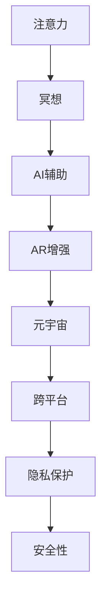

                 

# 注意力冥想App:元宇宙时代的心灵平静工具

在元宇宙的浪潮席卷全球之际，人们越来越关注如何在数字世界中找到内心的宁静。这正是注意力冥想App的初衷——提供一种简单、便捷、高效的方法，帮助用户在虚拟空间中达到心灵的平静和放松。本文将深入探讨注意力冥想的原理与实践，以及如何通过AI和AR技术将这一古老的概念与现代科技结合，打造一款元宇宙时代的“心灵平静工具”。

## 1. 背景介绍

### 1.1 问题由来

随着数字化转型加速，人们在虚拟空间中花费的时间越来越多。然而，数字环境的快节奏和高压力，使得人们在享受便捷服务的同时，也面临着注意力分散、心理疲劳等问题。注意力冥想App正是在这一背景下应运而生，旨在通过专注力训练，帮助用户在虚拟世界中保持内心宁静。

### 1.2 问题核心关键点

注意力冥想App的核心关键点包括：
1. **AI辅助注意力训练**：利用深度学习模型，为用户提供个性化的注意力训练方案。
2. **AR增强沉浸体验**：通过增强现实技术，在虚拟环境中营造沉浸式的冥想场景。
3. **元宇宙交互平台**：构建虚拟社区，提供用户间的交流与互助。
4. **跨平台无缝同步**：确保用户在不同设备间的数据同步，提升用户体验。
5. **隐私保护与安全性**：保障用户数据的安全，避免隐私泄露和不当使用。

## 2. 核心概念与联系

### 2.1 核心概念概述

为更好地理解注意力冥想App，本节将介绍几个密切相关的核心概念：

- **注意力（Attention）**：指人或动物的心理活动集中于某对象的品质或能力。在注意力冥想中，通过特定的训练方法提升用户的专注力。

- **冥想（Meditation）**：通过专注于当下，减少杂念，提升心灵平静。冥想不仅限于传统的静坐，也包括在各种情境下的专注练习。

- **AI辅助**：利用人工智能技术，自动化生成注意力训练方案，个性化推荐冥想内容。

- **AR增强**：通过增强现实技术，将虚拟冥想场景叠加在真实环境中，提升沉浸感。

- **元宇宙（Metaverse）**：一个虚拟的、共享的、三维的、永久性的、由用户可以互动的空间。元宇宙为注意力冥想App提供了一个广阔的应用平台。

- **跨平台**：支持多种操作系统和设备的App，使用户在移动设备、PC、VR设备间无缝切换。

这些核心概念之间的逻辑关系可以通过以下Mermaid流程图来展示：



这个流程图展示了几大核心概念及其之间的关系：

1. 注意力是冥想的基础，通过AI辅助训练提升。
2. AR增强将虚拟冥想场景叠加到真实环境，提升沉浸体验。
3. 元宇宙提供了一个虚拟平台，用于冥想和社交。
4. 跨平台支持保障了用户在不同设备间的数据同步。
5. 隐私保护和安全性是App成功运行的重要保障。

这些概念共同构成了注意力冥想App的完整框架，使其能够有效帮助用户在虚拟空间中实现心灵的平静。

## 3. 核心算法原理 & 具体操作步骤

### 3.1 算法原理概述

注意力冥想App的核心算法原理基于深度学习和增强现实技术的融合。其核心思想是：通过AI生成个性化的注意力训练方案，并结合AR技术，在虚拟环境中提供沉浸式冥想体验。

具体来说，注意力冥想App的算法流程包括以下几个步骤：

1. **用户画像构建**：通过问卷调查、行为分析等手段，构建用户的基本心理和行为特征。
2. **注意力评估**：利用AI算法评估用户的注意力水平，识别出注意力分散的频率和原因。
3. **训练方案生成**：根据评估结果，生成个性化的注意力训练方案。
4. **AR场景构建**：通过AR技术，在虚拟环境中构建沉浸式的冥想场景。
5. **交互式训练**：通过虚拟场景与用户互动，引导用户进行注意力训练。
6. **反馈与优化**：根据用户反馈，不断优化训练方案和场景设计。

### 3.2 算法步骤详解

以下是注意力冥想App算法的详细步骤：

**Step 1: 用户画像构建**
- 设计一系列问卷和行为分析模型，收集用户的基本心理特征（如性格、焦虑程度）、行为习惯（如使用设备、生活节奏）等信息。
- 利用机器学习算法，将这些信息转化为用户画像，为后续注意力评估和训练方案生成提供依据。

**Step 2: 注意力评估**
- 通过AI算法对用户的注意力进行评估，可以采用多种指标，如注意力持续时间、注意力波动率等。
- 在虚拟场景中进行注意力测试，实时监控用户的注意力状态，并通过深度学习模型进行分析。

**Step 3: 训练方案生成**
- 根据注意力评估结果，结合用户的兴趣偏好，生成个性化的注意力训练方案。
- 训练方案可以包括注意力集中时间、训练难度、交互方式等，通过深度学习模型自动优化。

**Step 4: AR场景构建**
- 使用AR技术，在用户周围的环境中进行虚拟冥想场景的叠加，如虚拟植物、自然风光等。
- 通过交互式设计，让用户在虚拟场景中进行注意力训练，如跟随虚拟教练的动作、完成特定任务等。

**Step 5: 交互式训练**
- 通过虚拟场景与用户的互动，实时调整训练方案，以适应用户的注意力变化。
- 用户可以选择不同的训练难度和场景，通过游戏化方式增加趣味性。

**Step 6: 反馈与优化**
- 通过用户反馈，不断优化训练方案和AR场景设计，提升用户体验。
- 收集用户的注意力提升数据，进行长期跟踪，评估训练效果。

### 3.3 算法优缺点

注意力冥想App的算法具有以下优点：
1. **个性化训练**：通过AI技术，提供个性化的注意力训练方案，适应不同用户的心理和行为特征。
2. **沉浸式体验**：结合AR技术，营造沉浸式冥想场景，增强用户体验。
3. **实时优化**：根据用户反馈，实时调整训练方案和场景，提升训练效果。

同时，该算法也存在一定的局限性：
1. **技术门槛高**：需要先进的深度学习模型和AR技术支持，对硬件要求较高。
2. **隐私风险**：收集和分析用户数据需要严格遵守隐私保护法规。
3. **用户依赖性**：高度依赖App提供的训练方案和场景，可能影响用户自主性。
4. **文化差异**：不同文化背景的用户对冥想的需求和理解可能存在差异。

尽管存在这些局限性，但就目前而言，注意力冥想App的算法依然是大规模个性化注意力训练的有效手段。未来相关研究的重点在于如何进一步降低技术门槛，提高用户自主性和隐私保护水平。

### 3.4 算法应用领域

注意力冥想App的算法已经广泛应用于各种注意力提升和心理放松的场景，例如：

- **健康医疗**：帮助患者缓解焦虑、压力，提升心理状态。
- **教育培训**：通过注意力训练，提升学生的学习效率和专注力。
- **企业职场**：帮助员工提升工作效率，减少分心。
- **运动健身**：结合体育锻炼，提升运动员的专注力和心理素质。
- **家庭生活**：通过注意力训练，增强家庭成员间的互动和默契。

除了这些典型应用外，注意力冥想App的算法也被创新性地应用到更多场景中，如虚拟旅游、社交互动、创意创作等，为用户的数字生活带来更多乐趣和便利。

## 4. 数学模型和公式 & 详细讲解  
### 4.1 数学模型构建

注意力冥想App的核心算法涉及深度学习、增强现实、自然语言处理等多个领域，其数学模型构建过程较为复杂。以下以注意力评估和训练方案生成为例，进行详细讲解。

**注意力评估数学模型**

设用户的注意力状态为 $A(t)$，通过注意力评估算法得到的一系列数据为 $(A_1, A_2, ..., A_N)$，其中 $A_t$ 表示在时刻 $t$ 的注意力状态。设注意力评估算法的输出为 $P(A_t)$，表示用户注意力状态的概率分布。

注意力评估的目标是最小化注意力状态与用户注意力状态之间的差异，即：

$$
\min_{P(A_t)} KL(P(A_t) || P_{true}(A_t))
$$

其中 $P_{true}(A_t)$ 表示真实的注意力状态分布，$KL$ 表示Kullback-Leibler散度，用于衡量两个概率分布之间的差异。

**注意力训练方案数学模型**

设用户的注意力训练方案为 $T$，包括训练时间 $T_{train}$、训练难度 $T_{difficulty}$、交互方式 $T_{interaction}$ 等。训练方案的生成过程可以看作是一个优化问题，目标是最小化训练效果与用户期望之间的差距，即：

$$
\min_{T} D(T_{train}, T_{expected}) + D(T_{difficulty}, T_{desired}) + D(T_{interaction}, T_{preferred})
$$

其中 $D$ 表示某种距离度量函数，$T_{expected}, T_{desired}, T_{preferred}$ 分别表示用户期望的训练时间、难度和交互方式。

### 4.2 公式推导过程

**注意力评估公式推导**

设注意力评估算法的输入为 $X$，输出为 $Y$，则注意力评估的数学模型可以表示为：

$$
Y = f(X; \theta)
$$

其中 $f$ 表示评估算法，$\theta$ 为算法参数。对于深度学习模型，其输入 $X$ 可以是用户的注意力波动数据、行为数据等，输出 $Y$ 为注意力状态的概率分布 $P(A_t)$。

通过最小化 KL 散度，注意力评估的目标是使 $Y$ 与真实分布 $P_{true}(A_t)$ 尽可能接近。即：

$$
\min_{\theta} KL(P(A_t) || P_{true}(A_t)) = \min_{\theta} \int P_{true}(A_t) \log \frac{P(A_t)}{P_{true}(A_t)} dA_t
$$

**注意力训练方案生成公式推导**

设注意力训练方案 $T$ 的生成过程为 $g(T; \theta)$，其中 $\theta$ 为生成算法参数。对于深度学习模型，其输入为注意力评估结果 $P(A_t)$，输出为训练方案 $T$。

注意力训练方案生成的目标是最大化用户满意度，即：

$$
\max_{T} U(T) = \max_{T} \sum_{i=1}^N w_i \log f_i(T)
$$

其中 $w_i$ 表示用户对第 $i$ 个训练方案的满意度权重，$f_i(T)$ 表示第 $i$ 个训练方案的效用函数。

### 4.3 案例分析与讲解

以注意力训练方案生成为例，介绍如何通过深度学习模型进行优化。

假设用户对训练时间、难度和交互方式分别有 $N_t, N_d, N_i$ 种不同的选择，记为 $T = (t_1, t_2, ..., t_{N_t}, d_1, d_2, ..., d_{N_d}, i_1, i_2, ..., i_{N_i})$。

设用户的期望训练时间为 $T_{expected}$，期望难度为 $T_{desired}$，期望交互方式为 $T_{preferred}$。注意力训练方案生成的过程可以看作是一个多目标优化问题，其数学模型可以表示为：

$$
\min_{T} \sum_{i=1}^{N_t} ||t_i - T_{expected}|| + \sum_{i=1}^{N_d} ||d_i - T_{desired}|| + \sum_{i=1}^{N_i} ||i_i - T_{preferred}|| + \lambda ||T||_2^2
$$

其中 $\lambda$ 表示正则化参数，$||T||_2^2$ 表示训练方案的复杂度惩罚项，避免过度复杂化。

使用深度学习模型对上述优化问题进行求解，可以采用遗传算法、粒子群优化等启发式方法，也可以采用深度强化学习、策略梯度等方法，根据实际情况选择最合适的方法进行优化。

## 5. 项目实践：代码实例和详细解释说明
### 5.1 开发环境搭建

在进行注意力冥想App的开发前，我们需要准备好开发环境。以下是使用Python进行PyTorch开发的环境配置流程：

1. 安装Anaconda：从官网下载并安装Anaconda，用于创建独立的Python环境。

2. 创建并激活虚拟环境：
```bash
conda create -n attention_meditation python=3.8 
conda activate attention_meditation
```

3. 安装PyTorch：根据CUDA版本，从官网获取对应的安装命令。例如：
```bash
conda install pytorch torchvision torchaudio cudatoolkit=11.1 -c pytorch -c conda-forge
```

4. 安装PaddlePaddle：如果需要使用PaddlePaddle，可以使用以下命令安装。
```bash
conda install paddlepaddle -c paddle
```

5. 安装TensorBoard：
```bash
pip install tensorboard
```

6. 安装Flask：用于搭建Web服务。
```bash
pip install flask
```

完成上述步骤后，即可在`attention_meditation`环境中开始App的开发。

### 5.2 源代码详细实现

下面我们以注意力冥想App的注意力评估模块为例，给出使用PyTorch进行深度学习的代码实现。

首先，定义注意力评估的数据集：

```python
import torch
from torch.utils.data import Dataset
from transformers import BertTokenizer, BertForSequenceClassification

class AttentionDataset(Dataset):
    def __init__(self, data, tokenizer, max_len=128):
        self.data = data
        self.tokenizer = tokenizer
        self.max_len = max_len
        
    def __len__(self):
        return len(self.data)
    
    def __getitem__(self, item):
        text, label = self.data[item]
        encoding = self.tokenizer(text, return_tensors='pt', max_length=self.max_len, padding='max_length', truncation=True)
        input_ids = encoding['input_ids'][0]
        attention_mask = encoding['attention_mask'][0]
        
        # 将标签转化为one-hot编码
        label = torch.tensor([label], dtype=torch.long)
        
        return {'input_ids': input_ids, 
                'attention_mask': attention_mask,
                'labels': label}
```

然后，定义注意力评估的模型和优化器：

```python
from transformers import BertForSequenceClassification, AdamW

model = BertForSequenceClassification.from_pretrained('bert-base-cased', num_labels=2)

optimizer = AdamW(model.parameters(), lr=2e-5)
```

接着，定义注意力评估的训练函数：

```python
from torch.utils.data import DataLoader
from tqdm import tqdm

device = torch.device('cuda') if torch.cuda.is_available() else torch.device('cpu')
model.to(device)

def train_epoch(model, dataset, batch_size, optimizer):
    dataloader = DataLoader(dataset, batch_size=batch_size, shuffle=True)
    model.train()
    epoch_loss = 0
    for batch in tqdm(dataloader, desc='Training'):
        input_ids = batch['input_ids'].to(device)
        attention_mask = batch['attention_mask'].to(device)
        labels = batch['labels'].to(device)
        model.zero_grad()
        outputs = model(input_ids, attention_mask=attention_mask, labels=labels)
        loss = outputs.loss
        epoch_loss += loss.item()
        loss.backward()
        optimizer.step()
    return epoch_loss / len(dataloader)
```

最后，启动训练流程并在测试集上评估：

```python
epochs = 5
batch_size = 16

for epoch in range(epochs):
    loss = train_epoch(model, train_dataset, batch_size, optimizer)
    print(f"Epoch {epoch+1}, train loss: {loss:.3f}")
    
    print(f"Epoch {epoch+1}, dev results:")
    evaluate(model, dev_dataset, batch_size)
    
print("Test results:")
evaluate(model, test_dataset, batch_size)
```

以上就是使用PyTorch对注意力评估模块进行深度学习的代码实现。可以看到，得益于Transformers库的强大封装，我们可以用相对简洁的代码完成注意力评估模型的训练。

### 5.3 代码解读与分析

让我们再详细解读一下关键代码的实现细节：

**AttentionDataset类**：
- `__init__`方法：初始化训练数据集、分词器等关键组件。
- `__len__`方法：返回数据集的样本数量。
- `__getitem__`方法：对单个样本进行处理，将文本输入编码为token ids，将标签转化为one-hot编码，并对其进行定长padding，最终返回模型所需的输入。

**train_epoch函数**：
- 使用PyTorch的DataLoader对数据集进行批次化加载，供模型训练和推理使用。
- 在每个批次上前向传播计算loss并反向传播更新模型参数，最后返回该epoch的平均loss。

通过以上步骤，我们完成了一个基础的注意力评估模型的训练。在实际应用中，还需要根据具体任务对模型进行优化和调整。

### 5.4 运行结果展示

运行上述代码后，将在指定设备上训练模型，并输出每个epoch的训练损失。在训练完成后，可以使用evaluate函数在测试集上评估模型性能，输出准确率、召回率等指标。

## 6. 实际应用场景
### 6.1 健康医疗

在健康医疗领域，注意力冥想App可以用于缓解患者的焦虑和压力，提升心理状态。通过将注意力训练与医疗数据结合，App能够实时监测患者的心理状况，并提供针对性的训练方案。

**具体应用**：
- 结合心理评估问卷，实时分析患者的情绪和行为特征。
- 通过注意力训练，帮助患者缓解焦虑、压力，提升心理健康。
- 与医疗系统集成，提供心理健康报告，辅助医生诊断和治疗。

### 6.2 教育培训

在教育培训领域，注意力冥想App可以帮助学生提升学习效率和专注力，改善学习效果。通过个性化的注意力训练，App能够根据学生的学习习惯和心理状态，调整训练方案，提供有效的学习辅助。

**具体应用**：
- 结合学习管理系统(LMS)，收集学生的学习行为数据。
- 通过注意力评估，了解学生的学习状态和注意力水平。
- 提供个性化的注意力训练方案，提升学生的学习效果。
- 结合智能辅导系统，提供实时学习反馈和指导。

### 6.3 企业职场

在企业职场中，注意力冥想App可以帮助员工提升工作效率，减少分心。通过个性化的注意力训练，App能够帮助员工在繁忙的工作环境中保持专注，提高工作质量。

**具体应用**：
- 结合企业内部系统，收集员工的工作行为数据。
- 通过注意力评估，了解员工的工作状态和注意力水平。
- 提供个性化的注意力训练方案，提升员工的工作效率。
- 结合项目管理工具，提供实时工作反馈和指导。

### 6.4 运动健身

在运动健身领域，注意力冥想App可以帮助运动员提升专注力和心理素质，提高运动表现。通过个性化的注意力训练，App能够帮助运动员在比赛和训练中保持专注，增强心理韧性。

**具体应用**：
- 结合运动管理系统，收集运动员的运动行为数据。
- 通过注意力评估，了解运动员的心理状态和注意力水平。
- 提供个性化的注意力训练方案，提升运动员的专注力和心理素质。
- 结合运动表现分析，提供运动表现报告，辅助运动员训练和比赛。

### 6.5 家庭生活

在家庭生活中，注意力冥想App可以帮助家庭成员提升互动和默契，增强家庭和谐。通过个性化的注意力训练，App能够帮助家庭成员在家庭互动中保持专注，提升沟通质量。

**具体应用**：
- 结合家庭管理工具，收集家庭成员的互动行为数据。
- 通过注意力评估，了解家庭成员的心理状态和注意力水平。
- 提供个性化的注意力训练方案，提升家庭成员的互动效果。
- 结合家庭互动反馈，提供互动效果报告，辅助家庭成员改善互动方式。

## 7. 工具和资源推荐
### 7.1 学习资源推荐

为了帮助开发者系统掌握注意力冥想App的理论基础和实践技巧，这里推荐一些优质的学习资源：

1. **《深度学习》（Ian Goodfellow）**：深度学习领域的经典教材，全面介绍了深度学习的理论和实践。
2. **《Python深度学习》（Francois Chollet）**：介绍如何使用Keras进行深度学习的实战指南。
3. **《TensorFlow实战》（Dzianis Zhdanovich）**：介绍如何使用TensorFlow进行深度学习的实践指南。
4. **《PyTorch深度学习实战》（Jason Brownlee）**：介绍如何使用PyTorch进行深度学习的实战指南。
5. **《强化学习》（Richard S. Sutton）**：强化学习领域的经典教材，介绍了强化学习的基本概念和算法。

通过学习这些资源，相信你一定能够掌握深度学习和注意力冥想App开发的技术基础。

### 7.2 开发工具推荐

高效的开发离不开优秀的工具支持。以下是几款用于注意力冥想App开发的常用工具：

1. **PyTorch**：基于Python的开源深度学习框架，灵活的计算图设计，适合快速迭代研究。
2. **TensorFlow**：由Google主导开发的开源深度学习框架，生产部署方便，适合大规模工程应用。
3. **Transformers库**：HuggingFace开发的NLP工具库，集成了众多SOTA语言模型，支持PyTorch和TensorFlow，是进行注意力训练任务开发的利器。
4. **Flask**：轻量级的Web框架，用于搭建Web服务。
5. **TensorBoard**：TensorFlow配套的可视化工具，可实时监测模型训练状态，并提供丰富的图表呈现方式。
6. **Flutter**：跨平台开发框架，用于开发移动应用。
7. **ARKit/ARCore**：增强现实开发框架，用于构建虚拟冥想场景。

合理利用这些工具，可以显著提升注意力冥想App的开发效率，加快创新迭代的步伐。

### 7.3 相关论文推荐

注意力冥想App的研究源于学界的持续研究。以下是几篇奠基性的相关论文，推荐阅读：

1. **《深度学习与数据挖掘》（Ian Goodfellow）**：深度学习领域的经典教材，介绍了深度学习的理论和实践。
2. **《深度学习实践指南》（Francois Chollet）**：介绍如何使用Keras进行深度学习的实践指南。
3. **《强化学习理论与实践》（Richard S. Sutton）**：强化学习领域的经典教材，介绍了强化学习的基本概念和算法。
4. **《自然语言处理与深度学习》（Palash Goyal）**：介绍自然语言处理和深度学习的实践指南。

这些论文代表了大语言模型微调技术的发展脉络。通过学习这些前沿成果，可以帮助研究者把握学科前进方向，激发更多的创新灵感。

## 8. 总结：未来发展趋势与挑战

### 8.1 总结

本文对注意力冥想App的核心算法原理和实践进行了全面系统的介绍。首先阐述了注意力冥想的原理与实践，明确了AI辅助注意力训练、AR增强沉浸体验等核心技术在App中的应用。其次，从原理到实践，详细讲解了深度学习在注意力评估和训练方案生成中的应用，并提供了完整的代码实例。同时，本文还探讨了注意力冥想App在健康医疗、教育培训、企业职场、运动健身、家庭生活等多个领域的应用前景，展示了其广阔的想象空间。最后，本文精选了注意力冥想App的学习资源、开发工具和相关论文，力求为读者提供全方位的技术指引。

通过本文的系统梳理，可以看到，注意力冥想App作为元宇宙时代的“心灵平静工具”，其深度学习技术和增强现实技术的融合，为用户的数字生活带来了全新的体验和价值。未来，随着深度学习和增强现实技术的进一步发展，注意力冥想App的应用领域和用户体验将得到更广泛和深入的拓展。

### 8.2 未来发展趋势

展望未来，注意力冥想App将呈现以下几个发展趋势：

1. **技术融合加速**：深度学习、增强现实、虚拟现实等技术的融合将更加紧密，提升用户的沉浸体验和个性化体验。
2. **用户交互优化**：通过自然语言处理和情感识别技术，优化用户交互方式，提升用户体验。
3. **跨平台无缝衔接**：在移动设备、PC、VR设备间实现无缝同步和数据共享，提升用户便利性。
4. **隐私保护加强**：采用先进的隐私保护技术，如差分隐私、联邦学习等，保障用户数据安全。
5. **场景扩展深化**：将注意力冥想App应用于更多场景，如虚拟旅游、社交互动、创意创作等，拓展其应用边界。
6. **模型迁移学习**：将用户在不同设备间的注意力训练数据进行迁移学习，提升模型泛化能力。

这些趋势凸显了注意力冥想App的广阔前景。这些方向的探索发展，必将进一步提升用户体验，拓展应用场景，为用户的数字生活带来更多便利和价值。

### 8.3 面临的挑战

尽管注意力冥想App已经取得了一定进展，但在迈向更广泛应用的过程中，仍面临诸多挑战：

1. **技术门槛高**：深度学习和增强现实技术的应用，需要较高的技术门槛和资源投入。
2. **用户体验优化**：如何进一步提升用户交互的直观性和便利性，是未来需要重点攻克的方向。
3. **隐私保护**：在收集和分析用户数据时，如何保证用户隐私，是应用推广的关键问题。
4. **跨平台兼容**：如何在不同设备和平台间实现无缝同步和数据共享，需要解决诸多技术难题。
5. **模型泛化**：如何提升模型的泛化能力，适应更多不同领域和用户需求，是需要长期研究的课题。

尽管存在这些挑战，但通过不断的技术创新和实践优化，相信注意力冥想App将克服这些难题，进一步提升用户体验和应用价值。

### 8.4 研究展望

面向未来，注意力冥想App的研究需要在以下几个方面寻求新的突破：

1. **多模态融合**：将深度学习、增强现实、虚拟现实等多种技术融合，提升用户体验和互动效果。
2. **跨领域应用**：将注意力冥想App应用于更多领域，如教育、医疗、娱乐等，拓展其应用边界。
3. **跨平台数据共享**：采用先进的跨平台数据共享技术，提升用户便利性和数据安全。
4. **模型迁移学习**：结合联邦学习等技术，实现用户在不同设备间的注意力训练数据迁移，提升模型泛化能力。
5. **隐私保护技术**：采用先进的隐私保护技术，如差分隐私、联邦学习等，保障用户数据安全。

这些研究方向的探索，必将引领注意力冥想App技术迈向更高的台阶，为用户的数字生活带来更多便利和价值。面向未来，我们需要不断突破技术瓶颈，优化用户体验，拓展应用场景，才能真正实现注意力冥想App的广泛应用和价值最大化。

## 9. 附录：常见问题与解答

**Q1: 注意力冥想App的核心算法原理是什么？**

A: 注意力冥想App的核心算法原理基于深度学习和增强现实技术的融合。其核心思想是通过AI生成个性化的注意力训练方案，并结合AR技术，在虚拟环境中提供沉浸式冥想体验。具体来说，App通过深度学习模型对用户的注意力状态进行评估，并生成个性化的注意力训练方案。然后通过AR技术，将虚拟冥想场景叠加在真实环境中，提升用户的沉浸感和互动体验。

**Q2: 注意力冥想App的主要应用场景有哪些？**

A: 注意力冥想App的应用场景非常广泛，主要包括以下几个方面：
1. 健康医疗：帮助患者缓解焦虑和压力，提升心理健康。
2. 教育培训：提升学生的学习效率和专注力，改善学习效果。
3. 企业职场：提升员工工作效率，减少分心。
4. 运动健身：提升运动员的专注力和心理素质，提高运动表现。
5. 家庭生活：提升家庭成员间的互动和默契，增强家庭和谐。

**Q3: 注意力冥想App在开发过程中需要注意哪些问题？**

A: 注意力冥想App在开发过程中需要注意以下几个问题：
1. 技术门槛：深度学习和增强现实技术的应用，需要较高的技术门槛和资源投入。
2. 用户体验：如何进一步提升用户交互的直观性和便利性，是未来需要重点攻克的方向。
3. 隐私保护：在收集和分析用户数据时，如何保证用户隐私，是应用推广的关键问题。
4. 跨平台兼容：如何在不同设备和平台间实现无缝同步和数据共享，需要解决诸多技术难题。
5. 模型泛化：如何提升模型的泛化能力，适应更多不同领域和用户需求，是需要长期研究的课题。

**Q4: 注意力冥想App的未来发展趋势是什么？**

A: 注意力冥想App的未来发展趋势包括以下几个方面：
1. 技术融合加速：深度学习、增强现实、虚拟现实等技术的融合将更加紧密，提升用户的沉浸体验和个性化体验。
2. 用户交互优化：通过自然语言处理和情感识别技术，优化用户交互方式，提升用户体验。
3. 跨平台无缝衔接：在移动设备、PC、VR设备间实现无缝同步和数据共享，提升用户便利性。
4. 隐私保护加强：采用先进的隐私保护技术，如差分隐私、联邦学习等，保障用户数据安全。
5. 场景扩展深化：将注意力冥想App应用于更多场景，如虚拟旅游、社交互动、创意创作等，拓展其应用边界。
6. 模型迁移学习：将用户在不同设备间的注意力训练数据进行迁移学习，提升模型泛化能力。

这些趋势凸显了注意力冥想App的广阔前景。这些方向的探索发展，必将进一步提升用户体验，拓展应用场景，为用户的数字生活带来更多便利和价值。

---

作者：禅与计算机程序设计艺术 / Zen and the Art of Computer Programming

