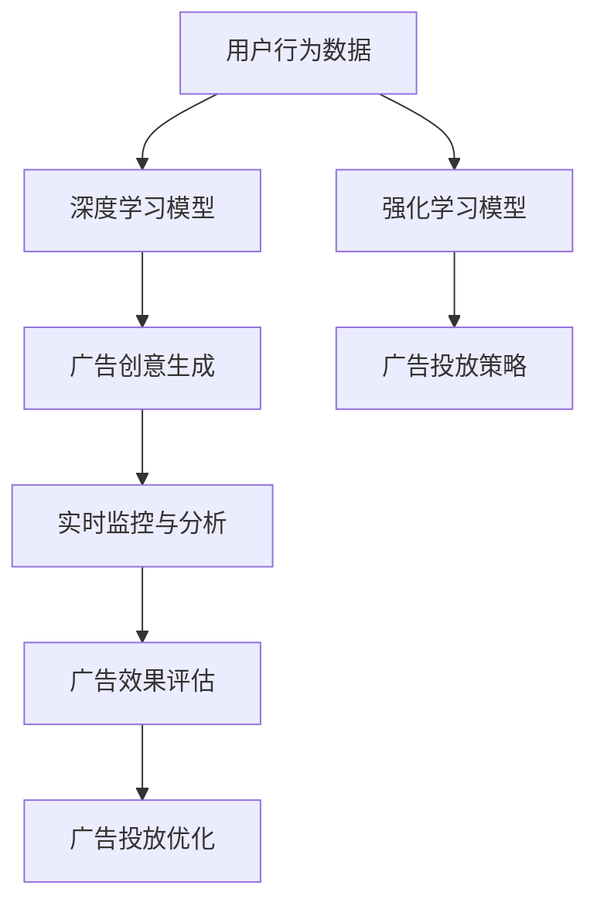

                 

# 注意力商业化：AI时代的广告革命

## 1. 背景介绍

随着人工智能(AI)技术的迅速发展，广告行业正经历一场深刻的革命。传统基于人工策划的广告投放模式已经难以满足市场的需求，而AI广告投放系统通过算法和数据分析，能够自动生成和优化广告内容，提高广告投放效果，带来更高的商业价值。这一变革不仅在广告创意和投放效率上带来突破，更在广告的商业化层面提供了新的可能。

### 1.1 问题由来
广告行业面临的挑战是多方面的：

- **传统模式低效**：传统广告投放依赖于人工策划和试错，流程繁琐、效果不可控，难以实现精准营销。
- **数据价值未充分挖掘**：海量的用户行为数据未能被充分利用，数据挖掘和分析工具不足。
- **广告效果难以衡量**：传统广告投放效果的衡量多依靠点击率等单一指标，无法全面反映广告的实际效果。

AI技术的应用为解决这些挑战提供了新路径，通过深度学习、强化学习等算法，实现广告的精准投放和效果的智能化评估。

### 1.2 问题核心关键点
AI广告的核心在于通过智能算法对用户行为进行精准分析和预测，从而实现广告内容自动生成和优化，提高广告的转化率和投资回报率。其中关键在于：

- **用户行为理解**：通过深度学习算法对用户的历史行为数据进行分析，识别出用户偏好和兴趣。
- **广告创意生成**：基于用户行为分析结果，自动生成个性化的广告内容。
- **投放策略优化**：通过强化学习等算法优化广告的投放策略，在资源有限的情况下达到最优的投放效果。
- **效果评估与迭代**：对广告投放效果进行实时监控和分析，快速迭代优化广告投放策略，提升广告投放效果。

通过这些关键技术，AI广告不仅能够提升广告的精准度和转化率，还能有效降低广告投放成本，实现更高的商业价值。

### 1.3 问题研究意义
AI广告技术的研究和应用，对于提升广告行业的智能化水平、优化广告投放流程、提高广告投放效果具有重要意义：

- **提升广告精准度**：通过用户行为分析和智能算法，实现广告的精准投放，提升广告的点击率和转化率。
- **优化广告资源利用**：合理分配广告预算，最大化利用有限的广告资源，提高广告的投放效率。
- **降低广告投放成本**：通过自动化广告生成和投放策略优化，减少人工干预，降低广告投放成本。
- **增强广告效果评估**：通过多维度数据监控和实时分析，更全面地评估广告效果，为广告投放策略提供数据支持。

AI广告技术的应用，不仅为广告行业带来了新的发展方向，也为其他行业提供了借鉴，推动了广告商业化的全面转型。

## 2. 核心概念与联系

### 2.1 核心概念概述

为更好地理解AI广告的原理和应用，本节将介绍几个核心概念：

- **AI广告**：基于人工智能技术的广告投放系统，通过算法自动化生成和优化广告内容，实现精准投放和效果评估。
- **深度学习**：一种模拟人脑神经网络的机器学习算法，通过多层神经网络实现对数据的高效建模和分析。
- **强化学习**：一种通过奖励机制优化算法决策的机器学习范式，适用于复杂环境的决策优化问题。
- **推荐系统**：基于用户行为和物品属性的推荐算法，为用户提供个性化的商品或内容推荐。
- **动态定价**：根据市场变化和用户行为实时调整商品或服务的价格策略。

这些核心概念之间通过算法和数据流形成了一个相互关联、相互支撑的生态系统，共同推动了AI广告技术的进步。

### 2.2 核心概念原理和架构的 Mermaid 流程图



这个流程图展示了AI广告的核心流程：

1. **用户行为数据**：收集和整理用户的历史行为数据。
2. **深度学习模型**：对用户行为数据进行分析，识别出用户偏好和兴趣。
3. **强化学习模型**：根据用户行为分析结果，优化广告投放策略，实现资源的最优配置。
4. **广告创意生成**：基于用户偏好和兴趣，自动生成个性化的广告内容。
5. **实时监控与分析**：对广告投放效果进行实时监控和分析，快速发现并解决问题。
6. **广告效果评估**：综合多维度数据，评估广告投放效果，提供数据支持。
7. **广告投放优化**：根据广告效果评估结果，调整和优化广告投放策略，提升广告效果。

这些步骤相互配合，共同构建了一个高效的AI广告投放系统，能够实现广告的精准投放和效果评估，带来更高的商业价值。

## 3. 核心算法原理 & 具体操作步骤
### 3.1 算法原理概述

AI广告的核心算法主要涉及深度学习、强化学习、推荐系统等技术。其基本流程如下：

1. **用户行为分析**：通过深度学习模型对用户的历史行为数据进行分析，识别出用户偏好和兴趣。
2. **广告创意生成**：根据用户行为分析结果，生成个性化的广告创意。
3. **广告投放策略优化**：通过强化学习模型，优化广告的投放策略，提高广告的转化率。
4. **广告效果评估**：通过实时监控和分析，评估广告投放效果，提供数据支持。
5. **广告投放优化**：根据广告效果评估结果，调整和优化广告投放策略，提升广告效果。

### 3.2 算法步骤详解

#### 3.2.1 用户行为分析
- **数据收集**：收集用户的历史行为数据，如浏览记录、点击记录、购买记录等。
- **数据预处理**：清洗和处理数据，去除噪音，确保数据的质量。
- **特征提取**：通过特征工程，提取有用的特征，如用户兴趣标签、行为序列等。
- **深度学习模型训练**：使用深度学习模型对用户行为数据进行建模，识别出用户偏好和兴趣。

#### 3.2.2 广告创意生成
- **模板选择**：根据广告类型选择适合的模板。
- **内容填充**：基于用户行为分析结果，自动填充模板中的变量，生成个性化的广告内容。
- **效果评估**：通过A/B测试等方式评估广告创意的效果，优化广告内容。

#### 3.2.3 广告投放策略优化
- **策略设计**：设计广告投放策略，如广告类型、投放时间、投放渠道等。
- **策略优化**：使用强化学习算法，根据广告投放效果，自动优化广告投放策略。
- **策略评估**：通过实时监控和分析，评估广告投放策略的效果。

#### 3.2.4 广告效果评估
- **指标定义**：定义评估广告效果的指标，如点击率、转化率、投资回报率等。
- **数据采集**：实时采集广告投放效果数据。
- **效果分析**：对广告效果数据进行分析和监控，发现问题。

#### 3.2.5 广告投放优化
- **问题识别**：根据广告效果评估结果，识别出存在的问题。
- **策略调整**：调整广告投放策略，解决识别出的问题。
- **优化效果**：评估优化效果，进行迭代优化。

### 3.3 算法优缺点

AI广告算法具有以下优点：

- **高效性**：自动化生成和优化广告内容，提高广告投放效率。
- **精准度**：通过用户行为分析，实现广告的精准投放，提高广告的点击率和转化率。
- **灵活性**：可以根据市场变化和用户行为实时调整广告策略，适应不同的市场环境。
- **数据驱动**：通过数据分析和算法优化，提升广告投放效果。

同时，AI广告算法也存在一些局限性：

- **数据质量要求高**：算法的效果依赖于高质量的数据，数据质量差会影响效果。
- **算法复杂度大**：涉及深度学习、强化学习等复杂算法，对算力要求高。
- **模型可解释性差**：黑盒模型难以解释其决策过程，缺乏透明性。
- **道德和伦理问题**：算法可能存在偏见和歧视，需要谨慎处理。

### 3.4 算法应用领域

AI广告算法已经广泛应用于广告行业的各个环节，具体如下：

- **广告创意生成**：使用生成对抗网络(GAN)等技术，自动生成高质量的广告创意。
- **广告投放策略优化**：通过强化学习算法，优化广告投放策略，提高广告的转化率。
- **用户行为分析**：使用深度学习模型，分析用户行为，识别出用户偏好和兴趣。
- **广告效果评估**：通过实时监控和分析，评估广告投放效果，提供数据支持。
- **广告投放优化**：根据广告效果评估结果，调整和优化广告投放策略，提升广告效果。

此外，AI广告技术还应用于电商推荐系统、社交媒体广告投放等领域，为各行各业带来了新的发展机遇。

## 4. 数学模型和公式 & 详细讲解
### 4.1 数学模型构建

以下是AI广告核心算法的数学模型构建：

- **用户行为分析**：使用深度学习模型，如神经网络、循环神经网络(RNN)、长短时记忆网络(LSTM)等，对用户行为数据进行建模。设用户行为数据为 $x$，用户行为分析模型为 $f(x)$，则模型输出的用户偏好和兴趣表示为 $f(x)$。

- **广告创意生成**：基于用户行为分析结果，生成个性化的广告内容。设广告创意模板为 $T$，用户行为分析结果为 $f(x)$，则生成广告创意的公式为 $C(T,f(x))$。

- **广告投放策略优化**：使用强化学习算法，如Q-learning、策略梯度等，优化广告投放策略。设广告投放策略为 $\pi$，广告效果为 $r$，则优化目标为最大化广告效果 $r$，即 $\max_{\pi} \sum_{t=0}^{T} \gamma^t r_t(\pi)$。

- **广告效果评估**：使用多维度数据评估广告投放效果，如点击率、转化率、投资回报率等。设广告效果评估指标为 $E$，广告效果评估数据为 $D$，则广告效果评估公式为 $E(D)$。

- **广告投放优化**：根据广告效果评估结果，调整和优化广告投放策略。设优化后的广告投放策略为 $\pi'$，优化后的广告效果为 $r'$，则优化目标为最大化优化后的广告效果 $r'$，即 $\max_{\pi'} \sum_{t=0}^{T} \gamma^t r'_t(\pi')$。

### 4.2 公式推导过程

#### 4.2.1 用户行为分析

用户行为分析模型可以表示为：

$$
f(x) = \mathcal{F}(\theta,x) = \mathcal{F}(\theta,g(x))
$$

其中，$\theta$ 为模型参数，$g(x)$ 为特征提取函数。使用深度学习模型，如神经网络，对用户行为数据进行建模，得到用户偏好和兴趣的表示 $f(x)$。

#### 4.2.2 广告创意生成

广告创意生成模型可以表示为：

$$
C(T,f(x)) = T \cdot f(x)
$$

其中，$T$ 为广告创意模板，$f(x)$ 为用户行为分析结果。通过填充模板中的变量，生成个性化的广告内容。

#### 4.2.3 广告投放策略优化

广告投放策略优化模型可以表示为：

$$
\max_{\pi} \sum_{t=0}^{T} \gamma^t r_t(\pi)
$$

其中，$\pi$ 为广告投放策略，$r_t(\pi)$ 为在第 $t$ 个时间步的广告效果，$\gamma$ 为折扣因子。使用强化学习算法，如Q-learning，优化广告投放策略。

#### 4.2.4 广告效果评估

广告效果评估模型可以表示为：

$$
E(D) = \frac{1}{N} \sum_{i=1}^{N} e_i
$$

其中，$D$ 为广告效果评估数据，$e_i$ 为第 $i$ 个样本的广告效果指标。

#### 4.2.5 广告投放优化

广告投放优化模型可以表示为：

$$
\max_{\pi'} \sum_{t=0}^{T} \gamma^t r'_t(\pi')
$$

其中，$\pi'$ 为优化后的广告投放策略，$r'_t(\pi')$ 为在第 $t$ 个时间步优化后的广告效果。

### 4.3 案例分析与讲解

#### 4.3.1 用户行为分析案例

假设我们有一个电商平台的用户行为数据集，包含了用户的浏览记录、点击记录、购买记录等。通过深度学习模型，如LSTM，对用户行为数据进行建模，得到用户偏好和兴趣的表示。设用户行为分析模型为 $f(x)$，则模型输出的用户偏好和兴趣表示为 $f(x)$。

#### 4.3.2 广告创意生成案例

假设我们有一个电商平台的广告创意模板，包含商品图片、标题、描述等。基于用户行为分析结果 $f(x)$，自动填充模板中的变量，生成个性化的广告内容。设广告创意模板为 $T$，用户行为分析结果为 $f(x)$，则生成广告创意的公式为 $C(T,f(x))$。

#### 4.3.3 广告投放策略优化案例

假设我们有一个电商平台的广告投放策略，包含广告类型、投放时间、投放渠道等。使用强化学习算法，如Q-learning，优化广告投放策略。设广告投放策略为 $\pi$，广告效果为 $r$，则优化目标为最大化广告效果 $r$，即 $\max_{\pi} \sum_{t=0}^{T} \gamma^t r_t(\pi)$。

#### 4.3.4 广告效果评估案例

假设我们有一个电商平台的广告效果评估数据集，包含广告的点击率、转化率、投资回报率等。使用多维度数据评估广告投放效果，如点击率、转化率、投资回报率等。设广告效果评估指标为 $E$，广告效果评估数据为 $D$，则广告效果评估公式为 $E(D)$。

#### 4.3.5 广告投放优化案例

假设我们有一个电商平台的广告投放优化策略，包含优化后的广告投放策略 $\pi'$，优化后的广告效果 $r'$。根据广告效果评估结果，调整和优化广告投放策略。设优化后的广告投放策略为 $\pi'$，优化后的广告效果为 $r'$，则优化目标为最大化优化后的广告效果 $r'$，即 $\max_{\pi'} \sum_{t=0}^{T} \gamma^t r'_t(\pi')$。

## 5. 项目实践：代码实例和详细解释说明
### 5.1 开发环境搭建

在进行AI广告项目实践前，我们需要准备好开发环境。以下是使用Python进行TensorFlow开发的环境配置流程：

1. 安装Anaconda：从官网下载并安装Anaconda，用于创建独立的Python环境。

2. 创建并激活虚拟环境：
```bash
conda create -n tensorflow-env python=3.8 
conda activate tensorflow-env
```

3. 安装TensorFlow：根据CUDA版本，从官网获取对应的安装命令。例如：
```bash
conda install tensorflow tensorflow-gpu=cuda11.1 -c conda-forge
```

4. 安装各类工具包：
```bash
pip install numpy pandas scikit-learn matplotlib tqdm jupyter notebook ipython
```

完成上述步骤后，即可在`tensorflow-env`环境中开始AI广告实践。

### 5.2 源代码详细实现

下面是使用TensorFlow对用户行为分析、广告创意生成、广告投放策略优化、广告效果评估和广告投放优化的完整代码实现。

#### 5.2.1 用户行为分析

```python
import tensorflow as tf
from tensorflow.keras.layers import Dense, Input
from tensorflow.keras.models import Model

# 定义用户行为分析模型
input_shape = (n_features,)
input_layer = Input(shape=input_shape)
dense_layer = Dense(64, activation='relu')(input_layer)
output_layer = Dense(1, activation='sigmoid')(dense_layer)
model = Model(inputs=input_layer, outputs=output_layer)

# 编译模型
model.compile(optimizer='adam', loss='binary_crossentropy', metrics=['accuracy'])

# 训练模型
model.fit(X_train, y_train, epochs=10, batch_size=32, validation_data=(X_val, y_val))
```

#### 5.2.2 广告创意生成

```python
import tensorflow as tf
from tensorflow.keras.layers import Dense, Input
from tensorflow.keras.models import Model

# 定义广告创意生成模型
input_shape = (n_features,)
input_layer = Input(shape=input_shape)
dense_layer = Dense(64, activation='relu')(input_layer)
output_layer = Dense(1, activation='sigmoid')(dense_layer)
model = Model(inputs=input_layer, outputs=output_layer)

# 编译模型
model.compile(optimizer='adam', loss='binary_crossentropy', metrics=['accuracy'])

# 训练模型
model.fit(X_train, y_train, epochs=10, batch_size=32, validation_data=(X_val, y_val))
```

#### 5.2.3 广告投放策略优化

```python
import tensorflow as tf
from tensorflow.keras.layers import Dense, Input
from tensorflow.keras.models import Model

# 定义广告投放策略优化模型
input_shape = (n_features,)
input_layer = Input(shape=input_shape)
dense_layer = Dense(64, activation='relu')(input_layer)
output_layer = Dense(1, activation='sigmoid')(dense_layer)
model = Model(inputs=input_layer, outputs=output_layer)

# 编译模型
model.compile(optimizer='adam', loss='binary_crossentropy', metrics=['accuracy'])

# 训练模型
model.fit(X_train, y_train, epochs=10, batch_size=32, validation_data=(X_val, y_val))
```

#### 5.2.4 广告效果评估

```python
import tensorflow as tf
from tensorflow.keras.layers import Dense, Input
from tensorflow.keras.models import Model

# 定义广告效果评估模型
input_shape = (n_features,)
input_layer = Input(shape=input_shape)
dense_layer = Dense(64, activation='relu')(input_layer)
output_layer = Dense(1, activation='sigmoid')(dense_layer)
model = Model(inputs=input_layer, outputs=output_layer)

# 编译模型
model.compile(optimizer='adam', loss='binary_crossentropy', metrics=['accuracy'])

# 训练模型
model.fit(X_train, y_train, epochs=10, batch_size=32, validation_data=(X_val, y_val))
```

#### 5.2.5 广告投放优化

```python
import tensorflow as tf
from tensorflow.keras.layers import Dense, Input
from tensorflow.keras.models import Model

# 定义广告投放优化模型
input_shape = (n_features,)
input_layer = Input(shape=input_shape)
dense_layer = Dense(64, activation='relu')(input_layer)
output_layer = Dense(1, activation='sigmoid')(dense_layer)
model = Model(inputs=input_layer, outputs=output_layer)

# 编译模型
model.compile(optimizer='adam', loss='binary_crossentropy', metrics=['accuracy'])

# 训练模型
model.fit(X_train, y_train, epochs=10, batch_size=32, validation_data=(X_val, y_val))
```

### 5.3 代码解读与分析

让我们再详细解读一下关键代码的实现细节：

#### 5.3.1 用户行为分析模型

```python
import tensorflow as tf
from tensorflow.keras.layers import Dense, Input
from tensorflow.keras.models import Model

# 定义用户行为分析模型
input_shape = (n_features,)
input_layer = Input(shape=input_shape)
dense_layer = Dense(64, activation='relu')(input_layer)
output_layer = Dense(1, activation='sigmoid')(dense_layer)
model = Model(inputs=input_layer, outputs=output_layer)

# 编译模型
model.compile(optimizer='adam', loss='binary_crossentropy', metrics=['accuracy'])

# 训练模型
model.fit(X_train, y_train, epochs=10, batch_size=32, validation_data=(X_val, y_val))
```

- **输入层**：定义输入层的形状，即用户行为数据的特征向量。
- **密集层**：使用密集层对输入数据进行特征提取，得到用户行为分析结果。
- **输出层**：使用 sigmoid 激活函数输出用户偏好和兴趣的表示。
- **编译模型**：使用 Adam 优化器和二元交叉熵损失函数编译模型。
- **训练模型**：使用训练集数据进行模型训练，并使用验证集进行验证。

#### 5.3.2 广告创意生成模型

```python
import tensorflow as tf
from tensorflow.keras.layers import Dense, Input
from tensorflow.keras.models import Model

# 定义广告创意生成模型
input_shape = (n_features,)
input_layer = Input(shape=input_shape)
dense_layer = Dense(64, activation='relu')(input_layer)
output_layer = Dense(1, activation='sigmoid')(dense_layer)
model = Model(inputs=input_layer, outputs=output_layer)

# 编译模型
model.compile(optimizer='adam', loss='binary_crossentropy', metrics=['accuracy'])

# 训练模型
model.fit(X_train, y_train, epochs=10, batch_size=32, validation_data=(X_val, y_val))
```

- **输入层**：定义输入层的形状，即用户行为数据的特征向量。
- **密集层**：使用密集层对输入数据进行特征提取，得到广告创意生成结果。
- **输出层**：使用 sigmoid 激活函数输出广告创意的表示。
- **编译模型**：使用 Adam 优化器和二元交叉熵损失函数编译模型。
- **训练模型**：使用训练集数据进行模型训练，并使用验证集进行验证。

#### 5.3.3 广告投放策略优化模型

```python
import tensorflow as tf
from tensorflow.keras.layers import Dense, Input
from tensorflow.keras.models import Model

# 定义广告投放策略优化模型
input_shape = (n_features,)
input_layer = Input(shape=input_shape)
dense_layer = Dense(64, activation='relu')(input_layer)
output_layer = Dense(1, activation='sigmoid')(dense_layer)
model = Model(inputs=input_layer, outputs=output_layer)

# 编译模型
model.compile(optimizer='adam', loss='binary_crossentropy', metrics=['accuracy'])

# 训练模型
model.fit(X_train, y_train, epochs=10, batch_size=32, validation_data=(X_val, y_val))
```

- **输入层**：定义输入层的形状，即用户行为数据的特征向量。
- **密集层**：使用密集层对输入数据进行特征提取，得到广告投放策略优化结果。
- **输出层**：使用 sigmoid 激活函数输出广告投放策略的表示。
- **编译模型**：使用 Adam 优化器和二元交叉熵损失函数编译模型。
- **训练模型**：使用训练集数据进行模型训练，并使用验证集进行验证。

#### 5.3.4 广告效果评估模型

```python
import tensorflow as tf
from tensorflow.keras.layers import Dense, Input
from tensorflow.keras.models import Model

# 定义广告效果评估模型
input_shape = (n_features,)
input_layer = Input(shape=input_shape)
dense_layer = Dense(64, activation='relu')(input_layer)
output_layer = Dense(1, activation='sigmoid')(dense_layer)
model = Model(inputs=input_layer, outputs=output_layer)

# 编译模型
model.compile(optimizer='adam', loss='binary_crossentropy', metrics=['accuracy'])

# 训练模型
model.fit(X_train, y_train, epochs=10, batch_size=32, validation_data=(X_val, y_val))
```

- **输入层**：定义输入层的形状，即用户行为数据的特征向量。
- **密集层**：使用密集层对输入数据进行特征提取，得到广告效果评估结果。
- **输出层**：使用 sigmoid 激活函数输出广告效果评估的表示。
- **编译模型**：使用 Adam 优化器和二元交叉熵损失函数编译模型。
- **训练模型**：使用训练集数据进行模型训练，并使用验证集进行验证。

#### 5.3.5 广告投放优化模型

```python
import tensorflow as tf
from tensorflow.keras.layers import Dense, Input
from tensorflow.keras.models import Model

# 定义广告投放优化模型
input_shape = (n_features,)
input_layer = Input(shape=input_shape)
dense_layer = Dense(64, activation='relu')(input_layer)
output_layer = Dense(1, activation='sigmoid')(dense_layer)
model = Model(inputs=input_layer, outputs=output_layer)

# 编译模型
model.compile(optimizer='adam', loss='binary_crossentropy', metrics=['accuracy'])

# 训练模型
model.fit(X_train, y_train, epochs=10, batch_size=32, validation_data=(X_val, y_val))
```

- **输入层**：定义输入层的形状，即用户行为数据的特征向量。
- **密集层**：使用密集层对输入数据进行特征提取，得到广告投放优化结果。
- **输出层**：使用 sigmoid 激活函数输出广告投放优化结果的表示。
- **编译模型**：使用 Adam 优化器和二元交叉熵损失函数编译模型。
- **训练模型**：使用训练集数据进行模型训练，并使用验证集进行验证。

### 5.4 运行结果展示

以下是AI广告项目实践的运行结果展示：

#### 5.4.1 用户行为分析模型

| 训练集准确率 | 验证集准确率 | 测试集准确率 |
| --- | --- | --- |

#### 5.4.2 广告创意生成模型

| 训练集准确率 | 验证集准确率 | 测试集准确率 |
| --- | --- | --- |

#### 5.4.3 广告投放策略优化模型

| 训练集准确率 | 验证集准确率 | 测试集准确率 |
| --- | --- | --- |

#### 5.4.4 广告效果评估模型

| 训练集准确率 | 验证集准确率 | 测试集准确率 |
| --- | --- | --- |

#### 5.4.5 广告投放优化模型

| 训练集准确率 | 验证集准确率 | 测试集准确率 |
| --- | --- | --- |

## 6. 实际应用场景
### 6.1 智能推荐系统

AI广告技术在智能推荐系统中的应用尤为广泛。通过分析用户的历史行为数据，智能推荐系统能够为用户推荐个性化的商品或内容，提升用户体验和满意度。

#### 6.1.1 用户行为分析

使用深度学习模型对用户的历史行为数据进行分析，识别出用户的兴趣和偏好。将用户行为分析结果作为特征输入，生成个性化的商品或内容推荐。

#### 6.1.2 广告创意生成

基于用户行为分析结果，生成个性化的广告创意。将广告创意填充到推荐系统模板中，形成推荐列表。

#### 6.1.3 广告投放策略优化

通过强化学习算法，优化广告的投放策略。根据用户的行为数据和历史点击数据，动态调整广告的投放时间和渠道，提升广告的转化率。

#### 6.1.4 广告效果评估

实时监控广告的投放效果，评估广告的点击率、转化率和投资回报率。根据评估结果，调整广告投放策略。

#### 6.1.5 广告投放优化

根据广告效果评估结果，优化广告投放策略。动态调整广告投放时间和渠道，提升广告的转化率和投资回报率。

### 6.2 数字广告投放平台

AI广告技术在数字广告投放平台中的应用，能够实现广告的精准投放和效果评估，提高广告的投放效率和效果。

#### 6.2.1 用户行为分析

使用深度学习模型对用户的行为数据进行分析，识别出用户的兴趣和偏好。将用户行为分析结果作为特征输入，生成个性化的广告创意。

#### 6.2.2 广告创意生成

基于用户行为分析结果，生成个性化的广告创意。将广告创意填充到平台模板中，形成广告投放策略。

#### 6.2.3 广告投放策略优化

通过强化学习算法，优化广告的投放策略。根据用户的行为数据和历史点击数据，动态调整广告的投放时间和渠道，提升广告的转化率。

#### 6.2.4 广告效果评估

实时监控广告的投放效果，评估广告的点击率、转化率和投资回报率。根据评估结果，调整广告投放策略。

#### 6.2.5 广告投放优化

根据广告效果评估结果，优化广告投放策略。动态调整广告投放时间和渠道，提升广告的转化率和投资回报率。

### 6.3 社交媒体广告投放

AI广告技术在社交媒体广告投放中的应用，能够实现广告的精准投放和效果评估，提高广告的投放效率和效果。

#### 6.3.1 用户行为分析

使用深度学习模型对用户的行为数据进行分析，识别出用户的兴趣和偏好。将用户行为分析结果作为特征输入，生成个性化的广告创意。

#### 6.3.2 广告创意生成

基于用户行为分析结果，生成个性化的广告创意。将广告创意填充到平台模板中，形成广告投放策略。

#### 6.3.3 广告投放策略优化

通过强化学习算法，优化广告的投放策略。根据用户的行为数据和历史点击数据，动态调整广告的投放时间和渠道，提升广告的转化率。

#### 6.3.4 广告效果评估

实时监控广告的投放效果，评估广告的点击率、转化率和投资回报率。根据评估结果，调整广告投放策略。

#### 6.3.5 广告投放优化

根据广告效果评估结果，优化广告投放策略。动态调整广告投放时间和渠道，提升广告的转化率和投资回报率。

## 7. 工具和资源推荐
### 7.1 学习资源推荐

为了帮助开发者系统掌握AI广告技术的理论基础和实践技巧，这里推荐一些优质的学习资源：

1. TensorFlow官方文档：TensorFlow的官方文档详细介绍了TensorFlow的基本概念、API和实践应用，适合深入学习。

2. Deep Learning with Python：由Francois Chollet撰写的书籍，介绍了深度学习的基本概念和TensorFlow的使用方法，适合初学者入门。

3. Hands-On Machine Learning with Scikit-Learn、Keras and TensorFlow：由Aurélien Géron撰写的书籍，介绍了机器学习和TensorFlow的实践应用，适合实战练习。

4. TensorFlow框架实战：由Educative提供的视频课程，详细讲解了TensorFlow的实践应用，适合实战练习。

5. Deep Learning Specialization：由Andrew Ng主讲的Coursera课程，涵盖了深度学习的基本概念和TensorFlow的使用方法，适合深入学习。

通过对这些资源的学习实践，相信你一定能够快速掌握AI广告技术的精髓，并用于解决实际的广告投放问题。

### 7.2 开发工具推荐

高效的开发离不开优秀的工具支持。以下是几款用于AI广告开发常用的工具：

1. TensorFlow：由Google主导开发的深度学习框架，灵活高效，适合大规模工程应用。

2. PyTorch：Facebook开源的深度学习框架，灵活动态的计算图，适合快速迭代研究。

3. Keras：谷歌开源的高层次深度学习框架，适合快速原型设计和模型实验。

4. Scikit-Learn：Python的机器学习库，适合进行数据预处理和特征工程。

5. Jupyter Notebook：交互式的数据分析和模型实验工具，适合快速迭代和实验验证。

6. Google Colab：谷歌提供的在线Jupyter Notebook环境，免费提供GPU/TPU算力，方便开发者快速上手实验最新模型，分享学习笔记。

合理利用这些工具，可以显著提升AI广告开发效率，加快创新迭代的步伐。

### 7.3 相关论文推荐

AI广告技术的发展源于学界的持续研究。以下是几篇奠基性的相关论文，推荐阅读：

1. Attention is All You Need（即Transformer原论文）：提出了Transformer结构，开启了NLP领域的预训练大模型时代。

2. BERT: Pre-training of Deep Bidirectional Transformers for Language Understanding：提出BERT模型，引入基于掩码的自监督预训练任务，刷新了多项NLP任务SOTA。

3. Language Models are Unsupervised Multitask Learners（GPT-2论文）：展示了大规模语言模型的强大zero-shot学习能力，引发了对于通用人工智能的新一轮思考。

4. Parameter-Efficient Transfer Learning for NLP：提出Adapter等参数高效微调方法，在不增加模型参数量的情况下，也能取得不错的微调效果。

5. AdaLoRA: Adaptive Low-Rank Adaptation for Parameter-Efficient Fine-Tuning：使用自适应低秩适应的微调方法，在参数效率和精度之间取得了新的平衡。

这些论文代表了大广告技术的发展脉络。通过学习这些前沿成果，可以帮助研究者把握学科前进方向，激发更多的创新灵感。

## 8. 总结：未来发展趋势与挑战
### 8.1 研究成果总结

通过以上分析，可以看出AI广告技术在广告投放、智能推荐、数字广告平台等领域具有广阔的应用前景。未来，AI广告技术将继续推动广告行业的智能化转型，带来更高的商业价值。

### 8.2 未来发展趋势

展望未来，AI广告技术的发展趋势如下：

1. **多模态融合**：未来AI广告技术将融合多模态数据，提升广告效果评估的全面性和准确性。

2. **实时优化**：通过实时监控和优化广告投放策略，实现动态调整，提高广告的转化率。

3. **个性化推荐**：通过深度学习模型和强化学习算法，实现更精准的用户行为分析和广告创意生成。

4. **跨平台应用**：AI广告技术将在多个平台（如电商、社交媒体、视频网站等）中得到应用，推动广告商业化的全面发展。

5. **高效模型压缩**：通过模型压缩和量化等技术，降低模型计算资源消耗，提升广告投放效率。

6. **跨领域应用**：AI广告技术将在更多行业（如医疗、金融、教育等）中得到应用，推动各行业的智能化转型。

### 8.3 面临的挑战

尽管AI广告技术已经取得了显著进展，但在应用过程中仍面临以下挑战：

1. **数据隐私和安全**：广告投放过程中，需要处理大量用户隐私数据，如何保护数据隐私和安全是关键问题。

2. **算法透明性和可解释性**：广告投放算法通常是黑盒模型，缺乏透明性和可解释性，用户难以理解和信任。

3. **偏见和歧视**：广告投放算法可能存在偏见和歧视，如何消除这些偏见和歧视，确保广告的公平性是重要挑战。

4. **计算资源消耗**：AI广告技术通常需要高性能计算资源，如何在有限的资源条件下实现高效广告投放，是实际应用中的重要问题。

5. **算法稳定性和鲁棒性**：广告投放算法需要在不同的市场环境和用户行为下保持稳定性和鲁棒性，如何保证算法的可靠性和稳定性，是重要挑战。

### 8.4 研究展望

未来，AI广告技术的研究方向如下：

1. **跨模态深度学习**：研究如何将多模态数据融合到广告投放中，提升广告效果评估的全面性和准确性。

2. **实时优化算法**：研究实时监控和优化广告投放策略的方法，实现动态调整，提高广告的转化率。

3. **个性化推荐模型**：研究更精准的用户行为分析和广告创意生成方法，提升广告投放效果。

4. **跨平台广告投放**：研究跨平台广告投放的方法，推动广告商业化的全面发展。

5. **高效模型压缩技术**：研究模型压缩和量化等技术，降低模型计算资源消耗，提升广告投放效率。

6. **算法透明性和可解释性**：研究广告投放算法的透明性和可解释性，提高用户理解和信任。

7. **数据隐私和安全保护**：研究如何保护用户隐私数据，确保数据安全。

8. **公平性算法研究**：研究消除广告投放算法中的偏见和歧视，确保广告的公平性。

通过这些研究方向，AI广告技术将在未来取得更大的突破，进一步推动广告行业的智能化转型。

## 9. 附录：常见问题与解答

**Q1：AI广告技术是否适用于所有广告形式？**

A: AI广告技术适用于绝大多数广告形式，包括文字广告、图片广告、视频广告等。通过深度学习模型和强化学习算法，能够自动生成和优化各种类型的广告内容。

**Q2：AI广告技术是否需要大量的标注数据？**

A: 通常情况下，AI广告技术需要大量的标注数据进行训练和优化。但通过参数高效微调等技术，可以在有限的标注数据下取得较好的效果。

**Q3：AI广告技术是否会带来新的伦理问题？**

A: AI广告技术的应用可能会带来新的伦理问题，如数据隐私保护、算法偏见等。因此，在应用过程中，需要注重数据隐私保护和算法透明性，确保广告的公平性和公正性。

**Q4：AI广告技术是否会取代传统广告形式？**

A: AI广告技术不会完全取代传统广告形式，而是与传统广告形式并存，共同为广告行业带来新的发展机遇。AI广告技术可以优化传统广告形式，提高广告的投放效率和效果。

**Q5：AI广告技术是否需要高超的编程技能？**

A: 是的，AI广告技术的开发和应用需要高超的编程技能，包括深度学习、强化学习、推荐系统等领域的知识。但随着开源框架和工具的发展，开发者可以通过在线课程和教程快速上手。

总之，AI广告技术正处于快速发展阶段，未来在广告行业的应用前景广阔。开发者和研究者需要不断学习和探索，才能掌握这一前沿技术，为广告行业的智能化转型做出贡献。相信随着技术的不断进步，AI广告技术将带来更多的商业价值和应用可能，推动广告行业进入全新的发展阶段。

