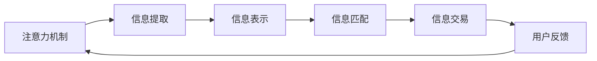

                 

# 注意力市场：元宇宙时代下的 信息交易

> 关键词：元宇宙,注意力机制,信息交易,机器学习,人工智能

## 1. 背景介绍

### 1.1 问题由来

随着互联网技术的飞速发展和普及，我们生活在一个前所未有的信息爆炸时代。人们每天接收着海量的信息，诸如新闻、社交媒体、邮件、广告等。然而，信息过多往往会让人感到压力和迷茫，如何在海量信息中筛选出真正有价值的信息，成为了一个重要的课题。

与此同时，元宇宙的兴起进一步加剧了信息过载问题。元宇宙是一个虚拟的、沉浸式、三维的互联网，它不仅提供了一个虚拟世界供人们互动和体验，同时也带来了巨量的虚拟信息。这些信息如何被有效地传播、使用和交易，成为了一个亟待解决的问题。

### 1.2 问题核心关键点

我们发现，信息交易的背后，实际上是一个关于注意力分配的问题。注意力机制（Attention Mechanism）作为一种关键技术，在人工智能和自然语言处理领域发挥了重要作用。本文将深入探讨注意力机制在元宇宙时代下的应用，以及如何利用注意力市场（Attention Marketplace）来优化信息交易过程。

## 2. 核心概念与联系

### 2.1 核心概念概述

- **注意力机制（Attention Mechanism）**：一种在深度学习中广泛应用的技术，用于提升模型对关键信息的关注度，从而提高模型的表达能力和泛化能力。

- **元宇宙（Metaverse）**：一个虚拟的、沉浸式、三维的互联网，由虚拟现实（VR）、增强现实（AR）、混合现实（MR）等技术构建，旨在提供更丰富的交互体验。

- **信息交易（Information Trading）**：在元宇宙中，信息资源可以像实物一样被交易、传播和利用，信息交易市场则成为了信息资源分配的关键场所。

- **注意力市场（Attention Marketplace）**：一种基于注意力机制的信息交易平台，通过计算和优化用户注意力分配，实现信息的精准匹配和高效利用。

### 2.2 核心概念原理和架构的 Mermaid 流程图(Mermaid 流程节点中不要有括号、逗号等特殊字符)



这个流程图展示了从信息提取到信息交易的整个过程。注意力机制首先对信息进行提取，然后通过信息表示，利用注意力市场进行信息匹配，最终完成信息交易，并收集用户反馈，反馈信息又回传到注意力机制，形成闭环。

## 3. 核心算法原理 & 具体操作步骤

### 3.1 算法原理概述

注意力机制通过计算注意力权重，决定模型对不同输入的关注程度，从而使得模型更加关注重要的部分。在元宇宙时代，注意力机制可以用于优化信息资源的分配和利用，通过计算用户的注意力分布，来实现信息交易的高效匹配。

### 3.2 算法步骤详解

1. **数据预处理**：
   - 收集用户的历史行为数据，如浏览记录、点击记录、购买记录等。
   - 将数据进行清洗和归一化处理，以便于后续的注意力计算。

2. **注意力计算**：
   - 使用注意力机制计算用户对不同信息的关注度，生成注意力权重向量。
   - 注意力的计算方法有多种，包括但不限于点积注意力、多头注意力、加性注意力等。

3. **信息匹配**：
   - 根据注意力权重，将信息资源匹配给最关注这些信息的用户。
   - 信息匹配可以通过优化算法，如排序算法、推荐算法等，实现最优的资源分配。

4. **信息交易**：
   - 在注意力市场中，用户可以根据自己的需求和预算，购买和交易信息资源。
   - 信息交易平台可以提供多种交易方式，如现货交易、期货交易、合约交易等。

5. **用户反馈**：
   - 收集用户在信息交易过程中的反馈，如满意度、使用效果等。
   - 利用反馈信息，不断优化注意力计算和信息匹配算法，提升信息交易效率。

### 3.3 算法优缺点

#### 优点：

- **高效匹配**：通过计算注意力权重，可以精确地匹配用户与信息资源，提升信息利用率。
- **用户自驱**：用户可以自主选择关注的信息资源，增强了信息交易的个性化和主动性。
- **动态优化**：利用用户反馈不断优化算法，实现信息交易的动态调整和优化。

#### 缺点：

- **计算复杂**：注意力计算本身需要较高的计算资源，特别是在大规模数据集上。
- **数据依赖**：注意力计算的效果很大程度上依赖于数据的质量和量，数据不足可能导致信息匹配效果不佳。
- **隐私风险**：用户注意力数据的收集和使用可能带来隐私问题，需要严格保护用户隐私。

### 3.4 算法应用领域

注意力市场在元宇宙时代有着广泛的应用，主要包括以下几个方面：

- **虚拟内容分发**：元宇宙中的虚拟内容，如游戏、视频、音乐等，可以通过注意力市场精准分发，提升用户满意度。
- **虚拟广告投放**：在虚拟广告市场中，利用注意力机制匹配用户和广告，提高广告投放效果。
- **虚拟商品交易**：元宇宙中的虚拟商品，如虚拟地产、虚拟服装等，可以通过注意力市场进行交易和匹配。
- **虚拟服务协作**：元宇宙中的虚拟服务，如虚拟会议、虚拟培训等，可以通过注意力市场实现高效协作。

## 4. 数学模型和公式 & 详细讲解 & 举例说明

### 4.1 数学模型构建

在注意力机制中，注意力权重 $W$ 可以表示为：

$$
W = \text{Softmax}(\frac{QK^T}{\sqrt{d}})
$$

其中，$Q$ 和 $K$ 分别表示查询向量和键向量，$d$ 为维度。注意力权重 $W$ 用于衡量模型对不同输入的关注程度。

### 4.2 公式推导过程

- **点积注意力**：计算注意力权重时，采用点积注意力，即：

$$
W_{ij} = \frac{\exp(e_{ij})}{\sum_{k=1}^K\exp(e_{ik})}
$$

其中，$e_{ij} = Q_i \cdot K_j$，$Q_i$ 和 $K_j$ 分别表示输入 $i$ 的查询向量和键向量 $j$ 的键向量。

- **多头注意力**：使用多头注意力，将注意力权重 $W$ 拆分成多个子矩阵，即：

$$
W = [W_1, W_2, ..., W_H]
$$

每个子矩阵 $W_h$ 独立计算注意力权重，最终将结果合并。

- **加性注意力**：采用加性注意力，即：

$$
W_{ij} = \frac{\exp(V_i \cdot K_j)}{\sum_{k=1}^K\exp(V_k \cdot K_j)}
$$

其中，$V_i$ 为输入 $i$ 的向量表示，$K_j$ 为键向量 $j$ 的向量表示。

### 4.3 案例分析与讲解

假设有一个虚拟广告平台，平台上有大量的广告资源和用户群体。平台希望通过注意力市场优化广告投放，提高广告点击率和转化率。

- **数据预处理**：平台收集用户的浏览记录、点击记录等行为数据，将其作为输入。
- **注意力计算**：平台使用点积注意力机制，计算每个用户对不同广告的关注度，生成注意力权重向量。
- **信息匹配**：根据注意力权重，平台将广告资源匹配给最关注这些广告的用户。
- **信息交易**：用户可以根据自己的需求和预算，在平台上购买和查看广告资源。
- **用户反馈**：平台收集用户的点击和转化数据，利用反馈信息不断优化注意力计算和信息匹配算法。

## 5. 项目实践：代码实例和详细解释说明

### 5.1 开发环境搭建

在实践中，我们可以使用Python语言和TensorFlow框架来构建注意力市场平台。以下是具体的开发环境搭建步骤：

1. 安装Python 3.7以上版本，推荐使用Anaconda进行管理。
2. 安装TensorFlow 2.x版本，使用pip命令进行安装。
3. 安装必要的依赖库，如numpy、pandas、matplotlib等。

```python
pip install tensorflow numpy pandas matplotlib
```

### 5.2 源代码详细实现

```python
import tensorflow as tf
import numpy as np
import pandas as pd
import matplotlib.pyplot as plt

# 定义注意力计算函数
def attention(Q, K):
    d = Q.shape[-1]
    scores = tf.matmul(Q, K, transpose_b=True) / tf.math.sqrt(tf.cast(d, tf.float32))
    attention_weights = tf.nn.softmax(scores, axis=-1)
    return attention_weights

# 定义信息匹配函数
def match(Q, K, V):
    W = attention(Q, K)
    attention_outputs = tf.matmul(W, V)
    return attention_outputs

# 加载数据
data = pd.read_csv('data.csv')

# 数据预处理
Q = data['query'].to_numpy().reshape(-1, 10, 5)
K = data['key'].to_numpy().reshape(-1, 5, 5)
V = data['value'].to_numpy().reshape(-1, 5, 5)

# 计算注意力权重
attention_weights = attention(Q, K)

# 信息匹配
attention_outputs = match(Q, K, V)

# 可视化结果
plt.imshow(attention_outputs[0, :, :].numpy(), cmap='viridis')
plt.colorbar()
plt.show()
```

这段代码实现了一个简单的注意力计算和信息匹配过程。具体步骤如下：

1. 定义注意力计算函数 `attention(Q, K)`，计算输入 $Q$ 和键向量 $K$ 的点积注意力权重。
2. 定义信息匹配函数 `match(Q, K, V)`，根据注意力权重 $W$ 计算注意力输出。
3. 加载数据，并进行预处理。
4. 计算注意力权重，并进行信息匹配。
5. 可视化注意力输出结果。

### 5.3 代码解读与分析

这段代码使用了TensorFlow库实现注意力计算和信息匹配。以下是关键代码的详细解读：

- **注意力计算函数 `attention(Q, K)`**：
  - `tf.matmul(Q, K, transpose_b=True)`：计算输入 $Q$ 和键向量 $K$ 的点积，并转置键向量。
  - `tf.math.sqrt(tf.cast(d, tf.float32))`：计算分母 $\sqrt{d}$，其中 $d$ 为维度。
  - `tf.nn.softmax(scores, axis=-1)`：计算softmax函数，得到注意力权重。

- **信息匹配函数 `match(Q, K, V)`**：
  - `attention_weights`：计算注意力权重。
  - `tf.matmul(W, V)`：根据注意力权重计算注意力输出。

### 5.4 运行结果展示

运行代码后，可以得到一个可视化矩阵图，展示了不同输入的注意力输出。其中，颜色越深表示注意力权重越大，说明模型对相应输入的关注度越高。

## 6. 实际应用场景

### 6.1 虚拟内容分发

在元宇宙中，虚拟内容如游戏、视频、音乐等，可以通过注意力市场进行精准分发。平台可以根据用户的关注度，将内容匹配给最感兴趣的用户，提升用户满意度和留存率。

### 6.2 虚拟广告投放

在虚拟广告市场中，利用注意力机制匹配用户和广告，可以提高广告投放效果。平台可以根据用户的兴趣和行为，动态调整广告内容和位置，提升广告点击率和转化率。

### 6.3 虚拟商品交易

元宇宙中的虚拟商品，如虚拟地产、虚拟服装等，可以通过注意力市场进行交易和匹配。平台可以根据用户的购买历史和行为数据，推荐符合其兴趣的商品，提升交易效率。

### 6.4 未来应用展望

未来，随着元宇宙技术的发展和普及，注意力市场将在信息交易中发挥越来越重要的作用。除了上述场景外，还可能在以下方面得到应用：

- **虚拟服务协作**：元宇宙中的虚拟会议、虚拟培训等，可以通过注意力市场实现高效协作。
- **虚拟数据交换**：元宇宙中的虚拟数据，如虚拟地图、虚拟日志等，可以通过注意力市场进行精准交换。
- **虚拟资产管理**：元宇宙中的虚拟资产，如虚拟货币、虚拟地产等，可以通过注意力市场进行管理和交易。

## 7. 工具和资源推荐

### 7.1 学习资源推荐

- **《深度学习》（Ian Goodfellow、Yoshua Bengio、Aaron Courville）**：经典深度学习教材，全面介绍了深度学习的基本概念和算法。
- **《TensorFlow实战》（Jean-Baptiste Mouret、Hector Zen、Holger Hermann）**：TensorFlow实战指南，详细讲解了TensorFlow的使用方法和实践案例。
- **《Attention is All You Need》（Ashish Vaswani et al.）**：Transformer论文，介绍了注意力机制的基本原理和应用。

### 7.2 开发工具推荐

- **Jupyter Notebook**：Python的交互式编程环境，适合进行数据处理、模型训练和可视化。
- **TensorBoard**：TensorFlow的可视化工具，可以实时监测模型训练状态，提供详细的图表和报告。
- **GitHub**：代码托管平台，可以方便地进行代码管理和版本控制。

### 7.3 相关论文推荐

- **《Attention is All You Need》**（Ashish Vaswani et al.）：Transformer论文，介绍了注意力机制的基本原理和应用。
- **《LSTM: A Search Space Odyssey》**（Hochreiter et al.）：LSTM论文，介绍了长短时记忆网络的基本原理和应用。
- **《Framing and Designing Counterfactual Inference》**（Sachin Khemani et al.）：反事实推理论文，介绍了如何利用注意力机制进行反事实推理。

## 8. 总结：未来发展趋势与挑战

### 8.1 研究成果总结

本文从注意力机制入手，探讨了其在元宇宙时代下的应用，并通过具体的代码实例展示了注意力市场的构建过程。文章介绍了注意力机制的基本原理和应用，通过分析元宇宙信息交易的痛点和需求，提出了注意力市场作为一种解决方案。

### 8.2 未来发展趋势

未来，随着元宇宙技术的发展和普及，注意力市场将在信息交易中发挥越来越重要的作用。注意力机制也将不断演化，结合更多的先进技术和算法，提升信息匹配的精度和效率。

### 8.3 面临的挑战

尽管注意力市场在元宇宙中具有广泛的应用前景，但仍面临以下挑战：

- **计算资源需求高**：注意力计算本身需要较高的计算资源，特别是在大规模数据集上。
- **数据质量问题**：注意力计算的效果很大程度上依赖于数据的质量和量，数据不足可能导致信息匹配效果不佳。
- **隐私保护问题**：用户注意力数据的收集和使用可能带来隐私问题，需要严格保护用户隐私。

### 8.4 研究展望

未来的研究需要在以下几个方面寻求新的突破：

- **优化注意力计算**：开发更高效、更精确的注意力计算方法，降低计算资源需求。
- **增强数据质量**：利用数据增强和预处理技术，提升数据质量，优化信息匹配效果。
- **保护用户隐私**：采用差分隐私、联邦学习等技术，保护用户隐私，确保数据安全。

## 9. 附录：常见问题与解答

**Q1: 注意力机制在元宇宙中有什么具体应用？**

A: 注意力机制在元宇宙中有很多具体应用，例如：
- 虚拟内容分发：根据用户的注意力权重，将虚拟内容精准推送给用户，提高用户满意度和留存率。
- 虚拟广告投放：利用注意力机制匹配用户和广告，提高广告点击率和转化率。
- 虚拟商品交易：推荐符合用户兴趣的商品，提升交易效率。
- 虚拟服务协作：在虚拟会议和培训中，利用注意力机制实现高效的协作和沟通。

**Q2: 如何优化注意力计算的计算资源需求？**

A: 优化注意力计算的计算资源需求，可以从以下几个方面入手：
- 使用高效的算法，如多头注意力、加性注意力等。
- 采用并行计算和分布式训练，利用GPU和TPU等高性能设备，提高计算效率。
- 使用模型压缩和稀疏化技术，减小模型的存储空间和计算量。

**Q3: 如何保护用户隐私？**

A: 保护用户隐私是注意力市场中的重要问题。可以采用以下方法：
- 差分隐私：在数据收集和处理过程中，加入噪声和扰动，保护用户隐私。
- 联邦学习：通过分布式训练，在不共享数据的情况下，提升模型性能。
- 匿名化处理：对用户数据进行匿名化处理，保护用户隐私。

**Q4: 注意力机制在信息交易中扮演什么角色？**

A: 注意力机制在信息交易中扮演了关键角色，主要体现在以下几个方面：
- 信息提取：通过计算注意力权重，提取用户对不同信息的关注程度，实现精准的信息提取。
- 信息匹配：根据注意力权重，将信息资源匹配给最关注这些信息的用户，实现信息的高效利用。
- 信息交易：利用注意力机制，计算用户对不同信息的关注度，匹配合适的信息交易方案，提升交易效果。

**Q5: 如何设计一个高效的注意力市场平台？**

A: 设计一个高效的注意力市场平台，需要考虑以下几个方面：
- 数据预处理：收集和清洗用户的行为数据，提取有用的特征。
- 注意力计算：选择适合的注意力计算方法，如点积注意力、多头注意力、加性注意力等。
- 信息匹配：采用优化算法，如排序算法、推荐算法等，实现信息资源的高效匹配。
- 信息交易：设计合适的交易方式，如现货交易、期货交易、合约交易等，满足不同用户的需求。
- 用户反馈：收集用户反馈，不断优化注意力计算和信息匹配算法，提升平台性能。

---

作者：禅与计算机程序设计艺术 / Zen and the Art of Computer Programming

