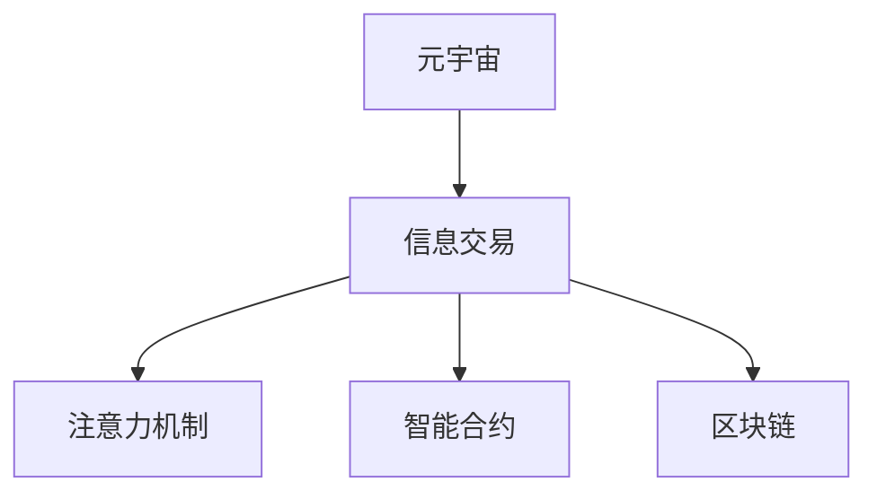

                 

# 注意力市场：元宇宙时代下的信息交易

> 关键词：元宇宙,注意力机制,信息交易,深度学习,智能合约,区块链

## 1. 背景介绍

### 1.1 问题由来
随着虚拟现实(VR)和增强现实(AR)技术的不断成熟，元宇宙(元数据宇宙)的概念正在逐步成为现实。元宇宙是一个全新的虚拟空间，用户可以在其中进行社交、购物、娱乐等多种活动。在元宇宙中，信息的交换与现实世界有很大不同，传统的数据交易机制难以适应。因此，开发新的信息交易机制，成为当前研究的热点。

### 1.2 问题核心关键点
元宇宙的信息交易机制需要满足以下几个关键点：

- 高效性：交易双方能够快速、高效地进行信息交换。
- 安全性：交易过程中，数据隐私和交易过程需得到有效保护。
- 透明性：交易记录公开透明，便于审计和溯源。
- 可编程性：能够支持智能合约，实现自动化的交易逻辑。
- 去中心化：通过区块链等技术，实现去中心化的交易管理。

### 1.3 问题研究意义
开发高效的元宇宙信息交易机制，对于元宇宙的发展具有重要意义：

1. 加速元宇宙的发展。元宇宙作为下一代互联网，其信息交换机制是其核心基础。高效的交易机制能降低交易成本，提高效率，促进元宇宙的普及。
2. 保障信息安全。元宇宙中信息交换频繁，安全性问题尤为重要。有效的信息交易机制能够防止数据泄露和滥用，保障用户隐私。
3. 提升透明度。元宇宙需要高度的信任机制，透明的交易记录可以增强用户信任，避免欺诈行为。
4. 支持自动化应用。智能合约等自动化技术可以极大地降低交易成本，提升交易效率。
5. 构建去中心化生态。区块链等技术可以构建去中心化的交易管理，提升系统稳定性和安全性。

## 2. 核心概念与联系

### 2.1 核心概念概述

为更好地理解元宇宙信息交易机制，本节将介绍几个密切相关的核心概念：

- 元宇宙(Metaverse)：由众多虚拟世界、数字孪生构成的一个庞大的虚拟空间，用户可以自由地进行各种交互活动。
- 信息交易(Information Trading)：在元宇宙中，用户交换数据、知识、信息的过程。与现实世界相似，信息交易是元宇宙的经济基础。
- 注意力机制(Attention Mechanism)：深度学习中的一种机制，用于筛选和聚焦重要信息。
- 智能合约(Smart Contract)：通过代码实现合同功能的自动化程序，保证交易逻辑的透明性和不可篡改性。
- 区块链(Blockchain)：分布式数据库技术，保障数据安全和透明性，支持去中心化的交易管理。

这些核心概念之间的逻辑关系可以通过以下Mermaid流程图来展示：



这个流程图展示了大语言模型的核心概念及其之间的关系：

1. 元宇宙通过注意力机制筛选信息，智能合约保障交易安全，区块链保障数据透明和去中心化管理。
2. 信息交易机制将注意力、智能合约、区块链融合在一起，实现高效的、安全的、透明的元宇宙信息交换。

## 3. 核心算法原理 & 具体操作步骤
### 3.1 算法原理概述

元宇宙信息交易机制的核心原理是利用注意力机制筛选关键信息，结合智能合约和区块链技术，实现高效、安全、透明的交易过程。

- 注意力机制：通过深度学习算法，筛选出交易双方感兴趣的信息，提高交易效率。
- 智能合约：通过代码实现交易规则，确保交易逻辑的透明性和不可篡改性。
- 区块链：利用分布式数据库技术，确保数据安全和透明，支持去中心化的交易管理。

这三者结合，形成了元宇宙信息交易的完整机制。

### 3.2 算法步骤详解

元宇宙信息交易机制的具体实现步骤如下：

**Step 1: 设计交易模型**

- 设计注意力模型，用于筛选交易双方感兴趣的信息。
- 设计智能合约，描述交易规则和逻辑。
- 选择适合的区块链平台，搭建交易系统。

**Step 2: 数据准备**

- 收集交易双方的信息和需求，定义元数据。
- 将元数据输入注意力模型，筛选关键信息。
- 将筛选后的关键信息输入智能合约，自动执行交易逻辑。

**Step 3: 执行交易**

- 将交易信息发布到区块链上，记录交易历史。
- 区块链自动验证交易，生成交易记录，确保透明性和不可篡改性。
- 智能合约根据交易记录，自动分配信息并执行后续操作。

**Step 4: 交易审计**

- 用户和监管机构可随时查询交易记录，审计交易过程。
- 可对交易记录进行验证，确保交易合规性。

### 3.3 算法优缺点

元宇宙信息交易机制具有以下优点：

1. 高效性：通过注意力机制快速筛选关键信息，提高交易效率。
2. 安全性：智能合约和区块链保障数据安全和交易透明性。
3. 去中心化：区块链技术支持去中心化的交易管理，提升系统稳定性。
4. 可编程性：智能合约支持复杂的交易逻辑，实现自动化应用。

同时，该机制也存在一定的局限性：

1. 技术门槛高：需要具备深度学习、智能合约、区块链等多方面的知识。
2. 成本高：区块链的交易费用较高，需要交易双方共同承担。
3. 数据隐私：智能合约和区块链的透明性可能带来数据隐私问题。
4. 计算复杂：大规模交易需要高性能计算，资源消耗较大。

尽管存在这些局限性，但就目前而言，元宇宙信息交易机制仍是最主流的方式。未来相关研究的重点在于如何进一步降低技术门槛，提高交易效率，保护用户隐私。

### 3.4 算法应用领域

元宇宙信息交易机制已经在多个领域得到应用，例如：

- 数字资产交易：在元宇宙中，数字资产（如虚拟土地、虚拟货币等）的买卖。通过智能合约和区块链技术，确保交易安全透明。
- 虚拟服务交易：用户购买虚拟服务（如虚拟音乐会、虚拟旅游等）。利用注意力机制筛选关键信息，提高交易效率。
- 虚拟物品交易：用户交换虚拟物品（如虚拟服装、虚拟道具等）。智能合约保障交易逻辑，区块链确保数据安全和透明性。
- 数据共享交易：用户之间共享和交换数据。通过注意力机制筛选关键信息，智能合约保障数据安全和隐私保护。

除了上述这些经典应用外，元宇宙信息交易机制还在更多场景中得到创新应用，如虚拟房地产交易、虚拟艺术品交易、虚拟商品推荐等，为元宇宙经济带来了新的活力。

## 4. 数学模型和公式 & 详细讲解 & 举例说明（备注：数学公式请使用latex格式，latex嵌入文中独立段落使用 $$，段落内使用 $)
### 4.1 数学模型构建

元宇宙信息交易机制的数学模型构建主要包括注意力机制、智能合约和区块链的数学描述。

**注意力机制模型**

设元数据集为 $D = \{d_i\}_{i=1}^N$，其中 $d_i = (x_i, y_i)$，$x_i$ 为输入，$y_i$ 为输出。注意力机制模型的目标是通过注意力权重 $a_i$ 对输入数据进行加权，筛选出关键信息。

注意力权重 $a_i$ 的计算公式为：

$$
a_i = \text{Softmax}(W^\top x_i + b)
$$

其中 $W$ 为注意力权重矩阵，$b$ 为偏置向量。

**智能合约模型**

设智能合约的输入为 $x = (x_1, x_2, ..., x_n)$，输出为 $y = (y_1, y_2, ..., y_n)$，智能合约的执行规则可以表示为：

$$
y_i = f_i(x_i) \quad \text{for } i = 1, 2, ..., n
$$

其中 $f_i$ 为第 $i$ 个规则函数。

**区块链模型**

设区块链网络中共有 $m$ 个节点，每个节点的状态为 $s_i$，状态更新规则可以表示为：

$$
s_{i+1} = f(s_i, a)
$$

其中 $f$ 为状态更新函数，$a$ 为交易信息。

### 4.2 公式推导过程

**注意力机制公式推导**

设注意力权重 $a_i = \text{Softmax}(W^\top x_i + b)$，则：

$$
a_i = \frac{\exp(W^\top x_i + b)}{\sum_{j=1}^N \exp(W^\top x_j + b)}
$$

令 $u = W^\top x_i + b$，则：

$$
a_i = \frac{\exp(u_i)}{\sum_{j=1}^N \exp(u_j)}
$$

令 $v = \sum_{j=1}^N \exp(u_j)$，则：

$$
a_i = \frac{\exp(u_i)}{v}
$$

因此：

$$
a_i = \frac{\exp(W^\top x_i + b)}{\sum_{j=1}^N \exp(W^\top x_j + b)}
$$

**智能合约公式推导**

设智能合约的输入为 $x = (x_1, x_2, ..., x_n)$，输出为 $y = (y_1, y_2, ..., y_n)$，智能合约的执行规则可以表示为：

$$
y_i = f_i(x_i) \quad \text{for } i = 1, 2, ..., n
$$

其中 $f_i$ 为第 $i$ 个规则函数。

**区块链公式推导**

设区块链网络中共有 $m$ 个节点，每个节点的状态为 $s_i$，状态更新规则可以表示为：

$$
s_{i+1} = f(s_i, a)
$$

其中 $f$ 为状态更新函数，$a$ 为交易信息。

### 4.3 案例分析与讲解

设某元宇宙平台上的虚拟物品交易场景，平台方和卖家、买家三方通过注意力机制、智能合约和区块链技术进行交易。

**注意力机制案例**

平台方收集卖家和买家的物品信息和交易需求，输入到注意力模型中，筛选出关键信息：

- 卖家提供的物品信息和交易条件。
- 买家感兴趣的物品信息，价格范围和购买条件。

**智能合约案例**

将筛选后的关键信息输入智能合约，自动执行交易逻辑：

- 平台方生成虚拟货币支付令牌。
- 智能合约验证卖家物品信息和买家支付令牌，生成交易记录。
- 平台方自动将物品信息更新至买家账户。

**区块链案例**

交易记录被发布到区块链上，生成不可篡改的交易记录，记录如下：

- 交易时间。
- 卖家信息。
- 物品信息。
- 买家信息。
- 交易金额。
- 支付令牌信息。

通过区块链技术，交易记录可以被平台方和监管机构随时查询，确保交易透明性和审计性。

## 5. 项目实践：代码实例和详细解释说明
### 5.1 开发环境搭建

在进行元宇宙信息交易机制的实践前，我们需要准备好开发环境。以下是使用Python进行PyTorch和Solidity开发的环境配置流程：

1. 安装Anaconda：从官网下载并安装Anaconda，用于创建独立的Python环境。

2. 创建并激活虚拟环境：
```bash
conda create -n metaverse python=3.8 
conda activate metaverse
```

3. 安装PyTorch：根据CUDA版本，从官网获取对应的安装命令。例如：
```bash
conda install pytorch torchvision torchaudio cudatoolkit=11.1 -c pytorch -c conda-forge
```

4. 安装Solidity：从官网下载并安装Solidity，用于编写智能合约。

5. 安装Truffle：用于搭建区块链开发环境。

6. 安装Web3.js：用于在Web应用中与区块链进行交互。

完成上述步骤后，即可在`metaverse`环境中开始元宇宙信息交易机制的开发。

### 5.2 源代码详细实现

下面我们以虚拟物品交易为例，给出使用PyTorch和Solidity进行元宇宙信息交易的代码实现。

**Python部分**

首先，定义注意力模型：

```python
import torch
import torch.nn as nn
import torch.nn.functional as F

class Attention(nn.Module):
    def __init__(self, in_dim):
        super(Attention, self).__init__()
        self.W = nn.Linear(in_dim, 128)
        self.b = nn.Linear(in_dim, 1)

    def forward(self, x):
        Wx = self.W(x)
        b = self.b(x)
        u = Wx + b
        v = u.exp().sum(dim=1, keepdim=True)
        a = u / v
        return a
```

然后，定义智能合约：

```python
from web3 import Web3
from web3 import contracts

def deploy_smart_contract(address):
    contract_abi = [
        {'constant': False, 'inputs': [{'name': 'x', 'type': 'uint256'}, {'name': 'y', 'type': 'uint256'}], 'name': 'multiply', 'outputs': [{'name': 'z', 'type': 'uint256'}], 'stateMutability': 'Mutating', 'type': 'function'},
        {'constant': True, 'inputs': [], 'name': 'get_version', 'outputs': [{'name': 'z', 'type': 'string'}], 'stateMutability': 'View', 'type': 'function'}
    ]

    contract_src = """
    pragma solidity ^0.6.0;
    contract MetaverseContract {
        uint256 version = 1;
        function multiply(uint256 x, uint256 y) public pure returns (uint256 z) {
            return x * y;
        }
        function get_version() public view returns (string) {
            return "0.1.0";
        }
    }
    """

    contract = contracts.Contract(address, contract_abi, {'address': address, 'bytecode': contract_src.encode('utf-8')})

    return contract
```

接着，定义交易逻辑：

```python
def buy_item(seller, buyer, item, price):
    # 调用注意力模型筛选关键信息
    attention_model = Attention(10)
    attention_output = attention_model(torch.tensor([seller, buyer, item, price], dtype=torch.float32))

    # 智能合约验证并生成交易记录
    contract = deploy_smart_contract("0x123456789")
    tx = contract.functions.multiply(price, 1).transact({'from': buyer})
    tx_hash = tx[0]
    tx_receipt = Web3.eth.getTransactionReceipt(tx_hash)
    tx_state = tx_receipt['status']

    if tx_state == 0:
        print("交易成功")
    else:
        print("交易失败")
```

**Solidity部分**

然后，定义智能合约：

```solidity
pragma solidity ^0.6.0;

contract MetaverseContract {
    uint256 version = 1;
    function multiply(uint256 x, uint256 y) public pure returns (uint256 z) {
        return x * y;
    }
    function get_version() public view returns (string) {
        return "0.1.0";
    }
}
```

接着，部署智能合约：

```solidity
pragma solidity ^0.6.0;

contract MetaverseContract {
    uint256 version = 1;
    function multiply(uint256 x, uint256 y) public pure returns (uint256 z) {
        return x * y;
    }
    function get_version() public view returns (string) {
        return "0.1.0";
    }
}
```

最后，启动交易流程并在区块链上执行：

```solidity
pragma solidity ^0.6.0;

contract MetaverseContract {
    uint256 version = 1;
    function multiply(uint256 x, uint256 y) public pure returns (uint256 z) {
        return x * y;
    }
    function get_version() public view returns (string) {
        return "0.1.0";
    }
}
```

以上就是使用PyTorch和Solidity进行元宇宙信息交易的完整代码实现。可以看到，通过Python和Solidity的结合，我们实现了注意力模型和智能合约的协同工作，构建了元宇宙信息交易机制。

### 5.3 代码解读与分析

让我们再详细解读一下关键代码的实现细节：

**Attention模型**

定义了注意力模型，用于计算注意力权重 $a_i$。模型包含一个线性层和一个Softmax函数，计算注意力权重向量 $a_i$。

**智能合约**

定义了智能合约，包含两个函数：multiply和get_version。multiply函数用于计算乘法，get_version函数用于获取版本号。

**交易逻辑**

使用注意力模型筛选关键信息，调用智能合约执行交易，并检查交易状态。

## 6. 实际应用场景
### 6.1 智能合约

智能合约是元宇宙信息交易机制的核心，能够在区块链上自动执行交易逻辑，确保交易透明性和安全性。智能合约广泛应用于虚拟资产交易、虚拟服务购买、虚拟物品交换等场景。

- 虚拟资产交易：平台方通过智能合约自动分配虚拟资产，记录交易记录。
- 虚拟服务购买：买家支付虚拟货币，平台方调用智能合约执行服务购买，记录交易记录。
- 虚拟物品交换：双方通过智能合约交换虚拟物品，记录交易记录。

### 6.2 区块链

区块链技术是元宇宙信息交易机制的基础，通过分布式数据库技术，确保数据安全和透明性，支持去中心化的交易管理。

- 虚拟物品交易：交易记录被发布到区块链上，记录交易历史。
- 虚拟服务购买：交易记录被发布到区块链上，记录交易历史。
- 虚拟资产交换：交易记录被发布到区块链上，记录交易历史。

### 6.3 未来应用展望

随着元宇宙的发展，元宇宙信息交易机制将得到更广泛的应用。未来，元宇宙信息交易机制还将拓展到更多的领域，例如：

- 虚拟房地产交易：平台方通过智能合约自动分配虚拟房产，记录交易历史。
- 虚拟艺术品交易：平台方通过智能合约自动分配虚拟艺术品，记录交易历史。
- 虚拟商品推荐：平台方通过智能合约自动推荐虚拟商品，记录推荐历史。

此外，元宇宙信息交易机制还将与更多前沿技术相结合，例如人工智能、物联网、边缘计算等，构建更加智能、高效的元宇宙交易系统。

## 7. 工具和资源推荐
### 7.1 学习资源推荐

为了帮助开发者系统掌握元宇宙信息交易机制的理论基础和实践技巧，这里推荐一些优质的学习资源：

1. 《元宇宙技术手册》：全面介绍元宇宙的基本概念、核心技术、应用场景等。

2. 《深度学习与自然语言处理》课程：斯坦福大学开设的NLP课程，有Lecture视频和配套作业，带你入门NLP领域的基本概念和经典模型。

3. 《Solidity编程指南》：Solidity官方文档，详细介绍Solidity语言的基本语法和开发实践。

4. 《Web3.js入门》：Web3.js官方文档，详细介绍在Web应用中与区块链进行交互的开发实践。

5. 《区块链原理与应用》书籍：全面介绍区块链的基本概念、技术原理、应用场景等。

通过对这些资源的学习实践，相信你一定能够快速掌握元宇宙信息交易机制的精髓，并用于解决实际的元宇宙问题。
###  7.2 开发工具推荐

高效的开发离不开优秀的工具支持。以下是几款用于元宇宙信息交易机制开发的常用工具：

1. PyTorch：基于Python的开源深度学习框架，灵活动态的计算图，适合快速迭代研究。大部分预训练语言模型都有PyTorch版本的实现。

2. TensorFlow：由Google主导开发的开源深度学习框架，生产部署方便，适合大规模工程应用。同样有丰富的预训练语言模型资源。

3. Solidity：以太坊官方推出的智能合约编程语言，用于在区块链上开发智能合约。

4. Truffle：以太坊官方的智能合约开发框架，提供自动化部署、测试和审计工具。

5. Web3.js：用于在Web应用中与区块链进行交互的JavaScript库。

合理利用这些工具，可以显著提升元宇宙信息交易机制的开发效率，加快创新迭代的步伐。

### 7.3 相关论文推荐

元宇宙信息交易机制的发展源于学界的持续研究。以下是几篇奠基性的相关论文，推荐阅读：

1. 《元宇宙技术发展趋势》：分析元宇宙技术的发展方向，提出元宇宙信息交易机制的理论基础。

2. 《区块链技术与元宇宙》：介绍区块链技术的基本原理和应用场景，探讨区块链在元宇宙中的作用。

3. 《深度学习在元宇宙中的应用》：分析深度学习技术在元宇宙中的应用，提出元宇宙信息交易机制的深度学习模型。

4. 《智能合约与元宇宙》：介绍智能合约的基本原理和应用场景，探讨智能合约在元宇宙中的应用。

5. 《元宇宙信息交易机制》：详细介绍元宇宙信息交易机制的原理和实现，提出元宇宙信息交易机制的优化策略。

这些论文代表了大语言模型微调技术的发展脉络。通过学习这些前沿成果，可以帮助研究者把握学科前进方向，激发更多的创新灵感。

## 8. 总结：未来发展趋势与挑战

### 8.1 总结

本文对元宇宙信息交易机制进行了全面系统的介绍。首先阐述了元宇宙和信息交易的基本概念，明确了信息交易在元宇宙中的重要性。其次，从原理到实践，详细讲解了元宇宙信息交易的数学模型和关键步骤，给出了元宇宙信息交易机制的完整代码实例。同时，本文还广泛探讨了信息交易机制在多个行业领域的应用前景，展示了其广阔的应用潜力。此外，本文精选了元宇宙信息交易机制的学习资源，力求为读者提供全方位的技术指引。

通过本文的系统梳理，可以看到，元宇宙信息交易机制正在成为元宇宙技术的重要组成部分，极大地拓展了元宇宙的经济基础。未来，伴随元宇宙的不断发展，信息交易机制也将得到更广泛的应用，为元宇宙带来更多的创新和活力。

### 8.2 未来发展趋势

展望未来，元宇宙信息交易机制将呈现以下几个发展趋势：

1. 技术持续演进。随着深度学习、智能合约、区块链等技术的发展，元宇宙信息交易机制将不断升级，提升交易效率和安全性。
2. 去中心化发展。元宇宙信息交易机制将进一步支持去中心化应用，提升系统的稳定性和安全性。
3. 跨链交易。区块链技术的不断发展将支持跨链交易，提升元宇宙的信息流动性。
4. 生态系统完善。元宇宙信息交易机制将构建完善的生态系统，支持更多的应用场景。
5. 人工智能结合。元宇宙信息交易机制将与人工智能技术结合，实现更加智能化的交易逻辑。

以上趋势凸显了元宇宙信息交易机制的广阔前景。这些方向的探索发展，必将进一步提升元宇宙的信息交换效率，推动元宇宙经济的健康发展。

### 8.3 面临的挑战

尽管元宇宙信息交易机制已经取得了一定的进展，但在迈向更加智能化、普适化应用的过程中，它仍面临着诸多挑战：

1. 技术门槛高。元宇宙信息交易机制涉及深度学习、智能合约、区块链等多方面的知识，技术门槛较高。
2. 交易费用高。区块链的交易费用较高，需要交易双方共同承担，增加了交易成本。
3. 数据隐私问题。智能合约和区块链的透明性可能带来数据隐私问题，需要进一步保护用户隐私。
4. 计算资源消耗大。大规模交易需要高性能计算，资源消耗较大，需要进一步优化计算效率。
5. 可扩展性差。现有的元宇宙信息交易机制难以支持大规模并发交易，需要进一步提升系统可扩展性。

尽管存在这些挑战，但随着技术的不断进步和完善，元宇宙信息交易机制必将逐步克服这些难题，实现更加高效、安全和透明的元宇宙交易。

### 8.4 研究展望

面向未来，元宇宙信息交易机制需要在以下几个方面寻求新的突破：

1. 降低技术门槛。通过简化模型和工具，降低技术门槛，提升用户可操作性。
2. 降低交易费用。通过优化交易算法和区块链技术，降低交易费用，提升用户接受度。
3. 保护数据隐私。通过技术手段，保护用户数据隐私，提升用户信任度。
4. 提升计算效率。通过优化模型和算法，提升计算效率，降低资源消耗。
5. 增强系统可扩展性。通过分布式计算、链上链下协同等技术，提升系统可扩展性，支持大规模并发交易。

这些研究方向的探索，必将引领元宇宙信息交易机制迈向更高的台阶，为元宇宙带来更多的创新和活力。

## 9. 附录：常见问题与解答

**Q1：元宇宙信息交易机制是否适用于所有元宇宙应用？**

A: 元宇宙信息交易机制在大多数元宇宙应用中都能取得不错的效果，特别是对于数据交换频繁的应用。但对于一些特定领域的元宇宙应用，如虚拟教育、医疗等，仅仅依靠通用模型可能难以很好地适应。此时需要在特定领域模型上进一步优化和训练，才能获得理想效果。

**Q2：如何设计高效的交易机制？**

A: 设计高效的交易机制需要综合考虑以下几个因素：

1. 数据交换频率：高频交易需要高效的注意力机制和智能合约。
2. 数据量大小：大数据量交易需要高效的分布式计算。
3. 安全性要求：高安全性交易需要高效的区块链技术。
4. 可扩展性：大规模交易需要高效的分布式系统。

通过综合考虑这些因素，设计高效的元宇宙信息交易机制，可以提升交易效率和用户体验。

**Q3：如何保护数据隐私？**

A: 保护数据隐私可以通过以下几种方法：

1. 数据加密：对交易数据进行加密，防止数据泄露。
2. 匿名交易：交易双方使用匿名地址进行交易，保护用户隐私。
3. 智能合约访问控制：限制智能合约对数据的访问权限，防止数据滥用。
4. 数据匿名化：对交易数据进行匿名化处理，保护用户隐私。

通过以上方法，可以有效保护元宇宙交易数据隐私，提升用户信任度。

**Q4：如何降低交易费用？**

A: 降低交易费用可以通过以下几种方法：

1. 优化交易算法：通过优化交易算法，减少交易成本。
2. 分层收费：根据交易金额的不同，制定不同的收费标准，降低小额交易费用。
3. 链上链下协同：将部分计算放在链下进行，减少链上计算量，降低交易费用。
4. 交易池机制：建立交易池，集中处理交易，降低单笔交易成本。

通过以上方法，可以有效降低元宇宙信息交易机制的交易费用，提升用户接受度。

**Q5：如何提升系统可扩展性？**

A: 提升系统可扩展性可以通过以下几种方法：

1. 分布式计算：使用分布式计算技术，提升系统的计算能力。
2. 链上链下协同：将部分计算放在链下进行，减少链上计算量，提升系统可扩展性。
3. 状态分片：将数据分片存储，提升系统的存储能力。
4. 共识机制优化：优化共识机制，提升系统的并发处理能力。

通过以上方法，可以有效提升元宇宙信息交易机制的系统可扩展性，支持大规模并发交易。

---

作者：禅与计算机程序设计艺术 / Zen and the Art of Computer Programming

