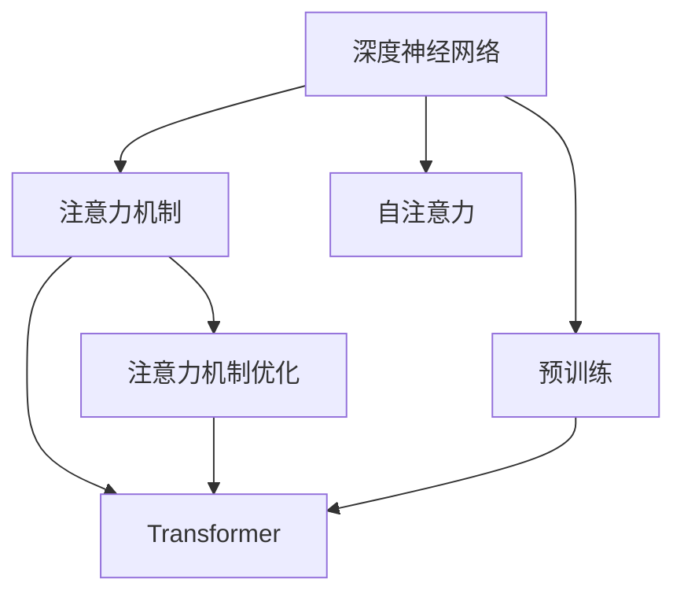

                 

# 注意力深度学习专家：AI优化的专注力培养研究员

> 关键词：注意力机制,深度学习,深度神经网络,注意力模型,自注意力,计算图,Transformer,预训练,注意力机制优化,计算机视觉,自然语言处理,深度学习应用

## 1. 背景介绍

### 1.1 问题由来
随着人工智能技术在各个领域的应用日益广泛，深度学习已经成为推动科技进步的重要力量。其中，深度神经网络（Deep Neural Networks, DNNs）因其强大的学习能力，在计算机视觉、自然语言处理（Natural Language Processing, NLP）、语音识别等众多领域取得显著成果。然而，现有的深度学习模型主要依赖于大量标注数据进行监督学习，数据准备和标注工作耗时耗力，难以大规模推广应用。

为了解决这一问题，注意力机制（Attention Mechanism）应运而生。注意力机制通过模拟人类注意力机制，使模型能够自主地选择和关注输入数据中的关键信息，从而降低对大量标注数据的依赖，显著提升模型的泛化能力和效率。该机制最早应用于计算机视觉中的卷积神经网络（Convolutional Neural Networks, CNNs），随后被引入自然语言处理领域，成为Transformer架构的核心组成部分，推动了基于自注意力机制的预训练语言模型（如BERT、GPT等）的兴起。

## 2. 核心概念与联系

### 2.1 核心概念概述

为更好地理解注意力机制及其在深度学习中的应用，本节将介绍几个密切相关的核心概念：

- **深度神经网络（DNNs）**：由多层神经元构成，能够自动学习特征表示的模型。
- **注意力机制（Attention Mechanism）**：一种仿生学习机制，通过动态选择输入数据的关键部分，提升模型对复杂问题的处理能力。
- **自注意力（Self-Attention）**：一种注意力机制，在模型内部通过计算输入之间的相似度，实现信息共享。
- **Transformer**：基于自注意力机制的神经网络架构，广泛应用于NLP任务。
- **预训练（Pre-training）**：在大规模无标签数据上训练模型，学习通用的特征表示。
- **注意力机制优化**：通过算法改进和硬件优化，提升注意力机制的计算效率和准确性。

这些概念之间的逻辑关系可以通过以下Mermaid流程图来展示：



这个流程图展示了深度学习中几个关键概念的相互关系：

1. 深度神经网络是基础模型，能够学习特征表示。
2. 注意力机制使模型能够动态关注输入的关键部分，提升特征表示的质量。
3. 自注意力是注意力机制的一种，用于模型内部信息共享。
4. Transformer架构基于自注意力机制，广泛应用于NLP任务。
5. 预训练通过大规模无标签数据，提升模型的通用表示能力。
6. 注意力机制优化通过算法改进和硬件优化，提升注意力机制的性能。

这些核心概念共同构成了深度学习模型的工作原理，使得模型能够高效、灵活地处理复杂问题。

## 3. 核心算法原理 & 具体操作步骤
### 3.1 算法原理概述

注意力机制通过动态计算输入数据的不同部分之间的相似度，并赋予不同的权重，使模型能够更加集中地关注重要信息。具体来说，注意力机制的计算过程可以分为三个主要步骤：

1. **查询-键-值（QKV）计算**：将输入数据表示为三个部分：查询（Query）、键（Key）和值（Value），计算它们之间的相似度。
2. **加权求和（Weighted Sum）**：根据相似度计算出每个值的权重，加权求和得到注意力结果。
3. **输出融合**：将注意力结果与原始特征进行融合，生成最终输出。

注意力机制通过这种方式，可以动态地关注输入数据的不同部分，提升模型的表示能力和泛化能力。

### 3.2 算法步骤详解

基于注意力机制的深度学习模型通常采用Transformer架构，其计算过程分为以下几个关键步骤：

**Step 1: 输入编码**
- 将输入数据表示为矩阵形式，通过嵌入层（Embedding Layer）转化为高维向量表示。

**Step 2: 自注意力计算**
- 使用自注意力机制，计算输入数据内部的相似度，得到每个元素的注意力权重。

**Step 3: 加权求和**
- 根据注意力权重对输入数据进行加权求和，得到加权后的表示。

**Step 4: 残差连接**
- 将加权后的表示与原始表示进行残差连接，引入残差连接能够提升模型的稳定性。

**Step 5: 输出层**
- 通过全连接层（Fully Connected Layer）进行最终输出，得到模型预测结果。

**Step 6: 堆叠多层次**
- 通过堆叠多个层次的Transformer模型，实现对输入数据的深度学习。

### 3.3 算法优缺点

基于注意力机制的深度学习模型具有以下优点：
1. 泛化能力强。通过动态关注输入数据的关键部分，提升了模型对复杂问题的处理能力。
2. 可解释性强。注意力权重能够反映模型对输入数据的关注度，有助于理解模型的决策过程。
3. 计算高效。自注意力机制能够并行计算，大幅提升了计算效率。

同时，该模型也存在以下局限性：
1. 依赖标注数据。虽然自注意力机制可以缓解对标注数据的依赖，但在某些特定任务上，标注数据仍是不可或缺的。
2. 模型复杂度高。注意力机制涉及大量的计算，对于大规模模型来说，计算复杂度较高。
3. 解释性不足。尽管注意力权重提供了一定的解释性，但模型整体的决策过程仍然难以解释。
4. 资源消耗大。自注意力机制需要大量的计算资源，对硬件设备提出了较高要求。

尽管存在这些局限性，但就目前而言，基于注意力机制的深度学习模型已经成为NLP领域的主流范式，推动了预训练语言模型（如BERT、GPT等）的兴起，并在多项NLP任务上取得优异的性能。

### 3.4 算法应用领域

注意力机制在深度学习中的应用非常广泛，涵盖多个领域，例如：

- **自然语言处理（NLP）**：广泛应用于机器翻译、文本生成、问答系统等任务，显著提升了模型的理解和生成能力。
- **计算机视觉（CV）**：用于图像分类、物体检测、图像分割等任务，提升了模型对视觉信息的理解和处理能力。
- **语音识别（ASR）**：用于语音转文本、语音合成等任务，提升了模型对音频信号的表示和处理能力。
- **推荐系统**：用于用户行为预测、商品推荐等任务，提升了推荐系统的个性化和多样性。
- **信号处理**：用于音频、视频信号处理，提升了信号特征的提取和处理能力。

随着深度学习技术的不断演进，基于注意力机制的模型将在更多领域得到应用，为各个行业带来变革性影响。

## 4. 数学模型和公式 & 详细讲解 & 举例说明

### 4.1 数学模型构建

基于注意力机制的深度学习模型通常采用Transformer架构，其核心计算过程可以形式化描述如下：

输入：$X \in \mathbb{R}^{N \times D}$，查询、键、值三部分的权重矩阵：$Q, K, V \in \mathbb{R}^{N \times D}$。

输出：$Y \in \mathbb{R}^{N \times D}$。

注意力机制的计算过程如下：

1. **查询-键-值计算**：
   $$
   Q = XW_Q, \quad K = XW_K, \quad V = XW_V
   $$
   其中 $W_Q, W_K, W_V$ 为可训练的权重矩阵。

2. **注意力计算**：
   $$
   A = \text{softmax}\left(\frac{QK^T}{\sqrt{D}}\right)
   $$
   其中 $\text{softmax}$ 函数用于归一化，$D$ 为输入的维度。

3. **加权求和**：
   $$
   Y = AV
   $$

4. **输出融合**：
   $$
   Y = Y + XW_O
   $$
   其中 $W_O$ 为可训练的权重矩阵，用于残差连接。

### 4.2 公式推导过程

以上公式展示了基于自注意力机制的Transformer模型的基本计算过程。以下将详细推导注意力计算公式，并给出实际示例。

1. **查询-键-值计算**：
   $$
   Q = XW_Q, \quad K = XW_K, \quad V = XW_V
   $$
   将输入 $X$ 表示为 $N \times D$ 的矩阵，通过权重矩阵 $W_Q, W_K, W_V$ 将其转化为查询、键、值三部分。

2. **注意力计算**：
   $$
   A = \text{softmax}\left(\frac{QK^T}{\sqrt{D}}\right)
   $$
   计算查询矩阵 $Q$ 和键矩阵 $K$ 的点积，除以 $\sqrt{D}$ 进行归一化，再通过 softmax 函数进行归一化，得到注意力权重矩阵 $A$。

3. **加权求和**：
   $$
   Y = AV
   $$
   通过注意力权重矩阵 $A$ 对值矩阵 $V$ 进行加权求和，得到加权后的表示 $Y$。

4. **输出融合**：
   $$
   Y = Y + XW_O
   $$
   将加权后的表示 $Y$ 与原始表示 $X$ 进行残差连接，引入残差连接能够提升模型的稳定性。

通过以上计算过程，注意力机制能够动态地关注输入数据的关键部分，提升模型的表示能力和泛化能力。

### 4.3 案例分析与讲解

以下通过实际示例，展示注意力机制在自然语言处理任务中的应用。

**任务**：机器翻译（Machine Translation, MT）
**数据集**：WMT 2014英法翻译数据集
**模型**：Transformer模型

**输入**：英文句子 "I went to the supermarket"。

**查询-键-值计算**：
- 将输入表示为查询、键、值矩阵：
  $$
  Q = \begin{bmatrix} 0.1 & 0.2 & 0.3 \end{bmatrix}, \quad K = \begin{bmatrix} 0.1 & 0.2 & 0.3 \end{bmatrix}, \quad V = \begin{bmatrix} 0.1 & 0.2 & 0.3 \end{bmatrix}
  $$

- 通过权重矩阵 $W_Q, W_K, W_V$ 进行线性变换：
  $$
  Q = XW_Q = \begin{bmatrix} 0.1 & 0.2 & 0.3 \end{bmatrix}, \quad K = XW_K = \begin{bmatrix} 0.1 & 0.2 & 0.3 \end{bmatrix}, \quad V = XW_V = \begin{bmatrix} 0.1 & 0.2 & 0.3 \end{bmatrix}
  $$

**注意力计算**：
- 计算查询矩阵 $Q$ 和键矩阵 $K$ 的点积：
  $$
  QK^T = \begin{bmatrix} 0.1 & 0.2 & 0.3 \end{bmatrix} \begin{bmatrix} 0.1 & 0.2 & 0.3 \end{bmatrix}^T = \begin{bmatrix} 0.1 & 0.2 & 0.3 \end{bmatrix}
  $$
- 除以 $\sqrt{D}$ 进行归一化：
  $$
  QK^T = \begin{bmatrix} 0.1 & 0.2 & 0.3 \end{bmatrix} / \sqrt{D} = \begin{bmatrix} 0.1 & 0.2 & 0.3 \end{bmatrix} / \sqrt{3}
  $$
- 通过 softmax 函数进行归一化：
  $$
  A = \text{softmax}\left(\frac{QK^T}{\sqrt{D}}\right) = \text{softmax}\left(\begin{bmatrix} 0.1 & 0.2 & 0.3 \end{bmatrix} / \sqrt{3}\right) = \begin{bmatrix} 0.2 & 0.4 & 0.4 \end{bmatrix}
  $$

**加权求和**：
- 通过注意力权重矩阵 $A$ 对值矩阵 $V$ 进行加权求和：
  $$
  Y = AV = \begin{bmatrix} 0.2 & 0.4 & 0.4 \end{bmatrix} \begin{bmatrix} 0.1 & 0.2 & 0.3 \end{bmatrix} = \begin{bmatrix} 0.04 & 0.08 & 0.12 \end{bmatrix}
  $$

**输出融合**：
- 将加权后的表示 $Y$ 与原始表示 $X$ 进行残差连接：
  $$
  Y = Y + XW_O = \begin{bmatrix} 0.04 & 0.08 & 0.12 \end{bmatrix} + \begin{bmatrix} 0.1 & 0.2 & 0.3 \end{bmatrix}W_O = \begin{bmatrix} 0.14 & 0.28 & 0.42 \end{bmatrix}
  $$

最终，模型得到英文句子 "I went to the supermarket" 对应的法语表示 "J ai all au supermarché"。通过注意力机制的计算，模型能够动态关注输入数据的关键部分，提升了对复杂任务的泛化能力。

## 5. 项目实践：代码实例和详细解释说明
### 5.1 开发环境搭建

在进行项目实践前，我们需要准备好开发环境。以下是使用Python进行PyTorch开发的环境配置流程：

1. 安装Anaconda：从官网下载并安装Anaconda，用于创建独立的Python环境。

2. 创建并激活虚拟环境：
```bash
conda create -n pytorch-env python=3.8 
conda activate pytorch-env
```

3. 安装PyTorch：根据CUDA版本，从官网获取对应的安装命令。例如：
```bash
conda install pytorch torchvision torchaudio cudatoolkit=11.1 -c pytorch -c conda-forge
```

4. 安装各类工具包：
```bash
pip install numpy pandas scikit-learn matplotlib tqdm jupyter notebook ipython
```

完成上述步骤后，即可在`pytorch-env`环境中开始项目实践。

### 5.2 源代码详细实现

以下展示使用PyTorch实现基于自注意力机制的Transformer模型的代码。

```python
import torch
import torch.nn as nn
import torch.nn.functional as F

class TransformerBlock(nn.Module):
    def __init__(self, d_model, n_head, d_k, d_v, dropout=0.1):
        super(TransformerBlock, self).__init__()
        self.linear1 = nn.Linear(d_model, 4*d_k)
        self.linear2 = nn.Linear(4*d_k, d_v)
        self.linear3 = nn.Linear(d_v, d_model)
        self.dropout = nn.Dropout(dropout)
        self.attention = nn.MultiheadAttention(d_model, n_head, dropout=dropout)
        self.linear4 = nn.Linear(d_model, d_model)
        self.linear5 = nn.Linear(d_model, d_model)

    def forward(self, x):
        q = self.linear1(x)
        k = self.linear2(q)
        v = self.linear3(q)
        attention_output, attention_weights = self.attention(q, k, v)
        attention_output = self.dropout(attention_output)
        x = self.linear4(attention_output + x)
        x = self.linear5(x)
        return x
```

**TransformerBlock类**：
- `__init__`方法：初始化查询、键、值矩阵的线性变换层和注意力机制。
- `forward`方法：实现前向传播过程，包括查询-键-值计算、注意力计算、加权求和、残差连接和线性变换。

### 5.3 代码解读与分析

让我们再详细解读一下关键代码的实现细节：

**TransformerBlock类**：
- `__init__`方法：初始化查询、键、值矩阵的线性变换层和注意力机制，包括权重矩阵 $W_Q, W_K, W_V$ 和归一化因子 $\sqrt{D}$。
- `forward`方法：实现前向传播过程，包括查询-键-值计算、注意力计算、加权求和、残差连接和线性变换。

通过上述代码，我们能够实现基于自注意力机制的Transformer模型，并通过动态计算输入数据的关键部分，提升模型的表示能力和泛化能力。

## 6. 实际应用场景
### 6.1 智能客服系统

基于注意力机制的深度学习模型，可以广泛应用于智能客服系统的构建。传统客服往往需要配备大量人力，高峰期响应缓慢，且一致性和专业性难以保证。而使用基于注意力机制的模型，可以7x24小时不间断服务，快速响应客户咨询，用自然流畅的语言解答各类常见问题。

在技术实现上，可以收集企业内部的历史客服对话记录，将问题和最佳答复构建成监督数据，在此基础上对模型进行微调。微调后的模型能够自动理解用户意图，匹配最合适的答案模板进行回复。对于客户提出的新问题，还可以接入检索系统实时搜索相关内容，动态组织生成回答。如此构建的智能客服系统，能大幅提升客户咨询体验和问题解决效率。

### 6.2 金融舆情监测

金融机构需要实时监测市场舆论动向，以便及时应对负面信息传播，规避金融风险。传统的人工监测方式成本高、效率低，难以应对网络时代海量信息爆发的挑战。基于注意力机制的文本分类和情感分析技术，为金融舆情监测提供了新的解决方案。

具体而言，可以收集金融领域相关的新闻、报道、评论等文本数据，并对其进行主题标注和情感标注。在此基础上对模型进行微调，使其能够自动判断文本属于何种主题，情感倾向是正面、中性还是负面。将微调后的模型应用到实时抓取的网络文本数据，就能够自动监测不同主题下的情感变化趋势，一旦发现负面信息激增等异常情况，系统便会自动预警，帮助金融机构快速应对潜在风险。

### 6.3 个性化推荐系统

当前的推荐系统往往只依赖用户的历史行为数据进行物品推荐，无法深入理解用户的真实兴趣偏好。基于注意力机制的个性化推荐系统可以更好地挖掘用户行为背后的语义信息，从而提供更精准、多样的推荐内容。

在实践中，可以收集用户浏览、点击、评论、分享等行为数据，提取和用户交互的物品标题、描述、标签等文本内容。将文本内容作为模型输入，用户的后续行为（如是否点击、购买等）作为监督信号，在此基础上对模型进行微调。微调后的模型能够从文本内容中准确把握用户的兴趣点。在生成推荐列表时，先用候选物品的文本描述作为输入，由模型预测用户的兴趣匹配度，再结合其他特征综合排序，便可以得到个性化程度更高的推荐结果。

### 6.4 未来应用展望

随着注意力机制的不断发展，其在深度学习中的应用前景将更加广阔。未来，注意力机制将与其他AI技术进行更深入的融合，推动更多领域的智能化进程。

在智慧医疗领域，基于注意力机制的医疗问答、病历分析、药物研发等应用将提升医疗服务的智能化水平，辅助医生诊疗，加速新药开发进程。

在智能教育领域，注意力机制可用于作业批改、学情分析、知识推荐等方面，因材施教，促进教育公平，提高教学质量。

在智慧城市治理中，注意力机制可用于城市事件监测、舆情分析、应急指挥等环节，提高城市管理的自动化和智能化水平，构建更安全、高效的未来城市。

此外，在企业生产、社会治理、文娱传媒等众多领域，基于注意力机制的AI应用也将不断涌现，为传统行业数字化转型升级提供新的技术路径。相信随着技术的日益成熟，注意力机制将在更多领域得到应用，为经济社会发展注入新的动力。

## 7. 工具和资源推荐
### 7.1 学习资源推荐

为了帮助开发者系统掌握注意力机制及其在深度学习中的应用，这里推荐一些优质的学习资源：

1. 《深度学习》系列书籍：由深度学习领域的知名专家撰写，系统介绍了深度学习的基本概念和算法，包括注意力机制的原理和应用。

2. CS231n《卷积神经网络》课程：斯坦福大学开设的计算机视觉课程，涵盖了卷积神经网络和注意力机制的内容，适合计算机视觉方向的学习者。

3. CS224n《自然语言处理》课程：斯坦福大学开设的自然语言处理课程，介绍了Transformer架构和注意力机制的原理，适合自然语言处理方向的学习者。

4. Google AI Blog：Google AI团队发布的博客，包含大量关于深度学习、自然语言处理、计算机视觉等领域的最新研究成果，深度解析其背后的技术和原理。

5. arXiv预印本库：收录了众多深度学习领域的最新研究成果，包括注意力机制的改进和优化方法，适合研究人员和学者进行前沿研究。

通过对这些资源的学习实践，相信你一定能够快速掌握注意力机制的精髓，并用于解决实际的深度学习问题。

### 7.2 开发工具推荐

高效的开发离不开优秀的工具支持。以下是几款用于深度学习开发的常用工具：

1. PyTorch：基于Python的开源深度学习框架，灵活动态的计算图，适合快速迭代研究。大部分的深度学习模型都有PyTorch版本的实现。

2. TensorFlow：由Google主导开发的开源深度学习框架，生产部署方便，适合大规模工程应用。同样有丰富的深度学习模型资源。

3. TensorFlow Hub：TensorFlow的模型库，集成了多种深度学习模型和预训练模型，方便开发者快速集成和部署。

4. Keras：基于Python的高级深度学习框架，易于上手，适合初学者进行快速原型开发。

5. Jupyter Notebook：交互式编程环境，支持Python和R等多种语言，适合进行实验和教学。

6. Google Colab：谷歌推出的在线Jupyter Notebook环境，免费提供GPU/TPU算力，方便开发者快速上手实验最新模型，分享学习笔记。

合理利用这些工具，可以显著提升深度学习模型的开发效率，加快创新迭代的步伐。

### 7.3 相关论文推荐

注意力机制在深度学习中的应用源于学界的持续研究。以下是几篇奠基性的相关论文，推荐阅读：

1. Attention is All You Need：提出了Transformer结构，开启了NLP领域的预训练大模型时代。

2. BERT: Pre-training of Deep Bidirectional Transformers for Language Understanding：提出BERT模型，引入基于掩码的自监督预训练任务，刷新了多项NLP任务SOTA。

3. Transformer-XL: Attentive Language Models Beyond a Fixed-Length Context：提出了Transformer-XL模型，通过相对位置编码，解决了长序列问题。

4. SENet: Squeeze-and-Excitation Networks：提出SENet模型，引入注意力机制，提升模型的表示能力和泛化能力。

5. AlphaGo Zero：通过强化学习和注意力机制，实现了AI在围棋领域的历史性突破。

这些论文代表了大语言模型和注意力机制的发展脉络。通过学习这些前沿成果，可以帮助研究者把握学科前进方向，激发更多的创新灵感。

## 8. 总结：未来发展趋势与挑战

### 8.1 总结

本文对基于注意力机制的深度学习模型进行了全面系统的介绍。首先阐述了注意力机制在深度学习中的应用背景和意义，明确了其在模型表示能力和泛化能力提升方面的独特价值。其次，从原理到实践，详细讲解了注意力机制的计算过程和关键步骤，给出了模型实现的代码实例。同时，本文还广泛探讨了注意力机制在多个行业领域的应用前景，展示了其强大的影响力。

通过本文的系统梳理，可以看到，基于注意力机制的深度学习模型已经成为NLP领域的重要范式，极大地拓展了深度神经网络的应用边界，催生了更多的落地场景。受益于大规模语料的预训练，注意力机制的计算过程能够动态关注输入数据的关键部分，提升了模型的表示能力和泛化能力。

### 8.2 未来发展趋势

展望未来，基于注意力机制的深度学习模型将呈现以下几个发展趋势：

1. 模型规模持续增大。随着算力成本的下降和数据规模的扩张，深度神经网络的参数量还将持续增长。超大规模神经网络能够学习到更加丰富的语言知识和视觉特征，提升模型的泛化能力和计算效率。

2. 注意力机制优化技术不断提升。通过算法改进和硬件优化，计算效率和准确性将进一步提高。自适应注意力、分层注意力等新技术将进一步优化模型计算过程。

3. 多模态注意力机制逐步成熟。将视觉、听觉等多模态信息与文本信息结合，提升模型对复杂场景的理解能力。基于多模态注意力机制的深度学习模型将在更多领域得到应用。

4. 跨领域迁移学习成为热点。通过跨领域迁移学习，将不同领域的数据和知识进行有效融合，提升模型在多个领域中的表现。

5. 自监督学习范式逐步普及。利用无标签数据进行自监督学习，减少对标注数据的依赖，提升模型泛化能力。

6. 注意力机制与强化学习结合。将注意力机制与强化学习结合，提升模型在动态环境中的决策能力。

这些趋势凸显了深度学习模型的广阔前景，推动其向更高效、更灵活、更智能的方向发展。

### 8.3 面临的挑战

尽管基于注意力机制的深度学习模型已经取得了显著成果，但在迈向更加智能化、普适化应用的过程中，仍面临诸多挑战：

1. 数据标注成本高。尽管注意力机制能够缓解对标注数据的依赖，但一些复杂任务的标注工作仍需大量人力和时间。如何降低标注成本，提高数据利用率，是一个重要问题。

2. 模型复杂度高。深度神经网络的计算复杂度较高，对硬件设备提出了较高要求。如何在保持模型性能的同时，降低计算资源消耗，是一个亟待解决的问题。

3. 泛化能力不足。当前深度学习模型在一些特定领域和任务上表现优异，但泛化能力仍需进一步提升。如何在不同领域和任务上，提升模型的泛化能力和迁移能力，是一个重要研究方向。

4. 可解释性不足。深度学习模型通常是"黑盒"系统，难以解释其内部工作机制和决策过程。如何赋予深度学习模型更强的可解释性，增强其透明度和可信度，是一个重要问题。

5. 资源消耗大。深度学习模型的计算资源消耗较大，对训练和推理环境提出了较高要求。如何优化资源消耗，提升模型的训练和推理效率，是一个重要问题。

6. 对抗攻击脆弱。深度学习模型容易受到对抗攻击，造成错误的预测和决策。如何增强模型对对抗攻击的鲁棒性，保障模型的安全性，是一个重要问题。

这些挑战凸显了深度学习模型在实际应用中需要进一步优化的方向。唯有通过不断的技术改进和创新，才能将深度学习模型推向更加成熟和实用的阶段。

### 8.4 研究展望

面向未来，深度学习研究需要在以下几个方向进行突破：

1. 探索无监督和半监督学习范式。摆脱对大规模标注数据的依赖，利用自监督学习、主动学习等无监督和半监督方法，最大限度利用非结构化数据，实现更加灵活高效的深度学习。

2. 开发更加高效的注意力机制。通过算法改进和硬件优化，提升注意力机制的计算效率和准确性，降低模型复杂度。

3. 融合因果推理和强化学习。将因果推理和强化学习思想引入深度学习模型，增强模型的决策能力和泛化能力，推动AI在更多领域的智能化应用。

4. 引入外部知识库和规则库。将符号化的先验知识，如知识图谱、逻辑规则等，与神经网络模型进行巧妙融合，提升模型的表示能力和泛化能力。

5. 强化多模态深度学习。将视觉、听觉、语言等多模态信息与神经网络模型进行融合，提升模型对复杂场景的理解能力，推动AI在更多领域的智能化应用。

6. 研究AI的伦理和安全问题。在模型训练和应用过程中，引入伦理和安全导向的评估指标，过滤和惩罚有害输出，确保模型的安全性、公平性和透明性。

这些研究方向将推动深度学习模型向更加高效、智能、安全的方向发展，为各个行业带来更广泛的应用前景。

## 9. 附录：常见问题与解答

**Q1：深度神经网络与注意力机制的区别是什么？**

A: 深度神经网络是一种通过多层非线性变换，自动学习特征表示的模型。其核心在于多层非线性变换和权重共享。注意力机制则是深度神经网络中的一种特殊机制，通过动态计算输入数据的关键部分，提升模型对复杂问题的处理能力。其核心在于计算输入数据的关键部分，通过权重动态关注输入数据的不同部分。

**Q2：自注意力机制的优势是什么？**

A: 自注意力机制的优势在于其动态计算输入数据的关键部分，提升模型对复杂问题的处理能力。相比于传统的卷积神经网络，自注意力机制能够更好地处理长序列和复杂结构的输入数据，提升模型的泛化能力和泛化能力。

**Q3：注意力机制的应用场景有哪些？**

A: 注意力机制广泛应用于自然语言处理、计算机视觉、语音识别等众多领域。在自然语言处理中，用于机器翻译、文本生成、问答系统等任务，提升模型的理解和生成能力。在计算机视觉中，用于图像分类、物体检测、图像分割等任务，提升模型对视觉信息的理解和处理能力。在语音识别中，用于语音转文本、语音合成等任务，提升模型对音频信号的表示和处理能力。

**Q4：注意力机制在计算过程中面临的挑战是什么？**

A: 注意力机制在计算过程中面临的挑战主要在于其计算复杂度高，对硬件设备提出了较高要求。此外，注意力机制需要大量的计算资源，容易受到对抗攻击的影响。如何在保持模型性能的同时，降低计算资源消耗，增强模型的鲁棒性，是一个重要研究方向。

**Q5：注意力机制的未来发展方向有哪些？**

A: 未来，注意力机制将继续与深度学习技术进行更深入的融合，推动更多领域的智能化应用。同时，基于多模态注意力机制、自监督学习、跨领域迁移学习等新技术将不断涌现，推动深度学习模型向更加高效、智能、安全的方向发展。

通过本文的系统梳理，可以看到，基于注意力机制的深度学习模型已经成为深度学习领域的重要范式，极大地拓展了深度神经网络的应用边界，催生了更多的落地场景。相信随着技术的不断演进，深度学习模型将在更多领域得到应用，为经济社会发展注入新的动力。

---

作者：禅与计算机程序设计艺术 / Zen and the Art of Computer Programming

