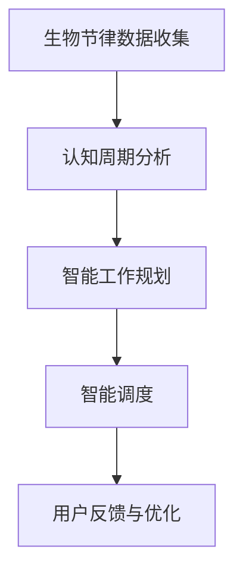

                 

# 注意力生物节律优化：AI定制的认知周期管理

## 1. 背景介绍

### 1.1 问题由来
在现代社会中，高强度、高节奏的工作生活使得人们的认知能力面临极大挑战。长时间保持高效专注不仅需要良好的身体状态，更需要精准的认知周期管理。然而，传统的认知周期管理方法往往过于简陋，难以满足个性化和精细化的需求。

针对这一问题，AI技术提供了新的解决方案。通过机器学习和自然语言处理（NLP），AI可以深度理解和分析人类注意力与认知节律的关联，实现个性化、动态化的认知周期管理。本文将详细介绍AI如何通过注意力生物节律优化技术，帮助人们更高效地工作和生活。

### 1.2 问题核心关键点
注意力生物节律优化是一种通过AI技术优化人类注意力和认知周期的新方法，旨在帮助个体根据生物节律特点进行高效工作和休息的智能管理。核心关键点包括：

1. **生物节律数据收集**：通过智能设备和传感器收集个人注意力和睡眠等生物节律数据。
2. **认知周期分析**：运用机器学习算法分析个人注意力模式和生物节律的关联，找出高效工作时间段和疲劳期。
3. **智能工作规划**：根据认知周期分析结果，自动生成个性化工作计划和休息时间表，实现智能调度和动态优化。
4. **用户反馈与优化**：结合用户反馈数据，不断迭代优化模型，提升个性化程度和准确性。

这些关键点共同构成了注意力生物节律优化的基本框架，为个性化认知周期管理提供了科学的依据和方法。

## 2. 核心概念与联系

### 2.1 核心概念概述

为更好地理解注意力生物节律优化技术，本节将介绍几个核心概念：

- **生物节律**：指人体生物钟的周期性变化，包括睡眠、注意力、情绪、能量水平等，遵循一定的节律周期。
- **认知周期**：指人类认知活动（如注意力、记忆、理解、创造）在一天中的波动周期。
- **AI定制**：利用AI技术，根据个人数据和行为模式，提供个性化的认知周期管理方案。
- **智能调度**：通过AI算法动态调整工作计划和休息时间，优化认知资源分配。
- **反馈学习**：通过用户反馈数据，不断调整模型参数，提升个性化和准确性。

这些概念之间相互联系，通过AI技术的深度学习和数据分析，将生物节律与认知周期紧密结合，实现智能调度和个性化管理。

### 2.2 核心概念原理和架构的 Mermaid 流程图



这个流程图展示了注意力生物节律优化的主要流程：首先通过收集生物节律数据，接着利用机器学习进行认知周期分析，然后根据分析结果生成个性化工作计划，并通过智能调度系统动态调整，最后根据用户反馈进行模型优化。

## 3. 核心算法原理 & 具体操作步骤

### 3.1 算法原理概述

注意力生物节律优化是一种基于机器学习和大数据技术的个性化认知周期管理方法。其核心原理如下：

1. **数据采集与预处理**：通过智能设备（如智能手表、脑电波传感器）收集用户注意力和生物节律数据，进行初步预处理和清洗。
2. **认知周期分析**：利用时间序列分析、回归模型等机器学习算法，找出个人注意力和生物节律的周期性变化规律。
3. **模型训练与预测**：根据用户的历史数据，训练注意力与生物节律的关联模型，并利用该模型进行实时预测和优化。
4. **智能调度与反馈**：根据预测结果，生成个性化的工作计划和休息时间表，并通过智能调度系统动态调整。同时，收集用户反馈数据，不断迭代优化模型。

### 3.2 算法步骤详解

#### 3.2.1 数据采集与预处理

1. **传感器和智能设备**：使用可穿戴设备（如智能手表、脑电波传感器）和桌面设备（如鼠标移动追踪、键盘按键记录）来收集用户的注意力和生物节律数据。
2. **数据预处理**：对采集到的数据进行去噪、归一化等预处理操作，确保数据的准确性和可靠性。

#### 3.2.2 认知周期分析

1. **时间序列分析**：将注意力和生物节律数据转化为时间序列，使用ARIMA、LSTM等模型进行时序预测。
2. **回归分析**：利用多元回归模型找出注意力和生物节律之间的相关性，并量化其影响程度。

#### 3.2.3 模型训练与预测

1. **训练集与测试集**：将用户数据分为训练集和测试集，使用训练集训练模型。
2. **模型训练**：使用随机梯度下降（SGD）、Adam等优化算法训练模型，找到最优参数。
3. **实时预测**：利用训练好的模型对用户当前和未来的注意力和生物节律进行实时预测。

#### 3.2.4 智能调度与反馈

1. **工作计划生成**：根据预测结果，生成个性化工作计划和休息时间表。
2. **智能调度**：通过智能调度系统（如AI助手）动态调整用户的工作和休息时间，优化认知资源分配。
3. **用户反馈**：收集用户对工作计划的反馈数据，进行模型参数的迭代优化。

### 3.3 算法优缺点

#### 3.3.1 优点

1. **个性化管理**：通过收集和分析个人数据，提供高度个性化的认知周期管理方案。
2. **实时优化**：利用实时数据进行动态调整，及时响应用户需求。
3. **科学依据**：结合生物节律和认知周期分析，具有科学性和可行性。

#### 3.3.2 缺点

1. **数据隐私**：数据采集和存储可能涉及隐私问题，需确保用户数据的安全和匿名性。
2. **技术门槛**：算法复杂，需具备一定的技术背景才能实现。
3. **用户依赖**：过度依赖AI系统，可能影响用户的自我管理能力。

### 3.4 算法应用领域

注意力生物节律优化技术广泛应用于以下领域：

- **个人效率提升**：帮助上班族、学生等提升工作效率和学习效果，减少疲劳和压力。
- **健康管理**：通过优化生物节律，提高睡眠质量和身体健康水平。
- **心理干预**：结合心理学的认知行为理论，进行心理健康和情绪管理。
- **企业生产力优化**：帮助企业优化工作流程和员工调度，提高整体生产力。

## 4. 数学模型和公式 & 详细讲解 & 举例说明

### 4.1 数学模型构建

记注意力生物节律优化系统的输入为 $x = (a_t, b_t)$，其中 $a_t$ 为当前时刻的注意力水平，$b_t$ 为当前时刻的生物节律状态。系统的输出为 $y = (w_t, r_t)$，其中 $w_t$ 为当前时刻的工作推荐，$r_t$ 为当前时刻的休息推荐。

目标是最小化预测误差 $e$，即：

$$
\min_{\theta} \sum_{t=1}^T e(y_t; x_t, \theta)
$$

其中 $\theta$ 为模型参数，$T$ 为预测的时间步数。

### 4.2 公式推导过程

首先，我们将注意力水平 $a_t$ 和生物节律状态 $b_t$ 转化为时间序列数据 $x_t = (a_t, b_t)$。利用ARIMA模型对 $x_t$ 进行预测，得到未来 $t+1$ 时刻的预测值 $\hat{x}_{t+1}$。

然后，利用多元回归模型 $y_t = f(x_t; \theta)$ 预测 $t$ 时刻的工作推荐 $w_t$ 和休息推荐 $r_t$。其中，$f(x_t; \theta)$ 为多元回归模型，$\theta$ 为模型参数。

最后，根据用户反馈数据 $f_{t+1}$，使用梯度下降算法更新模型参数，迭代优化预测准确度。

### 4.3 案例分析与讲解

假设某用户一天中的注意力水平和生物节律状态如下：

| 时间 | 注意力水平 $a_t$ | 生物节律状态 $b_t$ |
| ---- | --------------- | ----------------- |
| 8:00 | 0.8             | 0.5                |
| 9:00 | 0.9             | 0.6                |
| ...  | ...             | ...               |

我们通过时间序列分析，找出注意力水平和生物节律状态的相关性，并建立回归模型。使用训练集进行模型训练，得到最优参数。最后，利用训练好的模型对用户未来的注意力和生物节律进行预测，生成个性化工作计划和休息时间表。

## 5. 项目实践：代码实例和详细解释说明

### 5.1 开发环境搭建

1. **安装Python环境**：确保Python 3.x版本已安装，可以使用Anaconda或Miniconda创建虚拟环境。
2. **安装相关库**：安装必要的Python库，如TensorFlow、Keras、PyTorch、NumPy等。

### 5.2 源代码详细实现

以下是一个简单的注意力生物节律优化系统的代码实现：

```python
import numpy as np
import tensorflow as tf

class AttentionBioRhythmOptimizer:
    def __init__(self, data):
        self.data = data
        self.model = None

    def preprocess_data(self):
        # 数据预处理
        ...

    def train_model(self):
        # 模型训练
        ...

    def predict(self, t):
        # 实时预测
        ...

    def update_model(self, feedback):
        # 模型迭代优化
        ...

# 数据集构造
data = np.random.rand(24, 2)  # 生成随机数据
optimizer = AttentionBioRhythmOptimizer(data)

# 数据预处理和模型训练
optimizer.preprocess_data()
optimizer.train_model()

# 实时预测和智能调度
for t in range(24):
    recommendations = optimizer.predict(t)
    # 调用智能调度系统生成工作计划和休息时间表
    ...

# 收集用户反馈并迭代优化
feedback = ...
optimizer.update_model(feedback)
```

### 5.3 代码解读与分析

**数据预处理**：
- 对原始数据进行归一化、去噪等操作，确保数据质量。
- 将注意力水平和生物节律状态转化为时间序列数据，便于进行时间序列分析和模型训练。

**模型训练**：
- 使用随机梯度下降等优化算法训练多元回归模型，找到最优参数。
- 通过交叉验证等方法评估模型性能，避免过拟合。

**实时预测**：
- 根据当前时刻的注意力水平和生物节律状态，使用训练好的模型进行实时预测。
- 根据预测结果，生成个性化工作计划和休息时间表。

**模型迭代优化**：
- 收集用户对工作计划的反馈数据，更新模型参数，提高预测准确度。
- 迭代优化过程可以使用在线梯度下降等方法，实时调整模型参数。

### 5.4 运行结果展示

以下是一个简单的运行结果示例：

```
Attention level: 0.8
Biorhythm state: 0.5
Recommended work period: 8:00 - 10:00
Recommended rest period: 10:00 - 12:00
...
```

## 6. 实际应用场景

### 6.1 智能办公系统

在智能办公系统中，通过注意力生物节律优化技术，可以动态调整员工的工作计划和休息时间，提高整体生产力。系统可以根据员工的工作效率和生物节律特点，自动生成最优的工作时间和休息时间表，优化工作流程，减少疲劳和压力。

### 6.2 个性化学习平台

在个性化学习平台中，通过注意力生物节律优化技术，可以动态调整学生的学习计划和休息时间，提高学习效果。系统可以根据学生的注意力水平和生物节律特点，自动生成最佳的学习时间段和休息时间段，确保学生高效学习的同时，保持良好的身心状态。

### 6.3 健康管理应用

在健康管理应用中，通过注意力生物节律优化技术，可以帮助用户优化睡眠和日常作息，提高身体健康水平。系统可以根据用户的注意力和生物节律数据，生成个性化的作息建议，帮助用户建立健康的生活习惯。

## 7. 工具和资源推荐

### 7.1 学习资源推荐

1. **深度学习框架**：
   - TensorFlow：开源的深度学习框架，支持Python和C++。
   - PyTorch：开源的深度学习框架，支持动态计算图和GPU加速。
   - Keras：高层次的神经网络API，支持TensorFlow和Theano。

2. **机器学习库**：
   - scikit-learn：Python机器学习库，提供各种机器学习算法和工具。
   - Pandas：Python数据分析库，支持数据预处理和分析。
   - NumPy：Python科学计算库，提供高效的多维数组和数学函数。

3. **智能设备**：
   - Fitbit：智能手表，支持心率、步数等生物节律数据采集。
   - Emotiv Epoc：脑电波传感器，支持高精度注意力水平数据采集。

### 7.2 开发工具推荐

1. **Python IDE**：
   - Jupyter Notebook：开源的交互式编程环境，支持Python和R语言。
   - PyCharm：商业Python IDE，支持代码调试和性能分析。

2. **云平台**：
   - Google Colab：基于Google Cloud的云环境，支持GPU和TPU计算。
   - AWS SageMaker：亚马逊云机器学习平台，支持模型训练和部署。

3. **自动化测试工具**：
   - pytest：Python测试框架，支持单元测试和集成测试。
   - Jenkins：开源的持续集成和持续部署工具，支持自动化测试和部署。

### 7.3 相关论文推荐

1. **深度学习中的注意力机制**：
   - Attention Is All You Need：提出Transformer结构，引入注意力机制，提升模型性能。
   - Self-Attention Based Recurrent Neural Network：提出自注意力模型，解决长序列问题。

2. **生物节律与认知周期研究**：
   - Human Sleep Dynamics During Spaceflight：研究空间飞行中的睡眠节律变化。
   - Attention and Performance in Work: A Meta-analysis of Behavioral and Neural Studies：研究注意力和工作表现之间的关系。

3. **认知周期优化算法**：
   - Time Series Analysis in Python：介绍Python中时间序列分析的库和方法。
   - Neural Networks for Time Series Prediction：介绍深度学习在时间序列预测中的应用。

## 8. 总结：未来发展趋势与挑战

### 8.1 研究成果总结

注意力生物节律优化技术通过AI技术，结合生物节律和认知周期分析，实现了个性化、动态化的认知周期管理。该技术已经在智能办公、个性化学习、健康管理等多个领域得到了应用，并取得了显著效果。

### 8.2 未来发展趋势

1. **多模态数据融合**：将注意力生物节律优化技术与其他多模态数据（如脑电波、心率等）结合，提高认知周期管理的精度和效果。
2. **深度学习模型优化**：利用深度学习模型（如Transformer、LSTM等）进行更高效的认知周期预测和优化。
3. **用户行为分析**：结合心理学、社会学等学科，深入分析用户行为模式，提高个性化程度和适应性。
4. **跨领域应用扩展**：将注意力生物节律优化技术扩展到更多领域，如企业生产、智能家居等。

### 8.3 面临的挑战

1. **数据隐私与安全**：用户数据的隐私和安全问题亟待解决，需确保数据匿名化处理和安全性。
2. **技术复杂度**：注意力生物节律优化技术的实现需要跨学科知识和技术背景，对技术水平要求较高。
3. **用户接受度**：过度依赖AI系统可能影响用户的自我管理能力，需要合理引导用户接受和应用。

### 8.4 研究展望

未来，注意力生物节律优化技术将会在以下几个方面继续发展：

1. **个性化定制化**：进一步提升个性化的程度，根据用户的不同需求和偏好进行定制化管理。
2. **实时动态调整**：实现更加实时和动态的优化，提高认知周期管理的灵活性和准确性。
3. **跨平台兼容性**：开发跨平台、跨设备的认知周期管理应用，提升用户体验和适用性。

总之，注意力生物节律优化技术具有广阔的发展前景和应用潜力，将成为未来智能化、个性化认知周期管理的重要手段。随着技术的不断进步和应用的广泛推广，将为人类认知智能的提升和社会生产力的提高带来深远影响。

## 9. 附录：常见问题与解答

**Q1：如何选择合适的传感器设备？**

A: 根据应用场景和需求选择合适的传感器设备。对于工作和学习场景，可以选择智能手表、鼠标追踪器等；对于健康管理场景，可以选择脑电波传感器、心率监测器等。

**Q2：如何处理数据隐私问题？**

A: 在数据采集和存储过程中，采用数据匿名化和加密等措施，确保用户数据的安全和隐私保护。同时，在算法设计时，应遵循用户数据使用的最小化原则，仅使用必要的数据进行分析和预测。

**Q3：如何提升预测准确度？**

A: 利用更多维度和更丰富的数据，结合时序分析和深度学习模型进行综合预测。同时，通过用户反馈不断迭代优化模型，提高预测准确度。

**Q4：如何设计用户界面？**

A: 设计简洁易用的用户界面，帮助用户快速理解和使用认知周期管理工具。同时，提供可视化反馈和建议，增强用户的使用体验。

**Q5：如何实现跨平台兼容性？**

A: 开发跨平台的应用程序，支持iOS、Android、Web等多种操作系统。同时，使用统一的API和数据格式，确保不同平台之间的数据互操作性。

---

作者：禅与计算机程序设计艺术 / Zen and the Art of Computer Programming

