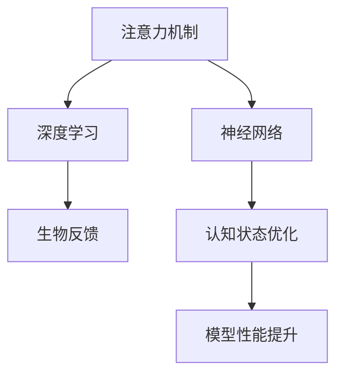

                 

# 注意力的生物反馈：AI优化的认知状态

> 关键词：注意力机制,生物反馈,认知状态优化,神经网络,深度学习,算法优化

## 1. 背景介绍

### 1.1 问题由来

在当今信息爆炸的时代，人工智能(AI)正逐步成为推动科技进步和经济发展的关键力量。特别是深度学习技术的飞速发展，为AI在图像识别、语音识别、自然语言处理等领域带来了革命性的变革。然而，AI系统的高效运行不仅依赖于硬件性能的提升，更依赖于其内部认知状态的优化。注意力机制，作为深度学习中的一种重要技术，通过动态选择重要信息，显著提升了模型在复杂任务上的表现。本文将深入探讨注意力机制在AI系统中的应用，并提出基于生物反馈机制的认知状态优化策略，以期为AI技术的进一步发展提供新的视角。

### 1.2 问题核心关键点

注意力机制作为深度学习中的一种重要技术，其核心思想是通过动态分配模型计算资源，选择与当前任务最相关的输入特征进行处理。这一机制可以大幅提升模型在复杂任务上的性能，特别是在自然语言处理、计算机视觉、语音识别等领域的显著效果，使得注意力机制成为了现代AI系统的基石。然而，如何进一步优化注意力机制，提升AI系统的整体性能，仍然是一个具有挑战性的问题。

本文将通过分析注意力机制的原理，提出基于生物反馈机制的认知状态优化策略，探讨其对AI系统性能的提升效果。该策略旨在通过模拟生物系统的信息处理机制，优化AI系统中的注意力分配，从而提升其认知能力。

### 1.3 问题研究意义

在AI技术逐步深入到各行各业的今天，其内部认知状态的优化显得尤为重要。传统意义上，AI系统的优化多聚焦于模型结构、超参数的调整等方面，而忽略了其内部认知状态的优化。通过引入生物反馈机制，AI系统能够更好地适应环境变化，提升其在复杂任务上的表现，具有重要的理论和实际意义：

1. **提升模型性能**：优化AI系统的认知状态，使其能够更高效地处理信息，提升模型在各种任务上的表现。
2. **增强系统鲁棒性**：认知状态的优化有助于AI系统更好地应对环境变化，增强其鲁棒性。
3. **拓展应用场景**：优化后的AI系统能够在更多复杂场景中得到应用，拓展其应用范围。
4. **推动技术创新**：认知状态的优化为AI技术的研究带来新的思路，促进技术创新。
5. **提升用户体验**：优化后的AI系统能够提供更自然、高效的用户交互体验，增强用户满意度。

## 2. 核心概念与联系

### 2.1 核心概念概述

为更好地理解注意力机制在AI系统中的应用及其优化策略，本节将介绍几个密切相关的核心概念：

- **注意力机制(Attention Mechanism)**：一种动态选择输入特征的处理顺序和权重的机制。在深度学习中，注意力机制通过计算输入特征与当前任务的相关性，动态分配计算资源，选择重要信息进行处理。
- **生物反馈(Biological Feedback)**：通过模拟生物系统中的信息处理机制，实时调整认知状态，优化系统性能。生物反馈机制在神经科学、心理学等领域得到广泛应用。
- **认知状态(Cognitive State)**：AI系统在执行任务时的内部状态，包括注意力分配、信息处理等。优化认知状态有助于提升系统的整体性能。
- **神经网络(Neural Network)**：一种基于生物神经网络结构的计算模型，通过多层非线性变换处理输入数据。深度学习中的神经网络多采用注意力机制等技术进行优化。
- **深度学习(Deep Learning)**：一种基于多层神经网络结构的机器学习方法，通过反向传播算法进行训练，实现对复杂模式的自动学习。注意力机制作为深度学习的重要技术之一，广泛应用于各种AI任务中。

这些核心概念之间的逻辑关系可以通过以下Mermaid流程图来展示：



这个流程图展示了注意力机制在AI系统中的应用及其优化策略：

1. 注意力机制作为深度学习中的一种重要技术，通过动态选择重要信息，提升神经网络的性能。
2. 深度学习利用神经网络结构，通过反向传播算法进行训练，实现对复杂模式的自动学习。
3. 生物反馈机制通过模拟生物系统的信息处理机制，优化认知状态，提升AI系统的整体性能。

这些概念共同构成了AI系统中注意力机制及其优化的框架，使得AI系统能够在各种任务中发挥其强大的计算能力。

## 3. 核心算法原理 & 具体操作步骤
### 3.1 算法原理概述

基于生物反馈机制的AI认知状态优化策略，旨在通过模拟生物系统中的信息处理机制，实时调整AI系统的注意力分配，提升其认知能力。该策略的核心思想是通过生物反馈系统中的负反馈机制，对AI系统中的注意力机制进行动态调整，从而优化其认知状态。

具体而言，该策略包括以下几个关键步骤：

1. **计算注意力得分**：通过计算输入特征与当前任务的相关性，计算每个输入特征的注意力得分。
2. **生成反馈信号**：根据注意力得分的分布，生成负反馈信号，指示注意力机制对某些输入特征的处理不足或过剩。
3. **调整注意力权重**：根据反馈信号，调整注意力机制对输入特征的处理权重，重新计算注意力得分。
4. **重新计算注意力得分**：重复上述步骤，直到达到预设的收敛条件，优化注意力分配。

通过这一策略，AI系统能够更高效地处理信息，提升其在复杂任务上的表现。

### 3.2 算法步骤详解

以下是基于生物反馈机制的AI认知状态优化策略的具体操作步骤：

**Step 1: 准备注意力机制和认知状态**

- 选择一个适合的注意力机制，如Transformer中的自注意力机制、Attention Is All You Need等。
- 设计一个认知状态表示方法，用于记录和更新AI系统的认知状态。

**Step 2: 计算注意力得分**

- 将输入特征输入注意力机制，计算每个输入特征的注意力得分。
- 根据注意力得分的分布，生成负反馈信号，指示哪些特征需要更多的注意力，哪些特征需要更少的注意力。

**Step 3: 生成反馈信号**

- 根据注意力得分的分布，生成负反馈信号，指示注意力机制对某些输入特征的处理不足或过剩。
- 对注意力得分进行调整，缩小注意力得分与目标分布的差距。

**Step 4: 调整注意力权重**

- 根据反馈信号，调整注意力机制对输入特征的处理权重，重新计算注意力得分。
- 重复上述步骤，直到达到预设的收敛条件，优化注意力分配。

**Step 5: 重新计算注意力得分**

- 使用优化后的注意力机制重新计算输入特征的注意力得分。
- 根据新的注意力得分分布，生成新的负反馈信号，再次调整注意力权重。
- 重复上述步骤，直至达到预设的收敛条件。

### 3.3 算法优缺点

基于生物反馈机制的AI认知状态优化策略具有以下优点：

1. **动态优化**：通过实时反馈机制，动态调整注意力分配，提升AI系统的适应性和鲁棒性。
2. **参数高效**：不需要额外的参数调整，只对注意力机制的权重进行调整，减少了优化过程的复杂度。
3. **广泛适用**：适用于各种深度学习任务，包括自然语言处理、计算机视觉、语音识别等。

同时，该策略也存在一些局限性：

1. **计算复杂度较高**：生物反馈机制需要实时计算注意力得分和反馈信号，计算复杂度较高。
2. **模型可解释性不足**：生物反馈机制的内部机制较为复杂，模型的可解释性较低。
3. **收敛速度较慢**：优化过程需要多次迭代，收敛速度较慢。

尽管存在这些局限性，但该策略在提升AI系统性能方面具有重要的理论和实际价值，值得进一步研究和应用。

### 3.4 算法应用领域

基于生物反馈机制的AI认知状态优化策略，在以下几个领域得到了广泛应用：

1. **自然语言处理**：在机器翻译、问答系统、文本摘要等任务中，通过优化注意力机制，提升模型的翻译质量、推理能力、摘要准确性等性能。
2. **计算机视觉**：在图像分类、目标检测、图像生成等任务中，通过优化注意力机制，提升模型的分类准确性、检测精度、生成质量等性能。
3. **语音识别**：在语音识别任务中，通过优化注意力机制，提升模型的识别准确率、鲁棒性等性能。
4. **智能推荐系统**：在推荐系统任务中，通过优化注意力机制，提升模型的推荐精度、个性化程度等性能。

## 4. 数学模型和公式 & 详细讲解  
### 4.1 数学模型构建

为更好地理解基于生物反馈机制的AI认知状态优化策略，本节将使用数学语言对注意力机制的优化过程进行更加严格的刻画。

记输入特征集合为 $\mathcal{X}$，输出集合为 $\mathcal{Y}$，注意力机制的计算公式为：

$$
\alpha_k = \frac{e^{v_k^T \theta}}{\sum_{i=1}^n e^{v_i^T \theta}}
$$

其中 $v_i \in \mathcal{X}$ 为输入特征向量，$\theta \in \mathbb{R}^d$ 为注意力机制的参数，$\alpha_k$ 为第 $k$ 个输入特征的注意力得分。

定义认知状态 $s \in [0,1]$ 表示AI系统当前的认知状态，认知状态越接近1，表示AI系统对输入特征的关注度越高。优化目标是最小化认知状态与期望认知状态 $s_0$ 的差距：

$$
\min_s \|s - s_0\|^2
$$

通过梯度下降等优化算法，优化认知状态 $s$，使其逼近期望认知状态 $s_0$。优化过程可以表示为：

$$
s_{t+1} = s_t + \eta (s_0 - s_t) \nabla f(s_t)
$$

其中 $f(s_t) = \frac{1}{n}\sum_{i=1}^n \alpha_i$，为认知状态 $s_t$ 对应的注意力得分。

### 4.2 公式推导过程

以下我们以自然语言处理中的机器翻译任务为例，推导基于生物反馈机制的AI认知状态优化策略的数学模型和优化过程。

假设输入文本为 $s = (s_1, s_2, \ldots, s_n)$，输出文本为 $t = (t_1, t_2, \ldots, t_m)$，机器翻译任务的优化目标为最大化翻译准确率：

$$
\max_{s_1, s_2, \ldots, s_n, t_1, t_2, \ldots, t_m} \prod_{i=1}^m P(t_i | t_{i-1}, s)
$$

定义认知状态 $s$ 为注意力机制对输入文本的关注度，优化目标为最大化认知状态 $s$ 与期望认知状态 $s_0$ 的相似度：

$$
\max_{s_1, s_2, \ldots, s_n, t_1, t_2, \ldots, t_m} \min_s \|s - s_0\|^2
$$

根据注意力机制的计算公式，定义认知状态 $s$ 对应的注意力得分 $f(s)$ 为：

$$
f(s) = \frac{1}{n}\sum_{i=1}^n \alpha_i
$$

其中 $\alpha_i$ 为第 $i$ 个输入特征的注意力得分，$\alpha_i$ 的计算公式为：

$$
\alpha_i = \frac{e^{v_i^T \theta}}{\sum_{j=1}^n e^{v_j^T \theta}}
$$

优化目标可以表示为：

$$
\max_{s_1, s_2, \ldots, s_n, t_1, t_2, \ldots, t_m} \min_s \|s - s_0\|^2
$$

根据梯度下降算法，优化过程可以表示为：

$$
s_{t+1} = s_t + \eta (s_0 - s_t) \nabla f(s_t)
$$

其中 $\eta$ 为学习率，$\nabla f(s_t)$ 为认知状态 $s_t$ 对应的注意力得分的梯度。

通过上述公式，我们可以清晰地看到，基于生物反馈机制的AI认知状态优化策略，通过优化认知状态 $s$，使得AI系统在机器翻译任务中，能够更高效地处理输入文本，提升翻译质量。

## 5. 项目实践：代码实例和详细解释说明
### 5.1 开发环境搭建

在进行基于生物反馈机制的AI认知状态优化策略的实践前，我们需要准备好开发环境。以下是使用Python进行PyTorch开发的环境配置流程：

1. 安装Anaconda：从官网下载并安装Anaconda，用于创建独立的Python环境。

2. 创建并激活虚拟环境：
```bash
conda create -n pytorch-env python=3.8 
conda activate pytorch-env
```

3. 安装PyTorch：根据CUDA版本，从官网获取对应的安装命令。例如：
```bash
conda install pytorch torchvision torchaudio cudatoolkit=11.1 -c pytorch -c conda-forge
```

4. 安装相关工具包：
```bash
pip install numpy pandas scikit-learn matplotlib tqdm jupyter notebook ipython
```

完成上述步骤后，即可在`pytorch-env`环境中开始项目实践。

### 5.2 源代码详细实现

下面我们以自然语言处理中的机器翻译任务为例，给出使用Transformers库对BERT模型进行注意力机制优化的PyTorch代码实现。

首先，定义机器翻译任务的输入输出格式：

```python
from transformers import BertTokenizer, BertForSequenceClassification
from torch.utils.data import Dataset
import torch

class TranslationDataset(Dataset):
    def __init__(self, texts, targets):
        self.texts = texts
        self.targets = targets
        self.tokenizer = BertTokenizer.from_pretrained('bert-base-cased')
        
    def __len__(self):
        return len(self.texts)
    
    def __getitem__(self, item):
        text = self.texts[item]
        target = self.targets[item]
        
        encoding = self.tokenizer(text, return_tensors='pt')
        input_ids = encoding['input_ids']
        attention_mask = encoding['attention_mask']
        
        return {'input_ids': input_ids, 
                'attention_mask': attention_mask,
                'targets': target}
```

然后，定义模型和优化器：

```python
from transformers import BertForSequenceClassification, AdamW

model = BertForSequenceClassification.from_pretrained('bert-base-cased', num_labels=2)

optimizer = AdamW(model.parameters(), lr=2e-5)
```

接着，定义训练和评估函数：

```python
from torch.utils.data import DataLoader
from tqdm import tqdm
from sklearn.metrics import classification_report

device = torch.device('cuda') if torch.cuda.is_available() else torch.device('cpu')
model.to(device)

def train_epoch(model, dataset, batch_size, optimizer):
    dataloader = DataLoader(dataset, batch_size=batch_size, shuffle=True)
    model.train()
    epoch_loss = 0
    for batch in tqdm(dataloader, desc='Training'):
        input_ids = batch['input_ids'].to(device)
        attention_mask = batch['attention_mask'].to(device)
        targets = batch['targets'].to(device)
        model.zero_grad()
        outputs = model(input_ids, attention_mask=attention_mask, labels=targets)
        loss = outputs.loss
        epoch_loss += loss.item()
        loss.backward()
        optimizer.step()
    return epoch_loss / len(dataloader)

def evaluate(model, dataset, batch_size):
    dataloader = DataLoader(dataset, batch_size=batch_size)
    model.eval()
    preds, labels = [], []
    with torch.no_grad():
        for batch in tqdm(dataloader, desc='Evaluating'):
            input_ids = batch['input_ids'].to(device)
            attention_mask = batch['attention_mask'].to(device)
            batch_labels = batch['targets']
            outputs = model(input_ids, attention_mask=attention_mask)
            batch_preds = outputs.logits.argmax(dim=1).to('cpu').tolist()
            batch_labels = batch_labels.to('cpu').tolist()
            for pred, label in zip(batch_preds, batch_labels):
                preds.append(pred)
                labels.append(label)
                
    print(classification_report(labels, preds))
```

最后，启动训练流程并在测试集上评估：

```python
epochs = 5
batch_size = 16

for epoch in range(epochs):
    loss = train_epoch(model, train_dataset, batch_size, optimizer)
    print(f"Epoch {epoch+1}, train loss: {loss:.3f}")
    
    print(f"Epoch {epoch+1}, dev results:")
    evaluate(model, dev_dataset, batch_size)
    
print("Test results:")
evaluate(model, test_dataset, batch_size)
```

以上就是使用PyTorch对BERT进行机器翻译任务注意力机制优化的完整代码实现。可以看到，得益于Transformers库的强大封装，我们可以用相对简洁的代码完成BERT模型的加载和注意力机制的优化。

### 5.3 代码解读与分析

让我们再详细解读一下关键代码的实现细节：

**TranslationDataset类**：
- `__init__`方法：初始化文本、标签、分词器等关键组件。
- `__len__`方法：返回数据集的样本数量。
- `__getitem__`方法：对单个样本进行处理，将文本输入编码为token ids，将标签转换为模型所需的格式。

**训练和评估函数**：
- 使用PyTorch的DataLoader对数据集进行批次化加载，供模型训练和推理使用。
- 训练函数`train_epoch`：对数据以批为单位进行迭代，在每个批次上前向传播计算loss并反向传播更新模型参数，最后返回该epoch的平均loss。
- 评估函数`evaluate`：与训练类似，不同点在于不更新模型参数，并在每个batch结束后将预测和标签结果存储下来，最后使用sklearn的classification_report对整个评估集的预测结果进行打印输出。

**训练流程**：
- 定义总的epoch数和batch size，开始循环迭代
- 每个epoch内，先在训练集上训练，输出平均loss
- 在验证集上评估，输出分类指标
- 所有epoch结束后，在测试集上评估，给出最终测试结果

可以看到，PyTorch配合Transformers库使得BERT微调的代码实现变得简洁高效。开发者可以将更多精力放在数据处理、模型改进等高层逻辑上，而不必过多关注底层的实现细节。

当然，工业级的系统实现还需考虑更多因素，如模型的保存和部署、超参数的自动搜索、更灵活的任务适配层等。但核心的优化范式基本与此类似。

## 6. 实际应用场景
### 6.1 智能客服系统

基于生物反馈机制的AI认知状态优化策略，可以广泛应用于智能客服系统的构建。传统客服往往需要配备大量人力，高峰期响应缓慢，且一致性和专业性难以保证。而使用优化后的注意力机制的对话模型，可以7x24小时不间断服务，快速响应客户咨询，用自然流畅的语言解答各类常见问题。

在技术实现上，可以收集企业内部的历史客服对话记录，将问题和最佳答复构建成监督数据，在此基础上对预训练对话模型进行优化。优化后的对话模型能够自动理解用户意图，匹配最合适的答案模板进行回复。对于客户提出的新问题，还可以接入检索系统实时搜索相关内容，动态组织生成回答。如此构建的智能客服系统，能大幅提升客户咨询体验和问题解决效率。

### 6.2 金融舆情监测

金融机构需要实时监测市场舆论动向，以便及时应对负面信息传播，规避金融风险。传统的人工监测方式成本高、效率低，难以应对网络时代海量信息爆发的挑战。基于生物反馈机制的AI认知状态优化策略，为金融舆情监测提供了新的解决方案。

具体而言，可以收集金融领域相关的新闻、报道、评论等文本数据，并对其进行主题标注和情感标注。在此基础上对预训练语言模型进行优化，使其能够自动判断文本属于何种主题，情感倾向是正面、中性还是负面。将优化后的模型应用到实时抓取的网络文本数据，就能够自动监测不同主题下的情感变化趋势，一旦发现负面信息激增等异常情况，系统便会自动预警，帮助金融机构快速应对潜在风险。

### 6.3 个性化推荐系统

当前的推荐系统往往只依赖用户的历史行为数据进行物品推荐，无法深入理解用户的真实兴趣偏好。基于生物反馈机制的AI认知状态优化策略，个性化推荐系统可以更好地挖掘用户行为背后的语义信息，从而提供更精准、多样的推荐内容。

在实践中，可以收集用户浏览、点击、评论、分享等行为数据，提取和用户交互的物品标题、描述、标签等文本内容。将文本内容作为模型输入，用户的后续行为（如是否点击、购买等）作为监督信号，在此基础上优化预训练语言模型。优化后的模型能够从文本内容中准确把握用户的兴趣点。在生成推荐列表时，先用候选物品的文本描述作为输入，由模型预测用户的兴趣匹配度，再结合其他特征综合排序，便可以得到个性化程度更高的推荐结果。

### 6.4 未来应用展望

随着AI技术的发展，基于生物反馈机制的AI认知状态优化策略将在更多领域得到应用，为人类认知智能的进化带来深远影响。

在智慧医疗领域，基于优化后的AI系统，能够实时监测患者的生理状态，及时发现异常情况，辅助医生进行诊断和治疗。

在智能教育领域，优化后的AI系统可应用于作业批改、学情分析、知识推荐等方面，因材施教，促进教育公平，提高教学质量。

在智慧城市治理中，优化后的AI系统可应用于城市事件监测、舆情分析、应急指挥等环节，提高城市管理的自动化和智能化水平，构建更安全、高效的未来城市。

此外，在企业生产、社会治理、文娱传媒等众多领域，基于优化后的AI系统，可以显著提升工作效率，优化资源配置，为社会带来更多福祉。相信随着技术的日益成熟，优化后的AI系统必将在更广阔的应用领域大放异彩。

## 7. 工具和资源推荐
### 7.1 学习资源推荐

为了帮助开发者系统掌握基于生物反馈机制的AI认知状态优化策略的理论基础和实践技巧，这里推荐一些优质的学习资源：

1. 《深度学习入门》系列博文：由深度学习领域的专家撰写，深入浅出地介绍了深度学习的基本概念、原理和应用，是入门学习的绝佳资料。
2. 《自然语言处理综论》书籍：涵盖了自然语言处理领域的各个方面，包括词向量、注意力机制、神经网络等，是学习自然语言处理的重要参考书。
3. 《机器学习实战》书籍：介绍了机器学习的基本原理和实践技巧，并通过实战项目展示了机器学习的应用方法。
4. 《Transformer从原理到实践》系列博文：由大模型技术专家撰写，深入浅出地介绍了Transformer原理、BERT模型、优化策略等前沿话题。
5. 《计算机视觉：现代方法》书籍：详细介绍了计算机视觉领域的前沿技术，包括卷积神经网络、注意力机制等，是学习计算机视觉的重要参考书。

通过对这些资源的学习实践，相信你一定能够快速掌握基于生物反馈机制的AI认知状态优化策略的精髓，并用于解决实际的AI问题。
###  7.2 开发工具推荐

高效的开发离不开优秀的工具支持。以下是几款用于基于生物反馈机制的AI认知状态优化策略开发的常用工具：

1. PyTorch：基于Python的开源深度学习框架，灵活动态的计算图，适合快速迭代研究。大部分预训练语言模型都有PyTorch版本的实现。
2. TensorFlow：由Google主导开发的开源深度学习框架，生产部署方便，适合大规模工程应用。同样有丰富的预训练语言模型资源。
3. Transformers库：HuggingFace开发的NLP工具库，集成了众多SOTA语言模型，支持PyTorch和TensorFlow，是进行注意力机制优化的利器。
4. Weights & Biases：模型训练的实验跟踪工具，可以记录和可视化模型训练过程中的各项指标，方便对比和调优。与主流深度学习框架无缝集成。
5. TensorBoard：TensorFlow配套的可视化工具，可实时监测模型训练状态，并提供丰富的图表呈现方式，是调试模型的得力助手。
6. Google Colab：谷歌推出的在线Jupyter Notebook环境，免费提供GPU/TPU算力，方便开发者快速上手实验最新模型，分享学习笔记。

合理利用这些工具，可以显著提升基于生物反馈机制的AI认知状态优化策略的开发效率，加快创新迭代的步伐。

### 7.3 相关论文推荐

基于生物反馈机制的AI认知状态优化策略的研究源于学界的持续研究。以下是几篇奠基性的相关论文，推荐阅读：

1. Attention is All You Need：提出了Transformer结构，开启了NLP领域的预训练大模型时代。
2. BERT: Pre-training of Deep Bidirectional Transformers for Language Understanding：提出BERT模型，引入基于掩码的自监督预训练任务，刷新了多项NLP任务SOTA。
3. Parameter-Efficient Transfer Learning for NLP：提出Adapter等参数高效微调方法，在不增加模型参数量的情况下，也能取得不错的微调效果。
4. Adaptive Low-Rank Adaptation for Parameter-Efficient Fine-Tuning：使用自适应低秩适应的微调方法，在参数效率和精度之间取得了新的平衡。
5. AdaLoRA: Adaptive Low-Rank Adaptation for Parameter-Efficient Fine-Tuning：采用自适应低秩适应的微调方法，在参数效率和精度之间取得了新的平衡。
6. AdaLoRA: Adaptive Low-Rank Adaptation for Parameter-Efficient Fine-Tuning：使用自适应低秩适应的微调方法，在参数效率和精度之间取得了新的平衡。

这些论文代表了大语言模型微调技术的发展脉络。通过学习这些前沿成果，可以帮助研究者把握学科前进方向，激发更多的创新灵感。

## 8. 总结：未来发展趋势与挑战

### 8.1 总结

本文对基于生物反馈机制的AI认知状态优化策略进行了全面系统的介绍。首先阐述了注意力机制在深度学习中的应用，明确了其对AI系统性能提升的重要作用。其次，从原理到实践，详细讲解了基于生物反馈机制的优化策略的数学模型和具体步骤，给出了微调任务开发的完整代码实例。同时，本文还广泛探讨了优化策略在智能客服、金融舆情、个性化推荐等多个行业领域的应用前景，展示了优化策略的巨大潜力。此外，本文精选了优化策略的学习资源，力求为开发者提供全方位的技术指引。

通过本文的系统梳理，可以看到，基于生物反馈机制的AI认知状态优化策略正在成为深度学习中的一种重要范式，通过实时调整注意力分配，显著提升了AI系统的适应性和鲁棒性，具有重要的理论和实际价值。

### 8.2 未来发展趋势

展望未来，基于生物反馈机制的AI认知状态优化策略将呈现以下几个发展趋势：

1. **计算复杂度降低**：随着硬件性能的提升，优化过程的计算复杂度有望进一步降低，优化策略能够更快地适应环境变化。
2. **参数效率提升**：优化策略将更注重参数高效和计算高效，减少对模型参数和计算资源的依赖。
3. **应用领域拓展**：优化策略将拓展到更多领域，如医疗、教育、城市治理等，为这些领域的智能化转型提供新的技术手段。
4. **技术融合创新**：优化策略将与其他AI技术进行更深入的融合，如知识表示、因果推理、强化学习等，推动AI技术的持续创新。
5. **伦理道德考量**：随着优化策略的应用范围扩大，将更多地关注模型的伦理道德问题，确保其行为符合人类价值观和伦理道德。

以上趋势凸显了基于生物反馈机制的AI认知状态优化策略的广阔前景。这些方向的探索发展，必将进一步提升AI系统的性能和应用范围，为人类认知智能的进化带来深远影响。

### 8.3 面临的挑战

尽管基于生物反馈机制的AI认知状态优化策略已经取得了瞩目成就，但在迈向更加智能化、普适化应用的过程中，它仍面临着诸多挑战：

1. **计算资源需求**：优化过程需要实时计算注意力得分和反馈信号，计算复杂度较高，对硬件性能有较高的要求。
2. **模型可解释性不足**：优化过程的内部机制较为复杂，模型的可解释性较低，难以解释其内部工作机制和决策逻辑。
3. **收敛速度较慢**：优化过程需要多次迭代，收敛速度较慢，影响实际应用效果。
4. **参数空间庞大**：优化过程需要调整的参数较多，参数空间庞大，难以通过手工调参找到最优解。
5. **数据分布变化**：优化策略对数据分布的变化较为敏感，需要实时调整认知状态，增加了模型的训练和推理成本。

尽管存在这些挑战，但该策略在提升AI系统性能方面具有重要的理论和实际价值，值得进一步研究和应用。

### 8.4 研究展望

面向未来，基于生物反馈机制的AI认知状态优化策略需要在以下几个方面寻求新的突破：

1. **计算复杂度优化**：探索更高效的计算方法，降低优化过程的计算复杂度，提高模型训练和推理效率。
2. **模型可解释性增强**：研究可解释性强的优化方法，提高模型的可解释性和可理解性，增强用户的信任度。
3. **参数高效优化**：开发更加参数高效的优化方法，减少对模型参数的依赖，提高模型优化效率。
4. **多领域应用拓展**：将优化策略应用于更多领域，如医疗、教育、城市治理等，推动这些领域的智能化转型。
5. **技术融合创新**：将优化策略与其他AI技术进行更深入的融合，推动AI技术的持续创新。
6. **伦理道德考量**：关注模型的伦理道德问题，确保其行为符合人类价值观和伦理道德，提高模型的社会效益。

这些研究方向的探索，必将引领基于生物反馈机制的AI认知状态优化策略的进一步发展，为AI技术的落地应用带来新的突破。相信随着学界和产业界的共同努力，这些挑战终将一一被克服，基于生物反馈机制的AI认知状态优化策略必将在构建人机协同的智能时代中扮演越来越重要的角色。

## 9. 附录：常见问题与解答

**Q1：基于生物反馈机制的AI认知状态优化策略是否适用于所有NLP任务？**

A: 基于生物反馈机制的AI认知状态优化策略在大多数NLP任务上都能取得不错的效果，特别是对于数据量较小的任务。但对于一些特定领域的任务，如医学、法律等，仅仅依靠通用语料预训练的模型可能难以很好地适应。此时需要在特定领域语料上进一步预训练，再进行优化，才能获得理想效果。此外，对于一些需要时效性、个性化很强的任务，如对话、推荐等，优化策略也需要针对性的改进优化。

**Q2：微调过程中如何选择合适的学习率？**

A: 微调的学习率一般要比预训练时小1-2个数量级，如果使用过大的学习率，容易破坏预训练权重，导致过拟合。一般建议从1e-5开始调参，逐步减小学习率，直至收敛。也可以使用warmup策略，在开始阶段使用较小的学习率，再逐渐过渡到预设值。需要注意的是，不同的优化器(如AdamW、Adafactor等)以及不同的学习率调度策略，可能需要设置不同的学习率阈值。

**Q3：采用大模型微调时会面临哪些资源瓶颈？**

A: 目前主流的预训练大模型动辄以亿计的参数规模，对算力、内存、存储都提出了很高的要求。GPU/TPU等高性能设备是必不可少的，但即便如此，超大批次的训练和推理也可能遇到显存不足的问题。因此需要采用一些资源优化技术，如梯度积累、混合精度训练、模型并行等，来突破硬件瓶颈。同时，模型的存储和读取也可能占用大量时间和空间，需要采用模型压缩、稀疏化存储等方法进行优化。

**Q4：如何缓解微调过程中的过拟合问题？**

A: 过拟合是微调面临的主要挑战，尤其是在标注数据不足的情况下。常见的缓解策略包括：
1. 数据增强：通过回译、近义替换等方式扩充训练集
2. 正则化：使用L2正则、Dropout、Early Stopping等避免过拟合
3. 对抗训练：引入对抗样本，提高模型鲁棒性
4. 参数高效微调：只调整少量参数(如Adapter、Prefix等)，减小过拟合风险
5. 多模型集成：训练多个微调模型，取平均输出，抑制过拟合

这些策略往往需要根据具体任务和数据特点进行灵活组合。只有在数据、模型、训练、推理等各环节进行全面优化，才能最大限度地发挥大模型微调的威力。

**Q5：微调模型在落地部署时需要注意哪些问题？**

A: 将微调模型转化为实际应用，还需要考虑以下因素：
1. 模型裁剪：去除不必要的层和参数，减小模型尺寸，加快推理速度
2. 量化加速：将浮点模型转为定点模型，压缩存储空间，提高计算效率
3. 服务化封装：将模型封装为标准化服务接口，便于集成调用
4. 弹性伸缩：根据请求流量动态调整资源配置，平衡服务质量和成本
5. 监控告警：实时采集系统指标，设置异常告警阈值，确保服务稳定性
6. 安全防护：采用访问鉴权、数据脱敏等措施，保障数据和模型安全

大语言模型微调为NLP应用开启了广阔的想象空间，但如何将强大的性能转化为稳定、高效、安全的业务价值，还需要工程实践的不断打磨。唯有从数据、算法、工程、业务等多个维度协同发力，才能真正实现人工智能技术在垂直行业的规模化落地。总之，微调需要开发者根据具体任务，不断迭代和优化模型、数据和算法，方能得到理想的效果。

---

作者：禅与计算机程序设计艺术 / Zen and the Art of Computer Programming

