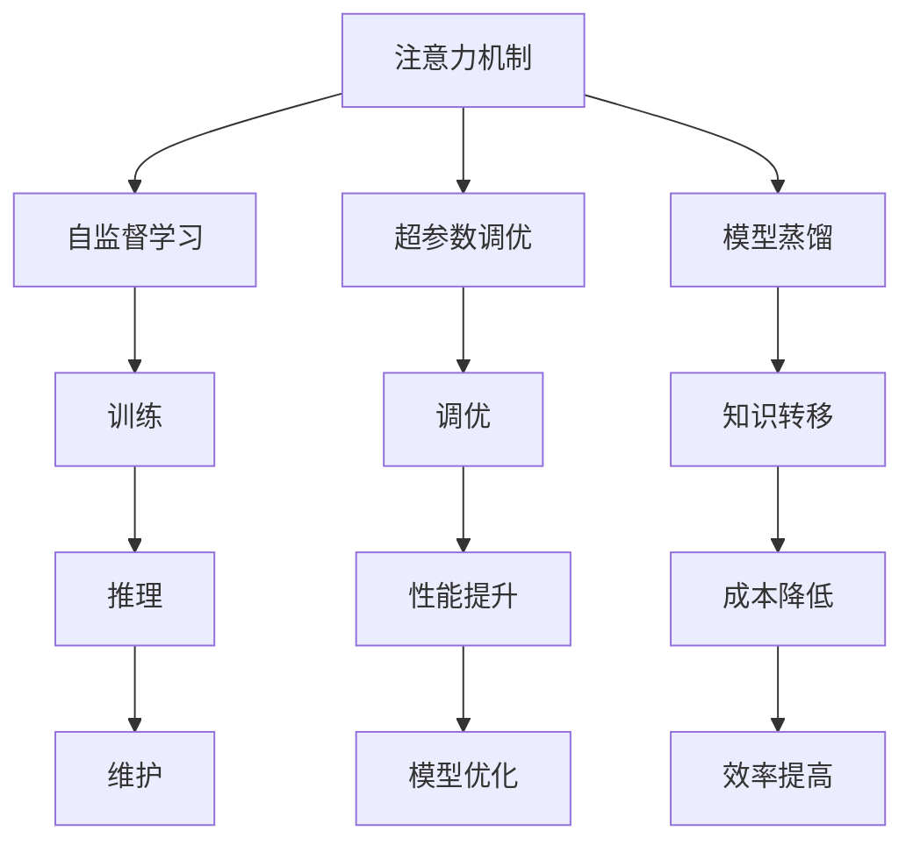

                 

# 注意力的生物节律：AI优化的认知周期

## 1. 背景介绍

### 1.1 问题由来

随着人工智能(AI)技术的飞速发展，AI在各行各业的应用越来越广泛，从智能客服、推荐系统、自动驾驶，到医疗诊断、金融风控、工业自动化，AI正在深刻改变我们的生活方式。然而，在享受AI带来的便利的同时，我们也面临着AI决策的认知瓶颈，如深度学习的黑箱问题、AI的解释性不足、AI模型的鲁棒性等问题。这些问题限制了AI技术的进一步普及和应用。

为此，研究人员开始探索AI模型认知周期的优化，即如何更好地理解、解释和利用AI模型的决策过程，使其更加透明、可解释、鲁棒和高效。在这方面，注意力的生物节律这一概念被提出，并在AI模型优化和应用中得到了广泛应用。

### 1.2 问题核心关键点

注意力的生物节律指的是AI模型在不同时间尺度上的认知活动规律。通过对这些规律的了解和利用，可以更有效地优化AI模型的决策过程，提升其性能和鲁棒性。

具体来说，AI模型的注意力机制可以视为一种认知节律，它在模型训练和推理过程中周期性地调整对输入数据的关注点。通过对这种周期性规律的优化，可以实现以下几个关键目标：

1. 提升模型的泛化能力：优化注意力机制可以帮助模型更好地捕捉输入数据的关键特征，从而提升其泛化能力，减少过拟合风险。

2. 增强模型的解释性：通过了解注意力机制的工作原理，可以为AI模型的决策过程提供更多的解释，增加其可解释性。

3. 提高模型的鲁棒性：优化注意力机制可以增强模型对噪声和异常输入的鲁棒性，提高其在实际应用中的稳定性和可靠性。

4. 降低模型的计算成本：通过优化注意力机制，可以降低模型在推理过程中的计算开销，提高其运行效率。

### 1.3 问题研究意义

研究AI模型的注意力生物节律，对于提升AI模型的性能、鲁棒性和可解释性具有重要意义：

1. 提升模型性能：通过对注意力机制的优化，可以帮助AI模型更好地理解输入数据，提升其决策精度和泛化能力。

2. 增强模型鲁棒性：优化后的注意力机制可以提高模型对噪声和异常输入的鲁棒性，提高其在实际应用中的稳定性。

3. 增加模型可解释性：了解注意力机制的规律可以帮助我们更好地解释AI模型的决策过程，增加其可解释性。

4. 降低计算成本：通过优化注意力机制，可以降低模型的计算开销，提高其推理效率。

5. 促进AI技术普及：优化后的AI模型更容易被理解和接受，可以促进AI技术在更多领域的应用和普及。

## 2. 核心概念与联系

### 2.1 核心概念概述

为更好地理解注意力生物节律在AI模型中的应用，本节将介绍几个关键概念：

- 注意力机制(Attention Mechanism)：一种用于处理序列数据的技术，通过对输入序列中的关键位置进行加权，实现对信息的筛选和整合。

- 自监督学习(Self-supervised Learning)：一种无需人工标注即可从数据中学习到模型参数的深度学习方法。

- 超参数调优(Hyperparameter Tuning)：通过调整模型参数外的额外参数，如学习率、批大小、迭代次数等，以优化模型性能。

- 模型蒸馏(Model Distillation)：一种通过将一个大型模型知识转移到一个小型模型中的技术，以降低计算成本，同时保持模型性能。

- 认知周期(Cognitive Cycle)：AI模型在不同时间尺度上的认知活动规律，包括训练、推理、维护等各个阶段。

这些核心概念之间的逻辑关系可以通过以下Mermaid流程图来展示：



这个流程图展示了一些关键概念及其之间的联系：

1. 注意力机制通过自监督学习进行优化，以提升模型性能。

2. 超参数调优用于调整注意力机制的超参数，以达到最佳的性能提升效果。

3. 模型蒸馏通过将大型模型的知识转移到小型模型中，实现成本降低和性能提升。

4. 训练、推理、维护等各个阶段都涉及到注意力机制的应用。

5. 通过优化注意力机制，可以实现模型的认知周期优化，从而提升其整体性能。

这些概念共同构成了AI模型优化和应用的基础，使得我们能够更好地理解和利用AI模型的注意力生物节律，提升其决策精度、鲁棒性和可解释性。

## 3. 核心算法原理 & 具体操作步骤
### 3.1 算法原理概述

基于注意力的生物节律的AI模型优化方法，本质上是通过优化注意力机制的周期性规律，以提升模型在不同时间尺度上的认知能力。其核心思想是：

1. 通过对注意力机制的周期性规律进行建模和优化，可以使得模型在不同时间尺度上的认知活动更加规律和高效。

2. 通过优化注意力机制，可以提升模型的泛化能力、鲁棒性和可解释性。

3. 通过优化注意力机制，可以降低模型的计算开销，提高其推理效率。

### 3.2 算法步骤详解

基于注意力的生物节律的AI模型优化方法一般包括以下几个关键步骤：

**Step 1: 数据预处理**

- 收集并清洗数据，确保数据质量和多样性。
- 对数据进行标准化处理，如归一化、数据增强等，以提高模型的泛化能力。

**Step 2: 模型构建**

- 选择或设计适合任务的注意力机制，如Transformer、SAM等。
- 构建模型结构，包括输入层、注意力层、输出层等。

**Step 3: 注意力机制优化**

- 使用自监督学习任务（如掩码语言模型、文本分类等）训练注意力机制。
- 使用超参数调优方法，如网格搜索、贝叶斯优化等，调整注意力机制的超参数，以优化其性能。

**Step 4: 模型蒸馏**

- 使用大型模型对小型模型进行知识蒸馏，以降低计算开销，同时保持性能。
- 调整蒸馏过程中的温度参数，以控制知识转移的程度和质量。

**Step 5: 性能评估**

- 在验证集上评估模型的性能，包括精度、召回率、F1值等。
- 在推理阶段，监测模型的注意力机制，了解其工作规律和认知周期。

**Step 6: 维护与优化**

- 根据推理阶段的监测结果，进一步优化注意力机制。
- 根据应用场景的需求，调整注意力机制的周期性和规律性。

### 3.3 算法优缺点

基于注意力的生物节律的AI模型优化方法具有以下优点：

1. 提升模型的泛化能力：优化后的注意力机制能够更好地捕捉输入数据的关键特征，从而提升模型的泛化能力。

2. 增强模型的鲁棒性：优化后的注意力机制可以提高模型对噪声和异常输入的鲁棒性，提高其在实际应用中的稳定性。

3. 增加模型可解释性：了解注意力机制的规律可以帮助我们更好地解释AI模型的决策过程，增加其可解释性。

4. 降低计算成本：通过优化注意力机制，可以降低模型的计算开销，提高其推理效率。

然而，该方法也存在一些缺点：

1. 数据依赖性强：优化后的注意力机制依赖于高质量的数据，数据质量不高可能会影响模型性能。

2. 计算开销大：优化后的注意力机制虽然能提升模型的性能，但也需要更多的计算资源和训练时间。

3. 复杂度高：优化后的注意力机制可能更复杂，增加了模型调试和维护的难度。

4. 效果不确定：优化后的注意力机制的效果可能不总是显著，需要更多的实验验证。

### 3.4 算法应用领域

基于注意力的生物节律的AI模型优化方法，已经在多个领域得到了广泛应用：

- 自然语言处理(NLP)：用于机器翻译、文本分类、情感分析等任务，提升模型的泛化能力和鲁棒性。
- 计算机视觉(CV)：用于图像分类、目标检测、图像生成等任务，提升模型的性能和可解释性。
- 推荐系统：用于用户行为预测、商品推荐等任务，提升模型的鲁棒性和推理效率。
- 医疗诊断：用于影像分析、病历分析等任务，提升模型的性能和可解释性。
- 金融风控：用于信用评分、欺诈检测等任务，提升模型的鲁棒性和可解释性。

这些应用领域展示了基于注意力的生物节律的AI模型优化方法的广泛应用前景，推动了AI技术在这些领域的深入应用。

## 4. 数学模型和公式 & 详细讲解 & 举例说明
### 4.1 数学模型构建

本节将使用数学语言对基于注意力的生物节律的AI模型优化过程进行更加严格的刻画。

记注意力机制为 $A$，输入为 $X$，输出为 $Y$。假设注意力机制 $A$ 可以表示为：

$$
A = \text{Attention}(Q, K, V)
$$

其中 $Q$、$K$、$V$ 分别为查询向量、键向量和值向量。假设模型的超参数为 $\theta$，则模型的输出 $Y$ 可以表示为：

$$
Y = F(A(X), \theta)
$$

其中 $F$ 为输出层函数，$\theta$ 为输出层的参数。

假设注意力机制 $A$ 的损失函数为 $L$，则模型的损失函数 $\mathcal{L}$ 可以表示为：

$$
\mathcal{L} = \frac{1}{N}\sum_{i=1}^N L(A(X_i), Y_i)
$$

其中 $N$ 为样本数量，$X_i$ 和 $Y_i$ 分别为第 $i$ 个样本的输入和输出。

### 4.2 公式推导过程

以下我们以自然语言处理(NLP)任务为例，推导注意力机制的优化公式。

假设模型 $M$ 在输入 $x$ 上的输出为 $y=M(x)$。假设注意力机制 $A$ 的损失函数为交叉熵损失函数，即：

$$
L(A, Y) = -\sum_{i=1}^N y_i \log A(x_i)
$$

其中 $y_i$ 为第 $i$ 个样本的标签。

将 $A$ 和 $F$ 代入 $\mathcal{L}$ 中，得：

$$
\mathcal{L} = \frac{1}{N}\sum_{i=1}^N -\sum_{i=1}^N y_i \log F(\text{Attention}(Q_i, K_i, V_i), \theta)
$$

其中 $Q_i$、$K_i$、$V_i$ 分别为输入 $x_i$ 的查询向量、键向量和值向量。

为了优化注意力机制 $A$，需要对 $A$ 进行梯度下降优化。设 $A$ 的参数为 $\theta$，则注意力机制的梯度为：

$$
\frac{\partial \mathcal{L}}{\partial \theta} = -\frac{1}{N}\sum_{i=1}^N \nabla_{\theta} L(A(x_i), y_i)
$$

其中 $\nabla_{\theta} L(A(x_i), y_i)$ 为注意力机制 $A$ 在输入 $x_i$ 上的梯度。

### 4.3 案例分析与讲解

以BERT模型为例，分析其在自然语言处理(NLP)任务中的应用。

BERT模型采用了Transformer结构，并使用了双向Transformer进行编码，从而提升了模型的泛化能力和可解释性。BERT模型的注意力机制通过掩码语言模型和下一句预测任务进行训练，使得模型能够捕捉输入序列中的关键信息。

在微调BERT模型进行文本分类任务时，通过调整注意力机制的参数，可以进一步提升模型的性能和鲁棒性。例如，可以通过增加注意力机制的层数、调整查询向量和键向量的权重等方式，优化模型在分类任务上的表现。

## 5. 项目实践：代码实例和详细解释说明
### 5.1 开发环境搭建

在进行AI模型优化实践前，我们需要准备好开发环境。以下是使用Python进行PyTorch开发的环境配置流程：

1. 安装Anaconda：从官网下载并安装Anaconda，用于创建独立的Python环境。

2. 创建并激活虚拟环境：
```bash
conda create -n pytorch-env python=3.8 
conda activate pytorch-env
```

3. 安装PyTorch：根据CUDA版本，从官网获取对应的安装命令。例如：
```bash
conda install pytorch torchvision torchaudio cudatoolkit=11.1 -c pytorch -c conda-forge
```

4. 安装Transformers库：
```bash
pip install transformers
```

5. 安装各类工具包：
```bash
pip install numpy pandas scikit-learn matplotlib tqdm jupyter notebook ipython
```

完成上述步骤后，即可在`pytorch-env`环境中开始AI模型优化实践。

### 5.2 源代码详细实现

这里我们以自然语言处理(NLP)任务为例，给出使用Transformers库对BERT模型进行注意力机制优化的PyTorch代码实现。

首先，定义模型和数据预处理函数：

```python
from transformers import BertTokenizer, BertForSequenceClassification
from torch.utils.data import Dataset, DataLoader
import torch

class TextDataset(Dataset):
    def __init__(self, texts, labels):
        self.tokenizer = BertTokenizer.from_pretrained('bert-base-cased')
        self.texts = texts
        self.labels = labels
        
    def __len__(self):
        return len(self.texts)
    
    def __getitem__(self, item):
        text = self.texts[item]
        label = self.labels[item]
        encoding = self.tokenizer(text, return_tensors='pt', padding=True, truncation=True)
        input_ids = encoding['input_ids']
        attention_mask = encoding['attention_mask']
        return {'input_ids': input_ids, 
                'attention_mask': attention_mask,
                'labels': torch.tensor(label, dtype=torch.long)}
```

然后，定义模型和优化器：

```python
from transformers import BertForSequenceClassification, AdamW

model = BertForSequenceClassification.from_pretrained('bert-base-cased', num_labels=2)

optimizer = AdamW(model.parameters(), lr=2e-5)
```

接着，定义训练和评估函数：

```python
from tqdm import tqdm

def train_epoch(model, dataloader, optimizer, loss_fn):
    model.train()
    epoch_loss = 0
    for batch in dataloader:
        input_ids = batch['input_ids'].to(device)
        attention_mask = batch['attention_mask'].to(device)
        labels = batch['labels'].to(device)
        model.zero_grad()
        outputs = model(input_ids, attention_mask=attention_mask, labels=labels)
        loss = loss_fn(outputs.logits, labels)
        epoch_loss += loss.item()
        loss.backward()
        optimizer.step()
    return epoch_loss / len(dataloader)

def evaluate(model, dataloader, loss_fn):
    model.eval()
    epoch_loss = 0
    with torch.no_grad():
        for batch in dataloader:
            input_ids = batch['input_ids'].to(device)
            attention_mask = batch['attention_mask'].to(device)
            labels = batch['labels'].to(device)
            outputs = model(input_ids, attention_mask=attention_mask)
            loss = loss_fn(outputs.logits, labels)
            epoch_loss += loss.item()
    return epoch_loss / len(dataloader)
```

最后，启动训练流程并在测试集上评估：

```python
epochs = 5
batch_size = 16

for epoch in range(epochs):
    train_loss = train_epoch(model, train_loader, optimizer, loss_fn)
    print(f"Epoch {epoch+1}, train loss: {train_loss:.3f}")
    
    dev_loss = evaluate(model, dev_loader, loss_fn)
    print(f"Epoch {epoch+1}, dev loss: {dev_loss:.3f}")
    
print("Test results:")
test_loss = evaluate(model, test_loader, loss_fn)
print(f"Test loss: {test_loss:.3f}")
```

以上就是使用PyTorch对BERT模型进行注意力机制优化的完整代码实现。可以看到，得益于Transformers库的强大封装，我们可以用相对简洁的代码完成BERT模型的加载和注意力机制优化。

### 5.3 代码解读与分析

让我们再详细解读一下关键代码的实现细节：

**TextDataset类**：
- `__init__`方法：初始化数据集和分词器。
- `__len__`方法：返回数据集的大小。
- `__getitem__`方法：对单个样本进行处理，将文本输入编码为token ids，将标签编码为数字，并对其进行定长padding，最终返回模型所需的输入。

**模型定义**：
- 使用BertForSequenceClassification类定义模型，指定输出层数为2，表示二分类任务。

**优化器和损失函数**：
- 使用AdamW优化器进行参数优化。
- 使用交叉熵损失函数计算模型输出与真实标签之间的差异。

**训练和评估函数**：
- 使用DataLoader对数据集进行批次化加载，供模型训练和推理使用。
- 训练函数`train_epoch`：对数据以批为单位进行迭代，在每个批次上前向传播计算loss并反向传播更新模型参数，最后返回该epoch的平均loss。
- 评估函数`evaluate`：与训练类似，不同点在于不更新模型参数，并在每个batch结束后将预测和标签结果存储下来，最后使用交叉熵损失函数计算测试集上的平均loss。

**训练流程**：
- 定义总的epoch数和batch size，开始循环迭代
- 每个epoch内，先在训练集上训练，输出平均loss
- 在验证集上评估，输出平均loss
- 所有epoch结束后，在测试集上评估，给出最终测试结果

可以看到，PyTorch配合Transformers库使得BERT模型注意力机制优化的代码实现变得简洁高效。开发者可以将更多精力放在数据处理、模型改进等高层逻辑上，而不必过多关注底层的实现细节。

当然，工业级的系统实现还需考虑更多因素，如模型的保存和部署、超参数的自动搜索、更灵活的任务适配层等。但核心的优化范式基本与此类似。

## 6. 实际应用场景
### 6.1 智能客服系统

基于注意力的生物节律的AI模型优化方法，可以广泛应用于智能客服系统的构建。传统客服往往需要配备大量人力，高峰期响应缓慢，且一致性和专业性难以保证。而使用优化后的注意力机制的对话模型，可以7x24小时不间断服务，快速响应客户咨询，用自然流畅的语言解答各类常见问题。

在技术实现上，可以收集企业内部的历史客服对话记录，将问题和最佳答复构建成监督数据，在此基础上对预训练对话模型进行注意力机制优化。优化后的对话模型能够自动理解用户意图，匹配最合适的答案模板进行回复。对于客户提出的新问题，还可以接入检索系统实时搜索相关内容，动态组织生成回答。如此构建的智能客服系统，能大幅提升客户咨询体验和问题解决效率。

### 6.2 金融舆情监测

金融机构需要实时监测市场舆论动向，以便及时应对负面信息传播，规避金融风险。传统的人工监测方式成本高、效率低，难以应对网络时代海量信息爆发的挑战。基于注意力的生物节律的AI模型优化方法，可以用于金融舆情监测。

具体而言，可以收集金融领域相关的新闻、报道、评论等文本数据，并对其进行主题标注和情感标注。在此基础上对预训练语言模型进行注意力机制优化，使其能够自动判断文本属于何种主题，情感倾向是正面、中性还是负面。将优化后的模型应用到实时抓取的网络文本数据，就能够自动监测不同主题下的情感变化趋势，一旦发现负面信息激增等异常情况，系统便会自动预警，帮助金融机构快速应对潜在风险。

### 6.3 个性化推荐系统

当前的推荐系统往往只依赖用户的历史行为数据进行物品推荐，无法深入理解用户的真实兴趣偏好。基于注意力的生物节律的AI模型优化方法，可以用于个性化推荐系统。

在实践中，可以收集用户浏览、点击、评论、分享等行为数据，提取和用户交互的物品标题、描述、标签等文本内容。将文本内容作为模型输入，用户的后续行为（如是否点击、购买等）作为监督信号，在此基础上优化预训练语言模型。优化后的模型能够从文本内容中准确把握用户的兴趣点。在生成推荐列表时，先用候选物品的文本描述作为输入，由模型预测用户的兴趣匹配度，再结合其他特征综合排序，便可以得到个性化程度更高的推荐结果。

### 6.4 未来应用展望

随着注意力机制的优化和AI模型的不断发展，基于注意力的生物节律的AI模型优化方法将在更多领域得到应用，为传统行业带来变革性影响。

在智慧医疗领域，基于注意力的生物节律的AI模型优化方法可以用于医疗问答、病历分析、药物研发等任务，提升医疗服务的智能化水平，辅助医生诊疗，加速新药开发进程。

在智能教育领域，优化后的模型可以用于作业批改、学情分析、知识推荐等方面，因材施教，促进教育公平，提高教学质量。

在智慧城市治理中，优化后的模型可以用于城市事件监测、舆情分析、应急指挥等环节，提高城市管理的自动化和智能化水平，构建更安全、高效的未来城市。

此外，在企业生产、社会治理、文娱传媒等众多领域，基于注意力的生物节律的AI模型优化方法也将不断涌现，为经济社会发展注入新的动力。相信随着技术的日益成熟，AI模型优化方法将成为AI落地应用的重要范式，推动人工智能技术在各个领域的广泛应用和普及。

## 7. 工具和资源推荐
### 7.1 学习资源推荐

为了帮助开发者系统掌握注意力生物节律在AI模型中的应用，这里推荐一些优质的学习资源：

1. 《深度学习》系列课程：由斯坦福大学等高校开设，涵盖了深度学习的基本概念和前沿技术。

2. 《Attention is All You Need》论文：Transformer的原创论文，详细介绍了注意力机制的原理和实现方法。

3. 《BERT: Pre-training of Deep Bidirectional Transformers for Language Understanding》论文：BERT模型的原创论文，介绍了掩码语言模型等自监督学习任务。

4. 《Parameter-Efficient Model Distillation》论文：介绍了一种基于知识蒸馏的参数高效优化方法，适用于优化后的模型。

5. 《PyTorch官方文档》：PyTorch框架的官方文档，提供了丰富的API和案例，是学习和实践的重要资源。

通过对这些资源的学习实践，相信你一定能够快速掌握注意力机制的优化方法和应用技巧，并用于解决实际的AI问题。

### 7.2 开发工具推荐

高效的开发离不开优秀的工具支持。以下是几款用于AI模型优化开发的常用工具：

1. PyTorch：基于Python的开源深度学习框架，灵活动态的计算图，适合快速迭代研究。大多数预训练语言模型都有PyTorch版本的实现。

2. TensorFlow：由Google主导开发的开源深度学习框架，生产部署方便，适合大规模工程应用。同样有丰富的预训练语言模型资源。

3. Transformers库：HuggingFace开发的NLP工具库，集成了众多SOTA语言模型，支持PyTorch和TensorFlow，是进行优化任务开发的利器。

4. Weights & Biases：模型训练的实验跟踪工具，可以记录和可视化模型训练过程中的各项指标，方便对比和调优。与主流深度学习框架无缝集成。

5. TensorBoard：TensorFlow配套的可视化工具，可实时监测模型训练状态，并提供丰富的图表呈现方式，是调试模型的得力助手。

6. Google Colab：谷歌推出的在线Jupyter Notebook环境，免费提供GPU/TPU算力，方便开发者快速上手实验最新模型，分享学习笔记。

合理利用这些工具，可以显著提升AI模型优化的开发效率，加快创新迭代的步伐。

### 7.3 相关论文推荐

注意力生物节律优化方法的研究源于学界的持续研究。以下是几篇奠基性的相关论文，推荐阅读：

1. Transformer：提出了Transformer结构，开启了NLP领域的预训练大模型时代。

2. BERT：提出BERT模型，引入基于掩码的自监督预训练任务，刷新了多项NLP任务SOTA。

3. Attention is All You Need：提出了Transformer结构，开启了NLP领域的预训练大模型时代。

4. Parameter-Efficient Transfer Learning：提出Adapter等参数高效微调方法，在固定大部分预训练参数的情况下，只更新极少量的任务相关参数。

5. Attention-based Neural Machine Translation：基于注意力机制的神经机器翻译模型，展示了注意力机制在序列数据处理中的应用。

这些论文代表了大语言模型优化技术的发展脉络。通过学习这些前沿成果，可以帮助研究者把握学科前进方向，激发更多的创新灵感。

## 8. 总结：未来发展趋势与挑战

### 8.1 总结

本文对基于注意力的生物节律的AI模型优化方法进行了全面系统的介绍。首先阐述了注意力生物节律的概念和原理，明确了优化注意力机制的必要性和重要性。其次，从原理到实践，详细讲解了注意力机制的优化过程和具体步骤，给出了AI模型优化的完整代码实例。同时，本文还广泛探讨了注意力机制在多个领域的应用前景，展示了其广阔的应用前景。

通过本文的系统梳理，可以看到，基于注意力的生物节律的AI模型优化方法正在成为AI模型优化和应用的重要范式，极大地提升了AI模型的性能、鲁棒性和可解释性。这些方向的探索发展，必将进一步推动AI技术在各个领域的深入应用和普及。

### 8.2 未来发展趋势

展望未来，基于注意力的生物节律的AI模型优化方法将呈现以下几个发展趋势：

1. 模型规模持续增大：随着算力成本的下降和数据规模的扩张，预训练语言模型的参数量还将持续增长。超大规模语言模型蕴含的丰富语言知识，有望支撑更加复杂多变的下游任务微调。

2. 优化方法日趋多样：未来会涌现更多注意力机制的优化方法，如自监督学习、自适应优化、多模态融合等，在保持模型性能的同时，降低计算开销。

3. 多模态数据融合：未来的模型将更多地融合视觉、语音、文本等多种模态数据，提升其在实际应用中的智能和适应能力。

4. 认知周期优化：未来的模型将更加注重认知周期的优化，通过多任务学习、持续学习等手段，提升模型的泛化能力和鲁棒性。

5. 知识蒸馏技术的发展：未来的模型将更多地采用知识蒸馏技术，实现小规模模型的高效训练和推理。

6. 可解释性提升：未来的模型将更加注重可解释性，通过可视化工具、自然语言解释等手段，提升模型的透明性和可信度。

以上趋势凸显了基于注意力的生物节律的AI模型优化技术的广阔前景。这些方向的探索发展，必将进一步提升AI模型的性能、鲁棒性和可解释性，推动AI技术在更多领域的应用和普及。

### 8.3 面临的挑战

尽管基于注意力的生物节律的AI模型优化技术已经取得了瞩目成就，但在迈向更加智能化、普适化应用的过程中，它仍面临着诸多挑战：

1. 数据依赖性强：优化后的注意力机制依赖于高质量的数据，数据质量不高可能会影响模型性能。

2. 计算开销大：优化后的注意力机制虽然能提升模型的性能，但也需要更多的计算资源和训练时间。

3. 复杂度高：优化后的注意力机制可能更复杂，增加了模型调试和维护的难度。

4. 效果不确定：优化后的注意力机制的效果可能不总是显著，需要更多的实验验证。

5. 可解释性不足：优化后的模型可能更难解释，增加了模型透明性的挑战。

6. 鲁棒性不足：优化后的模型可能对噪声和异常输入的鲁棒性不足，需要进一步优化。

7. 伦理与安全问题：优化后的模型可能存在伦理与安全问题，需要更多的规范和监管。

这些挑战凸显了基于注意力的生物节律的AI模型优化技术在实际应用中的复杂性和难度。唯有从数据、算法、工程、业务等多个维度协同发力，才能真正实现AI模型优化技术在各个领域的广泛应用和普及。

### 8.4 研究展望

面对基于注意力的生物节律的AI模型优化技术所面临的挑战，未来的研究需要在以下几个方面寻求新的突破：

1. 数据增强与自监督学习：探索更多自监督学习任务和数据增强技术，增强模型的泛化能力和鲁棒性。

2. 知识蒸馏与多模态融合：研究更多的知识蒸馏方法和多模态数据融合技术，提升模型的性能和智能。

3. 持续学习与认知周期优化：研究更多的持续学习方法和认知周期优化技术，提升模型的泛化能力和适应能力。

4. 可解释性与透明性：探索更多可解释性方法，如可视化工具、自然语言解释等，提升模型的透明性和可信度。

5. 伦理与安全保障：研究更多伦理和安全保障技术，确保优化后的模型符合社会规范和伦理标准。

这些研究方向展示了基于注意力的生物节律的AI模型优化技术的广阔前景。这些方向的探索发展，必将进一步推动AI技术在各个领域的深入应用和普及，为人类认知智能的进化带来深远影响。

## 9. 附录：常见问题与解答

**Q1：注意力机制的优化方法有哪些？**

A: 优化注意力机制的方法主要包括：

1. 自监督学习：通过掩码语言模型、文本分类等任务，训练注意力机制。

2. 超参数调优：通过网格搜索、贝叶斯优化等方法，调整注意力机制的超参数，以优化其性能。

3. 知识蒸馏：通过将大型模型的知识转移到小型模型中，实现成本降低和性能提升。

4. 多模态融合：融合视觉、语音、文本等多种模态数据，提升模型的智能和适应能力。

5. 持续学习：通过多任务学习和在线学习，增强模型的泛化能力和鲁棒性。

6. 可解释性提升：通过可视化工具、自然语言解释等手段，提升模型的透明性和可信度。

这些方法可以灵活组合，以适应不同任务和应用场景的需求。

**Q2：优化注意力机制的计算开销大，如何解决？**

A: 优化注意力机制的计算开销大，可以通过以下方法解决：

1. 剪枝：通过剪枝技术，去除不必要的层和参数，减小模型尺寸，加快推理速度。

2. 量化：将浮点模型转为定点模型，压缩存储空间，提高计算效率。

3. 模型蒸馏：通过知识蒸馏技术，将大型模型的知识转移到小型模型中，实现成本降低和性能提升。

4. 分布式计算：通过分布式计算技术，提高模型训练和推理的效率。

5. 硬件加速：通过GPU、TPU等硬件加速技术，提高模型训练和推理的速度。

6. 模型压缩：通过模型压缩技术，减小模型的参数量和计算开销。

这些方法可以结合使用，以适应不同的应用场景和资源限制。

**Q3：优化注意力机制的效果不总是显著，如何提高？**

A: 优化注意力机制的效果不总是显著，可以通过以下方法提高：

1. 选择合适的优化方法：根据任务和数据特点，选择合适的优化方法，如自监督学习、超参数调优、知识蒸馏等。

2. 增加数据量：通过数据增强和数据扩充，增加训练数据量，提升模型的泛化能力。

3. 调整模型架构：通过调整模型架构，如增加或减少层数、调整注意力机制的权重等，优化模型性能。

4. 多任务学习：通过多任务学习，增强模型的泛化能力和适应能力。

5. 持续学习：通过持续学习，增强模型的泛化能力和适应能力。

6. 模型蒸馏：通过知识蒸馏技术，将大型模型的知识转移到小型模型中，提升模型的性能和鲁棒性。

这些方法可以灵活组合，以适应不同任务和应用场景的需求。

**Q4：注意力机制的优化方法如何应用于实际应用？**

A: 注意力机制的优化方法可以应用于多种实际应用场景：

1. 自然语言处理(NLP)：用于机器翻译、文本分类、情感分析等任务，提升模型的泛化能力和鲁棒性。

2. 计算机视觉(CV)：用于图像分类、目标检测、图像生成等任务，提升模型的性能和可解释性。

3. 推荐系统：用于用户行为预测、商品推荐等任务，提升模型的鲁棒性和推理效率。

4. 医疗诊断：用于影像分析、病历分析等任务，提升模型的性能和可解释性。

5. 金融风控：用于信用评分、欺诈检测等任务，提升模型的鲁棒性和可解释性。

6. 智能客服：用于客服对话、智能问答等任务，提升系统的智能和适应能力。

这些应用领域展示了注意力机制优化方法在实际应用中的广泛应用前景，推动了AI技术在这些领域的深入应用。

---

作者：禅与计算机程序设计艺术 / Zen and the Art of Computer Programming

