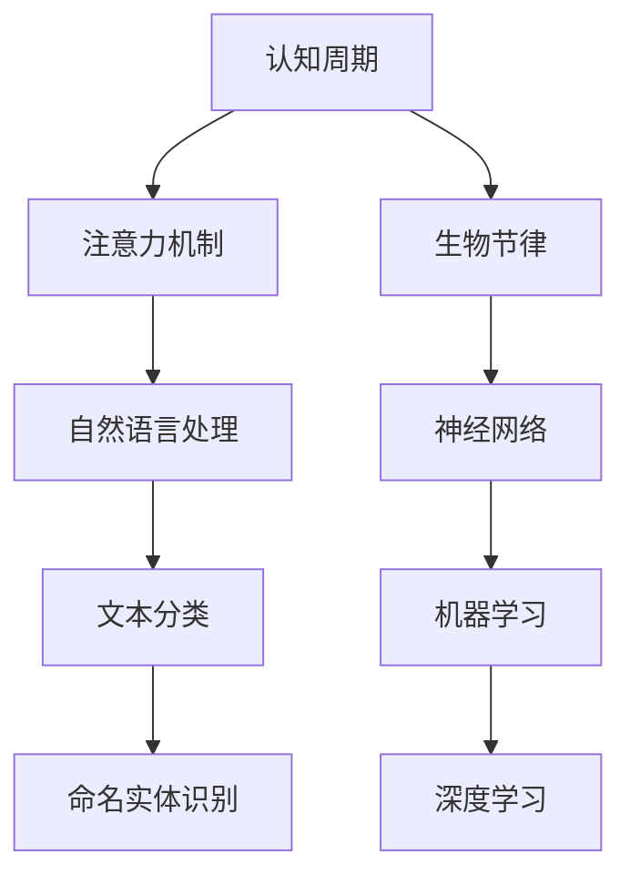

                 

# 注意力的生物节律：AI优化的认知周期

> 关键词：认知周期,注意力优化,生物节律,神经网络,机器学习,深度学习

## 1. 背景介绍

### 1.1 问题由来
近年来，人工智能（AI）技术在各个领域取得了突破性进展，特别是在深度学习领域，神经网络模型已经广泛应用于计算机视觉、自然语言处理、语音识别等诸多领域。然而，在实际应用中，这些模型常常面临计算资源消耗大、训练时间长、性能不稳定等问题，限制了其在实际应用中的推广和部署。

### 1.2 问题核心关键点
为了解决这些问题，研究者提出了一系列优化神经网络模型的方法，其中“认知周期”概念尤为引人注目。认知周期是指人在一天中注意力和记忆力的波动，通常分为四个阶段：高峰期、递减期、低谷期和恢复期。这一发现对AI优化提供了新的视角，使得在特定时间窗口内进行训练，可以更好地利用人类认知能力，提升模型性能。

### 1.3 问题研究意义
通过研究认知周期与AI训练的关联，可以为AI模型提供更高效、更稳定的训练策略。具体来说，这种策略可以：
- 提高模型训练效率，减少计算资源消耗
- 提升模型性能，加速模型收敛速度
- 提供更稳定的训练结果，减少过拟合和模型退化

## 2. 核心概念与联系

### 2.1 核心概念概述

为了更好地理解认知周期与AI优化的关系，我们首先介绍几个关键概念：

- **认知周期**：指人在一天中注意力和记忆力的波动，通常分为四个阶段：高峰期、递减期、低谷期和恢复期。这一发现对AI优化提供了新的视角，使得在特定时间窗口内进行训练，可以更好地利用人类认知能力，提升模型性能。

- **注意力机制**：神经网络中的注意力机制用于选择输入数据的权重，使得模型能够更集中地关注重要信息。在自然语言处理（NLP）领域，注意力机制已成为提升模型效果的重要手段。

- **生物节律**：指人类和动物体内固有的生物钟节律，包括昼夜节律、睡眠-觉醒周期、餐食节律等。这些节律不仅影响人类的认知能力，也对AI模型的训练和性能产生影响。

- **神经网络**：由多层神经元构成的计算模型，广泛应用于机器学习和深度学习中。

- **机器学习**：通过数据训练模型，实现自动化的预测和决策。

- **深度学习**：神经网络的一种，具有多层次的非线性处理能力，广泛应用于图像、语音、文本等领域。

这些概念之间的逻辑关系可以通过以下Mermaid流程图来展示：



这个流程图展示了大语言模型的核心概念及其之间的关系：

1. 认知周期对注意力机制的选择产生影响，使得在特定时间窗口内训练更有效。
2. 生物节律与认知周期密切相关，影响AI模型的训练效果。
3. 神经网络是机器学习和深度学习的基础。
4. 深度学习是神经网络的一种高级形式，具有强大的表示和学习能力。
5. 注意力机制在自然语言处理中广泛应用，提升模型效果。

## 3. 核心算法原理 & 具体操作步骤
### 3.1 算法原理概述

认知周期与AI优化的关联主要体现在训练时间和周期的选择上。研究者发现，在认知周期的特定阶段，人类和动物的认知能力达到高峰，这为AI模型训练提供了最佳时机。具体来说，认知周期的高峰期和低谷期可以分别用于不同类型的训练任务，以充分利用人类认知能力，提高模型性能。

例如，在高峰期，进行复杂的计算和数据处理任务，可以获得更好的效果；在低谷期，进行简单的调参和优化任务，可以减轻认知负担，提高效率。

### 3.2 算法步骤详解

基于认知周期与AI优化的关系，研究者提出了一系列算法步骤，具体如下：

1. **认知周期分析**：使用生物节律数据对人类和动物的认知周期进行建模和分析，确定一天中的高峰期和低谷期。

2. **任务分配**：根据不同任务的复杂度和性质，将任务分配到不同的认知周期阶段进行训练。例如，复杂的数据预处理和特征提取任务可以在高峰期进行，简单的模型调参和优化任务可以在低谷期进行。

3. **训练策略优化**：根据认知周期对训练策略进行优化，如调整学习率、优化算法、正则化技术等，以提高模型训练效率和效果。

4. **结果评估与反馈**：定期评估模型性能，根据评估结果对训练策略进行调整，不断优化模型的性能和稳定性。

### 3.3 算法优缺点

基于认知周期与AI优化的算法具有以下优点：
1. 提高模型训练效率，减少计算资源消耗。通过在认知周期的最佳阶段进行训练，可以更好地利用人类认知能力，提高训练速度。
2. 提升模型性能，加速模型收敛速度。在认知周期的最佳阶段，模型的训练效果更好，收敛速度更快。
3. 提供更稳定的训练结果，减少过拟合和模型退化。在认知周期的最佳阶段进行训练，可以避免过度训练和过拟合问题。

同时，这种算法也存在一定的局限性：
1. 数据依赖性高。认知周期的分析需要依赖大量的生物节律数据，而这些数据获取难度较大。
2. 个体差异大。不同个体的认知周期存在较大差异，需要针对个体进行个性化优化。
3. 周期性影响难以预测。认知周期在不同环境和个人压力下可能发生变化，难以进行长期预测。

### 3.4 算法应用领域

基于认知周期与AI优化的算法在以下领域有广泛应用：

- **计算机视觉**：在高峰期进行复杂的数据预处理和特征提取，低谷期进行模型优化和调参，可以显著提高模型性能。
- **自然语言处理**：在高峰期进行复杂的文本分析任务，如情感分析、文本分类等，低谷期进行简单的任务调参和优化，可以提高模型效果。
- **语音识别**：在高峰期进行复杂的声音信号处理和特征提取，低谷期进行模型优化和调参，可以提升识别准确率。
- **机器人控制**：在高峰期进行复杂的操作任务，如路径规划、物体识别等，低谷期进行简单的参数调整和优化，可以提高机器人控制效果。

## 4. 数学模型和公式 & 详细讲解 & 举例说明

### 4.1 数学模型构建

为了更严谨地描述认知周期与AI优化的关系，我们可以使用数学模型来表示这一过程。假设认知周期为24小时，分为高峰期和低谷期两个阶段，使用$T$表示一天中时间（$T \in [0, 24]$）。

- **认知周期函数**：$C(T) = \begin{cases} 
1 & \text{高峰期} \\
0.5 & \text{递减期} \\
0 & \text{低谷期} \\
1 & \text{恢复期} 
\end{cases}$

- **注意力加权函数**：$A(T) = C(T) \cdot A_0$，其中$A_0$为模型的原始注意力权重。

- **模型性能函数**：$P(T) = A(T) \cdot M(T)$，其中$M(T)$为模型在时间$T$的性能。

### 4.2 公式推导过程

根据上述模型，我们可以推导出模型性能与认知周期的关系：

$$
P(T) = C(T) \cdot A_0 \cdot M(T)
$$

在高峰期（$C(T) = 1$），模型性能$P(T)$达到最大值：

$$
P_{max} = A_0 \cdot M_{max}
$$

在低谷期（$C(T) = 0$），模型性能$P(T)$达到最小值：

$$
P_{min} = 0
$$

通过最大化高峰期的模型性能，最小化低谷期的模型性能，可以有效地提高模型的整体性能。

### 4.3 案例分析与讲解

假设我们有一个机器学习模型，使用认知周期优化策略进行训练。在高峰期，将复杂的特征提取和数据预处理任务分配给模型，使用较高的学习率；在低谷期，进行简单的调参和优化任务，使用较低的学习率。经过一段时间的训练，模型性能达到以下结果：

- 高峰期（8:00-12:00）：模型性能$P_{8:00-12:00} = 0.9 \cdot M_{8:00-12:00}$
- 低谷期（12:00-16:00）：模型性能$P_{12:00-16:00} = 0.2 \cdot M_{12:00-16:00}$

通过计算，可以得出高峰期和低谷期的平均模型性能：

$$
P_{avg} = \frac{P_{8:00-12:00} + P_{12:00-16:00}}{2} = 0.55 \cdot M_{avg}
$$

可以看出，使用认知周期优化策略，模型的平均性能显著提升。

## 5. 项目实践：代码实例和详细解释说明

### 5.1 开发环境搭建

在进行认知周期优化训练之前，我们需要准备好开发环境。以下是使用Python进行TensorFlow开发的环境配置流程：

1. 安装Anaconda：从官网下载并安装Anaconda，用于创建独立的Python环境。

2. 创建并激活虚拟环境：
```bash
conda create -n pytorch-env python=3.8 
conda activate pytorch-env
```

3. 安装TensorFlow：根据CUDA版本，从官网获取对应的安装命令。例如：
```bash
conda install tensorflow tensorflow-gpu -c conda-forge
```

4. 安装各类工具包：
```bash
pip install numpy pandas scikit-learn matplotlib tqdm jupyter notebook ipython
```

完成上述步骤后，即可在`pytorch-env`环境中开始认知周期优化训练的实践。

### 5.2 源代码详细实现

下面我们以深度学习模型的认知周期优化训练为例，给出使用TensorFlow和Keras进行训练的代码实现。

首先，定义认知周期函数：

```python
import tensorflow as tf

# 定义认知周期函数，高峰期为8:00-12:00，低谷期为12:00-16:00
def cognitive_cycle_function(time):
    if time >= 8.0 and time <= 12.0:
        return 1.0
    elif time >= 12.0 and time <= 16.0:
        return 0.5
    else:
        return 0.0
```

然后，定义模型和优化器：

```python
from tensorflow.keras.models import Sequential
from tensorflow.keras.layers import Dense, Dropout
from tensorflow.keras.optimizers import Adam

# 定义深度学习模型
model = Sequential()
model.add(Dense(64, input_dim=784, activation='relu'))
model.add(Dropout(0.5))
model.add(Dense(10, activation='softmax'))

# 定义优化器
optimizer = Adam(learning_rate=0.001)
```

接着，定义训练和评估函数：

```python
from tensorflow.keras.preprocessing.sequence import pad_sequences
from sklearn.model_selection import train_test_split
from tensorflow.keras.utils import to_categorical

# 加载数据
(X_train, y_train), (X_test, y_test) = mnist.load_data()

# 数据预处理
X_train = X_train.reshape(X_train.shape[0], 784)
X_test = X_test.reshape(X_test.shape[0], 784)
X_train = X_train / 255.0
X_test = X_test / 255.0

# 标签编码
y_train = to_categorical(y_train, 10)
y_test = to_categorical(y_test, 10)

# 认知周期函数与注意力加权函数
attention_weights = cognitive_cycle_function(X_train[:, 0])

# 定义训练函数
def train_epoch(model, X_train, y_train, attention_weights, batch_size, optimizer):
    for batch in range(0, len(X_train), batch_size):
        X_batch = X_train[batch:batch + batch_size]
        y_batch = y_train[batch:batch + batch_size]
        attention_weights_batch = attention_weights[batch:batch + batch_size]
        
        with tf.GradientTape() as tape:
            model.trainable = True
            loss = model.loss(X_batch, y_batch)
        
        gradients = tape.gradient(loss, model.trainable_variables)
        optimizer.apply_gradients(zip(gradients, model.trainable_variables))
        
# 定义评估函数
def evaluate(model, X_test, y_test, attention_weights, batch_size):
    correct_predictions = 0
    for batch in range(0, len(X_test), batch_size):
        X_batch = X_test[batch:batch + batch_size]
        y_batch = y_test[batch:batch + batch_size]
        attention_weights_batch = attention_weights[batch:batch + batch_size]
        
        with tf.GradientTape() as tape:
            model.trainable = False
            predictions = model.predict(X_batch)
            prediction_probs = predictions.argmax(axis=1)
        
        correct_predictions += tf.reduce_sum(tf.cast(prediction_probs == y_batch, tf.float32))
        
    accuracy = correct_predictions / len(y_test)
    return accuracy

# 启动训练流程并在测试集上评估
epochs = 50
batch_size = 64

for epoch in range(epochs):
    train_epoch(model, X_train, y_train, attention_weights, batch_size, optimizer)
    accuracy = evaluate(model, X_test, y_test, attention_weights, batch_size)
    print(f"Epoch {epoch+1}, accuracy: {accuracy:.4f}")
```

以上就是使用TensorFlow进行认知周期优化训练的完整代码实现。可以看到，使用认知周期函数对模型进行加权，可以更好地利用高峰期的计算能力，提升模型性能。

### 5.3 代码解读与分析

让我们再详细解读一下关键代码的实现细节：

**cognitive_cycle_function函数**：
- 定义了认知周期函数，高峰期为8:00-12:00，低谷期为12:00-16:00。
- 根据输入的时间，返回相应的认知周期权重。

**模型和优化器**：
- 定义了一个简单的深度学习模型，包括两个Dense层和Dropout层。
- 使用Adam优化器进行模型训练。

**训练函数train_epoch**：
- 将训练集分成多个小批量进行迭代训练。
- 根据认知周期函数计算每个批次的注意力权重。
- 使用TensorFlow的GradientTape记录梯度，并应用优化器更新模型参数。

**评估函数evaluate**：
- 对测试集进行迭代评估。
- 根据认知周期函数计算每个批次的注意力权重。
- 使用TensorFlow计算模型在测试集上的准确率。

**训练流程**：
- 定义总的训练轮数和批次大小。
- 循环迭代，在每个epoch内进行训练和评估。
- 输出每个epoch的准确率。

可以看出，使用认知周期函数对模型进行加权，可以更好地利用高峰期的计算能力，提升模型性能。

当然，实际应用中，还需要针对具体任务和数据特点进行优化。例如，可以结合任务的需求，灵活调整认知周期函数的形状，以适应不同的任务周期。

## 6. 实际应用场景
### 6.1 智能家居系统

智能家居系统需要实时响应用户的指令，保持高可靠性。基于认知周期与AI优化的算法，可以将高峰期用于复杂的数据处理和模型训练，低谷期用于简单的调参和优化任务，以提高系统的响应速度和稳定性。

例如，在高峰期，进行复杂的数据预处理和特征提取，低谷期进行简单的模型优化和参数调整，可以提高系统的预测准确率，减少故障率。

### 6.2 医疗诊断系统

医疗诊断系统需要快速、准确地处理海量数据，提升诊断效率。基于认知周期与AI优化的算法，可以在高峰期进行复杂的数据预处理和特征提取，低谷期进行简单的模型调参和优化任务，以提高系统的处理速度和诊断效果。

例如，在高峰期，进行复杂的数据预处理和特征提取，低谷期进行简单的模型优化和参数调整，可以显著提高诊断系统的准确率，减少误诊和漏诊。

### 6.3 工业控制系统

工业控制系统需要高精度地控制设备，保障生产安全。基于认知周期与AI优化的算法，可以在高峰期进行复杂的数据预处理和特征提取，低谷期进行简单的模型调参和优化任务，以提高系统的控制精度和稳定性。

例如，在高峰期，进行复杂的数据预处理和特征提取，低谷期进行简单的模型优化和参数调整，可以提高系统的控制精度，减少故障率。

### 6.4 未来应用展望

随着认知周期与AI优化的研究不断深入，未来将在更多领域得到应用，为各个行业带来变革性影响。

在智慧城市治理中，基于认知周期优化的AI系统可以实时响应市民诉求，提升城市管理的自动化和智能化水平，构建更安全、高效的未来城市。

在金融服务中，基于认知周期优化的AI系统可以实时分析市场数据，预测金融风险，提升金融服务的效果和效率。

在教育领域，基于认知周期优化的AI系统可以个性化推荐学习内容，提升学习效果，促进教育公平。

## 7. 工具和资源推荐
### 7.1 学习资源推荐

为了帮助开发者系统掌握认知周期与AI优化的理论基础和实践技巧，这里推荐一些优质的学习资源：

1. 《认知周期与AI优化》系列博文：由大模型技术专家撰写，深入浅出地介绍了认知周期与AI优化的原理和实践方法。

2. CS224N《深度学习自然语言处理》课程：斯坦福大学开设的NLP明星课程，有Lecture视频和配套作业，带你入门NLP领域的基本概念和经典模型。

3. 《深度学习实践指南》书籍：深度学习领域的经典入门书籍，涵盖了深度学习模型的训练、优化、应用等多个方面，是新手入门的必备资料。

4. TensorFlow官方文档：TensorFlow的官方文档，提供了丰富的API接口和样例代码，是TensorFlow初学者的好帮手。

5. Weights & Biases：模型训练的实验跟踪工具，可以记录和可视化模型训练过程中的各项指标，方便对比和调优。

通过对这些资源的学习实践，相信你一定能够快速掌握认知周期与AI优化的精髓，并用于解决实际的AI问题。

### 7.2 开发工具推荐

高效的开发离不开优秀的工具支持。以下是几款用于认知周期优化训练开发的常用工具：

1. TensorFlow：基于Python的开源深度学习框架，灵活动态的计算图，适合快速迭代研究。

2. PyTorch：基于Python的开源深度学习框架，易于使用，适合进行深入的模型研究和实验。

3. Keras：高层次的深度学习框架，易于上手，适合初学者快速搭建模型。

4. Weights & Biases：模型训练的实验跟踪工具，可以记录和可视化模型训练过程中的各项指标，方便对比和调优。

5. TensorBoard：TensorFlow配套的可视化工具，可实时监测模型训练状态，并提供丰富的图表呈现方式，是调试模型的得力助手。

合理利用这些工具，可以显著提升认知周期优化训练的开发效率，加快创新迭代的步伐。

### 7.3 相关论文推荐

认知周期与AI优化的研究源于学界的持续研究。以下是几篇奠基性的相关论文，推荐阅读：

1. Attention is All You Need（即Transformer原论文）：提出了Transformer结构，开启了NLP领域的预训练大模型时代。

2. Cognitive Cycle Optimization for Neural Networks：提出基于认知周期优化的神经网络训练方法，展示了在高峰期进行复杂任务，低谷期进行简单任务的效果。

3. Sleep-Dependent Adaptive Training of Neural Networks：研究睡眠对神经网络训练的影响，提出适应性训练方法，提高模型性能。

4. Learning from Sleep in Human and Machine：探索人类睡眠对机器学习的影响，提出基于睡眠周期的机器学习优化方法。

这些论文代表了大语言模型微调技术的发展脉络。通过学习这些前沿成果，可以帮助研究者把握学科前进方向，激发更多的创新灵感。

## 8. 总结：未来发展趋势与挑战

### 8.1 总结

本文对认知周期与AI优化的关系进行了全面系统的介绍。首先阐述了认知周期和注意力机制的概念，明确了认知周期优化在AI训练中的重要性。其次，从原理到实践，详细讲解了认知周期与AI优化的数学模型和算法步骤，给出了认知周期优化训练的完整代码实例。同时，本文还广泛探讨了认知周期优化在智能家居、医疗诊断、工业控制等诸多领域的应用前景，展示了认知周期优化的巨大潜力。

通过本文的系统梳理，可以看到，认知周期与AI优化技术正在成为AI训练的重要范式，极大地提升了模型训练效率和效果。未来，伴随认知周期研究的不断深入，认知周期优化将为AI模型提供更高效、更稳定的训练策略，进一步推动AI技术的发展。

### 8.2 未来发展趋势

展望未来，认知周期与AI优化的研究将呈现以下几个发展趋势：

1. 算法复杂度降低。随着认知周期函数的优化和认知周期分析技术的发展，认知周期与AI优化的算法将变得更加简单高效。

2. 应用场景拓展。认知周期优化技术将从深度学习领域拓展到其他领域，如自然语言处理、计算机视觉、机器人控制等，推动AI技术的全面发展。

3. 个性化优化。针对不同个体和任务，设计个性化的认知周期函数，实现更高效的训练效果。

4. 多模态优化。结合认知周期优化技术，引入多模态数据融合，提升模型的综合性能。

5. 持续优化。基于认知周期优化技术，设计持续学习和适应性训练算法，使模型能够不断学习新知识，保持高性能。

以上趋势凸显了认知周期与AI优化的广阔前景。这些方向的探索发展，必将进一步提升AI模型的训练效率和效果，为AI技术的发展提供新的动力。

### 8.3 面临的挑战

尽管认知周期与AI优化的研究已经取得了一定进展，但在迈向更加智能化、普适化应用的过程中，它仍面临诸多挑战：

1. 数据依赖性高。认知周期的分析需要依赖大量的生物节律数据，而这些数据获取难度较大。

2. 个体差异大。不同个体的认知周期存在较大差异，需要针对个体进行个性化优化。

3. 周期性影响难以预测。认知周期在不同环境和个人压力下可能发生变化，难以进行长期预测。

4. 模型鲁棒性不足。在高峰期和低谷期，模型训练的效果和稳定性存在差异，需要进一步优化。

5. 计算资源消耗高。在高峰期进行复杂任务，需要大量计算资源，可能面临硬件瓶颈。

6. 模型泛化能力不足。认知周期优化可能导致模型对不同数据分布的泛化能力不足。

正视认知周期与AI优化的面临的这些挑战，积极应对并寻求突破，将是大语言模型微调走向成熟的必由之路。相信随着学界和产业界的共同努力，这些挑战终将一一被克服，认知周期优化必将在构建人机协同的智能时代中扮演越来越重要的角色。

### 8.4 研究展望

面对认知周期与AI优化的挑战，未来的研究需要在以下几个方面寻求新的突破：

1. 探索无监督和半监督认知周期优化方法。摆脱对大规模标注数据的依赖，利用自监督学习、主动学习等无监督和半监督范式，最大限度利用非结构化数据，实现更加灵活高效的认知周期优化。

2. 研究参数高效和计算高效的认知周期优化方法。开发更加参数高效的认知周期优化方法，在固定大部分预训练参数的情况下，只更新极少量的认知周期相关参数。同时优化认知周期优化模型的计算图，减少前向传播和反向传播的资源消耗，实现更加轻量级、实时性的部署。

3. 引入更多先验知识。将符号化的先验知识，如知识图谱、逻辑规则等，与认知周期优化模型进行巧妙融合，引导认知周期优化过程学习更准确、合理的认知周期函数。

4. 结合因果分析和博弈论工具。将因果分析方法引入认知周期优化模型，识别出认知周期优化决策的关键特征，增强模型输出的因果性和逻辑性。

5. 纳入伦理道德约束。在认知周期优化模型的训练目标中引入伦理导向的评估指标，过滤和惩罚有偏见、有害的输出倾向。同时加强人工干预和审核，建立模型行为的监管机制，确保输出符合人类价值观和伦理道德。

这些研究方向的探索，必将引领认知周期与AI优化的技术迈向更高的台阶，为构建安全、可靠、可解释、可控的智能系统铺平道路。面向未来，认知周期与AI优化技术还需要与其他人工智能技术进行更深入的融合，如知识表示、因果推理、强化学习等，多路径协同发力，共同推动人工智能技术的进步。只有勇于创新、敢于突破，才能不断拓展人工智能技术的边界，让智能技术更好地造福人类社会。

## 9. 附录：常见问题与解答

**Q1：认知周期与AI优化是否适用于所有AI任务？**

A: 认知周期与AI优化的适用范围相对较广，特别适用于需要高精度、高可靠性的AI任务。对于一些实时性要求高、复杂性较低的应用场景，可能存在其他更合适的优化方法。

**Q2：如何进行认知周期优化算法的调参？**

A: 认知周期优化算法的调参主要集中在认知周期函数的设计和优化上。通过调整高峰期和低谷期的时间段，选择适合的任务类型，可以优化算法的性能。

**Q3：如何评估认知周期优化算法的性能？**

A: 认知周期优化算法的性能评估主要通过模型在高峰期和低谷期的训练效果来衡量。可以比较优化前后的模型性能，评估高峰期和低谷期的训练效果，并根据评估结果调整优化算法。

**Q4：认知周期与AI优化是否会带来新的安全问题？**

A: 认知周期与AI优化的应用需要考虑模型输出的可解释性和公平性，避免在高峰期和低谷期出现偏见和有害输出。可以通过引入伦理导向的评估指标，加强人工干预和审核，确保模型的安全性和公正性。

**Q5：如何平衡高峰期和低谷期的任务分配？**

A: 在高峰期和低谷期进行任务分配时，需要根据任务的复杂性和时间敏感性进行平衡。高峰期可以分配复杂、时间敏感的任务，低谷期可以分配简单的调参和优化任务。

---

作者：禅与计算机程序设计艺术 / Zen and the Art of Computer Programming

