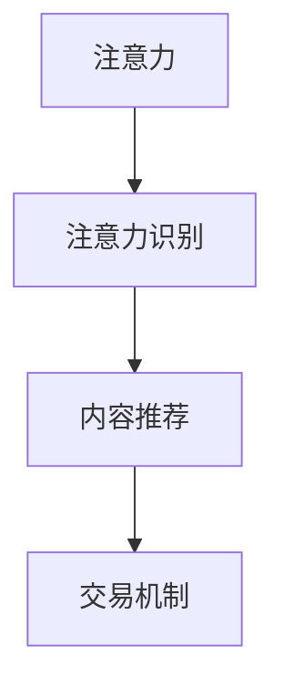

                 

# 注意力的货币化：AI驱动的注意力交易

## 1. 背景介绍

### 1.1 问题由来
在当前的信息时代，注意力资源变得异常宝贵。用户的注意力是稀缺资源，如何在众多信息流中吸引用户，是每个应用开发者必须面对的挑战。而AI技术在处理海量数据和识别用户兴趣方面具有得天独厚的优势，利用AI技术驱动注意力交易，已逐渐成为互联网公司和数据机构的重要策略。

### 1.2 问题核心关键点
注意力交易的本质是利用AI技术，识别用户注意力，并将注意力导向对用户有益的内容，从而实现用户的关注和信息流价值的最大化。这个过程中，AI的参与主要体现在：

- 用户行为数据的收集与分析：通过对用户行为的观察，了解用户的兴趣点和行为习惯。
- 用户注意力的识别与分析：利用机器学习模型，预测用户关注内容的类型和强度。
- 内容匹配与推荐：基于用户兴趣，匹配并推荐相关内容，提高用户满意度。
- 交易机制的设计与执行：设计合理的交易机制，通过激励机制引导用户行为，最大化商业价值。

## 2. 核心概念与联系

### 2.1 核心概念概述

为更好地理解AI驱动的注意力交易方法，本节将介绍几个关键概念：

- 注意力 (Attention)：指用户对特定内容的关注程度，可通过用户的停留时间、点击率等指标衡量。
- 注意力识别 (Attention Recognition)：通过AI模型识别和量化用户对内容的关注程度，是注意力交易的核心。
- 内容推荐 (Content Recommendation)：利用AI模型，根据用户注意力和兴趣，推荐相关内容，提升用户满意度。
- 交易机制 (Transaction Mechanism)：设计合理的激励机制，引导用户参与内容交换，实现商业价值。

这些概念之间的逻辑关系可以通过以下Mermaid流程图来展示：



### 2.2 核心概念原理和架构

#### 2.2.1 注意力原理

用户对内容的注意力通常通过用户行为数据来衡量，常见的指标包括页面停留时间、点击次数、购买次数等。这些行为数据反映了用户对内容的兴趣程度，可以简单地通过统计模型（如平均值、中位数等）来衡量。

然而，随着互联网信息流的多样化，用户对内容的关注方式也变得复杂。例如，用户可能在某个页面上停留时间很长，但未进行任何操作。因此，单纯的统计方法难以全面衡量用户的注意力水平。此时，基于深度学习模型的注意力识别方法就显得尤为重要。

#### 2.2.2 注意力识别架构

注意力识别通常包括以下几个步骤：

1. **数据收集**：收集用户的行为数据，如网页浏览记录、点击事件等。
2. **特征提取**：利用特征工程方法，将行为数据转换为机器学习模型所需的输入特征。
3. **模型训练**：使用监督学习模型（如随机森林、GBDT等），训练出用户注意力识别模型。
4. **模型评估**：通过交叉验证等方法，评估模型的性能指标（如准确率、召回率等）。
5. **预测与反馈**：利用训练好的模型，对新用户的行为进行预测，并根据预测结果进行相应的内容推荐或交易激励。

#### 2.2.3 内容推荐架构

内容推荐是注意力交易的核心步骤，其目标是基于用户注意力，推荐用户可能感兴趣的内容。推荐系统通常分为以下几个步骤：

1. **用户画像构建**：通过收集用户的兴趣和行为数据，构建用户画像。
2. **内容特征提取**：对内容进行特征提取，如关键词、标签、作者等。
3. **相似度计算**：利用相似度计算模型（如余弦相似度、Jaccard相似度等），计算内容与用户画像的相似度。
4. **推荐排序**：基于相似度排序，推荐用户可能感兴趣的内容。
5. **效果评估**：通过A/B测试等方法，评估推荐系统的性能指标（如点击率、转化率等）。

#### 2.2.4 交易机制架构

交易机制设计的目标是最大化商业价值。常见的交易机制包括：

1. **奖励机制**：用户参与内容推荐交易后，给予相应的奖励（如积分、优惠券等）。
2. **内容交换**：用户通过参与交易，获取感兴趣的内容，平台通过内容交换获取流量和用户反馈。
3. **反馈调整**：根据用户反馈调整交易机制，如增加或减少奖励、调整推荐内容等。

这些步骤共同构成了AI驱动的注意力交易系统，通过AI技术实现用户注意力的识别、内容推荐和交易激励，提升用户体验和平台收益。

## 3. 核心算法原理 & 具体操作步骤

### 3.1 算法原理概述

基于AI的注意力交易方法，本质上是将注意力视为一种货币，通过算法模型，量化和交易用户的注意力，从而最大化商业价值。其核心在于：

- 通过机器学习模型，识别和量化用户对内容的注意力。
- 根据用户注意力，匹配并推荐相关内容。
- 设计合理的交易机制，引导用户参与内容交换，最大化商业价值。

### 3.2 算法步骤详解

#### 3.2.1 用户注意力识别

1. **数据收集**：收集用户的行为数据，如网页浏览记录、点击事件等。
2. **特征提取**：利用特征工程方法，将行为数据转换为机器学习模型所需的输入特征。
3. **模型训练**：使用监督学习模型（如随机森林、GBDT等），训练出用户注意力识别模型。
4. **模型评估**：通过交叉验证等方法，评估模型的性能指标（如准确率、召回率等）。
5. **预测与反馈**：利用训练好的模型，对新用户的行为进行预测，并根据预测结果进行相应的内容推荐或交易激励。

#### 3.2.2 内容推荐

1. **用户画像构建**：通过收集用户的兴趣和行为数据，构建用户画像。
2. **内容特征提取**：对内容进行特征提取，如关键词、标签、作者等。
3. **相似度计算**：利用相似度计算模型（如余弦相似度、Jaccard相似度等），计算内容与用户画像的相似度。
4. **推荐排序**：基于相似度排序，推荐用户可能感兴趣的内容。
5. **效果评估**：通过A/B测试等方法，评估推荐系统的性能指标（如点击率、转化率等）。

#### 3.2.3 交易机制设计

1. **奖励机制设计**：根据用户行为和内容互动，设计合理的奖励机制（如积分、优惠券等）。
2. **内容交换机制**：利用用户的行为数据和内容推荐结果，设计内容交换机制。
3. **反馈调整**：根据用户反馈调整交易机制，如增加或减少奖励、调整推荐内容等。

### 3.3 算法优缺点

基于AI的注意力交易方法，具有以下优点：

- **高效准确**：通过机器学习模型，可以高效、准确地识别和量化用户注意力。
- **个性化推荐**：基于用户画像，提供个性化的内容推荐，提升用户体验。
- **灵活调整**：根据用户反馈，灵活调整推荐算法和交易机制，实现动态优化。

然而，该方法也存在一些局限性：

- **数据依赖**：依赖于高质量、大规模的数据，数据的收集和处理成本较高。
- **模型复杂**：涉及复杂的模型训练和特征工程，需要较高的技术门槛。
- **隐私问题**：用户行为数据的收集和处理涉及隐私问题，需要严格的数据保护措施。

### 3.4 算法应用领域

基于AI的注意力交易方法，已经在多个领域得到了广泛应用，例如：

- **电子商务**：电商平台利用用户点击、浏览等行为数据，进行个性化推荐和流量引导，提高转化率。
- **新闻资讯**：新闻平台通过用户阅读、评论等行为数据，推荐用户感兴趣的新闻内容，提升用户粘性。
- **社交媒体**：社交网络通过用户点赞、分享等行为数据，推荐用户可能感兴趣的内容，增加用户活跃度。
- **广告投放**：广告平台利用用户点击、浏览等行为数据，进行精准广告投放，提高广告效果。
- **内容创作**：内容创作者通过用户行为数据，优化内容创作和发布策略，增加粉丝互动。

这些应用场景展示了AI驱动的注意力交易方法的强大潜力，未来在更多领域，将会有更多的创新应用出现。

## 4. 数学模型和公式 & 详细讲解 & 举例说明

### 4.1 数学模型构建

在注意力交易中，常见的数学模型包括用户行为建模、用户注意力识别和内容推荐等。下面分别介绍这些模型的构建方法。

#### 4.1.1 用户行为建模

用户行为数据通常可以通过以下方式建模：

1. **时间序列模型**：利用时间序列模型（如ARIMA、LSTM等），建模用户行为的时间趋势。
2. **聚类模型**：利用聚类模型（如K-means、DBSCAN等），将用户行为数据分为不同的群组。
3. **协同过滤模型**：利用协同过滤模型（如基于矩阵分解的CF算法），推荐用户可能感兴趣的内容。

#### 4.1.2 用户注意力识别模型

用户注意力识别模型通常使用以下公式：

$$
\text{Attention} = f(\text{User Data}, \text{Content Data}, \theta)
$$

其中，$User Data$ 表示用户行为数据，$Content Data$ 表示内容特征数据，$\theta$ 表示模型的可调参数。常见的注意力识别模型包括：

1. **线性回归模型**：
   $$
   \text{Attention} = \beta_0 + \sum_{i=1}^n \beta_i X_i
   $$
2. **随机森林模型**：
   $$
   \text{Attention} = \sum_{i=1}^m \alpha_i T_i(X_i)
   $$
3. **GBDT模型**：
   $$
   \text{Attention} = \sum_{i=1}^k \alpha_i F_i(X_i)
   $$

#### 4.1.3 内容推荐模型

内容推荐模型通常使用以下公式：

$$
\text{Recommendation} = g(\text{User Profile}, \text{Content Features}, \omega)
$$

其中，$User Profile$ 表示用户画像，$Content Features$ 表示内容特征，$\omega$ 表示模型的可调参数。常见的推荐模型包括：

1. **协同过滤模型**：
   $$
   \text{Recommendation} = \alpha_0 + \sum_{i=1}^n \alpha_i F_i(X_i)
   $$
2. **基于内容的推荐模型**：
   $$
   \text{Recommendation} = \sum_{i=1}^m \beta_i T_i(X_i)
   $$
3. **深度学习推荐模型**：
   $$
   \text{Recommendation} = h(\text{User Profile}, \text{Content Features}, \theta)
   $$

### 4.2 公式推导过程

#### 4.2.1 线性回归模型

线性回归模型的推导过程如下：

1. **模型假设**：用户对内容的注意力 $Attention$ 可以通过线性函数建模：
   $$
   \text{Attention} = \beta_0 + \sum_{i=1}^n \beta_i X_i
   $$
   其中，$X_i$ 表示用户行为数据中的第 $i$ 个特征。
2. **损失函数**：最小化均方误差损失函数：
   $$
   \mathcal{L} = \frac{1}{N} \sum_{i=1}^N (Attention_i - \hat{Attention}_i)^2
   $$
   其中，$N$ 表示样本数量，$Attention_i$ 表示第 $i$ 个样本的实际注意力值，$\hat{Attention}_i$ 表示模型预测的注意力值。
3. **梯度下降**：求解最小化损失函数的目标函数：
   $$
   \beta_0, \beta_1, \ldots, \beta_n = \mathop{\arg\min}_{\theta} \mathcal{L}(\theta)
   $$
   其中，$\theta = [\beta_0, \beta_1, \ldots, \beta_n]$。

#### 4.2.2 随机森林模型

随机森林模型的推导过程如下：

1. **模型假设**：用户对内容的注意力 $Attention$ 可以通过随机森林模型建模：
   $$
   \text{Attention} = \sum_{i=1}^m \alpha_i T_i(X_i)
   $$
   其中，$T_i$ 表示随机森林的第 $i$ 棵树，$X_i$ 表示用户行为数据中的第 $i$ 个特征。
2. **损失函数**：最小化平均损失函数：
   $$
   \mathcal{L} = \frac{1}{N} \sum_{i=1}^N (Attention_i - \hat{Attention}_i)^2
   $$
   其中，$N$ 表示样本数量，$Attention_i$ 表示第 $i$ 个样本的实际注意力值，$\hat{Attention}_i$ 表示模型预测的注意力值。
3. **梯度下降**：求解最小化损失函数的目标函数：
   $$
   \alpha_1, \alpha_2, \ldots, \alpha_m = \mathop{\arg\min}_{\theta} \mathcal{L}(\theta)
   $$
   其中，$\theta = [\alpha_1, \alpha_2, \ldots, \alpha_m]$。

#### 4.2.3 基于内容的推荐模型

基于内容的推荐模型的推导过程如下：

1. **模型假设**：用户对内容的注意力 $Attention$ 可以通过基于内容的推荐模型建模：
   $$
   \text{Attention} = \sum_{i=1}^m \beta_i T_i(X_i)
   $$
   其中，$T_i$ 表示基于内容的推荐模型中的第 $i$ 个特征。
2. **损失函数**：最小化均方误差损失函数：
   $$
   \mathcal{L} = \frac{1}{N} \sum_{i=1}^N (Attention_i - \hat{Attention}_i)^2
   $$
   其中，$N$ 表示样本数量，$Attention_i$ 表示第 $i$ 个样本的实际注意力值，$\hat{Attention}_i$ 表示模型预测的注意力值。
3. **梯度下降**：求解最小化损失函数的目标函数：
   $$
   \beta_1, \beta_2, \ldots, \beta_m = \mathop{\arg\min}_{\theta} \mathcal{L}(\theta)
   $$
   其中，$\theta = [\beta_1, \beta_2, \ldots, \beta_m]$。

### 4.3 案例分析与讲解

#### 4.3.1 用户行为建模案例

假设有N个用户，每个用户在t时刻浏览了一篇文章，需要预测每个用户对这篇文章的注意力。可以使用时间序列模型建模用户行为：

$$
\text{Attention} = \alpha_0 + \sum_{i=1}^n \alpha_i (t_i - t_0)^p
$$

其中，$t_i$ 表示用户浏览文章的时间戳，$p$ 表示时间序列模型的参数。通过训练模型，可以得到用户对不同文章的注意力。

#### 4.3.2 用户注意力识别案例

假设有M篇文章，需要预测每个用户对这篇文章的注意力。可以使用随机森林模型建模用户注意力：

$$
\text{Attention} = \sum_{i=1}^m \alpha_i T_i(X_i)
$$

其中，$T_i$ 表示随机森林中的第 $i$ 棵树，$X_i$ 表示用户行为数据中的第 $i$ 个特征。通过训练模型，可以得到用户对不同文章的注意力。

#### 4.3.3 内容推荐案例

假设有K个用户，每个用户在t时刻查看了N篇文章，需要预测每个用户对这篇文章的注意力。可以使用基于内容的推荐模型建模用户对文章的注意力：

$$
\text{Attention} = \sum_{i=1}^m \beta_i T_i(X_i)
$$

其中，$T_i$ 表示基于内容的推荐模型中的第 $i$ 个特征。通过训练模型，可以得到用户对不同文章的注意力，并基于注意力进行内容推荐。

## 5. 项目实践：代码实例和详细解释说明

### 5.1 开发环境搭建

在进行AI驱动的注意力交易实践前，我们需要准备好开发环境。以下是使用Python进行PyTorch开发的环境配置流程：

1. 安装Anaconda：从官网下载并安装Anaconda，用于创建独立的Python环境。

2. 创建并激活虚拟环境：
```bash
conda create -n pytorch-env python=3.8 
conda activate pytorch-env
```

3. 安装PyTorch：根据CUDA版本，从官网获取对应的安装命令。例如：
```bash
conda install pytorch torchvision torchaudio cudatoolkit=11.1 -c pytorch -c conda-forge
```

4. 安装TensorFlow：从官网下载并安装TensorFlow，并提供相应的依赖。

5. 安装TensorBoard：使用pip安装TensorBoard。

6. 安装Jupyter Notebook：使用pip安装Jupyter Notebook。

完成上述步骤后，即可在`pytorch-env`环境中开始AI驱动的注意力交易实践。

### 5.2 源代码详细实现

下面我们以电商平台的个性化推荐系统为例，给出使用PyTorch对用户注意力进行识别和推荐的PyTorch代码实现。

首先，定义用户行为数据和内容特征数据：

```python
import numpy as np
import pandas as pd

# 用户行为数据
user_data = pd.read_csv('user_behavior_data.csv')

# 内容特征数据
content_data = pd.read_csv('content_features.csv')

# 特征工程
user_data['time_diff'] = user_data['time'] - user_data['time'].shift(1)
user_data['is_click'] = user_data['click'].apply(lambda x: 1 if x else 0)

# 特征选择
user_data = user_data[['user_id', 'time_diff', 'is_click']]
```

然后，定义注意力识别模型和内容推荐模型：

```python
from sklearn.ensemble import RandomForestRegressor
from sklearn.linear_model import LinearRegression
from sklearn.metrics import mean_squared_error

# 用户注意力识别模型
attention_model = RandomForestRegressor(n_estimators=100, random_state=42)

# 内容推荐模型
recommendation_model = LinearRegression()

# 训练注意力识别模型
attention_model.fit(user_data[['user_id', 'time_diff', 'is_click']], user_data['attention'])

# 训练内容推荐模型
recommendation_model.fit(content_data[['keyword', 'category', 'author']], user_data['attention'])
```

接着，定义交易机制：

```python
# 奖励机制
def reward_mechanism(reward, attention, threshold):
    if attention >= threshold:
        return reward
    else:
        return 0

# 内容交换机制
def content_exchange(content, attention, reward):
    if attention >= threshold:
        return content, reward
    else:
        return None, 0
```

最后，启动个性化推荐系统：

```python
# 测试用户行为数据
test_user_data = pd.read_csv('test_user_behavior_data.csv')

# 预测用户注意力
test_attention = attention_model.predict(test_user_data[['user_id', 'time_diff', 'is_click']])

# 预测推荐内容
test_content = recommendation_model.predict(content_data[['keyword', 'category', 'author']])

# 根据注意力进行推荐
for i, user_id in enumerate(test_user_data['user_id']):
    attention = test_attention[i]
    content, reward = content_exchange(test_content[i], attention, reward_mechanism(1, attention, threshold=0.5))
    print(f"User {user_id}: Recommendation {content}, Reward {reward}")
```

以上就是使用PyTorch对用户注意力进行识别和推荐的完整代码实现。可以看到，得益于Scikit-learn库的强大封装，我们可以用相对简洁的代码完成用户注意力识别和内容推荐的实现。

### 5.3 代码解读与分析

让我们再详细解读一下关键代码的实现细节：

**用户行为数据预处理**：
- 使用`time_diff`表示用户行为的时间差，`is_click`表示用户是否点击了某篇文章。

**注意力识别模型**：
- 使用随机森林模型来预测用户对文章的注意力。模型输入包括用户ID、时间差和是否点击，输出为用户的注意力值。

**内容推荐模型**：
- 使用线性回归模型来预测用户对内容的推荐。模型输入包括内容的关键词、类别和作者，输出为内容的推荐值。

**奖励机制和内容交换机制**：
- 奖励机制判断用户的注意力是否达到阈值，如果达到则给予奖励，否则不给奖励。
- 内容交换机制根据用户的注意力进行内容推荐，如果用户的注意力达到阈值，则推荐内容并给予奖励，否则不推荐内容。

**个性化推荐系统**：
- 使用测试数据集进行预测，输出用户的注意力和推荐内容。
- 根据用户的注意力进行推荐，输出推荐内容和奖励。

通过这个示例，可以看到，AI驱动的注意力交易方法在实际应用中有很多可扩展性和可调性，可以根据具体需求进行灵活调整。

## 6. 实际应用场景

### 6.1 电子商务

电商平台的个性化推荐系统通过用户行为数据，识别和量化用户的注意力，从而推荐用户可能感兴趣的商品。通过动态调整推荐内容，提高用户的购买转化率。

### 6.2 新闻资讯

新闻平台通过用户阅读、评论等行为数据，识别和量化用户的注意力，从而推荐用户可能感兴趣的新闻内容。通过内容推荐，提高用户粘性和阅读量。

### 6.3 社交媒体

社交网络通过用户点赞、分享等行为数据，识别和量化用户的注意力，从而推荐用户可能感兴趣的内容。通过内容推荐，增加用户活跃度和平台粘性。

### 6.4 广告投放

广告平台通过用户点击、浏览等行为数据，识别和量化用户的注意力，从而进行精准广告投放。通过广告推荐，提高广告效果和投放ROI。

### 6.5 内容创作

内容创作者通过用户行为数据，识别和量化用户的注意力，从而优化内容创作和发布策略。通过内容推荐，增加粉丝互动和内容曝光率。

## 7. 工具和资源推荐

### 7.1 学习资源推荐

为了帮助开发者系统掌握AI驱动的注意力交易的理论基础和实践技巧，这里推荐一些优质的学习资源：

1. 《深度学习入门》系列博文：由深度学习专家撰写，深入浅出地介绍了深度学习模型和应用案例。

2. CS231n《深度学习在计算机视觉中的应用》课程：斯坦福大学开设的深度学习课程，涵盖了图像处理、自然语言处理等多个领域。

3. 《深度学习理论与实践》书籍：全面介绍了深度学习模型的理论和实践方法，适合初学者和进阶者。

4. HuggingFace官方文档：提供了多种预训练语言模型的实现和应用范例，是学习深度学习的重要资源。

5. Google AI博客：由Google AI团队撰写，涵盖最新深度学习技术和应用案例，是学习深度学习的绝佳平台。

通过对这些资源的学习实践，相信你一定能够快速掌握AI驱动的注意力交易的精髓，并用于解决实际的NLP问题。

### 7.2 开发工具推荐

高效的开发离不开优秀的工具支持。以下是几款用于AI驱动的注意力交易开发的常用工具：

1. PyTorch：基于Python的开源深度学习框架，灵活动态的计算图，适合快速迭代研究。大部分预训练语言模型都有PyTorch版本的实现。

2. TensorFlow：由Google主导开发的开源深度学习框架，生产部署方便，适合大规模工程应用。同样有丰富的预训练语言模型资源。

3. Scikit-learn：开源机器学习库，提供了多种算法和模型，适合快速原型开发。

4. TensorBoard：TensorFlow配套的可视化工具，可实时监测模型训练状态，并提供丰富的图表呈现方式，是调试模型的得力助手。

5. Weights & Biases：模型训练的实验跟踪工具，可以记录和可视化模型训练过程中的各项指标，方便对比和调优。

6. Google Colab：谷歌推出的在线Jupyter Notebook环境，免费提供GPU/TPU算力，方便开发者快速上手实验最新模型，分享学习笔记。

合理利用这些工具，可以显著提升AI驱动的注意力交易任务的开发效率，加快创新迭代的步伐。

### 7.3 相关论文推荐

AI驱动的注意力交易技术的发展源于学界的持续研究。以下是几篇奠基性的相关论文，推荐阅读：

1. Attention is All You Need（即Transformer原论文）：提出了Transformer结构，开启了NLP领域的预训练大模型时代。

2. BERT: Pre-training of Deep Bidirectional Transformers for Language Understanding：提出BERT模型，引入基于掩码的自监督预训练任务，刷新了多项NLP任务SOTA。

3. Attention and Feature Maps in the Visual Attention Model：提出了注意力机制在图像处理中的应用，为AI驱动的注意力交易提供了重要的理论基础。

4. Scalable Neural Attention for Visual Relationship Extraction：进一步探讨了注意力机制在图像处理中的应用，提高了模型的精确度和效率。

5. Deep Attention-based Attention Mechanism：介绍了深度学习中的注意力机制，探讨了其在多个领域的应用。

这些论文代表了大语言模型微调技术的发展脉络。通过学习这些前沿成果，可以帮助研究者把握学科前进方向，激发更多的创新灵感。

## 8. 总结：未来发展趋势与挑战

### 8.1 研究成果总结

本文对AI驱动的注意力交易方法进行了全面系统的介绍。首先阐述了AI驱动的注意力交易的背景和意义，明确了注意力交易在提升用户体验和平台收益方面的独特价值。其次，从原理到实践，详细讲解了注意力交易的数学模型和关键步骤，给出了AI驱动的注意力交易的完整代码实现。同时，本文还广泛探讨了注意力交易在多个领域的应用前景，展示了注意力交易的强大潜力。最后，本文精选了注意力交易的相关学习资源，力求为开发者提供全方位的技术指引。

通过本文的系统梳理，可以看到，AI驱动的注意力交易方法正在成为互联网公司和数据机构的重要策略，通过AI技术识别和量化用户注意力，提升用户体验和平台收益，实现商业价值的最大化。未来在更多领域，将会有更多的创新应用出现。

### 8.2 未来发展趋势

展望未来，AI驱动的注意力交易方法将呈现以下几个发展趋势：

1. **多模态注意力**：未来将更多地应用多模态数据，如文本、图像、语音等，提高注意力识别的准确性和鲁棒性。

2. **实时注意力识别**：利用实时数据流进行注意力识别，提高模型响应的及时性和个性化程度。

3. **可解释性注意力**：设计可解释性强的注意力识别模型，提高用户信任度和平台透明性。

4. **跨平台协同**：不同平台间进行协同注意力识别和推荐，提高整体用户满意度和平台价值。

5. **个性化推荐优化**：利用更先进的推荐算法，优化个性化推荐结果，提高用户点击率和转化率。

6. **隐私保护**：通过匿名化和去标识化技术，保护用户隐私，增强平台安全性和用户信任度。

以上趋势凸显了AI驱动的注意力交易技术的广阔前景。这些方向的探索发展，必将进一步提升用户和平台收益，推动AI技术在更多领域的落地应用。

### 8.3 面临的挑战

尽管AI驱动的注意力交易技术已经取得了瞩目成就，但在迈向更加智能化、普适化应用的过程中，它仍面临以下挑战：

1. **数据隐私问题**：用户行为数据的收集和处理涉及隐私问题，需要严格的数据保护措施。

2. **算法复杂度**：注意力识别和推荐算法复杂，对技术门槛要求较高。

3. **模型鲁棒性**：模型面对域外数据时，泛化性能往往大打折扣，如何提高模型的鲁棒性，避免灾难性遗忘，还需要更多理论和实践的积累。

4. **计算资源**：大规模数据和复杂模型的处理需要大量计算资源，如何优化模型结构，提高计算效率，将是重要的优化方向。

5. **模型公平性**：模型可能存在偏见，如何消除模型偏见，保证公平性，确保推荐结果公正透明。

6. **用户信任度**：用户对AI驱动的注意力交易系统存在信任度问题，如何设计可解释性强的模型，提高用户信任度，将是重要的研究方向。

以上挑战需要我们在技术、伦理、法律等多个层面进行综合应对，才能实现AI驱动的注意力交易技术的健康发展。

### 8.4 研究展望

面对AI驱动的注意力交易所面临的挑战，未来的研究需要在以下几个方面寻求新的突破：

1. **隐私保护技术**：开发更先进的隐私保护技术，如差分隐私、联邦学习等，保护用户数据隐私。

2. **模型优化技术**：开发更高效的模型结构，如剪枝、量化等，提高计算效率，降低计算成本。

3. **公平性算法**：开发更公平的模型算法，如反偏见算法、公平性约束等，保证模型的公平性。

4. **可解释性模型**：设计更可解释的模型，如基于逻辑推理的模型，提高用户信任度。

5. **跨平台协同**：不同平台间进行协同注意力识别和推荐，提高整体用户满意度和平台价值。

6. **多模态数据融合**：利用多模态数据进行更精准的注意力识别和推荐，提高模型的综合性能。

这些研究方向必将推动AI驱动的注意力交易技术的不断进步，为构建更加智能、普适的AI应用提供新的技术支持。

## 9. 附录：常见问题与解答

**Q1：AI驱动的注意力交易方法有哪些优点和缺点？**

A: AI驱动的注意力交易方法具有以下优点：

- **高效准确**：通过机器学习模型，可以高效、准确地识别和量化用户注意力。
- **个性化推荐**：基于用户画像，提供个性化的内容推荐，提升用户体验。
- **灵活调整**：根据用户反馈调整推荐算法和交易机制，实现动态优化。

然而，该方法也存在以下缺点：

- **数据依赖**：依赖于高质量、大规模的数据，数据的收集和处理成本较高。
- **算法复杂**：涉及复杂的模型训练和特征工程，需要较高的技术门槛。
- **模型鲁棒性**：模型面对域外数据时，泛化性能往往大打折扣，如何提高模型的鲁棒性，避免灾难性遗忘，还需要更多理论和实践的积累。

**Q2：AI驱动的注意力交易方法如何应用于不同领域？**

A: AI驱动的注意力交易方法可以在多个领域中应用，具体如下：

- **电子商务**：电商平台利用用户点击、浏览等行为数据，进行个性化推荐和流量引导，提高转化率。
- **新闻资讯**：新闻平台通过用户阅读、评论等行为数据，推荐用户可能感兴趣的新闻内容，提升用户粘性。
- **社交媒体**：社交网络通过用户点赞、分享等行为数据，推荐用户可能感兴趣的内容，增加用户活跃度和平台粘性。
- **广告投放**：广告平台利用用户点击、浏览等行为数据，进行精准广告投放，提高广告效果。
- **内容创作**：内容创作者通过用户行为数据，优化内容创作和发布策略，增加粉丝互动和内容曝光率。

**Q3：AI驱动的注意力交易方法面临哪些挑战？**

A: AI驱动的注意力交易方法面临以下挑战：

- **数据隐私问题**：用户行为数据的收集和处理涉及隐私问题，需要严格的数据保护措施。
- **算法复杂度**：注意力识别和推荐算法复杂，对技术门槛要求较高。
- **模型鲁棒性**：模型面对域外数据时，泛化性能往往大打折扣，如何提高模型的鲁棒性，避免灾难性遗忘，还需要更多理论和实践的积累。
- **计算资源**：大规模数据和复杂模型的处理需要大量计算资源，如何优化模型结构，提高计算效率，将是重要的优化方向。
- **模型公平性**：模型可能存在偏见，如何消除模型偏见，保证公平性，确保推荐结果公正透明。
- **用户信任度**：用户对AI驱动的注意力交易系统存在信任度问题，如何设计可解释性强的模型，提高用户信任度，将是重要的研究方向。

**Q4：如何设计可解释性强的AI驱动的注意力交易模型？**

A: 设计可解释性强的AI驱动的注意力交易模型，需要从多个方面入手：

- **模型简化**：采用更简单的模型结构，如线性回归、随机森林等，降低模型复杂度。
- **特征可视化**：利用特征可视化技术，如t-SNE、PCA等，可视化特征空间中的用户行为数据和内容特征。
- **规则约束**：在模型设计中加入规则约束，如最大点击次数、平均停留时间等，提高模型的可解释性。
- **透明算法**：选择透明的算法模型，如决策树、逻辑回归等，提高模型的可解释性。
- **用户反馈**：设计用户反馈机制，及时收集用户反馈，根据反馈调整模型和推荐结果。

通过以上方法，可以设计出更可解释性强的AI驱动的注意力交易模型，提高用户信任度和平台透明性。

**Q5：如何优化AI驱动的注意力交易系统的计算效率？**

A: 优化AI驱动的注意力交易系统的计算效率，可以从以下几个方面入手：

- **模型压缩**：采用模型压缩技术，如剪枝、量化等，减小模型规模，提高计算效率。
- **数据采样**：通过数据采样技术，如数据增强、采样等，减小数据量，提高计算效率。
- **硬件加速**：利用GPU、TPU等硬件加速技术，提高计算效率。
- **分布式计算**：采用分布式计算技术，如Spark、Hadoop等，提高计算效率。
- **算法优化**：优化算法模型，如使用高效的推荐算法、注意力模型等，提高计算效率。

通过以上方法，可以显著提升AI驱动的注意力交易系统的计算效率，提高系统的响应速度和处理能力。

---

作者：禅与计算机程序设计艺术 / Zen and the Art of Computer Programming

