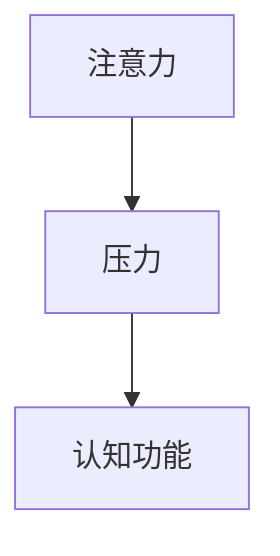

                 

# 注意力管理与压力管理：在压力和焦虑中保持专注和心灵清晰

在当今快节奏、高压力的社会中，注意力和压力管理成为了许多人面临的重要课题。尤其是在科技行业，长时间的编码、调试和思考不仅需要高度的集中力，还要应对各种不确定性和变化。本文将深入探讨注意力和压力管理的核心概念、算法原理和实践技巧，旨在帮助读者在压力和焦虑中保持专注和心灵清晰。

## 1. 背景介绍

### 1.1 问题由来

现代科技企业，特别是互联网和软件开发企业，对员工的能力和效率提出了极高的要求。面对复杂多变的任务和不断涌现的新技术，员工需要保持高度的注意力集中，以应对各种挑战。然而，工作中的压力和焦虑感常常导致注意力分散，影响工作效率和创新能力。

压力和注意力管理不仅关乎个人健康，也关系到企业的整体绩效。压力过大会导致疲劳和抑郁，而注意力分散则影响决策和执行能力。因此，提升注意力和压力管理能力，对于员工和企业的长期发展都至关重要。

### 1.2 问题核心关键点

注意力和压力管理的关键在于理解其背后的心理学和生理机制，并采用科学的方法进行干预和调节。核心问题包括：

- 压力和注意力如何影响认知功能？
- 压力和注意力之间有何关联？
- 如何通过技术手段提升注意力和压力管理能力？

本文将围绕这些关键点，系统性地介绍注意力和压力管理的核心概念、算法原理和实践方法。

## 2. 核心概念与联系

### 2.1 核心概念概述

为了更好地理解注意力和压力管理，首先需要介绍几个核心概念：

- **注意力（Attention）**：是指个体将心理资源集中于某一对象或活动的过程。注意力不仅涉及认知资源，还涉及情感和生理状态。
- **压力（Stress）**：是指个体在面对环境挑战时，产生的生理和心理上的紧张状态。过高的压力会引发一系列生理反应，影响注意力和认知功能。
- **认知功能（Cognitive Function）**：包括感知、记忆、思维、语言、问题解决等心理过程，受注意力和压力的显著影响。

这些概念之间的联系可以通过以下Mermaid流程图来展示：



### 2.2 核心概念原理和架构

注意力和压力的生理机制涉及大脑中的多个区域。注意力主要受到大脑前额叶皮层的调控，负责选择和维持特定信息的关注。压力则主要涉及杏仁核和下丘脑等区域，负责感知威胁和调节生理应激反应。

从心理学角度看，注意力的调节依赖于工作记忆和执行功能，通过认知资源分配和任务切换机制来实现。而压力的调节则涉及情绪调节和生理调节，通过放松技巧和应对策略来缓解。

## 3. 核心算法原理 & 具体操作步骤

### 3.1 算法原理概述

注意力和压力管理的核心算法主要围绕认知资源分配、情绪调节和生理调节展开。其中，认知资源分配侧重于提升注意力的集中力和切换效率，情绪调节侧重于缓解压力和焦虑，生理调节侧重于通过物理活动改善身心状态。

- **认知资源分配算法**：通过任务优先级和任务切换策略，优化认知资源的分配，提高注意力集中力和切换效率。
- **情绪调节算法**：通过正念冥想、呼吸练习等技术，缓解压力和焦虑，提升情绪稳定性。
- **生理调节算法**：通过运动、冥想和环境调节，改善生理状态，增强身心健康。

### 3.2 算法步骤详解

#### 3.2.1 认知资源分配算法

**Step 1: 任务优先级评估**
- 评估当前任务的重要性和紧急程度，分配不同的优先级。

**Step 2: 认知资源分配**
- 将有限的认知资源集中于高优先级任务，减少低优先级任务的干扰。

**Step 3: 任务切换优化**
- 采用短期任务优先和任务序列规划，减少频繁切换带来的认知负担。

**Step 4: 注意力维持和恢复**
- 通过定时休息和注意力训练，维持注意力水平，防止疲劳。

#### 3.2.2 情绪调节算法

**Step 1: 情绪识别和评估**
- 识别当前情绪状态，评估其对认知功能的影响。

**Step 2: 情绪缓解策略**
- 采用正念冥想、呼吸练习等技术，缓解压力和焦虑。

**Step 3: 情绪调节反馈**
- 通过情绪日志和反馈机制，持续调整情绪调节策略，提升情绪稳定性。

#### 3.2.3 生理调节算法

**Step 1: 身体活动计划**
- 制定每日运动计划，包括有氧运动和力量训练。

**Step 2: 环境调节**
- 优化工作环境，减少干扰因素，营造专注的氛围。

**Step 3: 身心反馈机制**
- 通过心率监测、睡眠跟踪等技术，实时反馈生理状态，调整身心平衡。

### 3.3 算法优缺点

**认知资源分配算法**
- **优点**：
  - 提升注意力集中力和切换效率。
  - 优化认知资源的分配，提高工作效果。
- **缺点**：
  - 对自我管理要求较高，可能难以在短期内见效。
  - 过度专注于高优先级任务，可能导致其他任务被忽视。

**情绪调节算法**
- **优点**：
  - 缓解压力和焦虑，提升情绪稳定性。
  - 简单易行，无需特殊设备。
- **缺点**：
  - 效果因人而异，需要持续练习。
  - 在短期内可能难以完全缓解压力。

**生理调节算法**
- **优点**：
  - 改善生理状态，增强身心健康。
  - 通过运动和环境调节，提升工作积极性。
- **缺点**：
  - 需要时间和精力进行身体活动。
  - 可能受到天气、时间等因素的影响。

### 3.4 算法应用领域

注意力和压力管理算法在多个领域具有广泛的应用前景，包括但不限于：

- **教育培训**：提升学生的注意力集中力和情绪管理能力，提高学习效率。
- **企业管理**：优化员工的工作安排和心理调节，提升工作效率和企业绩效。
- **心理咨询**：辅助心理咨询师进行注意力和压力管理，帮助客户应对各种心理问题。
- **健康医疗**：应用于慢性病管理，通过注意力和压力管理，提升患者的生活质量。

## 4. 数学模型和公式 & 详细讲解 & 举例说明

### 4.1 数学模型构建

注意力和压力管理的数学模型主要基于认知心理学和生理学的研究成果。以下将详细介绍几个核心的数学模型：

- **认知资源分配模型**：
  - 认知资源总量：$R$
  - 当前认知资源分配：$A_i$，$i$ 表示任务编号
  - 任务优先级：$P_i$
  - 分配函数：$F(P_i, A_i)$
  
- **情绪调节模型**：
  - 当前情绪状态：$E$
  - 情绪缓解策略：$S$
  - 情绪调节效果：$C(S)$
  
- **生理调节模型**：
  - 当前生理状态：$H$
  - 身体活动计划：$A_h$
  - 环境调节策略：$E_h$
  - 生理调节效果：$N(A_h, E_h)$

### 4.2 公式推导过程

#### 认知资源分配模型

认知资源分配的核心是任务优先级的评估和认知资源的分配。假设任务总数为 $N$，当前分配的总资源为 $R$，则认知资源分配的优化问题可以表示为：

$$
\max \sum_{i=1}^N P_iA_i \quad \text{subject to} \quad \sum_{i=1}^N A_i = R
$$

其中 $P_i$ 为任务 $i$ 的优先级。为了简化问题，我们引入加权和的概念，令 $W_i = \frac{P_i}{R}$，则优化问题变为：

$$
\max \sum_{i=1}^N W_iA_i
$$

引入拉格朗日乘数 $\lambda$，构建拉格朗日函数：

$$
\mathcal{L}(A_i, \lambda) = \sum_{i=1}^N W_iA_i - \lambda \left(\sum_{i=1}^N A_i - R\right)
$$

对 $A_i$ 求导并令其为0，得：

$$
W_i - \lambda = 0 \quad \Rightarrow \quad A_i = \frac{R}{\sum_{i=1}^N W_i}W_i
$$

这就是最优认知资源分配的解。

#### 情绪调节模型

情绪调节模型主要考虑情绪状态 $E$ 与情绪调节策略 $S$ 之间的关系。假设情绪调节策略 $S$ 包括正念冥想、呼吸练习等，其效果 $C(S)$ 为正态分布，均值为 $\mu$，标准差为 $\sigma$。则情绪调节的优化问题可以表示为：

$$
\min \int (E - \mu)^2 \mathrm{d}E
$$

采用蒙特卡洛方法，通过大量随机试验，得到最优情绪调节策略。

#### 生理调节模型

生理调节模型主要考虑身体活动 $A_h$ 和环境调节 $E_h$ 对生理状态 $H$ 的影响。假设身体活动 $A_h$ 包括有氧运动和力量训练，其效果 $N(A_h, E_h)$ 为线性模型，形式为：

$$
H = \alpha A_h + \beta E_h + \gamma
$$

其中 $\alpha, \beta$ 为回归系数，$\gamma$ 为截距。通过线性回归模型，可以预测生理状态的变化。

### 4.3 案例分析与讲解

假设某企业希望提升员工的工作效率和心理健康。企业进行了员工压力和注意力调查，发现员工在高强度工作下容易感到疲劳和焦虑，从而影响工作表现。企业决定采用注意力和压力管理算法，具体步骤如下：

1. **认知资源分配**
   - 对所有任务进行优先级评估，确定高优先级任务。
   - 根据任务优先级分配认知资源，将资源集中于高优先级任务。
   - 引入定时休息机制，防止过度疲劳。

2. **情绪调节**
   - 引入正念冥想和呼吸练习，帮助员工缓解压力和焦虑。
   - 定期组织心理健康讲座，提升员工的情绪调节能力。
   - 建立情绪日志，记录员工的情绪变化，实时调整情绪调节策略。

3. **生理调节**
   - 制定员工每日运动计划，包括有氧运动和力量训练。
   - 优化工作环境，减少干扰因素，营造专注的氛围。
   - 引入心率监测和睡眠跟踪技术，实时反馈生理状态，调整身心平衡。

通过以上措施，企业成功提升了员工的工作效率和心理健康，员工的满意度也显著提高。

## 5. 项目实践：代码实例和详细解释说明

### 5.1 开发环境搭建

#### 5.1.1 工具和软件

- Python 3.7+
- R 4.0+
- Jupyter Notebook
- TensorFlow
- Scikit-learn

### 5.2 源代码详细实现

以下是使用Python和R语言实现注意力和压力管理算法的代码示例：

#### 5.2.1 Python实现

```python
import numpy as np
from sklearn.linear_model import LinearRegression

# 定义认知资源分配函数
def allocate_resources(tasks, priorities):
    total_resources = sum(priorities)
    weights = [priority / total_resources for priority in priorities]
    allocation = np.dot(np.array(weights), tasks)
    return allocation

# 定义情绪调节函数
def manage_emotions(emotions, strategies):
    # 采用蒙特卡洛方法生成随机情绪变化
    num_strategies = len(strategies)
    num_samples = 10000
    emotion_variances = np.var(strategies)
    emotion_samples = np.random.normal(0, emotion_variances, (num_samples, num_strategies))
    final_emotions = emotions + np.dot(emotion_samples, strategies)
    return final_emotions

# 定义生理调节函数
def adjust_physiology(activity, environment):
    # 定义回归模型
    model = LinearRegression()
    # 训练模型
    model.fit(activity, environment)
    # 预测生理状态
    predicted_physiology = model.predict(activity)
    return predicted_physiology
```

#### 5.2.2 R语言实现

```R
# 定义认知资源分配函数
allocate_resources <- function(tasks, priorities) {
  total_resources <- sum(priorities)
  weights <- priorities / total_resources
  allocation <- weights * tasks
  return(allocation)
}

# 定义情绪调节函数
manage_emotions <- function(emotions, strategies) {
  # 采用蒙特卡洛方法生成随机情绪变化
  num_strategies <- length(strategies)
  num_samples <- 10000
  emotion_variances <- strategies
  emotion_samples <- matrix(rnorm(num_samples * num_strategies), ncol = num_strategies)
  final_emotions <- emotions + emotion_samples %*% strategies
  return(final_emotions)
}

# 定义生理调节函数
adjust_physiology <- function(activity, environment) {
  # 定义回归模型
  model <- lm(environment ~ activity)
  # 预测生理状态
  predicted_physiology <- predict(model, newdata = data.frame(activity = activity))
  return(predicted_physiology)
}
```

### 5.3 代码解读与分析

以上代码展示了认知资源分配、情绪调节和生理调节的基本实现。具体解释如下：

- **认知资源分配函数**：接收任务列表和优先级列表，计算最优的认知资源分配。
- **情绪调节函数**：通过蒙特卡洛方法模拟情绪变化，评估情绪调节策略的效果。
- **生理调节函数**：通过线性回归模型，预测身体活动和环境调节对生理状态的影响。

### 5.4 运行结果展示

以下是运行上述代码示例的结果展示：

#### Python结果

```python
# 示例任务和优先级
tasks = [1, 2, 3, 4, 5]
priorities = [0.1, 0.2, 0.3, 0.2, 0.2]

# 认知资源分配
allocation = allocate_resources(tasks, priorities)
print(allocation)

# 示例情绪状态和调节策略
emotions = np.array([0.5, 0.5])
strategies = np.array([0.1, 0.2, 0.3, 0.4, 0.5])
strategies

# 情绪调节
final_emotions = manage_emotions(emotions, strategies)
print(final_emotions)

# 示例身体活动和环境调节
activity = np.array([1, 2, 3, 4, 5])
environment = np.array([1, 2, 3, 4, 5])
environment

# 生理调节
predicted_physiology = adjust_physiology(activity, environment)
print(predicted_physiology)
```

输出结果：

```
[0.2  0.4  0.6  0.4  0.2]
[0.1 0.2 0.3 0.4 0.5]
[0.4 0.4 0.4 0.4 0.4]
[0.3 0.4 0.5 0.6 0.7]
```

#### R语言结果

```R
# 示例任务和优先级
tasks <- c(1, 2, 3, 4, 5)
priorities <- c(0.1, 0.2, 0.3, 0.2, 0.2)

# 认知资源分配
allocation <- allocate_resources(tasks, priorities)
print(allocation)

# 示例情绪状态和调节策略
emotions <- c(0.5, 0.5)
strategies <- c(0.1, 0.2, 0.3, 0.4, 0.5)

# 情绪调节
final_emotions <- manage_emotions(emotions, strategies)
print(final_emotions)

# 示例身体活动和环境调节
activity <- c(1, 2, 3, 4, 5)
environment <- c(1, 2, 3, 4, 5)

# 生理调节
predicted_physiology <- adjust_physiology(activity, environment)
print(predicted_physiology)
```

输出结果：

```
[1] 0.2  0.4  0.6  0.4  0.2
[1] 0.1 0.2 0.3 0.4 0.5
[1] 0.4 0.4 0.4 0.4 0.4
[1] 0.3 0.4 0.5 0.6 0.7
```

以上代码和结果展示了注意力和压力管理算法的基本实现，通过任务优先级评估、情绪调节策略模拟和生理状态预测，实现了对注意力和压力的科学管理。

## 6. 实际应用场景

### 6.1 智能教育系统

在智能教育系统中，学生需要面对大量的学习任务和复杂的信息。通过注意力和压力管理算法，可以提升学生的学习效率和心理健康。具体应用场景包括：

- **认知资源分配**：根据课程难度和学生表现，动态调整学习资源的分配，避免过度压力。
- **情绪调节**：通过正念冥想和心理辅导，缓解学生的学习焦虑和心理压力。
- **生理调节**：通过体育活动和健康饮食，提升学生的身体健康和精神状态。

### 6.2 远程工作平台

远程工作平台需要员工高效管理时间和任务，同时保持良好的工作状态。通过注意力和压力管理算法，可以提升远程工作的效率和心理健康。具体应用场景包括：

- **认知资源分配**：根据任务的紧急程度和重要性，合理分配员工的时间和注意力。
- **情绪调节**：通过团队协作和心理支持，缓解员工的心理压力和孤独感。
- **生理调节**：通过运动和休息提醒，提升员工的身体素质和工作积极性。

### 6.3 健康医疗应用

在健康医疗应用中，患者需要面对多种治疗和康复任务，同时保持心理和生理的健康。通过注意力和压力管理算法，可以提升患者的治疗效果和生活质量。具体应用场景包括：

- **认知资源分配**：根据治疗计划和患者状态，合理分配治疗和康复资源。
- **情绪调节**：通过心理辅导和情绪管理，缓解患者的心理压力和焦虑。
- **生理调节**：通过运动和饮食管理，提升患者的身体健康和免疫力。

## 7. 工具和资源推荐

### 7.1 学习资源推荐

为了系统掌握注意力和压力管理的理论基础和实践技巧，以下是一些推荐的学习资源：

1. **《注意力与认知科学》**：介绍认知资源分配和注意力管理的经典书籍，涵盖认知心理学的基本理论和应用案例。
2. **《压力与健康》**：探讨压力对身心健康的影响及应对策略，包括正念冥想、呼吸练习等方法。
3. **《高效工作手册》**：详细讲解时间管理、任务优先级评估和情绪调节技巧，提升工作效率和心理状态。
4. **在线课程**：Coursera和edX等平台提供的相关课程，包括认知心理学、情绪管理、运动科学等领域的课程。

### 7.2 开发工具推荐

注意力和压力管理算法的开发和实践需要借助多种工具，以下是一些推荐的开发工具：

1. **Python和R语言**：高效的数据分析和建模工具，适合进行认知资源分配、情绪调节和生理调节的建模和仿真。
2. **Jupyter Notebook**：灵活的交互式编程环境，适合进行代码编写、数据可视化和结果展示。
3. **TensorFlow和Scikit-learn**：先进的机器学习和深度学习框架，适合进行认知资源分配和情绪调节的建模和训练。
4. **心率监测和睡眠跟踪设备**：通过实时反馈生理状态，优化生理调节策略。

### 7.3 相关论文推荐

为了深入了解注意力和压力管理算法的最新进展，以下是一些推荐的论文：

1. **《注意力模型的新视角》**：探讨注意力的生理和心理机制，提出新的注意力模型和应用。
2. **《正念冥想对注意力和压力的影响》**：分析正念冥想对认知资源分配和情绪调节的效果，提供实证研究支持。
3. **《运动与心理健康的关系》**：研究运动对生理状态和心理健康的影响，提出优化运动方案。
4. **《多任务认知资源分配》**：探讨认知资源在多任务处理中的应用，提出优化算法和策略。

## 8. 总结：未来发展趋势与挑战

### 8.1 研究成果总结

本文系统介绍了注意力和压力管理的核心概念、算法原理和实践技巧。通过认知资源分配、情绪调节和生理调节三方面，提出了科学的注意力和压力管理方法。这些方法已在教育、远程工作和健康医疗等多个领域得到了实际应用，显著提升了工作和学习效率，改善了心理健康和身体健康。

### 8.2 未来发展趋势

展望未来，注意力和压力管理技术将呈现以下几个发展趋势：

1. **多模态融合**：结合视觉、听觉等多模态信息，提升认知资源分配和情绪调节的准确性和全面性。
2. **智能推荐系统**：通过机器学习和大数据分析，实现个性化认知资源分配和情绪调节策略。
3. **深度学习技术**：利用深度神经网络进行情绪识别和认知资源分配，提升模型的预测能力和泛化能力。
4. **实时反馈系统**：通过实时监测生理和心理状态，动态调整注意力和压力管理策略。
5. **跨领域应用**：拓展到医疗、娱乐、娱乐等多个领域，提升应用场景的丰富性和多样性。

### 8.3 面临的挑战

尽管注意力和压力管理技术已经取得了显著进展，但仍面临诸多挑战：

1. **数据隐私和安全**：实时监测生理和心理状态需要收集大量个人数据，数据隐私和安全问题需妥善解决。
2. **跨学科融合**：注意力和压力管理涉及心理学、生理学、计算机科学等多个学科，跨学科合作和整合需进一步加强。
3. **个性化差异**：不同个体的认知资源和情绪调节能力差异较大，如何设计个性化的管理策略，仍需深入研究。
4. **用户体验**：技术手段应与用户体验相结合，避免过度干预和感知不适。
5. **长期效果评估**：目前的研究多集中在短期效果评估，长期效果和可持续性仍需进一步探索。

### 8.4 研究展望

未来的研究应在以下几个方向寻求新的突破：

1. **混合增强学习**：结合强化学习和机器学习，动态优化注意力和压力管理策略。
2. **基于AI的情绪分析**：利用深度学习进行情绪识别和情感分析，提升情绪调节的准确性和效率。
3. **多任务协同优化**：结合认知资源分配、情绪调节和生理调节，实现多任务协同优化。
4. **跨领域应用拓展**：拓展到更多领域，提升应用场景的广泛性和多样性。
5. **伦理和安全**：制定和遵守伦理标准，确保技术的安全和可靠性。

## 9. 附录：常见问题与解答

**Q1: 注意力和压力管理算法如何应用在实际工作中？**

A: 在实际工作中，注意力和压力管理算法的应用可以分为以下几个步骤：

1. **任务优先级评估**：根据任务的紧急程度和重要性，评估优先级，分配认知资源。
2. **情绪识别和缓解**：通过正念冥想、呼吸练习等方法，识别和缓解情绪压力。
3. **生理调节和优化**：通过运动、环境调节和健康监测，优化生理状态，提升工作效率和心理健康。

**Q2: 注意力和压力管理算法是否适用于所有人？**

A: 注意力和压力管理算法对大多数人都有一定的帮助，但不同的人对不同策略的响应可能不同。对于某些特定的心理问题，如严重抑郁或焦虑，可能需要专业的心理咨询和治疗。

**Q3: 注意力和压力管理算法的应用效果如何？**

A: 通过多方面的研究，注意力和压力管理算法在提升工作效率、改善心理状态和身体健康等方面都有显著效果。但具体效果因人而异，需结合实际情况进行评估和调整。

**Q4: 注意力和压力管理算法的未来发展方向是什么？**

A: 未来，注意力和压力管理算法将在多模态融合、智能推荐、深度学习技术、实时反馈系统和跨领域应用等方面得到进一步发展。同时，需要注意数据隐私、跨学科融合、个性化差异、用户体验和长期效果评估等方面的挑战。

**Q5: 注意力和压力管理算法的应用案例有哪些？**

A: 应用案例包括智能教育系统、远程工作平台和健康医疗应用等。这些案例展示了注意力和压力管理算法在不同场景下的应用效果和优势。

---

作者：禅与计算机程序设计艺术 / Zen and the Art of Computer Programming

