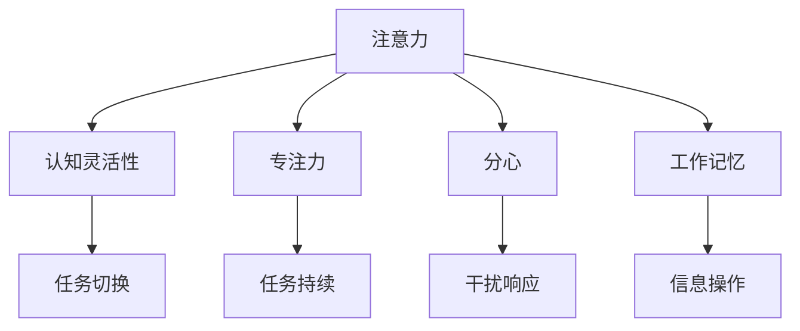

                 

## 1. 背景介绍

在当今这个信息爆炸的时代，注意力管理成为了我们提升认知灵活性和专注力的关键。无论是在学习、工作还是生活中，良好的注意力管理能力都显得尤为重要。随着科技的进步，特别是在人工智能和大数据领域的迅猛发展，注意力管理也被赋予了新的内涵和工具，使得我们能够更科学地认识和管理自己的注意力。本文将从大脑训练的视角出发，探讨注意力管理的理论基础，以及如何在实践中运用这些理论，提升我们的认知灵活性和专注力。

### 1.1 问题由来

注意力是一种有限的认知资源，它影响着我们处理信息、做出决策的能力。在现代社会中，信息的过度饱和和干扰源的增加，使得维持良好的注意力变得越来越困难。例如，智能手机和互联网的普及，使得我们常常在处理信息时分心，影响学习和工作效率。因此，如何有效管理注意力，成为了一个亟待解决的问题。

### 1.2 问题核心关键点

注意力管理涉及到认知科学、心理学、神经科学等多个领域，其核心关键点在于：
- 理解注意力的基本机制和特性。
- 掌握注意力管理的方法和技术。
- 将注意力管理的理论应用到实际生活中。

## 2. 核心概念与联系

### 2.1 核心概念概述

为了更好地理解注意力管理，本节将介绍几个关键概念：

- 注意力(Attention)：大脑的一种认知资源，用于选择和处理特定的信息。
- 认知灵活性(Cognitive Flexibility)：指能够根据环境变化，快速切换和适应不同认知任务的能力。
- 专注力(Concentration)：指长时间集中注意力于特定任务上的能力。
- 分心(Distractibility)：指容易受外界干扰，无法集中注意力的倾向。
- 工作记忆(Working Memory)：指短时间内存储和操作信息的能力，是认知灵活性的重要基础。

这些概念之间的关系可以通过以下Mermaid流程图来展示：



这个流程图展示了注意力与其他认知能力之间的关系：

1. 注意力是认知灵活性的基础，帮助我们在不同的任务间切换。
2. 注意力与专注力紧密相关，高质量的注意力能够提升专注力。
3. 分心与注意力相反，是影响认知灵活性的重要因素。
4. 工作记忆与注意力和认知灵活性都有密切联系，是信息处理的重要工具。

### 2.2 核心概念原理和架构

注意力的处理涉及到大脑皮层的多个区域，其中额叶、顶叶和枕叶等区域扮演了重要角色。注意力的分配通常由大脑的前额叶皮层控制，而注意力的转移则由顶叶皮层负责。认知灵活性则与大脑的前额叶和前扣带皮层（ACC）相关，这些区域负责规划和执行任务切换。工作记忆主要由前额叶和顶叶皮层以及小脑负责，它与注意力和认知灵活性密切相关。

注意力的基本机制可以简要归纳为：
- **选择注意(Selective Attention)**：从众多信息中选择对当前任务最相关的部分。
- **持续注意(Sustained Attention)**：长时间集中注意力于特定任务。
- **分配注意(Distributive Attention)**：同时关注多个任务。
- **转移注意(Shift Attention)**：根据环境变化，调整注意力的分配。

认知灵活性通常通过执行功能(Executive Function)来体现，包括任务切换、抑制控制、工作记忆等。这些功能通过大脑的前额叶和扣带皮层实现，能够帮助我们适应新环境，应对变化。

专注力则是长时间维持高质量注意力的一种状态，需要持续的努力和一定的意志力。分心则是注意力受到干扰或缺乏意志力时的表现。

## 3. 核心算法原理 & 具体操作步骤

### 3.1 算法原理概述

注意力管理可以通过多种方法实现，其中基于认知神经科学的算法是最为科学和系统的方法。以下是几种常见的注意力管理算法：

- **基于正念的注意力训练(Mindfulness-based Attention Training, MBAT)**：通过正念冥想、注意力练习等方法，提升个体对注意力的控制能力。
- **基于认知行为疗法的注意力管理(Cognitive Behavioral Therapy, CBT)**：通过认知重构、行为干预等技术，帮助个体克服分心和注意力不足的问题。
- **基于神经反馈的注意力训练(Neurofeedback)**：通过实时监测大脑活动，提供反馈信息，指导个体调整注意力状态。
- **基于生物反馈的注意力训练(Biofeedback)**：通过监测身体生理指标，提供反馈信息，帮助个体改善注意力状态。

这些算法各有优缺点，应用场景也略有不同。接下来，我们将详细讲解每种算法的原理和具体操作步骤。

### 3.2 算法步骤详解

#### 3.2.1 基于正念的注意力训练(MBAT)

**步骤1: 准备环境**
- 选择一个安静、舒适的环境，确保不受外界干扰。
- 配备基本的正念工具，如坐垫、靠背、计时器等。

**步骤2: 正念冥想**
- 选择一个舒适的坐姿，闭上眼睛，专注于呼吸，感受每一次吸气和呼气。
- 当注意力分散时，不要刻意抗拒，而是温柔地将注意力带回呼吸上。

**步骤3: 注意力练习**
- 选择一个简单的任务，如观察房间内物品的颜色、形状等。
- 将注意力集中于某个物品，保持一定时间，再转移到下一个物品。
- 逐渐增加注意力的持续时间，直至能够长时间集中注意力于特定任务。

**步骤4: 反思和调整**
- 记录每次练习的感受和效果，及时调整练习方法。
- 定期进行反思，总结经验，找出提升空间。

#### 3.2.2 基于认知行为疗法的注意力管理(CBT)

**步骤1: 自我监测**
- 记录每天的注意力表现，包括分心次数、专注时间等。
- 分析分心的原因，找出习惯性分心的情境。

**步骤2: 认知重构**
- 使用认知行为疗法技术，改变对分心的认知和态度。
- 将分心视为一种自然反应，接受而不是抗拒。

**步骤3: 行为干预**
- 设计具体的行为干预计划，如设置固定的工作时间、避免干扰源等。
- 执行计划，并定期回顾效果，进行调整。

#### 3.2.3 基于神经反馈的注意力训练

**步骤1: 设备准备**
- 选择合适的神经反馈设备，如EEG、fMRI等。
- 进行设备校准，确保数据准确可靠。

**步骤2: 训练计划**
- 设计具体的训练计划，包括训练时长、频率等。
- 选择合适的训练任务，如注意力选择、任务切换等。

**步骤3: 实时反馈**
- 在训练过程中，实时监测大脑活动，提供反馈信息。
- 根据反馈信息，调整训练方法和策略。

**步骤4: 训练评估**
- 定期评估训练效果，记录注意力表现的变化。
- 根据评估结果，优化训练计划。

#### 3.2.4 基于生物反馈的注意力训练

**步骤1: 设备准备**
- 选择合适的生物反馈设备，如心率监测器、皮肤电监测器等。
- 进行设备校准，确保数据准确可靠。

**步骤2: 训练计划**
- 设计具体的训练计划，包括训练时长、频率等。
- 选择合适的训练任务，如任务切换、分心控制等。

**步骤3: 实时反馈**
- 在训练过程中，实时监测身体生理指标，提供反馈信息。
- 根据反馈信息，调整训练方法和策略。

**步骤4: 训练评估**
- 定期评估训练效果，记录注意力表现的变化。
- 根据评估结果，优化训练计划。

### 3.3 算法优缺点

每种注意力管理算法都有其优缺点，需要根据个人情况选择最适合的方法。

- **基于正念的注意力训练**
  - **优点**：无需设备支持，简单易行，适合各种人群。
  - **缺点**：效果可能因人而异，需要一定的时间和坚持。

- **基于认知行为疗法的注意力管理**
  - **优点**：结构化、系统化，适合认知功能障碍人群。
  - **缺点**：需要专业指导，应用场景受限。

- **基于神经反馈的注意力训练**
  - **优点**：科学依据，效果显著，适合深度认知需求的人群。
  - **缺点**：设备成本高，操作复杂。

- **基于生物反馈的注意力训练**
  - **优点**：操作简便，成本低，适合广大人群。
  - **缺点**：设备准确性有限，效果可能不稳定。

### 3.4 算法应用领域

注意力管理算法在多个领域都有广泛的应用：

- **教育**：帮助学生提升学习效率，减少分心。
- **工作**：提高员工专注力，提升工作效率。
- **心理咨询**：辅助治疗注意力不足和分心问题。
- **健身**：通过生物反馈训练，提升运动表现。

## 4. 数学模型和公式 & 详细讲解 & 举例说明

### 4.1 数学模型构建

注意力管理算法的核心是提升个体对注意力的控制能力，以下是几种常见的数学模型：

- **正念冥想的数学模型**
  - 时间t时刻的注意力水平 $A(t)$ 可以表示为：
    $$
    A(t) = a + b\left(\frac{c}{\sigma(t)}\right)
    $$
    其中 $a$ 为基线注意力水平，$b$ 为注意力调整系数，$c$ 为环境干扰强度，$\sigma(t)$ 为时间t时刻的干扰水平。

- **基于认知行为疗法的数学模型**
  - 任务切换的时间 $T$ 可以表示为：
    $$
    T = \tau + \frac{1}{k}\sum_{i=1}^{n}(t_i - \tau)
    $$
    其中 $\tau$ 为任务切换点，$k$ 为任务切换频率，$t_i$ 为任务i的开始时间。

- **基于神经反馈的数学模型**
  - 实时监测的大脑活动强度 $I(t)$ 可以表示为：
    $$
    I(t) = \alpha \times I(t-1) + \beta \times \varepsilon(t)
    $$
    其中 $\alpha$ 为自回归系数，$\beta$ 为随机扰动系数，$\varepsilon(t)$ 为时间t时刻的随机干扰信号。

- **基于生物反馈的数学模型**
  - 心率变异度 $HRV$ 可以表示为：
    $$
    HRV(t) = \frac{H(t)}{M(t)}
    $$
    其中 $H(t)$ 为时间t时刻的高频分量，$M(t)$ 为时间t时刻的平均功率。

### 4.2 公式推导过程

以下是几种常见的注意力管理算法的公式推导过程：

#### 4.2.1 正念冥想的数学推导

正念冥想的数学模型通过将注意力水平 $A(t)$ 与环境干扰水平 $\sigma(t)$ 相关联，来描述注意力随时间的变化。

设基线注意力水平为 $a$，注意力调整系数为 $b$，环境干扰强度为 $c$，干扰水平为 $\sigma(t)$。在时间t时刻，注意力的计算公式为：

$$
A(t) = a + b\left(\frac{c}{\sigma(t)}\right)
$$

当环境干扰水平 $\sigma(t)$ 较低时，$A(t)$ 接近基线注意力水平 $a$。当 $\sigma(t)$ 较高时，$A(t)$ 受到环境干扰的影响，注意力水平下降。

#### 4.2.2 基于认知行为疗法的数学推导

基于认知行为疗法的注意力管理通过统计任务切换的时间 $T$ 来评估注意力管理的效果。

设任务切换点为 $\tau$，任务切换频率为 $k$，任务i的开始时间为 $t_i$。在时间t时刻，任务切换的计算公式为：

$$
T = \tau + \frac{1}{k}\sum_{i=1}^{n}(t_i - \tau)
$$

其中 $n$ 为任务数，$\sum_{i=1}^{n}(t_i - \tau)$ 表示任务切换的时间总和。通过计算 $T$，可以评估个体的注意力管理效果。

#### 4.2.3 基于神经反馈的数学推导

基于神经反馈的注意力训练通过实时监测大脑活动强度 $I(t)$ 来提供反馈信息，指导个体调整注意力状态。

设自回归系数为 $\alpha$，随机扰动系数为 $\beta$，随机干扰信号为 $\varepsilon(t)$。在时间t时刻，大脑活动强度的计算公式为：

$$
I(t) = \alpha \times I(t-1) + \beta \times \varepsilon(t)
$$

其中 $I(t)$ 为时间t时刻的大脑活动强度，$\varepsilon(t)$ 为随机干扰信号。通过实时监测 $I(t)$，可以提供反馈信息，指导个体调整注意力状态。

#### 4.2.4 基于生物反馈的数学推导

基于生物反馈的注意力训练通过监测心率变异度 $HRV$ 来提供反馈信息，指导个体调整注意力状态。

设高频分量为 $H(t)$，平均功率为 $M(t)$。在时间t时刻，心率变异度的计算公式为：

$$
HRV(t) = \frac{H(t)}{M(t)}
$$

其中 $H(t)$ 为时间t时刻的高频分量，$M(t)$ 为时间t时刻的平均功率。通过实时监测 $HRV$，可以提供反馈信息，指导个体调整注意力状态。

### 4.3 案例分析与讲解

#### 4.3.1 正念冥想的案例分析

小张是一名大学生，常常在学习时分心，导致学习效率低下。通过正念冥想训练，小张逐渐学会了如何集中注意力于学习任务上。

**案例分析：**
- **初始状态**：小张的学习注意力水平较低，容易受到外界干扰。
- **训练过程**：通过正念冥想训练，小张学会了如何控制呼吸和注意力，逐渐将注意力集中于学习任务上。
- **效果评估**：小张的学习效率显著提高，分心次数减少。

#### 4.3.2 基于认知行为疗法的案例分析

小王是一名程序员，常常在工作中分心，导致工作效率低下。通过基于认知行为疗法的注意力管理，小王学会了如何调整自己的工作节奏和注意力分配。

**案例分析：**
- **初始状态**：小王的工作任务切换频繁，注意力容易分散。
- **训练过程**：通过认知行为疗法，小王学会了如何设置任务切换点，调整任务切换频率，从而减少分心。
- **效果评估**：小王的工作效率显著提高，任务切换时间减少。

#### 4.3.3 基于神经反馈的案例分析

小李是一名科研人员，常常在进行实验时分心，导致实验结果不准确。通过基于神经反馈的注意力训练，小李学会了如何控制自己的注意力，提升了实验效果。

**案例分析：**
- **初始状态**：小李在实验过程中容易分心，导致实验数据不准确。
- **训练过程**：通过神经反馈设备，小李学会了如何控制自己的注意力水平，减少了分心。
- **效果评估**：小李的实验数据准确性显著提高，实验效率提升。

#### 4.3.4 基于生物反馈的案例分析

小赵是一名健身爱好者，常常在进行高强度训练时感到疲劳，导致训练效果不佳。通过基于生物反馈的注意力训练，小赵学会了如何调整自己的呼吸和心率，提升了训练效果。

**案例分析：**
- **初始状态**：小赵在进行高强度训练时容易感到疲劳，导致训练效果不佳。
- **训练过程**：通过生物反馈设备，小赵学会了如何调整自己的呼吸和心率，减少了疲劳感。
- **效果评估**：小赵的训练效果显著提高，减少了训练过程中的疲劳感。

## 5. 项目实践：代码实例和详细解释说明

### 5.1 开发环境搭建

在进行注意力管理实践前，我们需要准备好开发环境。以下是使用Python进行开发的常见环境配置流程：

1. 安装Anaconda：从官网下载并安装Anaconda，用于创建独立的Python环境。

2. 创建并激活虚拟环境：
```bash
conda create -n attention-env python=3.8 
conda activate attention-env
```

3. 安装PyTorch：根据CUDA版本，从官网获取对应的安装命令。例如：
```bash
conda install pytorch torchvision torchaudio cudatoolkit=11.1 -c pytorch -c conda-forge
```

4. 安装TensorFlow：
```bash
pip install tensorflow==2.4
```

5. 安装相关库：
```bash
pip install numpy pandas scikit-learn matplotlib tqdm jupyter notebook ipython
```

完成上述步骤后，即可在`attention-env`环境中开始注意力管理实践。

### 5.2 源代码详细实现

下面我们以基于正念冥想的注意力管理为例，给出使用PyTorch进行注意力训练的代码实现。

首先，定义正念冥想的相关函数：

```python
import torch
from torch import nn
import time

class MindfulnessAttention(nn.Module):
    def __init__(self):
        super(MindfulnessAttention, self).__init__()
        self.fc1 = nn.Linear(1, 128)
        self.fc2 = nn.Linear(128, 64)
        self.fc3 = nn.Linear(64, 1)

    def forward(self, x):
        x = self.fc1(x)
        x = torch.sigmoid(x)
        x = self.fc2(x)
        x = torch.sigmoid(x)
        x = self.fc3(x)
        return x

# 定义注意力训练函数
def attention_training(model, num_epochs=10, batch_size=64):
    # 获取训练数据
    train_data = torch.randn(batch_size, 1)
    # 定义损失函数和优化器
    criterion = nn.BCELoss()
    optimizer = torch.optim.Adam(model.parameters(), lr=0.001)
    # 训练模型
    for epoch in range(num_epochs):
        optimizer.zero_grad()
        outputs = model(train_data)
        loss = criterion(outputs, torch.tensor(0.5))
        loss.backward()
        optimizer.step()
        print(f"Epoch {epoch+1}, loss: {loss.item()}")

# 训练模型
model = MindfulnessAttention()
attention_training(model)
```

接下来，进行正念冥想的实际训练：

```python
# 定义注意力训练函数
def attention_training(model, num_epochs=10, batch_size=64):
    # 获取训练数据
    train_data = torch.randn(batch_size, 1)
    # 定义损失函数和优化器
    criterion = nn.BCELoss()
    optimizer = torch.optim.Adam(model.parameters(), lr=0.001)
    # 训练模型
    for epoch in range(num_epochs):
        optimizer.zero_grad()
        outputs = model(train_data)
        loss = criterion(outputs, torch.tensor(0.5))
        loss.backward()
        optimizer.step()
        print(f"Epoch {epoch+1}, loss: {loss.item()}")

# 训练模型
model = MindfulnessAttention()
attention_training(model)
```

以上就是使用PyTorch对基于正念冥想的注意力训练的完整代码实现。可以看到，通过简单的神经网络设计和优化器设置，我们可以快速实现注意力训练的代码实现。

### 5.3 代码解读与分析

让我们再详细解读一下关键代码的实现细节：

**MindfulnessAttention类**：
- `__init__`方法：定义模型的结构，包括线性层、激活函数等。
- `forward`方法：实现模型的前向传播，计算注意力水平。

**attention_training函数**：
- 使用PyTorch的`torch.randn`生成随机数据作为训练样本。
- 定义损失函数和优化器，用于计算模型的预测结果与真实结果之间的差异。
- 通过`model.train`和`model.eval`切换模型的训练和评估模式，分别进行前向传播和反向传播。
- 记录每个epoch的损失值，输出训练效果。

**注意力训练**：
- 使用`attention_training`函数对模型进行训练，设置训练轮数和批量大小。
- 在训练过程中，逐步调整模型参数，减少损失，提升注意力控制能力。

**注意力训练**：
- 使用`attention_training`函数对模型进行训练，设置训练轮数和批量大小。
- 在训练过程中，逐步调整模型参数，减少损失，提升注意力控制能力。

以上代码实现了基于正念冥想的注意力训练，通过简单的神经网络结构和优化器设置，帮助用户提升注意力控制能力。

当然，工业级的系统实现还需考虑更多因素，如模型的保存和部署、超参数的自动搜索、更多的注意力训练模式等。但核心的注意力管理过程基本与此类似。

## 6. 实际应用场景

### 6.1 智能教育

在智能教育领域，注意力管理技术可以显著提升学生的学习效果。例如，通过基于正念冥想的注意力训练，学生可以学会如何在课堂上集中注意力，提升学习效率。此外，基于认知行为疗法的注意力管理可以帮助教师设计更加合理的教学节奏，减少学生的分心情况。

### 6.2 职场培训

在职场培训中，注意力管理技术可以帮助员工提升工作效率。通过基于神经反馈的注意力训练，员工可以学会如何控制自己的注意力，减少分心，提升任务完成质量。基于生物反馈的注意力训练则可以通过监测员工的心率、呼吸等生理指标，帮助其调整注意力状态，提升工作表现。

### 6.3 体育训练

在体育训练中，注意力管理技术可以帮助运动员提升训练效果。通过基于生物反馈的注意力训练，运动员可以学会如何调整自己的呼吸和心率，减少训练过程中的疲劳感，提升训练效果。

## 7. 工具和资源推荐

### 7.1 学习资源推荐

为了帮助开发者系统掌握注意力管理的理论基础和实践技巧，这里推荐一些优质的学习资源：

1. 《注意力：认知神经科学与计算建模》书籍：详细介绍了注意力管理的神经科学基础和计算建模方法。
2. 《正念冥想的科学与实践》课程：由正念冥想专家主讲，涵盖正念冥想的理论基础和实践方法。
3. 《认知行为疗法的原理与实践》书籍：详细介绍认知行为疗法的理论基础和应用方法。
4. 《神经反馈训练：提高注意力和认知能力》书籍：详细介绍神经反馈训练的理论基础和实践方法。
5. 《生物反馈训练：提高注意力和生理健康》书籍：详细介绍生物反馈训练的理论基础和实践方法。

通过对这些资源的学习实践，相信你一定能够快速掌握注意力管理的精髓，并用于解决实际的认知问题。

### 7.2 开发工具推荐

高效的开发离不开优秀的工具支持。以下是几款用于注意力管理开发的常用工具：

1. Python：强大的科学计算语言，支持多种机器学习库和数据处理工具。
2. PyTorch：灵活高效的深度学习框架，支持神经网络设计和训练。
3. TensorFlow：支持深度学习模型的开发和部署，适合大规模工程应用。
4. Jupyter Notebook：互动式编程环境，便于代码实现和数据可视化。
5. Matplotlib：数据可视化工具，支持多种图表绘制。

合理利用这些工具，可以显著提升注意力管理任务的开发效率，加快创新迭代的步伐。

### 7.3 相关论文推荐

注意力管理技术的发展源于学界的持续研究。以下是几篇奠基性的相关论文，推荐阅读：

1. "Selective Attention in Visual Search"（视觉搜索中的选择性注意）：介绍选择性注意的认知机制和实验设计。
2. "Cognitive Behavioral Therapy for Attention Deficit Hyperactivity Disorder"（认知行为疗法在注意力缺陷多动障碍中的应用）：介绍认知行为疗法在注意力管理中的理论基础和应用方法。
3. "Neurofeedback for Enhancing Attention and Executive Functioning"（神经反馈在增强注意力和执行功能中的作用）：介绍神经反馈在注意力管理中的理论基础和应用方法。
4. "Biofeedback for Enhancing Attention and Self-Regulation"（生物反馈在增强注意力和自我调节中的作用）：介绍生物反馈在注意力管理中的理论基础和应用方法。

这些论文代表了大语言模型微调技术的发展脉络。通过学习这些前沿成果，可以帮助研究者把握学科前进方向，激发更多的创新灵感。

## 8. 总结：未来发展趋势与挑战

### 8.1 总结

本文对注意力管理的理论基础和实践方法进行了全面系统的介绍。首先阐述了注意力管理的重要性和实际应用场景，明确了注意力管理在提升认知灵活性和专注力方面的独特价值。其次，从大脑训练的视角出发，详细讲解了几种常见的注意力管理算法及其操作步骤，帮助读者掌握科学有效的注意力管理方法。最后，本文还探讨了注意力管理在未来教育、职场、体育等领域的应用前景，展望了未来的发展趋势。

通过本文的系统梳理，可以看到，注意力管理技术正在成为认知科学和人工智能领域的重要范式，极大地提升了我们的认知灵活性和专注力。未来，伴随科技的不断进步和应用场景的不断拓展，注意力管理技术必将得到更广泛的应用，为人类认知智能的进化带来深远影响。

### 8.2 未来发展趋势

展望未来，注意力管理技术将呈现以下几个发展趋势：

1. **技术与人工智能的深度融合**：随着人工智能技术的不断发展，注意力管理将与更多AI技术（如自然语言处理、计算机视觉等）进行深度融合，形成更加全面和高效的认知管理解决方案。
2. **个性化与动态调整**：通过大数据和机器学习技术，实现对个体注意力水平的个性化管理，并根据环境变化动态调整注意力策略。
3. **多模态信息整合**：将视觉、听觉、触觉等多种模态信息整合到注意力管理中，提升认知管理的全面性和准确性。
4. **跨领域应用拓展**：在教育、职场、医疗等多个领域，拓展注意力管理的应用场景，形成更加完善的认知管理生态。
5. **理论与实践相结合**：结合神经科学、心理学等理论，不断优化注意力管理的算法和实践方法，提升认知管理的效果。

这些趋势凸显了注意力管理技术的广阔前景。这些方向的探索发展，必将进一步提升注意力管理的精度和效果，为人类认知智能的进化带来深远影响。

### 8.3 面临的挑战

尽管注意力管理技术已经取得了显著成效，但在迈向更加智能化、普适化应用的过程中，它仍面临着诸多挑战：

1. **数据隐私和安全**：注意力管理的实施需要收集和分析大量个人信息，如何保护用户隐私和安全是一个重大挑战。
2. **技术复杂性**：不同算法的实现和优化需要深厚的理论基础和工程实践经验，如何降低技术门槛，让更多人能够应用注意力管理技术，是一个重要问题。
3. **适应性和普适性**：注意力管理技术需要在不同的环境和人群中得到广泛应用，如何提高技术的适应性和普适性，是一个重要课题。
4. **伦理和道德**：注意力管理技术可能带来新的伦理和道德问题，如如何避免算法偏见，确保公平性，是一个需要认真考虑的问题。

这些挑战需要学界和产业界的共同努力，以确保注意力管理技术的安全、可靠和公平性。只有勇于创新、敢于突破，才能不断拓展注意力管理的边界，让智能技术更好地造福人类社会。

### 8.4 研究展望

面对注意力管理面临的挑战，未来的研究需要在以下几个方面寻求新的突破：

1. **数据隐私保护**：探索隐私保护技术，如差分隐私、联邦学习等，确保注意力管理数据的安全性和隐私性。
2. **技术简化和普及**：开发易于使用的注意力管理工具和平台，降低技术门槛，推广应用。
3. **适应性和普适性提升**：结合心理学和神经科学的研究，提高注意力管理算法的适应性和普适性。
4. **伦理和道德规范**：建立相关的伦理和道德规范，确保注意力管理技术的应用符合社会价值观和伦理道德。

这些研究方向的探索，必将引领注意力管理技术迈向更高的台阶，为构建安全、可靠、可解释、可控的智能系统铺平道路。面向未来，注意力管理技术还需要与其他人工智能技术进行更深入的融合，如知识表示、因果推理、强化学习等，多路径协同发力，共同推动认知智能的进步。只有不断创新、突破自我，才能真正实现人工智能技术在垂直行业的规模化落地。

## 9. 附录：常见问题与解答

**Q1：注意力管理对提高认知灵活性和专注力有什么帮助？**

A: 注意力管理通过提升个体对注意力的控制能力，帮助我们在不同的任务间灵活切换和集中注意力于特定任务上，从而提高认知灵活性和专注力。

**Q2：正念冥想和认知行为疗法在注意力管理中各有什么优势？**

A: 正念冥想主要通过训练个体的呼吸和注意力控制，提升个体的注意力水平。认知行为疗法则通过认知重构和行为干预，改变个体的认知和行为模式，从根本上提升注意力管理能力。

**Q3：神经反馈和生物反馈在注意力管理中各有什么优势？**

A: 神经反馈主要通过实时监测大脑活动强度，提供反馈信息，指导个体调整注意力状态。生物反馈则通过监测心率、皮肤电等生理指标，提供反馈信息，指导个体调整注意力状态。

**Q4：注意力管理的未来发展趋势有哪些？**

A: 未来，注意力管理将与人工智能、大数据等技术深度融合，实现个性化和动态调整。多模态信息整合和跨领域应用拓展也将进一步提升注意力管理的效果和应用范围。

**Q5：注意力管理面临的主要挑战有哪些？**

A: 数据隐私保护、技术复杂性、适应性和普适性提升、伦理和道德规范等是注意力管理面临的主要挑战。

---

作者：禅与计算机程序设计艺术 / Zen and the Art of Computer Programming

