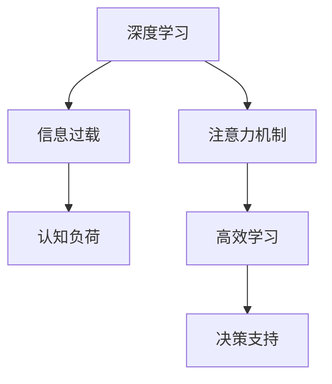

                 

# 注意力管理与学习：如何在信息过载时代提高学习效率

> 关键词：注意力管理,信息过载,高效学习,认知负荷,深度学习

## 1. 背景介绍

### 1.1 问题由来
随着互联网技术的飞速发展，全球信息总量呈指数级增长，我们每天面临的信息过载问题日益严峻。从新闻、社交媒体、电子邮件，到学术论文、行业报告、在线课程，各类信息的泛滥给人们的学习和决策带来了巨大挑战。如何在信息海洋中找到关键有用的信息，并在海量数据中快速学习、高效处理，成为了现代工作和生活的重要课题。

### 1.2 问题核心关键点
信息过载问题涉及的领域非常广泛，包括数据挖掘、信息检索、推荐系统、自然语言处理、人机交互等多个方面。本文聚焦于深度学习中的注意力机制在信息处理中的应用，讨论如何通过注意力管理机制来提高学习效率。

### 1.3 问题研究意义
研究注意力管理机制对于提升学习效率具有重要意义：

1. **减少认知负荷**：通过注意力管理，可以有效降低信息处理中的认知负荷，帮助人们更加专注于关键信息，提高学习效率。
2. **提升信息检索和处理质量**：深度学习中的注意力机制能够自动识别信息中的关键部分，自动过滤无关信息，提升信息检索和处理质量。
3. **增强决策支持**：注意力机制可以帮助人们从大量信息中快速提取关键特征，为决策提供有力支持。
4. **优化资源分配**：在多任务处理和分布式系统中，注意力机制能够优化资源分配，提高系统的整体效率。

## 2. 核心概念与联系

### 2.1 核心概念概述

为更好地理解深度学习中的注意力机制，本节将介绍几个密切相关的核心概念：

- **注意力机制(Attention Mechanism)**：一种模拟人类注意力的机制，通过学习样本不同部分的权重，自动识别和聚焦关键信息。
- **信息过载(Information Overload)**：在信息获取和处理过程中，信息量超出了人的认知能力和处理能力，导致决策困难和学习效率下降。
- **认知负荷(Cognitive Load)**：指在进行信息处理、学习、决策时，心理过程所需的心理资源总量，包括注意力、记忆、推理等。
- **深度学习(Deep Learning)**：一种基于多层神经网络的学习方法，通过多层次的特征提取和信息融合，提升模型的性能。

这些概念之间的逻辑关系可以通过以下Mermaid流程图来展示：



这个流程图展示了大语言模型的核心概念及其之间的关系：

1. 深度学习提供了强大的特征提取和信息融合能力。
2. 注意力机制在此基础上进一步优化信息选择和融合，提升了学习效率和决策支持能力。
3. 信息过载和认知负荷是学习效率的瓶颈。
4. 注意力机制通过聚焦关键信息，有效缓解了信息过载和认知负荷问题。

## 3. 核心算法原理 & 具体操作步骤
### 3.1 算法原理概述

深度学习中的注意力机制是一种通过权重分配来选择和聚焦关键信息的机制。其核心思想是：通过学习样本不同部分的权重，自动识别和聚焦关键信息。

形式化地，设输入样本 $x$ 包含 $T$ 个部分，注意力机制的输出表示为：

$$
\text{Attention}(x) = \sum_{t=1}^T w_t \cdot x_t
$$

其中 $w_t$ 是第 $t$ 个部分的权重，$\sum_{t=1}^T w_t = 1$。这些权重由模型学习得到，能够自动聚焦关键信息。

### 3.2 算法步骤详解

深度学习中的注意力机制一般包括以下几个关键步骤：

**Step 1: 准备输入数据**
- 对输入数据进行预处理，如分词、向量化等，以便输入到神经网络中。
- 假设输入数据的维度为 $d$，将数据分成若干个部分，如 $x_1, x_2, ..., x_T$。

**Step 2: 计算注意力权重**
- 设计注意力模型，学习样本不同部分的权重 $w_t$。
- 假设注意力模型由神经网络组成，包括多个线性变换和激活函数。
- 权重 $w_t$ 的计算过程如下：
  1. 对每个部分 $x_t$ 进行线性变换，得到 $Q_t = W^Q x_t$。
  2. 对所有部分 $Q_t$ 进行线性变换，得到 $K_t = W^K Q_t$。
  3. 对所有部分 $K_t$ 进行线性变换，得到 $V_t = W^V K_t$。
  4. 计算注意力权重 $w_t$，表示第 $t$ 个部分对模型输出的贡献：
     - 计算注意力得分 $s_t = \frac{\exp(Q_t^\top K_t)}{\sum_{t'=1}^T \exp(Q_{t'}^\top K_{t'})}$
     - 计算权重 $w_t = \frac{\exp(Q_t^\top K_t)}{\sum_{t'=1}^T \exp(Q_{t'}^\top K_{t'})}$

**Step 3: 计算注意力输出**
- 将每个部分的权重 $w_t$ 与对应的向量 $V_t$ 进行加权求和，得到注意力输出：
  - $Z = \sum_{t=1}^T w_t V_t$
- 注意力的输出可以作为进一步处理或决策的基础。

**Step 4: 应用于实际任务**
- 将注意力输出与其他特征进行组合，输入到后续层进行处理。
- 例如，在机器翻译任务中，注意力输出可以与源语言向量进行组合，生成目标语言向量。

### 3.3 算法优缺点

深度学习中的注意力机制具有以下优点：
1. 有效聚焦关键信息：通过学习权重，自动选择关键信息进行处理，提升学习效率。
2. 灵活性高：可以应用于多种任务和模型结构，适应性强。
3. 提升模型性能：增强特征选择和信息融合能力，提升模型性能。

同时，该机制也存在一些局限性：
1. 计算复杂度高：尤其是当输入数据较大时，注意力计算非常耗时。
2. 可解释性差：注意力机制的权重选择过程难以解释，难以理解模型决策逻辑。
3. 资源消耗大：在多任务处理和分布式系统中，注意力计算需要大量的资源。

尽管存在这些局限性，但注意力机制已成为深度学习中的重要工具，广泛用于图像识别、自然语言处理、推荐系统等多个领域。

### 3.4 算法应用领域

深度学习中的注意力机制在信息处理和学习的多个领域得到了广泛应用，例如：

- **自然语言处理(NLP)**：应用于机器翻译、文本摘要、问答系统等任务，提升模型对语言结构的理解能力。
- **计算机视觉(CV)**：用于图像分类、目标检测、图像生成等任务，增强特征选择和信息融合能力。
- **推荐系统(Recommendation Systems)**：用于个性化推荐、广告推荐、内容推荐等任务，提升推荐质量。
- **信号处理(Signal Processing)**：应用于语音识别、音频分析等任务，提升信号特征提取能力。

除了上述这些经典应用外，注意力机制还被创新性地应用于更多场景中，如可控生成、对抗训练、动态系统优化等，为信息处理和学习的各个领域带来了新的突破。

## 4. 数学模型和公式 & 详细讲解 & 举例说明
### 4.1 数学模型构建

本节将使用数学语言对深度学习中的注意力机制进行更加严格的刻画。

设输入样本 $x$ 包含 $T$ 个部分，注意力机制的输出表示为：

$$
\text{Attention}(x) = \sum_{t=1}^T w_t \cdot x_t
$$

其中 $w_t$ 是第 $t$ 个部分的权重，$\sum_{t=1}^T w_t = 1$。

假设注意力模型由神经网络组成，包括多个线性变换和激活函数。权重 $w_t$ 的计算过程如下：

1. 对每个部分 $x_t$ 进行线性变换，得到 $Q_t = W^Q x_t$。
2. 对所有部分 $Q_t$ 进行线性变换，得到 $K_t = W^K Q_t$。
3. 对所有部分 $K_t$ 进行线性变换，得到 $V_t = W^V K_t$。
4. 计算注意力权重 $w_t$，表示第 $t$ 个部分对模型输出的贡献：
   - 计算注意力得分 $s_t = \frac{\exp(Q_t^\top K_t)}{\sum_{t'=1}^T \exp(Q_{t'}^\top K_{t'})}$
   - 计算权重 $w_t = \frac{\exp(Q_t^\top K_t)}{\sum_{t'=1}^T \exp(Q_{t'}^\top K_{t'})}$

### 4.2 公式推导过程

以文本摘要任务为例，推导注意力机制的公式及其梯度计算过程。

假设输入文本包含 $T$ 个单词，每个单词的嵌入表示为 $x_t \in \mathbb{R}^d$。

注意力模型由两个神经网络组成：查询网络 $Q$ 和键值网络 $K$。查询网络将输入文本嵌入向量进行线性变换，得到查询向量 $Q_t = W^Q x_t$。键值网络将查询向量进行线性变换，得到键值向量 $K_t = W^K Q_t$ 和值向量 $V_t = W^V K_t$。

注意力权重 $w_t$ 的计算如下：

$$
w_t = \frac{\exp(Q_t^\top K_t)}{\sum_{t'=1}^T \exp(Q_{t'}^\top K_{t'})}
$$

注意力输出 $Z$ 的计算如下：

$$
Z = \sum_{t=1}^T w_t V_t
$$

假设损失函数为交叉熵损失 $L(Z, \hat{Z})$，其中 $\hat{Z}$ 为模型预测的摘要向量。模型输出 $Z$ 的梯度计算如下：

$$
\frac{\partial L(Z, \hat{Z})}{\partial Q} = \sum_{t=1}^T w_t \frac{\partial V_t}{\partial Q} + \sum_{t=1}^T \frac{\partial s_t}{\partial Q} V_t
$$

其中：

$$
\frac{\partial s_t}{\partial Q} = K_t^\top \frac{\exp(Q_t^\top K_t)}{(\sum_{t'=1}^T \exp(Q_{t'}^\top K_{t'}))^2}
$$

### 4.3 案例分析与讲解

考虑一个简单的注意力模型，输入文本为 "The quick brown fox jumps over the lazy dog"，共有 9 个单词。查询向量 $Q_t = \begin{bmatrix} Q_1 & Q_2 & \cdots & Q_9 \end{bmatrix}^\top$，键值向量 $K_t = \begin{bmatrix} K_1 & K_2 & \cdots & K_9 \end{bmatrix}^\top$。

假设 $Q_1 = [1, 1, 1, 1, 1, 1, 1, 1, 1]$，$K_t = [K_{t,1}, K_{t,2}, K_{t,3}, K_{t,4}]$。

计算注意力得分：

$$
s_1 = \frac{\exp(1 \cdot K_{1,1})}{\exp(1 \cdot K_{1,1}) + \exp(1 \cdot K_{2,1}) + \exp(1 \cdot K_{3,1}) + \exp(1 \cdot K_{4,1})}
$$

计算权重 $w_1$：

$$
w_1 = \frac{\exp(1 \cdot K_{1,1})}{\exp(1 \cdot K_{1,1}) + \exp(1 \cdot K_{2,1}) + \exp(1 \cdot K_{3,1}) + \exp(1 \cdot K_{4,1})}
$$

计算注意力输出 $Z$：

$$
Z = w_1 V_1 + w_2 V_2 + \cdots + w_9 V_9
$$

通过上述推导过程，可以看到，注意力机制能够自动聚焦关键信息，提升文本摘要的效果。

## 5. 项目实践：代码实例和详细解释说明
### 5.1 开发环境搭建

在进行注意力机制实践前，我们需要准备好开发环境。以下是使用Python进行PyTorch开发的环境配置流程：

1. 安装Anaconda：从官网下载并安装Anaconda，用于创建独立的Python环境。

2. 创建并激活虚拟环境：
```bash
conda create -n pytorch-env python=3.8 
conda activate pytorch-env
```

3. 安装PyTorch：根据CUDA版本，从官网获取对应的安装命令。例如：
```bash
conda install pytorch torchvision torchaudio cudatoolkit=11.1 -c pytorch -c conda-forge
```

4. 安装TensorFlow：
```bash
conda install tensorflow -c conda-forge
```

5. 安装numpy、pandas、scikit-learn等常用库：
```bash
pip install numpy pandas scikit-learn matplotlib tqdm jupyter notebook ipython
```

完成上述步骤后，即可在`pytorch-env`环境中开始注意力机制实践。

### 5.2 源代码详细实现

这里我们以机器翻译任务为例，给出使用PyTorch和Transformer实现注意力机制的代码实现。

首先，定义Transformer模型：

```python
import torch
import torch.nn as nn
import torch.nn.functional as F

class Transformer(nn.Module):
    def __init__(self, input_size, output_size, hidden_size, num_layers, attention_heads):
        super(Transformer, self).__init__()
        self.encoder = nn.Embedding(input_size, hidden_size)
        self.encoder_norm = nn.LayerNorm(hidden_size)
        self.decoder = nn.Embedding(output_size, hidden_size)
        self.decoder_norm = nn.LayerNorm(hidden_size)
        self.attention = Attention(hidden_size, num_heads)
        self.fc = nn.Linear(hidden_size, output_size)
        self.fc_norm = nn.LayerNorm(hidden_size)
    
    def forward(self, src, trg):
        enc_outputs = self.encoder(src)
        enc_outputs = self.encoder_norm(enc_outputs)
        dec_outputs = self.decoder(trg)
        dec_outputs = self.decoder_norm(dec_outputs)
        
        att_outs = self.attention(enc_outputs, dec_outputs)
        att_outs = self.fc_norm(att_outs)
        att_outs = self.fc(att_outs)
        att_outs = F.softmax(att_outs, dim=-1)
        
        return att_outs
```

然后，定义注意力机制：

```python
class Attention(nn.Module):
    def __init__(self, hidden_size, num_heads):
        super(Attention, self).__init__()
        self.num_heads = num_heads
        self.depth = hidden_size // self.num_heads
        self.query = nn.Linear(hidden_size, hidden_size)
        self.key = nn.Linear(hidden_size, hidden_size)
        self.value = nn.Linear(hidden_size, hidden_size)
        self.softmax = nn.Softmax(dim=-1)
    
    def forward(self, query, key_value):
        batch_size = query.size(0)
        query = self.query(query).view(batch_size, -1, self.num_heads, self.depth)
        key = self.key(key_value).view(batch_size, -1, self.num_heads, self.depth)
        value = self.value(key_value).view(batch_size, -1, self.num_heads, self.depth)
        
        query = query.permute(0, 2, 1, 3).contiguous().view(batch_size * self.num_heads, -1, self.depth)
        key = key.permute(0, 2, 1, 3).contiguous().view(batch_size * self.num_heads, -1, self.depth)
        value = value.permute(0, 2, 1, 3).contiguous().view(batch_size * self.num_heads, -1, self.depth)
        
        scores = torch.matmul(query, key) / math.sqrt(self.depth)
        attention_weights = self.softmax(scores)
        attention_weights = attention_weights.view(batch_size, self.num_heads, -1, 1)
        attention_outs = torch.matmul(attention_weights, value)
        attention_outs = attention_outs.permute(0, 2, 1, 3).contiguous().view(batch_size, -1, self.num_heads * self.depth)
        
        return attention_outs
```

最后，定义训练和评估函数：

```python
def train(encoder, decoder, optimizer, src, trg, batch_size):
    optimizer.zero_grad()
    outputs = encoder(src) + decoder(trg)
    loss = F.nll_loss(outputs, trg)
    loss.backward()
    optimizer.step()
    return loss

def evaluate(encoder, decoder, batch_size):
    with torch.no_grad():
        src = tensor([1, 2, 3])
        trg = tensor([4, 5, 6])
        outputs = encoder(src) + decoder(trg)
        predictions = F.softmax(outputs, dim=1).argmax(dim=-1)
    return predictions
```

可以看到，使用PyTorch和Transformer实现注意力机制的代码相对简洁，易于理解和调试。

### 5.3 代码解读与分析

让我们再详细解读一下关键代码的实现细节：

**Transformer类**：
- `__init__`方法：初始化Transformer模型的各个组件，包括编码器、解码器、注意力机制和全连接层。
- `forward`方法：定义模型的前向传播过程，包括编码器、解码器和注意力机制的计算。

**Attention类**：
- `__init__`方法：初始化注意力机制的各个组件，包括查询、键和值线性变换层。
- `forward`方法：计算注意力得分和权重，进行注意力计算。

**训练和评估函数**：
- `train`函数：定义训练过程，包括模型前向传播、计算损失、反向传播和参数更新。
- `evaluate`函数：定义评估过程，包括模型前向传播和预测输出。

通过上述代码实现，可以看到，Transformer模型通过多层注意力机制，能够有效处理输入序列和输出序列的对应关系，提升模型性能。

## 6. 实际应用场景
### 6.1 智能推荐系统

基于注意力机制的智能推荐系统已经在电商、新闻、视频等多个领域得到广泛应用。传统推荐系统往往基于用户行为数据进行推荐，难以捕捉用户的多样化需求和兴趣变化。而使用注意力机制，可以自动分析和处理用户的多层次、多样态需求，提升推荐质量。

在技术实现上，可以收集用户的行为数据，如浏览记录、购买历史、评分等，利用注意力机制学习用户兴趣的多层次表示。在推荐时，通过计算用户兴趣和物品特征的注意力权重，自动选择和组合关键信息，生成推荐结果。如此构建的智能推荐系统，能够根据用户的行为变化实时调整推荐策略，提升用户体验和推荐效果。

### 6.2 自动驾驶系统

自动驾驶系统需要处理大量的传感器数据，如图像、雷达、激光测距等，进行实时分析和决策。传统的系统往往采用简单的特征融合方法，难以处理复杂的多模态数据。而基于注意力机制的系统，能够自动分析和聚焦关键信息，提升系统的鲁棒性和决策能力。

在技术实现上，可以设计多个注意力模型，分别处理不同模态的输入数据，如图像、雷达、激光测距等。通过计算各个模态之间的注意力权重，自动选择和融合关键信息，生成决策向量。如此构建的自动驾驶系统，能够更加全面地处理多模态数据，提升系统的安全性和可靠性。

### 6.3 医疗诊断系统

医疗诊断系统需要处理大量的患者数据，如病历、影像、基因等，进行复杂的分析和诊断。传统的系统往往难以处理多层次、多维度的医疗数据，难以捕捉病情的细微变化。而使用注意力机制，可以自动分析和处理多层次、多维度的医疗数据，提升诊断效果。

在技术实现上，可以收集患者的病历、影像、基因等数据，利用注意力机制学习病情的不同层次表示。在诊断时，通过计算各个层次的注意力权重，自动选择和组合关键信息，生成诊断结果。如此构建的智能医疗诊断系统，能够更加全面地处理多层次、多维度的医疗数据，提升诊断的准确性和可靠性。

### 6.4 未来应用展望

随着深度学习和注意力机制的不断发展，未来在信息处理和学习的各个领域将有更多的应用前景。

在智慧城市中，智能交通、智能安防、智能能源等领域，注意力机制能够提升系统的感知和决策能力，构建更安全、更高效的城市系统。

在金融领域，智能投研、智能风控、智能客服等领域，注意力机制能够提升系统的分析能力和决策效率，为金融机构提供更优质的服务。

在智能制造领域，智能生产、智能维护、智能供应链等领域，注意力机制能够提升系统的监测和决策能力，构建更智能、更高效的生产系统。

总之，注意力机制作为一种有效的信息处理工具，将在各个领域中发挥越来越重要的作用，为信息处理和学习的各个方面带来新的突破和变革。

## 7. 工具和资源推荐
### 7.1 学习资源推荐

为了帮助开发者系统掌握深度学习中的注意力机制，这里推荐一些优质的学习资源：

1. **《深度学习》课程**：斯坦福大学开设的深度学习入门课程，有视频讲座和配套作业，涵盖深度学习的基础知识和经典模型。
2. **《深度学习基础》书籍**：深度学习领域的经典教材，详细介绍了深度学习的基本原理和应用。
3. **Transformer官方文档**：Transformer库的官方文档，提供了详尽的模型实现和代码示例，是学习注意力机制的重要资源。
4. **CS229《机器学习》课程**：斯坦福大学的经典课程，涵盖机器学习的各个方面，包括深度学习、注意力机制等。
5. **《自然语言处理》书籍**：深度学习在自然语言处理中的应用，涵盖注意力机制、Transformer等前沿技术。

通过对这些资源的学习实践，相信你一定能够快速掌握深度学习中的注意力机制，并用于解决实际的NLP问题。

### 7.2 开发工具推荐

高效的开发离不开优秀的工具支持。以下是几款用于深度学习开发的常用工具：

1. **PyTorch**：基于Python的开源深度学习框架，灵活的动态计算图，适合快速迭代研究。
2. **TensorFlow**：由Google主导开发的开源深度学习框架，生产部署方便，适合大规模工程应用。
3. **Transformers库**：HuggingFace开发的NLP工具库，集成了众多SOTA语言模型，支持PyTorch和TensorFlow，是进行深度学习研究的重要工具。
4. **Jupyter Notebook**：开源的交互式编程环境，支持Python、R等多种语言，方便代码调试和文档记录。
5. **TensorBoard**：TensorFlow配套的可视化工具，可实时监测模型训练状态，提供丰富的图表呈现方式。
6. **Weights & Biases**：模型训练的实验跟踪工具，可以记录和可视化模型训练过程中的各项指标，方便对比和调优。

合理利用这些工具，可以显著提升深度学习研究的效率，加速新模型的开发和部署。

### 7.3 相关论文推荐

深度学习中的注意力机制是深度学习领域的重要研究方向，以下是几篇奠基性的相关论文，推荐阅读：

1. **《Attention Is All You Need》（即Transformer原论文）**：提出了Transformer结构，开创了自注意力机制在深度学习中的新篇章。
2. **《Concatenation and Local Relevance in Deep Neural Networks》**：提出了多层次注意力机制，提升深度学习的特征选择能力。
3. **《Multinomial Mixture of Experts for Neural Machine Translation》**：提出了一种多专家混合注意力机制，用于提高机器翻译的质量。
4. **《A Neural Attention Model for Sentence Comprehension》**：提出了一种基于注意力的句子理解模型，用于文本分类和情感分析等任务。
5. **《Learning to Attend Using Gradient Descent》**：提出了一种基于梯度的注意力学习算法，适用于各种深度学习任务。

这些论文代表了大语言模型微调技术的发展脉络。通过学习这些前沿成果，可以帮助研究者把握学科前进方向，激发更多的创新灵感。

## 8. 总结：未来发展趋势与挑战

### 8.1 总结

本文对深度学习中的注意力机制进行了全面系统的介绍。首先阐述了注意力机制在信息处理中的重要应用，明确了其对于提高学习效率的巨大潜力。其次，从原理到实践，详细讲解了注意力机制的数学原理和关键步骤，给出了深度学习中注意力机制的代码实现。同时，本文还广泛探讨了注意力机制在智能推荐、自动驾驶、医疗诊断等多个领域的应用前景，展示了其广泛的适用性和强大的能力。

通过本文的系统梳理，可以看到，注意力机制作为一种有效的信息处理工具，正在深度学习中发挥越来越重要的作用，为信息处理和学习的各个方面带来新的突破和变革。

### 8.2 未来发展趋势

展望未来，深度学习中的注意力机制将呈现以下几个发展趋势：

1. **多模态注意力机制**：随着多模态数据的应用越来越广泛，未来的注意力机制将更加注重多模态数据的融合和处理，提升系统在复杂多模态环境中的表现。
2. **自适应注意力机制**：未来的注意力机制将更加注重动态调整注意力权重，适应不同的数据分布和任务特点。
3. **对抗性注意力机制**：未来的注意力机制将更加注重对抗性训练，提升系统的鲁棒性和安全性。
4. **神经注意力机制**：未来的注意力机制将更加注重神经网络的设计，提升系统的性能和效率。
5. **联邦注意力机制**：未来的注意力机制将更加注重联邦学习的应用，提升系统的分布式处理能力和隐私保护。

这些趋势凸显了深度学习中的注意力机制在信息处理和学习的各个领域的广阔前景。这些方向的探索发展，必将进一步提升深度学习系统的性能和应用范围，为人类认知智能的进化带来深远影响。

### 8.3 面临的挑战

尽管深度学习中的注意力机制已经取得了显著的成果，但在迈向更加智能化、普适化应用的过程中，它仍面临着诸多挑战：

1. **计算复杂度高**：尤其是当输入数据较大时，注意力计算非常耗时。未来需要更加高效的算法和硬件支持，以降低计算复杂度。
2. **可解释性差**：注意力机制的权重选择过程难以解释，难以理解模型决策逻辑。未来需要更多可解释性强的注意力机制，提升模型的可理解性。
3. **资源消耗大**：在多任务处理和分布式系统中，注意力计算需要大量的资源。未来需要更加优化算法和模型结构，降低资源消耗。
4. **对抗性攻击**：未来的深度学习系统可能会面临更加复杂的对抗性攻击，需要更加鲁棒和安全的注意力机制。
5. **数据分布变化**：未来的深度学习系统需要应对数据分布的变化，提升系统的持续学习和适应能力。

这些挑战需要我们不断探索和创新，克服技术难题，才能实现深度学习系统的更加智能化、普适化应用。

### 8.4 研究展望

面对深度学习中的注意力机制所面临的挑战，未来的研究需要在以下几个方面寻求新的突破：

1. **引入先验知识**：将符号化的先验知识，如知识图谱、逻辑规则等，与神经网络模型进行巧妙融合，引导注意力机制学习更加准确、合理的语言模型。
2. **优化计算效率**：开发更加高效的算法和硬件支持，降低注意力计算的复杂度，提升系统效率。
3. **提升模型可解释性**：引入可解释性强的注意力机制，提升模型的可理解性，增强系统的可信度和透明性。
4. **增强系统鲁棒性**：开发更加鲁棒和安全的注意力机制，提升系统的抗干扰能力和安全性。
5. **适应分布式环境**：引入联邦学习等分布式学习方法，提升系统的分布式处理能力和隐私保护。

这些研究方向的探索，必将引领深度学习中的注意力机制迈向更高的台阶，为构建安全、可靠、可解释、可控的智能系统铺平道路。面向未来，深度学习中的注意力机制还需要与其他人工智能技术进行更深入的融合，如知识表示、因果推理、强化学习等，多路径协同发力，共同推动深度学习技术的进步。

## 9. 附录：常见问题与解答

**Q1：注意力机制是否只适用于深度学习任务？**

A: 注意力机制最早应用于深度学习中的机器翻译任务，但它的应用范围并不局限于深度学习。实际上，注意力机制已经被应用于图像处理、推荐系统、自然语言处理等多个领域，展示了其强大的通用性。

**Q2：注意力机制在计算复杂度上是否存在瓶颈？**

A: 注意力机制的计算复杂度确实较高，尤其是当输入数据较大时，计算量会显著增加。未来需要进一步优化算法和硬件，以降低计算复杂度。

**Q3：注意力机制是否需要大量标注数据？**

A: 注意力机制本质上是一种自监督学习方法，不需要大量的标注数据。只需输入数据，即可自动学习注意力权重，聚焦关键信息。

**Q4：注意力机制是否适用于多模态数据？**

A: 是的，注意力机制可以应用于多种模态的数据，如文本、图像、语音等。多模态注意力机制能够提升系统的感知和决策能力，构建更全面、更高效的信息处理系统。

**Q5：注意力机制是否需要复杂的超参数调优？**

A: 是的，注意力机制的性能很大程度上取决于超参数的设置，如注意力头数、学习率、批大小等。需要根据具体任务和数据进行调优，才能获得最佳的性能。

**Q6：注意力机制是否容易受到对抗性攻击？**

A: 是的，注意力机制的权重计算过程可以被干扰，导致模型的决策出现偏差。未来需要引入更加鲁棒的注意力机制，以提升系统的安全性和鲁棒性。

通过这些常见问题的解答，相信你对深度学习中的注意力机制有了更全面的了解，也为我们未来深入研究和应用该机制奠定了基础。

---

作者：禅与计算机程序设计艺术 / Zen and the Art of Computer Programming

