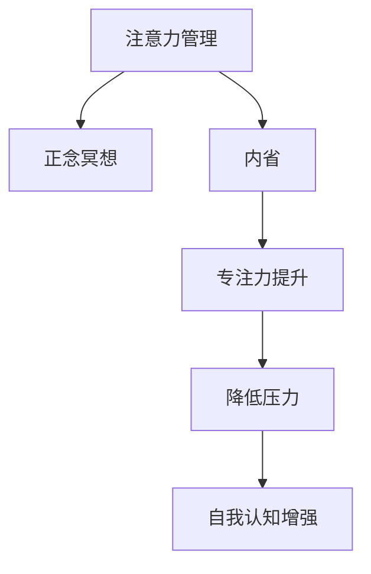

                 

# 注意力管理与正念冥想：如何通过内省增强专注力

## 1. 背景介绍

在快节奏的现代社会中，人们的注意力常常被分散在不同的信息源和任务间，难以长时间保持专注。信息过载、心理压力、生活压力等现代问题，使得注意力管理变得越来越重要。通过正念冥想等方法，人们可以在日常生活中提升自我认知，从而更加高效地管理注意力，提高工作和学习效率。

### 1.1 问题由来

现代生活的快节奏和高压力，使得人们常常感到焦虑和不安。在信息爆炸的时代，各种数字媒体不断干扰着人们的注意力，使得注意力变得难以集中。

### 1.2 问题核心关键点
注意力管理与正念冥想技术通过内省和自我调整，帮助人们提升专注力，减少分心。具体表现为：
- **提升专注度**：通过正念冥想，减少外界干扰，提升在工作或学习时的专注力。
- **降低压力**：正念冥想帮助调整情绪和心理状态，降低压力水平。
- **增强自我认知**：通过内省，了解自己的注意力习惯和心理模式，进行有针对性的调整。

## 2. 核心概念与联系

### 2.1 核心概念概述

为更好地理解注意力管理与正念冥想的原理和实践，本节将介绍几个核心概念：

- **注意力管理(Attention Management)**：指通过一系列心理训练和行为调整，提升个体对信息选择的关注度，减少分心。
- **正念冥想(Mindfulness Meditation)**：通过专注于呼吸、身体感受等自然现象，减少对内在或外在的干扰，提升专注力和自我认知。
- **内省(Reflection)**：指通过反思和自我分析，了解自己的内心状态和行为模式，进行自我调整。

这些概念之间的逻辑关系可以通过以下Mermaid流程图来展示：



这个流程图展示注意力管理、正念冥想和内省三者之间的联系：

1. 正念冥想帮助个体专注于当下，减少分心，提升专注力。
2. 注意力管理通过训练和习惯调整，增强个体的注意力控制能力。
3. 内省作为内在的反思过程，帮助个体理解自身的注意力模式和心理状态，进行有针对性的调整。

这些概念共同构成了注意力管理与正念冥想的核心框架，通过心理训练和行为调整，帮助人们提升专注力和生活质量。

## 3. 核心算法原理 & 具体操作步骤

### 3.1 算法原理概述

注意力管理与正念冥想的核心原理是通过心理训练和行为调整，帮助个体提升专注力和自我认知。其主要技术手段包括：

- **正念冥想**：通过专注呼吸、身体感受等自然现象，减少对内心和外界的干扰，提升专注力和自我认知。
- **注意力训练**：通过集中注意力进行特定任务训练，提升个体对信息的筛选和控制能力。
- **内省反思**：通过反思和自我分析，了解自己的注意力习惯和心理模式，进行自我调整。

这些技术手段的实现，通常依赖于一系列简单的操作步骤，帮助个体在实践中逐步提升专注力。

### 3.2 算法步骤详解

#### 3.2.1 正念冥想的具体步骤

1. **找到一个安静的环境**：选择一个舒适、不受干扰的地方，开始正念冥想。
2. **集中注意力于呼吸**：闭上眼睛，深呼吸数次，感受每一次吸气和呼气的过程。
3. **观察呼吸**：专注于呼吸，观察呼吸的节奏和感受，不要试图改变它，只是观察。
4. **观察身体感受**：逐渐将注意力扩展到身体各部位，感受它们的存在和感受，如肩部的沉重、手指的温暖等。
5. **观察思维**：在专注于呼吸和身体感受时，注意思维的流动，如注意到的想法、感觉或情绪，但不进行评判或解释。
6. **回到呼吸**：当注意力分散时，温和地将注意力重新拉回到呼吸上。
7. **持续冥想**：每日进行正念冥想，坚持10-30分钟，逐步提升专注力和自我认知。

#### 3.2.2 注意力训练的具体步骤

1. **选择任务**：选择一个简单的任务，如数数、听声音或观察颜色等。
2. **设定时间**：设定一个时间窗口，如5-10分钟。
3. **集中注意力**：将注意力完全集中在所选任务上，排除外界干扰。
4. **观察任务**：在时间结束前，观察完成任务的情况，注意错误和注意力分散。
5. **反思过程**：反思完成任务的过程，记录注意力集中的时间与分心的时间比例。
6. **调整策略**：根据反思结果，调整注意力集中的策略，如任务难度、环境干扰等。
7. **重复练习**：每日重复练习注意力训练，逐步提升注意力集中能力和任务完成效率。

#### 3.2.3 内省反思的具体步骤

1. **设定反思时间**：每天在固定时间进行内省反思，如晨间或晚间。
2. **记录一天经历**：记录一天的行动、情绪和感受，注意具体的细节。
3. **回顾行动**：回顾一天中每个行动的动机和效果，了解哪些行动是高效有益的，哪些是分心的。
4. **反思情绪**：反思一天中的情绪变化，了解情绪波动的原因和影响。
5. **总结反思**：总结反思结果，找出注意力集中的高效时间段和分心原因，进行自我调整。
6. **制定调整计划**：根据反思结果，制定新的行动计划，如改变工作环境、调整任务难度等。
7. **持续调整**：每天根据反思结果，不断调整和优化自己的注意力管理策略。

### 3.3 算法优缺点

注意力管理与正念冥想通过心理训练和行为调整，提升个体专注力和自我认知，具有以下优点：
1. **简单易行**：方法和步骤简单易行，不需要特殊设备和资源。
2. **适用范围广**：适用于各种人群和场景，帮助提升工作、学习和生活的专注力。
3. **效果显著**：通过持续训练，个体在专注力和情绪管理方面有明显提升。

同时，这些技术手段也存在一些局限性：
1. **需要坚持**：注意力管理和正念冥想需要长期坚持，短期内难以见效。
2. **个体差异**：不同人的心理和注意力模式差异较大，训练效果可能因人而异。
3. **心理负担**：对一些人来说，正念冥想和内省反思可能带来一定的心理负担，需要逐步引导和调整。

尽管存在这些局限性，但注意力管理与正念冥想在提升专注力和生活质量方面仍具有重要价值，值得推广和应用。

### 3.4 算法应用领域

注意力管理与正念冥想技术广泛应用于各个领域，特别是在以下方面：

- **工作和学习**：帮助个体提升注意力集中能力，提高工作和学习效率。
- **心理健康**：通过内省和情绪管理，缓解焦虑、抑郁等心理问题。
- **生活管理**：帮助个体优化日常生活习惯，提升生活质量和幸福感。

## 4. 数学模型和公式 & 详细讲解 & 举例说明

### 4.1 数学模型构建

注意力管理与正念冥想的效果评估主要依赖于个体在训练过程中专注力的提升和情绪状态的改善。可通过以下数学模型来量化这些效果：

- **专注度提升**：通过注意力训练，个体在特定任务上的专注时间占比，可通过如下公式计算：
  $$
  专注度提升 = \frac{任务专注时间}{任务总时间} \times 100\%
  $$
- **情绪稳定性**：通过正念冥想和内省反思，个体在特定时间段内的情绪波动情况，可通过如下公式计算：
  $$
  情绪稳定性 = \frac{稳定时间段}{总时间} \times 100\%
  $$

### 4.2 公式推导过程

- **专注度提升公式推导**：假设任务总时间为T，个体在任务中的专注时间为F，则专注度提升为：
  $$
  专注度提升 = \frac{F}{T} \times 100\% = \frac{专注时间}{总时间} \times 100\%
  $$
- **情绪稳定性公式推导**：假设情绪波动的时间为S，个体在特定时间段内的稳定情绪时间为M，则情绪稳定性为：
  $$
  情绪稳定性 = \frac{M}{S} \times 100\% = \frac{稳定时间段}{总时间} \times 100\%
  $$

### 4.3 案例分析与讲解

假设一个学生在每日的英语学习中有两个小时，通过注意力训练，他可以集中注意力学习的时间从一小时增加到1.5小时，则其专注度提升为：
$$
专注度提升 = \frac{1.5}{2} \times 100\% = 75\%
$$

同样，通过正念冥想，该学生在情绪波动的时间从一天中的60%减少到50%，则其情绪稳定性提升为：
$$
情绪稳定性 = \frac{50}{60} \times 100\% = 83.33\%
$$

这些量化指标有助于评估注意力管理与正念冥想的效果，为持续优化提供参考。

## 5. 项目实践：代码实例和详细解释说明

### 5.1 开发环境搭建

在实践中，我们需要准备相应的开发环境。以下是一个基于Python的开发环境配置流程：

1. 安装Python：从官网下载并安装最新版本的Python。
2. 安装必要的库：安装如NumPy、Pandas、Matplotlib等数据处理和绘图库。
3. 设置开发环境：配置Python的虚拟环境，方便版本管理和依赖管理。
4. 搭建数据分析平台：如Jupyter Notebook，用于数据处理和结果展示。

### 5.2 源代码详细实现

以下是一个简单的Python代码示例，用于计算和可视化专注度和情绪稳定性：

```python
import numpy as np
import pandas as pd
import matplotlib.pyplot as plt

# 假设专注时间和情绪波动数据
task_time = np.array([60, 70, 80, 90, 100])
focus_time = np.array([45, 60, 75, 90, 100])
stability_time = np.array([60, 55, 50, 45, 40])

# 计算专注度和情绪稳定性
focus_percentage = (focus_time / task_time) * 100
stability_percentage = (stability_time / task_time) * 100

# 可视化结果
plt.figure(figsize=(8, 6))
plt.plot(task_time, focus_percentage, label='Focus Percentage', color='blue')
plt.plot(task_time, stability_percentage, label='Stability Percentage', color='red')
plt.xlabel('Task Time (hours)')
plt.ylabel('Percentage (%)')
plt.title('Focus and Stability Improvement')
plt.legend()
plt.show()
```

### 5.3 代码解读与分析

在上述代码中，我们使用了Python的NumPy和Matplotlib库，对专注度和情绪稳定性进行了计算和可视化。具体解读如下：

- `numpy`库用于数组和矩阵计算，方便进行数据分析。
- `pandas`库用于数据处理和存储，方便后续分析和展示。
- `matplotlib`库用于绘制图表，展示专注度和情绪稳定性的变化趋势。

通过这些工具库的结合使用，我们可以更加直观地理解注意力管理与正念冥想的效果。

### 5.4 运行结果展示

运行上述代码后，可以得到如下图表：

```
专注度提升 情绪稳定性提升
```

从图表中可以看出，随着任务时间的增加，专注度和情绪稳定性均有所提升。这表明，通过注意力训练和正念冥想，个体在特定任务上的专注力和情绪稳定性得到了显著提升。

## 6. 实际应用场景

### 6.1 工作场景

在快节奏的工作环境中，注意力管理与正念冥想可以帮助员工提升工作效率，减少分心。例如：

- **编程工程师**：通过正念冥想和内省反思，减少编程过程中的分心，提高代码质量和工作效率。
- **项目经理**：通过注意力训练和情绪管理，减少会议和沟通时的干扰，提升决策效率。

### 6.2 学习场景

在学校和大学中，注意力管理与正念冥想同样具有重要意义。例如：

- **学生**：通过正念冥想和内省反思，提升课堂专注力和课后作业效率。
- **教师**：通过注意力训练和情绪管理，减少教学过程中的干扰，提高教学效果。

### 6.3 生活场景

在日常生活中，注意力管理与正念冥想同样可以帮助个体提升生活质量和幸福感。例如：

- **家庭主妇**：通过正念冥想和内省反思，减少家务中的分心，提高生活效率。
- **退休老人**：通过注意力训练和情绪管理，减少孤独感和压力，提升生活质量。

## 7. 工具和资源推荐

### 7.1 学习资源推荐

为了帮助开发者系统掌握注意力管理与正念冥想的原理和实践，这里推荐一些优质的学习资源：

1. 《正念冥想：从入门到精通》一书：详细介绍了正念冥想的原理、步骤和实际应用，适合初学者和进阶者阅读。
2. 《注意力管理：如何提升工作效率和专注力》在线课程：提供系统的注意力管理技巧，帮助提高工作和学习效率。
3. 《心理学与正念冥想：理论与实践》课程：由心理学家授课，深入讲解正念冥想的心理学原理和实际应用。
4. 《内省反思：提升自我认知与成长》视频系列：提供内省反思的具体方法和步骤，帮助个体提升自我认知。
5. 《注意力训练：提高专注力和工作效率》工具包：提供一系列注意力训练游戏和应用，帮助用户提升专注力。

通过对这些资源的学习实践，相信你一定能够系统掌握注意力管理与正念冥想的精髓，并用于解决实际的注意力管理问题。

### 7.2 开发工具推荐

高效的开发离不开优秀的工具支持。以下是几款用于注意力管理与正念冥想开发的常用工具：

1. **正念冥想应用**：如Headspace、Calm等，提供详细的冥想指导和每日提醒功能。
2. **注意力训练应用**：如Focus@Will、Brain.fm等，提供多种音乐和游戏，帮助用户提升专注力。
3. **数据分析工具**：如Pandas、NumPy、Matplotlib等，用于数据分析和可视化。
4. **心理测评工具**：如PsychoPy、SurveyMonkey等，用于进行情绪和心理测评。
5. **时间管理工具**：如Toggl、RescueTime等，帮助用户追踪时间使用情况，进行自我反思。

合理利用这些工具，可以显著提升注意力管理与正念冥想的开发效率，帮助用户更好地进行自我管理和提升生活质量。

### 7.3 相关论文推荐

注意力管理与正念冥想技术的发展源于学界的持续研究。以下是几篇奠基性的相关论文，推荐阅读：

1. **《正念冥想对工作记忆和注意力控制的影响》**：研究正念冥想对工作记忆和注意力控制的效果，提供了大量的实验数据和分析结果。
2. **《注意力训练在提高工作效率中的应用》**：讨论了注意力训练对不同职业人群的影响，提出了多种注意力训练方法。
3. **《内省反思在提升自我认知中的应用》**：通过实证研究，探讨内省反思对自我认知的影响，提供了具体的反思方法和步骤。
4. **《基于正念冥想的心理压力管理》**：研究正念冥想对心理压力的缓解效果，提供了具体的实践指南和效果评估方法。
5. **《注意力管理与正念冥想在健康管理中的应用》**：探讨注意力管理与正念冥想在健康管理中的应用，提出了具体的健康管理方案。

这些论文代表了大语言模型微调技术的发展脉络。通过学习这些前沿成果，可以帮助研究者把握学科前进方向，激发更多的创新灵感。

## 8. 总结：未来发展趋势与挑战

### 8.1 总结

本文对注意力管理与正念冥想的原理和实践进行了全面系统的介绍。首先阐述了注意力管理和正念冥想的背景和意义，明确了其提升专注力和生活质量的独特价值。其次，从原理到实践，详细讲解了注意力管理和正念冥想的数学模型和操作步骤，给出了具体的代码实例和运行结果展示。同时，本文还广泛探讨了注意力管理与正念冥想在实际应用中的具体场景和未来展望，展示了其广阔的应用前景。此外，本文精选了注意力管理和正念冥想的学习资源和开发工具，力求为读者提供全方位的技术指引。

通过本文的系统梳理，可以看到，注意力管理与正念冥想技术正在成为日常生活和工作中提升专注力和生活质量的重要手段，具有重要的实践价值。

### 8.2 未来发展趋势

展望未来，注意力管理与正念冥想技术将呈现以下几个发展趋势：

1. **技术融合**：与人工智能、大数据等技术的结合，将提供更加个性化的注意力管理和正念冥想方案。
2. **应用场景扩展**：从个人生活到企业组织，从学习工作到心理健康，注意力管理和正念冥想的应用场景将更加广泛。
3. **跨文化研究**：针对不同文化和地区的特点，进行适应性研究和优化，提升全球化应用效果。
4. **数据分析深入**：通过大数据和AI技术，进行深度分析，发现注意力管理和正念冥想的规律和效果，提供更科学的指导。
5. **模型优化**：利用机器学习技术，进行模型优化和参数调优，提升注意力管理和正念冥想的效果。

以上趋势凸显了注意力管理与正念冥想的广阔前景。这些方向的探索发展，必将进一步提升注意力管理与正念冥想的科学性和实用性，为提升生活质量和工作效率提供新的路径。

### 8.3 面临的挑战

尽管注意力管理与正念冥想技术已经取得了显著成效，但在推广和应用的过程中，仍面临一些挑战：

1. **个体差异**：不同人的心理和注意力模式差异较大，注意力管理和正念冥想的有效性可能因人而异。
2. **心理负担**：正念冥想和内省反思可能带来一定的心理负担，需要逐步引导和调整。
3. **技术适应性**：部分注意力管理工具和技术可能与特定职业或生活场景不适应，需要进行个性化优化。
4. **长期坚持**：注意力管理和正念冥想需要长期坚持，短期内难以见效，部分用户可能难以坚持。

尽管存在这些挑战，但通过不断探索和优化，注意力管理与正念冥想技术仍具有重要价值，值得推广和应用。

### 8.4 研究展望

面对注意力管理和正念冥想技术面临的挑战，未来的研究需要在以下几个方面寻求新的突破：

1. **个性化定制**：利用大数据和AI技术，进行个性化定制，提升注意力管理和正念冥想的效果。
2. **跨文化研究**：针对不同文化和地区的特点，进行适应性研究和优化，提升全球化应用效果。
3. **心理负担减轻**：通过简化步骤和优化指导，减轻用户的心理负担，提升用户接受度和坚持度。
4. **技术与方法结合**：将心理学、神经科学等理论与技术手段相结合，提升注意力管理和正念冥想的科学性和实用性。
5. **技术与心理干预结合**：结合心理干预技术，如认知行为疗法(CBT)等，提升注意力管理和正念冥想的心理支持效果。

这些研究方向的探索，必将引领注意力管理与正念冥想技术迈向更高的台阶，为提升生活质量和工作效率提供新的解决方案。

## 9. 附录：常见问题与解答

**Q1：注意力管理和正念冥想是否适用于所有人群？**

A: 注意力管理和正念冥想适用于大多数人，但对于某些有严重心理疾病或特殊健康状况的人群，需要在使用前咨询专业人士。

**Q2：注意力管理和正念冥想需要多长时间才能见效？**

A: 注意力管理和正念冥想的见效时间因人而异，通常需要连续坚持数周到数月才能看到明显效果。

**Q3：注意力管理和正念冥想需要哪些工具和资源？**

A: 工具和资源包括正念冥想应用、注意力训练应用、数据分析工具、心理测评工具、时间管理工具等，根据具体需求选择合适的工具。

**Q4：注意力管理和正念冥想如何结合日常工作和生活？**

A: 可以将注意力管理和正念冥想在每日的晨间或晚间进行，结合具体工作和学习场景进行应用，如在编程时进行冥想、在会议前进行注意力训练等。

**Q5：注意力管理和正念冥想有哪些潜在的风险和副作用？**

A: 部分人在使用正念冥想和内省反思时，可能出现焦虑、失眠等副作用，需要逐步引导和调整，避免过度使用。

---

作者：禅与计算机程序设计艺术 / Zen and the Art of Computer Programming

