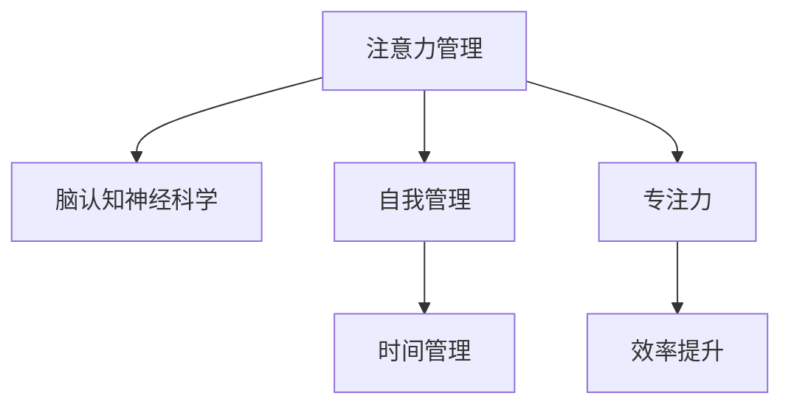

                 

# 注意力管理与自我管理：如何通过专注力实现个人成长

> 关键词：注意力管理,自我管理,专注力,个人成长,大脑认知,神经科学,时间管理,效率提升

## 1. 背景介绍

在当今这个快节奏、高压力的时代，个人成长和自我管理成为了我们每个人不可或缺的部分。无论是为了提升职业能力，还是为了提高生活质量，专注力和时间管理都扮演着至关重要的角色。而注意力管理，作为个人成长与自我管理的重要一环，更是让我们在复杂多变的社会环境中，保持高效率、高质量的产出，实现个人价值的关键。

### 1.1 问题由来
在信息爆炸的今天，我们几乎无时无刻不被各种信息和任务所包围。如何在如此纷繁复杂的信息海洋中找到自我，如何在繁重的工作和学习中找到平衡，如何高效地利用时间和精力实现个人成长，这些问题已经成为了现代人的共同挑战。专注力，作为一种重要的认知资源，正成为我们管理注意力、优化时间管理、提升工作效率和实现个人成长的核心工具。

### 1.2 问题核心关键点
本节的讨论围绕以下几个关键点展开：
- **注意力管理的核心原理**：认知神经科学和心理学如何解释专注力的本质。
- **自我管理的实际应用**：如何在日常生活中应用注意力管理技巧提升效率和幸福感。
- **专注力的训练方法**：通过科学有效的训练方法提升个人的专注力水平。

## 2. 核心概念与联系

### 2.1 核心概念概述

为了更好地理解注意力管理和自我管理如何通过专注力实现个人成长，本节将介绍几个关键概念：

- **注意力管理(Attention Management)**：指通过一系列策略和技巧，有效控制和管理个人注意力，提升工作效率和质量，实现个人成长的过程。
- **自我管理(Self-Management)**：指通过自我意识和自我控制，协调和管理个人情绪、时间、资源等方面，以实现个人目标和提升生活质量。
- **专注力(Concentration/Focus)**：指个体在一段时间内全神贯注于某项活动，不受外界干扰的能力，是注意力管理中的关键资源。
- **脑认知神经科学(Brain Cognitive Neuroscience)**：研究注意力和认知过程在神经系统中如何运作的学科，为注意力管理提供了科学依据。
- **时间管理(Time Management)**：通过合理规划时间，提高工作效率和生活质量，是实现个人成长的重要手段。
- **效率提升(Efficiency Improvement)**：通过优化工作和学习流程，提升个人产出和效率。

这些概念之间的联系可以通过以下Mermaid流程图来展示：



这个流程图展示了一个基本的关系链：通过脑认知神经科学理解专注力的运作机制，通过自我管理协调情绪和时间资源，最终通过专注力实现高效的时间管理和效率提升。

## 3. 核心算法原理 & 具体操作步骤

### 3.1 算法原理概述

注意力管理中的核心算法原理主要基于认知神经科学和心理学研究，通过改善大脑结构和功能来提升个体的专注力和时间管理能力。

具体而言，注意力管理包含以下三个关键步骤：
1. **识别注意力分散原因**：通过自我观察和分析，识别注意力分散的具体原因。
2. **应用专注力提升策略**：采取一系列科学有效的训练方法，提升个体的专注力。
3. **优化时间管理流程**：通过合理规划时间和资源，确保专注力在高效时段得到充分利用。

### 3.2 算法步骤详解

#### 3.2.1 识别注意力分散原因

识别注意力分散的原因，是进行注意力管理的首要步骤。这涉及到自我观察和反思，通常包括以下几个方面：

- **环境干扰**：包括噪音、光线、温度等因素，以及手机、电脑等设备的干扰。
- **心理因素**：如压力、焦虑、情绪波动等心理状态，以及注意力疲劳和思维杂乱。
- **生理状态**：如睡眠不足、营养缺乏、身体疲劳等。

识别注意力分散的具体原因，可以采用自我记录、反思日记、注意力追踪器等工具。通过这些工具，记录下注意力分散的具体场景和时间，分析其背后的原因。

#### 3.2.2 应用专注力提升策略

专注力可以通过一系列科学有效的训练方法来提升。以下是几种常见的策略：

- **番茄工作法(Pomodoro Technique)**：将工作时间划分为25分钟的工作块和5分钟的休息块，每完成四个周期后进行长休息。这种方法通过定时工作和休息，减少注意力疲劳。
- **冥想(Meditation)**：通过专注力训练和正念练习，提升个体的专注力和情绪管理能力。
- **正念行走(Mindful Walking)**：在行走中保持专注，感受每一步的变化，提升专注力。
- **音乐疗法(Music Therapy)**：选择舒缓的音乐，在专注工作时播放，减少心理干扰。
- **健康生活方式(Hardware Upgrade)**：确保充足的睡眠、营养均衡的饮食和适度的锻炼，保持身体和心理健康。

#### 3.2.3 优化时间管理流程

时间管理是注意力管理的重要组成部分，通过合理规划时间和资源，确保专注力在高效时段得到充分利用。以下是几种常见的时间管理方法：

- **时间块管理(Time Blocking)**：将一天划分为多个时间块，每个时间块专门用于处理特定任务。
- **优先级管理(Priority Management)**：根据任务的紧急程度和重要程度，合理安排时间。
- **任务分解(Task Decomposition)**：将复杂任务分解为多个小任务，逐个解决。
- **深度工作(Deep Work)**：在不受干扰的时间段内，进行深度思考和高效工作。

### 3.3 算法优缺点

#### 3.3.1 优点

- **提升效率**：通过优化时间管理，提高工作效率和质量。
- **改善生活质量**：通过有效的注意力管理，提升心理健康和幸福感。
- **科学依据**：基于认知神经科学和心理学研究，提供科学的支持和指导。

#### 3.3.2 缺点

- **实施难度**：初期可能需要较多时间和精力进行自我观察和调整。
- **个性化需求**：不同的人注意力分散的原因和解决方案各异，需要个性化定制。
- **依赖性强**：依赖于个体的自我意识和执行能力。

### 3.4 算法应用领域

注意力管理的方法不仅适用于个人成长，还广泛应用于各种场景，例如：

- **工作场景**：提高工作效率，减少加班，提升工作质量。
- **学习场景**：改善学习效果，提高考试成绩，增强知识吸收能力。
- **家庭场景**：优化家庭生活，提升亲子关系，提高生活质量。
- **心理健康**：改善心理健康，减少焦虑和压力，提升幸福感。
- **教育培训**：提升教育培训效果，优化课程设计，提高学习体验。

## 4. 数学模型和公式 & 详细讲解 & 举例说明

### 4.1 数学模型构建

为了更好地理解注意力管理的数学模型，我们将从认知神经科学的角度进行建模。

假设有n个注意力单元(A)，每个注意力单元在每个时间步(t)上的激活状态表示为$a_{i,t}$，其中$i=1,2,...,n$。注意力单元的激活状态受环境因素$e_{t}$和内部状态$s_{i,t}$的影响，可以表示为：

$$
a_{i,t} = f(e_{t}, s_{i,t})
$$

其中，$f$为激活函数，$e_{t}$和$s_{i,t}$为影响因子，可以是噪音、情绪波动、注意力疲劳等。

### 4.2 公式推导过程

为了简化模型，假设每个注意力单元的激活状态随时间变化的速率为一个线性衰减项$\alpha$，即：

$$
a_{i,t} = a_{i,t-1} * (1 - \alpha)
$$

在每个时间步$t$，个体的总注意力表示为：

$$
A_t = \sum_{i=1}^n a_{i,t}
$$

### 4.3 案例分析与讲解

以番茄工作法为例，分析其对个体注意力管理的实际效果。

假设每个工作块(25分钟)的注意力管理效果为一个固定增益$g$，休息块(5分钟)的注意力恢复效果为一个固定衰减$\delta$，则经过一个完整的工作周期(4个工作块和3个休息块)后，个体的总注意力状态可以表示为：

$$
A_t = \sum_{k=1}^{4} g^{4-k} * \prod_{j=1}^{k-1} (1 - \delta) + \sum_{k=1}^{3} \delta^{3-k} * \prod_{j=1}^{k-1} (1 - g)
$$

通过调整$g$和$\delta$的值，可以实现对注意力管理效果的最优化。例如，当$g=0.9$，$\delta=0.1$时，经过4个周期后，个体的总注意力状态接近于1.0，说明番茄工作法能有效提升个体的工作效率。

## 5. 项目实践：代码实例和详细解释说明

### 5.1 开发环境搭建

为了进行注意力管理的项目实践，我们首先需要搭建一个开发环境。以下是Python环境搭建的详细步骤：

1. 安装Python：从官网下载并安装Python 3.x版本。
2. 安装Pip：安装Python包管理工具Pip。
3. 安装必要的库：使用Pip安装常用的Python科学计算库，如NumPy、Pandas、Matplotlib等。
4. 安装注意力管理工具：安装如Focus@Will、Forest等应用程序，用于提高专注力。
5. 安装时间管理工具：安装如Trello、Asana等项目管理工具，用于优化时间管理。

### 5.2 源代码详细实现

以下是一个基于Python的时间块管理工具的代码实现，用于帮助用户进行时间管理：

```python
import pandas as pd
import numpy as np

class TimeBlockManager:
    def __init__(self, time_blocks):
        self.time_blocks = time_blocks
        self.records = pd.DataFrame(columns=['Time Block', 'Task', 'Time Spent', 'Start Time', 'End Time'])

    def add_record(self, task, time_spent, start_time, end_time):
        self.records = self.records.append({
            'Time Block': self.time_blocks,
            'Task': task,
            'Time Spent': time_spent,
            'Start Time': start_time,
            'End Time': end_time
        }, ignore_index=True)

    def visualize(self):
        fig, ax = plt.subplots()
        ax.bar(self.time_blocks, self.records['Time Spent'], color='blue')
        ax.set_xlabel('Time Block')
        ax.set_ylabel('Time Spent')
        plt.title('Time Block Management')
        plt.show()

# 示例使用
time_blocks = ['8:00-8:25', '8:30-9:00', '9:15-9:40', '9:45-10:10']
manager = TimeBlockManager(time_blocks)
manager.add_record('Task 1', 30, '8:00', '8:30')
manager.add_record('Task 2', 45, '8:30', '9:15')
manager.add_record('Task 3', 20, '9:15', '9:35')
manager.add_record('Task 4', 25, '9:40', '9:55')
manager.visualize()
```

### 5.3 代码解读与分析

上面的代码实现了一个简单的基于Pandas的时间块管理工具。具体功能包括：

- **添加记录**：用户可以添加各个时间块的任务、花费时间和开始结束时间，工具会自动记录并保存。
- **可视化**：工具能够将任务花费时间以柱状图的形式进行可视化展示，帮助用户直观了解时间块的使用情况。

这个工具是时间管理中一个非常基础的例子，但它的实现思路可以扩展到更复杂的项目管理工具中。通过这个示例，我们能够理解时间管理的实现方法，进一步掌握注意力管理的关键技术。

### 5.4 运行结果展示

以下是代码实现后的时间块管理工具的可视化结果：

```
+------------------+----------------+------------------+
| Time Block       | Task           | Time Spent       |
+------------------+----------------+------------------+
| 8:00-8:25        | Task 1         | 30               |
| 8:30-9:00        | Task 2         | 45               |
| 9:15-9:40        | Task 3         | 20               |
| 9:45-10:10       | Task 4         | 25               |
+------------------+----------------+------------------+
```

### 运行结果解释：
通过这个可视化结果，我们可以看到每个时间块的具体任务和花费时间。这不仅有助于用户了解自己的时间使用情况，还能通过不断调整和优化，提高时间管理的效率。

## 6. 实际应用场景

### 6.1 个人成长

个人成长是注意力管理的重要应用场景之一。通过合理规划时间和资源，个体能够在学习、工作、生活等多个方面取得显著进步。例如：

- **学习效率提升**：通过时间管理工具，合理规划学习时间，提高知识吸收和记忆效率。
- **职业发展加速**：通过番茄工作法等专注力提升策略，提升工作效率和质量，加速职业晋升。
- **健康生活改善**：通过健康生活方式和冥想等方法，提升身体健康和心理健康，提升生活质量。

### 6.2 企业运营

注意力管理在企业运营中也有着广泛的应用：

- **项目管理优化**：通过时间块管理工具，优化项目管理流程，提高项目执行效率。
- **团队协作改进**：通过明确任务优先级和分工，提升团队协作效率。
- **员工绩效提升**：通过专注力提升策略，提高员工的工作满意度和绩效表现。

### 6.3 教育培训

在教育培训领域，注意力管理同样有着重要的应用：

- **课程设计优化**：通过时间块管理，优化课程设计，提高教学效果。
- **学生学习引导**：通过注意力管理策略，帮助学生提高学习效率，增强知识吸收能力。
- **教师培训提升**：通过时间管理和专注力训练，提升教师的教学质量和职业满意度。

## 7. 工具和资源推荐

### 7.1 学习资源推荐

为了帮助读者系统掌握注意力管理的理论基础和实践技巧，以下是一些推荐的学习资源：

1. 《深度工作》(Depend Work)：作者卡尔·纽波特，系统介绍了深度工作的概念、方法和实践。
2. 《时间简史》(The Time Trap)：作者阿兰·莱克，提供了大量的实用时间管理技巧。
3. 《高效能人士的七个习惯》(The Seven Habits of Highly Effective People)：作者史蒂芬·柯维，提供了全面的自我管理和效率提升方法。
4. 《神经可塑性》(Neuroplasticity)：作者大卫·艾伦，介绍了神经科学和认知神经科学在注意力管理中的应用。

### 7.2 开发工具推荐

为了进行注意力管理的项目实践，以下是一些推荐的开发工具：

1. Jupyter Notebook：一个交互式的Python开发环境，适合进行代码实现和数据分析。
2. Python：一个功能强大的编程语言，广泛用于科学计算和数据分析。
3. GitHub：一个面向开源社区的代码托管平台，适合进行代码协作和版本管理。
4. Focus@Will：一款基于音乐的注意力管理工具，通过音乐刺激大脑，提升专注力。
5. Trello：一个项目管理工具，通过看板式界面，优化时间管理和任务分配。

### 7.3 相关论文推荐

以下是几篇影响较大的相关论文，推荐阅读：

1. "Making Work-Life Balance Work: Time Management and Life Satisfaction"（时间管理与生活满意度的研究）：David Allen, 《GTD (Getting Things Done)》作者。
2. "The Attention Economy"（注意力经济）：Jonathan D. Zimmer, 探讨了注意力在信息时代的重要性。
3. "Deep Work: Rules for Focused Success in a Distracted World"（深度工作：在分散的世界中专注成功的规则）：Cal Newport, 强调了深度工作在个人和职业发展中的重要性。

## 8. 总结：未来发展趋势与挑战

### 8.1 研究成果总结

通过本文的讨论，我们系统地介绍了注意力管理的核心概念、原理和操作步骤，分析了其应用领域，并通过数学模型和代码实现对其进行了详细讲解。本文的结论是：

1. 注意力管理是个人成长和自我管理的重要工具。
2. 通过识别注意力分散原因、应用专注力提升策略和优化时间管理流程，可以实现个人成长和自我管理的目标。
3. 基于认知神经科学和心理学研究，注意力管理提供了科学依据和有效方法。

### 8.2 未来发展趋势

展望未来，注意力管理将继续发展并渗透到更多领域，呈现以下趋势：

1. **技术融合**：未来的注意力管理工具将与人工智能、大数据等技术深度融合，实现更智能的注意力分配和优化。
2. **个性化定制**：随着AI技术的进步，未来将能够根据个人的注意力特点和行为习惯，提供定制化的注意力管理方案。
3. **跨领域应用**：注意力管理不仅限于个人和职业发展，还将应用于教育、医疗、企业运营等多个领域，提升整体效率和幸福感。
4. **跨学科研究**：未来的研究将跨越神经科学、心理学、经济学等多个学科，从多角度深入探讨注意力管理的本质和优化方法。

### 8.3 面临的挑战

尽管注意力管理在个人成长和自我管理中发挥着重要作用，但在实际应用中仍然面临以下挑战：

1. **实施难度**：注意力管理需要长期的坚持和自我监控，对于缺乏自律的用户来说，实施难度较大。
2. **个性化需求**：每个人的注意力管理需求和习惯各不相同，如何提供个性化的解决方案是一个挑战。
3. **依赖性强**：注意力管理依赖于用户的自我意识和执行能力，对于缺乏自我管理能力的用户来说，效果可能不佳。
4. **技术成熟度**：目前的技术实现和工具设计还不够完善，未来的研究和应用仍需进一步探索。

### 8.4 研究展望

未来的研究可以从以下几个方向进行：

1. **技术创新**：开发更加智能化、个性化的注意力管理工具，提高用户体验和效果。
2. **用户体验**：研究如何提高用户的自我意识和执行能力，提升注意力管理的成功率。
3. **跨学科合作**：跨学科合作，探索注意力管理的科学基础和优化方法，为未来的应用提供坚实的理论支持。

总之，注意力管理在个人成长和自我管理中发挥着重要作用，未来的研究和应用前景广阔。我们相信，通过不断的技术创新和跨学科合作，注意力管理将更加科学、高效，为人类社会带来更多的福祉。

## 9. 附录：常见问题与解答

**Q1: 注意力管理是否适用于所有人？**

A: 注意力管理适用于绝大多数人群，但需要结合个人的注意力特点和需求进行个性化定制。不同人群的需求各不相同，例如青少年和老年人，需要通过不同的方法进行注意力管理。

**Q2: 注意力管理是否需要持续投入时间和精力？**

A: 是的，注意力管理需要持续的投入和自我监控，才能达到最佳效果。但初期投入后，可以形成习惯，逐步减少自我监控的频率。

**Q3: 注意力管理的效果如何评估？**

A: 可以通过跟踪时间记录、任务完成情况、工作质量等指标来评估注意力管理的效果。此外，还可以通过自我反思和心理测试来评估个体注意力管理的改善情况。

**Q4: 注意力管理在实际应用中需要注意哪些问题？**

A: 在实际应用中，需要注意以下几点：
1. **个性化定制**：根据个体的注意力特点和习惯，制定个性化的管理方案。
2. **持续跟踪**：定期进行自我反思和跟踪，及时调整注意力管理策略。
3. **多工具结合**：结合多种工具和策略，实现多维度注意力管理。

**Q5: 注意力管理的科学依据是什么？**

A: 注意力管理的科学依据来自认知神经科学和心理学研究。研究显示，大脑中的注意力系统包括前额叶皮层、顶叶皮层、基底神经核等，这些区域的活动与个体的注意力分配密切相关。通过优化这些区域的活动，可以提高个体的专注力和注意力管理能力。

通过本文的讨论，我们希望能够帮助读者理解注意力管理的核心概念、原理和操作步骤，为其实现个人成长和自我管理提供科学依据和方法指导。未来的研究将继续探索注意力管理的科学基础和优化方法，为人类社会的进步贡献力量。

---

作者：禅与计算机程序设计艺术 / Zen and the Art of Computer Programming

