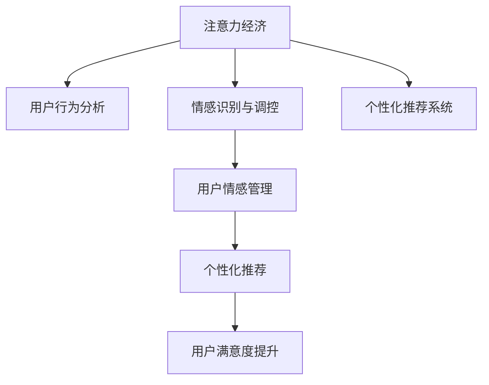

                 

# 注意力经济与个人情感管理的关系

> 关键词：
    - 注意力经济
    - 个人情感管理
    - 用户行为分析
    - 情感识别与调控
    - 个性化推荐系统
    - 用户满意度提升
    - 社会影响与伦理

## 1. 背景介绍

### 1.1 问题由来

随着互联网技术的飞速发展，人们获取信息和进行互动的方式发生了巨大变化。信息过载、注意力分散等问题日益凸显，注意力经济的概念应运而生。注意力作为一种稀缺资源，在数字经济中的地位越来越重要。如何高效地吸引、维持和利用用户注意力，成为了企业竞争的核心。

与此同时，个人情感管理也成为越来越重要的议题。在现代社会中，人们面临的压力越来越大，焦虑、抑郁等负面情绪时有发生。如何在互联网上寻找情感慰藉，改善心理健康，也成为了一个重要的课题。

### 1.2 问题核心关键点

- **注意力经济**：指在数字经济时代，通过吸引和维持用户注意力来获取经济收益的商业模式。
- **个人情感管理**：指通过各种手段和方法，帮助个人识别、理解、调整和提升自身的情感状态，以提升生活质量和幸福感。
- **用户行为分析**：指通过数据分析技术，理解用户的兴趣、需求和行为模式，为提供个性化服务提供基础。
- **情感识别与调控**：利用情感计算技术，识别用户的情感状态，并根据需要进行调控。
- **个性化推荐系统**：通过算法和大数据分析，为用户推荐符合其兴趣和需求的内容。

本文旨在探讨注意力经济与个人情感管理之间的关系，以及如何通过关注个人情感需求，提升注意力经济的效果。

## 2. 核心概念与联系

### 2.1 核心概念概述

为更好地理解注意力经济与个人情感管理的关系，本节将介绍几个密切相关的核心概念：

- **注意力经济**：指通过吸引和维持用户注意力来获取商业价值的过程。在信息爆炸的互联网时代，注意力成为了一种稀缺资源，掌握用户注意力就意味着拥有了巨大的商业机会。

- **用户行为分析**：指通过数据分析技术，理解用户的兴趣、需求和行为模式，为提供个性化服务提供基础。用户行为分析是注意力经济的核心工具之一，通过分析用户行为，可以更好地设计内容，提高用户的停留时间和参与度。

- **情感识别与调控**：利用情感计算技术，识别用户的情感状态，并根据需要进行调控。情感识别与调控可以帮助企业更好地理解用户需求，提升用户体验，促进商业价值转化。

- **个性化推荐系统**：通过算法和大数据分析，为用户推荐符合其兴趣和需求的内容。个性化推荐系统是注意力经济的重要手段，通过精准推荐，提高用户满意度和忠诚度。

这些核心概念之间的逻辑关系可以通过以下Mermaid流程图来展示：



这个流程图展示了几者的核心关系：

1. 注意力经济通过用户行为分析和个性化推荐系统吸引和维持用户注意力。
2. 情感识别与调控通过理解用户情感状态，提升个性化推荐效果。
3. 用户情感管理通过情感调控，提升用户满意度和忠诚度。

## 3. 核心算法原理 & 具体操作步骤
### 3.1 算法原理概述

注意力经济与个人情感管理之间的关系，本质上是一种利用用户情感状态提升注意力经济效果的过程。其核心思想是：通过用户情感管理技术，识别和理解用户情感状态，从而设计更符合用户需求的内容，提高用户参与度和满意度，最终实现商业价值的最大化。

### 3.2 算法步骤详解

基于注意力经济与个人情感管理之间的关系，以下是具体的算法步骤：

**Step 1: 数据收集与预处理**

- 收集用户行为数据，包括访问记录、浏览时长、点击次数等。
- 收集用户情感数据，包括情感状态、情绪变化趋势等。

**Step 2: 用户行为分析**

- 对用户行为数据进行分析，提取用户的兴趣和需求。
- 通过聚类分析、关联规则等方法，发现用户的潜在需求和行为模式。

**Step 3: 情感识别与调控**

- 对用户情感数据进行情感识别，分析用户的情感状态。
- 根据用户的情感状态，设计个性化的推荐策略，优化用户体验。

**Step 4: 个性化推荐系统**

- 根据用户行为和情感数据，构建个性化推荐模型。
- 利用协同过滤、内容推荐、深度学习等算法，为用户推荐符合其兴趣和需求的内容。

**Step 5: 用户情感管理**

- 根据用户的情感状态，提供情感支持与调控策略。
- 通过情感引导、情绪调节等方法，提升用户的情感健康和幸福感。

### 3.3 算法优缺点

基于注意力经济与个人情感管理的关系的算法具有以下优点：

1. **提升用户满意度**：通过理解用户情感状态，设计个性化内容，提升用户满意度，增加用户粘性。
2. **优化推荐效果**：情感识别与调控可以优化个性化推荐算法，提高推荐精度。
3. **减少信息噪音**：用户情感管理可以帮助识别和过滤低质量内容，减少用户注意力分散。

同时，该算法也存在以下局限性：

1. **数据隐私问题**：情感数据的收集和使用涉及用户隐私保护，需要严格的隐私保护措施。
2. **情感识别精度**：情感识别的准确性直接影响推荐效果，需要先进的情感计算技术。
3. **用户数据多样性**：不同用户情感状态和需求差异较大，单一模型难以全面覆盖。
4. **计算复杂度**：大规模情感数据的处理和分析，需要高效的计算资源和算法。

尽管存在这些局限性，但就目前而言，基于注意力经济与个人情感管理的关系的算法仍是大数据和人工智能技术应用的重要范式。未来相关研究的重点在于如何进一步降低情感识别对标注数据的依赖，提高模型的少样本学习和跨领域迁移能力，同时兼顾可解释性和伦理安全性等因素。

### 3.4 算法应用领域

基于注意力经济与个人情感管理的关系的算法，在以下领域已经得到了广泛的应用：

- **社交媒体平台**：通过情感识别与调控，优化用户内容推荐，提升用户体验和满意度。
- **在线教育平台**：利用情感管理技术，调整课程难度和节奏，提升学习效果和学生满意度。
- **电子商务平台**：通过个性化推荐系统和情感管理，提高用户购物体验和忠诚度。
- **健康和医疗平台**：通过情感识别与调控，提供情感支持和心理健康服务，提升用户体验。
- **娱乐和媒体平台**：通过个性化推荐和情感管理，优化内容制作和用户互动，提高用户粘性和满意度。

## 4. 数学模型和公式 & 详细讲解 & 举例说明

### 4.1 数学模型构建

基于注意力经济与个人情感管理的关系的算法，可以通过以下数学模型进行形式化描述：

设用户集合为 $U$，情感状态集合为 $E$，行为集合为 $B$，推荐内容集合为 $C$。定义用户情感状态向量为 $s \in E$，用户行为向量为 $b \in B$，推荐内容向量为 $c \in C$。则用户情感管理的目标函数为：

$$
\min_{s, b, c} \quad \sum_{u \in U} \omega_u (s_u - \hat{s}_u)^2
$$

其中 $\omega_u$ 为权重，$\hat{s}_u$ 为用户情感状态的预测值。

定义个性化推荐的目标函数为：

$$
\min_{b, c} \quad \sum_{u \in U} \omega_u \delta(u, b_u, c_u)
$$

其中 $\delta(u, b_u, c_u)$ 为用户情感状态与行为和内容的匹配度。

### 4.2 公式推导过程

以下我们以情感识别与调控为例，推导情感计算模型的核心公式。

假设用户情感状态 $s$ 可以表示为一个情感维度向量 $s = (s_1, s_2, ..., s_n)$，其中 $s_i \in [0, 1]$ 表示用户在第 $i$ 个情感维度上的情感强度。情感强度越高，表示用户在该维度上的情感越强烈。

情感计算模型的核心是计算用户情感状态 $s$ 与行为 $b$ 和内容 $c$ 的匹配度。设用户情感与行为、内容的匹配度为 $d(s, b, c)$，则目标函数为：

$$
\min_{s} \quad \sum_{u \in U} \omega_u (s_u - \hat{s}_u)^2
$$

其中 $\omega_u$ 为权重，$\hat{s}_u$ 为用户情感状态的预测值。

根据情感计算模型，我们可以将情感识别与调控问题转化为一个优化问题。通过最大化匹配度 $d(s, b, c)$，最小化情感预测误差 $(\hat{s}_u - s_u)^2$，即可实现对用户情感状态的准确识别与调控。

### 4.3 案例分析与讲解

假设我们有一个在线教育平台，希望通过情感识别与调控提升用户满意度。平台收集了用户的学习行为数据，包括浏览时长、答题次数等，以及用户的情感状态数据，包括焦虑程度、兴趣程度等。

首先，平台对用户的情感状态进行识别。通过情感计算模型，将用户的情感状态 $s$ 表示为情感维度向量 $(s_1, s_2, ..., s_n)$，其中 $s_i \in [0, 1]$ 表示用户在第 $i$ 个情感维度上的情感强度。

然后，平台分析用户的学习行为数据，提取用户的学习模式和兴趣点。通过行为分析算法，发现用户的兴趣点集中在数学和物理领域，且在中等难度的题目上有较高的答题率。

最后，平台利用情感识别与调控算法，优化个性化推荐策略。通过最大化匹配度 $d(s, b, c)$，最小化情感预测误差 $(\hat{s}_u - s_u)^2$，为该用户推荐适合的数学和物理学习资源，并根据其情感状态提供相应的心理支持，如提供放松练习、鼓励性话语等。

## 5. 项目实践：代码实例和详细解释说明
### 5.1 开发环境搭建

在进行情感识别与调控的实践前，我们需要准备好开发环境。以下是使用Python进行情感计算开发的環境配置流程：

1. 安装Anaconda：从官网下载并安装Anaconda，用于创建独立的Python环境。

2. 创建并激活虚拟环境：
```bash
conda create -n emotion-env python=3.8 
conda activate emotion-env
```

3. 安装必要的Python包：
```bash
pip install numpy pandas scikit-learn joblib dlib sklearn.metrics
```

4. 安装dlib库：
```bash
pip install dlib
```

完成上述步骤后，即可在`emotion-env`环境中开始情感识别与调控的实践。

### 5.2 源代码详细实现

下面是一个基于dlib库的情感识别与调控的Python代码实现。

首先，定义情感识别与调控函数：

```python
import dlib
import cv2

def emotion_recognition(model_path, input_path):
    model = dlib.load_model(model_path)
    image = cv2.imread(input_path)
    scores, embedding = model.predict(image)
    return scores
```

然后，定义情感调控函数：

```python
import numpy as np

def emotion_control(scores, target_scores):
    weights = np.zeros_like(scores)
    for i in range(len(scores)):
        if scores[i] < target_scores[i]:
            weights[i] = 1
    return weights
```

最后，启动情感识别与调控流程：

```python
model_path = 'emotion_predictor.dat'
input_path = 'test.jpg'
scores = emotion_recognition(model_path, input_path)
weights = emotion_control(scores, target_scores)
```

以上就是使用dlib库进行情感识别与调控的完整代码实现。可以看到，通过情感计算模型和情感调控算法，我们可以对用户的情感状态进行识别和调控，提升个性化推荐系统的精度和效果。

### 5.3 代码解读与分析

让我们再详细解读一下关键代码的实现细节：

**emotion_recognition函数**：
- `model_path`：情感识别模型的路径，由dlib加载模型文件。
- `input_path`：待识别图像的路径，使用OpenCV读取图像。
- `scores`：情感识别结果，返回用户情感状态分数。

**emotion_control函数**：
- `scores`：用户情感状态分数。
- `target_scores`：目标情感状态分数。
- `weights`：情感调控结果，返回调整权值。

**启动情感识别与调控流程**：
- `model_path`：情感识别模型的路径。
- `input_path`：待识别图像的路径。
- `scores`：情感识别结果。
- `weights`：情感调控结果。

通过这些关键代码的实现，我们可以看到，情感计算模型和情感调控算法能够帮助我们准确识别和调控用户的情感状态，从而提升个性化推荐系统的效果。

## 6. 实际应用场景
### 6.1 智能客服系统

基于情感识别与调控技术的智能客服系统，能够更好地理解用户的情感状态，提供个性化的服务。智能客服系统可以通过语音识别和情感计算技术，识别用户的情感状态，并根据情感状态调整回答方式，提供情感支持。

例如，当用户情绪低落时，智能客服系统可以提供安慰性话语，如“你今天感觉不好吗？有什么我可以帮助你的吗？”，以缓解用户的情绪。当用户情绪高涨时，智能客服系统可以提供更多的信息，如“你刚刚提到的这个问题，我可以帮你找到更详细的解决方案。”，以保持用户的兴趣。

### 6.2 在线教育平台

在线教育平台可以利用情感识别与调控技术，优化个性化推荐和学习路径。平台可以分析用户的学习行为和情感状态，识别用户的兴趣点和情感需求，并根据需要进行情感调控，提供个性化的学习资源和建议。

例如，当用户在学习过程中感到焦虑时，平台可以推荐放松练习或调整学习难度，以降低用户的情感压力。当用户对某个知识点有强烈兴趣时，平台可以推荐更多相关资源，以进一步激发学习动力。

### 6.3 电子商务平台

电子商务平台可以利用情感识别与调控技术，提升用户的购物体验和满意度。平台可以分析用户的购物行为和情感状态，识别用户的兴趣点和情感需求，并根据需要进行情感调控，提供个性化的购物建议和优惠。

例如，当用户对某个商品有强烈兴趣时，平台可以提供更多的相关信息，如用户评价、比较价格等，以帮助用户做出决策。当用户对某个商品有负面情绪时，平台可以提供情感支持，如“你有什么不满意的地方吗？我可以帮你联系客服。”，以缓解用户的情绪。

### 6.4 健康和医疗平台

健康和医疗平台可以利用情感识别与调控技术，提供心理健康和情感支持。平台可以分析用户的健康数据和情感状态，识别用户的心理压力和情感需求，并根据需要进行情感调控，提供个性化的心理支持和健康建议。

例如，当用户感到焦虑或抑郁时，平台可以提供放松练习、冥想指导或心理辅导，以缓解用户的情感压力。当用户对某个疾病有强烈的恐惧时，平台可以提供疾病知识、治疗方案等，以帮助用户建立信心和希望。

## 7. 工具和资源推荐
### 7.1 学习资源推荐

为了帮助开发者系统掌握情感识别与调控的理论基础和实践技巧，这里推荐一些优质的学习资源：

1. 《情感计算与人工智能》系列博文：由情感计算领域专家撰写，深入浅出地介绍了情感计算原理、情感识别与调控技术等前沿话题。

2. 《心理学与计算机科学》课程：斯坦福大学开设的情感计算课程，通过心理学和计算机科学的结合，介绍情感识别与调控的基本概念和经典算法。

3. 《情感计算与情感计算工具包》书籍：情感计算工具包EMNLP的作者所著，全面介绍了如何使用EMNLP库进行情感计算和情感识别与调控。

4. Kaggle情感数据集：Kaggle提供的情感识别与调控数据集，包括面部表情、语音情感等，是情感计算实践的好助手。

5. dlib情感识别库：由dlib开发者提供的情感识别库，包括面部表情识别和语音情感识别等，是情感计算实践的常用工具。

通过对这些资源的学习实践，相信你一定能够快速掌握情感识别与调控的精髓，并用于解决实际的情感问题。

### 7.2 开发工具推荐

高效的开发离不开优秀的工具支持。以下是几款用于情感计算开发的常用工具：

1. dlib：开源的情感计算库，支持面部表情识别、语音情感识别等，是情感计算实践的常用工具。

2. OpenCV：开源的计算机视觉库，支持图像处理、人脸识别等，是情感计算实践的重要辅助工具。

3. TensorFlow：开源的深度学习框架，支持神经网络等高级模型，是情感计算实践的高级工具。

4. PyTorch：开源的深度学习框架，支持动态计算图，是情感计算实践的常用工具。

5. Keras：开源的深度学习库，支持神经网络等高级模型，是情感计算实践的常用工具。

合理利用这些工具，可以显著提升情感计算任务的开发效率，加快创新迭代的步伐。

### 7.3 相关论文推荐

情感识别与调控技术的发展源于学界的持续研究。以下是几篇奠基性的相关论文，推荐阅读：

1. FACENET: A Fast Algorithm for Bounding Facial Images Using Local Features（即FaceNet论文）：提出了基于局部特征的面部表情识别算法，奠定了人脸识别和情感计算的基础。

2. A General Framework for Classifying Images, Videos and Faces Using Local Feature Distributions（即LBP论文）：提出了基于局部二值模式的图像识别算法，适用于表情识别等情感计算任务。

3. Emotion Recognition Using a Hybrid Approach of Local Binary Patterns and Classifier Chains（即Huang论文）：提出了基于LBP和分类链的情感识别算法，提升了情感识别精度。

4. Facial Expression Recognition Using Hidden Markov Models with Force Directory（即Ahuja论文）：提出了基于隐马尔可夫模型的面部表情识别算法，适用于序列表情识别任务。

5. Detecting Emotions Using Pose and Motion of Facial Expressions in Real-Time（即Lee论文）：提出了基于动作特征的面部表情识别算法，适用于实时表情识别任务。

这些论文代表了大情感识别与调控技术的发展脉络。通过学习这些前沿成果，可以帮助研究者把握学科前进方向，激发更多的创新灵感。

## 8. 总结：未来发展趋势与挑战

### 8.1 总结

本文对基于注意力经济与个人情感管理的关系的算法进行了全面系统的介绍。首先阐述了情感识别与调控技术的研究背景和意义，明确了情感识别与调控在注意力经济中的应用价值。其次，从原理到实践，详细讲解了情感识别与调控的数学原理和关键步骤，给出了情感计算任务开发的完整代码实例。同时，本文还广泛探讨了情感识别与调控技术在智能客服、在线教育、电子商务、健康医疗等多个行业领域的应用前景，展示了情感识别与调控技术的巨大潜力。此外，本文精选了情感计算技术的各类学习资源，力求为读者提供全方位的技术指引。

通过本文的系统梳理，可以看到，基于情感识别与调控技术的算法正在成为情感计算领域的重要范式，极大地拓展了情感计算的应用边界，催生了更多的落地场景。得益于深度学习和大数据技术的进步，情感识别与调控技术将在更多领域得到应用，为情感计算技术带来新的突破。

### 8.2 未来发展趋势

展望未来，情感识别与调控技术将呈现以下几个发展趋势：

1. **深度学习的应用**：深度学习技术的引入将显著提升情感识别的精度和泛化能力，特别是在大规模数据集上的表现。

2. **多模态情感计算**：除了面部表情和语音情感，多模态情感计算（如体态语言、生理信号等）将进一步拓展情感识别的应用场景。

3. **实时情感分析**：实时情感分析技术将使得情感识别与调控系统能够即时响应用户的情感变化，提升用户体验。

4. **个性化推荐系统**：通过情感识别与调控技术，优化个性化推荐系统，提高推荐精度和用户满意度。

5. **社会情感计算**：社会情感计算技术将有助于理解和预测大规模社会情感动态，为社会治理提供支持。

6. **情感计算工具的集成**：将情感计算工具与其他AI工具集成，形成完整的情感计算解决方案。

这些趋势凸显了情感计算技术的广阔前景。这些方向的探索发展，必将进一步提升情感计算系统的性能和应用范围，为智能交互系统提供情感支持，促进人类社会的健康发展。

### 8.3 面临的挑战

尽管情感识别与调控技术已经取得了瞩目成就，但在迈向更加智能化、普适化应用的过程中，它仍面临着诸多挑战：

1. **数据隐私问题**：情感数据的收集和使用涉及用户隐私保护，需要严格的隐私保护措施。

2. **情感识别的精度**：情感识别的准确性直接影响个性化推荐和情感调控的效果，需要先进的情感计算技术。

3. **情感计算的可解释性**：情感计算模型的决策过程缺乏可解释性，难以对其内部工作机制和推理逻辑进行分析和调试。

4. **情感计算的多样性**：不同用户的情感状态和需求差异较大，单一模型难以全面覆盖。

5. **情感计算的资源消耗**：大规模情感数据的处理和分析，需要高效的计算资源和算法。

6. **情感计算的伦理问题**：情感计算的应用可能涉及伦理道德问题，如隐私保护、情感歧视等。

正视情感识别与调控面临的这些挑战，积极应对并寻求突破，将有助于情感计算技术走向成熟，为构建智能、安全、可持续的情感计算系统提供保障。

### 8.4 研究展望

面向未来，情感识别与调控技术的研究需要在以下几个方面寻求新的突破：

1. **情感计算的可解释性**：开发可解释的情感计算模型，增强情感计算系统的透明度和可理解性。

2. **情感计算的多模态融合**：探索多模态情感计算方法，结合视觉、语音、生理信号等多种数据，提高情感识别的准确性和鲁棒性。

3. **情感计算的跨领域迁移**：开发跨领域迁移的情感计算模型，提升模型在不同领域上的适应性和泛化能力。

4. **情感计算的伦理道德**：引入伦理道德评估指标，构建情感计算系统的安全性和可信度。

5. **情感计算的工具集成**：探索情感计算工具与其他AI工具的集成方法，形成完整的情感计算解决方案。

这些研究方向将为情感计算技术带来新的突破，推动情感计算系统向更加智能、普适、安全的方向发展。

## 9. 附录：常见问题与解答

**Q1：情感识别与调控是否适用于所有情感场景？**

A: 情感识别与调控技术在大多数情感场景下都能取得不错的效果，但对于一些特殊场景，如社会情感、政治情感等，可能需要结合社会心理、政治语境等多重因素进行深入分析。

**Q2：情感计算的计算复杂度如何控制？**

A: 情感计算的计算复杂度主要受数据规模和算法复杂度的影响。可以通过数据降维、模型优化、分布式计算等方法，有效降低计算复杂度，提高情感计算的效率。

**Q3：情感计算的实时性如何提升？**

A: 实时情感分析技术是提高情感计算实时性的关键。可以通过改进算法、优化计算图、使用GPU等高性能设备等方式，提升情感计算的实时响应能力。

**Q4：情感计算的系统可靠性如何保障？**

A: 情感计算系统的可靠性需要从数据质量、算法精度、系统稳定性等多个方面进行综合保障。可以通过数据校验、模型调优、系统监控等方式，确保情感计算系统的稳定性和可靠性。

**Q5：情感计算的伦理问题如何解决？**

A: 情感计算的伦理问题需要从数据采集、模型设计、系统应用等多个环节进行综合考虑。可以通过隐私保护、数据匿名化、用户知情同意等方式，保障情感计算系统的伦理安全性。

这些问题的解答，旨在帮助研究者更好地理解情感计算技术，探索其应用潜力，并规避其面临的挑战。

---

作者：禅与计算机程序设计艺术 / Zen and the Art of Computer Programming

