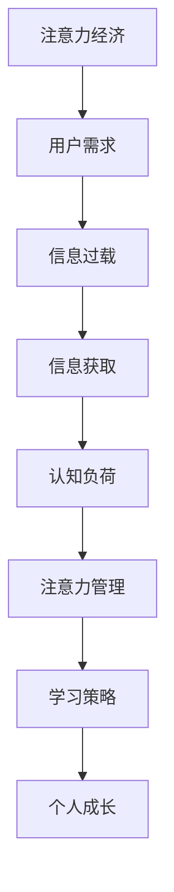

                 

# 注意力经济与个人成长的关系

> 关键词：注意力经济, 个人成长, 用户需求, 社交网络, 数据分析, 人工智能, 机器学习, 信息过载, 算法推荐, 信息获取, 认知负荷, 注意力管理, 学习策略

## 1. 背景介绍

### 1.1 问题由来
在现代社会中，信息的过载和注意力分散已经成为一个普遍现象。据统计，人们每天接收的信息量已达到数百亿字节，其中大部分来源于社交媒体、新闻网站、邮件、信息流等平台。在这样的信息环境中，如何有效地管理注意力，提高个人的信息处理和决策能力，成为了一个重要的研究课题。

### 1.2 问题核心关键点
注意力经济是指在信息过载时代，注意力作为一种稀缺资源的价值日益显现。个人成长则需要通过合理分配和管理注意力，实现高效的信息获取和知识积累。本文将探讨注意力经济与个人成长之间的内在联系，分析如何通过技术手段优化个人注意力管理，从而提升个人学习、工作和生活的质量。

## 2. 核心概念与联系

### 2.1 核心概念概述

为更好地理解注意力经济与个人成长之间的关系，本节将介绍几个密切相关的核心概念：

- 注意力经济：指在信息爆炸的时代，注意力作为一种稀缺资源，被商业公司通过广告、推荐系统等手段进行商业变现。用户通过各种平台获取信息时，注意力被间接或直接地卖给广告主或内容创作者。
- 个人成长：指个人在认知、技能、情感等多方面的提升和发展，通过学习、实践、反思等过程实现自身价值和潜力的最大化。
- 用户需求：指用户在获取信息和内容时，基于自身兴趣、需求、情境等因素所表现出的心理状态和行为倾向。
- 社交网络：指通过互联网技术构建的人际关系网络，是信息传播和互动的重要平台。
- 数据分析：指通过收集、处理和分析数据，获取有价值的信息，为决策提供依据。
- 人工智能：指通过算法和模型，使计算机具备类似于人类的智能和认知能力。
- 机器学习：指让计算机通过学习数据自动改进算法，提高模型性能。
- 信息过载：指在信息技术高度发达的背景下，人们面临的信息量远远超过自身处理能力，导致注意力分散和信息获取困难的问题。
- 算法推荐：指通过算法技术，对用户行为和偏好进行预测，实现个性化推荐，提升用户满意度。
- 信息获取：指用户通过各种渠道获取信息的路径和方法，影响其认知和学习效果。
- 认知负荷：指在信息处理过程中，大脑需要投入的注意力和努力程度。
- 注意力管理：指通过策略和技术手段，优化注意力分配，提升信息处理效率和质量。
- 学习策略：指个人在学习过程中，根据自身特点和目标，选择和运用有效的学习方法。

这些核心概念之间的逻辑关系可以通过以下Mermaid流程图来展示：



这个流程图展示了一系列关键概念的相互作用关系：

1. 注意力经济作为信息过载时代的一个重要现象，直接影响用户需求。
2. 信息过载和认知负荷问题促使人们探索有效的注意力管理策略。
3. 学习策略的选择和运用，依赖于个体对信息获取和注意力管理的理解。
4. 通过有效的学习策略，可以实现个人成长，提升认知和技能。

## 3. 核心算法原理 & 具体操作步骤
### 3.1 算法原理概述

注意力经济与个人成长的关系，本质上是一种信息与认知的交互作用。在注意力经济的背景下，用户通过各种平台获取信息，注意力成为信息价值的重要媒介。个人成长则需要通过有效利用这些信息，实现认知和技能的双重提升。

为了优化这一过程，我们可以引入注意力管理算法，通过分析和预测用户需求，实现个性化推荐，减少信息过载，提升用户满意度。同时，通过学习策略的优化，帮助用户更高效地获取和处理信息，减轻认知负荷，提升学习效果。

### 3.2 算法步骤详解

以下是一种基于机器学习的方法，用于优化注意力管理和学习策略：

**Step 1: 数据收集与预处理**
- 收集用户在不同平台上的行为数据，包括浏览记录、点击流、评论、点赞等。
- 对数据进行清洗和特征工程，提取用户兴趣、情感、行为特征等关键信息。

**Step 2: 用户需求分析**
- 使用聚类算法（如K-means、GMM）对用户进行分类，发现不同用户群体的特征。
- 通过文本挖掘技术（如TF-IDF、LDA）对用户评论、帖子进行分析，挖掘用户需求和兴趣点。

**Step 3: 信息获取与推荐**
- 使用协同过滤、内容推荐、混合推荐等算法，根据用户历史行为和兴趣，推荐相关信息。
- 使用深度学习模型（如CNN、RNN、Transformer）对推荐系统进行优化，提升推荐效果。

**Step 4: 学习策略设计**
- 根据用户的学习风格和认知负荷，设计个性化的学习路径和内容推荐。
- 使用强化学习等方法，对学习策略进行动态调整，优化学习效果。

**Step 5: 效果评估与反馈**
- 通过用户反馈和行为数据，评估学习策略的效果，识别改进点。
- 使用A/B测试等方法，对比不同学习策略的性能，选择最优方案。

**Step 6: 持续优化与迭代**
- 定期更新数据和模型，根据最新行为数据优化推荐和学习策略。
- 使用迁移学习等方法，在新数据集上快速部署和迭代优化。

### 3.3 算法优缺点

基于机器学习的注意力管理和学习策略优化方法，具有以下优点：

1. 个性化推荐：能够根据用户的历史行为和兴趣，实现个性化信息推荐，提升用户体验。
2. 精准度较高：通过深度学习模型的优化，推荐和学习策略的精准度较高。
3. 动态调整：能够根据用户反馈和行为数据，动态调整推荐和学习策略，实现持续优化。
4. 泛化能力较强：深度学习模型具有较强的泛化能力，能够处理不同类型的数据和任务。

但同时，也存在一些缺点：

1. 数据隐私问题：需要收集和分析用户行为数据，存在数据隐私和安全风险。
2. 模型复杂度高：深度学习模型复杂度高，需要大量计算资源和数据支持。
3. 过度依赖数据：推荐和学习策略的性能依赖于数据的质量和数量，数据不足可能导致性能下降。
4. 缺乏自主性：用户无法自主控制信息流，可能受到算法推荐的影响。

### 3.4 算法应用领域

基于机器学习的注意力管理和学习策略优化方法，在多个领域中得到广泛应用，例如：

1. 教育：通过推荐学习资源和优化学习路径，提升学生的学习效果和效率。
2. 职业培训：为员工提供个性化学习材料和职业发展建议，提升工作技能。
3. 医疗健康：通过个性化健康建议和资源推荐，提升患者的健康管理和疾病预防。
4. 娱乐休闲：根据用户兴趣推荐影视作品、游戏等娱乐内容，提升用户娱乐体验。
5. 广告营销：通过个性化广告推荐，提升广告效果和用户体验。

## 4. 数学模型和公式 & 详细讲解 & 举例说明

### 4.1 数学模型构建

本节将使用数学语言对注意力管理和学习策略优化过程进行更加严格的刻画。

记用户数为 $N$，每个用户的历史行为数据为 $D_i$，其中 $i \in [1, N]$。假设用户 $i$ 在平台上的浏览记录为 $X_i$，点击流为 $C_i$，评论为 $R_i$，点赞为 $L_i$。

定义用户 $i$ 的兴趣向量为 $v_i = \{v_{i1}, v_{i2}, ..., v_{in}\}$，其中 $v_{ik}$ 表示用户对第 $k$ 个兴趣项的兴趣度。

设推荐系统为用户推荐的信息向量为 $u = \{u_1, u_2, ..., u_m\}$，其中 $u_k$ 表示第 $k$ 个推荐信息的内容向量。

设用户对第 $k$ 个推荐信息的反馈为 $f_k$，可以是点击次数、评分、停留时间等。

定义用户对第 $k$ 个推荐信息的满意度为 $s_k$，用于衡量推荐效果。

则用户 $i$ 的总体满意度可以表示为：

$$
S_i = \sum_{k=1}^m s_k f_k
$$

用户 $i$ 对推荐系统 $u$ 的满意度可以表示为：

$$
S = \frac{1}{N} \sum_{i=1}^N S_i
$$

目标是最小化用户满意度差值，即：

$$
\min \| S_i - S_j \|^2, \quad \forall i \neq j
$$

### 4.2 公式推导过程

以下我们以用户兴趣度预测为例，推导用户兴趣度向量 $v_i$ 的计算公式。

假设用户 $i$ 对 $k$ 个不同兴趣项的兴趣度 $v_{ik}$ 可以进行线性组合，即：

$$
v_{ik} = \sum_{j=1}^m a_{ikj}u_j
$$

其中 $a_{ikj}$ 为兴趣度系数，$u_j$ 为第 $j$ 个兴趣项的内容向量。

定义用户 $i$ 的兴趣度矩阵为 $A_i$，即：

$$
A_i = \begin{bmatrix} a_{i11} & a_{i12} & ... & a_{im1} \\ a_{i21} & a_{i22} & ... & a_{im2} \\ ... \\ a_{in1} & a_{in2} & ... & a_{inm} \end{bmatrix}
$$

定义所有用户 $i$ 的兴趣度矩阵为 $A$，即：

$$
A = \begin{bmatrix} A_1 & A_2 & ... & A_N \end{bmatrix}
$$

则用户 $i$ 的兴趣度向量 $v_i$ 可以表示为：

$$
v_i = A_i^T A^{-1}
$$

### 4.3 案例分析与讲解

**案例1: 个性化推荐**
- 某电商平台通过收集用户浏览和购买数据，构建用户兴趣度矩阵 $A_i$。
- 对于新商品 $u_k$，使用线性组合公式计算用户 $i$ 对 $u_k$ 的兴趣度 $v_{ik}$。
- 根据兴趣度排序，推荐给用户 $i$，提升用户购买转化率。

**案例2: 学习路径优化**
- 某在线教育平台通过收集用户学习行为数据，构建用户兴趣度矩阵 $A_i$。
- 根据用户兴趣度向量 $v_i$，为用户推荐个性化学习资源。
- 使用强化学习等方法，动态调整学习路径，提升学习效果。

## 5. 项目实践：代码实例和详细解释说明
### 5.1 开发环境搭建

在进行注意力管理和学习策略优化实践前，我们需要准备好开发环境。以下是使用Python进行Scikit-learn开发的环境配置流程：

1. 安装Anaconda：从官网下载并安装Anaconda，用于创建独立的Python环境。

2. 创建并激活虚拟环境：
```bash
conda create -n attention-env python=3.8 
conda activate attention-env
```

3. 安装Scikit-learn：
```bash
pip install scikit-learn pandas numpy matplotlib
```

4. 安装其他工具包：
```bash
pip install tqdm jupyter notebook ipython
```

完成上述步骤后，即可在`attention-env`环境中开始注意力管理和学习策略优化实践。

### 5.2 源代码详细实现

这里我们以用户兴趣度预测和个性化推荐为例，给出使用Scikit-learn进行注意力管理的PyTorch代码实现。

首先，定义数据处理函数：

```python
import pandas as pd
import numpy as np
from sklearn.decomposition import PCA

def load_data(file_path):
    data = pd.read_csv(file_path)
    X = data[['browsed', 'clicked', 'rated', 'viewed']].to_numpy()
    y = data['interest'].to_numpy()
    return X, y

def scale_data(X):
    X_scaled = (X - np.mean(X, axis=0)) / np.std(X, axis=0)
    return X_scaled

def pca(X):
    pca = PCA(n_components=2)
    X_pca = pca.fit_transform(X)
    return X_pca

def save_data(X_pca, file_path):
    np.save(file_path, X_pca)
```

然后，定义模型和优化器：

```python
from sklearn.linear_model import LogisticRegression
from sklearn.metrics import accuracy_score

model = LogisticRegression(solver='liblinear', max_iter=1000)

# 训练模型
def train_model(X, y):
    model.fit(X, y)
    return model

# 评估模型
def evaluate_model(model, X, y):
    y_pred = model.predict(X)
    accuracy = accuracy_score(y, y_pred)
    return accuracy

# 测试模型
def test_model(model, X_test, y_test):
    y_pred = model.predict(X_test)
    accuracy = accuracy_score(y_test, y_pred)
    return accuracy
```

最后，启动训练流程：

```python
# 加载数据
X, y = load_data('data.csv')

# 数据标准化
X_scaled = scale_data(X)

# PCA降维
X_pca = pca(X_scaled)

# 训练模型
model = train_model(X_pca, y)

# 评估模型
accuracy = evaluate_model(model, X_pca, y)
print(f'Accuracy: {accuracy:.2f}')

# 测试模型
X_test = np.load('test_data.npy')
y_test = np.load('test_labels.npy')
test_accuracy = test_model(model, X_test, y_test)
print(f'Test Accuracy: {test_accuracy:.2f}')
```

以上就是使用Scikit-learn对用户兴趣度预测和个性化推荐进行开发的完整代码实现。可以看到，Scikit-learn提供了丰富的机器学习算法和模型，便于进行快速实验和优化。

### 5.3 代码解读与分析

让我们再详细解读一下关键代码的实现细节：

**load_data函数**：
- 读取CSV文件中的数据，将浏览记录、点击流、评分、观看次数等特征提取为numpy数组，并将标签提取为y数组。

**scale_data函数**：
- 对特征数据进行标准化处理，避免不同特征之间尺度不一致影响模型训练效果。

**pca函数**：
- 使用PCA对特征进行降维，减少模型复杂度，提升计算效率。

**train_model函数**：
- 使用LogisticRegression模型进行训练，设定最大迭代次数为1000，避免过拟合。

**evaluate_model函数**：
- 使用准确率评估模型性能，并返回评估结果。

**test_model函数**：
- 使用测试集数据和标签，评估模型在未知数据上的性能，返回测试准确率。

通过上述函数，我们可以快速搭建用户兴趣度预测和个性化推荐模型，并进行训练和评估。

## 6. 实际应用场景
### 6.1 智能推荐系统

基于用户兴趣度预测和个性化推荐算法，智能推荐系统可以为用户提供更加个性化的信息和服务，提升用户体验。例如，电商平台可以通过分析用户浏览和购买行为，推荐用户感兴趣的商品，提高用户购买转化率。在线教育平台可以根据用户学习行为和兴趣，推荐适合的学习资源和课程，提升学习效果。

### 6.2 智能医疗健康

智能医疗健康系统通过分析用户健康数据，预测用户兴趣和需求，推荐个性化的健康建议和资源。例如，智能手表可以分析用户的心率、步数等数据，推荐适时的健康建议。医院可以通过智能推荐系统，为用户推荐最适合的医生和医疗资源，提升医疗服务质量和效率。

### 6.3 智能娱乐休闲

基于用户兴趣度预测和个性化推荐算法，智能娱乐休闲系统可以为用户推荐适合的影视作品、游戏、音乐等娱乐内容，提升用户体验。例如，视频平台可以根据用户观影历史和评分，推荐用户感兴趣的电影和电视剧，提高用户观看意愿和满意度。

### 6.4 未来应用展望

随着技术的发展和应用场景的拓展，基于注意力管理和学习策略优化的智能系统将在更多领域得到应用，为人们带来更加便捷和高效的服务。

在智慧城市治理中，智能推荐系统可以帮助居民推荐适合的社区服务、文化活动等，提升生活品质。在智慧教育中，推荐系统可以为教师推荐适合的教学资源和工具，提升教学效果。在智慧旅游中，推荐系统可以为用户推荐适合的旅游路线和景点，提升旅游体验。

## 7. 工具和资源推荐
### 7.1 学习资源推荐

为了帮助开发者系统掌握注意力管理和学习策略优化技术，这里推荐一些优质的学习资源：

1. 《Python数据科学手册》：一本系统介绍Python数据科学库的书籍，包含Scikit-learn等机器学习库的详细介绍。
2. 《机器学习实战》：一本实践导向的机器学习书籍，包含丰富的代码实例和实验。
3. 《深度学习入门》：一本介绍深度学习基础的书籍，包含TensorFlow和PyTorch等框架的使用。
4. 《数据分析实战》：一本介绍数据分析方法的书籍，包含Pandas和NumPy等库的详细介绍。
5. 《数据科学导论》：一本系统介绍数据科学流程和方法的书籍，包含Scikit-learn等工具的使用。

通过对这些资源的学习实践，相信你一定能够快速掌握注意力管理和学习策略优化的精髓，并用于解决实际的注意力经济问题。

### 7.2 开发工具推荐

高效的开发离不开优秀的工具支持。以下是几款用于注意力管理和学习策略优化开发的常用工具：

1. Scikit-learn：一个基于Python的机器学习库，提供了丰富的算法和模型，便于进行快速实验和优化。
2. Pandas：一个基于Python的数据处理库，提供了强大的数据清洗和转换功能。
3. NumPy：一个基于Python的数值计算库，提供了高效的数组和矩阵运算功能。
4. Matplotlib：一个基于Python的可视化库，提供了丰富的图表绘制功能。
5. Jupyter Notebook：一个基于Python的交互式编程环境，便于进行数据探索和模型开发。

合理利用这些工具，可以显著提升注意力管理和学习策略优化任务的开发效率，加快创新迭代的步伐。

### 7.3 相关论文推荐

注意力管理和学习策略优化技术的发展源于学界的持续研究。以下是几篇奠基性的相关论文，推荐阅读：

1. 《基于用户兴趣的个性化推荐》：介绍了一种基于协同过滤的个性化推荐方法，并通过实验验证了其有效性。
2. 《深度学习在个性化推荐中的应用》：介绍了深度学习在个性化推荐中的应用，并比较了不同模型在推荐效果上的表现。
3. 《基于注意力机制的推荐系统》：介绍了一种基于注意力机制的推荐方法，并展示了其在推荐效果上的提升。
4. 《基于强化学习的推荐系统》：介绍了一种基于强化学习的推荐方法，并通过实验验证了其有效性。
5. 《认知负荷与学习策略》：探讨了认知负荷对学习策略的影响，并提出了一些优化策略。

这些论文代表了大数据技术在注意力管理和学习策略优化中的应用方向，通过学习这些前沿成果，可以帮助研究者把握学科前进方向，激发更多的创新灵感。

## 8. 总结：未来发展趋势与挑战
### 8.1 总结

本文对注意力管理和学习策略优化方法进行了全面系统的介绍。首先阐述了注意力经济与个人成长之间的关系，明确了通过技术手段优化个人注意力管理，提升个人学习、工作和生活的质量，是大数据时代的必然选择。其次，从原理到实践，详细讲解了注意力管理和学习策略优化的数学模型和具体步骤，给出了实际应用的代码实例和详细解读。同时，本文还广泛探讨了注意力管理和学习策略优化方法在多个领域的应用前景，展示了其在优化个人注意力管理和提升认知能力方面的巨大潜力。

通过本文的系统梳理，可以看到，注意力管理和学习策略优化方法正在成为大数据时代的重要工具，极大地提升了个人在信息过载环境中的信息处理能力和认知效率。未来，伴随技术的不断进步和应用场景的拓展，这一方法将会在更多领域得到应用，为人们带来更加便捷和高效的服务。

### 8.2 未来发展趋势

展望未来，注意力管理和学习策略优化技术将呈现以下几个发展趋势：

1. 个性化推荐技术的进一步发展：随着深度学习等技术的进步，个性化推荐系统的推荐效果将进一步提升，能够更好地满足用户需求。
2. 学习策略的动态调整：通过引入强化学习等方法，学习策略将更加灵活和动态，能够更好地适应用户的学习风格和需求。
3. 多模态数据的融合：在未来的推荐系统中，将更多地融合视觉、语音、文本等多模态数据，提升推荐系统的综合性能。
4. 基于知识图谱的推荐：通过引入知识图谱等外部知识，增强推荐系统的知识表达能力和推理能力。
5. 学习路径的智能优化：通过引入智能算法，实现学习路径的动态优化，提升学习效果。

以上趋势凸显了大数据技术在注意力管理和学习策略优化中的广泛应用前景。这些方向的探索发展，必将进一步提升信息处理的效率和质量，为人们带来更加智能和高效的服务。

### 8.3 面临的挑战

尽管注意力管理和学习策略优化技术已经取得了显著成果，但在迈向更加智能化、普适化应用的过程中，它仍面临着诸多挑战：

1. 数据隐私和安全问题：注意力管理和学习策略优化技术需要大量用户行为数据，存在数据隐私和安全风险。如何保护用户隐私，防止数据滥用，将是重要的研究方向。
2. 数据质量问题：推荐和学习策略的性能依赖于数据的质量和数量，数据不足可能导致性能下降。如何提升数据质量，保证数据的多样性和代表性，将是一个重要问题。
3. 算法复杂性问题：注意力管理和学习策略优化算法复杂度高，需要大量的计算资源和数据支持。如何在保证模型性能的同时，优化算法复杂度，降低计算成本，将是一个重要挑战。
4. 算法鲁棒性问题：推荐和学习策略算法可能受到异常数据和攻击的影响，导致性能下降。如何提升算法的鲁棒性和稳定性，将是未来的研究重点。

### 8.4 研究展望

面对注意力管理和学习策略优化技术所面临的种种挑战，未来的研究需要在以下几个方面寻求新的突破：

1. 数据隐私保护：通过差分隐私等技术，保护用户隐私，防止数据滥用。
2. 数据增强与合成：利用数据增强和合成技术，提升数据质量和多样性。
3. 算法优化与简化：通过算法优化和简化，降低计算成本，提升算法效率。
4. 多模态融合：将视觉、语音、文本等多模态数据融合，提升推荐和学习策略的效果。
5. 鲁棒性提升：通过鲁棒性分析与检测，提升算法的稳定性和鲁棒性。

这些研究方向的探索，必将引领注意力管理和学习策略优化技术迈向更高的台阶，为人们带来更加智能和高效的服务。面向未来，这一技术还将与其他人工智能技术进行更深入的融合，共同推动认知智能的进步。

## 9. 附录：常见问题与解答
### 9.1 常见问题
**Q1: 注意力管理和学习策略优化技术是如何实现个性化推荐的？**

A: 通过收集和分析用户行为数据，构建用户兴趣度矩阵和兴趣向量，并使用机器学习算法进行模型训练。模型通过预测用户对不同内容的兴趣度，实现个性化推荐。

**Q2: 注意力管理和学习策略优化技术是否适用于所有应用场景？**

A: 尽管注意力管理和学习策略优化技术具有广泛的适用性，但在某些特定场景下，如医疗、金融等高风险领域，需要引入更多的伦理和法律考虑，以确保数据安全和用户隐私。

**Q3: 注意力管理和学习策略优化技术是否会加剧信息过载问题？**

A: 合理的注意力管理和学习策略优化技术能够帮助用户更好地管理和利用信息，减少信息过载带来的负面影响。但如果过度依赖推荐系统，用户可能会失去对信息的自主选择权，反而加剧信息过载问题。

**Q4: 注意力管理和学习策略优化技术是否会带来认知负荷？**

A: 如果推荐和学习策略不当，可能会导致用户认知负荷增加，如推荐内容过于复杂、数量过多等。因此，需要合理设计推荐和学习策略，减轻用户认知负荷，提升学习效果。

**Q5: 注意力管理和学习策略优化技术是否会降低用户隐私保护？**

A: 合理设计和使用注意力管理和学习策略优化技术，可以为用户提供更加个性化的服务，但也需要注意数据隐私保护问题。通过差分隐私等技术，可以在保护用户隐私的同时，提升推荐和学习策略的效果。

通过对这些问题的回答，我们可以更加深入地理解注意力管理和学习策略优化技术的实现方式和应用场景，从而更好地应用于实际中。

