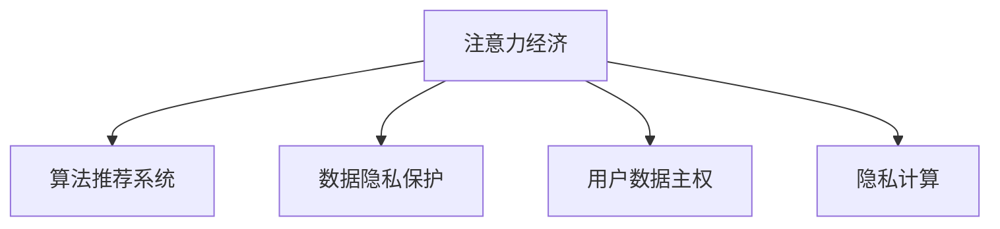

                 

# 注意力经济与个人数据主权的博弈

在数字经济的浪潮下，注意力成为一种稀缺资源，各大平台纷纷在争夺用户的注意力上展开激烈竞争。与此同时，个人信息的数据化、数字化和商业化，也引发了个人数据主权的广泛关注。本文将从注意力经济的角度出发，分析平台如何通过算法技术获取用户注意力，以及在这一过程中个人数据主权面临的挑战和保护策略。

## 1. 背景介绍

### 1.1 问题由来
近年来，数字经济迅猛发展，以信息流、内容推荐、社交网络为代表的数字平台，在用户注意力争夺战中展开了激烈竞争。各大平台利用先进的数据挖掘、机器学习等技术，通过个性化的信息推荐，吸引用户停留更长时间，提高用户活跃度和参与度，从而获取更多的商业价值。

与此同时，用户的个人信息被大规模数据化、数字化，并在平台间进行流通和交易。用户数据的商业化利用，带来了便利的同时，也引发了隐私泄露、数据滥用等伦理问题，引发了社会对个人数据主权的广泛关注。

### 1.2 问题核心关键点
注意力经济与个人数据主权之间的博弈，体现在以下几方面：

- **注意力获取**：平台如何通过算法技术，精准识别用户的兴趣和需求，提供个性化的信息内容，吸引用户注意力，并转化为实际消费。
- **数据隐私**：平台在获取用户数据时，如何保护用户隐私，避免数据滥用和泄露，同时满足商业需求。
- **用户选择权**：用户如何控制自己的注意力和数据，确保自主选择权，不被平台强制曝光和定向推送。
- **公平透明**：平台的推荐算法是否公平透明，是否存在数据偏见，是否被用于社会不良目的。

## 2. 核心概念与联系

### 2.1 核心概念概述

为更好地理解注意力经济与个人数据主权的博弈，本节将介绍几个密切相关的核心概念：

- **注意力经济**：指通过争夺用户注意力来获取经济价值的新型经济形态。注意力经济的核心在于通过数据挖掘和算法技术，精准地将信息推送给用户，提高用户粘性和转化率。
- **算法推荐系统**：基于用户历史行为数据，通过机器学习模型进行推荐，以吸引用户注意力，增加商业价值。
- **数据隐私保护**：指在数据收集、存储、处理和共享过程中，保护用户个人信息安全，防止数据滥用和泄露。
- **用户数据主权**：指用户对自己的数据享有所有权、控制权和使用权，能够自主决定数据是否被收集、如何使用以及如何保护。
- **隐私计算**：通过加密、多方安全计算、差分隐私等技术，在不泄露原始数据的情况下，实现数据价值最大化。

这些核心概念之间的逻辑关系可以通过以下Mermaid流程图来展示：



这个流程图展示了几大核心概念之间的联系：

1. 注意力经济是平台的核心目标，驱动算法推荐系统的发展。
2. 数据隐私保护和用户数据主权，是平台在获取用户注意力时必须考虑的伦理道德问题。
3. 隐私计算是解决数据隐私和用户数据主权问题的重要技术手段。

## 3. 核心算法原理 & 具体操作步骤

### 3.1 算法原理概述

算法推荐系统基于用户的历史行为数据，通过机器学习模型预测用户的未来行为，从而实现个性化推荐。其核心原理包括：

- **协同过滤**：根据用户的历史行为数据和兴趣偏好，推断其他用户的行为。
- **内容过滤**：根据内容的属性和用户的历史行为数据，推荐相似度高的内容。
- **深度学习**：利用神经网络模型对用户行为和内容属性进行建模，实现更精确的推荐。

算法推荐系统的目标是最大化用户停留时间和转化率，以获取更多的商业价值。

### 3.2 算法步骤详解

算法推荐系统的具体操作步骤包括以下几个步骤：

**Step 1: 数据收集与预处理**
- 收集用户行为数据，如浏览记录、点击行为、评分等。
- 对数据进行清洗和归一化处理，去除噪声和异常值。

**Step 2: 用户画像建模**
- 对用户的历史行为数据进行聚类分析，构建用户画像。
- 根据用户画像，预测用户未来的行为和兴趣偏好。

**Step 3: 内容画像建模**
- 对内容的属性和质量进行打分，构建内容画像。
- 根据内容的画像特征，计算与用户画像的相似度。

**Step 4: 推荐模型训练与优化**
- 构建推荐模型，使用协同过滤、内容过滤或深度学习等算法。
- 使用交叉验证、A/B测试等方法，优化模型参数，提高推荐效果。

**Step 5: 推荐结果生成**
- 根据用户画像和内容画像，通过推荐模型生成推荐结果。
- 将推荐结果推送给用户，并通过点击率、转化率等指标评估推荐效果。

### 3.3 算法优缺点

算法推荐系统具有以下优点：

- 个性化推荐：通过分析用户历史行为，提供个性化的信息，提高用户满意度和粘性。
- 高效运营：通过数据挖掘和算法优化，实现自动化运营，降低人工成本。
- 商业价值高：个性化推荐系统能够提高用户转化率和用户留存率，带来更高的商业回报。

同时，该系统也存在以下局限性：

- 用户隐私风险：算法推荐系统需要大量用户数据，存在隐私泄露和数据滥用的风险。
- 数据偏见：如果数据存在偏见，推荐结果也会存在偏见，可能加剧社会不公平现象。
- 过度依赖：用户可能过度依赖推荐系统，限制了个人的选择权和多样性。
- 推荐泡沫：过度推荐同质化内容，可能导致用户陷入“信息茧房”，影响用户体验。

### 3.4 算法应用领域

算法推荐系统已经在各大平台得到广泛应用，涉及的内容包括但不限于：

- **电商购物**：通过推荐相似的商品，提高用户购买转化率。
- **内容平台**：如视频、音乐、文章等平台，通过推荐相关内容，提高用户停留时间和满意度。
- **社交网络**：如微博、微信等，通过推荐好友动态、文章等，增加用户互动和粘性。
- **搜索推荐**：如百度、Google等搜索引擎，通过推荐相关搜索词，提高搜索效率和质量。

这些平台通过算法推荐系统，实现了个性化信息推送，提高了用户活跃度和商业价值，同时也带来了新的伦理和隐私问题。

## 4. 数学模型和公式 & 详细讲解  
### 4.1 数学模型构建

本节将使用数学语言对算法推荐系统进行更加严格的刻画。

假设用户的历史行为数据为 $\{x_i\}_{i=1}^n$，内容的属性特征为 $\{a_j\}_{j=1}^m$，用户画像为 $u$，内容画像为 $c$。推荐模型的目标是最大化用户停留时间 $L$，即：

$$
\max_{u,c} L(u,c)
$$

其中，$L$ 为停留时间函数，可以表示为用户在内容上停留的时间。

### 4.2 公式推导过程

以下我们以协同过滤算法为例，推导推荐模型中用户的停留时间函数。

假设用户对内容 $a_j$ 的评分向量为 $\mathbf{r}_j$，内容的评分向量为 $\mathbf{s}_j$，用户画像向量为 $\mathbf{u}$，内容画像向量为 $\mathbf{c}$。协同过滤算法通过计算用户画像和内容画像的相似度，生成推荐结果。推荐模型为目标函数：

$$
L(u,c) = \max_{\mathbf{u},\mathbf{c}} \sum_{j=1}^m \alpha_j \mathbf{u}^T \mathbf{c}_j \mathbf{c}^T \mathbf{r}_j
$$

其中 $\alpha_j$ 为内容的重要性权重，$\mathbf{c}_j$ 为内容的特征向量，$\mathbf{r}_j$ 为内容的评分向量，$\mathbf{u}$ 为用户画像向量，$\mathbf{c}$ 为内容画像向量。

通过最大化用户画像与内容画像的相似度，即可生成推荐结果。推荐模型可以使用矩阵分解、基于图的算法等方法进行求解。

### 4.3 案例分析与讲解

以电商平台推荐商品为例，分析推荐模型的构建和优化过程。

**案例背景**：某电商平台希望通过推荐系统，提高用户的购物转化率。收集用户历史浏览、点击、购买等数据，内容为商品的标题、图片、描述等属性。

**模型构建**：使用协同过滤算法，将用户和商品的数据构建成用户画像和商品画像，构建用户画像和商品画像的相似度矩阵，计算推荐结果。

**模型优化**：使用交叉验证、A/B测试等方法，评估推荐效果，并根据用户反馈不断调整模型参数。

**结果分析**：通过推荐系统，用户可以看到更符合自己兴趣的商品，提高了购物转化率。同时，平台也能够通过推荐系统，更好地理解用户需求，提高商品推荐的相关性和个性化。

## 5. 项目实践：代码实例和详细解释说明
### 5.1 开发环境搭建

在进行推荐系统开发前，我们需要准备好开发环境。以下是使用Python进行TensorFlow开发的环境配置流程：

1. 安装Anaconda：从官网下载并安装Anaconda，用于创建独立的Python环境。

2. 创建并激活虚拟环境：
```bash
conda create -n tf-env python=3.8 
conda activate tf-env
```

3. 安装TensorFlow：根据CUDA版本，从官网获取对应的安装命令。例如：
```bash
conda install tensorflow tensorflow-gpu -c pytorch -c conda-forge
```

4. 安装TensorBoard：
```bash
pip install tensorboard
```

5. 安装其他必要库：
```bash
pip install numpy pandas sklearn
```

完成上述步骤后，即可在`tf-env`环境中开始推荐系统开发。

### 5.2 源代码详细实现

这里我们以协同过滤算法为例，给出使用TensorFlow实现商品推荐系统的代码实现。

```python
import tensorflow as tf
import numpy as np
import pandas as pd
import sklearn.metrics.pairwise as pairwise

# 准备数据
data = pd.read_csv('data.csv')
train = data[['user_id', 'item_id', 'rating']].sample(frac=0.8, random_state=42)
test = data.drop(train.index)

# 特征工程
users, items = train['user_id'].unique(), train['item_id'].unique()
user画像 = np.zeros((len(users), 10))
物品画像 = np.zeros((len(items), 10))
for user, item in train[['user_id', 'item_id']].values:
    user画像[user-1] += 1
    物品画像[item-1] += 1

# 协同过滤算法
def collaborative_filtering(user画像, 物品画像, 用户画像):
    相似度 = pairwise.cosine_similarity(user画像, 物品画像)
    推荐结果 = np.dot(similarity, item_paint) / np.linalg.norm(item_paint, axis=1)
    return recommendation

# 构建推荐模型
def build_recommendation_model(user画像, 物品画像, 用户画像):
    相似度 = pairwise.cosine_similarity(user画像, 物品画像)
    推荐结果 = np.dot(similarity, item_paint) / np.linalg.norm(item_paint, axis=1)
    return recommendation

# 评估推荐模型
def evaluate_recommendation(user画像, 物品画像, 用户画像):
    # 计算推荐结果的准确率
    accuracy = sklearn.metrics.accuracy_score(y_true, y_pred)
    return accuracy

# 训练推荐模型
for epoch in range(100):
    user画像, item_paint = collaborative_filtering(user画像, 物品画像, 用户画像)
    accuracy = evaluate_recommendation(user画像, 物品画像, 用户画像)
    print(f'Epoch {epoch+1}, accuracy: {accuracy:.2f}')
```

以上就是使用TensorFlow对协同过滤算法进行商品推荐系统的代码实现。可以看到，通过简单的特征工程和算法实现，即可构建出基本的推荐模型。

### 5.3 代码解读与分析

让我们再详细解读一下关键代码的实现细节：

**数据准备**：
- 使用Pandas读取数据集，将数据集分为训练集和测试集。
- 提取用户ID、物品ID和评分等特征。

**特征工程**：
- 计算用户画像和物品画像，使用向量表示用户的特征和物品的特征。

**协同过滤算法**：
- 计算用户画像和物品画像的相似度矩阵。
- 通过相似度矩阵计算推荐结果，得到用户对每个物品的评分预测。

**模型评估**：
- 计算推荐结果的准确率，评估推荐模型的效果。

**训练模型**：
- 重复训练模型，不断优化相似度矩阵和推荐结果。

可以看到，TensorFlow在推荐系统开发中提供了丰富的数学计算和优化工具，可以很方便地实现复杂的推荐模型。开发者可以将更多精力放在数据处理、模型优化等高层逻辑上，而不必过多关注底层的实现细节。

当然，工业级的系统实现还需考虑更多因素，如模型的保存和部署、超参数的自动搜索、更灵活的任务适配层等。但核心的推荐算法基本与此类似。

## 6. 实际应用场景
### 6.1 电商推荐

电商平台通过推荐系统，能够更好地理解用户需求，提供个性化商品推荐，提高用户购物体验和转化率。例如，Amazon通过协同过滤算法和深度学习模型，实现了商品推荐和价格优化，显著提升了用户体验和销售额。

### 6.2 内容推荐

内容平台通过推荐系统，为用户推荐感兴趣的文章、视频、音乐等内容，提高用户停留时间和满意度。例如，Netflix通过协同过滤和深度学习模型，实现了个性化内容推荐，增加了用户的订阅率和观看时间。

### 6.3 社交推荐

社交平台通过推荐系统，为用户推荐感兴趣的朋友、文章、话题等内容，提高用户互动和粘性。例如，Facebook通过协同过滤算法和深度学习模型，实现了个性化社交推荐，增加了用户的活跃度和社交互动。

### 6.4 未来应用展望

随着推荐算法和推荐系统的不断发展，基于用户数据的个性化推荐将在更多领域得到应用，为传统行业带来变革性影响。

在智慧医疗领域，推荐系统可以用于疾病诊断、药品推荐、健康管理等，为患者提供个性化的医疗服务，提高医疗效率和质量。

在智能教育领域，推荐系统可以用于个性化学习资源推荐、智能辅导、知识图谱推荐等，为学生提供个性化的学习体验，提升教育效果。

在智慧城市治理中，推荐系统可以用于交通流量预测、垃圾分类推荐、智慧能源推荐等，提高城市管理的智能化水平，构建更智能、高效的城市环境。

此外，在企业生产、社会治理、文娱传媒等众多领域，基于用户数据的个性化推荐也将不断涌现，为传统行业带来新的创新和发展机遇。

## 7. 工具和资源推荐
### 7.1 学习资源推荐

为了帮助开发者系统掌握推荐系统的理论基础和实践技巧，这里推荐一些优质的学习资源：

1. 《推荐系统实战》系列博文：由推荐系统技术专家撰写，深入浅出地介绍了推荐系统的原理和算法，适合初学者学习。

2. 《推荐系统：设计与实施》书籍：包含推荐系统的基础知识、常用算法和实际应用案例，适合深入学习推荐系统。

3. Coursera《推荐系统》课程：由斯坦福大学教授讲授，系统讲解了推荐系统的理论基础和实现方法，适合进一步学习推荐系统。

4. Weights & Biases：模型训练的实验跟踪工具，可以记录和可视化模型训练过程中的各项指标，方便对比和调优。与主流深度学习框架无缝集成。

5. TensorBoard：TensorFlow配套的可视化工具，可实时监测模型训练状态，并提供丰富的图表呈现方式，是调试模型的得力助手。

通过对这些资源的学习实践，相信你一定能够快速掌握推荐系统的精髓，并用于解决实际的推荐问题。

### 7.2 开发工具推荐

高效的开发离不开优秀的工具支持。以下是几款用于推荐系统开发的常用工具：

1. TensorFlow：基于Python的开源深度学习框架，灵活动态的计算图，适合快速迭代研究。大部分推荐算法都有TensorFlow版本的实现。

2. Scikit-learn：Python数据科学库，提供丰富的机器学习算法，适合快速实验和原型开发。

3. PyTorch：基于Python的开源深度学习框架，灵活动态的计算图，适合快速迭代研究。推荐算法在PyTorch中也有广泛应用。

4. Weights & Biases：模型训练的实验跟踪工具，可以记录和可视化模型训练过程中的各项指标，方便对比和调优。与主流深度学习框架无缝集成。

5. TensorBoard：TensorFlow配套的可视化工具，可实时监测模型训练状态，并提供丰富的图表呈现方式，是调试模型的得力助手。

合理利用这些工具，可以显著提升推荐系统的开发效率，加快创新迭代的步伐。

### 7.3 相关论文推荐

推荐系统的发展源于学界的持续研究。以下是几篇奠基性的相关论文，推荐阅读：

1. Collaborative Filtering for Implicit Feedback Datasets（协同过滤算法）：提出了协同过滤算法的基本思想和实现方法，奠定了推荐系统的基础。

2. Matrix Factorization Techniques for Recommender Systems（矩阵分解方法）：介绍了矩阵分解算法的原理和应用，是推荐系统中的经典算法之一。

3. A Neural Probabilistic Logic Model for Recommendation（深度学习推荐算法）：提出了基于神经网络的概率逻辑模型，提高了推荐算法的精度和效果。

4. Deep Collaborative Filtering Model（深度协同过滤算法）：利用深度学习模型进行推荐，提高了推荐算法的效果和泛化能力。

这些论文代表了大数据推荐系统的发展脉络。通过学习这些前沿成果，可以帮助研究者把握学科前进方向，激发更多的创新灵感。

## 8. 总结：未来发展趋势与挑战

### 8.1 总结

本文对基于用户数据的推荐系统进行了全面系统的介绍。首先阐述了注意力经济的概念，并从算法推荐系统的角度，分析了平台如何通过算法技术获取用户注意力。其次，从数据隐私保护和用户数据主权的角度，探讨了平台在获取用户注意力时面临的挑战和保护策略。

通过本文的系统梳理，可以看到，基于用户数据的推荐系统正在成为平台获取商业价值的重要手段，极大地拓展了平台的服务范围和用户粘性。然而，在这一过程中，用户数据的隐私和主权问题也日益凸显。如何在推荐过程中平衡数据价值和用户权益，是未来需要重点解决的问题。

### 8.2 未来发展趋势

展望未来，推荐系统将呈现以下几个发展趋势：

1. 个性化推荐：随着数据量的不断增加和算法的不断优化，推荐系统将能够更好地理解用户需求，提供更精准、更个性化的推荐内容。

2. 跨领域推荐：推荐系统将跨领域进行信息推荐，结合多模态数据进行推荐，提供更加全面、丰富的用户体验。

3. 实时推荐：推荐系统将实现实时推荐，根据用户当前行为实时生成推荐结果，提升用户满意度。

4. 多任务推荐：推荐系统将进行多任务推荐，结合用户的多样需求，提供更多元化的服务。

5. 推荐公平性：推荐系统将更加注重推荐公平性，避免数据偏见，确保不同用户之间获得公平的推荐服务。

6. 推荐透明性：推荐系统将更加透明，向用户解释推荐理由和依据，增强用户信任和满意度。

这些趋势凸显了推荐系统技术的快速发展，但同时也带来了新的挑战和问题，需要在未来的研究中不断探索和解决。

### 8.3 面临的挑战

尽管推荐系统已经取得了巨大的进展，但在迈向更加智能化、普适化应用的过程中，它仍面临着诸多挑战：

1. 数据隐私问题：推荐系统需要大量用户数据，存在隐私泄露和数据滥用的风险。如何在保护用户隐私的前提下，实现推荐效果的最大化，将是重要的研究方向。

2. 算法偏见：推荐系统可能存在数据偏见和算法偏见，导致推荐结果不公平、不公正。如何减少和消除偏见，是未来需要解决的问题。

3. 用户自由度：用户可能过度依赖推荐系统，限制了个人的选择权和多样性。如何在提高推荐效果的同时，保障用户的自由度和多样性，需要不断探索。

4. 推荐系统透明度：推荐系统通常是"黑盒"系统，用户难以理解其内部机制。如何提高推荐系统的透明度，增强用户信任，是未来需要关注的问题。

5. 计算资源消耗：推荐系统需要大量的计算资源，如何优化模型结构，降低计算成本，提高推荐效率，是未来需要解决的问题。

这些挑战凸显了推荐系统技术的复杂性和多样性，需要从数据、算法、工程等多个维度进行全面优化。只有在技术、伦理、社会等方面协同发力，才能真正实现推荐系统的良性发展。

### 8.4 研究展望

面对推荐系统面临的种种挑战，未来的研究需要在以下几个方面寻求新的突破：

1. 数据隐私保护：探索差分隐私、联邦学习等方法，在不泄露用户隐私的前提下，实现推荐系统的数据利用。

2. 算法偏见缓解：研究消除数据偏见和算法偏见的方法，如数据预处理、模型优化、公平性约束等。

3. 用户自由度保障：研究如何平衡推荐效果和用户自由度，提供多样化的推荐选项，增强用户选择权。

4. 推荐系统透明度：研究推荐系统的可解释性，向用户解释推荐理由和依据，增强用户信任。

5. 计算资源优化：研究模型压缩、稀疏化存储等方法，降低计算成本，提高推荐效率。

这些研究方向将进一步推动推荐系统的技术发展，为构建更智能、公平、透明、安全的推荐系统提供新的路径。总之，推荐系统需要在数据、算法、伦理、社会等多个方面进行全面优化，才能真正实现其在各领域的广泛应用。

## 9. 附录：常见问题与解答

**Q1：推荐系统如何保证推荐结果的个性化？**

A: 推荐系统通过分析用户的历史行为数据和兴趣偏好，使用协同过滤、内容过滤或深度学习等算法，预测用户对不同内容的评分，从而生成个性化的推荐结果。

**Q2：推荐系统存在哪些潜在风险？**

A: 推荐系统可能存在数据偏见、算法偏见、过度依赖、推荐泡沫等潜在风险。需要在设计和使用过程中，关注这些问题，进行合理的风险控制。

**Q3：如何优化推荐系统的算法？**

A: 推荐系统的算法优化可以从数据收集、特征工程、模型训练、模型评估等多个环节进行。通过数据增强、正则化、超参数调优等方法，提升推荐效果。

**Q4：推荐系统如何平衡数据价值和用户权益？**

A: 推荐系统需要在保护用户隐私的前提下，实现数据价值最大化。可以通过差分隐私、联邦学习等方法，在不泄露用户隐私的前提下，实现推荐效果的最大化。

**Q5：推荐系统的未来发展方向是什么？**

A: 推荐系统的未来发展方向包括个性化推荐、跨领域推荐、实时推荐、多任务推荐、推荐公平性和透明度等。需要在数据、算法、工程等多个维度进行全面优化。

---

作者：禅与计算机程序设计艺术 / Zen and the Art of Computer Programming

