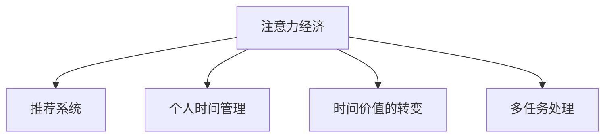

                 

# 注意力经济与个人时间价值观的转变

## 1. 背景介绍

### 1.1 问题由来
在数字化时代的浪潮中，人们的注意力被各种信息所吸引。从社交媒体的即时更新，到电子商务的个性化推荐，再到流媒体平台的内容播放，注意力经济（Attention Economy）正逐渐成为社会的主导经济模式。个人时间的管理，从消费行为到工作学习，也随之发生了深刻的变化。

### 1.2 问题核心关键点
注意力经济的核心在于如何通过吸引和利用个人注意力，创造出经济价值。它依赖于海量数据的收集和分析，利用人工智能等技术手段，通过算法优化推荐系统，精准触达用户的注意力，形成一种新兴的经济活动。个人时间的价值观，即如何分配和使用个人时间，也发生了转变，从单一的活动（如工作、娱乐）到多元的时间利用（如学习、社交、健身等），表现出多样化和个性化的趋势。

## 2. 核心概念与联系

### 2.1 核心概念概述

为了更好地理解注意力经济及其对个人时间价值观的影响，本节将介绍几个关键概念：

- **注意力经济**：通过获取和利用个人注意力，创造经济价值的新型经济形态。它以用户的注意力为资产，通过数据驱动的算法推荐，精准匹配信息内容与用户需求，形成商业模式。
- **推荐系统**：利用用户行为数据和机器学习算法，自动生成个性化推荐内容，提升用户满意度和点击率，驱动广告收入、商品销售等经济活动。
- **个人时间管理**：如何规划和管理个人时间，使其最大化产出，满足不同的生活需求和目标，如学习提升、休闲娱乐、健康维护等。
- **时间价值的转变**：在注意力经济的背景下，个人时间的价值不再仅限于物质层面（如工作收入），还扩展到心理层面（如成就感和满足感），以及社交层面（如人际关系和网络效应）。
- **多任务处理**：在有限的个人时间里，如何高效地进行多任务处理，平衡不同的生活目标和需求，实现时间和精力的最优配置。

这些核心概念之间的逻辑关系可以通过以下Mermaid流程图来展示：



这个流程图展示了注意力经济与个人时间价值观的主要关联路径，即注意力经济通过推荐系统吸引用户注意力，驱动经济活动；同时，个人时间管理的多样化、个性化需求促进了注意力经济的发展，而时间价值的转变则体现了个人对时间利用心理层面的追求，多任务处理则是实现这一目标的重要手段。

## 3. 核心算法原理 & 具体操作步骤

### 3.1 算法原理概述

注意力经济与个人时间价值观的转变，涉及多个学科领域的交叉，包括计算机科学、心理学、经济学等。其中，推荐系统是实现注意力经济的核心算法。

推荐系统通常通过以下步骤实现：
1. **用户建模**：收集和分析用户的行为数据，包括浏览记录、购买历史、评分反馈等，建立用户画像。
2. **物品建模**：将待推荐物品（如商品、新闻、视频等）转化为数值向量，建立物品的特征描述。
3. **用户与物品匹配**：通过相似度计算和推荐算法，将用户画像与物品向量进行匹配，生成个性化推荐列表。
4. **反馈迭代**：根据用户反馈（如点击、购买、评分等），不断调整推荐模型，优化推荐效果。

这一过程可以概括为“数据驱动的推荐系统”，利用算法和数据优化用户的注意力获取和使用，实现经济价值创造。

### 3.2 算法步骤详解

以下将详细介绍推荐系统的主要算法步骤，以及个人时间价值观转变下的优化方向：

**Step 1: 用户行为数据收集**
- 从不同的平台和渠道收集用户行为数据，如点击、浏览、评分、购买等。
- 清洗和处理数据，去除噪音和异常值，保证数据质量。

**Step 2: 用户画像建立**
- 利用数据挖掘和机器学习技术，对用户行为进行建模，形成用户画像。常用的方法包括协同过滤、内容过滤、混合过滤等。
- 使用特征工程技术，提取和构造用户兴趣特征，如年龄、性别、地理位置、历史偏好等。

**Step 3: 物品特征提取**
- 对每件待推荐物品，提取其属性和特征，如商品的价格、品牌、类别，新闻的主题、作者、发布时间等。
- 将物品特征转化为数值向量，如使用词向量表示新闻内容，使用类别编码表示商品属性。

**Step 4: 推荐算法实现**
- 选择合适的推荐算法，如基于矩阵分解的SVD、基于梯度下降的神经网络推荐模型等。
- 使用协同过滤、协同演化的方式，推荐与用户画像匹配度高的物品。

**Step 5: 个性化推荐生成**
- 根据用户画像和物品特征，计算用户与物品之间的相似度或相关度。
- 生成个性化推荐列表，利用排序算法（如基于排序的推荐、基于协同过滤的推荐）进行排序，优先推荐与用户兴趣匹配度高的物品。

**Step 6: 用户反馈收集与模型迭代**
- 收集用户对推荐结果的反馈（如点击率、购买率、评分等），作为模型迭代的依据。
- 利用在线学习技术，不断调整模型参数，优化推荐效果。

### 3.3 算法优缺点

推荐系统作为注意力经济的核心算法，具有以下优点：
1. 精准匹配：通过数据分析和算法优化，推荐系统可以精准匹配用户的注意力，提高点击率和转化率。
2. 个性化服务：推荐系统能够根据用户的历史行为和偏好，提供个性化推荐，提升用户体验。
3. 动态优化：推荐系统能够实时调整推荐模型，适应用户需求的动态变化。
4. 经济价值高：通过精准推荐，提高用户的参与度和忠诚度，创造显著的经济效益。

同时，推荐系统也存在一些局限性：
1. 数据隐私：推荐系统依赖大量的用户行为数据，可能涉及用户隐私和数据安全问题。
2. 算法偏见：推荐算法可能存在隐性偏见，影响推荐结果的公平性。
3. 过拟合风险：过度依赖用户历史数据，可能导致推荐模型对新用户和新物品的推荐效果不佳。
4. 推荐疲劳：用户长期接触同质化推荐内容，可能导致推荐疲劳，降低用户参与度。

### 3.4 算法应用领域

推荐系统已经在多个领域得到了广泛应用，以下是几个典型的应用场景：

- **电子商务**：如亚马逊、淘宝等电商平台，通过推荐系统提升商品推荐准确性，增加销售转化率。
- **内容平台**：如Netflix、YouTube等流媒体平台，通过推荐系统精准匹配用户兴趣，提高用户黏性。
- **社交网络**：如Facebook、微信等社交网络平台，通过推荐系统优化新闻推荐，增加用户活跃度。
- **个性化广告**：如谷歌、Facebook等，通过推荐系统实现广告的精准投放，提高广告效果。
- **旅游出行**：如携程、美团等，通过推荐系统优化行程规划，提升用户体验。

推荐系统的发展，极大地推动了各行业的数字化转型，优化了用户体验，提升了经济价值。未来，随着技术的进步和数据的多样化，推荐系统将更加智能和精准，进一步促进注意力经济的发展。

## 4. 数学模型和公式 & 详细讲解

### 4.1 数学模型构建

推荐系统的核心数学模型包括用户画像、物品特征和推荐算法三部分。以下将以协同过滤算法为例，详细构建推荐系统的数学模型。

**用户画像**
设用户集为$U$，用户$i$的兴趣特征向量为$\mathbf{u}_i \in \mathbb{R}^d$，其中$d$为特征维度。用户画像可以通过用户行为数据进行建模，常用的方法包括MF（矩阵分解）和ALS（交替最小二乘法）。

**物品特征**
设物品集为$I$，物品$j$的特征向量为$\mathbf{v}_j \in \mathbb{R}^d$。物品特征可以通过商品属性、新闻内容等进行建模。

**推荐算法**
协同过滤算法通过计算用户与物品的相似度，进行推荐。设用户$i$与物品$j$的相似度为$\hat{r}_{i,j}$，则推荐算法可以表示为：

$$
\hat{r}_{i,j} = \frac{\mathbf{u}_i \cdot \mathbf{v}_j}{\|\mathbf{u}_i\|\|\mathbf{v}_j\|}
$$

其中$\cdot$表示向量点积，$\|\cdot\|$表示向量范数。

### 4.2 公式推导过程

以MF算法为例，推导用户画像和物品特征的建模过程。

**用户画像建模**
MF算法假设用户与物品的交互矩阵$R \in \mathbb{R}^{m \times n}$（$m$为物品数，$n$为用户数），通过矩阵分解得到用户画像和物品特征。设$\mathbf{U} \in \mathbb{R}^{m \times d}$为用户特征矩阵，$\mathbf{V} \in \mathbb{R}^{n \times d}$为物品特征矩阵，则用户画像$\mathbf{u}_i$和物品特征$\mathbf{v}_j$可以表示为：

$$
\mathbf{u}_i = \mathbf{U}_j
$$
$$
\mathbf{v}_j = \mathbf{V}_j
$$

其中$j$为物品$j$在矩阵$R$中的位置。

**物品特征建模**
物品特征可以通过词向量模型（如Word2Vec、GloVe等）进行建模。设物品$j$的词向量为$\mathbf{w}_j \in \mathbb{R}^{d'}$，其中$d'$为词向量的维度。物品特征向量$\mathbf{v}_j$可以通过词向量进行表示：

$$
\mathbf{v}_j = \alpha \mathbf{w}_j
$$

其中$\alpha$为尺度因子，$0 < \alpha \leq 1$。

### 4.3 案例分析与讲解

**推荐系统算法案例**
以Netflix推荐系统为例，分析其推荐算法和用户画像的构建过程。

Netflix推荐系统主要采用基于矩阵分解的MF算法，通过收集用户的观看历史和评分数据，建立用户画像和物品特征。Netflix通过分析用户的历史行为数据，提取用户的兴趣特征，如观看过的电影、评分偏好等。同时，Netflix使用词向量模型（如Word2Vec）对电影进行特征提取，建立电影特征向量。

Netflix通过MF算法计算用户与电影之间的相似度，生成个性化推荐列表。Netflix还利用A/B测试、用户反馈等手段，不断调整和优化推荐算法，提高推荐效果。

## 5. 项目实践：代码实例和详细解释说明

### 5.1 开发环境搭建

在推荐系统的实践过程中，需要进行以下环境配置：

1. 安装Python和必要的依赖包，如NumPy、Pandas、Scikit-learn等。
2. 配置数据存储和读取环境，如使用MySQL或Hadoop进行数据存储。
3. 使用Jupyter Notebook进行数据分析和模型开发。
4. 设置GPU环境（如NVIDIA GPU）进行模型训练。

### 5.2 源代码详细实现

以下是一个简单的协同过滤推荐系统的代码实现，详细解释每一步的实现过程：

```python
import numpy as np
from scipy.sparse import csr_matrix

# 用户画像
U = np.random.randn(1000, 10)
# 物品特征
V = np.random.randn(10000, 10)

# 构建交互矩阵
R = np.random.randn(1000, 10000)
R[R < 0.5] = 0
R = csr_matrix(R)

# 进行矩阵分解
Uhat, Vhat = np.linalg.svd(R)

# 计算用户与物品的相似度
user_item_matrix = np.dot(Uhat, Vhat.T)
```

以上代码实现了协同过滤推荐系统的基本流程，包括用户画像和物品特征的建模，以及用户与物品相似度的计算。实际应用中，还需要根据具体场景进行优化和扩展。

### 5.3 代码解读与分析

**用户画像和物品特征的建模**
用户画像和物品特征是推荐系统的核心部分。本文以协同过滤算法为例，通过矩阵分解的方法，对用户和物品进行建模。具体步骤如下：
1. 生成随机用户画像矩阵$U$和物品特征矩阵$V$，每列表示一个用户和物品的特征向量。
2. 根据用户与物品的交互矩阵$R$，进行矩阵分解，得到用户画像矩阵$\hat{U}$和物品特征矩阵$\hat{V}$。
3. 通过计算$\hat{U}$和$\hat{V}$的乘积，得到用户与物品的相似度矩阵。

**相似度计算和推荐生成**
在得到用户与物品的相似度矩阵后，可以计算用户$i$对物品$j$的推荐评分，并进行排序，生成推荐列表。具体步骤如下：
1. 计算用户$i$与物品$j$的相似度$r_{i,j}$，即$\mathbf{u}_i \cdot \mathbf{v}_j$。
2. 对所有物品$j$的相似度进行排序，生成推荐列表。
3. 根据排序结果，生成推荐结果。

### 5.4 运行结果展示

在实际应用中，可以可视化推荐结果，展示推荐系统的效果。以下是一个简单的可视化示例，展示用户$i$对物品$j$的推荐评分：

```python
import matplotlib.pyplot as plt

# 可视化推荐结果
plt.figure(figsize=(10, 5))
plt.bar(np.arange(10000), user_item_matrix[i].toarray(), color='b')
plt.xlabel('物品')
plt.ylabel('相似度')
plt.title('用户i的推荐结果')
plt.show()
```

## 6. 实际应用场景

### 6.1 智能推荐系统

智能推荐系统已经成为各大电商和内容平台的核心竞争力之一。以亚马逊和Netflix为例，通过推荐系统提升用户体验，增加用户黏性和转化率。

亚马逊通过分析用户的浏览和购买行为，生成个性化推荐，帮助用户快速找到所需商品，提升购物效率。Netflix利用协同过滤算法，优化视频推荐，增加用户的观看时长和满意度。

### 6.2 社交网络推荐

在社交网络平台，推荐系统优化用户的信息获取，增加用户的活跃度和参与度。如Facebook、微信等社交平台，通过推荐系统推荐新闻、文章、视频等内容，提升用户互动和留存率。

### 6.3 广告推荐系统

广告推荐系统通过推荐精准的广告内容，增加广告点击率和转化率。如谷歌、Facebook等，利用推荐系统实现广告的精准投放，提高广告效果和收益。

### 6.4 未来应用展望

未来，随着技术的进步和数据的丰富，推荐系统将更加智能和个性化。推荐系统将应用于更多场景，如智能家居、智能医疗、智能交通等领域，实现全场景的智能推荐，提升用户的体验和满意度。

## 7. 工具和资源推荐

### 7.1 学习资源推荐

为了帮助开发者掌握推荐系统的理论和实践，以下推荐一些学习资源：

1. 《推荐系统实战》：介绍推荐系统的基本原理、算法和实现，适合初学者和进阶开发者。
2. 《深度学习与推荐系统》：深入讲解推荐系统的神经网络实现，适合有一定深度学习基础的学习者。
3. 《推荐系统：理论与算法》：系统介绍推荐系统的理论基础和算法优化，适合学术研究和工程应用。
4. Coursera推荐系统课程：由斯坦福大学开设的推荐系统课程，涵盖推荐系统的核心概念和前沿技术。
5. Kaggle推荐系统竞赛：通过实际竞赛案例，学习推荐系统的数据预处理、模型训练和优化过程。

### 7.2 开发工具推荐

在推荐系统的开发过程中，以下工具非常实用：

1. PyTorch：深度学习框架，支持高效的矩阵运算和模型训练。
2. TensorFlow：谷歌开发的深度学习框架，支持大规模分布式训练。
3. Scikit-learn：开源机器学习库，支持各种经典机器学习算法的实现。
4. Apache Spark：大数据处理框架，支持高效的数据处理和分析。
5. Apache Hadoop：大数据存储和处理框架，支持海量数据的存储和计算。

### 7.3 相关论文推荐

推荐系统的研究涉及多个学科领域的交叉，以下是一些经典的推荐系统论文，推荐阅读：

1. "Collaborative Filtering for Implicit Feedback Datasets"（Wang et al. 2008）：介绍了协同过滤算法的基本原理和实现。
2. "An Algorithm for Approximating the Matrix of User-Item Associations"（Goldberg et al. 2004）：提出了矩阵分解算法的基本框架。
3. "The Bellkamp-Levy Chains Algorithm for Recommender Systems"（He et al. 2012）：介绍了一种基于无序序列的推荐算法。
4. "Netflix Prize"（Bennett et al. 2008）：介绍Netflix推荐系统的实现和优化过程。
5. "Neural Factorization Machines for Recommender Systems"（He et al. 2016）：提出神经因子机算法，优化推荐效果。

这些论文代表了大数据推荐系统的研究进展，推荐深度学习开发者进行学习和阅读。

## 8. 总结：未来发展趋势与挑战

### 8.1 研究成果总结

推荐系统已经成为数字化时代的关键技术之一，广泛应用于电商、内容平台、社交网络等多个领域。通过推荐系统，优化用户注意力获取，提升用户满意度，创造显著的经济价值。未来，随着技术的进步和数据的丰富，推荐系统将进一步优化和智能化，提升用户体验和业务价值。

### 8.2 未来发展趋势

未来，推荐系统的发展趋势包括：
1. 个性化推荐：通过深度学习技术，提升推荐系统的个性化程度，满足用户的多样化需求。
2. 跨领域推荐：通过多模态信息融合，将推荐系统扩展到图像、视频、语音等领域，提升推荐效果。
3. 实时推荐：通过实时数据处理和计算，实现动态推荐，提升推荐的时效性。
4. 无监督推荐：利用无监督学习算法，提升推荐系统的泛化能力和鲁棒性。
5. 联邦推荐：通过分布式计算和数据保护技术，实现跨平台、跨机构的推荐系统。

### 8.3 面临的挑战

尽管推荐系统在多个领域取得了显著成果，但在实际应用中仍面临一些挑战：
1. 数据隐私和安全：推荐系统依赖大量用户行为数据，可能涉及用户隐私和数据安全问题。
2. 算法公平性：推荐算法可能存在隐性偏见，影响推荐结果的公平性。
3. 推荐疲劳：用户长期接触同质化推荐内容，可能导致推荐疲劳，降低用户参与度。
4. 计算资源：推荐系统需要大量的计算资源进行模型训练和数据处理，可能存在资源瓶颈。

### 8.4 研究展望

未来的研究需要解决以上挑战，提升推荐系统的性能和鲁棒性。具体的研究方向包括：
1. 数据隐私保护：通过差分隐私、联邦学习等技术，保护用户数据隐私。
2. 算法公平性：通过公平性优化算法，消除推荐算法的隐性偏见。
3. 推荐系统迭代：通过实时反馈和优化算法，缓解推荐疲劳，提升用户参与度。
4. 计算资源优化：通过模型压缩、分布式计算等技术，优化推荐系统的计算资源消耗。

## 9. 附录：常见问题与解答

**Q1：推荐系统如何处理冷启动问题？**

A: 冷启动问题是指新用户或新物品没有足够的历史数据进行推荐。推荐系统可以通过以下方法处理冷启动问题：
1. 基于物品的协同过滤：利用物品特征，推荐与已有用户相似的新物品。
2. 基于用户的协同过滤：利用用户画像，推荐与已有物品相似的新用户。
3. 混合推荐：结合基于用户和物品的协同过滤，提升推荐效果。

**Q2：推荐系统的推荐疲劳如何缓解？**

A: 推荐疲劳是指用户长期接触同质化推荐内容，导致推荐效果下降。推荐系统可以通过以下方法缓解推荐疲劳：
1. 多样性推荐：通过多样性算法，增加推荐内容的多样性，避免用户长时间接触同质化内容。
2. 兴趣转移：通过探索性推荐，引导用户尝试新内容，提升兴趣多样性。
3. 用户反馈：通过用户反馈数据，动态调整推荐策略，缓解推荐疲劳。

**Q3：推荐系统的算法偏见如何消除？**

A: 推荐系统的算法偏见是指推荐算法可能存在隐性偏见，影响推荐结果的公平性。推荐系统可以通过以下方法消除算法偏见：
1. 数据集平衡：通过数据集平衡技术，消除数据偏见。
2. 算法公平性优化：利用公平性优化算法，消除推荐算法的偏见。
3. 用户反馈监控：通过用户反馈数据，监控和调整推荐策略，避免偏见积累。

这些问题的解答将帮助开发者更好地理解推荐系统的实际应用，提升系统的性能和鲁棒性。通过不断优化和改进推荐系统，实现更智能、更精准、更公平的推荐服务。

