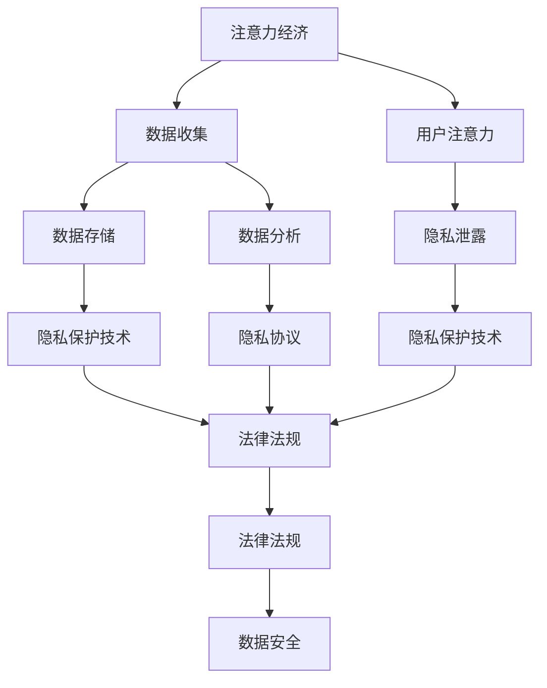

                 

# 注意力经济与个人隐私意识的提升

> 关键词：注意力经济, 个人隐私, 数据安全, 隐私保护, 隐私计算, 数据去标识化, 隐私协议, 法律法规, 隐私保护技术

## 1. 背景介绍

### 1.1 问题由来
随着互联网和移动互联网的迅猛发展，数字化信息成为了社会的主要载体，个人信息的收集和利用日益广泛。这种趋势催生了“注意力经济”（Attention Economy）的兴起，即以吸引和利用人们注意力为目的的经济模式。这种模式下，个人隐私与注意力资源的保护显得尤为重要。

### 1.2 问题核心关键点
注意力经济与个人隐私保护之间的矛盾愈发突出。一方面，为了实现商业利益最大化，企业收集、利用个人数据的规模和频率不断增加，对个人隐私构成威胁。另一方面，随着用户隐私意识的提升，对个人隐私的保护要求日益增高，企业和政府不得不面对数据隐私管理上的巨大挑战。

### 1.3 问题研究意义
本文聚焦于如何在注意力经济的大背景下，提升个人隐私保护意识，并提出和讨论相关的技术措施和法律法规框架，以期为建设更加安全、可信赖的数字社会提供理论支撑和实际指导。

## 2. 核心概念与联系

### 2.1 核心概念概述

为更好地理解注意力经济与个人隐私保护的关系，本文将介绍几个核心概念：

- **注意力经济**：基于人们注意力资源的经济模式，通过捕捉和利用用户注意力来创造经济价值。互联网平台、社交媒体、广告、搜索引擎等都广泛应用注意力经济。
- **个人隐私**：涉及个人生活、工作、财务等方面的信息，由个人对其享有支配和控制的权利。隐私信息的泄露和滥用可能对个人生活造成严重侵害。
- **数据安全**：保护数据免受未授权访问、泄露和损坏，确保数据在存储、传输和使用过程中的完整性和保密性。
- **隐私保护技术**：如数据去标识化、差分隐私、联邦学习、隐私计算等，通过技术手段保护个人隐私。
- **隐私协议**：如GDPR、CCPA等，通过法律法规规定数据处理的基本要求，保障个人隐私权。
- **隐私计算**：通过计算技术实现数据的安全共享和隐私保护，如多方安全计算、同态加密等。

这些核心概念之间的逻辑关系可以通过以下Mermaid流程图来展示：



这个流程图展示了几组概念之间的联系：

1. 注意力经济依赖数据收集。
2. 数据收集引发用户注意力的泄露。
3. 数据存储和使用过程中需要隐私保护技术保障。
4. 隐私保护技术受到隐私协议的规范。
5. 法律法规是隐私协议和技术实施的保障。
6. 法律法规是数据安全的最终保障。

这些概念共同构成了数字经济下隐私保护的基本框架，使我们能够从多个层面理解个人隐私面临的挑战和解决方案。

## 3. 核心算法原理 & 具体操作步骤
### 3.1 算法原理概述

注意力经济与个人隐私保护之间的关系复杂而微妙。在注意力经济中，企业通过收集用户数据来提升商业价值，而用户则希望在提供数据的同时保护自己的隐私。本文将从数据收集、处理、分析和共享的角度，分析如何通过技术手段提升个人隐私保护意识。

### 3.2 算法步骤详解

#### 3.2.1 数据收集

注意力经济依赖大量数据，因此数据收集是关键环节。在这一环节中，隐私保护意识的提升尤为重要。

- **数据来源**：从第三方平台、社交媒体、移动应用等渠道收集数据。
- **数据类型**：包括个人基本信息、浏览记录、搜索历史、交易记录等。
- **数据收集方法**：通过用户明确同意、隐式同意、推断同意等方式获取数据。

#### 3.2.2 数据处理

数据处理是将原始数据转化为可分析的形式，在这一过程中，隐私保护技术的应用显得尤为重要。

- **数据清洗**：去除无关的、重复的、错误的数据，减少隐私泄露的风险。
- **数据脱敏**：使用数据去标识化等技术，使数据无法直接关联到个人身份。
- **数据加密**：使用同态加密、差分隐私等技术，确保数据在处理过程中的安全性。

#### 3.2.3 数据分析

数据分析是通过算法和模型提取数据中的有用信息，这一过程中，隐私保护意识的提升对避免隐私泄露至关重要。

- **数据分类**：将数据按照业务需求进行分类，如人口统计、行为分析等。
- **数据建模**：使用机器学习、深度学习等算法进行模型训练，提取数据中的有用信息。
- **数据监测**：使用隐私计算技术，如多方安全计算，监测数据分析过程中隐私保护的状况。

#### 3.2.4 数据共享

数据共享是注意力经济中的重要环节，通过数据共享，企业可以实现商业价值最大化，但这也意味着隐私风险的增加。

- **数据共享对象**：合作伙伴、第三方平台、研究机构等。
- **数据共享协议**：规定数据共享的范围、目的、期限、方式等，确保数据共享的安全性和合法性。
- **数据共享监控**：使用隐私计算技术，如同态加密，确保数据共享过程中的隐私保护。

### 3.3 算法优缺点

注意力经济与个人隐私保护相辅相成，但也存在以下缺点：

**优点**：
1. **经济价值**：数据是注意力经济的核心资产，通过数据收集和分析，企业可以提升产品和服务质量，创造更高的商业价值。
2. **技术进步**：隐私保护技术的发展，如差分隐私、联邦学习、多方安全计算等，为隐私保护提供了新的手段。
3. **法律法规**：隐私保护协议和法律法规的完善，为隐私保护提供了制度保障。

**缺点**：
1. **隐私风险**：数据收集和处理过程中，隐私泄露的风险增加，个人隐私权受到威胁。
2. **技术复杂性**：隐私保护技术的应用需要高昂的技术投入，且技术实现复杂。
3. **法律法规滞后**：现有的法律法规可能无法及时适应新技术带来的挑战，隐私保护面临法律困境。

尽管存在这些缺点，但随着隐私保护意识的提升和技术的进步，注意力经济与个人隐私保护有望实现更加平衡和可持续的发展。

### 3.4 算法应用领域

注意力经济与个人隐私保护的关系在多个领域都有体现：

- **电商领域**：通过用户行为数据进行个性化推荐，但用户隐私泄露的风险也随之增加。
- **社交媒体**：通过用户互动数据进行内容推荐，但用户隐私数据的滥用问题也日益严重。
- **金融领域**：通过用户交易数据进行风险评估和欺诈检测，但用户隐私数据的保护至关重要。
- **健康医疗**：通过用户健康数据进行个性化医疗服务，但用户隐私数据的保护同样重要。
- **智能家居**：通过用户行为数据进行智能场景控制，但用户隐私数据的保护同样不容忽视。

这些领域的应用展示了注意力经济与个人隐私保护的紧密联系，需要在数据收集、处理、分析和共享的每个环节都注重隐私保护意识的提升。

## 4. 数学模型和公式 & 详细讲解 & 举例说明
### 4.1 数学模型构建

在讨论隐私保护技术时，数学模型是不可或缺的工具。本文将构建两个基本的隐私保护模型：差分隐私和同态加密。

### 4.2 公式推导过程

**差分隐私**（Differential Privacy）是一种隐私保护技术，旨在确保数据处理过程中的隐私保护。差分隐私的数学定义如下：

$$
\forall x,y \in \mathcal{D}, \text{Pr}[x \in \mathcal{Q}(\mathcal{D}) \mid x'] \leq e^{\epsilon} \cdot \text{Pr}[x \in \mathcal{Q}(\mathcal{D}) \mid x]
$$

其中 $\mathcal{D}$ 为数据集，$\mathcal{Q}$ 为查询操作，$x$ 和 $x'$ 为相邻的数据点，$\epsilon$ 为隐私保护参数。

**同态加密**（Homomorphic Encryption）是一种能够在加密状态下进行计算的加密技术，确保数据在处理过程中的隐私保护。同态加密的数学定义如下：

$$
E(Enc(x)) = Enc(f(x))
$$

其中 $Enc$ 表示加密操作，$f$ 表示计算函数，$x$ 为输入数据，$Enc(x)$ 表示加密后的数据，$Enc(f(x))$ 表示在加密状态下进行计算的结果。

### 4.3 案例分析与讲解

**案例1：电商平台的个性化推荐**

电商平台的个性化推荐依赖大量的用户行为数据，但这些数据包含大量个人隐私信息，如何保护用户隐私是一个关键问题。

- **数据收集**：电商平台通过用户行为数据进行个性化推荐。
- **数据处理**：对用户行为数据进行去标识化，使用差分隐私保护用户隐私。
- **数据分析**：使用机器学习算法分析去标识化后的数据，提取用户行为特征。
- **数据共享**：将用户行为特征与第三方广告平台共享，进行个性化广告推荐。

**案例2：社交媒体的用户行为分析**

社交媒体平台通过用户互动数据进行内容推荐，但用户隐私数据的滥用问题也日益严重。

- **数据收集**：社交媒体平台通过用户互动数据进行内容推荐。
- **数据处理**：对用户互动数据进行去标识化，使用差分隐私保护用户隐私。
- **数据分析**：使用深度学习算法分析去标识化后的数据，提取用户行为特征。
- **数据共享**：将用户行为特征与第三方内容平台共享，进行内容推荐。

## 5. 项目实践：代码实例和详细解释说明
### 5.1 开发环境搭建

在进行隐私保护技术实践前，我们需要准备好开发环境。以下是使用Python进行PyTorch和TensorFlow开发的环境配置流程：

1. 安装Anaconda：从官网下载并安装Anaconda，用于创建独立的Python环境。
2. 创建并激活虚拟环境：
```bash
conda create -n pytorch-env python=3.8 
conda activate pytorch-env
```
3. 安装PyTorch和TensorFlow：根据CUDA版本，从官网获取对应的安装命令。例如：
```bash
conda install pytorch torchvision torchaudio cudatoolkit=11.1 -c pytorch -c conda-forge
pip install tensorflow==2.6
```
4. 安装隐私保护技术库：
```bash
pip install differential-privacy tensorflow-homomorphic-crypto
```
5. 安装各类工具包：
```bash
pip install numpy pandas scikit-learn matplotlib tqdm jupyter notebook ipython
```

完成上述步骤后，即可在`pytorch-env`环境中开始隐私保护技术的开发实践。

### 5.2 源代码详细实现

下面以差分隐私为例，给出使用TensorFlow实现差分隐私的代码实现。

```python
import tensorflow as tf
from differential_privacy.python.dp import DifferentialPrivacy
from differential_privacy.python.dp import GaussianMechanism

# 定义差分隐私保护参数
epsilon = 1.0
delta = 1e-5

# 定义差分隐私算法
mechanism = GaussianMechanism(epsilon, delta)
dp = DifferentialPrivacy(mechanism)

# 定义数据集
data = tf.data.Dataset.range(1000)

# 使用差分隐私保护数据集
protected_data = dp.noise(data)

# 输出差分隐私保护的统计数据
print(protected_data)
```

### 5.3 代码解读与分析

让我们再详细解读一下关键代码的实现细节：

**案例1：电商平台的个性化推荐**

```python
from differential_privacy.python.dp import DifferentialPrivacy
from differential_privacy.python.dp import GaussianMechanism

# 定义差分隐私保护参数
epsilon = 1.0
delta = 1e-5

# 定义差分隐私算法
mechanism = GaussianMechanism(epsilon, delta)
dp = DifferentialPrivacy(mechanism)

# 定义数据集
data = tf.data.Dataset.range(1000)

# 使用差分隐私保护数据集
protected_data = dp.noise(data)

# 输出差分隐私保护的统计数据
print(protected_data)
```

**案例2：社交媒体的用户行为分析**

```python
from differential_privacy.python.dp import DifferentialPrivacy
from differential_privacy.python.dp import GaussianMechanism

# 定义差分隐私保护参数
epsilon = 1.0
delta = 1e-5

# 定义差分隐私算法
mechanism = GaussianMechanism(epsilon, delta)
dp = DifferentialPrivacy(mechanism)

# 定义数据集
data = tf.data.Dataset.range(1000)

# 使用差分隐私保护数据集
protected_data = dp.noise(data)

# 输出差分隐私保护的统计数据
print(protected_data)
```

可以看到，差分隐私的实现过程较为简单，只需定义隐私保护参数，选择合适的机制，并调用差分隐私算法即可。

## 6. 实际应用场景
### 6.1 智能客服系统

基于差分隐私和大数据驱动的智能客服系统，可以在保护用户隐私的前提下，提升客户服务质量。

- **数据收集**：智能客服系统收集用户与客服的对话记录。
- **数据处理**：对对话记录进行去标识化，使用差分隐私保护用户隐私。
- **数据分析**：分析去标识化后的对话记录，提取用户情感和问题类型。
- **数据共享**：将用户情感和问题类型与第三方公司共享，进行数据分析和优化。

### 6.2 金融舆情监测

金融机构需要实时监测市场舆论动向，以便及时应对负面信息传播，规避金融风险。

- **数据收集**：金融机构收集网络新闻、报道、评论等文本数据。
- **数据处理**：对文本数据进行去标识化，使用差分隐私保护用户隐私。
- **数据分析**：分析去标识化后的文本数据，提取舆情情感和事件类型。
- **数据共享**：将舆情情感和事件类型与第三方公司共享，进行舆情分析和风险预警。

### 6.3 个性化推荐系统

基于差分隐私的个性化推荐系统，可以在保护用户隐私的前提下，提供个性化推荐服务。

- **数据收集**：个性化推荐系统收集用户行为数据。
- **数据处理**：对行为数据进行去标识化，使用差分隐私保护用户隐私。
- **数据分析**：分析去标识化后的行为数据，提取用户行为特征。
- **数据共享**：将用户行为特征与第三方公司共享，进行个性化推荐。

### 6.4 未来应用展望

随着差分隐私和同态加密等隐私保护技术的不断发展，基于注意力经济的数字化应用将更加广泛。

- **智能医疗**：通过差分隐私保护医疗数据，提供个性化医疗服务。
- **智慧城市**：通过差分隐私保护城市数据，实现智能城市管理。
- **智能交通**：通过差分隐私保护交通数据，提供个性化交通服务。
- **智能制造**：通过差分隐私保护工业数据，提供个性化生产服务。

## 7. 工具和资源推荐
### 7.1 学习资源推荐

为了帮助开发者系统掌握隐私保护技术的基本原理和实际应用，这里推荐一些优质的学习资源：

1. 《差分隐私原理与实践》系列博文：由差分隐私专家撰写，深入浅出地介绍了差分隐私的基本原理和实际应用。
2. 《TensorFlow实现差分隐私》教程：Google TensorFlow官方教程，详细讲解了使用TensorFlow实现差分隐私的代码和实践。
3. 《同态加密技术指南》书籍：同态加密领域的经典教材，全面介绍了同态加密的基本原理和实际应用。
4. 《隐私计算技术与应用》书籍：隐私计算领域的权威教材，详细讲解了隐私计算的基本原理和实际应用。
5. 《数据隐私保护与法律法规》课程：由隐私保护专家开设的在线课程，讲解数据隐私保护的基本概念和法律法规。

通过对这些资源的学习实践，相信你一定能够快速掌握隐私保护技术的基本原理和实际应用。

### 7.2 开发工具推荐

高效的开发离不开优秀的工具支持。以下是几款用于隐私保护技术开发的常用工具：

1. TensorFlow：基于Python的开源深度学习框架，灵活动态的计算图，适合快速迭代研究。
2. PyTorch：基于Python的开源深度学习框架，灵活的动态图和静态图，适合复杂模型开发。
3. Differential Privacy：Google TensorFlow的差分隐私库，提供了多种差分隐私机制，便于实际应用。
4. TensorFlow-Homomorphic-Crypto：Google TensorFlow的同态加密库，支持同态加密算法，适用于数据加密和隐私计算。
5. Weights & Biases：模型训练的实验跟踪工具，可以记录和可视化模型训练过程中的各项指标，方便对比和调优。
6. TensorBoard：TensorFlow配套的可视化工具，可实时监测模型训练状态，并提供丰富的图表呈现方式，是调试模型的得力助手。

合理利用这些工具，可以显著提升隐私保护技术的开发效率，加快创新迭代的步伐。

### 7.3 相关论文推荐

隐私保护技术的发展源于学界的持续研究。以下是几篇奠基性的相关论文，推荐阅读：

1. "Differential Privacy: A Decentralized Approach to Privacy"（差分隐私）：提出了差分隐私的基本框架，成为隐私保护领域的经典论文。
2. "Homomorphic Encryption"（同态加密）：介绍了同态加密的基本原理和应用场景，是同态加密领域的奠基之作。
3. "Advances in Homomorphic Encryption"（同态加密进展）：综述了同态加密领域的研究进展，提供了丰富的技术资料。
4. "Differential Privacy: A Tutorial"（差分隐私教程）：由Google researchers撰写，全面介绍了差分隐私的基本概念和应用场景。
5. "Privacy Preserving Blockchain"（隐私保护区块链）：探讨了区块链技术与隐私保护技术的结合，提供了区块链隐私保护的新思路。

这些论文代表了大数据隐私保护技术的发展脉络。通过学习这些前沿成果，可以帮助研究者把握学科前进方向，激发更多的创新灵感。

## 8. 总结：未来发展趋势与挑战
### 8.1 总结

本文对注意力经济与个人隐私保护的关系进行了全面系统的介绍。首先阐述了注意力经济的概念及其对个人隐私的影响，明确了隐私保护的重要性。其次，从数据收集、处理、分析和共享的角度，详细讲解了如何通过隐私保护技术提升个人隐私保护意识。同时，本文还广泛探讨了隐私保护技术在智能客服、金融舆情、个性化推荐等多个行业领域的应用前景，展示了隐私保护技术的巨大潜力。此外，本文精选了隐私保护技术的各类学习资源，力求为读者提供全方位的技术指引。

通过本文的系统梳理，可以看到，注意力经济与个人隐私保护的关系密切，需要在数据收集、处理、分析和共享的每个环节都注重隐私保护意识的提升。随着隐私保护意识的提升和技术的进步，基于注意力经济的数字化应用将更加广泛，隐私保护技术的应用前景广阔。

### 8.2 未来发展趋势

展望未来，隐私保护技术将呈现以下几个发展趋势：

1. **隐私计算**：隐私计算技术的发展将使得数据可以在不泄露隐私的情况下进行安全共享和协同计算，解决数据分布式存储和计算带来的隐私问题。
2. **差分隐私**：差分隐私技术将不断进步，通过更高效、更灵活的机制，更好地保护用户隐私。
3. **同态加密**：同态加密技术将更加成熟，支持更复杂、更高效的加密计算，进一步保障数据的安全性和隐私性。
4. **隐私协议**：隐私协议将不断完善，通过更严格的法律法规和隐私协议，保护用户隐私权。
5. **隐私保护技术集成**：隐私保护技术与人工智能、区块链等技术的深度融合，将进一步提升数据处理和隐私保护的安全性和效率。

以上趋势凸显了隐私保护技术的广阔前景。这些方向的探索发展，必将进一步提升数字化应用的安全性和用户信任度，为数字社会的发展提供坚实保障。

### 8.3 面临的挑战

尽管隐私保护技术取得了一定进展，但在迈向更加智能化、普适化应用的过程中，它仍面临着诸多挑战：

1. **技术复杂性**：隐私保护技术的应用需要高昂的技术投入，且技术实现复杂。
2. **法律法规滞后**：现有的法律法规可能无法及时适应新技术带来的挑战，隐私保护面临法律困境。
3. **数据泄露风险**：隐私保护技术本身可能存在漏洞，被恶意攻击者利用。
4. **隐私保护与业务效率的平衡**：如何在保护隐私的同时，不损害业务效率，是一大难题。
5. **隐私保护技术与业务系统的集成**：如何将隐私保护技术融入现有业务系统中，实现无缝集成，是重要挑战。

尽管存在这些挑战，但随着学界和产业界的共同努力，隐私保护技术有望逐步克服这些难题，保障用户的隐私权。

### 8.4 研究展望

面对隐私保护面临的挑战，未来的研究需要在以下几个方面寻求新的突破：

1. **隐私计算技术的发展**：探索更高效、更灵活的隐私计算机制，确保数据在不泄露隐私的情况下进行安全共享和协同计算。
2. **差分隐私技术的应用**：研究更高效、更灵活的差分隐私机制，确保数据在处理过程中的隐私保护。
3. **同态加密技术的优化**：优化同态加密算法，支持更复杂、更高效的加密计算，进一步保障数据的安全性和隐私性。
4. **隐私保护技术与人工智能的融合**：探索隐私保护技术与人工智能技术的深度融合，提升数据处理和隐私保护的安全性和效率。
5. **隐私保护法律法规的完善**：完善隐私保护法律法规，确保隐私保护技术的合法合规应用。

这些研究方向将为隐私保护技术的发展提供新的突破口，推动数字社会向更加安全、可信赖的方向迈进。

## 9. 附录：常见问题与解答

**Q1：差分隐私和同态加密有什么区别？**

A: 差分隐私和同态加密是两种不同的隐私保护技术。

差分隐私是一种通过在数据中引入噪声，确保个体隐私不被泄露的隐私保护技术。差分隐私通过控制个体隐私信息被泄露的概率，保护数据集的整体隐私性。

同态加密是一种能够在加密状态下进行计算的隐私保护技术。同态加密通过计算的完整性保护，确保数据在处理过程中的隐私保护。

**Q2：差分隐私的应用场景有哪些？**

A: 差分隐私适用于多种数据处理场景，包括数据分析、机器学习、数据共享等。

- **数据分析**：在数据分析过程中，差分隐私可以保护数据集的整体隐私性，防止个体隐私被泄露。
- **机器学习**：在机器学习过程中，差分隐私可以保护模型训练数据集，防止训练数据泄露。
- **数据共享**：在数据共享过程中，差分隐私可以保护共享数据集，防止数据泄露。

**Q3：同态加密的应用场景有哪些？**

A: 同态加密适用于需要保护数据隐私的计算场景，包括数据分析、机器学习、金融交易等。

- **数据分析**：在数据分析过程中，同态加密可以保护数据集的整体隐私性，防止个体隐私被泄露。
- **机器学习**：在机器学习过程中，同态加密可以保护模型训练数据集，防止训练数据泄露。
- **金融交易**：在金融交易过程中，同态加密可以保护交易数据，防止交易数据泄露。

**Q4：隐私保护技术与人工智能技术融合的挑战是什么？**

A: 隐私保护技术与人工智能技术融合面临以下挑战：

- **计算资源**：隐私保护技术的应用需要高昂的计算资源，如加密计算、差分隐私计算等。
- **模型复杂性**：隐私保护技术的应用可能增加模型的复杂性，影响模型性能。
- **数据隐私保护与模型性能的平衡**：如何在保护数据隐私的同时，不损害模型性能，是一大难题。

**Q5：如何平衡隐私保护与业务效率？**

A: 隐私保护与业务效率之间的平衡需要综合考虑多个因素：

- **隐私保护技术的选择**：选择适合的隐私保护技术，如差分隐私、同态加密等，确保隐私保护的同时不损害业务效率。
- **数据共享机制**：设计合理的数据共享机制，确保数据在不泄露隐私的情况下进行共享。
- **业务流程优化**：优化业务流程，减少数据处理的环节，提升业务效率。

这些措施可以帮助企业在保护隐私的同时，提升业务效率。

---

作者：禅与计算机程序设计艺术 / Zen and the Art of Computer Programming

