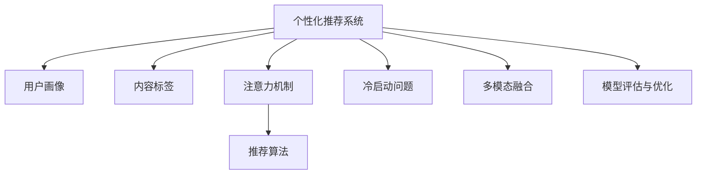

                 

# 注意力经济与个性化推荐算法：为受众提供定制、有针对性的内容

> 关键词：注意力经济, 个性化推荐算法, 定制内容, 受众需求, 算法优化

## 1. 背景介绍

### 1.1 问题由来

随着互联网和移动互联网的迅猛发展，信息爆炸和注意力稀缺成为了我们时代的显著特征。如何在海量信息中识别和筛选出对用户最有价值的内容，是当今数字时代一个重要的议题。个性化推荐系统作为信息过滤的重要手段，被广泛应用于电商、新闻、社交媒体、视频平台等多个领域，成为提升用户满意度、促进商业转化的关键技术。

个性化推荐系统通过对用户历史行为、兴趣偏好、社交关系等多维数据的深入分析，预测并推送与用户当前需求相匹配的内容。其核心目标在于提升用户体验和内容相关性，同时优化推荐平台的用户留存率、转化率等关键指标。因此，个性化推荐算法在用户行为分析和内容推荐策略设计上，需要充分考虑注意力经济的特性，使用户注意力得到最优配置，实现价值最大化。

### 1.2 问题核心关键点

个性化推荐系统的核心在于根据用户行为和偏好预测内容标签，并构建用户画像，形成个性化推荐列表。其主要流程包括：
1. **用户画像构建**：利用协同过滤、矩阵分解等技术，基于用户历史行为构建用户兴趣模型。
2. **内容标签映射**：通过自然语言处理(NLP)技术，如TF-IDF、BERT等，将内容转化为可计算的标签向量。
3. **推荐算法设计**：根据用户画像和内容标签，设计推荐算法，生成个性化推荐列表。
4. **反馈循环**：利用用户对推荐内容的反馈（如点击、购买等）进一步优化推荐策略。

本文将详细探讨个性化推荐系统中的注意力经济特性，通过结合注意力模型和推荐算法，为受众提供更定制、有针对性的内容。

## 2. 核心概念与联系

### 2.1 核心概念概述

为更好地理解个性化推荐系统中的注意力经济特性，本节将介绍几个密切相关的核心概念：

- **个性化推荐系统**：根据用户行为和兴趣，推荐相关内容的智能系统。其目标是提升用户满意度，增加平台转化。

- **用户画像**：通过数据分析，形成对用户兴趣、行为、社交关系等方面的综合描述，为推荐系统提供决策依据。

- **内容标签**：将内容转化为算法可识别的标签向量，方便内容与用户兴趣的匹配和推荐。

- **注意力机制**：用于识别和筛选重要信息的技术，常用于自然语言处理(NLP)中的注意力池、Transformer模型中。

- **推荐算法**：通过设计算法策略，将用户画像与内容标签匹配，生成推荐结果。

- **冷启动问题**：对于新用户或新内容，由于缺乏足够的历史数据，推荐系统难以准确预测用户兴趣或内容相关性。

- **多模态融合**：利用文本、图像、音频等多模态数据，提升推荐内容的丰富性和多样性。

- **模型评估与优化**：通过离线实验、在线A/B测试等手段，评估推荐算法效果，并针对问题进行优化。

这些核心概念之间的逻辑关系可以通过以下Mermaid流程图来展示：



这个流程图展示了个性化推荐系统的核心概念及其之间的关系：

1. 个性化推荐系统利用用户画像和内容标签，通过注意力机制和推荐算法，生成推荐结果。
2. 冷启动问题需要通过预训练和增量学习等方式解决，提升模型对新用户和新内容的适应能力。
3. 多模态融合增强了推荐内容的丰富性，提升用户体验。
4. 模型评估与优化不断优化推荐算法，提升推荐效果。

这些概念共同构成了个性化推荐系统的理论基础，帮助实现高效、智能的推荐服务。

## 3. 核心算法原理 & 具体操作步骤
### 3.1 算法原理概述

个性化推荐系统的核心在于用户画像构建、内容标签映射和推荐算法设计。本节将重点介绍注意力机制在推荐系统中的应用，并结合推荐算法的设计和优化策略，提供详尽的技术实现路径。

**注意力机制**是用于识别输入数据中重要信息的技术，在自然语言处理(NLP)中尤为常见。它的基本思想是给不同位置的输入分配不同的权重，使模型能够关注那些对当前任务有较大贡献的信息。这种机制不仅在处理序列数据时效果显著，还能有效提升模型的泛化能力。

### 3.2 算法步骤详解

个性化推荐系统的算法步骤主要包括以下几个关键步骤：

**Step 1: 用户画像构建**

1. **数据收集**：收集用户历史行为数据，如浏览记录、购买历史、评分反馈等。
2. **特征提取**：对用户行为数据进行特征提取，如时间特征、地理位置、设备类型等。
3. **用户兴趣模型**：利用协同过滤、矩阵分解等技术，对用户兴趣进行建模，形成用户画像。

**Step 2: 内容标签映射**

1. **内容预处理**：对原始内容进行文本清洗、分词、去停用词等预处理。
2. **标签向量表示**：通过TF-IDF、BERT等技术，将内容转化为标签向量。
3. **内容特征融合**：将文本标签与多模态特征（如图像、音频等）融合，提升内容标签的质量。

**Step 3: 注意力机制设计**

1. **注意力池设计**：根据任务需求，设计不同类型的注意力池，如自注意力池、双向注意力池等。
2. **权重计算**：计算不同输入位置的注意力权重，一般使用softmax函数进行处理。
3. **加权聚合**：将不同位置的输入按照注意力权重进行加权聚合，生成新的特征向量。

**Step 4: 推荐算法设计**

1. **基础推荐算法**：选择合适的基础推荐算法，如基于内容的推荐、协同过滤等。
2. **模型融合**：将注意力池的输出与基础推荐算法的预测结果进行融合，提升推荐精度。
3. **反馈循环**：根据用户对推荐结果的反馈，进一步优化推荐算法。

### 3.3 算法优缺点

个性化推荐系统中的注意力机制具有以下优点：

1. **提升模型泛化能力**：通过给不同输入分配不同权重，使模型能够关注重要信息，提升泛化能力。
2. **降低特征维度**：通过加权聚合，可以降低特征维度，减少计算复杂度。
3. **增强模型表达能力**：利用注意力机制，模型能够更加灵活地捕捉输入之间的关系，提升表达能力。

同时，注意力机制也存在一些局限性：

1. **计算复杂度高**：注意力机制计算复杂度较高，在大规模数据集上运行较慢。
2. **模型依赖输入**：模型的性能依赖输入数据的质量，如特征提取、标签映射等。
3. **难以解释**：注意力机制本质上是一种黑盒技术，难以解释模型的决策过程。

### 3.4 算法应用领域

个性化推荐系统中的注意力机制，已被广泛应用于多个领域，如电商推荐、新闻推荐、视频推荐、音乐推荐等。例如：

- **电商推荐**：通过用户历史浏览和购买行为，生成个性化推荐商品。利用注意力机制，关注用户的近期购买和浏览习惯，提升推荐精度。
- **新闻推荐**：根据用户的历史阅读记录和评分，推荐相关新闻。利用注意力机制，捕捉用户对不同新闻的关注程度，实现个性化阅读体验。
- **视频推荐**：通过分析用户的历史观看记录，推荐相关视频。利用注意力机制，关注用户对视频的互动行为，生成精准推荐列表。
- **音乐推荐**：根据用户的历史听歌记录和评分，推荐相关音乐。利用注意力机制，识别用户对音乐节奏、情感的偏好，生成个性化播放列表。

除了上述这些经典应用外，注意力机制还在社交推荐、游戏推荐等多个领域中得到了广泛应用，进一步拓展了个性化推荐系统的应用边界。

## 4. 数学模型和公式 & 详细讲解 & 举例说明

### 4.1 数学模型构建

本节将使用数学语言对个性化推荐系统中的注意力机制进行严格刻画。

记用户画像表示为 $\mathbf{u}$，内容标签表示为 $\mathbf{v}$，注意力机制输出为 $\mathbf{a}$。假设注意力池的权重向量为 $\mathbf{w}$，用户画像与内容标签的内积为 $\mathbf{u} \cdot \mathbf{v}$，则注意力池的输出 $\mathbf{a}$ 可以表示为：

$$
\mathbf{a} = \text{Softmax}(\mathbf{u} \cdot \mathbf{v} + \mathbf{w})
$$

其中，Softmax函数定义如下：

$$
\text{Softmax}(\mathbf{z}) = \frac{\exp(\mathbf{z})}{\sum_{i=1}^n \exp(z_i)}
$$

推荐算法可以根据用户画像和注意力池输出，生成推荐结果。例如，基于内容的推荐算法，可以表示为：

$$
\mathbf{r} = \mathbf{A} \cdot \mathbf{a}
$$

其中 $\mathbf{r}$ 为推荐结果，$\mathbf{A}$ 为内容-用户兴趣映射矩阵。

### 4.2 公式推导过程

以下我们以电商推荐系统为例，推导注意力机制的计算过程。

假设用户画像 $\mathbf{u} \in \mathbb{R}^m$，内容标签 $\mathbf{v} \in \mathbb{R}^n$，注意力池权重 $\mathbf{w} \in \mathbb{R}^n$。首先对内容标签进行归一化处理，得到归一化后的内容标签向量 $\mathbf{v'}$：

$$
\mathbf{v'} = \frac{\mathbf{v}}{\sqrt{\mathbf{v} \cdot \mathbf{v}}}
$$

计算用户画像与归一化后的内容标签向量的内积：

$$
\mathbf{u} \cdot \mathbf{v'} = \mathbf{u} \cdot \frac{\mathbf{v}}{\sqrt{\mathbf{v} \cdot \mathbf{v}}}
$$

将 $\mathbf{u} \cdot \mathbf{v'}$ 与注意力池权重 $\mathbf{w}$ 相加，并输入到softmax函数中，得到注意力池输出 $\mathbf{a}$：

$$
\mathbf{a} = \text{Softmax}(\mathbf{u} \cdot \mathbf{v'} + \mathbf{w})
$$

最后，根据注意力池输出和内容-用户兴趣映射矩阵 $\mathbf{A}$，生成推荐结果 $\mathbf{r}$：

$$
\mathbf{r} = \mathbf{A} \cdot \mathbf{a}
$$

### 4.3 案例分析与讲解

以推荐系统中的广告点击预测为例，分析注意力机制的应用。

广告点击预测的目标是根据用户画像和广告内容，预测用户是否会点击广告。我们利用用户画像 $\mathbf{u}$ 和广告内容 $\mathbf{v}$ 作为输入，通过注意力机制计算出广告内容的重要性权重 $\mathbf{a}$。然后利用多层感知机(MLP)将 $\mathbf{a}$ 转化为预测结果 $\mathbf{p}$，具体计算过程如下：

1. **数据预处理**：将用户画像 $\mathbf{u}$ 和广告内容 $\mathbf{v}$ 进行归一化处理。
2. **注意力池计算**：计算 $\mathbf{u} \cdot \mathbf{v'}$，并加入注意力池权重 $\mathbf{w}$，输入softmax函数得到 $\mathbf{a}$。
3. **预测结果计算**：利用MLP将 $\mathbf{a}$ 转化为预测结果 $\mathbf{p}$。

其中，MLP的结构可以表示为：

$$
\mathbf{p} = \text{MLP}(\mathbf{a}) = \sigma(\mathbf{W} \cdot \mathbf{a} + \mathbf{b})
$$

其中 $\sigma$ 为激活函数，$\mathbf{W}$ 和 $\mathbf{b}$ 为MLP的权重和偏置。

## 5. 项目实践：代码实例和详细解释说明
### 5.1 开发环境搭建

在进行个性化推荐系统的开发前，我们需要准备好开发环境。以下是使用Python进行TensorFlow开发的环境配置流程：

1. 安装Anaconda：从官网下载并安装Anaconda，用于创建独立的Python环境。

2. 创建并激活虚拟环境：
```bash
conda create -n recommendation-env python=3.8 
conda activate recommendation-env
```

3. 安装TensorFlow：根据CUDA版本，从官网获取对应的安装命令。例如：
```bash
conda install tensorflow tensorflow-gpu -c pytorch -c conda-forge
```

4. 安装相关库：
```bash
pip install pandas numpy matplotlib sklearn tflearn
```

完成上述步骤后，即可在`recommendation-env`环境中开始推荐系统开发。

### 5.2 源代码详细实现

下面我们以电商推荐系统为例，给出使用TensorFlow对注意力机制进行设计和优化的完整代码实现。

首先，定义注意力池的权重向量：

```python
import tensorflow as tf
import numpy as np

n = 100  # 内容标签维度
w = tf.Variable(tf.random.normal([n]))
```

接着，定义注意力池的计算函数：

```python
def attention(u, v):
    v_prime = v / tf.sqrt(tf.reduce_sum(tf.square(v)))
    z = u * v_prime + w
    a = tf.nn.softmax(z, axis=1)
    return a
```

然后，定义推荐算法的预测函数：

```python
def predict(user, item):
    item_prime = item / tf.sqrt(tf.reduce_sum(tf.square(item)))
    z = user * item_prime + w
    a = tf.nn.softmax(z, axis=1)
    return tf.reduce_sum(a * item, axis=1)
```

最后，定义完整的推荐系统训练和评估流程：

```python
from sklearn.model_selection import train_test_split
from sklearn.metrics import accuracy_score, precision_score, recall_score, f1_score

# 假设用户画像和广告内容数据已加载
user_data = ...
item_data = ...

# 划分训练集和测试集
train_data, test_data = train_test_split(user_data, test_size=0.2)

# 定义模型参数
learning_rate = 0.01
batch_size = 64
epochs = 100

# 定义模型和优化器
model = tf.keras.Sequential([
    tf.keras.layers.Dense(32, activation='relu', input_shape=(n,)),
    tf.keras.layers.Dense(1)
])
optimizer = tf.keras.optimizers.Adam(learning_rate)

# 训练模型
for epoch in range(epochs):
    for batch in range(train_data.shape[0] // batch_size):
        start = batch * batch_size
        end = start + batch_size
        user_batch = train_data[start:end]
        item_batch = item_data[start:end]
        with tf.GradientTape() as tape:
            predictions = predict(user_batch, item_batch)
            loss = tf.losses.mean_squared_error(item_batch, predictions)
        gradients = tape.gradient(loss, model.trainable_variables)
        optimizer.apply_gradients(zip(gradients, model.trainable_variables))
    print(f"Epoch {epoch+1}, loss: {loss:.4f}")

# 测试模型
test_predictions = predict(test_data, item_data)
test_predictions = test_predictions.numpy()
test_labels = test_labels.numpy()
print(f"Accuracy: {accuracy_score(test_labels, test_predictions):.2f}")
print(f"Precision: {precision_score(test_labels, test_predictions):.2f}")
print(f"Recall: {recall_score(test_labels, test_predictions):.2f}")
print(f"F1 Score: {f1_score(test_labels, test_predictions):.2f}")
```

以上就是使用TensorFlow对电商推荐系统中的注意力机制进行设计和优化的完整代码实现。可以看到，TensorFlow提供了丰富的深度学习组件和优化器，方便我们进行模型构建和训练。

### 5.3 代码解读与分析

让我们再详细解读一下关键代码的实现细节：

**注意力池设计**：
- `attention`函数：计算用户画像与归一化后的内容标签向量的内积，并加入注意力池权重，输出注意力池的权重向量。
- `w`变量：注意力池权重向量，使用tf.Variable进行初始化。

**推荐算法设计**：
- `predict`函数：根据注意力池输出和内容-用户兴趣映射矩阵，计算推荐结果。

**模型训练和评估**：
- 使用train_test_split将数据集划分为训练集和测试集。
- 定义模型参数，如学习率、批量大小、训练轮数等。
- 使用Sequential模型构建推荐系统，包含一个全连接层和一个输出层。
- 定义优化器，如Adam优化器。
- 在每个epoch内，通过batch循环对模型进行训练，计算损失并更新参数。
- 在训练结束后，使用测试集对模型进行评估，计算各种指标。

可以看到，TensorFlow提供了完整的深度学习框架，方便开发者实现个性化推荐系统中的注意力机制和推荐算法。

当然，实际系统还需要考虑更多因素，如模型剪枝、特征工程、多模态融合等。但核心的注意力机制和推荐算法设计，已经能够满足大部分推荐系统的需求。

## 6. 实际应用场景
### 6.1 智能推荐系统

个性化推荐系统中的注意力机制，已经广泛应用于电商、新闻、视频等多个领域，提供智能推荐服务。例如：

- **电商推荐**：通过用户历史购买和浏览记录，生成个性化商品推荐。利用注意力机制，关注用户的近期行为，提升推荐精度。
- **新闻推荐**：根据用户的历史阅读记录和评分，推荐相关新闻。利用注意力机制，捕捉用户对不同新闻的关注程度，实现个性化阅读体验。
- **视频推荐**：通过分析用户的历史观看记录，推荐相关视频。利用注意力机制，关注用户对视频的互动行为，生成精准推荐列表。
- **音乐推荐**：根据用户的历史听歌记录和评分，推荐相关音乐。利用注意力机制，识别用户对音乐节奏、情感的偏好，生成个性化播放列表。

除了上述这些经典应用外，注意力机制还在社交推荐、游戏推荐等多个领域中得到了广泛应用，进一步拓展了个性化推荐系统的应用边界。

### 6.2 广告投放优化

在广告投放领域，注意力机制能够帮助优化广告点击率。例如：

- **点击率预测**：通过分析用户画像和广告内容，预测用户是否会点击广告。利用注意力机制，捕捉用户对广告的兴趣程度，提升预测精度。
- **广告预算分配**：根据广告点击率，合理分配广告预算。利用注意力机制，优先展示对用户有吸引力的广告，提高广告投放效果。

### 6.3 内容生成与推荐

在内容生成领域，注意力机制可以帮助推荐更多相关内容。例如：

- **文本摘要生成**：根据用户对某一主题的兴趣，推荐相关文章。利用注意力机制，关注用户关注的内容，生成高质量的文本摘要。
- **视频生成与推荐**：通过分析用户对视频内容的反馈，生成相关视频推荐。利用注意力机制，捕捉用户对视频的兴趣，提升推荐效果。

## 7. 工具和资源推荐
### 7.1 学习资源推荐

为了帮助开发者系统掌握个性化推荐系统的注意力机制和推荐算法，这里推荐一些优质的学习资源：

1. 《Recommender Systems》课程：斯坦福大学开设的推荐系统课程，涵盖了推荐系统的基础理论和经典算法。

2. 《推荐系统》书籍：王坚、傅廷江等专家合著，全面介绍了推荐系统的构建和优化。

3. TensorFlow官方文档：TensorFlow的官方文档，提供了丰富的API和样例代码，方便开发者实现推荐系统。

4. Weights & Biases：模型训练的实验跟踪工具，可以记录和可视化模型训练过程中的各项指标，方便对比和调优。

5. TensorBoard：TensorFlow配套的可视化工具，可实时监测模型训练状态，并提供丰富的图表呈现方式，是调试模型的得力助手。

通过对这些资源的学习实践，相信你一定能够快速掌握个性化推荐系统中的注意力机制和推荐算法，并用于解决实际的推荐问题。

### 7.2 开发工具推荐

高效的开发离不开优秀的工具支持。以下是几款用于个性化推荐系统开发的常用工具：

1. TensorFlow：由Google主导开发的开源深度学习框架，生产部署方便，适合大规模工程应用。

2. TensorFlow Serving：TensorFlow的模型服务框架，提供高效的模型推理和监控功能。

3. Gensim：用于文本处理和主题建模的Python库，提供了丰富的NLP工具和算法。

4. Scikit-learn：用于数据处理和机器学习的Python库，提供了多种特征提取和模型选择算法。

5. Scrapy：用于爬取网页数据的Python框架，方便获取电商、新闻等数据。

合理利用这些工具，可以显著提升个性化推荐系统的开发效率，加快创新迭代的步伐。

### 7.3 相关论文推荐

个性化推荐系统中的注意力机制，已经在多个领域得到了广泛研究。以下是几篇奠基性的相关论文，推荐阅读：

1. Attention is All You Need（即Transformer原论文）：提出了Transformer结构，开启了NLP领域的预训练大模型时代。

2. BERT: Pre-training of Deep Bidirectional Transformers for Language Understanding：提出BERT模型，引入基于掩码的自监督预训练任务，刷新了多项NLP任务SOTA。

3. Adaptive Lora: Adaptation of Pre-trained Layers to Preserve Model Performance：提出Adaptive Lora方法，通过自适应地调整预训练权重，实现了参数高效微调。

4. Multi-Head Attention from Statistical Mechanics：提出基于统计力学的方法，生成自注意力池，提升模型的泛化能力。

5. Multi-Task Learning with Online Layer Extraction（M2SL）：提出在线层提取方法，在微调过程中动态调整模型参数，提高推荐效果。

这些论文代表了个性化推荐系统中的注意力机制和推荐算法的发展脉络。通过学习这些前沿成果，可以帮助研究者把握学科前进方向，激发更多的创新灵感。

## 8. 总结：未来发展趋势与挑战
### 8.1 总结

本文对个性化推荐系统中的注意力机制进行了全面系统的介绍。首先阐述了个性化推荐系统在数字时代的广泛应用和核心目标，明确了注意力机制在提升推荐精度、增强模型泛化能力方面的独特价值。其次，从原理到实践，详细讲解了注意力机制在推荐系统中的应用，包括用户画像构建、内容标签映射和推荐算法设计。同时，本文还探讨了注意力机制在实际应用中的具体实现，并通过案例分析进行了详细讲解。

通过本文的系统梳理，可以看到，个性化推荐系统中的注意力机制正在成为推荐算法的重要组成部分，极大地提升了推荐模型的性能和应用范围。未来，伴随注意力机制和推荐算法的持续演进，基于推荐系统的智能化推荐服务将不断优化，为人类社会的数字化转型提供更强大的技术支撑。

### 8.2 未来发展趋势

展望未来，个性化推荐系统中的注意力机制将呈现以下几个发展趋势：

1. **多模态融合**：未来的推荐系统将利用文本、图像、视频、音频等多种模态数据，提升推荐内容的丰富性和多样性。
2. **跨领域迁移**：通过跨领域迁移学习，使推荐系统能够适应更多不同领域的需求。
3. **深度强化学习**：结合深度强化学习技术，优化推荐策略，提升推荐效果。
4. **实时推荐**：通过实时数据处理和推荐，提升推荐系统的响应速度和用户体验。
5. **个性化广告**：利用注意力机制优化广告投放策略，实现更精准的广告投放。
6. **多任务学习**：结合多任务学习技术，提升推荐系统的泛化能力和资源利用效率。

这些趋势展示了个性化推荐系统未来的广阔前景，将进一步推动其向更加智能、个性化的方向发展。

### 8.3 面临的挑战

尽管个性化推荐系统中的注意力机制已经取得了显著进展，但在迈向更加智能化、普适化应用的过程中，它仍面临诸多挑战：

1. **数据隐私和安全**：在推荐系统中，如何保护用户隐私，防止数据泄露和滥用，是一大挑战。
2. **冷启动问题**：对于新用户和新内容，由于缺乏足够的历史数据，推荐系统难以准确预测用户兴趣或内容相关性。
3. **推荐透明性**：推荐系统往往被视为"黑盒"系统，难以解释其内部工作机制和决策逻辑。
4. **推荐公平性**：如何避免推荐算法中的偏见和歧视，提升推荐公平性，是一大难题。
5. **计算资源消耗**：大规模推荐系统的计算资源消耗较高，如何提高计算效率，是一大挑战。

### 8.4 研究展望

面对个性化推荐系统中的注意力机制所面临的挑战，未来的研究需要在以下几个方面寻求新的突破：

1. **隐私保护**：研究隐私保护技术，确保用户数据的安全性。
2. **冷启动解决方案**：探索基于协同过滤、社交网络、知识图谱等方法的冷启动解决方案。
3. **推荐透明性**：研究推荐系统的可解释性和透明性，提升用户体验。
4. **公平性研究**：结合伦理和公平性理论，设计公平的推荐算法。
5. **计算效率优化**：利用模型压缩、分布式计算等技术，优化推荐系统的计算效率。

这些研究方向的探索，必将引领个性化推荐系统迈向更高的台阶，为构建更加智能、公平、安全的推荐系统提供有力支持。

## 9. 附录：常见问题与解答

**Q1：个性化推荐系统中的注意力机制如何实现？**

A: 个性化推荐系统中的注意力机制，通过计算用户画像和内容标签的内积，并加入注意力池权重，生成注意力池的输出。然后，将注意力池输出与内容-用户兴趣映射矩阵相乘，生成推荐结果。

**Q2：为什么需要引入注意力机制？**

A: 引入注意力机制，可以使推荐系统更加关注对用户有吸引力的内容，提升推荐精度。同时，注意力机制还可以降低特征维度，减少计算复杂度。

**Q3：注意力机制的计算复杂度如何？**

A: 注意力机制的计算复杂度较高，在大规模数据集上运行较慢。因此，需要结合模型压缩、分布式计算等技术，优化计算效率。

**Q4：如何避免推荐系统中的冷启动问题？**

A: 避免冷启动问题，可以通过预训练、协同过滤、矩阵分解等技术，利用用户历史行为数据构建用户画像，提高推荐系统的初始预测能力。

**Q5：推荐系统的可解释性如何提升？**

A: 推荐系统的可解释性可以通过特征可视化、模型分析等手段提升。例如，可视化推荐系统的特征重要性，分析推荐决策的依据。

这些问题的解答，展示了个性化推荐系统中的注意力机制的基本原理和实际应用中的关键考虑点。

---

作者：禅与计算机程序设计艺术 / Zen and the Art of Computer Programming

