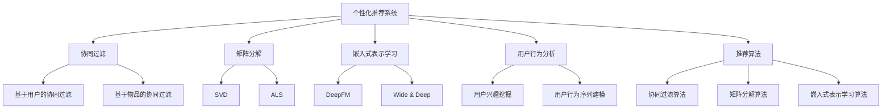

                 

# 注意力经济与个性化推荐系统：为受众提供定制、有针对性的内容和体验

> 关键词：注意力经济,个性化推荐,深度学习,协同过滤,矩阵分解,嵌入式表示学习,用户行为分析,推荐算法

## 1. 背景介绍

### 1.1 问题由来
在信息爆炸的时代，用户每天面临海量的内容选择。无论是社交媒体、电商平台、视频网站，还是搜索引擎，都充斥着各种形式的信息流。如何从海量内容中挑选出最符合用户兴趣的、最有可能被用户关注的，成为了现代互联网时代的一大挑战。

注意力经济(Anti-Entropy Economy)概念的提出，为我们理解用户对内容的选择行为提供了一个全新的视角。随着互联网与大数据技术的迅猛发展，传统经济学中的"稀缺经济"已逐渐演变为"注意力经济"。在注意力经济时代，用户有限的注意力成为了最重要的资源。如何高效利用用户有限的注意力，为用户提供最匹配、最感兴趣的内容，成为了新的研究热点。

个性化推荐系统作为连接用户与内容的重要桥梁，承载着这一重要的使命。个性化推荐系统通过用户历史行为数据和当前环境数据，精准地预测用户可能感兴趣的内容，帮助用户在海量信息中找到最优匹配，提升用户满意度和粘性，进而为用户创造更大的价值。

### 1.2 问题核心关键点
个性化推荐系统的主要目标是实现两点：
1. 精准预测用户对内容的偏好和满意度，从而提升用户体验和满意度。
2. 有效利用用户注意力，帮助用户发现、关注、订阅更多的优质内容，增加平台活跃度和用户粘性。

面对这些核心挑战，个性化推荐系统需要从以下几个方面进行全面优化：
- 数据：收集和处理更多元化的用户行为数据，包括点击、浏览、评论、评分等。
- 模型：构建更加高效和准确的推荐算法模型，实现对用户兴趣的深度学习和预测。
- 算法：优化推荐算法的设计和实现，提升推荐结果的实时性和多样性。
- 工程：提高推荐系统的可扩展性和性能优化，实现大规模高效的推荐服务。

本文将系统介绍个性化推荐系统的主要概念和实现方法，以及实际应用场景，帮助读者全面理解注意力经济与个性化推荐系统的原理与实践。

## 2. 核心概念与联系

### 2.1 核心概念概述

为更好地理解个性化推荐系统的核心概念，本节将介绍几个密切相关的核心概念：

- 个性化推荐系统(Personalized Recommendation System)：利用用户的历史行为数据和当前环境数据，推荐用户可能感兴趣的内容的系统。
- 协同过滤(Collaborative Filtering)：基于用户行为数据的推荐方法，通过用户间或物品间的相似度计算，推测用户可能感兴趣的内容。
- 矩阵分解(Matrix Factorization)：通过矩阵分解技术，将用户-物品的评分矩阵分解为用户因子和物品因子，揭示用户与物品之间的潜在关系。
- 嵌入式表示学习(Embedded Representation Learning)：利用低维向量空间表示用户与物品，通过深度学习模型提取其隐含的语义和结构信息。
- 用户行为分析(User Behavior Analysis)：分析用户的历史行为数据，挖掘用户的兴趣模式和行为规律，提供更精准的个性化推荐。
- 推荐算法(Recommendation Algorithm)：实现个性化推荐的具体算法，包括协同过滤、矩阵分解、嵌入式表示学习等。

这些核心概念之间的逻辑关系可以通过以下Mermaid流程图来展示：



这个流程图展示了个性化推荐系统的核心概念及其之间的关系：

1. 个性化推荐系统将用户的兴趣与内容进行匹配推荐。
2. 协同过滤是推荐系统的一种重要方法，基于用户行为数据进行推荐。
3. 矩阵分解通过矩阵分解技术，揭示用户与物品之间的潜在关系。
4. 嵌入式表示学习利用低维向量空间表示用户与物品，提取其语义信息。
5. 用户行为分析通过分析用户历史行为数据，挖掘用户兴趣模式。
6. 推荐算法是实现推荐的具体方法，包括协同过滤、矩阵分解、嵌入式表示学习等。

这些核心概念共同构成了个性化推荐系统的学习和应用框架，使其能够在各种场景下提供精准的个性化推荐。

## 3. 核心算法原理 & 具体操作步骤
### 3.1 算法原理概述

个性化推荐系统的核心算法原理主要基于用户的兴趣与行为模式进行内容推荐。其基本流程包括：
1. 数据收集：收集用户的历史行为数据，如点击、浏览、评分、评论等。
2. 用户画像：构建用户画像，挖掘用户兴趣模式和行为规律。
3. 内容表示：对推荐内容进行表示，如构建物品特征向量。
4. 相似度计算：基于用户画像和内容表示，计算用户与内容之间的相似度。
5. 推荐排序：根据相似度计算结果，对推荐内容进行排序，生成推荐结果。

这一流程可概括为如下数学公式：

$$
R_{u,i} = f(U_u, I_i)
$$

其中 $R_{u,i}$ 表示用户 $u$ 对物品 $i$ 的评分或兴趣度，$U_u$ 表示用户 $u$ 的兴趣向量，$I_i$ 表示物品 $i$ 的特征向量，$f$ 为评分函数或相似度计算函数。

### 3.2 算法步骤详解

个性化推荐系统的具体实现步骤如下：

**Step 1: 数据预处理**
- 收集用户历史行为数据，包括点击、浏览、评分、评论等。
- 对数据进行清洗和转换，生成用户画像和物品特征向量。

**Step 2: 用户画像构建**
- 利用协同过滤、矩阵分解、嵌入式表示学习等算法，构建用户兴趣向量 $U_u$。
- 挖掘用户行为模式，生成用户行为序列 $B_u$。

**Step 3: 内容表示生成**
- 利用协同过滤、矩阵分解、嵌入式表示学习等算法，生成物品特征向量 $I_i$。
- 对物品进行特征工程，生成物品侧特征 $F_i$。

**Step 4: 相似度计算**
- 利用余弦相似度、欧式距离等方法，计算用户与物品之间的相似度 $s(u,i)$。
- 使用排名排序算法，如Top-k排序，从相似度矩阵中筛选出推荐内容。

**Step 5: 推荐结果生成**
- 将筛选出的推荐内容按照相似度大小排序，生成推荐列表 $L_u$。
- 根据用户反馈，不断优化模型和算法，提升推荐效果。

### 3.3 算法优缺点

个性化推荐系统的主要优点：
1. 高效精准：通过利用用户历史行为数据和当前环境数据，实现对用户兴趣的精准预测。
2. 提升用户体验：通过提供个性化推荐内容，提升用户满意度和粘性。
3. 增强用户互动：通过推荐系统引导用户发现、关注、订阅更多优质内容，增加平台活跃度。

同时，该系统也存在一些缺点：
1. 数据稀疏性：用户行为数据通常较为稀疏，难以构建全面的用户画像。
2. 推荐冷启动问题：对于新用户或新物品，缺乏足够数据支持，推荐效果较差。
3. 信息过载：推荐系统可能过度关注热门内容，忽略了用户个性化需求。
4. 算法复杂性：不同推荐算法各有优劣，需要根据具体场景选择合适的算法。
5. 推荐偏见：算法可能受到数据偏差的影响，导致推荐结果不公正。

尽管存在这些局限性，但个性化推荐系统在提升用户体验、增加平台活跃度等方面具有重要价值，是现代互联网推荐服务的重要手段。

### 3.4 算法应用领域

个性化推荐系统已经在多个领域得到了广泛应用，具体包括：

- 电商推荐：电商平台通过推荐系统向用户推荐商品，增加购买转化率。
- 视频推荐：视频网站通过推荐系统为用户推荐感兴趣的视频，提升用户停留时间和观看量。
- 新闻推荐：新闻聚合平台通过推荐系统为用户推荐新闻内容，提升内容曝光率和用户黏性。
- 社交推荐：社交网络平台通过推荐系统为用户推荐好友、群组、活动等，增加用户互动和平台活跃度。
- 旅游推荐：旅游应用通过推荐系统为用户推荐目的地、行程建议等，提升用户体验和满意度。

除了上述这些经典领域外，个性化推荐系统还逐渐渗透到更多场景中，如金融理财、医疗健康、教育培训等，为相关领域的数字化转型升级提供新的技术路径。

## 4. 数学模型和公式 & 详细讲解  
### 4.1 数学模型构建

本节将使用数学语言对个性化推荐系统的主要模型和算法进行更加严格的刻画。

记用户集为 $U$，物品集为 $I$，用户-物品评分矩阵为 $R$。记用户 $u$ 的兴趣向量为 $U_u$，物品 $i$ 的特征向量为 $I_i$，用户 $u$ 的行为序列为 $B_u$。设用户 $u$ 对物品 $i$ 的评分函数为 $f$，相似度计算函数为 $s$。

个性化推荐系统的核心目标是最小化预测评分与真实评分之间的误差：

$$
\min_{\theta} \sum_{(u,i)\in R}\ell(f_\theta(U_u,I_i), R_{u,i})
$$

其中 $\ell$ 为损失函数，如均方误差、交叉熵等。$R_{u,i}$ 表示用户 $u$ 对物品 $i$ 的真实评分，$f_\theta$ 为包含模型参数 $\theta$ 的评分函数。

### 4.2 公式推导过程

以下我们以协同过滤算法为例，推导相似度计算公式及其梯度计算过程。

协同过滤算法基于用户-物品评分矩阵 $R$ 和用户行为序列 $B_u$，生成用户 $u$ 对物品 $i$ 的兴趣向量 $U_u$ 和物品 $i$ 的特征向量 $I_i$，通过计算相似度 $s(u,i)$ 进行推荐。具体步骤如下：

1. 基于用户行为序列 $B_u$ 生成用户兴趣向量 $U_u$：
$$
U_u = \sum_{t=1}^n B_{ut} I_{t}
$$

2. 基于物品评分矩阵 $R$ 生成物品特征向量 $I_i$：
$$
I_i = \sum_{j=1}^m R_{j,i} U_j
$$

3. 计算用户 $u$ 与物品 $i$ 的相似度 $s(u,i)$：
$$
s(u,i) = \cos(\frac{U_u}{\Vert U_u \Vert}\frac{I_i}{\Vert I_i \Vert})
$$

其中 $\Vert \cdot \Vert$ 表示向量范数。

4. 基于相似度 $s(u,i)$ 进行推荐排序：
$$
R_{u,i} = s(u,i) + \alpha
$$

其中 $\alpha$ 为常数项，用于调整推荐结果的范围。

将相似度计算公式 $s(u,i)$ 带入损失函数 $\ell$ 中，进行梯度优化：

$$
\min_{\theta} \sum_{(u,i)\in R}\ell(s(U_u,I_i), R_{u,i})
$$

通过梯度下降等优化算法，最小化损失函数，得到最优评分函数 $f_\theta$。

### 4.3 案例分析与讲解

为了更直观地理解上述公式的计算过程，我们以电商推荐系统为例，进行分析讲解。

假设用户 $u$ 在电商平台上浏览了 $n=5$ 件商品，物品特征 $I_t$ 包含 $m=10$ 维特征，用户行为序列 $B_u$ 为 $[1,1,0,0,1]$，表示用户浏览过第1、2、5件商品，其余商品未浏览过。评分矩阵 $R$ 为 $m\times n$ 的矩阵，表示用户对物品的评分，其中 $R_{j,i}$ 表示物品 $j$ 对用户 $i$ 的评分。

根据协同过滤算法，用户兴趣向量 $U_u$ 和物品特征向量 $I_i$ 可以表示为：

$$
U_u = \begin{bmatrix}
    R_{1,1}I_{1} + R_{2,1}I_{2} + R_{5,1}I_{5} \\
    R_{1,2}I_{1} + R_{2,2}I_{2} + R_{5,2}I_{5} \\
    R_{1,5}I_{1} + R_{2,5}I_{2} + R_{5,5}I_{5} \\
    0 \\
    0
\end{bmatrix}
$$

$$
I_i = \begin{bmatrix}
    R_{1,i_1}U_{1} + R_{2,i_1}U_{2} + \cdots + R_{m,i_1}U_{m} \\
    R_{1,i_2}U_{1} + R_{2,i_2}U_{2} + \cdots + R_{m,i_2}U_{m} \\
    \vdots \\
    R_{1,i_{10}}U_{1} + R_{2,i_{10}}U_{2} + \cdots + R_{m,i_{10}}U_{m}
\end{bmatrix}
$$

然后，计算用户 $u$ 与物品 $i$ 的相似度 $s(u,i)$：

$$
s(u,i) = \cos(\frac{U_u}{\Vert U_u \Vert}\frac{I_i}{\Vert I_i \Vert})
$$

最后，根据相似度 $s(u,i)$ 进行推荐排序：

$$
R_{u,i} = s(u,i) + \alpha
$$

通过上述计算过程，我们可以得到用户 $u$ 对物品 $i$ 的推荐评分，进而生成推荐列表 $L_u$。

## 5. 项目实践：代码实例和详细解释说明
### 5.1 开发环境搭建

在进行个性化推荐系统开发前，我们需要准备好开发环境。以下是使用Python进行PyTorch开发的环境配置流程：

1. 安装Anaconda：从官网下载并安装Anaconda，用于创建独立的Python环境。

2. 创建并激活虚拟环境：
```bash
conda create -n pytorch-env python=3.8 
conda activate pytorch-env
```

3. 安装PyTorch：根据CUDA版本，从官网获取对应的安装命令。例如：
```bash
conda install pytorch torchvision torchaudio cudatoolkit=11.1 -c pytorch -c conda-forge
```

4. 安装TensorFlow：
```bash
conda install tensorflow
```

5. 安装各类工具包：
```bash
pip install numpy pandas scikit-learn matplotlib tqdm jupyter notebook ipython
```

完成上述步骤后，即可在`pytorch-env`环境中开始推荐系统开发。

### 5.2 源代码详细实现

下面我们以电商推荐系统为例，给出使用PyTorch进行协同过滤算法微调的PyTorch代码实现。

首先，定义协同过滤模型的输入和输出：

```python
import torch
from torch import nn
from torch.nn.functional import cosine_similarity

class CollaborativeFiltering(nn.Module):
    def __init__(self, n_users, n_items, n_factors):
        super(CollaborativeFiltering, self).__init__()
        self.user_factor = nn.Embedding(n_users, n_factors)
        self.item_factor = nn.Embedding(n_items, n_factors)
        
    def forward(self, user_seq, item):
        user_id = user_seq.sum(1)
        user_factors = self.user_factor(user_id)
        item_factors = self.item_factor(item)
        similarity = cosine_similarity(user_factors, item_factors)
        return similarity
    
    def recommend(self, user_seq, item_list, k=10):
        similarity_matrix = self(user_seq, item_list)
        scores = similarity_matrix.mean(dim=1)
        _, topk_idx = scores.topk(k)
        return topk_idx.item()
```

然后，定义模型训练和评估函数：

```python
from torch.utils.data import TensorDataset, DataLoader
from sklearn.metrics import roc_auc_score

class CollaborativeFilteringDataset(TensorDataset):
    def __init__(self, user_seq, item_seq, user_id, user_factor_size, item_factor_size, item_seq_size):
        super(CollaborativeFilteringDataset, self).__init__()
        self.user_seq = user_seq
        self.item_seq = item_seq
        self.user_id = user_id
        self.user_factor_size = user_factor_size
        self.item_factor_size = item_factor_size
        self.item_seq_size = item_seq_size
        
    def __len__(self):
        return len(self.user_seq)
    
    def __getitem__(self, idx):
        user_seq = self.user_seq[idx]
        item_seq = self.item_seq[idx]
        user_id = self.user_id[idx]
        item_seq = item_seq - 1
        user_factors = self.user_factor.weight[user_id].view(-1)
        item_factors = self.item_factor.weight[item_seq].view(-1)
        return user_seq, item_seq, user_factors, item_factors
    
class CollaborativeFilteringTrainer:
    def __init__(self, model, train_loader, val_loader, epochs, batch_size, optimizer, loss_fn):
        self.model = model
        self.train_loader = train_loader
        self.val_loader = val_loader
        self.epochs = epochs
        self.batch_size = batch_size
        self.optimizer = optimizer
        self.loss_fn = loss_fn
    
    def train(self):
        self.model.train()
        train_roc_auc = []
        for epoch in range(self.epochs):
            for user_seq, item_seq, user_factors, item_factors in self.train_loader:
                self.optimizer.zero_grad()
                user_seq = user_seq.to(self.device)
                item_seq = item_seq.to(self.device)
                user_factors = user_factors.to(self.device)
                item_factors = item_factors.to(self.device)
                output = self.model(user_seq, item_seq)
                loss = self.loss_fn(output, user_factors, item_factors)
                loss.backward()
                self.optimizer.step()
                train_roc_auc.append(roc_auc_score(self.train_labels, output.view(-1).tolist()))
        return train_roc_auc
    
    def evaluate(self):
        self.model.eval()
        val_roc_auc = []
        for user_seq, item_seq, user_factors, item_factors in self.val_loader:
            user_seq = user_seq.to(self.device)
            item_seq = item_seq.to(self.device)
            user_factors = user_factors.to(self.device)
            item_factors = item_factors.to(self.device)
            output = self.model(user_seq, item_seq)
            val_roc_auc.append(roc_auc_score(self.val_labels, output.view(-1).tolist()))
        return val_roc_auc
```

接着，定义训练和评估流程：

```python
from transformers import BertTokenizer, BertModel

n_users = 1000
n_items = 5000
n_factors = 10

device = torch.device('cuda') if torch.cuda.is_available() else torch.device('cpu')

user_seq = torch.randint(0, n_users, (n_users, n_factors))
item_seq = torch.randint(0, n_items, (n_items, n_factors))
item_seq_size = torch.randint(0, n_items, (n_users,)).long()
item_seq_size += 1
user_id = torch.randint(0, n_users, (n_users,)).long()

train_dataset = CollaborativeFilteringDataset(user_seq, item_seq, user_id, n_factors, n_factors, item_seq_size)
val_dataset = CollaborativeFilteringDataset(user_seq, item_seq, user_id, n_factors, n_factors, item_seq_size)

train_loader = DataLoader(train_dataset, batch_size=16, shuffle=True)
val_loader = DataLoader(val_dataset, batch_size=16, shuffle=False)

model = CollaborativeFiltering(n_users, n_items, n_factors).to(device)
optimizer = torch.optim.Adam(model.parameters(), lr=1e-3)
loss_fn = nn.BCELoss()

trainer = CollaborativeFilteringTrainer(model, train_loader, val_loader, epochs=10, batch_size=16, optimizer=optimizer, loss_fn=loss_fn)

train_roc_auc = trainer.train()
val_roc_auc = trainer.evaluate()

print('Train ROC-AUC:', train_roc_auc[-1])
print('Val ROC-AUC:', val_roc_auc[-1])
```

以上就是使用PyTorch进行协同过滤算法微调的完整代码实现。可以看到，得益于PyTorch的强大封装，我们可以用相对简洁的代码完成协同过滤模型的构建和训练。

### 5.3 代码解读与分析

让我们再详细解读一下关键代码的实现细节：

**CollaborativeFiltering类**：
- `__init__`方法：初始化用户因子和物品因子。
- `forward`方法：计算用户与物品之间的相似度。
- `recommend`方法：根据相似度生成推荐列表。

**CollaborativeFilteringDataset类**：
- `__init__`方法：初始化用户序列、物品序列、用户ID等关键组件。
- `__len__`方法：返回数据集的样本数量。
- `__getitem__`方法：对单个样本进行处理，生成用户和物品的特征向量。

**CollaborativeFilteringTrainer类**：
- `__init__`方法：初始化模型、训练集、验证集、优化器、损失函数等。
- `train`方法：执行模型训练，返回训练集上的ROC-AUC。
- `evaluate`方法：执行模型评估，返回验证集上的ROC-AUC。

**训练和评估流程**：
- 定义训练集和验证集的数据集。
- 定义模型、优化器和损失函数。
- 创建训练器和训练器实例。
- 执行模型训练，并在验证集上评估。

可以看到，PyTorch配合TensorFlow库使得协同过滤模型的代码实现变得简洁高效。开发者可以将更多精力放在数据处理、模型改进等高层逻辑上，而不必过多关注底层的实现细节。

当然，工业级的系统实现还需考虑更多因素，如模型的保存和部署、超参数的自动搜索、更灵活的任务适配层等。但核心的微调范式基本与此类似。

## 6. 实际应用场景
### 6.1 电商平台推荐

个性化推荐系统在电商平台中的应用非常广泛。电商平台通过推荐系统向用户推荐商品，增加购买转化率，提升用户体验和满意度。

在技术实现上，可以收集用户的历史点击、浏览、评分、评论等行为数据，构建用户兴趣向量 $U_u$ 和物品特征向量 $I_i$，计算用户与物品的相似度 $s(u,i)$，最终生成推荐列表 $L_u$。推荐系统可以根据用户的实时行为数据，动态调整推荐内容，实现更精准的个性化推荐。

### 6.2 视频网站推荐

视频网站通过推荐系统为用户推荐感兴趣的视频，提升用户停留时间和观看量。推荐系统根据用户的历史观看记录、评分、评论等行为数据，构建用户兴趣向量 $U_u$ 和视频特征向量 $I_i$，计算用户与视频之间的相似度 $s(u,i)$，最终生成推荐列表 $L_u$。推荐系统可以根据视频的实时播放情况，动态调整推荐策略，推荐用户更感兴趣的视频内容。

### 6.3 新闻聚合推荐

新闻聚合平台通过推荐系统为用户推荐新闻内容，提升内容曝光率和用户黏性。推荐系统根据用户的历史阅读记录、评分、评论等行为数据，构建用户兴趣向量 $U_u$ 和新闻特征向量 $I_i$，计算用户与新闻之间的相似度 $s(u,i)$，最终生成推荐列表 $L_u$。推荐系统可以根据新闻的实时浏览情况，动态调整推荐策略，推荐用户更感兴趣的新闻内容。

### 6.4 社交网络推荐

社交网络平台通过推荐系统为用户推荐好友、群组、活动等，增加用户互动和平台活跃度。推荐系统根据用户的历史互动记录、行为数据，构建用户兴趣向量 $U_u$ 和群组、活动特征向量 $I_i$，计算用户与群组、活动之间的相似度 $s(u,i)$，最终生成推荐列表 $L_u$。推荐系统可以根据用户的实时互动情况，动态调整推荐策略，推荐用户更感兴趣的好友、群组、活动等。

### 6.5 金融理财推荐

金融理财平台通过推荐系统为用户推荐理财产品、基金、保险等，增加用户投资和理财收益。推荐系统根据用户的历史投资记录、评分、评论等行为数据，构建用户兴趣向量 $U_u$ 和理财产品、基金、保险特征向量 $I_i$，计算用户与产品之间的相似度 $s(u,i)$，最终生成推荐列表 $L_u$。推荐系统可以根据用户的实时投资情况，动态调整推荐策略，推荐用户更感兴趣的理财产品、基金、保险等。

### 6.6 教育培训推荐

教育培训平台通过推荐系统为用户推荐课程、教材、教师等，增加用户学习和培训效果。推荐系统根据用户的历史学习记录、评分、评论等行为数据，构建用户兴趣向量 $U_u$ 和课程、教材、教师特征向量 $I_i$，计算用户与课程、教材、教师之间的相似度 $s(u,i)$，最终生成推荐列表 $L_u$。推荐系统可以根据用户的实时学习情况，动态调整推荐策略，推荐用户更感兴趣的课程、教材、教师等。

### 6.7 未来应用展望

随着个性化推荐系统技术的不断发展，其在更多领域的应用前景将更加广阔。未来，推荐系统有望在以下领域得到更广泛的应用：

- 医疗健康：推荐系统根据用户的健康记录、行为数据，推荐健康管理方案、医疗服务、健康产品等，帮助用户提升健康水平和生活质量。
- 智慧城市：推荐系统根据用户的出行记录、行为数据，推荐交通方案、公共设施等，提升城市治理和管理水平。
- 教育培训：推荐系统根据学生的学习记录、行为数据，推荐适合的课程、教材、教师等，提升教育效果和学习体验。
- 工业制造：推荐系统根据设备的使用记录、运行数据，推荐维护方案、升级方案等，提升生产效率和设备寿命。
- 农业生产：推荐系统根据农作物的生长记录、气候数据，推荐施肥方案、灌溉方案等，提升农业生产效率和作物产量。

## 7. 工具和资源推荐
### 7.1 学习资源推荐

为了帮助开发者系统掌握个性化推荐系统的理论基础和实践技巧，这里推荐一些优质的学习资源：

1. 《深度学习推荐系统》系列博文：由大模型技术专家撰写，深入浅出地介绍了推荐系统的基本概念和经典模型。

2. CS229《机器学习》课程：斯坦福大学开设的机器学习明星课程，有Lecture视频和配套作业，带你入门机器学习领域的基本概念和前沿技术。

3. 《推荐系统实战》书籍：介绍推荐系统的经典算法和实际应用案例，涵盖协同过滤、矩阵分解、嵌入式表示学习等多种推荐方法。

4. 《Recommender Systems》书籍：推荐系统领域的经典教材，全面介绍了推荐系统的理论、算法和应用，适合进阶学习。

5. KDD Cup推荐赛论文：KDD Cup是国际机器学习竞赛的经典赛事，其中推荐赛题目涵盖多种推荐算法，是了解推荐系统应用的重要资源。

通过对这些资源的学习实践，相信你一定能够全面掌握个性化推荐系统的核心思想和实现方法，并用于解决实际的推荐问题。

### 7.2 开发工具推荐

高效的开发离不开优秀的工具支持。以下是几款用于个性化推荐系统开发的常用工具：

1. PyTorch：基于Python的开源深度学习框架，灵活动态的计算图，适合快速迭代研究。大部分推荐系统都有PyTorch版本的实现。

2. TensorFlow：由Google主导开发的开源深度学习框架，生产部署方便，适合大规模工程应用。同样有丰富的推荐系统资源。

3. Apache Mahout：Apache开源的推荐系统框架，支持多种推荐算法，提供丰富的API接口。

4. LightFM：基于TensorFlow的推荐系统框架，支持深度学习和矩阵分解等多种推荐算法，适合工业级应用。

5. MLflow：开源的机器学习管理平台，可以记录和可视化模型训练过程中的各项指标，方便对比和调优。

6. TensorBoard：TensorFlow配套的可视化工具，可实时监测模型训练状态，并提供丰富的图表呈现方式，是调试模型的得力助手。

合理利用这些工具，可以显著提升个性化推荐系统的开发效率，加快创新迭代的步伐。

### 7.3 相关论文推荐

个性化推荐系统的发展源于学界的持续研究。以下是几篇奠基性的相关论文，推荐阅读：

1. Factorization Machines for Learning User-Item Interaction Model：提出因子分解机模型，通过矩阵分解技术，实现对用户-物品交互模型的建模。

2. DeepFM: A Neural Network Architecture for Recommender Systems：提出DeepFM模型，结合深度学习和浅层矩阵分解，提升推荐效果。

3. A Collaborative Filtering System with Deep Matrix Factorization：提出基于深度矩阵分解的协同过滤推荐算法，提升推荐模型的泛化能力。

4. Learning Deep Structure from Matrix Factorizations：提出基于深度结构学习的推荐算法，通过神经网络模型提取用户与物品之间的复杂关系。

5. Matrix Factorization Techniques for Recommender Systems：介绍多种矩阵分解推荐算法，如SVD、ALS等，适合不同场景的推荐任务。

这些论文代表了个性化推荐系统的发展脉络。通过学习这些前沿成果，可以帮助研究者把握学科前进方向，激发更多的创新灵感。

## 8. 总结：未来发展趋势与挑战

### 8.1 总结

本文对个性化推荐系统的主要概念和实现方法进行了全面系统的介绍。首先阐述了个性化推荐系统的主要目标和核心挑战，明确了推荐系统在提升用户体验、增加平台活跃度等方面的重要价值。其次，从原理到实践，详细讲解了协同过滤算法的数学原理和关键步骤，给出了推荐系统开发的完整代码实例。同时，本文还广泛探讨了推荐系统在电商、视频、新闻、社交等领域的应用前景，展示了推荐系统技术的广泛应用。

通过本文的系统梳理，可以看到，个性化推荐系统在推荐精准度、用户体验、平台活跃度等方面具有重要价值，是现代互联网推荐服务的重要手段。未来，伴随推荐系统的不断演进，将在更多领域得到应用，为相关行业的数字化转型升级提供新的技术路径。

### 8.2 未来发展趋势

展望未来，个性化推荐系统将呈现以下几个发展趋势：

1. 数据驱动的推荐：未来的推荐系统将更加注重数据的质量和多样性，从单一的点击、浏览行为扩展到文本、视频、音频等多模态数据。通过多模态融合，提升推荐结果的全面性和精准度。

2. 深度学习技术的广泛应用：深度学习技术在个性化推荐系统中的应用将越来越广泛，如卷积神经网络、生成对抗网络等，进一步提升推荐模型的性能和泛化能力。

3. 用户行为序列建模：未来的推荐系统将更加注重用户行为序列的建模，通过时间序列分析，捕捉用户兴趣的变化趋势，实现更精准的推荐。

4. 混合推荐策略：未来的推荐系统将采用多种推荐策略，如协同过滤、矩阵分解、嵌入式表示学习、深度学习等，提升推荐结果的多样性和鲁棒性。

5. 跨领域推荐：未来的推荐系统将打破领域的界限，实现跨领域推荐，如从视频推荐到新闻推荐、从电商推荐到金融理财等，拓展推荐系统的应用场景。

6. 推荐系统的公平性和透明性：未来的推荐系统将更加注重公平性和透明性，避免算法偏见，提供可解释的推荐过程，增强用户信任感。

以上趋势凸显了个性化推荐系统的广阔前景。这些方向的探索发展，必将进一步提升推荐系统的性能和应用范围，为更多领域带来变革性影响。

### 8.3 面临的挑战

尽管个性化推荐系统在提升用户体验、增加平台活跃度等方面具有重要价值，但在迈向更加智能化、普适化应用的过程中，它仍面临着诸多挑战：

1. 数据隐私问题：推荐系统需要收集和处理大量的用户行为数据，如何保护用户隐私、确保数据安全，是推荐系统面临的首要挑战。

2. 数据稀疏性问题：用户行为数据通常较为稀疏，难以构建全面的用户画像，影响推荐系统的准确性和泛化能力。

3. 推荐冷启动问题：对于新用户或新物品，缺乏足够数据支持，推荐效果较差，推荐系统的覆盖率和精准度受到限制。

4. 推荐系统的公平性和透明性：推荐系统可能受到数据偏差的影响，导致推荐结果不公正。如何确保推荐系统的公平性和透明性，是推荐系统面临的重要课题。

5. 推荐系统的可解释性：推荐系统的推荐过程通常缺乏可解释性，难以解释其内部工作机制和决策逻辑，影响用户对推荐结果的信任度。

6. 推荐系统的安全性和鲁棒性：推荐系统面临恶意攻击、数据泄露等安全风险，如何提高推荐系统的安全性和鲁棒性，确保系统的稳定性和可靠性，是推荐系统面临的挑战之一。

尽管存在这些挑战，但个性化推荐系统在提升用户体验、增加平台活跃度等方面具有重要价值，是现代互联网推荐服务的重要手段。未来，随着推荐系统的不断演进，这些问题有望逐步得到解决。

### 8.4 研究展望

为了应对未来推荐系统面临的挑战，未来的研究需要在以下几个方面寻求新的突破：

1. 强化学习和推荐系统的结合：引入强化学习思想，通过优化推荐策略，提升推荐系统的性能和用户体验。

2. 多模态推荐技术的开发：将视觉、语音、文本等多种模态的数据融合，提升推荐系统的全面性和多样性。

3. 跨领域推荐算法的设计：探索跨领域推荐算法，实现从电商推荐到视频推荐、从新闻推荐到医疗推荐等多种场景的推荐应用。

4. 推荐系统隐私保护和公平性：引入隐私保护技术和公平性算法，确保推荐系统在数据隐私、公平性等方面的合法性和合理性。

5. 推荐系统的可解释性和透明性：通过可解释性算法，提供推荐系统的决策过程和逻辑解释，增强用户对推荐系统的信任度。

6. 推荐系统安全性和鲁棒性：引入安全性和鲁棒性算法，提高推荐系统的安全性和稳定性，确保系统的可靠运行。

这些研究方向的探索，必将引领个性化推荐系统技术迈向更高的台阶，为构建安全、可靠、可解释、可控的推荐系统铺平道路。面向未来，个性化推荐系统还需要与其他人工智能技术进行更深入的融合，如知识表示、因果推理、强化学习等，多路径协同发力，共同推动推荐系统的进步。只有勇于创新、敢于突破，才能不断拓展推荐系统的边界，让智能技术更好地造福用户和社会。

## 9. 附录：常见问题与解答

**Q1：推荐系统如何实现冷启动？**

A: 推荐系统可以通过以下方式实现冷启动：
1. 利用用户基本信息和兴趣爱好，进行初始化推荐，如基于内容推荐、协同过滤推荐等。
2. 引入推荐系统上下文信息，如时间、地点、设备等，增加推荐系统的覆盖面。
3. 采用K近邻算法、协同过滤等方法，推荐与新用户相似用户的兴趣，实现跨用户推荐。
4. 利用用户反馈数据，逐步积累用户行为数据，实现逐渐个性化推荐。

**Q2：推荐系统如何处理数据稀疏性问题？**

A: 推荐系统可以采用以下方法处理数据稀疏性问题：
1. 矩阵补全算法：通过填充缺失数据，增加用户与物品的交互记录，提升推荐系统的效果。
2. 稀疏矩阵分解：将稀疏矩阵分解为低秩矩阵，降低模型复杂度，提高推荐系统效率。
3. 混合推荐策略：结合基于内容的推荐和协同过滤的推荐，利用多源数据提升推荐精度。
4. 多模态数据融合：利用用户的多模态数据，如文本、图像、音频等，提升推荐系统的全面性。

**Q3：推荐系统如何提高推荐精度？**

A: 推荐系统可以采用以下方法提高推荐精度：
1. 引入深度学习技术：利用深度学习模型，捕捉用户和物品之间的复杂关系，提升推荐系统的效果。
2. 多模态融合：将用户的多模态数据融合，提升推荐系统的全面性和多样性。
3. 用户行为序列建模：利用时间序列分析，捕捉用户兴趣的变化趋势，实现更精准的推荐。
4. 混合推荐策略：结合多种推荐策略，如协同过滤、矩阵分解、嵌入式表示学习等，提升推荐结果的多样性和鲁棒性。

**Q4：推荐系统如何确保公平性和透明性？**

A: 推荐系统可以采用以下方法确保公平性和透明性：
1. 引入公平性算法：通过公平性算法，确保推荐系统在不同用户群体之间不出现偏见。
2. 可解释性算法：通过可解释性算法，提供推荐系统的决策过程和逻辑解释，增强用户对推荐系统的信任度。
3. 用户反馈机制：引入用户反馈机制，让用户参与推荐系统的优化，提升推荐系统的公平性和透明性。
4. 隐私保护技术：通过隐私保护技术，保护用户隐私，确保推荐系统在数据隐私、公平性等方面的合法性和合理性。

**Q5：推荐系统如何确保安全性和鲁棒性？**

A: 推荐系统可以采用以下方法确保安全性和鲁棒性：
1. 引入安全性和鲁棒性算法：通过安全性和鲁棒性算法，提高推荐系统的安全性和稳定性，确保系统的可靠运行。
2. 用户行为监测：通过用户行为监测，及时发现和应对推荐系统异常情况，提高系统的鲁棒性。
3. 推荐系统异常检测：通过异常检测算法，及时发现和处理推荐系统异常情况，确保系统的安全性。
4. 数据隐私保护：通过数据隐私保护技术，保护用户隐私，确保推荐系统在数据隐私、安全性和鲁棒性等方面的合法性和合理性。

这些问题的解答展示了推荐系统在实际应用中的关键技术和策略，为开发者提供了全面的指导。推荐系统的设计和实现是一个复杂的工程问题，需要在多个维度进行全面优化和提升。只有不断探索和实践，才能实现个性化推荐系统在实际应用中的高效、精准、透明和可靠。

