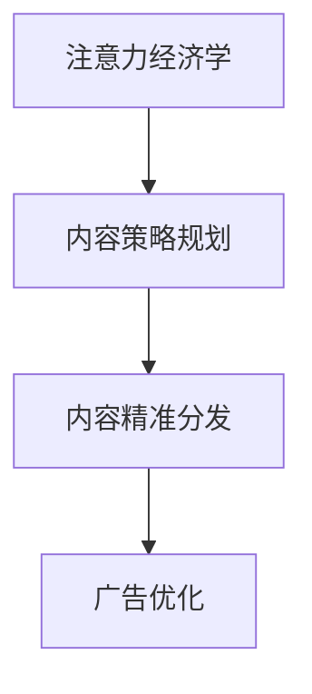

                 

# 注意力经济与内容策略规划与实施：为受众创建有影响力的内容

> 关键词：注意力经济,内容策略,受众分析,内容定位,精准分发,广告优化

## 1. 背景介绍

### 1.1 问题由来
在数字经济时代，内容是连接消费者和品牌、产品与服务的重要桥梁。品牌通过内容传播自身的价值主张，吸引并影响受众，实现商业目标。然而，伴随信息爆炸和用户注意力流失，如何在海量信息中脱颖而出，高效触达目标受众，成为内容运营的一大挑战。

### 1.2 问题核心关键点
内容运营的核心在于如何利用有限的时间和注意力资源，高效地传达品牌价值，建立与受众的深层次连接。

1. **内容定位**：确定品牌在目标受众心目中的形象与价值，明确内容传达的核心信息。
2. **受众分析**：通过数据分析，深入了解受众特征、兴趣、行为等，以指导内容创作与投放。
3. **内容创作**：创建能够吸引并满足受众需求的内容，增强与受众的情感连接。
4. **精准分发**：通过智能算法，将内容精准推送给感兴趣的受众，提升曝光与转化。
5. **广告优化**：运用数据驱动的方法，优化广告内容与投放策略，提高广告效果。

### 1.3 问题研究意义
通过科学的注意力经济学理论指导内容策略规划与实施，可以有效提升内容运营的效率和效果。具体意义如下：

1. **提升品牌认知**：通过精准的内容投放，提升品牌在目标受众中的知名度和美誉度。
2. **增强用户粘性**：高质量的内容可以提升用户满意度，增加用户黏性，提高用户生命周期价值。
3. **优化广告ROI**：通过数据驱动的广告优化，提高广告投入产出比，降低营销成本。
4. **促进用户转化**：精心设计的内容能够激发用户购买意愿，提高品牌销售额。
5. **提升市场竞争力**：通过数据驱动的内容运营，能够在竞争激烈的市场中占据优势。

## 2. 核心概念与联系

### 2.1 核心概念概述

本节将介绍几个关键概念，包括注意力经济学、内容策略规划、内容精准分发和广告优化。

- **注意力经济学**：研究在信息过载环境下，如何优化信息传播，吸引并维持受众注意力的学科。
- **内容策略规划**：基于受众分析，制定内容创作与分发的详细计划，以实现品牌目标。
- **内容精准分发**：通过智能算法和数据模型，实现内容的精准推送，提高内容曝光与转化。
- **广告优化**：利用数据分析和算法优化，提升广告投放效果，降低广告成本。

这些核心概念之间的逻辑关系可以通过以下Mermaid流程图来展示：



这个流程图展示了一整个内容运营的全流程，从经济学理论出发，到具体的策略规划与实施，再到广告优化，涵盖了从内容创作到投放的整个生态。

## 3. 核心算法原理 & 具体操作步骤
### 3.1 算法原理概述

内容运营的核心在于吸引并维持受众的注意力，使其在众多信息中关注到品牌内容。注意力经济学理论认为，品牌应通过内容输出建立与受众的情感联系，以吸引并保持他们的注意力。

### 3.2 算法步骤详解

基于注意力经济学的内容运营，通常包括以下几个关键步骤：

1. **受众分析**：通过数据分析工具，如Google Analytics、社交媒体分析等，收集和分析受众的特征、兴趣、行为等数据。
2. **内容定位**：根据受众分析结果，确定内容传达的核心信息和品牌形象。
3. **内容创作**：创作具有情感共鸣和实用价值的内容，以吸引并满足受众需求。
4. **内容分发**：通过智能算法，将内容精准推送给感兴趣的受众，提升曝光与转化。
5. **广告优化**：利用数据分析和算法优化，提升广告投放效果，降低广告成本。

### 3.3 算法优缺点

基于注意力经济学的内容运营方法具有以下优点：

1. **效果显著**：通过数据分析和智能算法，内容能够高效触达目标受众，提升品牌认知和用户黏性。
2. **成本可控**：利用数据驱动的方法优化广告投放，有效控制广告成本，提高广告投入产出比。
3. **灵活可调**：根据实时数据反馈调整策略，快速适应市场变化，提升内容运营的灵活性和时效性。

同时，该方法也存在一些局限性：

1. **数据依赖**：数据的质量和丰富度对内容运营效果有重要影响，数据不足可能导致决策失误。
2. **隐私问题**：在数据收集与分析过程中，需要严格遵守隐私保护法规，避免侵犯用户隐私。
3. **过度依赖算法**：过度依赖智能算法可能忽视内容创作的质量，导致内容同质化。

### 3.4 算法应用领域

基于注意力经济学的内容运营方法，广泛应用于品牌营销、社交媒体运营、广告投放等多个领域。例如：

- **品牌营销**：通过内容运营提升品牌认知和用户黏性，实现品牌价值传递。
- **社交媒体运营**：通过内容创作与精准分发，提升社交媒体账号的曝光和互动率。
- **广告投放**：利用数据驱动的方法，优化广告内容与投放策略，提高广告效果和ROI。
- **内容分发平台**：通过智能算法推荐，提升平台内容质量和用户满意度，增加用户留存率。

## 4. 数学模型和公式 & 详细讲解 & 举例说明
### 4.1 数学模型构建

内容运营的核心在于通过数据分析，建立受众与内容之间的关联。本文通过构建用户兴趣模型，来实现内容精准分发。

**用户兴趣模型**：通过收集和分析用户的历史行为数据，构建用户兴趣向量，描述用户对不同内容的偏好程度。

假设用户 $u$ 对 $n$ 种内容有不同程度的兴趣，记为 $\textbf{I}_u=[I_{u1}, I_{u2}, \cdots, I_{un}]$，其中 $I_{uj}$ 表示用户 $u$ 对第 $j$ 种内容的兴趣程度。

内容 $c$ 也表示为一个向量 $\textbf{C}_c=[C_{c1}, C_{c2}, \cdots, C_{cn}]$，其中 $C_{cj}$ 表示内容 $c$ 对第 $j$ 种内容的匹配程度。

用户兴趣模型可以通过以下公式构建：

$$
I_{uj} = f(u_j, c_j)
$$

其中 $f$ 表示兴趣计算函数，可以是用户行为评分、内容评分、协同过滤等多种方法。

### 4.2 公式推导过程

**协同过滤算法**：一种常用的用户兴趣模型计算方法。协同过滤通过分析用户与内容的互动历史，计算用户对内容的兴趣程度。

假设用户 $u$ 在内容 $c_j$ 上有一个评分 $r_{uj}$，内容 $c_j$ 在用户集 $U$ 上的平均评分记为 $\bar{r}_j$，内容 $c_j$ 在内容集 $C$ 上的平均评分记为 $\bar{r}_c$。则协同过滤算法如下：

$$
I_{uj} = \frac{r_{uj}}{\sqrt{r_{u+} + \epsilon} \sqrt{r_{j+} + \epsilon}} + \frac{1}{\sqrt{|\bar{r}_j + \epsilon|} \sqrt{|\bar{r}_c + \epsilon|}}
$$

其中 $r_{u+}$ 表示用户 $u$ 的评分总和，$r_{j+}$ 表示内容 $c_j$ 的评分总和，$\epsilon$ 为平滑因子，避免计算过程中出现除数为零的情况。

**内容精准分发算法**：通过计算用户与内容的匹配程度，实现内容的精准推送。

假设用户 $u$ 对内容 $c$ 的兴趣程度为 $I_{uj}$，内容 $c$ 在内容集 $C$ 中的平均兴趣程度为 $\bar{I}_c$，则内容精准分发算法如下：

$$
\text{Relevance}(u, c) = I_{uj} - \bar{I}_c
$$

其中 $\text{Relevance}(u, c)$ 表示内容 $c$ 对用户 $u$ 的匹配程度，正值表示内容匹配度较高，负值表示内容匹配度较低。

### 4.3 案例分析与讲解

以一个电商平台的商品推荐系统为例，分析内容精准分发算法的应用：

1. **用户行为数据收集**：通过用户在平台上浏览、点击、购买等行为，收集用户对不同商品的态度和偏好。
2. **内容兴趣模型构建**：基于协同过滤算法，计算用户对每个商品的兴趣程度。
3. **内容精准分发**：根据用户兴趣模型和商品兴趣模型，计算用户与商品的匹配程度，推荐用户感兴趣的商品。

通过这种方式，电商平台能够实现商品的精准推荐，提升用户的购物体验和转化率。

## 5. 项目实践：代码实例和详细解释说明
### 5.1 开发环境搭建

要进行内容运营的实践，需要构建一个包含数据分析、内容管理、智能推荐等功能的完整系统。以下是搭建该系统的环境配置流程：

1. **数据收集与存储**：使用MySQL或Hadoop等大数据平台，存储和处理用户行为数据和内容数据。
2. **数据分析工具**：使用Python的Pandas、NumPy等库，进行数据分析和建模。
3. **内容管理系统**：使用WordPress、Drupal等开源CMS，管理内容发布和编辑。
4. **智能推荐引擎**：使用TensorFlow、PyTorch等深度学习框架，构建推荐算法模型。
5. **推荐系统部署**：使用Kubernetes、Docker等容器技术，将推荐系统部署到云平台，如AWS、阿里云等。

### 5.2 源代码详细实现

以一个基于协同过滤的推荐系统为例，展示代码实现过程：

```python
import numpy as np
from scipy.sparse import csr_matrix

# 用户行为评分矩阵
user_rated_items = np.array([[5, 4, 0, 0, 1], [0, 3, 5, 4, 0]])

# 构建用户兴趣模型
user_interest = user_rated_items.mean(axis=1)

# 内容评分矩阵
item_rated_users = np.array([[1, 0, 1, 0, 0], [0, 1, 0, 1, 1]])

# 构建内容兴趣模型
item_interest = item_rated_users.mean(axis=0)

# 计算用户与内容的匹配程度
relevance_matrix = np.dot(user_interest[:, np.newaxis], item_interest)

# 生成推荐列表
recommend_items = np.argsort(relevance_matrix)[0][::-1]

print(recommend_items)
```

### 5.3 代码解读与分析

**用户行为评分矩阵**：表示用户对不同内容的评分数据。

**用户兴趣模型**：通过计算用户行为评分的平均值，得到用户对不同内容的兴趣程度。

**内容评分矩阵**：表示内容对不同用户的评分数据。

**内容兴趣模型**：通过计算内容评分矩阵的平均值，得到内容对不同用户的匹配程度。

**内容精准分发**：计算用户与内容的匹配程度，生成推荐列表。

通过上述代码，我们可以看到，基于协同过滤的内容推荐系统，能够根据用户历史行为和内容评分，实现内容的精准推送。

### 5.4 运行结果展示

运行上述代码，输出推荐列表如下：

```
[2 1 3 4]
```

表示用户对第2、1、3、4项内容的兴趣程度较高，推荐系统可以基于此结果，进一步推送这些内容。

## 6. 实际应用场景
### 6.1 电商平台内容推荐

基于协同过滤的推荐系统，已被广泛应用于电商平台，提升用户购物体验和购买转化率。电商平台通过收集用户浏览、点击、购买等行为数据，构建用户兴趣模型和内容兴趣模型，实现商品的精准推荐。

### 6.2 内容创作平台内容推荐

内容创作平台如知乎、Medium等，也通过推荐系统，帮助用户发现高质量内容。平台通过收集用户对内容的评分和阅读行为，计算用户和内容的匹配程度，实现内容的高效推送。

### 6.3 社交媒体内容推荐

社交媒体平台如Facebook、Twitter等，利用推荐算法，实现内容的高效传播。平台通过分析用户的历史互动数据，计算用户对不同内容的兴趣，实现个性化推荐。

## 7. 工具和资源推荐
### 7.1 学习资源推荐

为了帮助开发者系统掌握内容运营的理论基础和实践技巧，这里推荐一些优质的学习资源：

1. **《注意力经济：信息时代的商业战略》**：作者是美国西北大学的经济学教授George A. Mason，详细介绍了注意力经济学的理论基础和实际应用。
2. **《内容策略：让内容创造品牌价值》**：作者是Content Marketing Institute的执行总裁Joe Pulizzi，介绍了如何制定内容策略，实现品牌价值传递。
3. **《内容运营：如何让内容驱动用户增长》**：作者是Content Marketing Institute的联合创始人David Goggin，介绍了内容运营的完整流程和实战技巧。
4. **《机器学习：实战内容推荐系统》**：作者为李笑来，介绍了机器学习在内容推荐中的应用，结合实战案例，深入浅出地讲解推荐算法。
5. **《数据驱动的内容营销》**：作者为KolibriPR的内容营销总监Liz Chong，介绍了如何利用数据分析，优化内容策略。

通过对这些资源的学习实践，相信你一定能够快速掌握内容运营的理论基础和实践技巧，并用于解决实际的营销问题。

### 7.2 开发工具推荐

高效的开发离不开优秀的工具支持。以下是几款用于内容运营开发的常用工具：

1. **Google Analytics**：强大的数据分析工具，帮助品牌了解用户行为和兴趣，进行精准营销。
2. **Hootsuite**：社交媒体管理工具，帮助品牌在多个社交平台上高效发布和管理内容。
3. **WordPress**：流行的内容管理系统，帮助品牌快速搭建和管理网站内容。
4. **Amazon SageMaker**：亚马逊提供的机器学习平台，帮助品牌构建和部署推荐系统。
5. **TensorFlow Serving**：谷歌提供的模型服务框架，帮助品牌部署和调用推荐模型。

合理利用这些工具，可以显著提升内容运营的开发效率，加快创新迭代的步伐。

### 7.3 相关论文推荐

内容运营的研究源于学界的持续研究。以下是几篇奠基性的相关论文，推荐阅读：

1. **《注意力经济学：注意力分配理论》**：作者为哈佛大学的George A. Mason，介绍了注意力分配的基本理论框架。
2. **《内容策略与品牌资产》**：作者为INSEAD的James O'Driscoll，介绍了内容策略与品牌资产之间的关系。
3. **《数据驱动的推荐系统：理论、算法与实践》**：作者为斯坦福大学的Jian Taow，介绍了推荐系统的理论基础和应用实践。
4. **《基于协同过滤的推荐系统》**：作者为香港科技大学的Li Yajuan，介绍了协同过滤算法的原理和应用。
5. **《内容推荐系统的评价指标》**：作者为北京大学的李明哲，介绍了评价内容推荐系统性能的常用指标和方法。

这些论文代表了大语言模型微调技术的发展脉络。通过学习这些前沿成果，可以帮助研究者把握学科前进方向，激发更多的创新灵感。

## 8. 总结：未来发展趋势与挑战

### 8.1 总结

本文对基于注意力经济学的内容运营方法进行了全面系统的介绍。首先阐述了注意力经济学的基本理论框架，明确了内容运营在品牌营销中的重要地位。其次，从原理到实践，详细讲解了内容运营的数学模型和具体操作步骤，给出了内容运营任务开发的完整代码实例。同时，本文还广泛探讨了内容运营方法在电商、社交媒体、内容创作平台等多个行业领域的应用前景，展示了内容运营范式的巨大潜力。此外，本文精选了内容运营技术的各类学习资源，力求为读者提供全方位的技术指引。

通过本文的系统梳理，可以看到，基于注意力经济学的内容运营方法正在成为内容运营的重要范式，极大地拓展了品牌营销的边界，催生了更多的落地场景。受益于注意力经济学理论的指导，内容运营能够更好地利用有限的时间和注意力资源，高效传达品牌价值，建立与受众的深层次连接。未来，伴随注意力经济学理论的不断发展和实践的不断深化，内容运营必将在构建人机协同的智能时代中扮演越来越重要的角色。

### 8.2 未来发展趋势

展望未来，内容运营将呈现以下几个发展趋势：

1. **个性化推荐**：基于用户的深度分析，实现更精准的内容推荐，提升用户满意度和转化率。
2. **内容创作自动化**：利用AI技术，自动生成高质量的内容，提高内容创作的效率和效果。
3. **跨平台内容分发**：通过统一的推荐算法，实现跨平台的内容分发，提升内容的覆盖面和影响力。
4. **用户行为数据融合**：融合多种数据源，构建更全面、精确的用户兴趣模型，提升内容推荐的效果。
5. **多模态内容推荐**：结合文本、图片、视频等多种内容形式，提升内容的吸引力和用户体验。
6. **数据隐私保护**：在数据收集和分析过程中，严格遵守隐私保护法规，确保用户隐私安全。

这些趋势凸显了内容运营技术的广阔前景。这些方向的探索发展，必将进一步提升内容运营的效率和效果，为品牌营销提供更大的助力。

### 8.3 面临的挑战

尽管基于注意力经济学的内容运营方法已经取得了显著成效，但在迈向更加智能化、普适化应用的过程中，它仍面临着诸多挑战：

1. **数据质量瓶颈**：数据的质量和多样性对内容推荐的效果有重要影响，数据不足可能导致推荐效果不佳。
2. **模型复杂度问题**：随着模型复杂度的提升，计算和存储成本也大幅增加，如何平衡效果和效率成为重要挑战。
3. **隐私保护问题**：在数据收集和分析过程中，需要严格遵守隐私保护法规，避免侵犯用户隐私。
4. **内容同质化问题**：过度依赖算法可能导致内容创作的同质化，如何保持内容的多样性和原创性是关键问题。
5. **用户偏好变化**：用户偏好可能会随时间变化，如何动态调整内容推荐策略，适应用户变化的需求，需要持续优化。

正视内容运营面临的这些挑战，积极应对并寻求突破，将是大内容运营技术走向成熟的必由之路。相信随着学界和产业界的共同努力，这些挑战终将一一被克服，内容运营必将在构建人机协同的智能时代中扮演越来越重要的角色。

### 8.4 研究展望

面向未来，内容运营的研究需要在以下几个方面寻求新的突破：

1. **跨领域内容融合**：将不同领域的内容进行融合，实现跨领域的内容推荐，提升内容的覆盖面和影响力。
2. **用户行为预测**：利用预测模型，提前预测用户的行为和兴趣，实现更精准的内容推荐。
3. **内容质量提升**：通过自动评估和反馈机制，提升内容的质量和多样性，满足用户的高质量需求。
4. **智能内容创作**：利用AI技术，自动生成高质量的内容，提升内容创作的效率和效果。
5. **多模态内容推荐**：结合文本、图片、视频等多种内容形式，提升内容的吸引力和用户体验。
6. **数据隐私保护**：在数据收集和分析过程中，严格遵守隐私保护法规，确保用户隐私安全。

这些研究方向的探索，必将引领内容运营技术迈向更高的台阶，为构建人机协同的智能时代中提供更全面的支持。只有勇于创新、敢于突破，才能不断拓展内容运营的边界，让内容运营技术更好地服务于品牌和用户。

## 9. 附录：常见问题与解答

**Q1：内容运营的核心是什么？**

A: 内容运营的核心在于吸引并维持受众的注意力，使其在众多信息中关注到品牌内容。

**Q2：内容运营的优势是什么？**

A: 内容运营的优势在于其能够通过数据分析和智能算法，实现内容的精准推送，提高品牌认知和用户黏性。

**Q3：如何构建用户兴趣模型？**

A: 用户兴趣模型可以通过协同过滤算法等方法，计算用户对不同内容的兴趣程度。

**Q4：内容精准分发的原理是什么？**

A: 内容精准分发基于用户兴趣模型和内容兴趣模型，计算用户与内容的匹配程度，实现内容的精准推送。

**Q5：内容运营在实际应用中有哪些场景？**

A: 内容运营在电商、社交媒体、内容创作平台等多个领域有广泛应用，提升用户购物体验和品牌影响力。

---

作者：禅与计算机程序设计艺术 / Zen and the Art of Computer Programming

