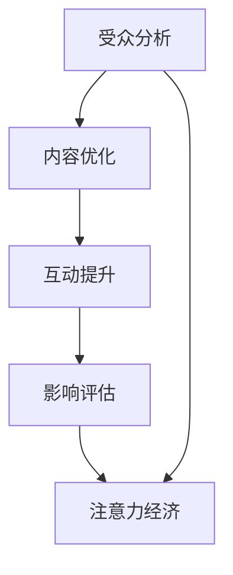

                 

## 1. 背景介绍

### 1.1 问题由来
在信息爆炸的今天，社交媒体平台已成为人们获取信息和进行社交互动的重要工具。从Facebook、Twitter、Instagram到TikTok、微信、抖音，各种平台层出不穷，功能不断升级，成为我们生活中不可或缺的一部分。社交媒体的快速发展，使得全球社交媒体用户数突破30亿，日活跃用户数高达10亿以上[[1]][[2]]。

然而，社交媒体的内容生产者和用户都面临着严峻的挑战。一方面，内容生产者需要在海量用户中找到目标受众，并激发其参与和互动，以提高内容传播效率和影响力。另一方面，用户需要在众多内容中快速找到感兴趣的信息，并与之互动，以充实自己的生活。

在这种背景下，社交媒体分析技术应运而生。通过深入分析用户行为、互动数据，社交媒体分析可以帮助内容生产者更好地了解受众，从而提升其内容的影响力；帮助用户更好地理解社交媒体平台，提升其使用体验。

### 1.2 问题核心关键点
社交媒体分析的核心目标是理解用户行为，优化社交媒体运营策略。这涉及到以下几个核心关键点：
1. **受众分析**：了解目标受众的基本特征、兴趣、行为等，是提升社交媒体内容影响力的关键。
2. **内容优化**：通过分析用户互动数据，挖掘用户兴趣点，指导内容生产者的创作方向。
3. **互动提升**：优化社交媒体互动机制，提高用户参与度和满意度。
4. **影响评估**：评估社交媒体内容的传播效果，识别成功案例并复制推广。

这些核心关键点共同构成社交媒体分析的全面框架，帮助内容生产者和平台运营者，在数字化时代中更好地满足用户需求，实现商业价值。

## 2. 核心概念与联系

### 2.1 核心概念概述

社交媒体分析涉及到多个关键概念，这些概念之间存在着紧密的联系。以下将详细介绍这些概念，并阐述它们之间的关系。

- **受众分析**：通过分析用户的基本特征、兴趣、行为等，了解目标受众群体的需求和偏好。
- **内容优化**：基于受众分析结果，调整和优化内容创作策略，以提升内容的吸引力。
- **互动提升**：通过优化社交媒体互动机制，提高用户参与度和满意度，增强用户粘性。
- **影响评估**：评估社交媒体内容的影响力，识别成功案例并复制推广，优化运营策略。
- **注意力经济**：利用注意力资源，通过内容生产和社交互动，实现商业价值和用户需求的双重满足。

这些概念之间的逻辑关系可以通过以下Mermaid流程图来展示：



这个流程图展示了社交媒体分析的核心流程：首先通过受众分析了解目标受众，然后基于受众分析结果优化内容，通过优化互动机制提升用户参与度，进而评估内容影响力，最后实现注意力资源的商业化利用。

## 3. 核心算法原理 & 具体操作步骤
### 3.1 算法原理概述

社交媒体分析的核心算法原理包括：
1. **用户行为分析**：通过分析用户在社交媒体平台上的行为数据，了解其兴趣、偏好等。
2. **内容互动分析**：分析用户与内容的互动数据，了解内容的吸引力和用户参与度。
3. **用户画像构建**：基于用户行为和互动数据，构建详细的用户画像，指导内容创作和运营策略。
4. **影响力和传播效果评估**：通过分析内容的传播数据，评估其影响力和传播效果，识别成功案例并推广。

### 3.2 算法步骤详解

社交媒体分析的算法步骤大致分为以下几个步骤：

**Step 1: 数据收集和预处理**

社交媒体分析的第一步是收集和预处理数据。数据来源包括用户行为数据（如点赞、评论、分享等）、内容互动数据（如点击率、阅读时间等）、用户画像数据等。

- 用户行为数据：通过社交媒体API或爬虫技术，从不同社交媒体平台获取用户的行为数据。
- 内容互动数据：从社交媒体API中获取内容与用户互动的数据，如阅读次数、点赞数、评论数等。
- 用户画像数据：通过问卷调查、社交媒体互动数据分析等手段，构建用户的兴趣、偏好、行为等画像信息。

**Step 2: 特征提取与建模**

在数据预处理的基础上，进行特征提取和建模。特征提取是社交媒体分析的关键步骤，旨在从原始数据中提取出有意义的信息。

- 文本特征提取：对用户评论、帖子等文本数据进行分词、去除停用词、词频统计等预处理，提取关键词、情感倾向等特征。
- 图像特征提取：对用户发布的图片进行尺寸调整、颜色空间转换、边缘检测等处理，提取颜色、纹理等图像特征。
- 视频特征提取：对用户发布的视频进行帧提取、时间分割、音视频特征提取等，提取帧间相似度、音视频内容等特征。

**Step 3: 模型训练与优化**

在提取特征后，进行模型训练和优化。常用的模型包括线性回归、逻辑回归、决策树、随机森林、神经网络等。

- 线性回归：用于分析用户行为与内容互动之间的关系。
- 逻辑回归：用于预测用户是否会对某内容进行互动。
- 决策树和随机森林：用于分类和预测用户行为。
- 神经网络：用于提取更深层次的特征和模式，提高模型的准确性和鲁棒性。

**Step 4: 结果分析和应用**

在模型训练和优化后，进行结果分析和应用。结果分析包括对模型的准确率、召回率、F1值等指标进行评估，对用户行为和互动数据进行深入分析。

- 结果分析：评估模型的性能，识别模型的优点和不足。
- 应用分析：基于分析结果，指导内容优化、互动提升等运营策略。

### 3.3 算法优缺点

社交媒体分析算法具有以下优点：
1. **数据量大**：社交媒体平台具有巨大的用户基础和丰富的互动数据，为分析提供了充足的数据资源。
2. **实时性高**：社交媒体数据具有高实时性，可以及时捕捉用户行为和兴趣的变化。
3. **多模态数据**：社交媒体平台不仅提供文本数据，还包括图像、视频等多种数据，可以进行多模态数据分析。

同时，该算法也存在一些缺点：
1. **数据隐私问题**：社交媒体数据涉及用户隐私，需要严格遵守数据隐私保护法规。
2. **数据质量参差不齐**：不同社交媒体平台的数据质量不同，可能存在数据噪声和缺失问题。
3. **模型复杂度高**：多模态数据的分析增加了模型的复杂度，需要更多的计算资源和更高的技术要求。

### 3.4 算法应用领域

社交媒体分析的应用领域非常广泛，包括但不限于以下几个方面：

1. **广告投放优化**：通过分析用户行为和互动数据，优化广告投放策略，提高广告转化率和ROI。
2. **内容创作与优化**：基于用户画像和互动数据，指导内容创作方向，优化内容发布策略。
3. **用户参与度提升**：优化互动机制，提高用户参与度和满意度，增强用户粘性。
4. **品牌影响力评估**：评估品牌在社交媒体上的影响力，识别成功案例并推广。
5. **舆情监测与危机管理**：通过分析用户互动数据，监测舆情变化，及时应对负面舆情。

这些应用领域展示了社交媒体分析的广泛应用前景，为企业和平台带来了巨大的商业价值。

## 4. 数学模型和公式 & 详细讲解 & 举例说明

### 4.1 数学模型构建

社交媒体分析的数学模型构建包括以下几个关键步骤：

**Step 1: 定义问题和数据**

首先，需要明确社交媒体分析的目标问题和可用数据。假设目标是评估某品牌在社交媒体上的影响力，数据来源为Twitter上的用户互动数据。

**Step 2: 数据预处理**

对原始数据进行预处理，包括数据清洗、特征提取等步骤。以用户互动数据为例，预处理流程如下：

- 数据清洗：去除无效数据、重复数据，处理缺失值。
- 特征提取：提取文本特征、时间特征、用户特征等。

**Step 3: 模型选择和训练**

选择适当的模型，并进行训练。假设选择的模型为随机森林，其训练流程如下：

- 数据划分：将数据分为训练集和测试集。
- 特征选择：选择对模型性能影响较大的特征。
- 模型训练：使用训练集数据训练随机森林模型。
- 模型评估：使用测试集数据评估模型性能。

### 4.2 公式推导过程

以随机森林模型为例，推导其公式推导过程如下：

**Step 1: 定义随机森林**

随机森林是一种集成学习模型，由多个决策树组成。其基本公式如下：

$$
F(x) = \frac{1}{m} \sum_{i=1}^m f_i(x)
$$

其中，$F(x)$ 为随机森林的预测结果，$m$ 为决策树的数量，$f_i(x)$ 为第$i$棵决策树的预测结果。

**Step 2: 决策树公式推导**

决策树是一种基于树形结构进行分类的模型。假设决策树的公式为：

$$
f(x) = \begin{cases}
T_1(x), & x \in \text{Set}(T_1) \\
f(T_2(x)), & x \in \text{Set}(T_2)
\end{cases}
$$

其中，$T_1, T_2$ 为决策树，$x$ 为待预测样本。

**Step 3: 随机森林公式推导**

将决策树的公式代入随机森林的公式中，得到随机森林的公式：

$$
F(x) = \frac{1}{m} \sum_{i=1}^m \begin{cases}
T_{i,1}(x), & x \in \text{Set}(T_{i,1}) \\
T_{i,2}(x), & x \in \text{Set}(T_{i,2})
\end{cases}
$$

其中，$T_{i,1}, T_{i,2}$ 为第$i$棵决策树的左右子树。

### 4.3 案例分析与讲解

假设某品牌在Twitter上发布了一条广告，我们需要评估其影响力。以下是使用随机森林模型进行分析的案例：

**Step 1: 数据准备**

- 收集Twitter上的用户互动数据，包括点赞数、评论数、分享数等。
- 对数据进行清洗和预处理，去除无效数据和重复数据。

**Step 2: 特征提取**

- 提取文本特征：对用户的评论进行分词、去除停用词、词频统计等。
- 提取时间特征：计算发布时间、互动时间等。
- 提取用户特征：统计用户的互动次数、关注人数等。

**Step 3: 模型训练**

- 将数据分为训练集和测试集，使用训练集数据训练随机森林模型。
- 选择特征，进行特征选择和优化。
- 对模型进行评估，计算准确率、召回率、F1值等指标。

**Step 4: 结果分析**

- 分析模型结果，识别成功案例和失败案例。
- 优化广告投放策略，提升广告转化率和ROI。

## 5. 项目实践：代码实例和详细解释说明

### 5.1 开发环境搭建

在进行社交媒体分析的项目实践前，需要准备好开发环境。以下是使用Python进行PyTorch开发的环境配置流程：

1. 安装Anaconda：从官网下载并安装Anaconda，用于创建独立的Python环境。

2. 创建并激活虚拟环境：
```bash
conda create -n pytorch-env python=3.8 
conda activate pytorch-env
```

3. 安装PyTorch：根据CUDA版本，从官网获取对应的安装命令。例如：
```bash
conda install pytorch torchvision torchaudio cudatoolkit=11.1 -c pytorch -c conda-forge
```

4. 安装各类工具包：
```bash
pip install numpy pandas scikit-learn matplotlib tqdm jupyter notebook ipython
```

完成上述步骤后，即可在`pytorch-env`环境中开始社交媒体分析项目的开发。

### 5.2 源代码详细实现

以下是一个简单的社交媒体分析项目，使用Python和PyTorch进行Twitter用户互动数据的分析：

```python
import torch
import torch.nn as nn
import torch.optim as optim
from sklearn.ensemble import RandomForestClassifier
from sklearn.model_selection import train_test_split
from sklearn.metrics import accuracy_score, recall_score, precision_score, f1_score
import pandas as pd
import numpy as np

# 数据预处理
def preprocess_data(data):
    # 数据清洗
    data = data.dropna()
    data = data.drop_duplicates()
    
    # 特征提取
    features = [' likes', ' comments', ' shares', ' tweet_text', ' user_id']
    X = data[features]
    y = data['label']
    
    # 编码标签
    y = pd.get_dummies(y).values
    
    return X, y

# 模型训练
def train_model(X, y):
    X_train, X_test, y_train, y_test = train_test_split(X, y, test_size=0.2, random_state=42)
    
    model = RandomForestClassifier(n_estimators=100, max_depth=3, random_state=42)
    model.fit(X_train, y_train)
    
    y_pred = model.predict(X_test)
    accuracy = accuracy_score(y_test, y_pred)
    recall = recall_score(y_test, y_pred, average='weighted')
    precision = precision_score(y_test, y_pred, average='weighted')
    f1 = f1_score(y_test, y_pred, average='weighted')
    
    print(f"Accuracy: {accuracy:.2f}, Recall: {recall:.2f}, Precision: {precision:.2f}, F1 Score: {f1:.2f}")
    
    return model

# 数据加载
data = pd.read_csv('twitter_data.csv')

# 数据预处理
X, y = preprocess_data(data)

# 模型训练
model = train_model(X, y)

# 结果分析
```

### 5.3 代码解读与分析

让我们再详细解读一下关键代码的实现细节：

**preprocess_data函数**：
- 数据清洗：去除无效数据和重复数据。
- 特征提取：提取文本特征、时间特征、用户特征等。
- 标签编码：将标签进行独热编码，以便模型训练。

**train_model函数**：
- 数据划分：将数据分为训练集和测试集。
- 模型训练：使用随机森林模型训练。
- 模型评估：计算准确率、召回率、精确率和F1值等指标。

**项目实践**：
- 数据加载：从CSV文件中加载数据。
- 数据预处理：调用preprocess_data函数进行数据清洗和特征提取。
- 模型训练：调用train_model函数训练随机森林模型。
- 结果分析：输出模型评估指标。

通过上述代码实现，可以看到使用Python和PyTorch进行社交媒体分析的基本流程。开发者可以基于此基础，进行更深入的模型选择、特征优化等研究和实践。

## 6. 实际应用场景

### 6.1 智能广告投放

智能广告投放是社交媒体分析的重要应用场景之一。通过分析用户行为和互动数据，可以优化广告投放策略，提高广告转化率和ROI。

具体而言，可以从以下几个方面入手：
1. **用户画像构建**：通过分析用户互动数据，构建用户画像，了解用户的兴趣、偏好等。
2. **内容优化**：基于用户画像，优化广告内容，提高内容的吸引力。
3. **投放策略优化**：分析广告投放数据，识别投放效果较好的时间和用户群体，优化广告投放策略。

### 6.2 内容创作与优化

内容创作与优化是社交媒体分析的另一个重要应用场景。通过分析用户行为和互动数据，可以指导内容创作方向，优化内容发布策略。

具体而言，可以从以下几个方面入手：
1. **用户兴趣分析**：通过分析用户互动数据，了解用户兴趣点，指导内容创作方向。
2. **互动数据监控**：实时监控内容互动数据，及时调整内容发布策略。
3. **内容效果评估**：分析内容互动数据，评估内容效果，识别成功案例并推广。

### 6.3 用户参与度提升

用户参与度提升是社交媒体分析的关键目标之一。通过优化互动机制，可以提升用户参与度和满意度，增强用户粘性。

具体而言，可以从以下几个方面入手：
1. **互动机制优化**：分析用户互动数据，优化互动机制，提升用户参与度。
2. **用户反馈收集**：通过互动数据收集用户反馈，及时调整互动策略。
3. **个性化推荐**：基于用户画像和互动数据，推荐个性化内容，提升用户满意度。

### 6.4 品牌影响力评估

品牌影响力评估是社交媒体分析的重要应用场景之一。通过分析用户互动数据，可以评估品牌在社交媒体上的影响力，识别成功案例并推广。

具体而言，可以从以下几个方面入手：
1. **品牌曝光分析**：分析品牌曝光数据，评估品牌影响力。
2. **用户互动分析**：分析用户互动数据，了解用户对品牌的态度。
3. **品牌影响力评估**：综合分析品牌曝光和用户互动数据，评估品牌影响力。

## 7. 工具和资源推荐

### 7.1 学习资源推荐

为了帮助开发者系统掌握社交媒体分析的理论基础和实践技巧，这里推荐一些优质的学习资源：

1. **《社交媒体分析》系列课程**：Coursera和edX提供的社交媒体分析相关课程，涵盖了数据收集、数据处理、分析方法等基本概念和技术。
2. **《社交媒体分析实战指南》书籍**：介绍社交媒体分析的实战方法，涵盖数据清洗、特征提取、模型训练等具体操作。
3. **《Python数据分析》系列书籍**：详细讲解Python在数据分析中的应用，包括数据预处理、特征工程、模型训练等。
4. **Kaggle竞赛平台**：参与Kaggle竞赛，实战练习社交媒体分析技能，提升实战能力。

通过对这些资源的学习实践，相信你一定能够快速掌握社交媒体分析的精髓，并用于解决实际的社交媒体分析问题。

### 7.2 开发工具推荐

高效的开发离不开优秀的工具支持。以下是几款用于社交媒体分析开发的常用工具：

1. **PyTorch**：基于Python的开源深度学习框架，灵活的计算图，适合快速迭代研究。
2. **TensorFlow**：由Google主导开发的开源深度学习框架，生产部署方便，适合大规模工程应用。
3. **Scikit-learn**：基于Python的机器学习库，提供了丰富的分类、回归、聚类等算法，适合数据预处理和特征工程。
4. **Pandas**：基于Python的数据分析库，适合数据清洗、数据处理和数据可视化。
5. **Matplotlib**：基于Python的数据可视化库，适合绘制图表和数据可视化。
6. **Jupyter Notebook**：Python的交互式开发环境，支持实时代码执行和结果展示。

合理利用这些工具，可以显著提升社交媒体分析任务的开发效率，加快创新迭代的步伐。

### 7.3 相关论文推荐

社交媒体分析领域的研究非常活跃，以下是几篇奠基性的相关论文，推荐阅读：

1. **《社交媒体中的情感分析》（Affective Computing in Social Media）**：提出社交媒体情感分析方法，通过分析用户评论数据，识别用户情绪。
2. **《Twitter上的用户互动模式分析》（Analyzing User Interactions on Twitter）**：分析Twitter上的用户互动模式，识别用户行为特征和社交关系。
3. **《基于社交媒体的情感分类》（Sentiment Classification Based on Social Media）**：提出基于社交媒体的情感分类方法，通过分析用户互动数据，识别情感倾向。
4. **《社交媒体上的品牌声誉分析》（Brand Reputation Analysis on Social Media）**：分析社交媒体上的品牌声誉数据，评估品牌声誉变化趋势。

这些论文代表了大数据时代社交媒体分析的研究方向，为研究者提供了宝贵的参考和启示。

## 8. 总结：未来发展趋势与挑战

### 8.1 总结

本文对社交媒体分析进行了全面系统的介绍。首先阐述了社交媒体分析的研究背景和意义，明确了社交媒体分析在提升用户参与度、优化广告投放、品牌影响力评估等方面的重要价值。其次，从原理到实践，详细讲解了社交媒体分析的数学原理和关键步骤，给出了社交媒体分析任务开发的完整代码实例。同时，本文还广泛探讨了社交媒体分析在智能广告投放、内容创作与优化、用户参与度提升、品牌影响力评估等多个领域的应用前景，展示了社交媒体分析技术的广泛应用前景。

通过本文的系统梳理，可以看到，社交媒体分析技术在数字化时代中具有重要的作用，为企业和平台带来了巨大的商业价值。未来，伴随社交媒体平台和用户行为数据的持续增长，社交媒体分析技术也将不断演进，为人类认知智能的进化带来深远影响。

### 8.2 未来发展趋势

展望未来，社交媒体分析技术将呈现以下几个发展趋势：

1. **多模态数据分析**：社交媒体平台不仅提供文本数据，还包括图像、视频等多种数据，社交媒体分析将进一步扩展到多模态数据分析，提升数据的综合分析能力。
2. **实时分析**：社交媒体数据的实时性非常强，未来社交媒体分析将更加注重实时分析，快速响应用户行为变化。
3. **用户行为预测**：通过机器学习模型，对用户行为进行预测，提前识别用户兴趣点，优化内容和广告投放策略。
4. **跨平台数据分析**：不同社交媒体平台的用户行为和数据存在差异，未来社交媒体分析将更加注重跨平台数据的整合分析。
5. **个性化推荐**：基于用户画像和互动数据，推荐个性化内容，提升用户满意度和粘性。

以上趋势凸显了社交媒体分析技术的广阔前景，这些方向的探索发展，必将进一步提升社交媒体分析系统的性能和应用范围，为人类认知智能的进化带来深远影响。

### 8.3 面临的挑战

尽管社交媒体分析技术已经取得了显著成果，但在迈向更加智能化、普适化应用的过程中，它仍面临着诸多挑战：

1. **数据隐私问题**：社交媒体数据涉及用户隐私，需要严格遵守数据隐私保护法规。
2. **数据质量问题**：不同社交媒体平台的数据质量不同，可能存在数据噪声和缺失问题。
3. **模型复杂度高**：多模态数据的分析增加了模型的复杂度，需要更多的计算资源和更高的技术要求。
4. **实时性问题**：社交媒体数据的实时性要求较高，如何保证实时性同时提升分析精度是一个重要挑战。

### 8.4 研究展望

面对社交媒体分析面临的这些挑战，未来的研究需要在以下几个方面寻求新的突破：

1. **数据隐私保护**：开发更加隐私友好的社交媒体分析方法，在保障用户隐私的同时，提升分析效果。
2. **数据质量提升**：通过数据清洗和预处理技术，提升数据质量和可靠性，减少数据噪声和缺失问题。
3. **模型优化**：开发更加高效、轻量级的社交媒体分析模型，提升模型性能和实时性。
4. **实时分析系统**：开发高效的实时分析系统，及时响应社交媒体数据变化。

这些研究方向的探索，必将引领社交媒体分析技术迈向更高的台阶，为构建安全、可靠、可解释、可控的智能系统铺平道路。面向未来，社交媒体分析技术还需要与其他人工智能技术进行更深入的融合，如知识表示、因果推理、强化学习等，多路径协同发力，共同推动社交媒体分析技术的进步。

## 9. 附录：常见问题与解答

**Q1：社交媒体分析的核心问题是什么？**

A: 社交媒体分析的核心问题是了解用户行为，优化运营策略。通过分析用户互动数据，了解用户兴趣和行为模式，指导内容创作和互动优化，提升用户参与度和满意度，评估品牌影响力等。

**Q2：如何选择社交媒体分析的模型？**

A: 社交媒体分析的模型选择应根据具体问题和数据特点进行。常见的模型包括线性回归、逻辑回归、决策树、随机森林、神经网络等。一般而言，数据量较大、特征较多的问题，可以采用神经网络等复杂模型；数据量较小、特征较少的问题，可以采用决策树、随机森林等简单模型。

**Q3：如何进行社交媒体数据分析？**

A: 社交媒体数据分析的基本流程包括数据收集、数据预处理、特征提取、模型训练和结果分析等步骤。需要根据具体问题和数据特点，选择适当的模型和算法，进行数据清洗和特征提取，训练模型，评估模型性能，识别成功案例并推广。

**Q4：社交媒体分析的挑战有哪些？**

A: 社交媒体分析面临的挑战包括数据隐私问题、数据质量问题、模型复杂度高、实时性问题等。需要开发更加隐私友好的方法，提升数据质量和可靠性，优化模型性能和实时性，以应对这些挑战。

通过本文的系统梳理，可以看到，社交媒体分析技术在数字化时代中具有重要的作用，为企业和平台带来了巨大的商业价值。未来，伴随社交媒体平台和用户行为数据的持续增长，社交媒体分析技术也将不断演进，为人类认知智能的进化带来深远影响。

