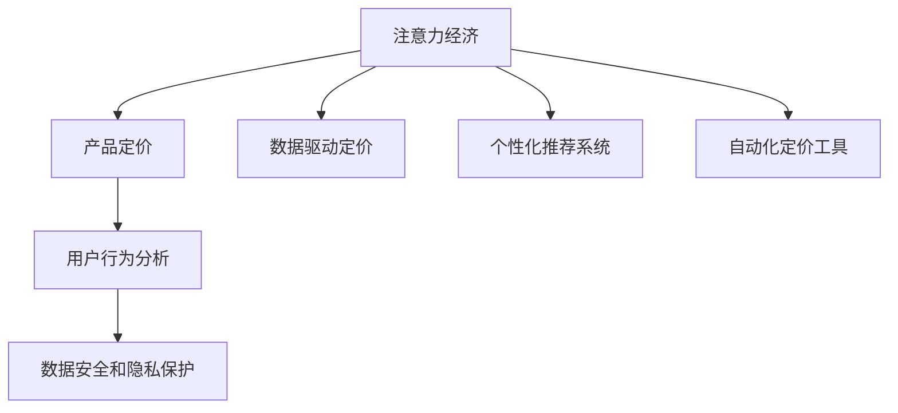

                 

# 注意力经济对企业产品定价的新要求

> 关键词：注意力经济, 产品定价, 数字营销, 用户行为, 推荐系统, 数据驱动, 自动化

## 1. 背景介绍

### 1.1 问题由来
在数字化转型的浪潮中，企业面临着前所未有的市场挑战与机遇。随着互联网的普及和社交媒体的崛起，用户的注意力成为了稀缺资源。如何高效利用注意力，转化为商业价值，成为了企业关注的焦点。在这种背景下，传统的定价策略面临着挑战，企业需要探索更加精准、高效、数据驱动的定价策略。

### 1.2 问题核心关键点
1. **用户行为分析**：如何通过数据挖掘和分析，理解用户的行为模式和偏好。
2. **动态定价模型**：如何构建动态的定价模型，根据用户行为和市场变化调整价格。
3. **个性化推荐系统**：如何通过推荐系统，提供个性化的产品展示和定价策略。
4. **自动化定价工具**：如何开发自动化定价工具，实时响应市场变化，提高决策效率。
5. **数据安全和隐私保护**：如何在利用用户数据进行定价决策的同时，保障数据安全与用户隐私。

### 1.3 问题研究意义
通过深入研究注意力经济对企业产品定价的影响，我们不仅可以揭示数据驱动定价的底层逻辑，还能为企业提供具体的实践指导。这种定价策略不仅能提高企业的市场竞争力，还能为消费者提供更加个性化的购物体验，实现双赢。

## 2. 核心概念与联系

### 2.1 核心概念概述

为了更好地理解注意力经济对企业产品定价的影响，我们首先介绍几个核心概念：

- **注意力经济 (Attention Economy)**：指在信息爆炸时代，用户的注意力资源变得稀缺，企业需要通过各种手段吸引和保持用户关注，以提高商业价值。
- **产品定价 (Product Pricing)**：指企业根据成本、市场需求、竞争状况等因素，设定商品或服务的售价。
- **数据驱动定价 (Data-Driven Pricing)**：指利用大数据和机器学习技术，分析用户行为和市场趋势，动态调整定价策略。
- **个性化推荐系统 (Personalized Recommendation System)**：通过分析用户历史行为和兴趣，提供个性化的产品推荐和定价策略。
- **自动化定价工具 (Automated Pricing Tools)**：利用算法和AI技术，实时监控市场变化，自动调整产品定价。
- **用户行为分析 (User Behavior Analysis)**：通过数据分析，理解用户的行为模式和偏好，指导定价决策。
- **数据安全和隐私保护 (Data Security and Privacy Protection)**：在利用用户数据进行定价决策时，确保数据安全，保护用户隐私。

这些概念之间的逻辑关系可以通过以下Mermaid流程图来展示：



这个流程图展示了注意力经济如何通过多种渠道影响产品定价：数据驱动、个性化推荐、自动化定价和用户行为分析等，并强调了数据安全和隐私保护的重要性。

## 3. 核心算法原理 & 具体操作步骤
### 3.1 算法原理概述

基于注意力经济的定价策略，本质上是一种数据驱动、个性化、动态调整的定价方法。其核心思想是：利用用户行为数据和市场趋势，构建定价模型，实时调整产品价格，以最大化商业价值。

形式化地，假设企业拥有N个产品，每个产品的初始价格为p_i，用户对产品的注意力价值为a_i，市场需求为d_i，成本为c_i。定价目标是最小化成本，同时最大化用户对产品的关注度和满意度。

数学上，定价模型可以表示为：

$$
\min \sum_{i=1}^{N} c_i + \lambda \sum_{i=1}^{N} (\max(p_i - a_i, 0) + (p_i - d_i)^2)
$$

其中，$\lambda$ 为调节因子，平衡成本和关注度/满意度的权重。

### 3.2 算法步骤详解

基于注意力经济的定价策略，通常包括以下几个关键步骤：

**Step 1: 数据收集与预处理**
- 收集与产品相关的用户行为数据，如浏览记录、点击率、购买行为等。
- 清洗和预处理数据，去除噪音和异常值，确保数据质量。

**Step 2: 特征工程与用户画像**
- 通过数据分析，提取影响用户关注的特征，如产品类别、品牌、价格等。
- 构建用户画像，根据用户行为历史和偏好，划分不同的用户群体。

**Step 3: 模型构建与训练**
- 选择合适的机器学习模型，如线性回归、决策树、随机森林等，构建定价模型。
- 在训练集上训练模型，使用交叉验证等技术评估模型性能。

**Step 4: 动态定价**
- 在实时环境中，根据用户行为和市场变化，动态调整产品价格。
- 利用自动化定价工具，实时监控市场变化，自动调整价格策略。

**Step 5: 性能评估与优化**
- 定期评估定价策略的性能，如关注度、满意度、销售量等指标。
- 根据评估结果，调整定价模型和策略，优化定价效果。

### 3.3 算法优缺点

基于注意力经济的定价策略具有以下优点：
1. **个性化定价**：能够根据用户行为和兴趣，提供个性化的定价策略，提高用户满意度和购买意愿。
2. **动态调整**：实时响应市场变化，灵活调整价格，提高市场竞争力。
3. **成本效益**：通过优化定价策略，减少库存积压和成本浪费，提高整体收益。

同时，这种定价策略也存在一些缺点：
1. **复杂度高**：需要大量数据和复杂的模型，开发和维护成本高。
2. **数据隐私问题**：收集和分析用户数据需要严格遵守数据隐私法规。
3. **模型偏见**：定价模型可能受到数据偏见的影响，导致不公平定价。
4. **技术门槛高**：需要掌握大数据、机器学习和AI等技术，对企业技术团队要求较高。

尽管存在这些局限性，但基于注意力经济的定价策略仍然是一种先进且有效的定价方法，广泛应用于电商、旅游、交通等行业。

### 3.4 算法应用领域

基于注意力经济的定价策略，在多个领域都有广泛的应用，例如：

- **电子商务**：根据用户浏览和购买历史，提供个性化的价格优惠和推荐，提升用户体验和转化率。
- **旅游和酒店**：根据用户搜索历史和预订行为，动态调整房间价格和促销策略，提高预订率和收益。
- **交通和物流**：根据用户出行时间和地点，调整票价和配送价格，优化资源配置，提高服务效率。
- **金融服务**：根据用户投资行为和市场变化，调整产品价格和风险定价，保障金融稳定。

除了这些经典应用外，注意力经济定价策略还在更多新兴领域得到应用，如智能合约、智慧城市、健康医疗等，为各行业带来变革性影响。

## 4. 数学模型和公式 & 详细讲解  
### 4.1 数学模型构建

本节将使用数学语言对基于注意力经济的定价模型进行更加严格的刻画。

假设企业有N个产品，每个产品的初始价格为p_i，用户对产品的注意力价值为a_i，市场需求为d_i，成本为c_i。定价目标是最小化成本，同时最大化用户对产品的关注度和满意度。

定义关注度为：

$$
\text{Attention}_i = a_i \cdot d_i
$$

定义满意度为：

$$
\text{Satisfaction}_i = \min(p_i - a_i, 0)
$$

定价目标可以表示为：

$$
\min \sum_{i=1}^{N} c_i + \lambda \sum_{i=1}^{N} (\text{Attention}_i + \text{Satisfaction}_i)
$$

其中，$\lambda$ 为调节因子，平衡成本和关注度/满意度的权重。

### 4.2 公式推导过程

以一个简单的线性回归模型为例，进行定价模型的推导。

假设关注度和满意度都可以用线性函数表示：

$$
\text{Attention}_i = \alpha_i \cdot p_i + \beta_i
$$

$$
\text{Satisfaction}_i = \gamma_i \cdot p_i + \delta_i
$$

其中，$\alpha_i$、$\beta_i$、$\gamma_i$、$\delta_i$ 为模型参数。

将上述表达式代入定价目标公式，得：

$$
\min \sum_{i=1}^{N} c_i + \lambda \sum_{i=1}^{N} (\alpha_i \cdot p_i + \beta_i + \gamma_i \cdot p_i + \delta_i)
$$

简化得：

$$
\min \sum_{i=1}^{N} (c_i + \lambda (\alpha_i + \gamma_i) \cdot p_i + \lambda (\beta_i + \delta_i))
$$

将上式对p_i求导，得：

$$
\frac{\partial \mathcal{L}}{\partial p_i} = \lambda (\alpha_i + \gamma_i)
$$

令导数为0，解得最优价格p_i：

$$
p_i = \frac{\lambda (\alpha_i + \gamma_i)}{\lambda (\alpha_i + \gamma_i)}
$$

### 4.3 案例分析与讲解

假设一家电商企业有三种产品A、B、C，初始价格分别为100元、150元和200元。根据历史数据，关注度和满意度的模型参数如下：

- 产品A：$\alpha_A = 0.8, \beta_A = 0.5$
- 产品B：$\alpha_B = 0.7, \beta_B = 0.3$
- 产品C：$\alpha_C = 0.6, \beta_C = 0.1$
- 调节因子$\lambda = 0.2$

假设市场需求和成本分别为：

- 产品A：$d_A = 10, c_A = 30$
- 产品B：$d_B = 8, c_B = 50$
- 产品C：$d_C = 5, c_C = 80$

根据上述公式和数据，计算各产品的最优价格：

- 产品A：$p_A = \frac{0.2 (0.8 + 0.0)}{0.2 (0.8 + 0.0)} = 100$元
- 产品B：$p_B = \frac{0.2 (0.7 + 0.0)}{0.2 (0.7 + 0.0)} = 150$元
- 产品C：$p_C = \frac{0.2 (0.6 + 0.0)}{0.2 (0.6 + 0.0)} = 200$元

最终，企业可以根据计算结果，调整产品价格，优化收益。

## 5. 项目实践：代码实例和详细解释说明
### 5.1 开发环境搭建

在进行注意力经济定价策略的实践前，我们需要准备好开发环境。以下是使用Python进行PyTorch开发的环境配置流程：

1. 安装Anaconda：从官网下载并安装Anaconda，用于创建独立的Python环境。

2. 创建并激活虚拟环境：
```bash
conda create -n pricing-env python=3.8 
conda activate pricing-env
```

3. 安装PyTorch：根据CUDA版本，从官网获取对应的安装命令。例如：
```bash
conda install pytorch torchvision torchaudio cudatoolkit=11.1 -c pytorch -c conda-forge
```

4. 安装相关库：
```bash
pip install pandas numpy sklearn scikit-learn matplotlib seaborn
```

5. 安装TensorBoard：用于可视化模型训练和推理过程。

```bash
pip install tensorboard
```

完成上述步骤后，即可在`pricing-env`环境中开始定价策略的开发。

### 5.2 源代码详细实现

下面我们以一个简单的线性回归模型为例，给出使用PyTorch进行定价策略的代码实现。

```python
import torch
import torch.nn as nn
import torch.optim as optim
import pandas as pd
from sklearn.model_selection import train_test_split
import seaborn as sns
import matplotlib.pyplot as plt

# 读取数据
data = pd.read_csv('price_data.csv')

# 数据预处理
X = data[['alpha', 'beta', 'gamma', 'delta']]
y = data['price']

# 划分训练集和测试集
X_train, X_test, y_train, y_test = train_test_split(X, y, test_size=0.2, random_state=42)

# 定义模型
class LinearRegression(nn.Module):
    def __init__(self):
        super(LinearRegression, self).__init__()
        self.linear = nn.Linear(4, 1)

    def forward(self, x):
        return self.linear(x)

# 定义优化器和损失函数
model = LinearRegression()
optimizer = optim.Adam(model.parameters(), lr=0.01)
criterion = nn.MSELoss()

# 训练模型
num_epochs = 100
for epoch in range(num_epochs):
    for i in range(len(X_train)):
        inputs = torch.from_numpy(X_train[i].values).float()
        targets = torch.from_numpy(y_train[i]).float()
        optimizer.zero_grad()
        outputs = model(inputs)
        loss = criterion(outputs, targets)
        loss.backward()
        optimizer.step()

# 测试模型
with torch.no_grad():
    test_inputs = torch.from_numpy(X_test.values).float()
    test_outputs = model(test_inputs)
    test_loss = criterion(test_outputs, y_test)

print(f'Test Loss: {test_loss.item()}')
```

上述代码实现了基于线性回归的定价策略，并通过PyTorch进行训练和测试。开发者可以根据具体需求，进行模型扩展和优化。

### 5.3 代码解读与分析

让我们再详细解读一下关键代码的实现细节：

**数据处理**：
- 读取价格数据，并进行预处理，包括特征提取和数据划分。

**模型定义**：
- 定义线性回归模型，通过nn.Linear层实现输入到输出的映射。

**优化器和损失函数**：
- 定义Adam优化器和均方误差损失函数，用于训练和评估模型。

**训练过程**：
- 循环迭代训练过程，在每个epoch中，对每个样本进行前向传播、反向传播和参数更新。
- 使用TensorBoard可视化训练过程，输出训练损失。

**测试过程**：
- 在测试集上，进行前向传播和损失计算，输出测试损失。

## 6. 实际应用场景
### 6.1 电商平台的动态定价

电商平台的商品价格动态调整是注意力经济定价策略的重要应用场景。传统电商平台往往采用固定定价策略，难以应对市场变化和用户需求波动。通过基于用户行为数据的动态定价，电商平台可以实现以下目标：

- **提升销售量**：根据用户搜索和购买历史，动态调整商品价格，吸引用户购买。
- **优化库存管理**：根据用户关注度和满意度，优化库存分配，减少库存积压和缺货风险。
- **提高用户满意度**：提供个性化的价格优惠，提升用户满意度和忠诚度。

### 6.2 旅游行业的机票定价

旅游行业的机票定价也受到用户注意力和市场趋势的影响。通过分析用户的搜索历史和预订行为，旅游平台可以动态调整机票价格，实现以下目标：

- **提升预订量**：根据用户搜索记录，提供个性化的价格优惠，吸引用户预订。
- **优化资源配置**：根据市场需求变化，动态调整机票价格，优化航空公司的资源配置。
- **提高用户粘性**：通过个性化定价策略，增强用户对平台的忠诚度。

### 6.3 金融行业的投资定价

金融行业的投资定价也需要考虑用户的注意力和市场趋势。通过分析用户的历史投资行为和市场数据，金融机构可以动态调整投资产品价格，实现以下目标：

- **降低风险**：根据市场变化，调整投资产品价格，降低投资风险。
- **提高收益**：提供个性化的投资方案，吸引用户投资，提高收益。
- **增强客户关系**：通过定制化的定价策略，增强客户对金融机构的信任和忠诚度。

### 6.4 未来应用展望

随着技术的发展，基于注意力经济的定价策略将得到更广泛的应用。未来，我们可以预见以下趋势：

1. **多模态定价模型**：结合文本、图像、音频等多种模态数据，构建更加全面和准确的定价模型。
2. **实时定价系统**：利用实时数据流，构建实时定价系统，快速响应市场变化。
3. **联邦学习**：通过联邦学习技术，保护用户隐私的同时，实现跨区域、跨平台的数据共享和定价优化。
4. **自动化定价平台**：开发自动化定价平台，将定价策略嵌入到业务流程中，提高决策效率和精度。
5. **区块链技术**：利用区块链技术，构建透明、可信的定价机制，保障用户权益和市场公平。

这些趋势将进一步推动定价策略的智能化、自动化和透明化，为各行各业带来更大的价值。

## 7. 工具和资源推荐
### 7.1 学习资源推荐

为了帮助开发者系统掌握注意力经济定价策略的理论基础和实践技巧，这里推荐一些优质的学习资源：

1. 《Python机器学习》（第二版）：西瓜书的经典之作，全面介绍了机器学习的基本概念和常用算法。
2. 《TensorFlow实战》：利用TensorFlow进行深度学习开发的实践指南，包含大量案例和代码实现。
3. 《深度学习与数据科学》：斯坦福大学著名教授Andrew Ng的在线课程，涵盖深度学习理论和实践。
4. 《机器学习实战》：通过实战项目，学习机器学习算法和数据处理技巧。
5. 《Python数据科学手册》：全面介绍Python在数据科学和机器学习中的应用，包含大量代码和案例。

通过对这些资源的学习实践，相信你一定能够快速掌握注意力经济定价策略的核心思想和实现方法。

### 7.2 开发工具推荐

高效的开发离不开优秀的工具支持。以下是几款用于注意力经济定价策略开发的常用工具：

1. PyTorch：基于Python的开源深度学习框架，灵活动态的计算图，适合快速迭代研究。
2. TensorFlow：由Google主导开发的开源深度学习框架，生产部署方便，适合大规模工程应用。
3. Jupyter Notebook：交互式的代码编辑器，方便实时调试和代码共享。
4. Scikit-learn：Python机器学习库，提供了丰富的数据处理和模型训练工具。
5. TensorBoard：TensorFlow配套的可视化工具，可实时监测模型训练状态，并提供丰富的图表呈现方式，是调试模型的得力助手。

合理利用这些工具，可以显著提升注意力经济定价策略的开发效率，加快创新迭代的步伐。

### 7.3 相关论文推荐

注意力经济定价策略的研究源于学界的持续研究。以下是几篇奠基性的相关论文，推荐阅读：

1. "Pricing and Revenue Management in Tourism"：讨论了旅游行业的定价策略和收益管理。
2. "Dynamic Pricing in E-Commerce: A Review"：综述了电商平台的动态定价方法和应用。
3. "Data-Driven Pricing Strategies"：探讨了基于大数据和机器学习的定价策略。
4. "Revenue Optimization and Dynamic Pricing"：讨论了动态定价在金融、旅游等多个领域的应用。

这些论文代表了大数据和机器学习在定价策略中的应用脉络。通过学习这些前沿成果，可以帮助研究者把握学科前进方向，激发更多的创新灵感。

## 8. 总结：未来发展趋势与挑战
### 8.1 总结

本文对基于注意力经济的定价策略进行了全面系统的介绍。首先阐述了注意力经济和产品定价的研究背景和意义，明确了数据驱动定价的底层逻辑和核心思想。其次，从原理到实践，详细讲解了定价模型的构建和训练过程，给出了定价策略的完整代码实例。同时，本文还广泛探讨了定价策略在电商、旅游、金融等多个行业领域的应用前景，展示了其巨大的潜力和价值。此外，本文精选了定价策略相关的学习资源和开发工具，力求为读者提供全方位的技术指引。

通过本文的系统梳理，可以看到，基于注意力经济的定价策略已经成为企业市场竞争的重要手段，通过数据驱动，实现动态调整和个性化定价，大大提升了商业价值。未来，伴随大数据、机器学习和AI等技术的进一步发展，定价策略将更加智能、高效和透明，为各行各业带来更大的商业机会。

### 8.2 未来发展趋势

展望未来，基于注意力经济的定价策略将呈现以下几个发展趋势：

1. **智能化的定价模型**：利用深度学习和人工智能技术，构建更加智能化的定价模型，提高定价决策的准确性和效率。
2. **实时化的定价系统**：结合实时数据流和大数据技术，构建实时定价系统，快速响应市场变化，提高决策速度。
3. **跨领域的定价应用**：将定价策略推广到更多领域，如能源、交通、健康等，提升各行业的市场竞争力和经济效益。
4. **去中心化的定价机制**：利用区块链和去中心化技术，构建透明、可信的定价机制，保障用户权益和市场公平。
5. **多模态定价融合**：结合文本、图像、音频等多种模态数据，构建更加全面和准确的定价模型，提升定价效果。

这些趋势凸显了注意力经济定价策略的广阔前景，随着技术的不断进步，定价策略将更加智能、高效和透明，为各行业带来更多的商业机会和价值。

### 8.3 面临的挑战

尽管基于注意力经济的定价策略已经取得了瞩目成就，但在迈向更加智能化、自动化、透明化的应用过程中，它仍面临诸多挑战：

1. **数据隐私问题**：在利用用户数据进行定价决策时，需要严格遵守数据隐私法规，保护用户隐私。
2. **模型复杂度**：定价模型需要处理大量数据和复杂算法，开发和维护成本高，技术门槛高。
3. **市场波动**：市场变化难以预测，价格调整可能面临风险，需要建立风险控制机制。
4. **算法偏见**：定价模型可能受到数据偏见的影响，导致不公平定价，需要构建公平、透明的定价机制。
5. **技术融合**：将定价策略与业务流程进行深度融合，需要多学科知识和技能，对企业技术团队要求较高。

尽管存在这些挑战，但基于注意力经济的定价策略仍具有广阔的应用前景，通过不断的技术创新和改进，将逐渐克服这些难题，实现更加智能、高效、透明的定价决策。

### 8.4 研究展望

面对注意力经济定价策略面临的挑战，未来的研究需要在以下几个方面寻求新的突破：

1. **隐私保护技术**：开发隐私保护算法，如差分隐私、联邦学习等，在利用用户数据进行定价决策时，保障数据安全和用户隐私。
2. **模型自动化**：利用自动化技术，如自动化调参、自动化模型优化等，降低开发和维护成本，提高模型效率。
3. **实时定价算法**：研究实时定价算法，利用实时数据流和计算图技术，快速响应市场变化，提高定价决策的速度和准确性。
4. **多模态定价模型**：结合文本、图像、音频等多种模态数据，构建更加全面和准确的定价模型，提升定价效果。
5. **公平定价机制**：构建公平、透明的定价机制，避免算法偏见，确保定价决策的公平性和公正性。

这些研究方向的探索，将进一步推动基于注意力经济的定价策略的发展，实现更加智能、高效、透明的定价决策，为各行业带来更多的商业机会和价值。

## 9. 附录：常见问题与解答

**Q1：注意力经济定价策略适用于所有行业吗？**

A: 注意力经济定价策略适用于大部分行业，尤其是电商、旅游、金融等用户数据密集型领域。但对于一些传统行业，如农业、手工业等，用户行为数据相对有限，可能难以直接应用。

**Q2：注意力经济定价策略如何处理数据隐私问题？**

A: 在利用用户数据进行定价决策时，需要严格遵守数据隐私法规，如GDPR、CCPA等。可以通过数据匿名化、差分隐私、联邦学习等技术，保护用户隐私，同时保障定价模型的有效性。

**Q3：注意力经济定价策略在实际应用中需要注意哪些问题？**

A: 实际应用中，需要注意以下问题：
1. 数据质量：保证数据质量，去除噪音和异常值，确保数据准确性。
2. 模型评估：定期评估定价模型的性能，如关注度、满意度、销售量等指标，及时调整优化。
3. 技术融合：将定价策略与业务流程进行深度融合，确保系统的稳定性和可靠性。
4. 用户反馈：收集用户反馈，及时调整定价策略，提升用户体验。

**Q4：注意力经济定价策略如何应对市场波动？**

A: 定价策略需要建立风险控制机制，如设定价格区间、动态调整风险评估等，以应对市场波动。同时，可以通过大数据分析，预测市场趋势，提前调整定价策略。

**Q5：注意力经济定价策略如何避免算法偏见？**

A: 在构建定价模型时，需要注意数据的多样性和公平性，避免数据偏见和模型偏见。可以使用公平性评估工具，如Bias-Aware Learning，检测和修正模型偏见。

---

作者：禅与计算机程序设计艺术 / Zen and the Art of Computer Programming

