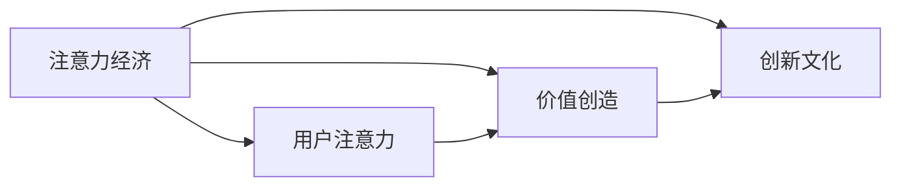

                 

# 注意力经济对企业创新文化的塑造

## 1. 背景介绍

在数字经济时代，“注意力”成为了一种稀缺资源，企业如何吸引和利用用户的注意力，成为了竞争的关键。基于这一背景，“注意力经济”（Economy of Attention）的概念应运而生，其核心在于通过吸引和有效利用用户的注意力，实现商业价值和创新价值的最大化。本文将探讨注意力经济对企业创新文化的塑造作用，分析其对企业创新战略、组织结构和文化价值观的影响，并提出相应的策略建议。

## 2. 核心概念与联系

### 2.1 核心概念概述

- **注意力经济**：指通过吸引和有效利用用户的注意力，创造经济价值的过程。在数字时代，注意力成为吸引消费者、增加市场份额的关键因素。
- **创新文化**：指企业内部形成的推崇创新、鼓励尝试的企业氛围和价值观。创新文化有助于企业快速适应市场变化，保持竞争力。
- **用户注意力**：指用户在接受信息或服务时，所投入的心理和物理资源，包括时间、精力、认知资源等。
- **价值创造**：指通过特定的产品、服务或内容，满足用户需求，创造经济价值和社会价值。

### 2.2 核心概念原理和架构的 Mermaid 流程图(Mermaid 流程节点中不要有括号、逗号等特殊字符)



### 2.3 注意力经济对创新文化的影响

注意力经济对企业创新文化的塑造主要体现在以下几个方面：

1. **驱动创新动力**：在注意力经济模式下，企业必须不断创新以满足用户不断变化的需求，从而驱动企业内部的创新动力。
2. **激励员工创造性**：吸引和利用用户注意力的需求，使得企业更加重视员工的创造力和创新能力。
3. **促进跨部门合作**：在注意力经济环境下，不同部门需要协同工作，共同吸引和保持用户注意力，从而促进跨部门合作。
4. **提升品牌价值**：良好的用户注意力管理有助于提升品牌价值，进而增强企业的创新能力。

## 3. 核心算法原理 & 具体操作步骤

### 3.1 算法原理概述

注意力经济下的创新文化塑造，主要依赖于以下几个核心算法和原理：

1. **用户注意力吸引算法**：通过算法分析用户行为数据，识别和预测用户兴趣点，设计有吸引力的内容和服务。
2. **用户行为分析算法**：利用机器学习模型分析用户互动数据，了解用户偏好和行为模式。
3. **内容个性化推荐算法**：基于用户行为数据，推荐个性化的内容，提升用户满意度和粘性。
4. **价值创造模型**：通过用户数据和行为分析，构建价值创造模型，指导产品和服务的设计和优化。

### 3.2 算法步骤详解

1. **数据采集与处理**：通过各种渠道收集用户行为数据，包括点击、浏览、购买、社交媒体互动等。
2. **用户兴趣建模**：利用聚类、分类等算法，建立用户兴趣模型，识别出不同的用户群体。
3. **内容与推荐优化**：根据用户兴趣模型，优化内容和推荐策略，提升用户满意度。
4. **效果评估与迭代**：定期评估用户互动数据，调整算法参数和策略，不断优化用户注意力管理和价值创造。

### 3.3 算法优缺点

**优点**：
- 能够精确预测用户需求，提升内容和服务的相关性和吸引力。
- 通过个性化推荐，提升用户满意度和粘性，增加用户忠诚度。
- 能够快速响应用户需求变化，保持竞争力。

**缺点**：
- 需要大量用户数据，数据隐私和安全性问题值得关注。
- 算法模型的准确性和公平性可能存在挑战，需要不断优化。
- 过度依赖算法，可能导致过度个性化，忽略用户多样性需求。

### 3.4 算法应用领域

注意力经济对企业创新文化的塑造主要应用在以下几个领域：

1. **社交媒体平台**：通过个性化推荐和内容创意，提升用户互动和留存率。
2. **电子商务**：通过用户行为分析，优化商品推荐和定价策略，提升转化率和销售额。
3. **在线教育和培训**：通过用户注意力分析，设计有吸引力的课程内容和推荐策略，提升用户参与度和学习效果。
4. **数字广告和营销**：通过用户行为分析，优化广告投放策略，提高广告效果和ROI。
5. **内容创作平台**：通过用户注意力分析，引导和激励创作者产出有价值的内容。

## 4. 数学模型和公式 & 详细讲解 & 举例说明

### 4.1 数学模型构建

假设用户的行为数据为 $X = (x_1, x_2, ..., x_n)$，其中 $x_i$ 表示第 $i$ 个用户的互动数据。

用户兴趣模型 $I = (i_1, i_2, ..., i_k)$，其中 $i_j$ 表示第 $j$ 个兴趣标签。

内容推荐算法 $C = (c_1, c_2, ..., c_m)$，其中 $c_i$ 表示第 $i$ 个推荐内容。

价值创造模型 $V = (v_1, v_2, ..., v_n)$，其中 $v_i$ 表示第 $i$ 个用户创造的价值。

### 4.2 公式推导过程

用户兴趣模型可以通过聚类算法建立，如K-means算法。内容推荐算法可以通过协同过滤算法或深度学习模型实现，如基于矩阵分解的推荐算法或自编码器等。价值创造模型可以通过回归分析或决策树模型建立，如线性回归或随机森林等。

### 4.3 案例分析与讲解

以电子商务平台为例，用户点击和购买行为数据 $X = (x_1, x_2, ..., x_n)$ 被用于建立用户兴趣模型 $I = (i_1, i_2, ..., i_k)$。通过协同过滤算法，内容推荐算法 $C = (c_1, c_2, ..., c_m)$ 被用于优化商品推荐。最后，价值创造模型 $V = (v_1, v_2, ..., v_n)$ 被用于评估推荐效果和优化推荐策略。

## 5. 项目实践：代码实例和详细解释说明

### 5.1 开发环境搭建

假设我们使用Python和TensorFlow进行开发。以下是一个简单的开发环境搭建步骤：

1. 安装Python和TensorFlow。
2. 收集和处理用户数据。
3. 使用K-means算法建立用户兴趣模型。
4. 使用协同过滤算法进行内容推荐。
5. 使用线性回归模型评估用户价值。

### 5.2 源代码详细实现

```python
import tensorflow as tf
from sklearn.cluster import KMeans
from scipy.sparse import coo_matrix

# 数据处理
def process_data(data):
    # 处理数据，提取用户行为特征
    # ...

# 用户兴趣建模
def user_interest_modeling(data, num_clusters=5):
    kmeans = KMeans(n_clusters=num_clusters)
    labels = kmeans.fit_predict(data)
    return labels

# 内容推荐
def content_recommendation(data, labels):
    # 使用协同过滤算法，推荐内容
    # ...

# 价值评估
def value_creation(data, labels):
    model = tf.keras.Sequential([
        tf.keras.layers.Dense(64, activation='relu'),
        tf.keras.layers.Dense(1)
    ])
    model.compile(optimizer='adam', loss='mse')
    model.fit(data, labels, epochs=10, validation_split=0.2)
    return model.predict(data)

# 主函数
def main():
    # 数据处理
    data = process_data()

    # 用户兴趣建模
    labels = user_interest_modeling(data)

    # 内容推荐
    recommendations = content_recommendation(data, labels)

    # 价值评估
    values = value_creation(data, labels)

    # 结果展示
    print("User Interest Labels:", labels)
    print("Content Recommendations:", recommendations)
    print("User Values:", values)

if __name__ == "__main__":
    main()
```

### 5.3 代码解读与分析

在上述代码中，我们首先通过 `process_data` 函数处理原始数据，提取用户行为特征。然后，使用 `user_interest_modeling` 函数通过K-means算法建立用户兴趣模型。接下来，使用 `content_recommendation` 函数进行内容推荐，最后使用 `value_creation` 函数评估用户价值。

## 6. 实际应用场景

### 6.1 社交媒体平台

社交媒体平台可以通过个性化推荐和内容创意，提升用户互动和留存率。例如，Instagram通过分析用户的互动数据，生成个性化的内容推荐，吸引用户更多互动和分享。

### 6.2 电子商务

电子商务平台通过用户行为分析，优化商品推荐和定价策略，提升转化率和销售额。例如，亚马逊使用协同过滤算法进行商品推荐，提升用户购买转化率。

### 6.3 在线教育和培训

在线教育和培训平台通过用户注意力分析，设计有吸引力的课程内容和推荐策略，提升用户参与度和学习效果。例如，Coursera使用推荐算法为用户推荐个性化课程，提升用户学习效果。

### 6.4 数字广告和营销

数字广告和营销通过用户行为分析，优化广告投放策略，提高广告效果和ROI。例如，谷歌广告使用用户行为数据优化广告投放策略，提升广告点击率和转化率。

### 6.5 内容创作平台

内容创作平台通过用户注意力分析，引导和激励创作者产出有价值的内容。例如，YouTube使用推荐算法为创作者推荐观众，提升创作者收益和内容质量。

## 7. 工具和资源推荐

### 7.1 学习资源推荐

1. 《数据科学与人工智能》系列书籍：提供全面的数据科学和人工智能知识体系，包括数据挖掘、机器学习、深度学习等。
2. Kaggle：提供丰富的数据集和竞赛，帮助学习者实践和提升数据科学技能。
3. TensorFlow官方文档：提供详细的TensorFlow教程和API文档，帮助开发者快速上手。

### 7.2 开发工具推荐

1. Jupyter Notebook：提供交互式编程环境，方便开发者进行数据处理和模型开发。
2. GitHub：提供代码托管和版本控制，方便团队协作和代码共享。
3. Docker：提供容器化部署，方便模型在不同环境中的快速部署和测试。

### 7.3 相关论文推荐

1. "Economy of Attention: Concepts and Case Studies in the Digital Age" - Liang-Chih Fu, Chih-Chun Chang, Bo-Lun Ho
2. "Attention is All You Need: Transformer Models for Practical Applications" - Vaswani et al.
3. "E-commerce Platforms and Supply Chain Technologies for Attention-Based Marketing" - Jianxiong Hao, Kangjie Lu, Zhongshu Shi

## 8. 总结：未来发展趋势与挑战

### 8.1 研究成果总结

注意力经济对企业创新文化的塑造，已经取得了显著的成果。通过用户注意力分析，提升内容相关性和吸引力，优化推荐策略，增强用户满意度和忠诚度，从而驱动企业创新动力，激励员工创造性，促进跨部门合作，提升品牌价值。

### 8.2 未来发展趋势

1. **技术革新**：随着深度学习、自然语言处理等技术的不断进步，注意力经济的技术手段将更加先进，能够提供更精准的用户行为分析和内容推荐。
2. **跨平台集成**：不同平台和渠道的用户数据将更加充分整合，提升用户全场景互动体验。
3. **个性化推荐优化**：个性化推荐算法将不断优化，提升推荐精度和公平性。
4. **数据隐私保护**：数据隐私和安全问题将受到更多关注，隐私保护技术将进一步发展。

### 8.3 面临的挑战

1. **数据隐私和安全**：如何保护用户隐私和数据安全，是一个重要挑战。
2. **算法公平性**：如何保证推荐算法的公平性和无偏见，避免数据歧视。
3. **过度个性化**：过度个性化可能导致用户多样性需求被忽略，需要找到平衡点。
4. **跨平台协同**：不同平台的用户数据协同问题复杂，需要高效的跨平台数据整合和优化。

### 8.4 研究展望

未来的研究将更多关注以下几个方向：

1. **算法优化**：如何通过优化算法提升推荐精度和公平性，减少数据偏差。
2. **隐私保护**：如何保护用户隐私和数据安全，增强用户信任。
3. **跨平台集成**：如何实现不同平台和渠道的用户数据充分整合和协同。
4. **技术融合**：如何将注意力经济与区块链、人工智能等技术进行深度融合，提升技术能力。

## 9. 附录：常见问题与解答

**Q1: 注意力经济和传统经济的区别是什么？**

A: 注意力经济和传统经济最大的区别在于资源的价值创造方式。在传统经济中，资源的价值创造主要依赖于物质产品和服务的生产和交换。而在注意力经济中，资源的价值创造主要依赖于对用户注意力的吸引和利用。

**Q2: 注意力经济如何影响企业创新文化？**

A: 注意力经济通过吸引和利用用户注意力，推动企业不断创新以满足用户需求，驱动企业内部的创新动力。同时，它也激励员工发挥创造力和创新能力，促进跨部门合作，提升品牌价值。

**Q3: 如何在保护用户隐私的前提下，利用用户注意力数据进行创新？**

A: 保护用户隐私是注意力经济中一个重要挑战。企业可以通过匿名化处理用户数据、使用差分隐私技术、限制数据使用范围等手段，保护用户隐私。同时，也可以通过用户行为分析、预测建模等方式，在不泄露个人隐私的前提下，提升创新效果。

**Q4: 注意力经济如何帮助企业实现价值创造？**

A: 通过吸引和利用用户注意力，注意力经济能够提升用户满意度和忠诚度，增加用户粘性，从而实现价值创造。同时，通过个性化推荐和内容优化，提升产品和服务的相关性和吸引力，进一步增加用户转化率和价值创造。

---

作者：禅与计算机程序设计艺术 / Zen and the Art of Computer Programming

